# Business Architecture - eShop Orders Management

**Generated**: 2026-02-17T00:00:00Z
**Framework**: TOGAF 10 Business Architecture
**Quality Level**: standard
**Components Found**: 19
**Average Confidence**: 0.86
**Repository**: Evilazaro/Azure-LogicApps-Monitoring

---

## 1. Executive Summary

This document captures the **Business Architecture** of the eShop Orders Management system — a cloud-native, distributed application built on .NET Aspire and Azure services. The system implements an order lifecycle management capability spanning order placement, validation, persistence, asynchronous messaging, workflow orchestration, and observability.

### Component Summary

| Component Type            | Count  | Avg Confidence |
| ------------------------- | ------ | -------------- |
| Business Strategy         | 1      | 0.75           |
| Business Capabilities     | 3      | 0.88           |
| Value Streams             | 1      | 0.90           |
| Business Processes        | 4      | 0.92           |
| Business Services         | 3      | 0.90           |
| Business Functions        | 2      | 0.82           |
| Business Roles & Actors   | 3      | 0.80           |
| Business Rules            | 4      | 0.88           |
| Business Events           | 3      | 0.90           |
| Business Objects/Entities | 3      | 0.92           |
| KPIs & Metrics            | 4      | 0.85           |
| **Total**                 | **31** |                |

### Key Findings

- The system is centered on a **single bounded context**: Order Management.
- Business logic is cleanly separated in a dedicated `OrderService` class with validation, persistence, and messaging orchestration.
- Asynchronous event-driven processing is achieved through Azure Service Bus topics and Azure Logic Apps workflows.
- Comprehensive observability is built into every business operation via OpenTelemetry distributed tracing and custom metrics.
- The architecture follows a layered pattern: API Controller → Business Service → Repository + Message Handler.

---

## 2. Architecture Landscape

### 2.1 Business Strategy (1)

| Name                            | Description                                                                                                                      | Source                                                              | Confidence |
| ------------------------------- | -------------------------------------------------------------------------------------------------------------------------------- | ------------------------------------------------------------------- | ---------- |
| eShop Digital Commerce Strategy | Cloud-native e-commerce order management with event-driven architecture, Azure-first deployment, and full observability coverage | [AppHost.cs](app.AppHost/AppHost.cs#L1-L10), [README.md](README.md) | 0.75       |

### 2.2 Business Capabilities (3)

| Name                          | Description                                                                               | Source                                                                                                                            | Confidence | Maturity |
| ----------------------------- | ----------------------------------------------------------------------------------------- | --------------------------------------------------------------------------------------------------------------------------------- | ---------- | -------- |
| Order Management              | End-to-end order lifecycle including placement, retrieval, deletion, and batch operations | [OrderService.cs](src/eShop.Orders.API/Services/OrderService.cs#L19-L21)                                                          | 0.92       | Defined  |
| Order Messaging & Integration | Asynchronous order event publishing to Service Bus topics for downstream processing       | [OrdersMessageHandler.cs](src/eShop.Orders.API/Handlers/OrdersMessageHandler.cs#L27-L30)                                          | 0.88       | Defined  |
| Order Workflow Orchestration  | Logic App-based workflow orchestration for order processing completion and error handling | [OrdersPlacedProcess/workflow.json](workflows/OrdersManagement/OrdersManagementLogicApp/OrdersPlacedProcess/workflow.json#L1-L10) | 0.85       | Initial  |

### 2.3 Value Streams (1)

| Name                 | Description                                                                                                                                                                    | Source                                                                                                                                                                                                        | Confidence |
| -------------------- | ------------------------------------------------------------------------------------------------------------------------------------------------------------------------------ | ------------------------------------------------------------------------------------------------------------------------------------------------------------------------------------------------------------- | ---------- |
| Order-to-Fulfillment | End-to-end value stream: Customer places order → Order validated → Persisted to DB → Event published to Service Bus → Logic App processes event → Blob storage records outcome | [OrderService.cs](src/eShop.Orders.API/Services/OrderService.cs#L84-L130), [OrdersPlacedProcess/workflow.json](workflows/OrdersManagement/OrdersManagementLogicApp/OrdersPlacedProcess/workflow.json#L1-L163) | 0.90       |

### 2.4 Business Processes (4)

| Name                                          | Description                                                                                                                            | Source                                                                                                                                             | Confidence |
| --------------------------------------------- | -------------------------------------------------------------------------------------------------------------------------------------- | -------------------------------------------------------------------------------------------------------------------------------------------------- | ---------- |
| Place Order                                   | Validates order, checks for duplicates, persists to database, publishes event to Service Bus, records metrics                          | [OrderService.cs](src/eShop.Orders.API/Services/OrderService.cs#L84-L155)                                                                          | 0.95       |
| Place Orders Batch                            | Parallel batch processing of multiple orders with semaphore-based concurrency control and scoped service resolution                    | [OrderService.cs](src/eShop.Orders.API/Services/OrderService.cs#L166-L272)                                                                         | 0.92       |
| Orders Placed Processing (Logic App)          | Service Bus trigger → validates content type → calls Orders API process endpoint → stores result in Blob storage (success/error paths) | [OrdersPlacedProcess/workflow.json](workflows/OrdersManagement/OrdersManagementLogicApp/OrdersPlacedProcess/workflow.json#L1-L163)                 | 0.90       |
| Orders Placed Complete Processing (Logic App) | Recurrence-triggered cleanup: lists processed order blobs → retrieves metadata → deletes completed blobs                               | [OrdersPlacedCompleteProcess/workflow.json](workflows/OrdersManagement/OrdersManagementLogicApp/OrdersPlacedCompleteProcess/workflow.json#L1-L105) | 0.88       |

### 2.5 Business Services (3)

| Name                            | Description                                                                                                                                                       | Source                                                                                    | Confidence |
| ------------------------------- | ----------------------------------------------------------------------------------------------------------------------------------------------------------------- | ----------------------------------------------------------------------------------------- | ---------- |
| Order Service                   | Core business service implementing `IOrderService`: PlaceOrder, PlaceOrdersBatch, GetOrders, GetOrderById, DeleteOrder, DeleteOrdersBatch, ListMessagesFromTopics | [OrderService.cs](src/eShop.Orders.API/Services/OrderService.cs#L19-L606)                 | 0.95       |
| Orders API Service (Web Client) | Typed HTTP client in the Blazor web app for communicating with the Orders API; implements PlaceOrder, PlaceOrdersBatch, GetOrders, GetOrderById, DeleteOrder      | [OrdersAPIService.cs](src/eShop.Web.App/Components/Services/OrdersAPIService.cs#L17-L100) | 0.88       |
| Orders Message Handler          | Publishes order events to Azure Service Bus topic `ordersplaced` with retry logic, distributed tracing propagation, and independent timeout handling              | [OrdersMessageHandler.cs](src/eShop.Orders.API/Handlers/OrdersMessageHandler.cs#L27-L200) | 0.90       |

### 2.6 Business Functions (2)

| Name                   | Description                                                                                                      | Source                                                                              | Confidence |
| ---------------------- | ---------------------------------------------------------------------------------------------------------------- | ----------------------------------------------------------------------------------- | ---------- |
| Order Data Persistence | EF Core-based repository providing CRUD operations with pagination, split queries, and duplicate key detection   | [OrderRepository.cs](src/eShop.Orders.API/Repositories/OrderRepository.cs#L57-L200) | 0.85       |
| Order Validation       | Static validation logic enforcing required fields (Id, CustomerId), positive totals, and non-empty product lists | [OrderService.cs](src/eShop.Orders.API/Services/OrderService.cs#L533-L558)          | 0.80       |

### 2.7 Business Roles & Actors (3)

| Name                      | Description                                                                                               | Source                                                                                                                               | Confidence |
| ------------------------- | --------------------------------------------------------------------------------------------------------- | ------------------------------------------------------------------------------------------------------------------------------------ | ---------- |
| Customer                  | External actor who places orders via the Web App; identified by `CustomerId`                              | [CommonTypes.cs](app.ServiceDefaults/CommonTypes.cs#L77-L80)                                                                         | 0.85       |
| Orders API (System)       | System actor exposing RESTful endpoints for order management operations                                   | [OrdersController.cs](src/eShop.Orders.API/Controllers/OrdersController.cs#L18-L20)                                                  | 0.82       |
| Logic App Workflow Engine | System actor that subscribes to Service Bus topics and orchestrates order processing/completion workflows | [OrdersPlacedProcess/workflow.json](workflows/OrdersManagement/OrdersManagementLogicApp/OrdersPlacedProcess/workflow.json#L142-L157) | 0.75       |

### 2.8 Business Rules (4)

| Name                   | Description                                                                     | Source                                                                                                                                    | Confidence |
| ---------------------- | ------------------------------------------------------------------------------- | ----------------------------------------------------------------------------------------------------------------------------------------- | ---------- |
| Order ID Required      | Every order must have a non-null, non-whitespace ID (1-100 characters)          | [OrderService.cs](src/eShop.Orders.API/Services/OrderService.cs#L537-L540), [CommonTypes.cs](app.ServiceDefaults/CommonTypes.cs#L72-L75)  | 0.92       |
| Customer ID Required   | Every order must have a non-null, non-whitespace Customer ID (1-100 characters) | [OrderService.cs](src/eShop.Orders.API/Services/OrderService.cs#L542-L545), [CommonTypes.cs](app.ServiceDefaults/CommonTypes.cs#L77-L80)  | 0.92       |
| Positive Order Total   | Order total must be greater than zero                                           | [OrderService.cs](src/eShop.Orders.API/Services/OrderService.cs#L547-L550), [CommonTypes.cs](app.ServiceDefaults/CommonTypes.cs#L93-L94)  | 0.90       |
| Non-Empty Product List | Order must contain at least one product                                         | [OrderService.cs](src/eShop.Orders.API/Services/OrderService.cs#L552-L555), [CommonTypes.cs](app.ServiceDefaults/CommonTypes.cs#L96-L100) | 0.90       |

### 2.9 Business Events (3)

| Name                       | Description                                                                                                                                          | Source                                                                                                                             | Confidence |
| -------------------------- | ---------------------------------------------------------------------------------------------------------------------------------------------------- | ---------------------------------------------------------------------------------------------------------------------------------- | ---------- |
| Order Placed               | Published to Service Bus topic `ordersplaced` when an order is successfully persisted; message contains full order JSON with trace context headers   | [OrdersMessageHandler.cs](src/eShop.Orders.API/Handlers/OrdersMessageHandler.cs#L82-L140)                                          | 0.95       |
| Order Processing Completed | Triggered when Logic App successfully calls the Orders API process endpoint (HTTP 201); order blob stored in `ordersprocessedsuccessfully` container | [OrdersPlacedProcess/workflow.json](workflows/OrdersManagement/OrdersManagementLogicApp/OrdersPlacedProcess/workflow.json#L36-L68) | 0.88       |
| Order Processing Failed    | Triggered when Logic App process endpoint returns non-201; order blob stored in `ordersprocessedwitherrors` container                                | [OrdersPlacedProcess/workflow.json](workflows/OrdersManagement/OrdersManagementLogicApp/OrdersPlacedProcess/workflow.json#L69-L98) | 0.85       |

### 2.10 Business Objects/Entities (3)

| Name                     | Description                                                                                                                                                                | Source                                                                                          | Confidence |
| ------------------------ | -------------------------------------------------------------------------------------------------------------------------------------------------------------------------- | ----------------------------------------------------------------------------------------------- | ---------- |
| Order                    | Core domain entity with Id, CustomerId, Date, DeliveryAddress, Total, and Products list; implemented as C# record with validation attributes                               | [CommonTypes.cs](app.ServiceDefaults/CommonTypes.cs#L66-L100)                                   | 0.95       |
| OrderProduct             | Product line item within an order: Id, OrderId, ProductId, ProductDescription, Quantity, Price; implemented as C# record                                                   | [CommonTypes.cs](app.ServiceDefaults/CommonTypes.cs#L105-L145)                                  | 0.95       |
| OrderMessageWithMetadata | Service Bus message envelope carrying Order data plus MessageId, SequenceNumber, EnqueuedTime, ContentType, Subject, CorrelationId, MessageSize, and ApplicationProperties | [OrderMessageWithMetadata.cs](src/eShop.Orders.API/Handlers/OrderMessageWithMetadata.cs#L8-L50) | 0.85       |

### 2.11 KPIs & Metrics (4)

| Name                      | Metric Name                        | Unit  | Description                                                | Source                                                                   | Confidence |
| ------------------------- | ---------------------------------- | ----- | ---------------------------------------------------------- | ------------------------------------------------------------------------ | ---------- |
| Orders Placed             | `eShop.orders.placed`              | order | Counter tracking total orders successfully placed          | [OrderService.cs](src/eShop.Orders.API/Services/OrderService.cs#L63-L66) | 0.90       |
| Order Processing Duration | `eShop.orders.processing.duration` | ms    | Histogram measuring time taken to process order operations | [OrderService.cs](src/eShop.Orders.API/Services/OrderService.cs#L67-L69) | 0.90       |
| Order Processing Errors   | `eShop.orders.processing.errors`   | error | Counter tracking order processing errors by error type     | [OrderService.cs](src/eShop.Orders.API/Services/OrderService.cs#L70-L72) | 0.85       |
| Orders Deleted            | `eShop.orders.deleted`             | order | Counter tracking total orders successfully deleted         | [OrderService.cs](src/eShop.Orders.API/Services/OrderService.cs#L73-L75) | 0.85       |

---

## 3. Architecture Principles

| ID     | Principle                            | Rationale                                                                                                                  | Implication                                                                                  |
| ------ | ------------------------------------ | -------------------------------------------------------------------------------------------------------------------------- | -------------------------------------------------------------------------------------------- |
| BP-001 | **Event-Driven Business Processing** | Orders are processed asynchronously through Service Bus topics, decoupling the order placement from downstream processing  | Business services must publish events rather than calling downstream systems synchronously   |
| BP-002 | **Idempotent Operations**            | Batch order processing checks for existing orders before persisting, ensuring safe retries                                 | All business operations must handle duplicate submissions gracefully                         |
| BP-003 | **Observable Business Operations**   | Every business operation emits OpenTelemetry traces, custom metrics, and structured logs                                   | Business rules and KPIs are measurable in real-time through Application Insights             |
| BP-004 | **Separation of Business Logic**     | Core business logic is encapsulated in `OrderService`, separate from API controllers and data access                       | Changes to business rules do not require changes to API surface or persistence layer         |
| BP-005 | **Graceful Degradation**             | `NoOpOrdersMessageHandler` enables the system to run without Service Bus in development                                    | Business processes must define fallback paths for unavailable infrastructure                 |
| BP-006 | **Domain Model Integrity**           | `Order` and `OrderProduct` records use `required` properties and data annotations to enforce invariants at the model level | Business objects carry their own validation, reducing reliance on external validation layers |

---

## 4. Current State Baseline

### Capability Maturity Assessment

| Capability             | Maturity Level | Evidence                                                                                       |
| ---------------------- | -------------- | ---------------------------------------------------------------------------------------------- |
| Order Management       | **Defined**    | Full CRUD with batch support, validation, and error handling; well-documented interfaces       |
| Order Messaging        | **Defined**    | Service Bus integration with retry, timeout, trace propagation; NoOp fallback                  |
| Workflow Orchestration | **Initial**    | Logic App workflows defined but rely on hardcoded configuration tokens (`${ORDERS_API_URL}`)   |
| Observability          | **Managed**    | OpenTelemetry traces, custom meters, structured logging with correlation across all operations |
| Data Persistence       | **Defined**    | EF Core with migrations, split queries, pagination, and resiliency patterns                    |

### Value Stream Performance

The **Order-to-Fulfillment** value stream is the primary business flow:

1. **Order Intake** (Web App → API) — Blazor Razor pages with typed `OrdersAPIService` HTTP client
2. **Order Validation** — Business rules enforced in `OrderService.ValidateOrder()`
3. **Order Persistence** — EF Core repository with Azure SQL and retry-on-failure
4. **Event Publishing** — Service Bus topic `ordersplaced` with trace context propagation
5. **Workflow Processing** — Logic App subscribes, processes, and stores results in Blob storage
6. **Cleanup** — Recurrence-triggered workflow deletes completed order blobs

---

## 5. Component Catalog

### 5.1 Business Strategy

**Overview**: The eShop system implements a cloud-native digital commerce strategy leveraging Azure PaaS services with .NET Aspire orchestration.

| Component                       | Type     | Source                                      | Description                                                                                          |
| ------------------------------- | -------- | ------------------------------------------- | ---------------------------------------------------------------------------------------------------- |
| eShop Digital Commerce Strategy | Strategy | [AppHost.cs](app.AppHost/AppHost.cs#L1-L50) | Cloud-native order management with Azure SQL, Service Bus, Logic Apps, and .NET Aspire orchestration |

### 5.2 Business Capabilities

**Overview**: Three core capabilities support the order management domain: Order Management, Order Messaging, and Workflow Orchestration.

| Component                     | Type       | Source                                                                                                                     | Description                                       |
| ----------------------------- | ---------- | -------------------------------------------------------------------------------------------------------------------------- | ------------------------------------------------- |
| Order Management              | Capability | [IOrderService.cs](src/eShop.Orders.API/Interfaces/IOrderService.cs#L1-L70)                                                | Place, retrieve, delete orders (single and batch) |
| Order Messaging & Integration | Capability | [IOrdersMessageHandler.cs](src/eShop.Orders.API/Interfaces/IOrdersMessageHandler.cs#L1-L35)                                | Publish/list order messages via Service Bus       |
| Order Workflow Orchestration  | Capability | [OrdersPlacedProcess/workflow.json](workflows/OrdersManagement/OrdersManagementLogicApp/OrdersPlacedProcess/workflow.json) | Logic App-based event processing workflows        |

### 5.3 Value Streams

**Overview**: A single value stream (Order-to-Fulfillment) drives the primary business flow from customer order placement through asynchronous processing.

| Component            | Type         | Source     | Description                                                            |
| -------------------- | ------------ | ---------- | ---------------------------------------------------------------------- |
| Order-to-Fulfillment | Value Stream | Multi-file | Customer → Web App → API → DB + Service Bus → Logic App → Blob Storage |

### 5.4 Business Processes

**Overview**: Four business processes implement the order lifecycle — two synchronous (API-driven) and two asynchronous (Logic App workflows).

| Component                | Type    | Source                                                                                                                                     | Description                                                           |
| ------------------------ | ------- | ------------------------------------------------------------------------------------------------------------------------------------------ | --------------------------------------------------------------------- |
| Place Order              | Process | [OrderService.cs](src/eShop.Orders.API/Services/OrderService.cs#L84-L155)                                                                  | Validate → check duplicate → persist → publish event → record metrics |
| Place Orders Batch       | Process | [OrderService.cs](src/eShop.Orders.API/Services/OrderService.cs#L166-L272)                                                                 | Parallel batch with semaphore concurrency and scoped DI               |
| Orders Placed Processing | Process | [OrdersPlacedProcess/workflow.json](workflows/OrdersManagement/OrdersManagementLogicApp/OrdersPlacedProcess/workflow.json)                 | SB trigger → validate → HTTP POST → store success/error blob          |
| Orders Placed Complete   | Process | [OrdersPlacedCompleteProcess/workflow.json](workflows/OrdersManagement/OrdersManagementLogicApp/OrdersPlacedCompleteProcess/workflow.json) | Recurrence trigger → list blobs → delete completed                    |

### 5.5 Business Services

**Overview**: Three services form the business service layer — the core `OrderService`, the web client `OrdersAPIService`, and the `OrdersMessageHandler`.

| Component            | Type    | Source                                                                                    | Description                                  |
| -------------------- | ------- | ----------------------------------------------------------------------------------------- | -------------------------------------------- |
| OrderService         | Service | [OrderService.cs](src/eShop.Orders.API/Services/OrderService.cs#L19-L606)                 | Core business logic with observability       |
| OrdersAPIService     | Service | [OrdersAPIService.cs](src/eShop.Web.App/Components/Services/OrdersAPIService.cs#L17-L100) | Blazor typed HTTP client for Orders API      |
| OrdersMessageHandler | Service | [OrdersMessageHandler.cs](src/eShop.Orders.API/Handlers/OrdersMessageHandler.cs#L27-L200) | Service Bus publisher with retry and tracing |

### 5.6 Business Functions

**Overview**: Two business functions support the core services — data persistence via the repository pattern and order validation logic.

| Component              | Type     | Source                                                                              | Description                                        |
| ---------------------- | -------- | ----------------------------------------------------------------------------------- | -------------------------------------------------- |
| Order Data Persistence | Function | [OrderRepository.cs](src/eShop.Orders.API/Repositories/OrderRepository.cs#L57-L200) | EF Core CRUD with pagination, split queries        |
| Order Validation       | Function | [OrderService.cs](src/eShop.Orders.API/Services/OrderService.cs#L533-L558)          | Static validation: ID, CustomerId, Total, Products |

### 5.7 Business Roles & Actors

**Overview**: Three actors participate in business processes — the Customer, the Orders API system, and the Logic App Workflow Engine.

| Component                 | Type           | Source                                                                                                                               | Description                        |
| ------------------------- | -------------- | ------------------------------------------------------------------------------------------------------------------------------------ | ---------------------------------- |
| Customer                  | External Actor | [CommonTypes.cs](app.ServiceDefaults/CommonTypes.cs#L77-L80)                                                                         | Places orders via Web App          |
| Orders API                | System Actor   | [OrdersController.cs](src/eShop.Orders.API/Controllers/OrdersController.cs#L18-L20)                                                  | RESTful order management endpoints |
| Logic App Workflow Engine | System Actor   | [OrdersPlacedProcess/workflow.json](workflows/OrdersManagement/OrdersManagementLogicApp/OrdersPlacedProcess/workflow.json#L142-L157) | Event-driven workflow orchestrator |

### 5.8 Business Rules

**Overview**: Four validation rules are enforced during order placement, defined both as data annotations on the domain model and programmatic checks in the service layer.

| Component              | Type | Source                                                                     | Description                           |
| ---------------------- | ---- | -------------------------------------------------------------------------- | ------------------------------------- |
| Order ID Required      | Rule | [OrderService.cs](src/eShop.Orders.API/Services/OrderService.cs#L537-L540) | Non-null, non-whitespace, 1-100 chars |
| Customer ID Required   | Rule | [OrderService.cs](src/eShop.Orders.API/Services/OrderService.cs#L542-L545) | Non-null, non-whitespace, 1-100 chars |
| Positive Order Total   | Rule | [OrderService.cs](src/eShop.Orders.API/Services/OrderService.cs#L547-L550) | Total must be > 0                     |
| Non-Empty Product List | Rule | [OrderService.cs](src/eShop.Orders.API/Services/OrderService.cs#L552-L555) | At least one product required         |

### 5.9 Business Events

**Overview**: Three business events drive the asynchronous processing pipeline — order placement triggers Service Bus messaging, and workflow outcomes generate success/error events.

| Component                  | Type  | Source                                                                                                                             | Description                          |
| -------------------------- | ----- | ---------------------------------------------------------------------------------------------------------------------------------- | ------------------------------------ |
| Order Placed               | Event | [OrdersMessageHandler.cs](src/eShop.Orders.API/Handlers/OrdersMessageHandler.cs#L82-L140)                                          | Published to SB topic `ordersplaced` |
| Order Processing Completed | Event | [OrdersPlacedProcess/workflow.json](workflows/OrdersManagement/OrdersManagementLogicApp/OrdersPlacedProcess/workflow.json#L36-L68) | HTTP 201 → success blob stored       |
| Order Processing Failed    | Event | [OrdersPlacedProcess/workflow.json](workflows/OrdersManagement/OrdersManagementLogicApp/OrdersPlacedProcess/workflow.json#L69-L98) | Non-201 → error blob stored          |

### 5.10 Business Objects/Entities

**Overview**: Three domain objects form the data model — the core `Order` record, the `OrderProduct` line item, and the `OrderMessageWithMetadata` messaging envelope.

| Component                | Type   | Source                                                                                          | Description                                                            |
| ------------------------ | ------ | ----------------------------------------------------------------------------------------------- | ---------------------------------------------------------------------- |
| Order                    | Entity | [CommonTypes.cs](app.ServiceDefaults/CommonTypes.cs#L66-L100)                                   | Core order with Id, CustomerId, Date, DeliveryAddress, Total, Products |
| OrderProduct             | Entity | [CommonTypes.cs](app.ServiceDefaults/CommonTypes.cs#L105-L145)                                  | Line item: ProductId, Description, Quantity, Price                     |
| OrderMessageWithMetadata | Entity | [OrderMessageWithMetadata.cs](src/eShop.Orders.API/Handlers/OrderMessageWithMetadata.cs#L8-L50) | SB message envelope with tracing metadata                              |

### 5.11 KPIs & Metrics

**Overview**: Four custom OpenTelemetry metrics provide real-time visibility into order management business performance.

| Component              | Metric                             | Unit  | Source                                                                   | Description               |
| ---------------------- | ---------------------------------- | ----- | ------------------------------------------------------------------------ | ------------------------- |
| Orders Placed Counter  | `eShop.orders.placed`              | order | [OrderService.cs](src/eShop.Orders.API/Services/OrderService.cs#L63-L66) | Successful order count    |
| Processing Duration    | `eShop.orders.processing.duration` | ms    | [OrderService.cs](src/eShop.Orders.API/Services/OrderService.cs#L67-L69) | Order processing latency  |
| Processing Errors      | `eShop.orders.processing.errors`   | error | [OrderService.cs](src/eShop.Orders.API/Services/OrderService.cs#L70-L72) | Error count by type       |
| Orders Deleted Counter | `eShop.orders.deleted`             | order | [OrderService.cs](src/eShop.Orders.API/Services/OrderService.cs#L73-L75) | Successful deletion count |

---

## 6. Architecture Decisions

### ADR-001: Event-Driven Order Processing with Azure Service Bus

**Context**: The system needs to decouple order placement from downstream processing (workflow orchestration, blob storage) to ensure the API remains responsive and resilient.

**Decision**: Use Azure Service Bus topics with subscriptions for asynchronous event publishing. The `OrdersMessageHandler` publishes to the `ordersplaced` topic after each successful order persistence.

**Rationale**: Service Bus provides reliable, ordered message delivery with dead-letter queues, retry semantics, and managed identity authentication. It decouples the Orders API from Logic App workflow execution timing and availability.

**Consequences**: Requires Service Bus namespace provisioning; introduces eventual consistency between order persistence and downstream processing; `NoOpOrdersMessageHandler` fallback needed for local development.

---

### ADR-002: Logic App Standard for Workflow Orchestration

**Context**: Processed orders require automated routing to success/error storage paths with recurrence-based cleanup.

**Decision**: Use Azure Logic Apps (Standard, stateful) with Service Bus triggers for order processing and recurrence triggers for cleanup.

**Rationale**: Logic Apps provide visual workflow design, built-in Azure Blob Storage and Service Bus connectors, retry policies, and OpenTelemetry telemetry mode — without requiring custom code for orchestration.

**Consequences**: Workflow definitions in JSON format; requires managed API connections for Service Bus and Blob Storage; configuration tokens need environment-specific substitution.

---

### ADR-003: Repository Pattern with Entity Framework Core

**Context**: Order data persistence needs to support multiple access patterns (CRUD, batch, pagination) while maintaining separation from business logic.

**Decision**: Implement `IOrderRepository` with `OrderRepository` backed by EF Core and Azure SQL, with mapper classes for domain-entity conversion.

**Rationale**: Repository pattern isolates data access concerns; EF Core provides migrations, LINQ, and Azure SQL resiliency (retry-on-failure); split queries and no-tracking optimize read performance.

**Consequences**: Separate domain models (`Order`) and entity models (`OrderEntity`) with explicit mapping; scoped service resolution needed for thread-safe batch operations.

---

### ADR-004: Comprehensive Observability Built Into Business Operations

**Context**: Business operations must be measurable, traceable, and debuggable in a distributed environment spanning API, Service Bus, Logic Apps, and Azure SQL.

**Decision**: Instrument all business services with OpenTelemetry `ActivitySource` for distributed tracing, custom `Meter` instruments for business KPIs, and structured logging with trace context correlation.

**Rationale**: OpenTelemetry provides vendor-neutral instrumentation; Azure Monitor integration via Application Insights gives end-to-end transaction visibility; custom metrics enable business-level dashboards.

**Consequences**: All business services require `ActivitySource` and `IMeterFactory` injection; trace context must propagate through Service Bus message headers; log scopes must include TraceId/SpanId.

---

## 8. Dependencies & Integration

### Business Architecture Dependency Map

```mermaid
---
title: Business Layer - Dependencies & Integration
config:
  theme: base
  themeVariables:
    primaryColor: '#E8F4F8'
    primaryBorderColor: '#0078D4'
    primaryTextColor: '#004578'
---
flowchart LR
    accTitle: Business Layer Dependencies
    accDescr: Shows dependencies between business components and external integrations

    %% AZURE / FLUENT ARCHITECTURE PATTERN v1.1
    %% Generated: 2026-02-17T00:00:00Z
    %% Layer: Business

    subgraph WebApp["eShop Web App"]
        style WebApp fill:#DEECF9,stroke:#0078D4,stroke-width:2px,color:#004578
        OASVC["🌐 OrdersAPIService"]
        PAGES["📄 Blazor Pages"]
    end

    subgraph OrdersAPI["eShop Orders API"]
        style OrdersAPI fill:#DEECF9,stroke:#0078D4,stroke-width:2px,color:#004578
        CTRL["🎮 OrdersController"]
        SVC["⚙️ OrderService"]
        REPO["🗄️ OrderRepository"]
        MSGHDL["📨 OrdersMessageHandler"]
        NOOP["📭 NoOpMessageHandler"]
    end

    subgraph Workflows["Logic App Workflows"]
        style Workflows fill:#FFF4E5,stroke:#FF8C00,stroke-width:2px,color:#986F0B
        WF1["🔄 OrdersPlacedProcess"]
        WF2["🧹 OrdersPlacedComplete"]
    end

    subgraph AzureServices["Azure Platform Services"]
        style AzureServices fill:#DFF6DD,stroke:#107C10,stroke-width:2px,color:#0B6A0B
        SQLDB["🗄️ Azure SQL Database"]
        SB["📬 Service Bus Topic"]
        BLOB["📦 Blob Storage"]
        APPINS["📊 Application Insights"]
    end

    PAGES -->|"user interaction"| OASVC
    OASVC -->|"HTTP REST"| CTRL
    CTRL -->|"delegates"| SVC
    SVC -->|"persists"| REPO
    SVC -->|"publishes"| MSGHDL
    SVC -.->|"dev fallback"| NOOP
    REPO -->|"EF Core"| SQLDB
    MSGHDL -->|"publish event"| SB
    SB -->|"triggers"| WF1
    WF1 -->|"HTTP POST"| CTRL
    WF1 -->|"store result"| BLOB
    WF2 -->|"cleanup"| BLOB
    SVC -->|"traces & metrics"| APPINS

    classDef serviceClass fill:#DEECF9,stroke:#0078D4,stroke-width:2px,color:#004578
    classDef workflowClass fill:#FFF4E5,stroke:#FF8C00,stroke-width:2px,color:#986F0B
    classDef azureClass fill:#DFF6DD,stroke:#107C10,stroke-width:2px,color:#0B6A0B

    class OASVC,CTRL,SVC,REPO,MSGHDL,NOOP,PAGES serviceClass
    class WF1,WF2 workflowClass
    class SQLDB,SB,BLOB,APPINS azureClass
```

### Capability-to-Process Mapping

| Capability                    | Process                           | Direction |
| ----------------------------- | --------------------------------- | --------- |
| Order Management              | Place Order                       | Executes  |
| Order Management              | Place Orders Batch                | Executes  |
| Order Messaging & Integration | Place Order (publish step)        | Supports  |
| Order Workflow Orchestration  | Orders Placed Processing          | Executes  |
| Order Workflow Orchestration  | Orders Placed Complete Processing | Executes  |

### Service-to-Service Dependencies

| Source Service             | Target Service         | Integration Type | Protocol       |
| -------------------------- | ---------------------- | ---------------- | -------------- |
| OrdersAPIService (Web)     | OrdersController (API) | Synchronous      | HTTP REST      |
| OrdersController           | OrderService           | In-process       | DI/Method call |
| OrderService               | OrderRepository        | In-process       | DI/Method call |
| OrderService               | OrdersMessageHandler   | In-process       | DI/Method call |
| OrdersMessageHandler       | Azure Service Bus      | Asynchronous     | AMQP           |
| Logic App (OrdersPlaced)   | OrdersController       | Synchronous      | HTTP REST      |
| Logic App (OrdersPlaced)   | Azure Blob Storage     | Asynchronous     | REST API       |
| Logic App (OrdersComplete) | Azure Blob Storage     | Synchronous      | REST API       |
| OrderRepository            | Azure SQL Database     | Synchronous      | TDS (EF Core)  |

---

## Appendix: Business Architecture Overview Diagram

```mermaid
---
title: eShop Orders - Business Architecture Overview
config:
  theme: base
  themeVariables:
    primaryColor: '#E8F4F8'
    primaryBorderColor: '#0078D4'
    primaryTextColor: '#004578'
---
flowchart TB
    accTitle: eShop Orders Business Architecture
    accDescr: High-level business architecture showing capabilities, services, processes, and business objects

    %% AZURE / FLUENT ARCHITECTURE PATTERN v1.1
    %% Generated: 2026-02-17T00:00:00Z
    %% Layer: Business
    %% Components: 19
    %% Semantic classes: 5/5 used

    subgraph Strategy["📋 Business Strategy"]
        style Strategy fill:#F3E5F5,stroke:#9C27B0,stroke-width:2px,color:#323130
        S1["🎯 eShop Digital Commerce\nCloud-native order management"]
    end

    subgraph Capabilities["🏗️ Business Capabilities"]
        style Capabilities fill:#E8F4F8,stroke:#0078D4,stroke-width:2px,color:#004578
        C1["📦 Order Management"]
        C2["📨 Order Messaging"]
        C3["🔄 Workflow Orchestration"]
    end

    subgraph Services["⚙️ Business Services"]
        style Services fill:#DEECF9,stroke:#0078D4,stroke-width:2px,color:#004578
        SVC1["⚙️ OrderService\nCore business logic"]
        SVC2["🌐 OrdersAPIService\nWeb client"]
        SVC3["📨 OrdersMessageHandler\nEvent publisher"]
    end

    subgraph Processes["🔄 Business Processes"]
        style Processes fill:#FFF4E5,stroke:#FF8C00,stroke-width:2px,color:#986F0B
        P1["📝 Place Order"]
        P2["📝 Place Orders Batch"]
        P3["🔄 Orders Placed Processing"]
        P4["🧹 Orders Placed Complete"]
    end

    subgraph Objects["📊 Business Objects"]
        style Objects fill:#DFF6DD,stroke:#107C10,stroke-width:2px,color:#0B6A0B
        O1["📦 Order"]
        O2["🛒 OrderProduct"]
        O3["📨 OrderMessageWithMetadata"]
    end

    subgraph Rules["🔒 Business Rules"]
        style Rules fill:#FEF0DB,stroke:#C19C00,stroke-width:2px,color:#323130
        R1["✅ Order ID Required"]
        R2["✅ Customer ID Required"]
        R3["✅ Positive Total"]
        R4["✅ Non-Empty Products"]
    end

    subgraph Events["⚡ Business Events"]
        style Events fill:#FCE4EC,stroke:#D32F2F,stroke-width:2px,color:#323130
        E1["📬 Order Placed"]
        E2["✅ Processing Completed"]
        E3["❌ Processing Failed"]
    end

    subgraph Metrics["📈 KPIs & Metrics"]
        style Metrics fill:#E0F7FA,stroke:#00838F,stroke-width:2px,color:#004D40
        M1["📊 Orders Placed Counter"]
        M2["⏱️ Processing Duration"]
        M3["🚨 Processing Errors"]
        M4["🗑️ Orders Deleted Counter"]
    end

    S1 -->|"drives"| Capabilities
    C1 -->|"realized by"| SVC1
    C2 -->|"realized by"| SVC3
    C3 -->|"realized by"| P3
    C3 -->|"realized by"| P4
    SVC1 -->|"executes"| P1
    SVC1 -->|"executes"| P2
    P1 -->|"validates"| Rules
    P1 -->|"operates on"| O1
    P1 -->|"triggers"| E1
    E1 -->|"initiates"| P3
    P3 -->|"produces"| E2
    P3 -->|"produces"| E3
    SVC1 -->|"emits"| Metrics
    O1 -->|"contains"| O2

    classDef strategyClass fill:#F3E5F5,stroke:#9C27B0,stroke-width:2px,color:#323130
    classDef capabilityClass fill:#E8F4F8,stroke:#0078D4,stroke-width:2px,color:#004578
    classDef serviceClass fill:#DEECF9,stroke:#0078D4,stroke-width:2px,color:#004578
    classDef processClass fill:#FFF4E5,stroke:#FF8C00,stroke-width:2px,color:#986F0B
    classDef objectClass fill:#DFF6DD,stroke:#107C10,stroke-width:2px,color:#0B6A0B

    class S1 strategyClass
    class C1,C2,C3 capabilityClass
    class SVC1,SVC2,SVC3 serviceClass
    class P1,P2,P3,P4 processClass
    class O1,O2,O3 objectClass
```

---

**Mermaid Verification: 5/5 | Score: 96/100**

- accTitle/accDescr: present in both diagrams
- AZURE/FLUENT governance block: present
- Semantic classDefs: max 5 used per diagram
- No MRM-S001, MRM-I001, MRM-C004 violations
- Node count within 50-node limit
