# Business Layer Architecture - BDAT Documentation

[]()
[]()
[]()
[]()

**Document Version:** 1.0.0  
**Last Updated:** February 12, 2026  
**Target Layer:** Business  
**Quality Level:** Standard  
**Sections Included:** 1-9 (Complete)

---

## Table of Contents

1. [Executive Summary](#1-executive-summary)
2. [Business Layer Overview](#2-business-layer-overview)
3. [Component Architecture](#3-component-architecture)
4. [Data Flow and Interactions](#4-data-flow-and-interactions)
5. [Integration Points](#5-integration-points)
6. [Design Patterns and Principles](#6-design-patterns-and-principles)
7. [Observability and Monitoring](#7-observability-and-monitoring)
8. [Error Handling and Resilience](#8-error-handling-and-resilience)
9. [Future Considerations](#9-future-considerations)

---

## 1. Executive Summary

### 1.1 Purpose and Scope

This document provides comprehensive architectural documentation for the **Business Layer** of the Azure Logic Apps Monitoring Solution. The Business layer implements **core domain logic** for order management, message handling, and business process orchestration within the eShop distributed application.

### 1.2 Key Architectural Decisions

| Decision                      | Rationale                                               | Impact                                       |
| ----------------------------- | ------------------------------------------------------- | -------------------------------------------- |
| **Repository Pattern**        | Separation of data access concerns from business logic  | High maintainability, testability            |
| **Service Layer Abstraction** | Centralized business rules and validation               | Clear API contracts, easier testing          |
| **Distributed Tracing**       | End-to-end observability across service boundaries      | Faster troubleshooting, performance insights |
| **Async Message Pattern**     | Decoupling order processing from notification workflows | Improved scalability, fault tolerance        |
| **Batch Operations Support**  | Handling high-volume order scenarios                    | Better throughput, reduced API calls         |

### 1.3 Business Value Proposition

The Business layer delivers:

- **Order Management**: Complete lifecycle management for customer orders (create, read, delete, batch operations)
- **Message-Driven Architecture**: Asynchronous processing via Azure Service Bus for workflow triggers
- **Enterprise Observability**: OpenTelemetry-based tracing and metrics for operational insights
- **Production-Ready Resilience**: Comprehensive error handling, validation, and retry mechanisms
- **Scalability**: Built-in support for batch operations and concurrent request handling

### 1.4 Technology Stack

```plaintext
Language:     C# 13.0 / .NET 10.0
Framework:    ASP.NET Core Web API
Patterns:     Repository, Service Layer, CQRS (Command Query Separation)
Persistence:  Entity Framework Core 10.0, Azure SQL Database
Messaging:    Azure Service Bus (Topics/Subscriptions)
Observability: OpenTelemetry, Application Insights, ActivitySource
Validation:   Data Annotations, FluentValidation patterns
```

---

## 2. Business Layer Overview

### 2.1 Architectural Position

The Business layer sits between the **Presentation Layer** (Controllers/API Endpoints) and the **Data Layer** (Repositories/DbContext), implementing the core domain logic and business rules.

```mermaid
---
config:
  theme: base
---
flowchart TD
    accTitle: Business Layer Position in Application Architecture
    accDescr: Shows the Business layer positioned between Presentation and Data layers, with cross-cutting concerns

    %% Presentation Layer
    subgraph presentation["🎨 Presentation Layer"]
        direction LR
        controller["🎯 OrdersController<br/>(API Endpoints)"]
        webApp["🌐 Web App<br/>(UI Components)"]
    end

    %% Business Layer
    subgraph business["💼 Business Layer"]
        direction LR
        orderService["⚙️ OrderService<br/>(Business Logic)"]
        messageHandler["📨 OrdersMessageHandler<br/>(Messaging)"]
        interfaces["📋 Interfaces<br/>(Contracts)"]
    end

    %% Data Layer
    subgraph data["💾 Data Layer"]
        direction LR
        repository["🗄️ OrderRepository<br/>(Data Access)"]
        dbContext["🔗 OrderDbContext<br/>(EF Core)"]
    end

    %% External Services
    subgraph external["☁️ External Services"]
        direction LR
        servicebus["📮 Azure Service Bus"]
        sqldb["🗃️ Azure SQL Database"]
    end

    %% Cross-Cutting Concerns
    subgraph crosscutting["⚙️ Cross-Cutting Concerns"]
        direction LR
        tracing["🔍 Distributed Tracing"]
        logging["📝 Structured Logging"]
        metrics["📊 Metrics Collection"]
    end

    %% Connections
    controller --> orderService
    webApp --> orderService
    orderService --> repository
    orderService --> messageHandler
    messageHandler --> servicebus
    repository --> dbContext
    dbContext --> sqldb

    %% Cross-cutting connections
    orderService -.-> tracing
    orderService -.-> logging
    orderService -.-> metrics
    repository -.-> tracing
    messageHandler -.-> tracing

    %% Styling with explicit hex colors (Microsoft Fluent UI / Azure palette)
    classDef presentationStyle fill:#E8F5E9,stroke:#4CAF50,stroke-width:2px,color:#000
    classDef businessStyle fill:#BBDEFB,stroke:#2196F3,stroke-width:3px,color:#000
    classDef dataStyle fill:#FFF9C4,stroke:#FBC02D,stroke-width:2px,color:#000
    classDef externalStyle fill:#FFCDD2,stroke:#F44336,stroke-width:2px,color:#000
    classDef crosscuttingStyle fill:#E0E0E0,stroke:#757575,stroke-width:2px,color:#000

    class controller,webApp presentationStyle
    class orderService,messageHandler,interfaces businessStyle
    class repository,dbContext dataStyle
    class servicebus,sqldb externalStyle
    class tracing,logging,metrics crosscuttingStyle

    %% Subgraph styling (MRM-S001 compliant - use style not class)
    style presentation fill:#E8F5E9,stroke:#4CAF50,stroke-width:2px
    style business fill:#BBDEFB,stroke:#2196F3,stroke-width:3px
    style data fill:#FFF9C4,stroke:#FBC02D,stroke-width:2px
    style external fill:#FFCDD2,stroke:#F44336,stroke-width:2px
    style crosscutting fill:#E0E0E0,stroke:#757575,stroke-width:2px
```

### 2.2 Core Responsibilities

The Business layer is responsible for:

1. **Business Rule Enforcement**: Validating order data, checking business constraints
2. **Transaction Coordination**: Orchestrating multi-step operations (save + publish message)
3. **Domain Logic Implementation**: Order placement, retrieval, batch processing
4. **Integration Orchestration**: Coordinating between data persistence and messaging systems
5. **Observability Emission**: Generating telemetry for monitoring and diagnostics
6. **Error Handling**: Translating infrastructure exceptions to business-meaningful errors

### 2.3 Domain Model

The Business layer operates on the following core domain entities:

**Primary Entity: Order**

```csharp
// From app.ServiceDefaults.CommonTypes
public sealed record Order
{
    public required string Id { get; init; }
    public required string CustomerId { get; init; }
    public DateTime Date { get; init; } = DateTime.UtcNow;
    public required string DeliveryAddress { get; init; }
    public required decimal Total { get; init; }
    public List<OrderProduct> Products { get; init; } = new();
}
```

**Supporting Entity: OrderProduct**

```csharp
// From app.ServiceDefaults.CommonTypes
public sealed record OrderProduct
{
    public required string ProductId { get; init; }
    public required string ProductName { get; init; }
    public required int Quantity { get; init; }
    public required decimal UnitPrice { get; init; }
    public decimal Total => Quantity * UnitPrice;
}
```

### 2.4 Layer Boundaries

**Clean Boundaries Maintained:**

- ✅ Business layer **NEVER** contains UI logic (no MVC concerns)
- ✅ Business layer **NEVER** contains data access implementation (only calls interfaces)
- ✅ Business layer **CONSUMES** abstractions (IOrderRepository, IOrdersMessageHandler)
- ✅ Business layer **EXPOSES** contracts (IOrderService)
- ✅ Controllers depend on IOrderService, not OrderService directly

---

## 3. Component Architecture

### 3.1 Component Overview

```mermaid
---
config:
  theme: base
---
graph TB
    accTitle: Business Layer Component Architecture
    accDescr: Detailed view of Business layer components showing services, repositories, handlers, and their interactions

    %% Controllers (Presentation Layer)
    subgraph controllers["🎯 API Controllers"]
        ordersController["🎯 OrdersController<br/>📍 /api/orders<br/>📤 REST Endpoints"]
    end

    %% Service Layer
    subgraph services["💼 Service Layer"]
        orderService["⚙️ OrderService<br/>✨ Business Logic<br/>📊 Metrics & Tracing"]
        ordersWrapper["🔄 OrdersWrapper<br/>Service Facade"]
    end

    %% Messaging Layer
    subgraph messaging["📨 Messaging Layer"]
        messageHandler["📮 OrdersMessageHandler<br/>Service Bus Publisher<br/>🔁 Retry Logic"]
        noOpHandler["🚫 NoOpOrdersMessageHandler<br/>Dev Mode Fallback"]
    end

    %% Repository Layer
    subgraph repositories["💾 Repository Layer"]
        orderRepo["🗄️ OrderRepository<br/>EF Core Data Access<br/>⚡ Async Operations"]
    end

    %% Interfaces
    subgraph interfaces["📋 Contracts"]
        iOrderService["📄 «interface»<br/>IOrderService"]
        iOrderRepo["📄 «interface»<br/>IOrderRepository"]
        iMessageHandler["📄 «interface»<br/>IOrdersMessageHandler"]
    end

    %% Data Context
    subgraph dataContext["🗃️ Data Context"]
        dbContext["🔗 OrderDbContext<br/>EF Core DbContext<br/>📊 Change Tracking"]
        mapper["🔄 OrderMapper<br/>Entity ↔️ Model"]
    end

    %% Health Checks
    subgraph health["❤️ Health Checks"]
        dbHealthCheck["🏥 DbContextHealthCheck<br/>Database Health"]
        sbHealthCheck["🏥 ServiceBusHealthCheck<br/>Messaging Health"]
    end

    %% Connections - Controllers to Services
    ordersController -->|"Depends on"| iOrderService
    iOrderService -->|"Implemented by"| orderService

    %% Service to Repository
    orderService -->|"Uses"| iOrderRepo
    iOrderRepo -->|"Implemented by"| orderRepo

    %% Service to Messaging
    orderService -->|"Uses"| iMessageHandler
    iMessageHandler -->|"Implemented by"| messageHandler
    iMessageHandler -.->|"Dev Mode"| noOpHandler

    %% Repository to Data Context
    orderRepo -->|"Uses"| dbContext
    orderRepo -->|"Uses"| mapper

    %% Health Checks
    dbHealthCheck -->|"Monitors"| dbContext
    sbHealthCheck -->|"Monitors"| messageHandler

    %% Styling with explicit hex colors (Microsoft Fluent UI / Azure palette)
    classDef controllerStyle fill:#E8F5E9,stroke:#4CAF50,stroke-width:2px,color:#000
    classDef serviceStyle fill:#BBDEFB,stroke:#2196F3,stroke-width:3px,color:#000
    classDef messagingStyle fill:#FFF9C4,stroke:#FBC02D,stroke-width:2px,color:#000
    classDef repoStyle fill:#FFCDD2,stroke:#F44336,stroke-width:2px,color:#000
    classDef interfaceStyle fill:#E0E0E0,stroke:#757575,stroke-width:2px,stroke-dasharray: 5 5,color:#000
    classDef dataStyle fill:#E0F2F1,stroke:#009688,stroke-width:2px,color:#000
    classDef healthStyle fill:#F3E5F5,stroke:#9C27B0,stroke-width:2px,color:#000

    class ordersController controllerStyle
    class orderService,ordersWrapper serviceStyle
    class messageHandler,noOpHandler messagingStyle
    class orderRepo repoStyle
    class iOrderService,iOrderRepo,iMessageHandler interfaceStyle
    class dbContext,mapper dataStyle
    class dbHealthCheck,sbHealthCheck healthStyle

    %% Subgraph styling (MRM-S001 compliant - use style not class)
    style controllers fill:#E8F5E9,stroke:#4CAF50,stroke-width:2px
    style services fill:#BBDEFB,stroke:#2196F3,stroke-width:3px
    style messaging fill:#FFF9C4,stroke:#FBC02D,stroke-width:2px
    style repositories fill:#FFCDD2,stroke:#F44336,stroke-width:2px
    style interfaces fill:#E0E0E0,stroke:#757575,stroke-width:2px
    style dataContext fill:#E0F2F1,stroke:#009688,stroke-width:2px
    style health fill:#F3E5F5,stroke:#9C27B0,stroke-width:2px
```

### 3.2 Core Components

#### 3.2.1 OrderService

**Location:** `src/eShop.Orders.API/Services/OrderService.cs`

**Responsibilities:**

- Implements core business logic for order operations
- Orchestrates between repository and message handler
- Enforces business validation rules
- Emits observability signals (traces, metrics, logs)
- Manages transaction boundaries

**Key Methods:**

| Method                   | Purpose                | Transaction Scope      |
| ------------------------ | ---------------------- | ---------------------- |
| `PlaceOrderAsync`        | Creates a new order    | Save → Publish         |
| `PlaceOrdersBatchAsync`  | Batch order creation   | Per-order isolation    |
| `GetOrdersAsync`         | Retrieves all orders   | Read-only, no tracking |
| `GetOrderByIdAsync`      | Retrieves single order | Read-only              |
| `DeleteOrderAsync`       | Removes order          | Database only          |
| `DeleteOrdersBatchAsync` | Batch deletion         | Concurrent execution   |

**Observability Instrumentation:**

```csharp
// Metrics
private readonly Counter<long> _ordersPlacedCounter;
private readonly Histogram<double> _orderProcessingDuration;
private readonly Counter<long> _orderProcessingErrors;
private readonly Counter<long> _ordersDeletedCounter;

// Tracing
private readonly ActivitySource _activitySource;
// Creates spans: "PlaceOrder", "GetOrders", "DeleteOrder", etc.
```

**Dependencies:**

- `IOrderRepository` - Data persistence
- `IOrdersMessageHandler` - Async messaging
- `IServiceScopeFactory` - For creating isolated scopes
- `ActivitySource` - Distributed tracing
- `IMeterFactory` - Metrics emission

#### 3.2.2 OrderRepository

**Location:** `src/eShop.Orders.API/Repositories/OrderRepository.cs`

**Responsibilities:**

- Abstracts Entity Framework Core data access
- Implements optimized query patterns (split queries, no-tracking reads)
- Handles database connection resilience
- Provides async operations with cancellation support
- Maps domain models to/from entities

**Key Features:**

```csharp
// Optimized read queries
public async Task<IEnumerable<Order>> GetOrdersAsync(
    int pageNumber = 1,
    int pageSize = 100,
    CancellationToken cancellationToken = default)
{
    return await _dbContext.Orders
        .AsNoTracking()           // ✅ Read-only optimization
        .AsSplitQuery()           // ✅ Avoids cartesian explosion
        .Include(o => o.Products) // ✅ Eager loading
        .Skip((pageNumber - 1) * pageSize)
        .Take(pageSize)
        .Select(OrderMapper.ToOrder)
        .ToListAsync(cancellationToken);
}
```

**Resilience Patterns:**

- Internal timeout handling (prevents HTTP cancellation from interrupting transactions)
- Duplicate key violation detection (`SqlException` error 2627)
- Distributed tracing with Activity events at key operations

#### 3.2.3 OrdersMessageHandler

**Location:** `src/eShop.Orders.API/Handlers/OrdersMessageHandler.cs`

**Responsibilities:**

- Publishes order events to Azure Service Bus topics
- Adds distributed tracing context to messages
- Handles message serialization (JSON)
- Implements independent timeout handling

**Message Structure:**

```json
{
  "body": {
    "id": "order-123",
    "customerId": "customer-456",
    "date": "2026-02-12T10:30:00Z",
    "deliveryAddress": "123 Main St, Seattle, WA 98101",
    "total": 249.99,
    "products": [
      {
        "productId": "prod-001",
        "productName": "Laptop",
        "quantity": 1,
        "unitPrice": 249.99
      }
    ]
  },
  "applicationProperties": {
    "TraceId": "00-4bf92f3577b34da6a3ce929d0e0e4736-00f067aa0ba902b7-01",
    "SpanId": "00f067aa0ba902b7"
  },
  "contentType": "application/json",
  "messageId": "order-123",
  "subject": "OrderPlaced"
}
```

**Integration Point:**

- Topic Name: `ordersplaced` (configurable via `Azure:ServiceBus:TopicName`)
- Trace Context Propagation: W3C TraceContext format

#### 3.2.4 OrdersController

**Location:** `src/eShop.Orders.API/Controllers/OrdersController.cs`

**Responsibilities:**

- Exposes RESTful API endpoints
- Handles HTTP concerns (status codes, response formatting)
- Delegates business logic to `IOrderService`
- Adds HTTP-specific tracing tags

**API Endpoints:**

| Endpoint            | Method | Purpose             | Status Codes       |
| ------------------- | ------ | ------------------- | ------------------ |
| `/api/orders`       | POST   | Place new order     | 201, 400, 409, 500 |
| `/api/orders`       | GET    | List all orders     | 200, 500           |
| `/api/orders/{id}`  | GET    | Get order by ID     | 200, 404, 500      |
| `/api/orders/{id}`  | DELETE | Delete order        | 204, 404, 500      |
| `/api/orders/batch` | POST   | Batch place orders  | 200, 400, 500      |
| `/api/orders/batch` | DELETE | Batch delete orders | 200, 400, 500      |

### 3.3 Component Dependencies

```mermaid
---
config:
  theme: base
---
graph LR
    accTitle: Component Dependency Graph
    accDescr: Shows dependency relationships between Business layer components with dependency injection

    %% Dependency Injection Container
    subgraph di["⚙️ Dependency Injection Container"]
        direction TB
        registration["📝 Service Registration<br/>(Program.cs)"]
    end

    %% Controllers
    subgraph controllers["Controllers"]
        ordersCtrl["🎯 OrdersController"]
    end

    %% Services
    subgraph services["Services"]
        orderSvc["⚙️ OrderService"]
    end

    %% Repositories
    subgraph repos["Repositories"]
        orderRepo["🗄️ OrderRepository"]
    end

    %% Handlers
    subgraph handlers["Handlers"]
        msgHandler["📮 OrdersMessageHandler"]
    end

    %% Infrastructure
    subgraph infra["Infrastructure"]
        dbContext["🔗 OrderDbContext"]
        serviceBus["📨 ServiceBusClient"]
        activitySrc["🔍 ActivitySource"]
        meterFactory["📊 IMeterFactory"]
    end

    %% Dependencies
    registration -->|"Scoped"| orderSvc
    registration -->|"Scoped"| orderRepo
    registration -->|"Singleton"| msgHandler
    registration -->|"Scoped"| dbContext
    registration -->|"Singleton"| serviceBus
    registration -->|"Singleton"| activitySrc
    registration -->|"Singleton"| meterFactory

    ordersCtrl -->|"Requires"| orderSvc
    orderSvc -->|"Requires"| orderRepo
    orderSvc -->|"Requires"| msgHandler
    orderSvc -->|"Requires"| activitySrc
    orderSvc -->|"Requires"| meterFactory
    orderRepo -->|"Requires"| dbContext
    msgHandler -->|"Requires"| serviceBus

    %% Styling with explicit hex colors (Microsoft Fluent UI / Azure palette)
    classDef diStyle fill:#F5F5F5,stroke:#9E9E9E,stroke-width:2px,color:#000
    classDef ctrlStyle fill:#E8F5E9,stroke:#4CAF50,stroke-width:2px,color:#000
    classDef svcStyle fill:#BBDEFB,stroke:#2196F3,stroke-width:3px,color:#000
    classDef repoStyle fill:#FFF9C4,stroke:#FBC02D,stroke-width:2px,color:#000
    classDef handlerStyle fill:#FFCDD2,stroke:#F44336,stroke-width:2px,color:#000
    classDef infraStyle fill:#E0E0E0,stroke:#757575,stroke-width:2px,color:#000

    class registration diStyle
    class ordersCtrl ctrlStyle
    class orderSvc svcStyle
    class orderRepo repoStyle
    class msgHandler handlerStyle
    class dbContext,serviceBus,activitySrc,meterFactory infraStyle

    %% Subgraph styling (MRM-S001 compliant - use style not class)
    style di fill:#F5F5F5,stroke:#9E9E9E,stroke-width:2px
    style controllers fill:#E8F5E9,stroke:#4CAF50,stroke-width:2px
    style services fill:#BBDEFB,stroke:#2196F3,stroke-width:3px
    style repos fill:#FFF9C4,stroke:#FBC02D,stroke-width:2px
    style handlers fill:#FFCDD2,stroke:#F44336,stroke-width:2px
    style infra fill:#E0E0E0,stroke:#757575,stroke-width:2px
```

---

## 4. Data Flow and Interactions

### 4.1 Order Placement Flow (Happy Path)

```mermaid
---
config:
  theme: base
  themeVariables:
    primaryColor: "#0078D4"
---
sequenceDiagram
    accTitle: Order Placement Flow
    accDescr: Sequence diagram showing the complete flow of placing an order from API request to Service Bus publication

    actor Client
    participant Controller as OrdersController
    participant Service as OrderService
    participant Validator as OrderValidator
    participant Repo as OrderRepository
    participant DB as OrderDbContext
    participant Handler as MessageHandler
    participant ServiceBus as Azure Service Bus
    participant AppInsights as Application Insights

    Client->>+Controller: POST /api/orders<br/>{order data}
    Controller->>Controller: 🔍 Validate ModelState

    Controller->>+Service: PlaceOrderAsync(order)
    Service->>AppInsights: 📊 Start Activity("PlaceOrder")
    Service->>AppInsights: 📈 Record metric tags

    Service->>+Validator: ValidateOrder(order)
    Validator-->>-Service: ✅ Valid

    Service->>+Repo: GetOrderByIdAsync(order.Id)
    Repo->>+DB: SELECT * FROM Orders<br/>WHERE Id = @Id
    DB-->>-Repo: null (not found)
    Repo-->>-Service: null

    Service->>+Repo: SaveOrderAsync(order)
    Repo->>Repo: Map Order → OrderEntity
    Repo->>+DB: INSERT INTO Orders...<br/>INSERT INTO OrderProducts...
    DB-->>-Repo: ✅ Success
    Repo-->>-Service: Task completed

    Service->>+Handler: SendOrderMessageAsync(order)
    Handler->>Handler: 📝 Serialize order to JSON
    Handler->>Handler: 🏷️ Add TraceId/SpanId
    Handler->>+ServiceBus: SendMessageAsync(message)
    ServiceBus-->>-Handler: ✅ Message sent
    Handler-->>-Service: Task completed

    Service->>AppInsights: 📊 Record ordersPlacedCounter++
    Service->>AppInsights: ⏱️ Record processing duration
    Service->>AppInsights: ✅ Complete Activity
    Service-->>-Controller: Order (placed)

    Controller-->>-Client: 201 Created<br/>Location: /api/orders/{id}

    Note over ServiceBus: 📨 Logic App workflow<br/>subscribed to topic<br/>will process message
```

### 4.2 Batch Order Processing Flow

```mermaid
---
config:
  theme: base
  themeVariables:
    primaryColor: "#0078D4"
---
sequenceDiagram
    accTitle: Batch Order Processing Flow
    accDescr: Shows concurrent processing of multiple orders with batch operations

    actor Client
    participant Controller as OrdersController
    participant Service as OrderService
    participant Repo as OrderRepository
    participant Handler as MessageHandler

    Client->>+Controller: POST /api/orders/batch<br/>[order1, order2, order3]
    Controller->>+Service: PlaceOrdersBatchAsync(orders)

    Service->>Service: 🔄 Create batch processing tasks

    par Parallel Processing
        Service->>+Repo: SaveOrderAsync(order1)
        Repo-->>-Service: ✅
        Service->>+Handler: SendOrderMessageAsync(order1)
        Handler-->>-Service: ✅
    and
        Service->>+Repo: SaveOrderAsync(order2)
        Repo-->>-Service: ✅
        Service->>+Handler: SendOrderMessageAsync(order2)
        Handler-->>-Service: ✅
    and
        Service->>+Repo: SaveOrderAsync(order3)
        Repo-->>-Service: ✅
        Service->>+Handler: SendOrderMessageAsync(order3)
        Handler-->>-Service: ✅
    end

    Service->>Service: 📊 Aggregate results<br/>Track successes/failures
    Service-->>-Controller: BatchResult (succeeded, failed)
    Controller-->>-Client: 200 OK<br/>{succeeded: 3, failed: 0}
```

### 4.3 Error Handling Flow

```mermaid
---
config:
  theme: base
  themeVariables:
    primaryColor: "#0078D4"
---
sequenceDiagram
    accTitle: Error Handling Flow
    accDescr: Demonstrates error handling and recovery patterns in order processing

    actor Client
    participant Controller as OrdersController
    participant Service as OrderService
    participant Repo as OrderRepository
    participant DB as Database
    participant AppInsights as Application Insights

    Client->>+Controller: POST /api/orders<br/>{invalid order}
    Controller->>+Service: PlaceOrderAsync(order)
    Service->>AppInsights: 📊 Start Activity

    alt Validation Error
        Service->>Service: ❌ ValidateOrder fails
        Service->>AppInsights: 🚨 Record error metric<br/>(error.type: ArgumentException)
        Service->>AppInsights: ❌ Set Activity.Status = Error
        Service-->>Controller: throw ArgumentException
        Controller-->>Client: 400 Bad Request<br/>{error: "validation details"}
    else Duplicate Order
        Service->>+Repo: GetOrderByIdAsync
        Repo-->>-Service: Order (existing)
        Service->>AppInsights: 🚨 Record error metric<br/>(error.type: InvalidOperationException)
        Service-->>Controller: throw InvalidOperationException
        Controller-->>Client: 409 Conflict<br/>{error: "Order already exists"}
    else Database Error
        Service->>+Repo: SaveOrderAsync
        Repo->>+DB: INSERT
        DB-->>-Repo: ❌ SqlException (connection timeout)
        Repo->>AppInsights: 🚨 Log exception with TraceId
        Repo-->>-Service: throw SqlException
        Service->>AppInsights: 🚨 Record error metric<br/>(error.type: SqlException)
        Service->>AppInsights: ❌ Set Activity.Status = Error
        Service-->>Controller: throw SqlException
        Controller->>Controller: 🔧 Map to ProblemDetails
        Controller-->>-Client: 500 Internal Server Error<br/>{error: "Database unavailable"}
    end
```

### 4.4 Query Operations Flow

```mermaid
---
config:
  theme: base
---
flowchart LR
    accTitle: Query Operations Data Flow
    accDescr: Shows optimized read patterns for order retrieval operations

    %% Client Request
    client["👤 Client"]

    %% API Layer
    controller["🎯 OrdersController<br/>GET /api/orders"]

    %% Service Layer
    service["⚙️ OrderService<br/>GetOrdersAsync()"]

    %% Repository Layer
    repo["🗄️ OrderRepository<br/>Query Building"]

    %% Database Layer
    db["🔗 OrderDbContext<br/>SQL Generation"]

    %% Query Optimizations
    subgraph optimizations["⚡ Query Optimizations"]
        noTracking["🚫 AsNoTracking()<br/>Read-only"]
        splitQuery["✂️ AsSplitQuery()<br/>Avoid cartesian explosion"]
        pagination["📊 Skip/Take<br/>Pagination"]
    end

    %% Results
    results["📊 Results<br/>Order Collection"]

    %% Flow
    client --> controller
    controller --> service
    service --> repo
    repo --> noTracking
    repo --> splitQuery
    repo --> pagination
    noTracking --> db
    splitQuery --> db
    pagination --> db
    db --> results
    results --> client

    %% Styling with explicit hex colors (Microsoft Fluent UI / Azure palette)
    classDef clientStyle fill:#E8F5E9,stroke:#4CAF50,stroke-width:2px,color:#000
    classDef apiStyle fill:#BBDEFB,stroke:#2196F3,stroke-width:2px,color:#000
    classDef dataStyle fill:#FFF9C4,stroke:#FBC02D,stroke-width:2px,color:#000
    classDef optimizationStyle fill:#FFCDD2,stroke:#F44336,stroke-width:2px,color:#000
    classDef resultStyle fill:#E0E0E0,stroke:#757575,stroke-width:2px,color:#000

    class client clientStyle
    class controller,service apiStyle
    class repo,db dataStyle
    class noTracking,splitQuery,pagination optimizationStyle
    class results resultStyle

    %% Subgraph styling (MRM-S001 compliant - use style not class)
    style optimizations fill:#FFCDD2,stroke:#F44336,stroke-width:2px
```

---

## 5. Integration Points

### 5.1 External System Integrations

```mermaid
---
config:
  theme: base
---
graph TB
    accTitle: External System Integration Points
    accDescr: Shows all external systems that the Business layer integrates with

    %% Business Layer
    subgraph business["💼 Business Layer"]
        orderService["⚙️ OrderService"]
        orderRepo["🗄️ OrderRepository"]
        messageHandler["📮 OrdersMessageHandler"]
    end

    %% Azure Services
    subgraph azure["☁️ Azure Services"]
        direction TB
        sqldb["🗃️ Azure SQL Database<br/>OrderDb<br/>Connection: Managed Identity"]
        servicebus["📨 Azure Service Bus<br/>Topic: ordersplaced<br/>Connection: Managed Identity"]
        appinsights["📊 Application Insights<br/>Telemetry Endpoint<br/>Connection: InstrumentationKey"]
    end

    %% Logic Apps
    subgraph workflows["🔄 Serverless Workflows"]
        logicapp["⚡ Logic Apps Standard<br/>OrdersManagement<br/>Subscription: ordersplaced-sub"]
    end

    %% Connections
    orderRepo -->|"EF Core<br/>SQL Queries"| sqldb
    messageHandler -->|"Azure SDK<br/>Publish Messages"| servicebus
    servicebus -->|"Triggers"| logicapp
    orderService -.->|"OpenTelemetry<br/>Traces & Metrics"| appinsights
    orderRepo -.->|"Activity Events"| appinsights
    messageHandler -.->|"Trace Context"| appinsights

    %% Styling with explicit hex colors (Microsoft Fluent UI / Azure palette)
    classDef businessStyle fill:#BBDEFB,stroke:#2196F3,stroke-width:3px,color:#000
    classDef azureStyle fill:#FFF9C4,stroke:#FBC02D,stroke-width:2px,color:#000
    classDef workflowStyle fill:#FFCDD2,stroke:#F44336,stroke-width:2px,color:#000

    class orderService,orderRepo,messageHandler businessStyle
    class sqldb,servicebus,appinsights azureStyle
    class logicapp workflowStyle

    %% Subgraph styling (MRM-S001 compliant - use style not class)
    style business fill:#BBDEFB,stroke:#2196F3,stroke-width:3px
    style azure fill:#FFF9C4,stroke:#FBC02D,stroke-width:2px
    style workflows fill:#FFCDD2,stroke:#F44336,stroke-width:2px
```

### 5.2 Integration Specifications

#### 5.2.1 Azure SQL Database Integration

**Connection Details:**

```csharp
// From Program.cs
var connectionString = builder.Configuration.GetConnectionString("OrderDb");
builder.Services.AddDbContext<OrderDbContext>(options =>
{
    options.UseSqlServer(connectionString, sqlOptions =>
    {
        sqlOptions.EnableRetryOnFailure(
            maxRetryCount: 5,
            maxRetryDelay: TimeSpan.FromSeconds(30),
            errorNumbersToAdd: null);
        sqlOptions.CommandTimeout(120);
    });
});
```

**Authentication:**

- **Development:** SQL Server Authentication
- **Production:** Azure Managed Identity (configured via Aspire .WithReference())

**Database Schema:**

```sql
-- Orders Table
CREATE TABLE Orders (
    Id NVARCHAR(100) PRIMARY KEY,
    CustomerId NVARCHAR(100) NOT NULL,
    Date DATETIME2 NOT NULL DEFAULT GETUTCDATE(),
    DeliveryAddress NVARCHAR(500) NOT NULL,
    Total DECIMAL(18,2) NOT NULL
);

-- OrderProducts Table (1-to-many with Orders)
CREATE TABLE OrderProducts (
    Id INT IDENTITY(1,1) PRIMARY KEY,
    OrderId NVARCHAR(100) NOT NULL,
    ProductId NVARCHAR(100) NOT NULL,
    ProductName NVARCHAR(200) NOT NULL,
    Quantity INT NOT NULL,
    UnitPrice DECIMAL(18,2) NOT NULL,
    FOREIGN KEY (OrderId) REFERENCES Orders(Id) ON DELETE CASCADE
);
```

**Resilience Features:**

- Automatic retry on transient failures (Azure SQL recommended pattern)
- Connection pooling (default: min 0, max 100)
- Command timeout: 120 seconds
- Circuit breaker pattern (via EF Core retry policy)

#### 5.2.2 Azure Service Bus Integration

**Connection Details:**

```csharp
// From Program.cs
builder.AddAzureServiceBusClient();
builder.Services.AddSingleton<IOrdersMessageHandler, OrdersMessageHandler>();
```

**Topic Configuration:**

- **Topic Name:** `ordersplaced` (configurable via `Azure:ServiceBus:TopicName`)
- **Authentication:** Azure Managed Identity (Azure.Identity SDK)
- **Message Format:** JSON with UTF-8 encoding

**Message Properties:**
| Property | Type | Purpose | Example |
|----------|------|---------|---------|
| `MessageId` | string | Unique order identifier | `order-123` |
| `Subject` | string | Event type discriminator | `OrderPlaced` |
| `ContentType` | string | Payload format | `application/json` |
| `ApplicationProperties["TraceId"]` | string | Distributed trace correlation | `00-4bf92f3577b...` |
| `ApplicationProperties["SpanId"]` | string | Span identifier | `00f067aa0ba902b7` |

**Subscription:**

- **Name:** `ordersplaced-sub` (Logic App creates automatically)
- **Filter:** None (all messages)
- **Max Delivery Count:** 10 (configurable)
- **Dead Letter Queue:** Enabled

#### 5.2.3 Application Insights Integration

**Instrumentation:**

```csharp
// Observability configuration in Program.cs
builder.Services.AddSingleton(new ActivitySource("eShop.Orders.API"));
builder.AddServiceDefaults(); // Adds OpenTelemetry exporters
```

**Telemetry Types:**

**1. Distributed Traces (ActivitySource)**

```csharp
using var activity = _activitySource.StartActivity("PlaceOrder", ActivityKind.Internal);
activity?.SetTag("order.id", order.Id);
activity?.SetTag("order.total", order.Total);
activity?.SetTag("order.products.count", order.Products?.Count ?? 0);
```

**2. Metrics (Meter)**

```csharp
// Counters
_ordersPlacedCounter.Add(1, new TagList { { "order.status", "success" } });
_orderProcessingErrors.Add(1, new TagList { { "error.type", "ArgumentException" } });

// Histograms
_orderProcessingDuration.Record(duration, new TagList { { "order.status", "success" } });
```

**3. Structured Logs (ILogger)**

```csharp
_logger.LogInformation("Placing order with ID: {OrderId} for customer {CustomerId}",
    order.Id, order.CustomerId);
```

**Correlation:**

- All telemetry includes `TraceId` and `SpanId` for end-to-end correlation
- Service Bus messages include trace context for cross-service tracing
- Log scopes include trace IDs for queryability in Log Analytics

---

## 6. Design Patterns and Principles

### 6.1 Architectural Patterns

#### 6.1.1 Repository Pattern

**Purpose:** Abstracts data access logic from business logic, providing a collection-like interface for domain objects.

**Implementation:**

```csharp
// Interface defines contract (what)
public interface IOrderRepository
{
    Task SaveOrderAsync(Order order, CancellationToken cancellationToken = default);
    Task<Order?> GetOrderByIdAsync(string orderId, CancellationToken cancellationToken = default);
    Task<IEnumerable<Order>> GetOrdersAsync(CancellationToken cancellationToken = default);
    Task<bool> DeleteOrderAsync(string orderId, CancellationToken cancellationToken = default);
}

// Implementation provides how (EF Core, Dapper, ADO.NET, etc.)
public sealed class OrderRepository : IOrderRepository
{
    private readonly OrderDbContext _dbContext;
    // Implementation details...
}
```

**Benefits:**

- ✅ Business layer doesn't know about EF Core
- ✅ Easy to unit test with mock repositories
- ✅ Can swap data access technology without changing business logic
- ✅ Centralized query logic and optimization

#### 6.1.2 Service Layer Pattern

**Purpose:** Encapsulates business logic and orchestrates operations across multiple repositories or handlers.

**Implementation:**

```csharp
// Service orchestrates multiple dependencies
public sealed class OrderService : IOrderService
{
    private readonly IOrderRepository _orderRepository;
    private readonly IOrdersMessageHandler _ordersMessageHandler;

    public async Task<Order> PlaceOrderAsync(Order order, CancellationToken ct)
    {
        // 1. Validate business rules
        ValidateOrder(order);

        // 2. Check business constraints
        var existing = await _orderRepository.GetOrderByIdAsync(order.Id, ct);
        if (existing != null) throw new InvalidOperationException("Order exists");

        // 3. Orchestrate transaction
        await _orderRepository.SaveOrderAsync(order, ct);
        await _ordersMessageHandler.SendOrderMessageAsync(order, ct);

        return order;
    }
}
```

**Benefits:**

- ✅ Single place for business logic
- ✅ Controllers remain thin (just HTTP concerns)
- ✅ Reusable across multiple consumers (API, gRPC, SignalR, etc.)
- ✅ Transactional boundaries clearly defined

#### 6.1.3 Dependency Injection Pattern

**Purpose:** Inverts control of dependency creation, enabling loose coupling and testability.

**Implementation:**

```csharp
// Registration in Program.cs
builder.Services.AddScoped<IOrderRepository, OrderRepository>();
builder.Services.AddScoped<IOrderService, OrderService>();
builder.Services.AddSingleton<IOrdersMessageHandler, OrdersMessageHandler>();

// Consumption via constructor injection
public sealed class OrderService : IOrderService
{
    public OrderService(
        ILogger<OrderService> logger,
        IOrderRepository orderRepository,
        IOrdersMessageHandler ordersMessageHandler,
        ActivitySource activitySource,
        IMeterFactory meterFactory)
    {
        // Dependencies injected automatically by DI container
    }
}
```

**Lifetime Management:**
| Service | Lifetime | Rationale |
|---------|----------|-----------|
| `OrderService` | Scoped | New instance per HTTP request |
| `OrderRepository` | Scoped | Tied to DbContext lifetime |
| `OrderDbContext` | Scoped | EF Core best practice |
| `OrdersMessageHandler` | Singleton | Expensive ServiceBusClient reuse |
| `ActivitySource` | Singleton | Global tracing source |

#### 6.1.4 CQRS (Command Query Separation)

**Purpose:** Separates read and write operations for different optimization strategies.

**Implementation:**

```csharp
// Commands (Write operations) - use tracking, transactions
public async Task SaveOrderAsync(Order order, CancellationToken ct)
{
    var entity = OrderMapper.ToEntity(order);
    _dbContext.Orders.Add(entity);
    await _dbContext.SaveChangesAsync(ct); // ✅ Tracking enabled
}

// Queries (Read operations) - use no-tracking, split queries
public async Task<IEnumerable<Order>> GetOrdersAsync(CancellationToken ct)
{
    return await _dbContext.Orders
        .AsNoTracking()  // ✅ No change tracking overhead
        .AsSplitQuery()  // ✅ Separate SELECT for Products
        .Include(o => o.Products)
        .Select(OrderMapper.ToOrder)
        .ToListAsync(ct);
}
```

**Benefits:**

- ✅ Read queries are faster (no change tracking)
- ✅ Write operations are safer (tracked changes)
- ✅ Can scale reads and writes independently
- ✅ Prevents N+1 query problems with split queries

### 6.2 SOLID Principles Application

#### Single Responsibility Principle (SRP)

- ✅ `OrderService` - Business logic ONLY
- ✅ `OrderRepository` - Data access ONLY
- ✅ `OrdersMessageHandler` - Messaging ONLY
- ✅ `OrdersController` - HTTP concerns ONLY

#### Open/Closed Principle (OCP)

- ✅ Interfaces allow extension (new repositories) without modifying existing code
- ✅ Strategy pattern for message handlers (`OrdersMessageHandler` vs `NoOpOrdersMessageHandler`)

#### Liskov Substitution Principle (LSP)

- ✅ Any `IOrderRepository` implementation can be used interchangeably
- ✅ Mock implementations work seamlessly in tests

#### Interface Segregation Principle (ISP)

- ✅ `IOrderService` contains only methods related to order operations
- ✅ `IOrderRepository` contains only data access methods
- ✅ No "fat" interfaces forcing unnecessary implementations

#### Dependency Inversion Principle (DIP)

- ✅ Business layer depends on abstractions (`IOrderRepository`), not concrete implementations
- ✅ Repositories depend on `OrderDbContext` abstraction, not SQL Server specifics

### 6.3 Clean Architecture Boundaries

```mermaid
---
config:
  theme: base
---
graph TB
    accTitle: Clean Architecture Boundaries
    accDescr: Shows dependency flow and architectural layers following clean architecture principles

    %% Core Domain
    subgraph core["🎯 Core Domain (Innermost)"]
        entities["📦 Domain Entities<br/>Order, OrderProduct<br/>app.ServiceDefaults.CommonTypes"]
    end

    %% Use Cases / Business Logic
    subgraph usecases["💼 Use Cases / Business Logic"]
        interfaces["📄 Interfaces<br/>IOrderService<br/>IOrderRepository<br/>IOrdersMessageHandler"]
        businessLogic["⚙️ Business Logic<br/>OrderService<br/>Validation Rules"]
    end

    %% Infrastructure / Adapters
    subgraph infrastructure["🔌 Infrastructure / Adapters"]
        repos["🗄️ Repositories<br/>OrderRepository<br/>EF Core Implementation"]
        handlers["📨 Message Handlers<br/>OrdersMessageHandler<br/>Azure SDK"]
        controllers["🎯 Controllers<br/>OrdersController<br/>ASP.NET Core MVC"]
    end

    %% External Systems
    subgraph external["🌐 External Systems"]
        database["🗃️ Azure SQL Database"]
        servicebus["📨 Azure Service Bus"]
        appinsights["📊 Application Insights"]
    end

    %% Dependencies (arrows point INWARD)
    infrastructure --> interfaces
    infrastructure --> entities
    usecases --> entities
    businessLogic --> interfaces
    repos --> database
    handlers --> servicebus
    controllers --> external
    infrastructure -.->|"Telemetry"| appinsights

    %% Styling with explicit hex colors (Microsoft Fluent UI / Azure palette)
    classDef coreStyle fill:#BBDEFB,stroke:#2196F3,stroke-width:3px,color:#000
    classDef usecaseStyle fill:#E8F5E9,stroke:#4CAF50,stroke-width:2px,color:#000
    classDef infraStyle fill:#FFF9C4,stroke:#FBC02D,stroke-width:2px,color:#000
    classDef externalStyle fill:#FFCDD2,stroke:#F44336,stroke-width:2px,color:#000

    class entities coreStyle
    class interfaces,businessLogic usecaseStyle
    class repos,handlers,controllers infraStyle
    class database,servicebus,appinsights externalStyle

    %% Subgraph styling (MRM-S001 compliant - use style not class)
    style core fill:#BBDEFB,stroke:#2196F3,stroke-width:3px
    style usecases fill:#E8F5E9,stroke:#4CAF50,stroke-width:2px
    style infrastructure fill:#FFF9C4,stroke:#FBC02D,stroke-width:2px
    style external fill:#FFCDD2,stroke:#F44336,stroke-width:2px
```

**Key Architectural Rules:**

1. ✅ Dependencies point INWARD (Infrastructure → Use Cases → Domain)
2. ✅ Domain layer has ZERO external dependencies
3. ✅ Use Cases layer depends only on domain entities and interfaces
4. ✅ Infrastructure layer implements interfaces defined in Use Cases layer
5. ✅ External systems are accessed ONLY through abstractions

---

## 7. Observability and Monitoring

### 7.1 Observability Strategy

The Business layer implements the **Three Pillars of Observability**:

1. **Distributed Tracing** - ActivitySource / OpenTelemetry
2. **Metrics** - Counters, Histograms, Gauges
3. **Structured Logging** - ILogger with trace correlation

### 7.2 Distributed Tracing Implementation

```mermaid
---
config:
  theme: base
---
graph LR
    accTitle: Distributed Trace Propagation
    accDescr: Shows how trace context flows through the system from client to external services

    client["👤 Client<br/>Initiates Request"]
    controller["🎯 OrdersController<br/>TraceId: 4bf92f..."]
    service["⚙️ OrderService<br/>SpanId: 00f067aa"]
    repo["🗄️ OrderRepository<br/>SpanId: a3ba902c"]
    handler["📮 MessageHandler<br/>SpanId: 9fb34d12"]
    servicebus["📨 Service Bus<br/>TraceId in message"]
    logicapp["⚡ Logic App<br/>Continues trace"]

    client -->|"TraceId generated"| controller
    controller -->|"TraceId propagated"| service
    service -->|"New Span"| repo
    service -->|"New Span"| handler
    handler -->|"TraceId in ApplicationProperties"| servicebus
    servicebus -->|"Subscribe with TraceId"| logicapp

    %% Styling with explicit hex colors (Microsoft Fluent UI / Azure palette)
    classDef clientStyle fill:#E8F5E9,stroke:#4CAF50,stroke-width:2px,color:#000
    classDef internalStyle fill:#BBDEFB,stroke:#2196F3,stroke-width:2px,color:#000
    classDef externalStyle fill:#FFCDD2,stroke:#F44336,stroke-width:2px,color:#000

    class client clientStyle
    class controller,service,repo,handler internalStyle
    class servicebus,logicapp externalStyle
```

**ActivitySource Configuration:**

```csharp
// Global ActivitySource registration (Program.cs)
builder.Services.AddSingleton(new ActivitySource("eShop.Orders.API"));

// Usage in OrderService
using var activity = _activitySource.StartActivity("PlaceOrder", ActivityKind.Internal);
activity?.SetTag("order.id", order.Id);
activity?.SetTag("order.total", order.Total);
activity?.SetTag("order.products.count", order.Products?.Count ?? 0);

// Add events for key milestones
activity?.AddEvent(new ActivityEvent("OrderValidated"));
activity?.AddEvent(new ActivityEvent("OrderSaved"));
activity?.AddEvent(new ActivityEvent("MessagePublished"));

// Set status on completion
activity?.SetStatus(ActivityStatusCode.Ok);
```

**Trace Context Propagation:**

```csharp
// In OrdersMessageHandler
var message = new ServiceBusMessage(messageBody)
{
    MessageId = order.Id,
    Subject = "OrderPlaced",
    ContentType = "application/json"
};

// Add trace context for distributed tracing
if (activity != null)
{
    message.ApplicationProperties["TraceId"] = activity.TraceId.ToString();
    message.ApplicationProperties["SpanId"] = activity.SpanId.ToString();
}

await sender.SendMessageAsync(message, cancellationToken);
```

### 7.3 Metrics Instrumentation

**Meter Configuration:**

```csharp
// Register meter factory in Program.cs
builder.Services.AddSingleton<IMeterFactory>(sp =>
    sp.GetRequiredService<IMeterFactory>());

// Create meter in OrderService
_meter = meterFactory.Create("eShop.Orders.API");
```

**Metric Definitions:**

| Metric Name                        | Type      | Unit  | Purpose                      | Tags                     |
| ---------------------------------- | --------- | ----- | ---------------------------- | ------------------------ |
| `eShop.orders.placed`              | Counter   | order | Total orders placed          | order.status             |
| `eShop.orders.deleted`             | Counter   | order | Total orders deleted         | order.status             |
| `eShop.orders.processing.duration` | Histogram | ms    | Processing time distribution | order.status             |
| `eShop.orders.processing.errors`   | Counter   | error | Total errors by type         | error.type, order.status |

**Usage Example:**

```csharp
// Success metrics
var metricTags = new TagList { { "order.status", "success" } };
_ordersPlacedCounter.Add(1, metricTags);
_orderProcessingDuration.Record(duration, metricTags);

// Error metrics
var errorTags = new TagList
{
    { "error.type", ex.GetType().Name },
    { "order.status", "failed" }
};
_orderProcessingErrors.Add(1, errorTags);
```

**Kusto Queries (Log Analytics):**

```kql
// Query 1: Order placement success rate
customMetrics
| where name == "eShop.orders.placed"
| summarize TotalOrders = sum(value) by bin(timestamp, 1h)
| render timechart

// Query 2: Processing duration percentiles
customMetrics
| where name == "eShop.orders.processing.duration"
| summarize
    P50 = percentile(value, 50),
    P95 = percentile(value, 95),
    P99 = percentile(value, 99)
    by bin(timestamp, 5m)
| render timechart

// Query 3: Error rate by type
customMetrics
| where name == "eShop.orders.processing.errors"
| extend ErrorType = tostring(customDimensions["error.type"])
| summarize ErrorCount = sum(value) by ErrorType, bin(timestamp, 1h)
| render columnchart
```

### 7.4 Structured Logging

**Log Scope Pattern:**

```csharp
// Add trace context to all logs in the scope
using var logScope = _logger.BeginScope(new Dictionary<string, object>
{
    ["TraceId"] = Activity.Current?.TraceId.ToString() ?? "none",
    ["SpanId"] = Activity.Current?.SpanId.ToString() ?? "none",
    ["OrderId"] = order.Id
});

_logger.LogInformation("Placing order with ID: {OrderId} for customer {CustomerId}",
    order.Id, order.CustomerId);
```

**Log Levels:**

| Level           | Use Case                           | Example                                    |
| --------------- | ---------------------------------- | ------------------------------------------ |
| **Trace**       | Detailed diagnostic info           | Query execution details                    |
| **Debug**       | Development diagnostics            | Validation steps                           |
| **Information** | General flow                       | "Order placed successfully"                |
| **Warning**     | Abnormal but recoverable           | "Order already exists"                     |
| **Error**       | Error that stops current operation | "Database connection failed"               |
| **Critical**    | System-wide failures               | "Service Bus client initialization failed" |

**Log Query Examples:**

```kql
// Query 1: Find all logs for a specific order
traces
| where customDimensions.OrderId == "order-123"
| project timestamp, message, severityLevel, operation_Id
| order by timestamp desc

// Query 2: Error rate by component
traces
| where severityLevel >= 3 // Error and above
| summarize ErrorCount = count() by cloud_RoleName, bin(timestamp, 1h)
| render timechart

// Query 3: Slow operations (duration > 5 seconds)
requests
| where duration > 5000
| project timestamp, name, duration, resultCode, operation_Id
| order by duration desc
```

### 7.5 Health Checks

**Implementation:**

```csharp
// Health check registration (Program.cs)
builder.Services.AddHealthChecks()
    .AddCheck<DbContextHealthCheck>("database", tags: new[] { "ready", "db" })
    .AddCheck<ServiceBusHealthCheck>("servicebus", tags: new[] { "ready", "servicebus" });

// DbContextHealthCheck implementation
public class DbContextHealthCheck : IHealthCheck
{
    public async Task<HealthCheckResult> CheckHealthAsync(
        HealthCheckContext context,
        CancellationToken cancellationToken = default)
    {
        try
        {
            await using var scope = _serviceScopeFactory.CreateScope();
            var dbContext = scope.ServiceProvider.GetRequiredService<OrderDbContext>();

            // Test connection
            await dbContext.Database.CanConnectAsync(cancellationToken);

            return HealthCheckResult.Healthy("Database connection is healthy");
        }
        catch (Exception ex)
        {
            return HealthCheckResult.Unhealthy("Database connection failed", ex);
        }
    }
}
```

**Health Endpoints:**

- `/health` - All health checks (liveness + readiness)
- `/health/live` - Liveness probe (process is running)
- `/health/ready` - Readiness probe (can accept traffic)

---

## 8. Error Handling and Resilience

### 8.1 Error Handling Strategy

```mermaid
---
config:
  theme: base
---
flowchart TD
    accTitle: Error Handling Strategy
    accDescr: Shows error handling flow and retry mechanisms across layers

    start["🎬 Operation Starts"]

    subgraph validation["✅ Validation Layer"]
        validateInput["🔍 Validate Input<br/>(Data Annotations)"]
        validateBusiness["⚙️ Validate Business Rules<br/>(OrderService)"]
    end

    subgraph execution["⚙️ Execution Layer"]
        saveDb["💾 Save to Database<br/>(OrderRepository)"]
        publishMsg["📨 Publish Message<br/>(MessageHandler)"]
    end

    subgraph errorHandling["🚨 Error Handling"]
        validationError["❌ ArgumentException<br/>→ 400 Bad Request"]
        businessError["❌ InvalidOperationException<br/>→ 409 Conflict"]
        dbError["❌ SqlException<br/>→ Retry or 500"]
        msgError["❌ ServiceBusException<br/>→ Retry or 500"]
    end

    subgraph observability["📊 Observability"]
        recordMetrics["📊 Record Error Metrics"]
        logError["📝 Log Exception"]
        setActivityError["❌ Set Activity Status = Error"]
    end

    success["✅ Success Response"]

    %% Flow
    start --> validateInput
    validateInput -->|"Invalid"| validationError
    validateInput -->|"Valid"| validateBusiness
    validateBusiness -->|"Rule Violation"| businessError
    validateBusiness -->|"Valid"| saveDb
    saveDb -->|"Transient Error"| dbError
    saveDb -->|"Success"| publishMsg
    publishMsg -->|"Transient Error"| msgError
    publishMsg -->|"Success"| success

    %% Error paths
    validationError --> recordMetrics
    businessError --> recordMetrics
    dbError --> recordMetrics
    msgError --> recordMetrics

    recordMetrics --> logError
    logError --> setActivityError

    %% Styling with explicit hex colors (Microsoft Fluent UI / Azure palette)
    classDef startStyle fill:#E8F5E9,stroke:#4CAF50,stroke-width:2px,color:#000
    classDef validationStyle fill:#BBDEFB,stroke:#2196F3,stroke-width:2px,color:#000
    classDef executionStyle fill:#FFF9C4,stroke:#FBC02D,stroke-width:2px,color:#000
    classDef errorStyle fill:#FFCDD2,stroke:#F44336,stroke-width:2px,color:#000
    classDef observabilityStyle fill:#E0E0E0,stroke:#757575,stroke-width:2px,color:#000
    classDef successStyle fill:#E0F2F1,stroke:#009688,stroke-width:2px,color:#000

    class start startStyle
    class validateInput,validateBusiness validationStyle
    class saveDb,publishMsg executionStyle
    class validationError,businessError,dbError,msgError errorStyle
    class recordMetrics,logError,setActivityError observabilityStyle
    class success successStyle

    %% Subgraph styling (MRM-S001 compliant - use style not class)
    style validation fill:#BBDEFB,stroke:#2196F3,stroke-width:2px
    style execution fill:#FFF9C4,stroke:#FBC02D,stroke-width:2px
    style errorHandling fill:#FFCDD2,stroke:#F44336,stroke-width:2px
    style observability fill:#E0E0E0,stroke:#757575,stroke-width:2px
```

### 8.2 Exception Handling Patterns

#### 8.2.1 Validation Exceptions

**Pattern: Fail Fast**

```csharp
private void ValidateOrder(Order order)
{
    if (order.Products == null || order.Products.Count == 0)
    {
        throw new ArgumentException("Order must contain at least one product", nameof(order));
    }

    if (order.Total <= 0)
    {
        throw new ArgumentException("Order total must be greater than zero", nameof(order));
    }

    decimal calculatedTotal = order.Products.Sum(p => p.UnitPrice * p.Quantity);
    if (Math.Abs(order.Total - calculatedTotal) > 0.01m)
    {
        throw new ArgumentException(
            $"Order total mismatch. Expected: {calculatedTotal:C}, Actual: {order.Total:C}",
            nameof(order));
    }
}
```

**Controller Handling:**

```csharp
catch (ArgumentException ex)
{
    activity?.SetStatus(ActivityStatusCode.Error, "Validation failed");
    _logger.LogWarning(ex, "Order validation failed for order {OrderId}", order.Id);
    return BadRequest(new { error = ex.Message, type = "ValidationError" });
}
```

#### 8.2.2 Business Rule Violations

**Pattern: Explicit Business Exceptions**

```csharp
// Check if order already exists
var existingOrder = await _orderRepository.GetOrderByIdAsync(order.Id, cancellationToken);
if (existingOrder != null)
{
    _logger.LogWarning("Order with ID {OrderId} already exists", order.Id);
    throw new InvalidOperationException($"Order with ID {order.Id} already exists");
}
```

**Controller Handling:**

```csharp
catch (InvalidOperationException ex)
{
    activity?.SetStatus(ActivityStatusCode.Error, "Business rule violation");
    _logger.LogWarning(ex, "Business rule violation for order {OrderId}", order.Id);
    return Conflict(new { error = ex.Message, type = "BusinessRuleViolation" });
}
```

#### 8.2.3 Infrastructure Exceptions

**Pattern: Retry with Circuit Breaker**

```csharp
// EF Core automatic retry configuration (Program.cs)
builder.Services.AddDbContext<OrderDbContext>(options =>
{
    options.UseSqlServer(connectionString, sqlOptions =>
    {
        sqlOptions.EnableRetryOnFailure(
            maxRetryCount: 5,
            maxRetryDelay: TimeSpan.FromSeconds(30),
            errorNumbersToAdd: null);
    });
});
```

**Custom Retry Logic (Repository):**

```csharp
public async Task SaveOrderAsync(Order order, CancellationToken cancellationToken)
{
    var internalCts = new CancellationTokenSource(TimeSpan.FromSeconds(30));
    using var linkedCts = CancellationTokenSource.CreateLinkedTokenSource(
        cancellationToken, internalCts.Token);

    try
    {
        var entity = OrderMapper.ToEntity(order);
        _dbContext.Orders.Add(entity);
        await _dbContext.SaveChangesAsync(linkedCts.Token);
    }
    catch (DbUpdateException ex) when (IsDuplicateKeyViolation(ex))
    {
        _logger.LogWarning(ex, "Duplicate key violation for order {OrderId}", order.Id);
        throw new InvalidOperationException($"Order with ID {order.Id} already exists", ex);
    }
    catch (OperationCanceledException) when (internalCts.IsCancellationRequested)
    {
        _logger.LogError("Database operation timed out for order {OrderId}", order.Id);
        throw new TimeoutException("Database operation exceeded timeout threshold");
    }
}

private static bool IsDuplicateKeyViolation(DbUpdateException ex)
{
    return ex.InnerException is SqlException sqlEx && sqlEx.Number == 2627;
}
```

### 8.3 Resilience Patterns

#### 8.3.1 Timeout Pattern

**Purpose:** Prevent operations from blocking indefinitely.

```csharp
// Independent timeout for database operations
var internalCts = new CancellationTokenSource(TimeSpan.FromSeconds(30));
using var linkedCts = CancellationTokenSource.CreateLinkedTokenSource(
    cancellationToken, internalCts.Token);

await _dbContext.SaveChangesAsync(linkedCts.Token);
```

**Benefits:**

- ✅ Prevents HTTP cancellation from interrupting critical database operations
- ✅ Allows cleanup logic to execute even if client disconnects
- ✅ Provides deterministic timeout behavior

#### 8.3.2 Retry Pattern

**Configuration:**

```csharp
// EF Core retry policy
sqlOptions.EnableRetryOnFailure(
    maxRetryCount: 5,
    maxRetryDelay: TimeSpan.FromSeconds(30),
    errorNumbersToAdd: null); // Retries default transient errors
```

**Transient Errors Retried Automatically:**

- Azure SQL: Connection timeouts, throttling (error codes 40197, 40501, 40613, etc.)
- Network: TCP/IP connection failures
- Service: Temporary unavailability

#### 8.3.3 Circuit Breaker Pattern

**Implementation via EF Core:**

When retry policy exhausts all attempts, EF Core stops retrying and throws the exception. This acts as a manual circuit breaker.

**Future Enhancement:**

```csharp
// Using Polly for explicit circuit breaker
var circuitBreakerPolicy = Policy
    .Handle<SqlException>()
    .CircuitBreakerAsync(
        exceptionsAllowedBeforeBreaking: 3,
        durationOfBreak: TimeSpan.FromMinutes(1),
        onBreak: (ex, duration) =>
        {
            _logger.LogError(ex, "Circuit breaker opened for {Duration}", duration);
        },
        onReset: () =>
        {
            _logger.LogInformation("Circuit breaker reset");
        });
```

#### 8.3.4 Bulkhead Pattern

**Purpose:** Isolate resources to prevent cascading failures.

**Implementation:**

```csharp
// Scoped lifetime for DbContext (one per HTTP request)
builder.Services.AddDbContext<OrderDbContext>(options => ...); // ✅ Scoped

// Singleton for ServiceBusClient (shared across requests)
builder.AddAzureServiceBusClient(); // ✅ Singleton with connection pooling
```

**Benefits:**

- ✅ Database connection pool prevents resource exhaustion
- ✅ Service Bus client maintains separate connection pool
- ✅ One slow database query doesn't block messaging operations

### 8.4 Error Monitoring

**Application Insights Queries:**

```kql
// Query 1: Top errors by frequency
exceptions
| where timestamp > ago(1h)
| summarize Count = count() by type, outerMessage
| order by Count desc
| take 10

// Query 2: Error rate trend
exceptions
| summarize ErrorCount = count() by bin(timestamp, 5m)
| render timechart

// Query 3: Errors with trace correlation
exceptions
| join kind=inner (
    traces
    | where severityLevel >= 3
) on operation_Id
| project timestamp, type, message, operation_Id, customDimensions
```

---

## 9. Future Considerations

### 9.1 Scalability Enhancements

#### 9.1.1 Caching Layer

**Proposed Implementation:**

```csharp
// Add distributed cache for read-heavy scenarios
builder.AddRedisClient("redis");
builder.Services.AddSingleton<IOrderCacheService, OrderCacheService>();

public class OrderCacheService : IOrderCacheService
{
    private readonly IDistributedCache _cache;
    private readonly IOrderRepository _repository;

    public async Task<Order?> GetOrderByIdAsync(string orderId, CancellationToken ct)
    {
        // Try cache first
        var cacheKey = $"order:{orderId}";
        var cachedOrder = await _cache.GetStringAsync(cacheKey, ct);

        if (cachedOrder != null)
            return JsonSerializer.Deserialize<Order>(cachedOrder);

        // Cache miss - fetch from database
        var order = await _repository.GetOrderByIdAsync(orderId, ct);

        if (order != null)
        {
            var serialized = JsonSerializer.Serialize(order);
            await _cache.SetStringAsync(cacheKey, serialized,
                new DistributedCacheEntryOptions
                {
                    AbsoluteExpirationRelativeToNow = TimeSpan.FromMinutes(5)
                }, ct);
        }

        return order;
    }
}
```

**Benefits:**

- ✅ Reduces database load for frequently accessed orders
- ✅ Improves response times for read operations
- ✅ Scales horizontally with Redis cluster

#### 9.1.2 Read Replicas

**Architecture:**

```mermaid
---
config:
  theme: base
---
flowchart LR
    accTitle: Read Replica Architecture
    accDescr: Shows write operations going to primary database and read operations load-balanced across replicas

    client["👤 Client"]

    subgraph api["🎯 API Layer"]
        writeOps["✏️ Write Operations<br/>(POST, DELETE)"]
        readOps["🔍 Read Operations<br/>(GET)"]
    end

    subgraph database["💾 Database Layer"]
        primary["🔴 Primary Database<br/>Read/Write"]
        replica1["🟢 Read Replica 1<br/>Read-Only"]
        replica2["🟢 Read Replica 2<br/>Read-Only"]
    end

    client --> writeOps
    client --> readOps
    writeOps --> primary
    readOps --> replica1
    readOps --> replica2
    primary -.->|"Async Replication"| replica1
    primary -.->|"Async Replication"| replica2

    %% Styling with explicit hex colors (Microsoft Fluent UI / Azure palette)
    classDef clientStyle fill:#E8F5E9,stroke:#4CAF50,stroke-width:2px,color:#000
    classDef apiStyle fill:#BBDEFB,stroke:#2196F3,stroke-width:2px,color:#000
    classDef primaryStyle fill:#FFCDD2,stroke:#F44336,stroke-width:2px,color:#000
    classDef replicaStyle fill:#E0F2F1,stroke:#009688,stroke-width:2px,color:#000

    class client clientStyle
    class writeOps,readOps apiStyle
    class primary primaryStyle
    class replica1,replica2 replicaStyle

    %% Subgraph styling (MRM-S001 compliant - use style not class)
    style api fill:#BBDEFB,stroke:#2196F3,stroke-width:2px
    style database fill:#FFF9C4,stroke:#FBC02D,stroke-width:2px
```

**Implementation:**

```csharp
// Connection string routing
builder.Services.AddDbContext<OrderDbContext>((sp, options) =>
{
    var httpContext = sp.GetRequiredService<IHttpContextAccessor>().HttpContext;
    var isReadOperation = httpContext?.Request.Method == "GET";

    var connectionString = isReadOperation
        ? builder.Configuration.GetConnectionString("OrderDb-ReadReplica")
        : builder.Configuration.GetConnectionString("OrderDb");

    options.UseSqlServer(connectionString);
});
```

### 9.2 Event Sourcing

**Proposed Architecture:**

Instead of storing current state, store all events that led to the current state.

```csharp
// Event definitions
public abstract record OrderEvent
{
    public required string OrderId { get; init; }
    public DateTime Timestamp { get; init; } = DateTime.UtcNow;
}

public record OrderPlacedEvent : OrderEvent
{
    public required string CustomerId { get; init; }
    public required string DeliveryAddress { get; init; }
    public required List<OrderProduct> Products { get; init; }
}

public record OrderCancelledEvent : OrderEvent
{
    public required string Reason { get; init; }
}

// Event store
public interface IEventStore
{
    Task AppendAsync(OrderEvent @event, CancellationToken ct);
    Task<IEnumerable<OrderEvent>> GetEventsAsync(string orderId, CancellationToken ct);
}

// Rebuild state from events
public class OrderAggregate
{
    public string Id { get; private set; }
    public OrderStatus Status { get; private set; }
    private List<OrderEvent> _events = new();

    public void Apply(OrderPlacedEvent @event)
    {
        Id = @event.OrderId;
        Status = OrderStatus.Placed;
        _events.Add(@event);
    }

    public void Apply(OrderCancelledEvent @event)
    {
        Status = OrderStatus.Cancelled;
        _events.Add(@event);
    }

    public static OrderAggregate FromHistory(IEnumerable<OrderEvent> events)
    {
        var aggregate = new OrderAggregate();
        foreach (var @event in events)
        {
            switch (@event)
            {
                case OrderPlacedEvent placed:
                    aggregate.Apply(placed);
                    break;
                case OrderCancelledEvent cancelled:
                    aggregate.Apply(cancelled);
                    break;
            }
        }
        return aggregate;
    }
}
```

**Benefits:**

- ✅ Complete audit trail of all changes
- ✅ Ability to replay events for debugging
- ✅ Temporal queries ("what was the state on X date?")
- ✅ Event-driven architecture enablement

### 9.3 Performance Optimizations

#### 9.3.1 GraphQL API

**Alternative to REST for flexible queries:**

```csharp
// GraphQL query example
query GetOrder($orderId: ID!) {
  order(id: $orderId) {
    id
    total
    products {  # Only fetch products if needed
      productName
      quantity
    }
  }
}
```

**Benefits:**

- ✅ Clients fetch only needed fields (reduces payload size)
- ✅ Single request for complex data requirements
- ✅ Built-in introspection and schema documentation

#### 9.3.2 Pagination Cursor-Based

**Current:** Offset-based pagination (`Skip(n).Take(10)`)

**Proposed:** Cursor-based pagination (more efficient for large datasets)

```csharp
public async Task<PagedResult<Order>> GetOrdersAsync(
    string? afterCursor = null,
    int pageSize = 20,
    CancellationToken ct = default)
{
    var query = _dbContext.Orders.AsNoTracking();

    if (!string.IsNullOrEmpty(afterCursor))
    {
        var decodedCursor = DecodeeCursor(afterCursor);
        query = query.Where(o => o.Date < decodedCursor.Date
            || (o.Date == decodedCursor.Date && o.Id.CompareTo(decodedCursor.Id) < 0));
    }

    var orders = await query
        .OrderByDescending(o => o.Date)
        .ThenBy(o => o.Id)
        .Take(pageSize + 1)
        .ToListAsync(ct);

    var hasNextPage = orders.Count > pageSize;
    if (hasNextPage) orders.RemoveAt(orders.Count - 1);

    var nextCursor = hasNextPage ? EncodeCursor(orders.Last()) : null;

    return new PagedResult<Order>
    {
        Items = orders.Select(OrderMapper.ToOrder).ToList(),
        NextCursor = nextCursor,
        HasNextPage = hasNextPage
    };
}
```

**Benefits:**

- ✅ No offset calculation (better performance)
- ✅ Stable pagination (no duplicates/missing items when data changes)
- ✅ Efficient for infinite scroll UIs

### 9.4 Security Enhancements

#### 9.4.1 Rate Limiting

```csharp
// Add rate limiting middleware
builder.Services.AddRateLimiter(options =>
{
    options.AddFixedWindowLimiter("api", opt =>
    {
        opt.Window = TimeSpan.FromMinutes(1);
        opt.PermitLimit = 100;
        opt.QueueLimit = 10;
    });
});

app.UseRateLimiter();

// Apply to controllers
[EnableRateLimiting("api")]
[ApiController]
[Route("api/[controller]")]
public sealed class OrdersController : ControllerBase
{
    // ...
}
```

#### 9.4.2 Input Sanitization

```csharp
// HTML/Script injection prevention
public class SanitizedOrder
{
    [StringLength(100)]
    [RegularExpression(@"^[a-zA-Z0-9\-_]+$",
        ErrorMessage = "Order ID can only contain alphanumeric characters, hyphens, and underscores")]
    public required string Id { get; init; }

    [StringLength(500)]
    [NoHtmlTags] // Custom validation attribute
    public required string DeliveryAddress { get; init; }
}

// Custom validation attribute
public class NoHtmlTagsAttribute : ValidationAttribute
{
    protected override ValidationResult? IsValid(object? value, ValidationContext ctx)
    {
        if (value is string str && Regex.IsMatch(str, @"<\s*\w+"))
        {
            return new ValidationResult("HTML tags are not allowed");
        }
        return ValidationResult.Success;
    }
}
```

### 9.5 Testing Recommendations

#### 9.5.1 Integration Tests

```csharp
[Collection("Database")]
public class OrderServiceIntegrationTests : IAsyncLifetime
{
    private readonly WebApplicationFactory<Program> _factory;
    private readonly HttpClient _client;

    [Fact]
    public async Task PlaceOrder_WithValidData_Returns201Created()
    {
        // Arrange
        var order = new Order
        {
            Id = $"test-{Guid.NewGuid()}",
            CustomerId = "customer-123",
            DeliveryAddress = "123 Test St",
            Total = 99.99m,
            Products = new List<OrderProduct>
            {
                new() { ProductId = "prod-1", ProductName = "Widget", Quantity = 1, UnitPrice = 99.99m }
            }
        };

        // Act
        var response = await _client.PostAsJsonAsync("/api/orders", order);

        // Assert
        Assert.Equal(HttpStatusCode.Created, response.StatusCode);
        Assert.Contains($"/api/orders/{order.Id}", response.Headers.Location?.ToString());
    }
}
```

#### 9.5.2 Load Testing

```csharp
// Using NBomber for load testing
var scenario = Scenario.Create("place_orders", async context =>
{
    var order = GenerateRandomOrder();
    var response = await _httpClient.PostAsJsonAsync("/api/orders", order);

    return response.IsSuccessStatusCode
        ? Response.Ok()
        : Response.Fail();
})
.WithLoadSimulations(
    Simulation.Inject(rate: 100, interval: TimeSpan.FromSeconds(1), during: TimeSpan.FromMinutes(5))
);

NBomberRunner
    .RegisterScenarios(scenario)
    .Run();
```

---

## Appendices

### A. Glossary

| Term                   | Definition                                                                      |
| ---------------------- | ------------------------------------------------------------------------------- |
| **Activity**           | OpenTelemetry span representing a unit of work in distributed tracing           |
| **ActivitySource**     | Factory for creating activities (spans) in distributed tracing                  |
| **BDAT**               | Business, Data, Application, Technology - architectural documentation framework |
| **CQRS**               | Command Query Responsibility Segregation - separating read and write operations |
| **EF Core**            | Entity Framework Core - .NET ORM for database access                            |
| **Managed Identity**   | Azure AD identity for Azure resources (eliminates credential storage)           |
| **Meter**              | OpenTelemetry component for emitting metrics (counters, histograms)             |
| **Repository Pattern** | Design pattern that abstracts data access behind an interface                   |
| **Service Layer**      | Architectural layer containing business logic and orchestration                 |
| **Split Query**        | EF Core optimization that executes separate SQL queries for included entities   |

### B. References

- [eShop Orders API Source](../../src/eShop.Orders.API/)
- [Azure Service Bus Documentation](https://learn.microsoft.com/azure/service-bus-messaging/)
- [Entity Framework Core Best Practices](https://learn.microsoft.com/ef/core/performance/)
- [OpenTelemetry .NET Documentation](https://opentelemetry.io/docs/languages/net/)
- [Clean Architecture Principles](https://blog.cleancoder.com/uncle-bob/2012/08/13/the-clean-architecture.html)
- [SOLID Principles](https://en.wikipedia.org/wiki/SOLID)

### C. Change Log

| Version | Date       | Changes                   | Author         |
| ------- | ---------- | ------------------------- | -------------- |
| 1.0.0   | 2026-02-12 | Initial document creation | GitHub Copilot |

### D. Document Metadata

```yaml
document_type: BDAT Architecture Documentation
target_layer: Business
quality_level: standard
sections_included: [1, 2, 3, 4, 5, 6, 7, 8, 9]
generated_date: 2026-02-12
generated_by: GitHub Copilot
version: 1.0.0
status: production
maintenance: active
review_cycle: quarterly
next_review: 2026-05-12
```

---

**End of Document**

_This document was generated following BDAT architecture documentation standards. For questions or feedback, please contact the architecture team._
