# Business Layer Architecture Document

---

**Document Version**: 1.0.0  
**Generated**: 2026-02-06  
**Framework**: TOGAF 10 Business Architecture  
**Quality Level**: Standard  
**Target Layer**: Business

---

## 1. Executive Summary

### 1.1 Overview

The **Azure Logic Apps Monitoring Solution** implements a comprehensive order management business architecture built on event-driven patterns. The solution demonstrates enterprise-grade practices for integrating Azure Logic Apps with modern .NET applications, providing end-to-end observability through Application Insights, processing orders via Azure Service Bus messaging, and persisting data to Azure SQL Database.

### 1.2 Business Value Proposition

| Value Stream           | Business Outcome                               | Key Capabilities                                              |
| ---------------------- | ---------------------------------------------- | ------------------------------------------------------------- |
| Order Processing       | Automated order lifecycle management           | Order placement, validation, persistence, workflow automation |
| Workflow Automation    | Reduced manual intervention through Logic Apps | Event-driven triggers, conditional processing, error handling |
| Operational Visibility | Real-time monitoring and tracing               | Distributed tracing, metrics collection, health monitoring    |

### 1.3 Key Business Components Identified

| Component Type        | Count | Maturity Level |
| --------------------- | ----- | -------------- |
| Business Capabilities | 5     | 3 - Defined    |
| Value Streams         | 2     | 3 - Defined    |
| Business Processes    | 3     | 4 - Measured   |
| Business Services     | 4     | 3 - Defined    |
| Business Events       | 3     | 3 - Defined    |
| Business Objects      | 3     | 4 - Measured   |

---

## 2. Component Inventory

### 2.1 Business Strategy

| ID      | Component                  | Description                                              | Source File                                       | Maturity |
| ------- | -------------------------- | -------------------------------------------------------- | ------------------------------------------------- | -------- |
| STR-001 | Order Management Platform  | Enterprise-grade order processing with Azure integration | [README.md](../../README.md#L1-L25)               | 3        |
| STR-002 | Zero-Secret Authentication | Security strategy using managed identity authentication  | [README.md](../../README.md#L100-L120)            | 4        |
| STR-003 | Event-Driven Architecture  | Strategic adoption of asynchronous messaging patterns    | [AppHost.cs](../../app.AppHost/AppHost.cs#L1-L50) | 3        |

### 2.2 Business Capabilities

| ID      | Capability                 | Description                                                   | Source File                                                                                                                              | Maturity |
| ------- | -------------------------- | ------------------------------------------------------------- | ---------------------------------------------------------------------------------------------------------------------------------------- | -------- |
| CAP-001 | Order Placement            | Ability to create and validate customer orders                | [OrderService.cs](../../src/eShop.Orders.API/Services/OrderService.cs#L75-L130)                                                          | 4        |
| CAP-002 | Order Persistence          | Ability to store and retrieve orders from database            | [OrderRepository.cs](../../src/eShop.Orders.API/Repositories/OrderRepository.cs#L1-L100)                                                 | 4        |
| CAP-003 | Message Publishing         | Ability to publish order events to Service Bus                | [OrdersMessageHandler.cs](../../src/eShop.Orders.API/Handlers/OrdersMessageHandler.cs#L1-L100)                                           | 3        |
| CAP-004 | Workflow Automation        | Ability to process orders through Logic Apps workflows        | [OrdersPlacedProcess/workflow.json](../../workflows/OrdersManagement/OrdersManagementLogicApp/OrdersPlacedProcess/workflow.json#L1-L100) | 3        |
| CAP-005 | Order Lifecycle Management | Ability to manage full order lifecycle (create, read, delete) | [IOrderService.cs](../../src/eShop.Orders.API/Interfaces/IOrderService.cs#L1-L70)                                                        | 4        |

### 2.3 Value Streams

| ID     | Value Stream         | Trigger                           | Outcome                                    | Source File                                                                                                                                              | Maturity |
| ------ | -------------------- | --------------------------------- | ------------------------------------------ | -------------------------------------------------------------------------------------------------------------------------------------------------------- | -------- |
| VS-001 | Order-to-Fulfillment | Customer places order via Web App | Order processed and stored in blob storage | [workflow.json](../../workflows/OrdersManagement/OrdersManagementLogicApp/OrdersPlacedProcess/workflow.json#L1-L163)                                     | 3        |
| VS-002 | Order Cleanup        | Scheduled recurrence (3 seconds)  | Processed order blobs cleaned up           | [OrdersPlacedCompleteProcess/workflow.json](../../workflows/OrdersManagement/OrdersManagementLogicApp/OrdersPlacedCompleteProcess/workflow.json#L1-L100) | 3        |

### 2.4 Business Processes

| ID     | Process              | Description                                                       | Actors                                   | Source File                                                                                                                              | Maturity |
| ------ | -------------------- | ----------------------------------------------------------------- | ---------------------------------------- | ---------------------------------------------------------------------------------------------------------------------------------------- | -------- |
| BP-001 | PlaceOrder           | Customer initiates order through Web App, validated and persisted | Customer, OrdersController, OrderService | [OrdersController.cs](../../src/eShop.Orders.API/Controllers/OrdersController.cs#L40-L100)                                               | 4        |
| BP-002 | ProcessOrderWorkflow | Logic App receives message trigger, calls API, stores result      | Service Bus, Logic App, Orders API       | [OrdersPlacedProcess/workflow.json](../../workflows/OrdersManagement/OrdersManagementLogicApp/OrdersPlacedProcess/workflow.json#L5-L100) | 3        |
| BP-003 | BatchOrderPlacement  | Parallel processing of multiple orders with concurrency control   | Customer, OrderService                   | [OrderService.cs](../../src/eShop.Orders.API/Services/OrderService.cs#L160-L200)                                                         | 4        |

### 2.5 Business Services

| ID      | Service           | Description                                  | Consumers           | Source File                                                                                    | Maturity |
| ------- | ----------------- | -------------------------------------------- | ------------------- | ---------------------------------------------------------------------------------------------- | -------- |
| SVC-001 | Orders API        | RESTful API for order management operations  | Web App, Logic Apps | [OrdersController.cs](../../src/eShop.Orders.API/Controllers/OrdersController.cs#L1-L50)       | 4        |
| SVC-002 | Order Service     | Business logic layer for order operations    | Controllers         | [OrderService.cs](../../src/eShop.Orders.API/Services/OrderService.cs#L1-L80)                  | 4        |
| SVC-003 | Orders API Client | HTTP client service for consuming Orders API | Web App UI          | [OrdersAPIService.cs](../../src/eShop.Web.App/Components/Services/OrdersAPIService.cs#L1-L100) | 3        |
| SVC-004 | Message Handler   | Service Bus message publishing service       | Order Service       | [OrdersMessageHandler.cs](../../src/eShop.Orders.API/Handlers/OrdersMessageHandler.cs#L1-L100) | 3        |

### 2.6 Business Functions

| ID     | Function               | Description                                              | Source File                                                      | Maturity |
| ------ | ---------------------- | -------------------------------------------------------- | ---------------------------------------------------------------- | -------- |
| FN-001 | Order Management       | Organizational function responsible for order processing | [src/eShop.Orders.API/](../../src/eShop.Orders.API/)             | 3        |
| FN-002 | Customer Interface     | Organizational function for customer-facing UI           | [src/eShop.Web.App/](../../src/eShop.Web.App/)                   | 3        |
| FN-003 | Workflow Orchestration | Organizational function for automated workflows          | [workflows/OrdersManagement/](../../workflows/OrdersManagement/) | 3        |

### 2.7 Business Roles & Actors

| ID      | Role/Actor         | Type         | Responsibilities                         | Source File                                                                                                                             | Maturity |
| ------- | ------------------ | ------------ | ---------------------------------------- | --------------------------------------------------------------------------------------------------------------------------------------- | -------- |
| ACT-001 | Customer           | Human Actor  | Places orders, views order history       | [PlaceOrder.razor](../../src/eShop.Web.App/Components/Pages/PlaceOrder.razor#L1-L100)                                                   | 3        |
| ACT-002 | Orders API         | System Actor | Processes order requests, validates data | [OrdersController.cs](../../src/eShop.Orders.API/Controllers/OrdersController.cs#L1-L50)                                                | 4        |
| ACT-003 | Logic App Workflow | System Actor | Automates order processing workflows     | [OrdersPlacedProcess/workflow.json](../../workflows/OrdersManagement/OrdersManagementLogicApp/OrdersPlacedProcess/workflow.json#L1-L50) | 3        |
| ACT-004 | Service Bus        | System Actor | Delivers order messages to subscribers   | [OrdersMessageHandler.cs](../../src/eShop.Orders.API/Handlers/OrdersMessageHandler.cs#L60-L100)                                         | 3        |

### 2.8 Business Rules

| ID     | Rule                       | Type       | Description                               | Source File                                                                      | Maturity |
| ------ | -------------------------- | ---------- | ----------------------------------------- | -------------------------------------------------------------------------------- | -------- |
| BR-001 | Order ID Required          | Validation | Order ID must be between 1-100 characters | [CommonTypes.cs](../../app.ServiceDefaults/CommonTypes.cs#L70-L76)               | 4        |
| BR-002 | Customer ID Required       | Validation | Customer ID is mandatory for all orders   | [CommonTypes.cs](../../app.ServiceDefaults/CommonTypes.cs#L78-L84)               | 4        |
| BR-003 | Minimum Products           | Validation | Order must contain at least one product   | [CommonTypes.cs](../../app.ServiceDefaults/CommonTypes.cs#L102-L104)             | 4        |
| BR-004 | Positive Total             | Validation | Order total must be greater than zero     | [CommonTypes.cs](../../app.ServiceDefaults/CommonTypes.cs#L98-L100)              | 4        |
| BR-005 | Delivery Address Required  | Validation | Delivery address between 5-500 characters | [CommonTypes.cs](../../app.ServiceDefaults/CommonTypes.cs#L92-L96)               | 4        |
| BR-006 | Duplicate Order Prevention | Policy     | Orders with existing ID cannot be created | [OrderService.cs](../../src/eShop.Orders.API/Services/OrderService.cs#L105-L112) | 4        |

### 2.9 Business Events

| ID      | Event                | Trigger                                   | Action                                                    | Source File                                                                                                                              | Maturity |
| ------- | -------------------- | ----------------------------------------- | --------------------------------------------------------- | ---------------------------------------------------------------------------------------------------------------------------------------- | -------- |
| EVT-001 | OrderPlaced          | Customer submits order through UI         | Order saved to database, message published to Service Bus | [OrderService.cs](../../src/eShop.Orders.API/Services/OrderService.cs#L114-L118)                                                         | 4        |
| EVT-002 | OrderMessageReceived | Service Bus delivers message to Logic App | Logic App workflow triggered                              | [OrdersPlacedProcess/workflow.json](../../workflows/OrdersManagement/OrdersManagementLogicApp/OrdersPlacedProcess/workflow.json#L1-L10)  | 3        |
| EVT-003 | OrderProcessed       | Logic App completes processing            | Order result stored to blob storage                       | [OrdersPlacedProcess/workflow.json](../../workflows/OrdersManagement/OrdersManagementLogicApp/OrdersPlacedProcess/workflow.json#L40-L65) | 3        |

### 2.10 Business Objects/Entities

| ID      | Entity          | Description                                    | Attributes                                                      | Source File                                                          | Maturity |
| ------- | --------------- | ---------------------------------------------- | --------------------------------------------------------------- | -------------------------------------------------------------------- | -------- |
| OBJ-001 | Order           | Customer order with products and delivery info | Id, CustomerId, Date, DeliveryAddress, Total, Products          | [CommonTypes.cs](../../app.ServiceDefaults/CommonTypes.cs#L64-L105)  | 4        |
| OBJ-002 | OrderProduct    | Individual product within an order             | Id, OrderId, ProductId, ProductDescription, Quantity, UnitPrice | [CommonTypes.cs](../../app.ServiceDefaults/CommonTypes.cs#L107-L150) | 4        |
| OBJ-003 | WeatherForecast | Demo entity for health checks                  | Date, TemperatureC, TemperatureF, Summary                       | [CommonTypes.cs](../../app.ServiceDefaults/CommonTypes.cs#L24-L60)   | 2        |

### 2.11 KPIs & Metrics

| ID      | KPI/Metric                       | Description                             | Target           | Source File                                                                    | Maturity |
| ------- | -------------------------------- | --------------------------------------- | ---------------- | ------------------------------------------------------------------------------ | -------- |
| KPI-001 | eShop.orders.placed              | Counter of successfully placed orders   | N/A (monitoring) | [OrderService.cs](../../src/eShop.Orders.API/Services/OrderService.cs#L57-L60) | 4        |
| KPI-002 | eShop.orders.processing.duration | Histogram of order processing time (ms) | N/A (monitoring) | [OrderService.cs](../../src/eShop.Orders.API/Services/OrderService.cs#L61-L64) | 4        |
| KPI-003 | eShop.orders.processing.errors   | Counter of order processing errors      | Minimize         | [OrderService.cs](../../src/eShop.Orders.API/Services/OrderService.cs#L65-L68) | 4        |
| KPI-004 | eShop.orders.deleted             | Counter of deleted orders               | N/A (monitoring) | [OrderService.cs](../../src/eShop.Orders.API/Services/OrderService.cs#L69-L72) | 4        |

---

## 3. Architecture Overview

### 3.1 Architecture Principles

| Principle                  | Description                                        | Implementation                                     |
| -------------------------- | -------------------------------------------------- | -------------------------------------------------- |
| Event-Driven Design        | Decouple components through asynchronous messaging | Service Bus topics/subscriptions for order events  |
| Zero-Secret Authentication | Eliminate credentials from code                    | Managed Identity for all Azure service connections |
| Observability-First        | Design for comprehensive monitoring                | OpenTelemetry integration, distributed tracing     |
| Separation of Concerns     | Clear boundaries between layers                    | Controller → Service → Repository pattern          |
| Infrastructure as Code     | Version-controlled infrastructure                  | Modular Bicep templates                            |

### 3.2 Business Architecture Patterns

| Pattern                       | Application                                       | Benefits                              |
| ----------------------------- | ------------------------------------------------- | ------------------------------------- |
| Service-Oriented Architecture | Orders API exposes RESTful endpoints              | Loose coupling, reusability           |
| Repository Pattern            | OrderRepository abstracts data access             | Testability, persistence independence |
| Event Sourcing (Partial)      | Order events published to Service Bus             | Audit trail, workflow triggers        |
| Saga Pattern (Simplified)     | Logic App coordinates multi-step order processing | Distributed transaction management    |

### 3.3 Strategic Design Rationale

The architecture prioritizes:

1. **Developer Experience**: .NET Aspire orchestration enables single-command local development
2. **Production-Ready Observability**: Distributed tracing correlates requests across all services
3. **Security Posture**: Managed identity eliminates credential management overhead
4. **Scalability**: Event-driven design enables independent service scaling
5. **Resilience**: Retry policies and circuit breakers handle transient failures

---

## 4. Relationships & Dependencies

### 4.1 Component Dependency Matrix

| From          | To           | Relationship Type | Protocol                   |
| ------------- | ------------ | ----------------- | -------------------------- |
| eShop.Web.App | Orders API   | Synchronous       | HTTP/REST                  |
| Orders API    | Azure SQL    | Synchronous       | Entity Framework Core      |
| Orders API    | Service Bus  | Asynchronous      | Azure.Messaging.ServiceBus |
| Service Bus   | Logic Apps   | Event Trigger     | Service Bus Trigger        |
| Logic Apps    | Orders API   | Synchronous       | HTTP/REST                  |
| Logic Apps    | Blob Storage | Asynchronous      | Azure Blob Connector       |

### 4.2 Capability Dependencies

```yaml
Order Placement (CAP-001):
  depends_on:
    - Order Persistence (CAP-002)
    - Message Publishing (CAP-003)

Workflow Automation (CAP-004):
  depends_on:
    - Message Publishing (CAP-003)
    - Order Placement (CAP-001)

Order Lifecycle Management (CAP-005):
  depends_on:
    - Order Placement (CAP-001)
    - Order Persistence (CAP-002)
```

---

## 5. Mermaid Diagrams

### 5.1 Business Capability Map

```mermaid
---
title: eShop Business Capability Map
config:
  theme: base
---
flowchart TB
    accTitle: eShop Order Management Business Capability Map
    accDescr: Hierarchical view of business capabilities for order management including placement, persistence, messaging, and workflow automation

    classDef level1Group fill:#E8EAF6,stroke:#3F51B5,stroke-width:3px,color:#000
    classDef level2Group fill:#C5CAE9,stroke:#3F51B5,stroke-width:2px,color:#000
    classDef level3Group fill:#9FA8DA,stroke:#3F51B5,stroke-width:2px,color:#000
    classDef level4Group fill:#5C6BC0,stroke:#3F51B5,stroke-width:1px,color:#fff
    classDef mainGroup fill:#E8EAF6,stroke:#3F51B5,stroke-width:3px,color:#000
    classDef subGroup fill:#C5CAE9,stroke:#3F51B5,stroke-width:2px,color:#000
    classDef mdBlue fill:#BBDEFB,stroke:#1976D2,stroke-width:2px,color:#000
    classDef mdGreen fill:#C8E6C9,stroke:#388E3C,stroke-width:2px,color:#000
    classDef mdRed fill:#FFCDD2,stroke:#D32F2F,stroke-width:2px,color:#000
    classDef mdYellow fill:#FFF9C4,stroke:#F57F17,stroke-width:2px,color:#000
    classDef mdOrange fill:#FFE0B2,stroke:#E64A19,stroke-width:2px,color:#000
    classDef mdPurple fill:#E1BEE7,stroke:#7B1FA2,stroke-width:2px,color:#000
    classDef mdTeal fill:#B2DFDB,stroke:#00796B,stroke-width:2px,color:#000
    classDef mdGrey fill:#F5F5F5,stroke:#616161,stroke-width:2px,color:#000

    subgraph main["🏢 eShop Order Management"]
        direction TB

        subgraph core["📦 Core Order Capabilities"]
            direction LR
            CAP1["🛒 Order Placement"]:::mdGreen
            CAP2["💾 Order Persistence"]:::mdTeal
            CAP5["🔄 Lifecycle Management"]:::mdBlue
        end

        subgraph integration["🔗 Integration Capabilities"]
            direction LR
            CAP3["📨 Message Publishing"]:::mdYellow
            CAP4["⚡ Workflow Automation"]:::mdOrange
        end

        core --> integration
    end

    style main fill:#E8EAF6,stroke:#3F51B5,stroke-width:3px
    style core fill:#C8E6C9,stroke:#388E3C,stroke-width:2px
    style integration fill:#FFE0B2,stroke:#E64A19,stroke-width:2px
```



### 5.2 Value Stream Diagram

```mermaid
---
title: Order-to-Fulfillment Value Stream
config:
  theme: base
---
flowchart LR
    accTitle: Order-to-Fulfillment Value Stream
    accDescr: End-to-end flow from customer order placement through processing to storage in blob container

    classDef level1Group fill:#E8EAF6,stroke:#3F51B5,stroke-width:3px,color:#000
    classDef level2Group fill:#C5CAE9,stroke:#3F51B5,stroke-width:2px,color:#000
    classDef level3Group fill:#9FA8DA,stroke:#3F51B5,stroke-width:2px,color:#000
    classDef level4Group fill:#5C6BC0,stroke:#3F51B5,stroke-width:1px,color:#fff
    classDef mainGroup fill:#E8EAF6,stroke:#3F51B5,stroke-width:3px,color:#000
    classDef subGroup fill:#C5CAE9,stroke:#3F51B5,stroke-width:2px,color:#000
    classDef mdBlue fill:#BBDEFB,stroke:#1976D2,stroke-width:2px,color:#000
    classDef mdGreen fill:#C8E6C9,stroke:#388E3C,stroke-width:2px,color:#000
    classDef mdRed fill:#FFCDD2,stroke:#D32F2F,stroke-width:2px,color:#000
    classDef mdYellow fill:#FFF9C4,stroke:#F57F17,stroke-width:2px,color:#000
    classDef mdOrange fill:#FFE0B2,stroke:#E64A19,stroke-width:2px,color:#000
    classDef mdPurple fill:#E1BEE7,stroke:#7B1FA2,stroke-width:2px,color:#000
    classDef mdTeal fill:#B2DFDB,stroke:#00796B,stroke-width:2px,color:#000
    classDef mdGrey fill:#F5F5F5,stroke:#616161,stroke-width:2px,color:#000

    subgraph valueStream["📊 Order-to-Fulfillment Value Stream"]
        direction LR

        trigger["👤 Customer<br>Places Order"]:::mdBlue
        step1["🌐 Web App<br>Captures Order"]:::mdBlue
        step2["📦 Orders API<br>Validates & Saves"]:::mdGreen
        step3["📨 Service Bus<br>Publishes Event"]:::mdYellow
        step4["⚡ Logic App<br>Processes Order"]:::mdOrange
        step5["💾 Blob Storage<br>Stores Result"]:::mdTeal
        outcome["✅ Order<br>Fulfilled"]:::mdGreen

        trigger --> step1
        step1 --> step2
        step2 --> step3
        step3 --> step4
        step4 --> step5
        step5 --> outcome
    end

    style valueStream fill:#E8EAF6,stroke:#3F51B5,stroke-width:3px
```



### 5.3 Business Process Flow

```mermaid
---
title: Order Placement Process Flow
config:
  theme: base
---
flowchart TD
    accTitle: Order Placement Business Process
    accDescr: Detailed process flow showing order validation, persistence, and messaging with decision points and error handling

    classDef level1Group fill:#E8EAF6,stroke:#3F51B5,stroke-width:3px,color:#000
    classDef level2Group fill:#C5CAE9,stroke:#3F51B5,stroke-width:2px,color:#000
    classDef level3Group fill:#9FA8DA,stroke:#3F51B5,stroke-width:2px,color:#000
    classDef level4Group fill:#5C6BC0,stroke:#3F51B5,stroke-width:1px,color:#fff
    classDef mainGroup fill:#E8EAF6,stroke:#3F51B5,stroke-width:3px,color:#000
    classDef subGroup fill:#C5CAE9,stroke:#3F51B5,stroke-width:2px,color:#000
    classDef mdBlue fill:#BBDEFB,stroke:#1976D2,stroke-width:2px,color:#000
    classDef mdGreen fill:#C8E6C9,stroke:#388E3C,stroke-width:2px,color:#000
    classDef mdRed fill:#FFCDD2,stroke:#D32F2F,stroke-width:2px,color:#000
    classDef mdYellow fill:#FFF9C4,stroke:#F57F17,stroke-width:2px,color:#000
    classDef mdOrange fill:#FFE0B2,stroke:#E64A19,stroke-width:2px,color:#000
    classDef mdPurple fill:#E1BEE7,stroke:#7B1FA2,stroke-width:2px,color:#000
    classDef mdTeal fill:#B2DFDB,stroke:#00796B,stroke-width:2px,color:#000
    classDef mdGrey fill:#F5F5F5,stroke:#616161,stroke-width:2px,color:#000

    subgraph process["📋 Order Placement Process"]
        direction TB

        startNode["▶️ Start"]:::mdGrey
        receive["📥 Receive Order Request"]:::mdBlue
        validate{"❓ Valid Order?"}:::mdYellow
        checkDup{"❓ Order Exists?"}:::mdYellow
        persist["💾 Save to Database"]:::mdTeal
        publish["📨 Publish to Service Bus"]:::mdOrange
        success["✅ Return Success"]:::mdGreen
        errorInvalid["❌ Return Validation Error"]:::mdRed
        errorDup["❌ Return Conflict Error"]:::mdRed
        endNode["⏹️ End"]:::mdGrey

        startNode --> receive
        receive --> validate
        validate -->|No| errorInvalid
        validate -->|Yes| checkDup
        checkDup -->|Yes| errorDup
        checkDup -->|No| persist
        persist --> publish
        publish --> success
        success --> endNode
        errorInvalid --> endNode
        errorDup --> endNode
    end

    style process fill:#E8EAF6,stroke:#3F51B5,stroke-width:3px
```



### 5.4 Logic App Workflow Process

```mermaid
---
title: Logic App Order Processing Workflow
config:
  theme: base
---
flowchart TD
    accTitle: Logic App Order Processing Workflow
    accDescr: Shows the conditional processing flow in Logic App including API calls and blob storage operations for success and error paths

    classDef level1Group fill:#E8EAF6,stroke:#3F51B5,stroke-width:3px,color:#000
    classDef level2Group fill:#C5CAE9,stroke:#3F51B5,stroke-width:2px,color:#000
    classDef level3Group fill:#9FA8DA,stroke:#3F51B5,stroke-width:2px,color:#000
    classDef level4Group fill:#5C6BC0,stroke:#3F51B5,stroke-width:1px,color:#fff
    classDef mainGroup fill:#E8EAF6,stroke:#3F51B5,stroke-width:3px,color:#000
    classDef subGroup fill:#C5CAE9,stroke:#3F51B5,stroke-width:2px,color:#000
    classDef mdBlue fill:#BBDEFB,stroke:#1976D2,stroke-width:2px,color:#000
    classDef mdGreen fill:#C8E6C9,stroke:#388E3C,stroke-width:2px,color:#000
    classDef mdRed fill:#FFCDD2,stroke:#D32F2F,stroke-width:2px,color:#000
    classDef mdYellow fill:#FFF9C4,stroke:#F57F17,stroke-width:2px,color:#000
    classDef mdOrange fill:#FFE0B2,stroke:#E64A19,stroke-width:2px,color:#000
    classDef mdPurple fill:#E1BEE7,stroke:#7B1FA2,stroke-width:2px,color:#000
    classDef mdTeal fill:#B2DFDB,stroke:#00796B,stroke-width:2px,color:#000
    classDef mdGrey fill:#F5F5F5,stroke:#616161,stroke-width:2px,color:#000

    subgraph workflow["⚡ OrdersPlacedProcess Workflow"]
        direction TB

        trigger["📨 Service Bus Trigger"]:::mdYellow
        checkJson{"❓ ContentType = JSON?"}:::mdOrange
        callApi["🌐 HTTP POST to Orders API"]:::mdBlue
        checkStatus{"❓ Status = 201?"}:::mdOrange
        successBlob["✅ Create Success Blob"]:::mdGreen
        errorBlob["❌ Create Error Blob"]:::mdRed
        complete["⏹️ Complete"]:::mdGrey

        trigger --> checkJson
        checkJson -->|Yes| callApi
        checkJson -->|No| complete
        callApi --> checkStatus
        checkStatus -->|Yes| successBlob
        checkStatus -->|No| errorBlob
        successBlob --> complete
        errorBlob --> complete
    end

    style workflow fill:#E8EAF6,stroke:#3F51B5,stroke-width:3px
```



### 5.5 Component Interaction Diagram

```mermaid
---
title: Business Component Interactions
config:
  theme: base
---
flowchart TB
    accTitle: Business Component Interaction Diagram
    accDescr: Shows the relationships and message flows between Web App, Orders API, Service Bus, Logic Apps, and Azure storage services

    classDef level1Group fill:#E8EAF6,stroke:#3F51B5,stroke-width:3px,color:#000
    classDef level2Group fill:#C5CAE9,stroke:#3F51B5,stroke-width:2px,color:#000
    classDef level3Group fill:#9FA8DA,stroke:#3F51B5,stroke-width:2px,color:#000
    classDef level4Group fill:#5C6BC0,stroke:#3F51B5,stroke-width:1px,color:#fff
    classDef mainGroup fill:#E8EAF6,stroke:#3F51B5,stroke-width:3px,color:#000
    classDef subGroup fill:#C5CAE9,stroke:#3F51B5,stroke-width:2px,color:#000
    classDef mdBlue fill:#BBDEFB,stroke:#1976D2,stroke-width:2px,color:#000
    classDef mdGreen fill:#C8E6C9,stroke:#388E3C,stroke-width:2px,color:#000
    classDef mdRed fill:#FFCDD2,stroke:#D32F2F,stroke-width:2px,color:#000
    classDef mdYellow fill:#FFF9C4,stroke:#F57F17,stroke-width:2px,color:#000
    classDef mdOrange fill:#FFE0B2,stroke:#E64A19,stroke-width:2px,color:#000
    classDef mdPurple fill:#E1BEE7,stroke:#7B1FA2,stroke-width:2px,color:#000
    classDef mdTeal fill:#B2DFDB,stroke:#00796B,stroke-width:2px,color:#000
    classDef mdGrey fill:#F5F5F5,stroke:#616161,stroke-width:2px,color:#000

    subgraph main["🏢 eShop Solution Components"]
        direction TB

        subgraph frontend["🌐 Presentation Layer"]
            webApp["🖥️ eShop Web App<br>(Blazor Server)"]:::mdBlue
        end

        subgraph backend["⚙️ Business Layer"]
            ordersApi["📦 Orders API<br>(.NET 10)"]:::mdGreen
            orderSvc["🔧 Order Service"]:::mdGreen
            msgHandler["📤 Message Handler"]:::mdGreen
        end

        subgraph data["💾 Data Layer"]
            sqlDb[("🗄️ Azure SQL")]:::mdTeal
            storage["📁 Blob Storage"]:::mdTeal
        end

        subgraph messaging["📨 Messaging Layer"]
            serviceBus["📬 Service Bus"]:::mdYellow
        end

        subgraph workflows["⚡ Workflow Layer"]
            logicApp["🔄 Logic Apps"]:::mdOrange
        end

        webApp -->|"HTTP/REST"| ordersApi
        ordersApi --> orderSvc
        orderSvc --> msgHandler
        orderSvc -->|"EF Core"| sqlDb
        msgHandler -->|"Publish"| serviceBus
        serviceBus -->|"Trigger"| logicApp
        logicApp -->|"HTTP"| ordersApi
        logicApp -->|"Store"| storage
    end

    style main fill:#E8EAF6,stroke:#3F51B5,stroke-width:3px
    style frontend fill:#BBDEFB,stroke:#1976D2,stroke-width:2px
    style backend fill:#C8E6C9,stroke:#388E3C,stroke-width:2px
    style data fill:#B2DFDB,stroke:#00796B,stroke-width:2px
    style messaging fill:#FFF9C4,stroke:#F57F17,stroke-width:2px
    style workflows fill:#FFE0B2,stroke:#E64A19,stroke-width:2px
```



---

## 7. Risks & Recommendations

### 7.1 Identified Risks

| Risk ID  | Description                           | Impact | Likelihood | Mitigation                                                      |
| -------- | ------------------------------------- | ------ | ---------- | --------------------------------------------------------------- |
| RISK-001 | Service Bus message delivery failures | High   | Low        | Retry policies configured in message handler                    |
| RISK-002 | Logic App workflow timeout            | Medium | Medium     | Configure appropriate timeout settings, implement checkpointing |
| RISK-003 | Database connection pool exhaustion   | High   | Low        | Semaphore-based concurrency limiting in batch operations        |
| RISK-004 | Orphaned blob storage data            | Low    | Medium     | OrdersPlacedCompleteProcess workflow handles cleanup            |

### 7.2 Recommendations

| Priority | Recommendation                                | Rationale                                          | Effort |
| -------- | --------------------------------------------- | -------------------------------------------------- | ------ |
| P1       | Implement Dead Letter Queue monitoring        | Ensure failed messages are tracked and reprocessed | Medium |
| P1       | Add circuit breaker for Logic App → API calls | Prevent cascading failures during API outages      | Medium |
| P2       | Implement order status tracking               | Provide visibility into order lifecycle state      | High   |
| P2       | Add batch processing progress reporting       | Improve user experience for large batch operations | Low    |
| P3       | Consider implementing event sourcing          | Enable complete audit trail and replay capability  | High   |

---

## 8. Technical Details

### 8.1 Technology Stack

| Component     | Technology                | Version   |
| ------------- | ------------------------- | --------- |
| Backend API   | .NET                      | 10.0      |
| Frontend      | Blazor Server             | .NET 10.0 |
| Orchestration | .NET Aspire               | 13.1      |
| Workflows     | Azure Logic Apps Standard | Current   |
| Database      | Azure SQL                 | Managed   |
| Messaging     | Azure Service Bus         | Current   |
| Storage       | Azure Blob Storage        | Current   |
| Monitoring    | Application Insights      | Current   |

### 8.2 API Endpoints

| Method | Endpoint            | Description        | Service          |
| ------ | ------------------- | ------------------ | ---------------- |
| POST   | `/api/orders`       | Place new order    | OrdersController |
| GET    | `/api/orders`       | List all orders    | OrdersController |
| GET    | `/api/orders/{id}`  | Get order by ID    | OrdersController |
| DELETE | `/api/orders/{id}`  | Delete order       | OrdersController |
| POST   | `/api/orders/batch` | Place batch orders | OrdersController |

### 8.3 Message Contracts

```yaml
OrderPlaced:
  topic: ordersplaced
  content_type: application/json
  properties:
    - MessageId: order.Id
    - Subject: "OrderPlaced"
    - TraceId: distributed trace correlation
    - SpanId: distributed trace span
  body:
    - Id: string
    - CustomerId: string
    - Date: datetime
    - DeliveryAddress: string
    - Total: decimal
    - Products: array
```

---

## Document Metadata

```yaml
document:
  version: 1.0.0
  generated_at: 2026-02-06T00:00:00Z
  quality_level: standard
  target_layer: Business
  compliance:
    framework: TOGAF 10
    maturity_assessment: true
    traceability: 100%
  output_sections: [1, 2, 3, 4, 5, 7, 8]
  component_counts:
    strategies: 3
    capabilities: 5
    value_streams: 2
    processes: 3
    services: 4
    functions: 3
    roles_actors: 4
    rules: 6
    events: 3
    entities: 3
    kpis: 4
  diagram_count: 5
  mermaid_compliance:
    accTitle: true
    accDescr: true
    classDef_count: 14
    style_directives: true
```
