# Business Layer Architecture Document

---

**Document Version**: 1.0.0  
**Generated**: 2026-02-06  
**Framework**: TOGAF 10 Business Architecture  
**Quality Level**: Standard  
**Target Layer**: Business

---

## 1. Executive Summary

**Overview**

The eShop platform enables customers to place orders through a Blazor web application, which communicates with a .NET 10 Orders API for validation, persistence, and event publication. When an order is placed, the system saves it to Azure SQL Database and publishes an event to Azure Service Bus, triggering automated workflows in Azure Logic Apps for downstream processing.

The order management system supports single and batch order placement with built-in concurrency controls, duplicate prevention, and comprehensive validation rules. Logic Apps workflows handle order processing outcomes by storing successful orders in blob storage while routing errors to a separate container for investigation. A cleanup workflow runs every 3 seconds to manage processed order data.

### 1.1 Business Value Proposition

**Overview**

The eShop platform delivers value through three primary streams: automated order processing that eliminates manual data entry, workflow automation that handles post-order tasks without human intervention, and operational visibility that enables proactive monitoring of system health and performance.

| Value Stream           | Business Outcome                               | Key Capabilities                                              |
| ---------------------- | ---------------------------------------------- | ------------------------------------------------------------- |
| Order Processing       | Automated order lifecycle management           | Order placement, validation, persistence, workflow automation |
| Workflow Automation    | Reduced manual intervention through Logic Apps | Event-driven triggers, conditional processing, error handling |
| Operational Visibility | Real-time monitoring and tracing               | Distributed tracing, metrics collection, health monitoring    |

### 1.2 Key Business Components Identified

**Overview**

The analysis identified 35 business components across the eShop platform. The highest maturity scores appear in business processes and domain entities where validation rules and data models are well-defined in code with comprehensive annotations.

| Component Type        | Count | Maturity Level |
| --------------------- | ----- | -------------- |
| Business Capabilities | 5     | 3 - Defined    |
| Value Streams         | 2     | 3 - Defined    |
| Business Processes    | 3     | 4 - Measured   |
| Business Services     | 4     | 3 - Defined    |
| Business Events       | 3     | 3 - Defined    |
| Business Objects      | 3     | 4 - Measured   |

---

## 2. Component Inventory

**Overview**

The eShop order management system consists of a Blazor Server web application for customer interactions, a .NET Orders API providing RESTful endpoints, and Azure Logic Apps workflows for automated order processing. The Orders API implements a layered architecture with controllers handling HTTP requests, services encapsulating business logic, and repositories managing database operations through Entity Framework Core.

Key domain entities include Order (with customer, delivery, and product information) and OrderProduct (individual line items). The system enforces validation rules for required fields, value ranges, and duplicate prevention. Business events flow through Service Bus topics, and four metrics (orders placed, processing duration, errors, and deletions) provide operational visibility.

### 2.1 Business Strategy

**Overview**

The eShop platform strategy centers on Azure-native integration, using managed identity for zero-secret authentication and Service Bus for event-driven communication. This approach reduces operational overhead while enabling seamless scaling.

| ID      | Component                  | Description                                              | Source File                                       | Maturity |
| ------- | -------------------------- | -------------------------------------------------------- | ------------------------------------------------- | -------- |
| STR-001 | Order Management Platform  | Enterprise-grade order processing with Azure integration | [README.md](../../README.md#L1-L25)               | 3        |
| STR-002 | Zero-Secret Authentication | Security strategy using managed identity authentication  | [README.md](../../README.md#L100-L120)            | 4        |
| STR-003 | Event-Driven Architecture  | Strategic adoption of asynchronous messaging patterns    | [AppHost.cs](../../app.AppHost/AppHost.cs#L1-L50) | 3        |

### 2.2 Business Capabilities

**Overview**

Five core capabilities power the eShop order management: placing orders through the API, persisting orders to SQL Database, publishing order events to Service Bus, automating workflows in Logic Apps, and managing the complete order lifecycle including retrieval and deletion.

| ID      | Capability                 | Description                                                   | Source File                                                                                                                              | Maturity |
| ------- | -------------------------- | ------------------------------------------------------------- | ---------------------------------------------------------------------------------------------------------------------------------------- | -------- |
| CAP-001 | Order Placement            | Ability to create and validate customer orders                | [OrderService.cs](../../src/eShop.Orders.API/Services/OrderService.cs#L75-L130)                                                          | 4        |
| CAP-002 | Order Persistence          | Ability to store and retrieve orders from database            | [OrderRepository.cs](../../src/eShop.Orders.API/Repositories/OrderRepository.cs#L1-L100)                                                 | 4        |
| CAP-003 | Message Publishing         | Ability to publish order events to Service Bus                | [OrdersMessageHandler.cs](../../src/eShop.Orders.API/Handlers/OrdersMessageHandler.cs#L1-L100)                                           | 3        |
| CAP-004 | Workflow Automation        | Ability to process orders through Logic Apps workflows        | [OrdersPlacedProcess/workflow.json](../../workflows/OrdersManagement/OrdersManagementLogicApp/OrdersPlacedProcess/workflow.json#L1-L100) | 3        |
| CAP-005 | Order Lifecycle Management | Ability to manage full order lifecycle (create, read, delete) | [IOrderService.cs](../../src/eShop.Orders.API/Interfaces/IOrderService.cs#L1-L70)                                                        | 4        |

### 2.3 Value Streams

**Overview**

Two value streams operate in the eShop system: the Order-to-Fulfillment stream triggered by customer order placement, and the Order Cleanup stream that runs on a 3-second schedule to manage processed order blobs in storage.

| ID     | Value Stream         | Trigger                           | Outcome                                    | Source File                                                                                                                                              | Maturity |
| ------ | -------------------- | --------------------------------- | ------------------------------------------ | -------------------------------------------------------------------------------------------------------------------------------------------------------- | -------- |
| VS-001 | Order-to-Fulfillment | Customer places order via Web App | Order processed and stored in blob storage | [workflow.json](../../workflows/OrdersManagement/OrdersManagementLogicApp/OrdersPlacedProcess/workflow.json#L1-L163)                                     | 3        |
| VS-002 | Order Cleanup        | Scheduled recurrence (3 seconds)  | Processed order blobs cleaned up           | [OrdersPlacedCompleteProcess/workflow.json](../../workflows/OrdersManagement/OrdersManagementLogicApp/OrdersPlacedCompleteProcess/workflow.json#L1-L100) | 3        |

### 2.4 Business Processes

**Overview**

Three key processes execute order operations: PlaceOrder handles single order submission with validation, ProcessOrderWorkflow executes the Logic App that processes Service Bus messages, and BatchOrderPlacement enables parallel processing of multiple orders with semaphore-based concurrency control.

| ID     | Process              | Description                                                       | Actors                                   | Source File                                                                                                                              | Maturity |
| ------ | -------------------- | ----------------------------------------------------------------- | ---------------------------------------- | ---------------------------------------------------------------------------------------------------------------------------------------- | -------- |
| BP-001 | PlaceOrder           | Customer initiates order through Web App, validated and persisted | Customer, OrdersController, OrderService | [OrdersController.cs](../../src/eShop.Orders.API/Controllers/OrdersController.cs#L40-L100)                                               | 4        |
| BP-002 | ProcessOrderWorkflow | Logic App receives message trigger, calls API, stores result      | Service Bus, Logic App, Orders API       | [OrdersPlacedProcess/workflow.json](../../workflows/OrdersManagement/OrdersManagementLogicApp/OrdersPlacedProcess/workflow.json#L5-L100) | 3        |
| BP-003 | BatchOrderPlacement  | Parallel processing of multiple orders with concurrency control   | Customer, OrderService                   | [OrderService.cs](../../src/eShop.Orders.API/Services/OrderService.cs#L160-L200)                                                         | 4        |

### 2.5 Business Services

**Overview**

Four services expose order functionality: the Orders API provides RESTful endpoints, OrderService encapsulates business logic, OrdersAPIService in the Web App consumes the API, and OrdersMessageHandler publishes events to Service Bus.

| ID      | Service           | Description                                  | Consumers           | Source File                                                                                    | Maturity |
| ------- | ----------------- | -------------------------------------------- | ------------------- | ---------------------------------------------------------------------------------------------- | -------- |
| SVC-001 | Orders API        | RESTful API for order management operations  | Web App, Logic Apps | [OrdersController.cs](../../src/eShop.Orders.API/Controllers/OrdersController.cs#L1-L50)       | 4        |
| SVC-002 | Order Service     | Business logic layer for order operations    | Controllers         | [OrderService.cs](../../src/eShop.Orders.API/Services/OrderService.cs#L1-L80)                  | 4        |
| SVC-003 | Orders API Client | HTTP client service for consuming Orders API | Web App UI          | [OrdersAPIService.cs](../../src/eShop.Web.App/Components/Services/OrdersAPIService.cs#L1-L100) | 3        |
| SVC-004 | Message Handler   | Service Bus message publishing service       | Order Service       | [OrdersMessageHandler.cs](../../src/eShop.Orders.API/Handlers/OrdersMessageHandler.cs#L1-L100) | 3        |

### 2.6 Business Functions

**Overview**

Three organizational functions deliver the eShop capabilities: Order Management (the Orders API project), Customer Interface (the Blazor Web App), and Workflow Orchestration (the Logic Apps in OrdersManagement).

| ID     | Function               | Description                                              | Source File                                                      | Maturity |
| ------ | ---------------------- | -------------------------------------------------------- | ---------------------------------------------------------------- | -------- |
| FN-001 | Order Management       | Organizational function responsible for order processing | [src/eShop.Orders.API/](../../src/eShop.Orders.API/)             | 3        |
| FN-002 | Customer Interface     | Organizational function for customer-facing UI           | [src/eShop.Web.App/](../../src/eShop.Web.App/)                   | 3        |
| FN-003 | Workflow Orchestration | Organizational function for automated workflows          | [workflows/OrdersManagement/](../../workflows/OrdersManagement/) | 3        |

### 2.7 Business Roles & Actors

**Overview**

Four actors participate in the order flow: the Customer who places orders through the UI, the Orders API that validates and processes requests, the Logic App Workflow that automates post-order processing, and Service Bus that delivers messages between components.

| ID      | Role/Actor         | Type         | Responsibilities                         | Source File                                                                                                                             | Maturity |
| ------- | ------------------ | ------------ | ---------------------------------------- | --------------------------------------------------------------------------------------------------------------------------------------- | -------- |
| ACT-001 | Customer           | Human Actor  | Places orders, views order history       | [PlaceOrder.razor](../../src/eShop.Web.App/Components/Pages/PlaceOrder.razor#L1-L100)                                                   | 3        |
| ACT-002 | Orders API         | System Actor | Processes order requests, validates data | [OrdersController.cs](../../src/eShop.Orders.API/Controllers/OrdersController.cs#L1-L50)                                                | 4        |
| ACT-003 | Logic App Workflow | System Actor | Automates order processing workflows     | [OrdersPlacedProcess/workflow.json](../../workflows/OrdersManagement/OrdersManagementLogicApp/OrdersPlacedProcess/workflow.json#L1-L50) | 3        |
| ACT-004 | Service Bus        | System Actor | Delivers order messages to subscribers   | [OrdersMessageHandler.cs](../../src/eShop.Orders.API/Handlers/OrdersMessageHandler.cs#L60-L100)                                         | 3        |

### 2.8 Business Rules

**Overview**

Six validation rules enforce data integrity: Order ID and Customer ID are required, orders must contain at least one product, totals must be positive, delivery addresses must be 5-500 characters, and duplicate order IDs are rejected to prevent accidental resubmission.

| ID     | Rule                       | Type       | Description                               | Source File                                                                      | Maturity |
| ------ | -------------------------- | ---------- | ----------------------------------------- | -------------------------------------------------------------------------------- | -------- |
| BR-001 | Order ID Required          | Validation | Order ID must be between 1-100 characters | [CommonTypes.cs](../../app.ServiceDefaults/CommonTypes.cs#L70-L76)               | 4        |
| BR-002 | Customer ID Required       | Validation | Customer ID is mandatory for all orders   | [CommonTypes.cs](../../app.ServiceDefaults/CommonTypes.cs#L78-L84)               | 4        |
| BR-003 | Minimum Products           | Validation | Order must contain at least one product   | [CommonTypes.cs](../../app.ServiceDefaults/CommonTypes.cs#L102-L104)             | 4        |
| BR-004 | Positive Total             | Validation | Order total must be greater than zero     | [CommonTypes.cs](../../app.ServiceDefaults/CommonTypes.cs#L98-L100)              | 4        |
| BR-005 | Delivery Address Required  | Validation | Delivery address between 5-500 characters | [CommonTypes.cs](../../app.ServiceDefaults/CommonTypes.cs#L92-L96)               | 4        |
| BR-006 | Duplicate Order Prevention | Policy     | Orders with existing ID cannot be created | [OrderService.cs](../../src/eShop.Orders.API/Services/OrderService.cs#L105-L112) | 4        |

### 2.9 Business Events

**Overview**

Three events drive the order workflow: OrderPlaced fires when a customer submits an order (triggering database save and Service Bus publish), OrderMessageReceived triggers when Logic Apps receives the message, and OrderProcessed fires when the workflow completes blob storage operations.

| ID      | Event                | Trigger                                   | Action                                                    | Source File                                                                                                                              | Maturity |
| ------- | -------------------- | ----------------------------------------- | --------------------------------------------------------- | ---------------------------------------------------------------------------------------------------------------------------------------- | -------- |
| EVT-001 | OrderPlaced          | Customer submits order through UI         | Order saved to database, message published to Service Bus | [OrderService.cs](../../src/eShop.Orders.API/Services/OrderService.cs#L114-L118)                                                         | 4        |
| EVT-002 | OrderMessageReceived | Service Bus delivers message to Logic App | Logic App workflow triggered                              | [OrdersPlacedProcess/workflow.json](../../workflows/OrdersManagement/OrdersManagementLogicApp/OrdersPlacedProcess/workflow.json#L1-L10)  | 3        |
| EVT-003 | OrderProcessed       | Logic App completes processing            | Order result stored to blob storage                       | [OrdersPlacedProcess/workflow.json](../../workflows/OrdersManagement/OrdersManagementLogicApp/OrdersPlacedProcess/workflow.json#L40-L65) | 3        |

### 2.10 Business Objects/Entities

**Overview**

Two primary domain entities model order data: Order contains customer ID, delivery address, total, and a products collection; OrderProduct represents individual line items with product ID, description, quantity, and unit price. WeatherForecast exists as a demo entity for health checks.

| ID      | Entity          | Description                                    | Attributes                                                      | Source File                                                          | Maturity |
| ------- | --------------- | ---------------------------------------------- | --------------------------------------------------------------- | -------------------------------------------------------------------- | -------- |
| OBJ-001 | Order           | Customer order with products and delivery info | Id, CustomerId, Date, DeliveryAddress, Total, Products          | [CommonTypes.cs](../../app.ServiceDefaults/CommonTypes.cs#L64-L105)  | 4        |
| OBJ-002 | OrderProduct    | Individual product within an order             | Id, OrderId, ProductId, ProductDescription, Quantity, UnitPrice | [CommonTypes.cs](../../app.ServiceDefaults/CommonTypes.cs#L107-L150) | 4        |
| OBJ-003 | WeatherForecast | Demo entity for health checks                  | Date, TemperatureC, TemperatureF, Summary                       | [CommonTypes.cs](../../app.ServiceDefaults/CommonTypes.cs#L24-L60)   | 2        |

### 2.11 KPIs & Metrics

**Overview**

Four OpenTelemetry metrics track order operations: orders.placed counts successful submissions, orders.processing.duration measures latency in milliseconds, orders.processing.errors counts failures by error type, and orders.deleted tracks removal operations.

| ID      | KPI/Metric                       | Description                             | Target           | Source File                                                                    | Maturity |
| ------- | -------------------------------- | --------------------------------------- | ---------------- | ------------------------------------------------------------------------------ | -------- |
| KPI-001 | eShop.orders.placed              | Counter of successfully placed orders   | N/A (monitoring) | [OrderService.cs](../../src/eShop.Orders.API/Services/OrderService.cs#L57-L60) | 4        |
| KPI-002 | eShop.orders.processing.duration | Histogram of order processing time (ms) | N/A (monitoring) | [OrderService.cs](../../src/eShop.Orders.API/Services/OrderService.cs#L61-L64) | 4        |
| KPI-003 | eShop.orders.processing.errors   | Counter of order processing errors      | Minimize         | [OrderService.cs](../../src/eShop.Orders.API/Services/OrderService.cs#L65-L68) | 4        |
| KPI-004 | eShop.orders.deleted             | Counter of deleted orders               | N/A (monitoring) | [OrderService.cs](../../src/eShop.Orders.API/Services/OrderService.cs#L69-L72) | 4        |

---

## 3. Architecture Overview

**Overview**

The eShop system follows a request-response pattern for order placement: the Web App calls the Orders API, which validates the order, persists it to SQL Database, and publishes an event to Service Bus. This synchronous flow ensures customers receive immediate feedback. Asynchronously, Logic Apps subscribe to the Service Bus topic and execute workflow automation without blocking the user experience.

Managed identity authentication eliminates credentials from the codebase—all Azure service connections (SQL, Service Bus, Storage) use workload identity. The .NET Aspire AppHost orchestrates local development, providing service discovery, health checks, and a unified dashboard. In production, Azure Container Apps hosts the workloads with Application Insights collecting distributed traces across all components.

### 3.1 Architecture Principles

**Overview**

Five principles guide eShop architecture decisions: event-driven design using Service Bus decouples the API from workflows, managed identity eliminates secrets, OpenTelemetry provides observability, the Controller-Service-Repository pattern separates concerns, and Bicep templates version-control infrastructure.

| Principle                  | Description                                        | Implementation                                     |
| -------------------------- | -------------------------------------------------- | -------------------------------------------------- |
| Event-Driven Design        | Decouple components through asynchronous messaging | Service Bus topics/subscriptions for order events  |
| Zero-Secret Authentication | Eliminate credentials from code                    | Managed Identity for all Azure service connections |
| Observability-First        | Design for comprehensive monitoring                | OpenTelemetry integration, distributed tracing     |
| Separation of Concerns     | Clear boundaries between layers                    | Controller → Service → Repository pattern          |
| Infrastructure as Code     | Version-controlled infrastructure                  | Modular Bicep templates                            |

### 3.2 Business Architecture Patterns

**Overview**

Four patterns structure the eShop implementation: RESTful endpoints follow service-oriented architecture, OrderRepository abstracts database access, order events published to Service Bus enable partial event sourcing, and Logic Apps coordinate multi-step processing similar to the saga pattern.

| Pattern                       | Application                                       | Benefits                              |
| ----------------------------- | ------------------------------------------------- | ------------------------------------- |
| Service-Oriented Architecture | Orders API exposes RESTful endpoints              | Loose coupling, reusability           |
| Repository Pattern            | OrderRepository abstracts data access             | Testability, persistence independence |
| Event Sourcing (Partial)      | Order events published to Service Bus             | Audit trail, workflow triggers        |
| Saga Pattern (Simplified)     | Logic App coordinates multi-step order processing | Distributed transaction management    |

### 3.3 Strategic Design Rationale

**Overview**

The eShop architecture prioritizes developer experience through Aspire's single-command startup, production observability via distributed tracing, security through managed identity, scalability with event-driven design, and resilience using retry policies and error handling.

The architecture prioritizes:

1. **Developer Experience**: .NET Aspire orchestration enables single-command local development
2. **Production-Ready Observability**: Distributed tracing correlates requests across all services
3. **Security Posture**: Managed identity eliminates credential management overhead
4. **Scalability**: Event-driven design enables independent service scaling
5. **Resilience**: Retry policies and circuit breakers handle transient failures

---

## 4. Relationships & Dependencies

**Overview**

The Web App depends on the Orders API for all order operations—it cannot function independently. The Orders API requires both SQL Database (for persistence) and Service Bus (for event publishing) to complete the order placement flow. If either downstream service is unavailable, order placement fails and returns an error to the customer.

Logic Apps depend on Service Bus for event triggers but operate independently of real-time customer requests. The OrdersPlacedProcess workflow makes HTTP callbacks to the Orders API and writes to Blob Storage. The OrdersPlacedCompleteProcess workflow only interacts with Blob Storage for cleanup operations. These asynchronous dependencies allow the workflows to retry failed operations without impacting user-facing latency.

### 4.1 Component Dependency Matrix

**Overview**

The dependency matrix shows six primary connections: Web App calls Orders API via HTTP, Orders API writes to SQL via Entity Framework, Orders API publishes to Service Bus, Service Bus triggers Logic Apps, Logic Apps call back to Orders API, and Logic Apps write to Blob Storage.

| From          | To           | Relationship Type | Protocol                   |
| ------------- | ------------ | ----------------- | -------------------------- |
| eShop.Web.App | Orders API   | Synchronous       | HTTP/REST                  |
| Orders API    | Azure SQL    | Synchronous       | Entity Framework Core      |
| Orders API    | Service Bus  | Asynchronous      | Azure.Messaging.ServiceBus |
| Service Bus   | Logic Apps   | Event Trigger     | Service Bus Trigger        |
| Logic Apps    | Orders API   | Synchronous       | HTTP/REST                  |
| Logic Apps    | Blob Storage | Asynchronous      | Azure Blob Connector       |

### 4.2 Capability Dependencies

**Overview**

Capability dependencies form a hierarchy: Order Placement requires Persistence and Message Publishing, Workflow Automation depends on Message Publishing and Order Placement, and Lifecycle Management builds on both Placement and Persistence capabilities.

```yaml
Order Placement (CAP-001):
  depends_on:
    - Order Persistence (CAP-002)
    - Message Publishing (CAP-003)

Workflow Automation (CAP-004):
  depends_on:
    - Message Publishing (CAP-003)
    - Order Placement (CAP-001)

Order Lifecycle Management (CAP-005):
  depends_on:
    - Order Placement (CAP-001)
    - Order Persistence (CAP-002)
```

---

## 5. Mermaid Diagrams

**Overview**

The diagrams below visualize how customers interact with the eShop system and how orders flow through the platform. The capability map shows the five core business capabilities: order placement, persistence, messaging, workflow automation, and lifecycle management. The value stream diagram traces an order from customer submission through API processing, Service Bus publication, Logic App execution, and final storage.

The process flow diagram details the order placement logic including validation checks and duplicate prevention. The Logic App workflow diagram shows how the OrdersPlacedProcess handles incoming messages, calls the API, and routes results to success or error blob containers. The component interaction diagram maps the complete system showing all services and their communication protocols.

### 5.1 Business Capability Map

```mermaid
---
title: eShop Business Capability Map
config:
  theme: base
---
flowchart TB
    accTitle: eShop Order Management Business Capability Map
    accDescr: Hierarchical view of business capabilities for order management including placement, persistence, messaging, and workflow automation

    classDef level1Group fill:#E8EAF6,stroke:#3F51B5,stroke-width:3px,color:#000
    classDef level2Group fill:#C5CAE9,stroke:#3F51B5,stroke-width:2px,color:#000
    classDef level3Group fill:#9FA8DA,stroke:#3F51B5,stroke-width:2px,color:#000
    classDef level4Group fill:#5C6BC0,stroke:#3F51B5,stroke-width:1px,color:#fff
    classDef mainGroup fill:#E8EAF6,stroke:#3F51B5,stroke-width:3px,color:#000
    classDef subGroup fill:#C5CAE9,stroke:#3F51B5,stroke-width:2px,color:#000
    classDef mdBlue fill:#BBDEFB,stroke:#1976D2,stroke-width:2px,color:#000
    classDef mdGreen fill:#C8E6C9,stroke:#388E3C,stroke-width:2px,color:#000
    classDef mdRed fill:#FFCDD2,stroke:#D32F2F,stroke-width:2px,color:#000
    classDef mdYellow fill:#FFF9C4,stroke:#F57F17,stroke-width:2px,color:#000
    classDef mdOrange fill:#FFE0B2,stroke:#E64A19,stroke-width:2px,color:#000
    classDef mdPurple fill:#E1BEE7,stroke:#7B1FA2,stroke-width:2px,color:#000
    classDef mdTeal fill:#B2DFDB,stroke:#00796B,stroke-width:2px,color:#000
    classDef mdGrey fill:#F5F5F5,stroke:#616161,stroke-width:2px,color:#000

    subgraph main["🏢 eShop Order Management"]
        direction TB

        subgraph core["📦 Core Order Capabilities"]
            direction LR
            CAP1["🛒 Order Placement"]:::mdGreen
            CAP2["💾 Order Persistence"]:::mdTeal
            CAP5["🔄 Lifecycle Management"]:::mdBlue
        end

        subgraph integration["🔗 Integration Capabilities"]
            direction LR
            CAP3["📨 Message Publishing"]:::mdYellow
            CAP4["⚡ Workflow Automation"]:::mdOrange
        end

        core --> integration
    end

    style main fill:#E8EAF6,stroke:#3F51B5,stroke-width:3px
    style core fill:#C8E6C9,stroke:#388E3C,stroke-width:2px
    style integration fill:#FFE0B2,stroke:#E64A19,stroke-width:2px
```

**Overview**

This diagram shows the eShop's five capabilities organized into two groups: Core Order Capabilities (Order Placement, Persistence, Lifecycle Management) and Integration Capabilities (Message Publishing, Workflow Automation). Core capabilities enable the primary customer journey; integration capabilities connect to downstream systems.



### 5.2 Value Stream Diagram

```mermaid
---
title: Order-to-Fulfillment Value Stream
config:
  theme: base
---
flowchart LR
    accTitle: Order-to-Fulfillment Value Stream
    accDescr: End-to-end flow from customer order placement through processing to storage in blob container

    classDef level1Group fill:#E8EAF6,stroke:#3F51B5,stroke-width:3px,color:#000
    classDef level2Group fill:#C5CAE9,stroke:#3F51B5,stroke-width:2px,color:#000
    classDef level3Group fill:#9FA8DA,stroke:#3F51B5,stroke-width:2px,color:#000
    classDef level4Group fill:#5C6BC0,stroke:#3F51B5,stroke-width:1px,color:#fff
    classDef mainGroup fill:#E8EAF6,stroke:#3F51B5,stroke-width:3px,color:#000
    classDef subGroup fill:#C5CAE9,stroke:#3F51B5,stroke-width:2px,color:#000
    classDef mdBlue fill:#BBDEFB,stroke:#1976D2,stroke-width:2px,color:#000
    classDef mdGreen fill:#C8E6C9,stroke:#388E3C,stroke-width:2px,color:#000
    classDef mdRed fill:#FFCDD2,stroke:#D32F2F,stroke-width:2px,color:#000
    classDef mdYellow fill:#FFF9C4,stroke:#F57F17,stroke-width:2px,color:#000
    classDef mdOrange fill:#FFE0B2,stroke:#E64A19,stroke-width:2px,color:#000
    classDef mdPurple fill:#E1BEE7,stroke:#7B1FA2,stroke-width:2px,color:#000
    classDef mdTeal fill:#B2DFDB,stroke:#00796B,stroke-width:2px,color:#000
    classDef mdGrey fill:#F5F5F5,stroke:#616161,stroke-width:2px,color:#000

    subgraph valueStream["📊 Order-to-Fulfillment Value Stream"]
        direction LR

        trigger["👤 Customer<br>Places Order"]:::mdBlue
        step1["🌐 Web App<br>Captures Order"]:::mdBlue
        step2["📦 Orders API<br>Validates & Saves"]:::mdGreen
        step3["📨 Service Bus<br>Publishes Event"]:::mdYellow
        step4["⚡ Logic App<br>Processes Order"]:::mdOrange
        step5["💾 Blob Storage<br>Stores Result"]:::mdTeal
        outcome["✅ Order<br>Fulfilled"]:::mdGreen

        trigger --> step1
        step1 --> step2
        step2 --> step3
        step3 --> step4
        step4 --> step5
        step5 --> outcome
    end

    style valueStream fill:#E8EAF6,stroke:#3F51B5,stroke-width:3px
```

**Overview**

This diagram traces an order from customer trigger to fulfillment outcome: the customer places an order, the Web App captures it, the Orders API validates and saves, Service Bus publishes the event, Logic App processes it, Blob Storage stores the result, and the order is fulfilled.



### 5.3 Business Process Flow

```mermaid
---
title: Order Placement Process Flow
config:
  theme: base
---
flowchart TD
    accTitle: Order Placement Business Process
    accDescr: Detailed process flow showing order validation, persistence, and messaging with decision points and error handling

    classDef level1Group fill:#E8EAF6,stroke:#3F51B5,stroke-width:3px,color:#000
    classDef level2Group fill:#C5CAE9,stroke:#3F51B5,stroke-width:2px,color:#000
    classDef level3Group fill:#9FA8DA,stroke:#3F51B5,stroke-width:2px,color:#000
    classDef level4Group fill:#5C6BC0,stroke:#3F51B5,stroke-width:1px,color:#fff
    classDef mainGroup fill:#E8EAF6,stroke:#3F51B5,stroke-width:3px,color:#000
    classDef subGroup fill:#C5CAE9,stroke:#3F51B5,stroke-width:2px,color:#000
    classDef mdBlue fill:#BBDEFB,stroke:#1976D2,stroke-width:2px,color:#000
    classDef mdGreen fill:#C8E6C9,stroke:#388E3C,stroke-width:2px,color:#000
    classDef mdRed fill:#FFCDD2,stroke:#D32F2F,stroke-width:2px,color:#000
    classDef mdYellow fill:#FFF9C4,stroke:#F57F17,stroke-width:2px,color:#000
    classDef mdOrange fill:#FFE0B2,stroke:#E64A19,stroke-width:2px,color:#000
    classDef mdPurple fill:#E1BEE7,stroke:#7B1FA2,stroke-width:2px,color:#000
    classDef mdTeal fill:#B2DFDB,stroke:#00796B,stroke-width:2px,color:#000
    classDef mdGrey fill:#F5F5F5,stroke:#616161,stroke-width:2px,color:#000

    subgraph process["📋 Order Placement Process"]
        direction TB

        startNode["▶️ Start"]:::mdGrey
        receive["📥 Receive Order Request"]:::mdBlue
        validate{"❓ Valid Order?"}:::mdYellow
        checkDup{"❓ Order Exists?"}:::mdYellow
        persist["💾 Save to Database"]:::mdTeal
        publish["📨 Publish to Service Bus"]:::mdOrange
        success["✅ Return Success"]:::mdGreen
        errorInvalid["❌ Return Validation Error"]:::mdRed
        errorDup["❌ Return Conflict Error"]:::mdRed
        endNode["⏹️ End"]:::mdGrey

        startNode --> receive
        receive --> validate
        validate -->|No| errorInvalid
        validate -->|Yes| checkDup
        checkDup -->|Yes| errorDup
        checkDup -->|No| persist
        persist --> publish
        publish --> success
        success --> endNode
        errorInvalid --> endNode
        errorDup --> endNode
    end

    style process fill:#E8EAF6,stroke:#3F51B5,stroke-width:3px
```

**Overview**

This diagram details the PlaceOrder process: receive the request, validate order data (fail with validation error if invalid), check for duplicates (fail with conflict if exists), persist to database, publish to Service Bus, and return success. Error paths terminate the flow with appropriate HTTP status codes.



### 5.4 Logic App Workflow Process

```mermaid
---
title: Logic App Order Processing Workflow
config:
  theme: base
---
flowchart TD
    accTitle: Logic App Order Processing Workflow
    accDescr: Shows the conditional processing flow in Logic App including API calls and blob storage operations for success and error paths

    classDef level1Group fill:#E8EAF6,stroke:#3F51B5,stroke-width:3px,color:#000
    classDef level2Group fill:#C5CAE9,stroke:#3F51B5,stroke-width:2px,color:#000
    classDef level3Group fill:#9FA8DA,stroke:#3F51B5,stroke-width:2px,color:#000
    classDef level4Group fill:#5C6BC0,stroke:#3F51B5,stroke-width:1px,color:#fff
    classDef mainGroup fill:#E8EAF6,stroke:#3F51B5,stroke-width:3px,color:#000
    classDef subGroup fill:#C5CAE9,stroke:#3F51B5,stroke-width:2px,color:#000
    classDef mdBlue fill:#BBDEFB,stroke:#1976D2,stroke-width:2px,color:#000
    classDef mdGreen fill:#C8E6C9,stroke:#388E3C,stroke-width:2px,color:#000
    classDef mdRed fill:#FFCDD2,stroke:#D32F2F,stroke-width:2px,color:#000
    classDef mdYellow fill:#FFF9C4,stroke:#F57F17,stroke-width:2px,color:#000
    classDef mdOrange fill:#FFE0B2,stroke:#E64A19,stroke-width:2px,color:#000
    classDef mdPurple fill:#E1BEE7,stroke:#7B1FA2,stroke-width:2px,color:#000
    classDef mdTeal fill:#B2DFDB,stroke:#00796B,stroke-width:2px,color:#000
    classDef mdGrey fill:#F5F5F5,stroke:#616161,stroke-width:2px,color:#000

    subgraph workflow["⚡ OrdersPlacedProcess Workflow"]
        direction TB

        trigger["📨 Service Bus Trigger"]:::mdYellow
        checkJson{"❓ ContentType = JSON?"}:::mdOrange
        callApi["🌐 HTTP POST to Orders API"]:::mdBlue
        checkStatus{"❓ Status = 201?"}:::mdOrange
        successBlob["✅ Create Success Blob"]:::mdGreen
        errorBlob["❌ Create Error Blob"]:::mdRed
        complete["⏹️ Complete"]:::mdGrey

        trigger --> checkJson
        checkJson -->|Yes| callApi
        checkJson -->|No| complete
        callApi --> checkStatus
        checkStatus -->|Yes| successBlob
        checkStatus -->|No| errorBlob
        successBlob --> complete
        errorBlob --> complete
    end

    style workflow fill:#E8EAF6,stroke:#3F51B5,stroke-width:3px
```

**Overview**

This diagram shows the OrdersPlacedProcess workflow: Service Bus triggers the workflow, check if ContentType is JSON, call the Orders API via HTTP POST, check if status is 201, then route to either the success blob container (ordersprocessedsuccessfully) or error container (ordersprocessedwitherrors).



### 5.5 Component Interaction Diagram

```mermaid
---
title: Business Component Interactions
config:
  theme: base
---
flowchart TB
    accTitle: Business Component Interaction Diagram
    accDescr: Shows the relationships and message flows between Web App, Orders API, Service Bus, Logic Apps, and Azure storage services

    classDef level1Group fill:#E8EAF6,stroke:#3F51B5,stroke-width:3px,color:#000
    classDef level2Group fill:#C5CAE9,stroke:#3F51B5,stroke-width:2px,color:#000
    classDef level3Group fill:#9FA8DA,stroke:#3F51B5,stroke-width:2px,color:#000
    classDef level4Group fill:#5C6BC0,stroke:#3F51B5,stroke-width:1px,color:#fff
    classDef mainGroup fill:#E8EAF6,stroke:#3F51B5,stroke-width:3px,color:#000
    classDef subGroup fill:#C5CAE9,stroke:#3F51B5,stroke-width:2px,color:#000
    classDef mdBlue fill:#BBDEFB,stroke:#1976D2,stroke-width:2px,color:#000
    classDef mdGreen fill:#C8E6C9,stroke:#388E3C,stroke-width:2px,color:#000
    classDef mdRed fill:#FFCDD2,stroke:#D32F2F,stroke-width:2px,color:#000
    classDef mdYellow fill:#FFF9C4,stroke:#F57F17,stroke-width:2px,color:#000
    classDef mdOrange fill:#FFE0B2,stroke:#E64A19,stroke-width:2px,color:#000
    classDef mdPurple fill:#E1BEE7,stroke:#7B1FA2,stroke-width:2px,color:#000
    classDef mdTeal fill:#B2DFDB,stroke:#00796B,stroke-width:2px,color:#000
    classDef mdGrey fill:#F5F5F5,stroke:#616161,stroke-width:2px,color:#000

    subgraph main["🏢 eShop Solution Components"]
        direction TB

        subgraph frontend["🌐 Presentation Layer"]
            webApp["🖥️ eShop Web App<br>(Blazor Server)"]:::mdBlue
        end

        subgraph backend["⚙️ Business Layer"]
            ordersApi["📦 Orders API<br>(.NET 10)"]:::mdGreen
            orderSvc["🔧 Order Service"]:::mdGreen
            msgHandler["📤 Message Handler"]:::mdGreen
        end

        subgraph data["💾 Data Layer"]
            sqlDb[("🗄️ Azure SQL")]:::mdTeal
            storage["📁 Blob Storage"]:::mdTeal
        end

        subgraph messaging["📨 Messaging Layer"]
            serviceBus["📬 Service Bus"]:::mdYellow
        end

        subgraph workflows["⚡ Workflow Layer"]
            logicApp["🔄 Logic Apps"]:::mdOrange
        end

        webApp -->|"HTTP/REST"| ordersApi
        ordersApi --> orderSvc
        orderSvc --> msgHandler
        orderSvc -->|"EF Core"| sqlDb
        msgHandler -->|"Publish"| serviceBus
        serviceBus -->|"Trigger"| logicApp
        logicApp -->|"HTTP"| ordersApi
        logicApp -->|"Store"| storage
    end

    style main fill:#E8EAF6,stroke:#3F51B5,stroke-width:3px
    style frontend fill:#BBDEFB,stroke:#1976D2,stroke-width:2px
    style backend fill:#C8E6C9,stroke:#388E3C,stroke-width:2px
    style data fill:#B2DFDB,stroke:#00796B,stroke-width:2px
    style messaging fill:#FFF9C4,stroke:#F57F17,stroke-width:2px
    style workflows fill:#FFE0B2,stroke:#E64A19,stroke-width:2px
```

**Overview**

This diagram maps all eShop components and their connections: Web App (Presentation) calls Orders API, which uses Order Service and Message Handler (Business Layer), Order Service writes to SQL and Message Handler publishes to Service Bus (Data/Messaging), and Logic Apps (Workflow) triggers from Service Bus and writes to Blob Storage.



---

## 7. Risks & Recommendations

**Overview**

The primary operational risks involve message delivery and database connectivity. If Service Bus message publishing fails, the order is saved but downstream workflows never trigger—creating data inconsistency. High-volume batch operations can exhaust database connection pools, which is mitigated by the existing semaphore-based concurrency limiting in OrderService.

Logic App workflows may timeout on long-running API calls, and processed order blobs could accumulate if the cleanup workflow fails. The recommendations focus on adding Dead Letter Queue monitoring to catch failed messages, implementing circuit breakers to prevent cascading failures when the API is unavailable, and adding order status tracking so customers can see where their order is in the processing pipeline.

### 7.1 Identified Risks

**Overview**

Four operational risks affect the eShop system: Service Bus delivery failures could leave orders unprocessed, Logic App timeouts may interrupt long-running workflows, database connection exhaustion impacts batch operations, and orphaned blobs accumulate if cleanup fails.

| Risk ID  | Description                           | Impact | Likelihood | Mitigation                                                      |
| -------- | ------------------------------------- | ------ | ---------- | --------------------------------------------------------------- |
| RISK-001 | Service Bus message delivery failures | High   | Low        | Retry policies configured in message handler                    |
| RISK-002 | Logic App workflow timeout            | Medium | Medium     | Configure appropriate timeout settings, implement checkpointing |
| RISK-003 | Database connection pool exhaustion   | High   | Low        | Semaphore-based concurrency limiting in batch operations        |
| RISK-004 | Orphaned blob storage data            | Low    | Medium     | OrdersPlacedCompleteProcess workflow handles cleanup            |

### 7.2 Recommendations

**Overview**

Five improvements address identified gaps: Dead Letter Queue monitoring catches failed messages, circuit breakers prevent cascading failures, order status tracking improves customer visibility, batch progress reporting enhances UX, and event sourcing enables complete audit trails.

| Priority | Recommendation                                | Rationale                                          | Effort |
| -------- | --------------------------------------------- | -------------------------------------------------- | ------ |
| P1       | Implement Dead Letter Queue monitoring        | Ensure failed messages are tracked and reprocessed | Medium |
| P1       | Add circuit breaker for Logic App → API calls | Prevent cascading failures during API outages      | Medium |
| P2       | Implement order status tracking               | Provide visibility into order lifecycle state      | High   |
| P2       | Add batch processing progress reporting       | Improve user experience for large batch operations | Low    |
| P3       | Consider implementing event sourcing          | Enable complete audit trail and replay capability  | High   |

---

## 8. Technical Details

**Overview**

The Orders API exposes five endpoints: POST for single orders, POST for batch orders, GET for listing all orders, GET by ID, and DELETE. All endpoints return JSON and include distributed trace headers (TraceId, SpanId) for correlation across services. The OrderPlaced message contract includes the full order payload with customer ID, delivery address, products array, and total amount.

The technology stack uses .NET 10, Blazor Server for the web frontend, and .NET Aspire 13.1 for local development orchestration. Azure Logic Apps Standard hosts the two workflows (OrdersPlacedProcess and OrdersPlacedCompleteProcess). The solution uses Entity Framework Core for SQL operations and the Azure.Messaging.ServiceBus SDK for message publishing with built-in retry policies.

### 8.1 Technology Stack

**Overview**

The eShop platform runs on .NET 10 with Blazor Server for the frontend, .NET Aspire 13.1 for local orchestration, and Azure Container Apps for production hosting. Data services include Azure SQL, Service Bus, Blob Storage, and Application Insights.

| Component     | Technology                | Version   |
| ------------- | ------------------------- | --------- |
| Backend API   | .NET                      | 10.0      |
| Frontend      | Blazor Server             | .NET 10.0 |
| Orchestration | .NET Aspire               | 13.1      |
| Workflows     | Azure Logic Apps Standard | Current   |
| Database      | Azure SQL                 | Managed   |
| Messaging     | Azure Service Bus         | Current   |
| Storage       | Azure Blob Storage        | Current   |
| Monitoring    | Application Insights      | Current   |

### 8.2 API Endpoints

**Overview**

The Orders API exposes five endpoints through OrdersController: POST /api/orders for single orders, POST /api/orders/batch for bulk submission, GET /api/orders for listing, GET /api/orders/{id} for retrieval, and DELETE /api/orders/{id} for removal.

| Method | Endpoint            | Description        | Service          |
| ------ | ------------------- | ------------------ | ---------------- |
| POST   | `/api/orders`       | Place new order    | OrdersController |
| GET    | `/api/orders`       | List all orders    | OrdersController |
| GET    | `/api/orders/{id}`  | Get order by ID    | OrdersController |
| DELETE | `/api/orders/{id}`  | Delete order       | OrdersController |
| POST   | `/api/orders/batch` | Place batch orders | OrdersController |

### 8.3 Message Contracts

**Overview**

The OrderPlaced message publishes to the 'ordersplaced' topic with JSON content containing the full order payload. Message properties include MessageId (order ID), Subject ('OrderPlaced'), and distributed trace headers (TraceId, SpanId) for cross-service correlation.

```yaml
OrderPlaced:
  topic: ordersplaced
  content_type: application/json
  properties:
    - MessageId: order.Id
    - Subject: "OrderPlaced"
    - TraceId: distributed trace correlation
    - SpanId: distributed trace span
  body:
    - Id: string
    - CustomerId: string
    - Date: datetime
    - DeliveryAddress: string
    - Total: decimal
    - Products: array
```

---

## Document Metadata

```yaml
document:
  version: 1.0.0
  generated_at: 2026-02-06T00:00:00Z
  quality_level: standard
  target_layer: Business
  compliance:
    framework: TOGAF 10
    maturity_assessment: true
    traceability: 100%
  output_sections: [1, 2, 3, 4, 5, 7, 8]
  component_counts:
    strategies: 3
    capabilities: 5
    value_streams: 2
    processes: 3
    services: 4
    functions: 3
    roles_actors: 4
    rules: 6
    events: 3
    entities: 3
    kpis: 4
  diagram_count: 5
  mermaid_compliance:
    accTitle: true
    accDescr: true
    classDef_count: 14
    style_directives: true
```
