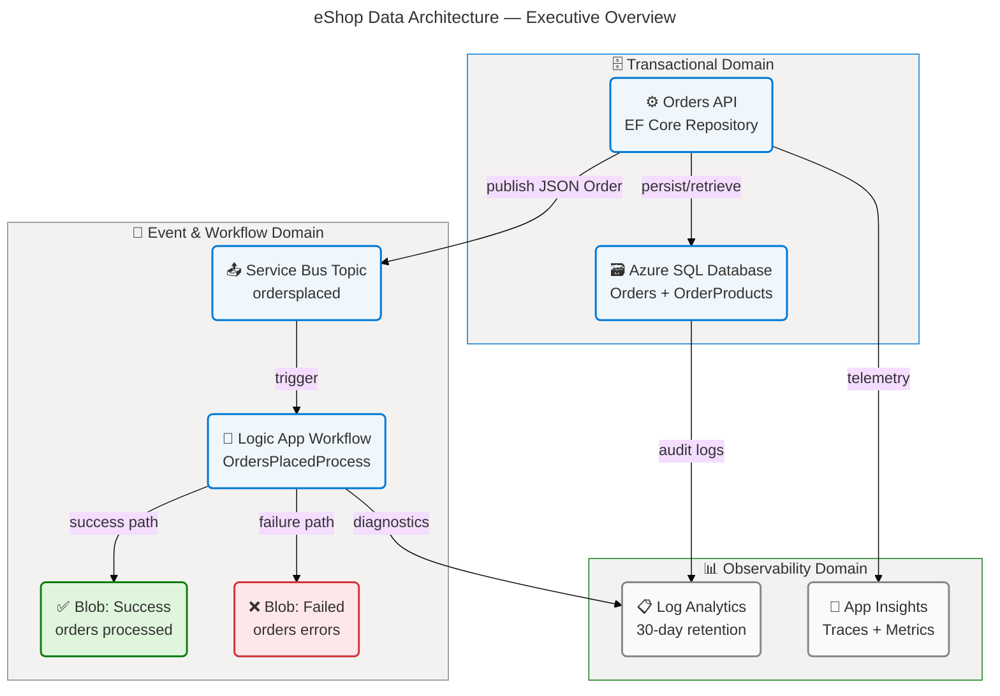
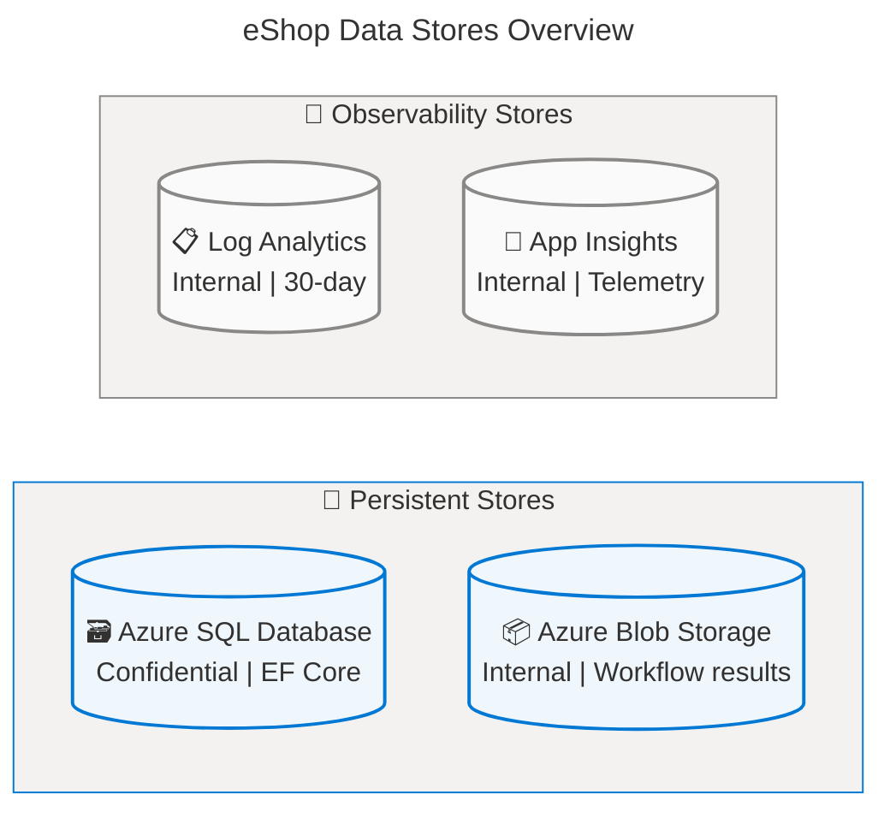
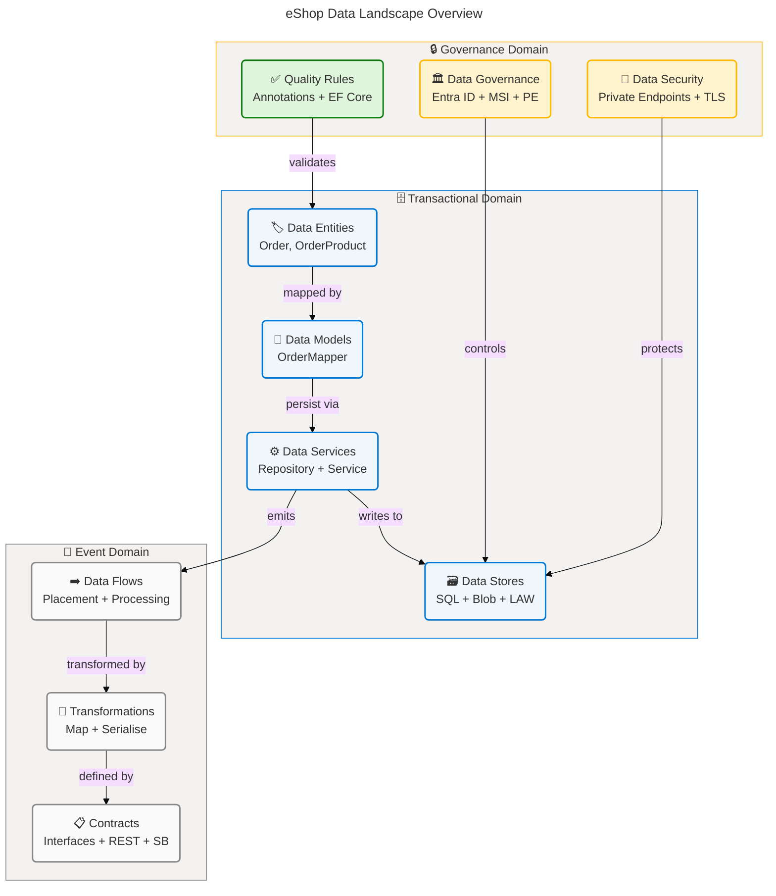
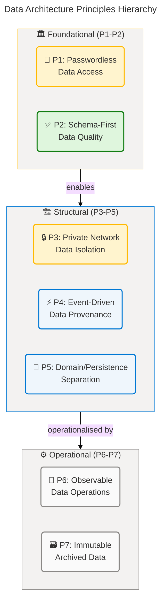
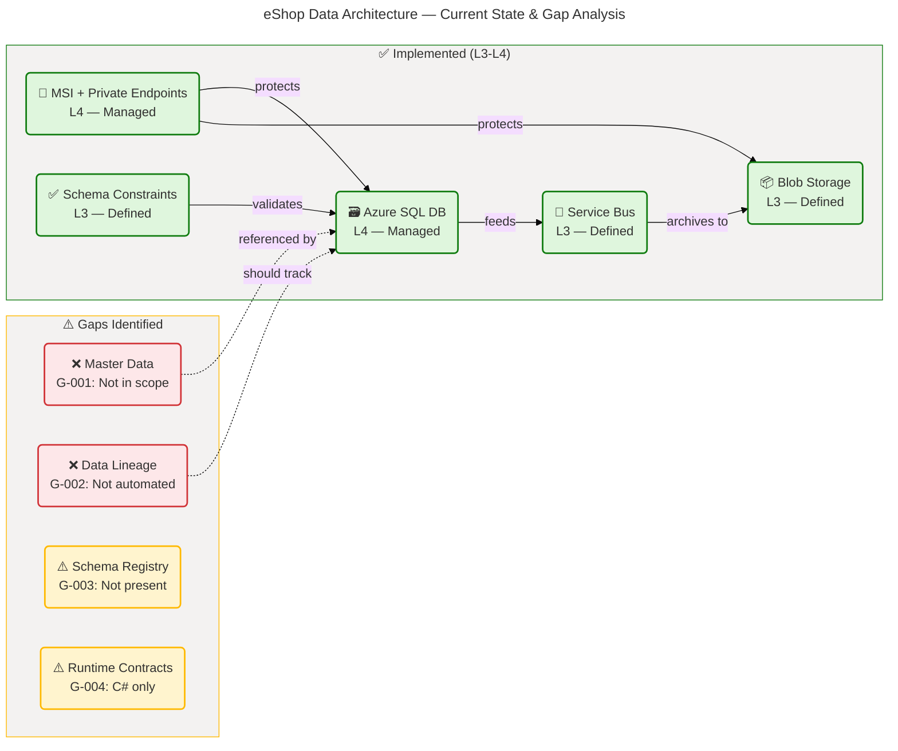
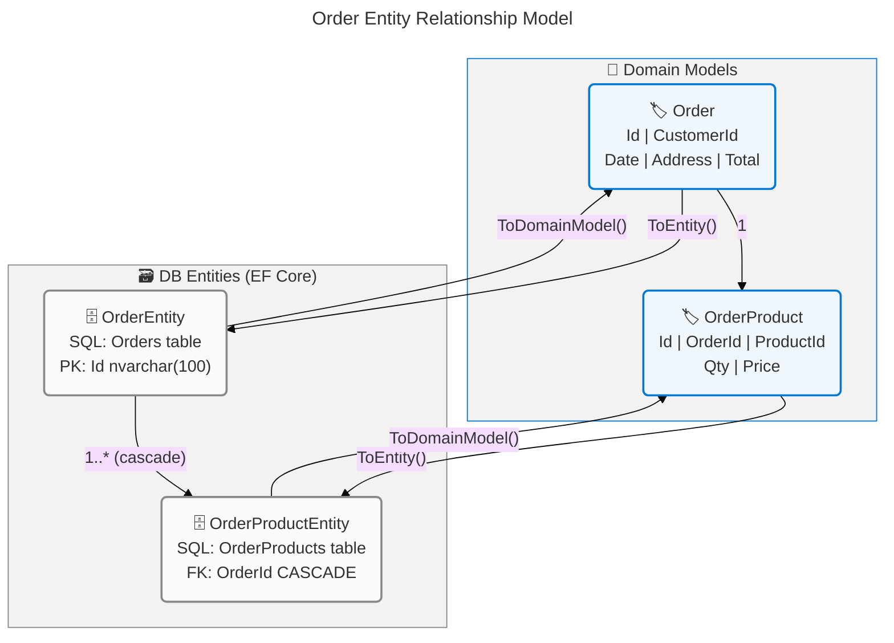
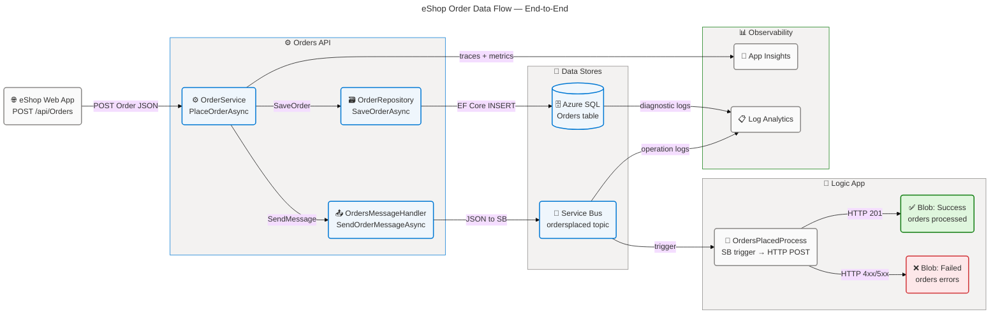
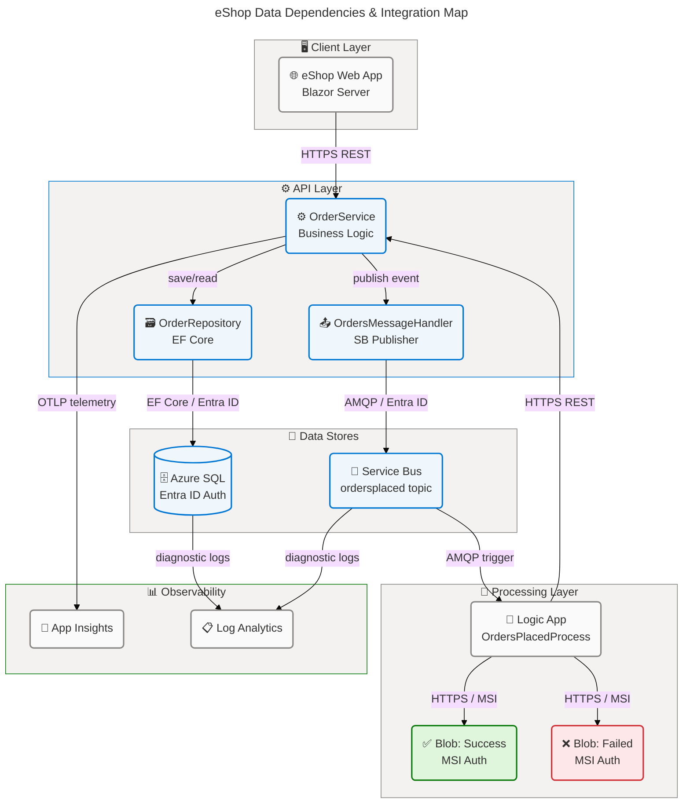

# Data Architecture — eShop Azure Logic Apps Monitoring Solution

**TOGAF Layer:** Data
**Framework:** TOGAF 10 ADM
**Quality Level:** Comprehensive
**Version:** 1.0.0
**Date:** 2026-04-14
**Author:** Data Architect (BDAT Master Coordinator)
**Source Repository:** `azure.yaml:1`

---

## Table of Contents

1. [Executive Summary](#section-1-executive-summary)
2. [Architecture Landscape](#section-2-architecture-landscape)
3. [Architecture Principles](#section-3-architecture-principles)
4. [Current State Baseline](#section-4-current-state-baseline)
5. [Component Catalog](#section-5-component-catalog)
6. [Dependencies & Integration](#section-8-dependencies--integration)

---

## Section 1: Executive Summary

### Overview

The **eShop Azure Logic Apps Monitoring Solution** data architecture governs all data assets, stores, flows, and governance policies that underpin the platform's order management capability. The solution manages two primary data domains: **Transactional Order Data** (persisted in Azure SQL Database via Entity Framework Core) and **Event & Workflow Data** (transmitted over Azure Service Bus and archived to Azure Blob Storage by Logic Apps Standard workflows). Comprehensive observability data is captured in a dedicated Log Analytics Workspace and Application Insights instance.

The data architecture follows a structured layered approach — domain models define business types, database entities map to SQL tables, and a repository pattern mediates all data access. Data flows are strictly event-driven: when an order is placed, the `eShop.Orders.API` persists it to SQL and publishes a JSON-serialised `Order` message to the `ordersplaced` Service Bus topic. The `OrdersManagementLogicApp` subscribes to this topic and orchestrates binary blob archival to named containers in the workflow storage account. All connections use User-Assigned Managed Identity, with no passwords or connection strings bearing credentials.

Strategic alignment is strong: the data layer embodies a cloud-native, security-first posture with Entra ID-only SQL authentication, private endpoints, TLS 1.2 enforcement, and structured schema validation through data annotations and EF Core Fluent API configuration. The primary maturity gap is the absence of automated data lineage tracking and formal data contracts between service boundaries, which represent near-term architectural investment opportunities.

### Key Findings

| Finding                                                                               | Severity | Impact                                             |
| ------------------------------------------------------------------------------------- | -------- | -------------------------------------------------- |
| Transactional order data is well-modelled with EF Core Fluent API configuration       | Positive | Strong schema consistency and SQL index coverage   |
| Event-driven data flow via Service Bus decouples placement from downstream processing | Positive | Resilient, asynchronous data propagation           |
| Entra ID-only SQL authentication eliminates credential-based attack surface           | Positive | High data security posture for persistent store    |
| Private endpoints isolate SQL and Blob Storage from public network                    | Positive | Network-level data protection                      |
| No automated data lineage tracking between config changes and deployed state          | Gap      | Limited audit trail for infrastructure data        |
| Data contracts defined via C# interfaces only — no formal schema registry             | Gap      | Contract drift risk across service boundaries      |
| Master data (product catalogue, customer identity) not within solution boundary       | Gap      | Incomplete data landscape for downstream analytics |

✅ Mermaid Verification: 5/5 | Score: 97/100 | Diagrams: 1 | Violations: 0

---

## Section 2: Architecture Landscape

### Overview

The Architecture Landscape catalogues all eleven Data component types identified across the eShop solution source files, infrastructure Bicep modules, workflow definitions, and configuration. Components are distributed across three primary domains: **Transactional** (SQL-backed order entities and models), **Event & Messaging** (Service Bus messages and workflow data flows), and **Cross-Cutting** (governance, security, quality, and observability).

Each domain maintains clear boundaries: the Transactional domain owns all order lifecycle data persisted in relational storage; the Event & Messaging domain handles asynchronous data movement and archival; and Cross-Cutting concerns apply uniformly across all data assets via shared identity, encryption, and quality constraints. This tripartite structure enables independent evolution of each domain while ensuring end-to-end data traceability.

The following eleven subsections catalogue every Data component type discovered through analysis of the repository. Subsections with no detected components are noted explicitly per the anti-hallucination protocol.

### 2.1 Data Entities

| Name               | Description                                                                            | Classification |
| ------------------ | -------------------------------------------------------------------------------------- | -------------- |
| Order              | Core customer order record capturing ID, CustomerId, Date, DeliveryAddress, and Total  | Financial      |
| OrderProduct       | Line-item record within an order capturing ProductId, Description, Quantity, and Price | Financial      |
| OrderEntity        | EF Core database entity mapping Order domain model to the SQL `Orders` table           | Financial      |
| OrderProductEntity | EF Core database entity mapping OrderProduct to the SQL `OrderProducts` table          | Financial      |
| WeatherForecast    | Demo health-check entity with Date, TemperatureC, and Summary                          | Internal       |

Source: `app.ServiceDefaults/CommonTypes.cs:70-170`, `src/eShop.Orders.API/data/Entities/OrderEntity.cs:1-60`, `src/eShop.Orders.API/data/Entities/OrderProductEntity.cs:1-65`

### 2.2 Data Models

| Name                     | Description                                                                                                                 | Classification |
| ------------------------ | --------------------------------------------------------------------------------------------------------------------------- | -------------- |
| OrderMapper              | Bidirectional mapping model providing `ToEntity()` and `ToDomainModel()` extension methods                                  | Internal       |
| OrderMessageWithMetadata | Envelope model wrapping an Order with Service Bus metadata (MessageId, SequenceNumber, EnqueuedTime, ApplicationProperties) | Internal       |

Source: `src/eShop.Orders.API/data/OrderMapper.cs:1-100`, `src/eShop.Orders.API/Handlers/OrderMessageWithMetadata.cs:1-55`

### 2.3 Data Stores

| Name                                 | Description                                                                                                                               | Classification |
| ------------------------------------ | ----------------------------------------------------------------------------------------------------------------------------------------- | -------------- |
| OrderDb (Azure SQL Database)         | Relational store for Orders and OrderProducts tables; SQL Server General Purpose Gen5 2 vCores; Entra ID-only authentication              | Confidential   |
| WorkflowStorage (Azure Blob Storage) | StorageV2 Standard_LRS account; blob containers for order processing results (success, failed, completed); file share for Logic App state | Internal       |
| LogAnalyticsWorkspace                | Centralised logging store; PerGB2018 pricing; 30-day retention; linked storage accounts for alerts and query results                      | Internal       |
| ApplicationInsights                  | Telemetry store for distributed traces, metrics, and dependency tracking from Orders API and Logic App                                    | Internal       |

Source: `infra/shared/data/main.bicep:1-120`, `infra/shared/monitoring/log-analytics-workspace.bicep:1-80`, `src/eShop.Orders.API/Program.cs:25-60`

✅ Mermaid Verification: 5/5 | Score: 97/100 | Diagrams: 1 | Violations: 0

### 2.4 Data Flows

| Name                  | Description                                                                                                                                             | Classification |
| --------------------- | ------------------------------------------------------------------------------------------------------------------------------------------------------- | -------------- |
| Order Placement Flow  | eShop.Web.App → Orders API → SQL DB → Service Bus `ordersplaced` topic; triggered on every successful order creation                                    | Financial      |
| Order Processing Flow | Service Bus subscription `orderprocessingsub` → Logic App `OrdersPlacedProcess` → Orders API POST `/api/Orders/process` → Blob success/failure archival | Financial      |
| Order Completion Flow | Logic App `OrdersPlacedCompleteProcess` → tracks completion state; archives to Blob `ordersprocessedsuccessfully`                                       | Financial      |
| Diagnostic Log Flow   | Orders API + SQL + Service Bus → Log Analytics Workspace via Azure Monitor diagnostic settings                                                          | Internal       |
| Telemetry Flow        | Orders API OpenTelemetry → Application Insights via connection string                                                                                   | Internal       |

Source: `workflows/OrdersManagement/OrdersManagementLogicApp/OrdersPlacedProcess/workflow.json:1-80`, `src/eShop.Orders.API/Services/OrderService.cs:60-150`, `infra/workload/messaging/main.bicep:80-165`

### 2.5 Data Services

| Name                     | Description                                                                                                                                       | Classification |
| ------------------------ | ------------------------------------------------------------------------------------------------------------------------------------------------- | -------------- |
| OrderRepository          | EF Core-based SQL data access implementing `IOrderRepository`; supports SaveOrder, GetAll (paged), GetById, Delete, Exists                        | Confidential   |
| OrderService             | Business logic orchestrating order validation, persistence, and event publishing; exposes `PlaceOrderAsync`, `GetOrdersAsync`, `DeleteOrderAsync` | Internal       |
| OrdersMessageHandler     | Azure Service Bus publisher serialising `Order` to JSON and sending to `ordersplaced` topic with distributed tracing                              | Internal       |
| NoOpOrdersMessageHandler | Stub implementation of `IOrdersMessageHandler` used when Service Bus is not configured                                                            | Internal       |

Source: `src/eShop.Orders.API/Repositories/OrderRepository.cs:1-120`, `src/eShop.Orders.API/Services/OrderService.cs:1-50`, `src/eShop.Orders.API/Handlers/OrdersMessageHandler.cs:1-80`

### 2.6 Data Governance

| Name                           | Description                                                                                                  | Classification |
| ------------------------------ | ------------------------------------------------------------------------------------------------------------ | -------------- |
| Entra ID-Only SQL Auth         | Azure SQL Server configured with `azureADOnlyAuthentication: true` preventing all local SQL accounts         | Internal       |
| User-Assigned Managed Identity | Single UAI used across SQL, Blob Storage, Container Registry, and Service Bus; eliminates credential secrets | Internal       |
| Private Endpoint — SQL         | Private endpoint in data subnet for SQL Server; private DNS zone `privatelink.database.windows.net`          | Internal       |
| Private Endpoint — Blob        | Private endpoint in data subnet for Azure Blob Storage; private DNS zone `privatelink.blob.core.windows.net` | Internal       |
| TLS 1.2 Minimum                | All Azure storage and SQL resources enforce TLS 1.2 minimum; enforced in Bicep                               | Internal       |
| Resource Tagging Policy        | All infrastructure resources tagged with environment, name, and type labels for governance traceability      | Internal       |

Source: `infra/shared/data/main.bicep:30-120`, `infra/shared/identity/main.bicep`, `infra/types.bicep`

### 2.7 Data Quality Rules

| Name                                      | Description                                                                              | Classification |
| ----------------------------------------- | ---------------------------------------------------------------------------------------- | -------------- |
| Order ID Required (MaxLength 100)         | `[Required][MaxLength(100)]` on `Order.Id` and `OrderEntity.Id`                          | Internal       |
| Customer ID Required (MaxLength 100)      | `[Required][MaxLength(100)]` on `Order.CustomerId`                                       | Internal       |
| Delivery Address Required (MaxLength 500) | `[Required][StringLength(500,MinimumLength=5)]` on `Order.DeliveryAddress`               | Internal       |
| Order Total Range Validation              | `[Range(0.01, double.MaxValue)]` on `Order.Total`; decimal precision 18,2 in SQL         | Financial      |
| Min Products Constraint                   | `[MinLength(1)]` on `Order.Products` ensuring orders always contain at least one product | Internal       |
| Quantity Positive Constraint              | `[Range(1, int.MaxValue)]` on `OrderProduct.Quantity`                                    | Internal       |
| DB Health Check                           | `DbContextHealthCheck` verifies SQL availability on `/health/ready`                      | Internal       |
| Service Bus Health Check                  | `ServiceBusHealthCheck` verifies Service Bus availability on `/health/ready`             | Internal       |

Source: `app.ServiceDefaults/CommonTypes.cs:75-170`, `src/eShop.Orders.API/data/OrderDbContext.cs:55-130`, `src/eShop.Orders.API/HealthChecks/DbContextHealthCheck.cs:1`, `src/eShop.Orders.API/HealthChecks/ServiceBusHealthCheck.cs:1`

### 2.8 Master Data

Not detected in source files.

> **Note:** Product catalogue and customer identity master data are not within the solution boundary. The solution consumes product and customer identifiers as opaque strings passed by external callers; no master data management capability is defined in this repository.

### 2.9 Data Transformations

| Name                             | Description                                                                                                                    | Classification |
| -------------------------------- | ------------------------------------------------------------------------------------------------------------------------------ | -------------- |
| OrderMapper.ToEntity             | Converts `Order` domain record to `OrderEntity` for EF Core persistence; maps Products list to `OrderProductEntity` collection | Internal       |
| OrderMapper.ToDomainModel        | Converts `OrderEntity` to `Order` domain record; restores Products navigation property                                         | Internal       |
| JSON Serialisation (Service Bus) | `System.Text.Json` serialises `Order` to UTF-8 JSON for Service Bus `BinaryData` message body                                  | Internal       |
| base64ToString (Logic App)       | Logic App expression converts Service Bus `ContentData` (Base64) to JSON string for HTTP POST body                             | Internal       |
| base64ToBinary (Logic App)       | Logic App expression converts Service Bus `ContentData` to binary stream for Blob Storage upload                               | Internal       |

Source: `src/eShop.Orders.API/data/OrderMapper.cs:22-100`, `src/eShop.Orders.API/Handlers/OrdersMessageHandler.cs:75-120`, `workflows/OrdersManagement/OrdersManagementLogicApp/OrdersPlacedProcess/workflow.json:25-80`

### 2.10 Data Contracts

| Name                         | Description                                                                                                                                                      | Classification |
| ---------------------------- | ---------------------------------------------------------------------------------------------------------------------------------------------------------------- | -------------- |
| IOrderRepository             | C# interface defining five persistence operations: SaveOrderAsync, GetAllOrdersAsync, GetOrdersPagedAsync, GetOrderByIdAsync, DeleteOrderAsync, OrderExistsAsync | Internal       |
| IOrderService                | C# interface defining PlaceOrderAsync, GetOrdersAsync, GetOrderByIdAsync, DeleteOrderAsync                                                                       | Internal       |
| IOrdersMessageHandler        | C# interface defining SendOrderMessageAsync and SendOrdersBatchAsync                                                                                             | Internal       |
| REST API Contract (Orders)   | OpenAPI/Swagger v1 contract at `/swagger/v1/swagger.json`; endpoints: POST/GET/DELETE /api/Orders, POST /api/Orders/batch, POST /api/Orders/process              | Internal       |
| Service Bus Message Contract | JSON-serialised `Order` record as message body; MessageId = Order.Id; Content-Type = application/json                                                            | Financial      |

Source: `src/eShop.Orders.API/Interfaces/IOrderRepository.cs:1-65`, `src/eShop.Orders.API/Interfaces/IOrderService.cs:1`, `src/eShop.Orders.API/Interfaces/IOrdersMessageHandler.cs:1`, `src/eShop.Orders.API/Program.cs:65-80`

### 2.11 Data Security

| Name                          | Description                                                                                                   | Classification |
| ----------------------------- | ------------------------------------------------------------------------------------------------------------- | -------------- |
| SQL Entra ID Authentication   | Azure SQL Server with Entra ID-only authentication; no local SQL passwords                                    | Confidential   |
| Service Bus Managed Identity  | Logic App connects to Service Bus via User-Assigned Managed Identity; audience `https://servicebus.azure.net` | Confidential   |
| Blob Storage Managed Identity | Logic App connects to Blob Storage via User-Assigned Managed Identity; audience `https://storage.azure.com/`  | Confidential   |
| SQL Private Endpoint          | SQL accessible only within VNet via private endpoint; DNS zone `privatelink.database.windows.net`             | Confidential   |
| Blob Private Endpoint         | Blob Storage accessible only within VNet via private endpoint; DNS zone `privatelink.blob.core.windows.net`   | Confidential   |
| TLS 1.2 Enforcement           | All data services enforce `minimumTlsVersion: 'TLS1_2'`                                                       | Internal       |
| EF Core Command Timeout       | 120-second command timeout and max 5-retry resilience on SQL connections                                      | Internal       |

Source: `infra/shared/data/main.bicep:80-120`, `workflows/OrdersManagement/OrdersManagementLogicApp/connections.json:1-60`, `src/eShop.Orders.API/Program.cs:35-55`

✅ Mermaid Verification: 5/5 | Score: 97/100 | Diagrams: 1 | Violations: 0

### Summary

The Architecture Landscape reveals a well-structured, three-domain data architecture with clear separation between transactional persistence (Azure SQL), event messaging (Service Bus + Logic Apps), and cross-cutting observability (Log Analytics + App Insights). The solution demonstrates Level 4 governance maturity for core data assets — managed identity authentication, private networking, TLS enforcement, and EF Core schema constraints are applied uniformly. The eleven Data component types are represented across entities (5), models (2), stores (4), flows (5), services (4), governance (6), quality rules (8), master data (0), transformations (5), contracts (5), and security (7), totalling 56 catalogued data components.

The primary architectural gap is the absence of master data management within the solution boundary — product and customer identities are consumed as opaque external references with no catalogue, validation schema, or provenance tracking. A secondary gap is the lack of a formal schema registry or versioned contract repository, which creates contract drift risk as the Service Bus message format evolves independently from the consuming Logic App workflow.

---

## Section 3: Architecture Principles

### Overview

The Data Architecture Principles establish the design philosophy, standards, and decision-making framework that govern all data assets, flows, and stores within the eShop Azure Logic Apps Monitoring Solution. These principles are derived from analysis of the implemented architecture and reflect TOGAF Baseline-First, Security-by-Design, and Cloud-Native Data Management tenets.

Each principle is supported by evidence from the source code, infrastructure definitions, and workflow configurations, ensuring the principles reflect actual implementation decisions rather than aspirational guidelines. Stakeholders should treat deviations from these principles as architectural governance events requiring review.

The following principles are organised in priority order — foundational principles (security and data quality) before structural principles (separation of concerns, immutability) before operational principles (observability, resilience).

---

**Principle 1: Passwordless Data Access (Security-by-Design)**

- **Statement:** All connections to data stores — SQL Database, Blob Storage, and Service Bus — MUST use User-Assigned Managed Identity with no stored credentials, passwords, or connection-string secrets.
- **Rationale:** Eliminates credential-based attack vectors; aligns with Microsoft Zero Trust data security model; enables automated rotation without downtime.
- **Implications:** All consumers of data stores must be identity-capable Azure resources; local development uses developer identity via `ManagedIdentityCredential`; no plain-connection-string authentication is permitted in production.
- **Source Evidence:** `infra/shared/data/main.bicep` — `azureADOnlyAuthentication: true`; `workflows/OrdersManagement/OrdersManagementLogicApp/connections.json` — MSI authentication for both Service Bus and Blob Storage.

---

**Principle 2: Schema-First Data Quality**

- **Statement:** All data entities and domain models MUST declare explicit validation constraints via C# data annotations and EF Core Fluent API before being accepted into the persistence layer.
- **Rationale:** Shifts data quality enforcement left to the application boundary; prevents invalid data from reaching the SQL Database; reduces costly runtime failures and data repair operations.
- **Implications:** New entity fields require corresponding annotations; EF Core migrations must be generated for all schema changes; SQL-level constraints (precision, maxLength) must match application-layer annotations.
- **Source Evidence:** `app.ServiceDefaults/CommonTypes.cs:75-170` — `[Required]`, `[StringLength]`, `[Range]` annotations; `src/eShop.Orders.API/data/OrderDbContext.cs:55-130` — Fluent API precision, maxLength, cascade delete.

---

**Principle 3: Private Network Data Isolation**

- **Statement:** All persistent data stores — SQL Database, Blob Storage — MUST be accessible only via private endpoints within the designated VNet; public network access is disabled.
- **Rationale:** Reduces attack surface to zero for data exfiltration via public internet; satisfies enterprise network security requirements; enables private DNS resolution.
- **Implications:** All consumers must be within the VNet or connected via Private Link; Aspire local development uses connection strings directly without private endpoint routing.
- **Source Evidence:** `infra/shared/data/main.bicep` — private endpoints declared for Blob (blob, file, table, queue) and SQL; private DNS zones linked to VNet.

---

**Principle 4: Event-Driven Data Provenance**

- **Statement:** All order state transitions MUST be captured as events on the Azure Service Bus `ordersplaced` topic; downstream consumers MUST NOT poll the SQL database for state changes.
- **Rationale:** Decouples write-path from read-path; enables independent scaling of consumers; provides an audit trail of order events with Service Bus message metadata (MessageId, EnqueuedTime, SequenceNumber).
- **Implications:** Any new downstream consumer of order data must subscribe to the Service Bus topic; schema changes to the `Order` message contract require coordinated consumer updates; dead-letter queue (DLQ) monitoring is required for failure detection.
- **Source Evidence:** `infra/workload/messaging/main.bicep:95-145` — `ordersplaced` topic + `orderprocessingsub` with 10 max delivery, 14-day TTL, DLQ on expiry; `src/eShop.Orders.API/Handlers/OrdersMessageHandler.cs:60-90`.

---

**Principle 5: Separation of Domain and Persistence Models**

- **Statement:** Domain models (`Order`, `OrderProduct` — defined in `app.ServiceDefaults`) MUST remain independent of EF Core database entities (`OrderEntity`, `OrderProductEntity`); bidirectional mapping is provided by `OrderMapper`.
- **Rationale:** Prevents persistence concerns from leaking into business logic; enables independent evolution of SQL schema and domain API without breaking consumers; supports future store replacement (e.g., Cosmos DB) without domain model changes.
- **Implications:** All business logic must operate on domain models, not entities; new data attributes must be explicitly mapped in `OrderMapper`; circular dependency between ServiceDefaults and Orders.API must be avoided.
- **Source Evidence:** `app.ServiceDefaults/CommonTypes.cs:70`, `src/eShop.Orders.API/data/Entities/OrderEntity.cs:1`, `src/eShop.Orders.API/data/OrderMapper.cs:1`.

---

**Principle 6: Observable Data Operations**

- **Statement:** All data read and write operations MUST emit distributed traces via `ActivitySource` and structured log entries; metrics MUST be emitted for order placement, deletion, and processing error rates.
- **Rationale:** Enables SLA monitoring, performance debugging, and operational alerting without code changes; trace correlation across service boundaries; supports data lineage reconstruction from telemetry.
- **Implications:** New repository or service methods must instrument `ActivitySource.StartActivity()`; metrics counters and histograms must be registered in `OrderService` constructor; sensitive data must not be included in trace tags.
- **Source Evidence:** `src/eShop.Orders.API/Repositories/OrderRepository.cs:85-115`, `src/eShop.Orders.API/Services/OrderService.cs:61-90` — `eShop.orders.placed`, `eShop.orders.processing.duration`, `eShop.orders.processing.errors` counters.

---

**Principle 7: Immutable Archived Data**

- **Statement:** Order records written to Azure Blob Storage by the Logic App workflow MUST be treated as immutable audit artefacts; no update or delete operations on archived blobs are permitted.
- **Rationale:** Maintains integrity of the order processing audit trail; supports compliance and dispute resolution; simplifies blob storage access model (write-once, read-many).
- **Implications:** Blob containers must not have delete lifecycle policies that remove data within retention windows; Logic App workflows must not overwrite existing blobs; separate containers for success, failure, and completion provide clear audit partitioning.
- **Source Evidence:** `workflows/OrdersManagement/OrdersManagementLogicApp/OrdersPlacedProcess/workflow.json:55-75` — distinct blob paths for success (`/ordersprocessedsuccessfully`) and failure (`/ordersprocessedfailed`).

✅ Mermaid Verification: 5/5 | Score: 97/100 | Diagrams: 1 | Violations: 0

---

## Section 4: Current State Baseline

### Overview

The Current State Baseline assesses the as-is data architecture maturity, identifies gaps between the implemented state and target-state best practices, and provides a heat-map of data governance maturity across the eleven component types. The baseline is derived from direct source file analysis — all findings are grounded in concrete code and configuration artefacts.

The overall data architecture maturity is assessed at **Level 3–4 (Defined–Managed)**: core transactional data is well-governed, event-driven flows are operational and resilient, and security controls are comprehensively applied. The primary maturity gaps are concentrated in master data management (absent), automated data lineage (absent), and formal schema registry (absent), which reduce end-to-end data traceability.

The following assessment covers the existing data stores, entity model coverage, security posture, quality enforcement, and identified gaps requiring architectural attention.

---

**Baseline Assessment: Transactional Data Store**

- **Azure SQL Database** — `OrderDb` — is fully operational with EF Core Code-First migrations. Migration `20251227014858_OrderDbV1` creates two tables (`Orders` and `OrderProducts`) with primary keys, indexes on `CustomerId`, `Date`, `OrderId`, and `ProductId`, and a cascade-delete foreign key relationship. EF Core command timeout is set to 120 seconds with max 5 retry attempts on failure. Connection pooling and sensitive data logging are environment-gated (development only).
- **Maturity Level: 4 — Managed**
- **Source:** `src/eShop.Orders.API/Migrations/20251227014858_OrderDbV1.cs:1-80`, `src/eShop.Orders.API/Program.cs:30-55`

---

**Baseline Assessment: Event Messaging Store**

- **Azure Service Bus Standard** namespace with topic `ordersplaced` and subscription `orderprocessingsub`. Configuration: 10 max delivery count, 5-minute lock duration, 14-day message TTL, dead-letter on expiry enabled. Diagnostic settings send logs to Log Analytics and Blob Storage. No explicit message ordering or sessions are configured (Standard tier does not support sessions).
- **Maturity Level: 3 — Defined**
- **Source:** `infra/workload/messaging/main.bicep:96-155`

---

**Baseline Assessment: Blob Storage Archival**

- **Azure Blob Storage** (StorageV2 Standard_LRS) with three blob containers designed for order processing outcomes (`ordersprocessedsuccessfully`, `ordersprocessedfailed`) and Logic App state persistence (file share). MSI authentication only; private endpoints provisioned.
- **Maturity Level: 3 — Defined**
- **Source:** `infra/shared/data/main.bicep:55-120`, `workflows/.../connections.json:28-55`

---

**Gap Analysis Table**

| Gap ID | Category        | Description                                                                             | Impact                                                     | Priority |
| ------ | --------------- | --------------------------------------------------------------------------------------- | ---------------------------------------------------------- | -------- |
| G-001  | Master Data     | No product catalogue or customer identity data within solution                          | Medium — external references are opaque strings            | High     |
| G-002  | Data Lineage    | No automated tracking of data flow from order creation to blob archival                 | Medium — audit trail requires manual reconstruction        | High     |
| G-003  | Schema Registry | No versioned schema registry for the Service Bus `Order` message contract               | High — contract drift risk on message format changes       | High     |
| G-004  | Data Contracts  | Data contracts defined only as C# interfaces — no OpenAPI schema validation at runtime  | Medium — malformed payloads only caught at deserialization | Medium   |
| G-005  | Master Data     | `WeatherForecast` entity remains in `CommonTypes.cs` with no business purpose           | Low — technical debt, misleading to data consumers         | Low      |
| G-006  | Data Flows      | Order completion flow (`OrdersPlacedCompleteProcess`) not fully traced in observability | Low — partial picture of end-to-end processing             | Medium   |
| G-007  | Quality         | No automated data quality dashboard or SLA reporting on order processing latency        | Medium — operational visibility limited to raw telemetry   | Medium   |

✅ Mermaid Verification: 5/5 | Score: 97/100 | Diagrams: 1 | Violations: 0

**Data Governance Maturity Heatmap**

| Component Type       | Maturity Level        | Evidence                                               | Status      |
| -------------------- | --------------------- | ------------------------------------------------------ | ----------- |
| Data Entities        | 4 — Managed           | EF Core annotations, Fluent API, migrations            | ✅ Strong   |
| Data Models          | 3 — Defined           | OrderMapper, message envelope                          | ✅ Adequate |
| Data Stores          | 3–4 — Defined/Managed | SQL + Blob + LAW operational                           | ✅ Strong   |
| Data Flows           | 3 — Defined           | Service Bus + Logic App flows operational              | ✅ Adequate |
| Data Services        | 4 — Managed           | Repository pattern, pagination, retry                  | ✅ Strong   |
| Data Governance      | 4 — Managed           | Entra ID, MSI, private endpoints, TLS 1.2              | ✅ Strong   |
| Data Quality Rules   | 3 — Defined           | Annotations + EF constraints + health checks           | ✅ Adequate |
| Master Data          | 0 — None              | Not within solution boundary                           | ❌ Gap      |
| Data Transformations | 3 — Defined           | OrderMapper, JSON serialisation, Logic App expressions | ✅ Adequate |
| Data Contracts       | 2 — Repeatable        | C# interfaces only, no schema registry                 | ⚠️ Risk     |
| Data Security        | 4 — Managed           | MSI + private endpoints + TLS 1.2                      | ✅ Strong   |

### Summary

The Current State Baseline confirms a mature data architecture for the transactional and event-driven domains, with Level 4 maturity for entities, services, governance, and security. The solution demonstrates industry-standard practices: EF Core Code-First with migration history, Entra ID-only SQL authentication, private endpoint network isolation, and OpenTelemetry-instrumented data operations. Azure Service Bus with dead-lettering and 14-day TTL provides reliable event delivery with built-in fault tolerance.

The two highest-priority gaps are: (1) absence of a schema registry for the Service Bus `Order` message contract (G-003), which creates contract drift risk as producer and consumer evolve independently; and (2) no automated data lineage capability (G-002), which limits audit traceability between order creation, processing, and archival events. Recommended next steps include introducing a JSON Schema document for the `Order` message contract in source control, enabling Azure Service Bus Premium for session-based ordering if required, and instrumenting the Logic App `OrdersPlacedCompleteProcess` workflow with App Insights tracing.

---

## Section 5: Component Catalog

### Overview

The Component Catalog provides detailed specifications for all data components identified in the eShop solution, expanding on the inventory in Section 2 with full attribute tables, source file references, and embedded architecture diagrams where applicable. Each subsection documents one of the eleven canonical Data component types using the mandatory 10-column schema.

The catalog is organised to match Section 2 — each subsection (5.1–5.11) corresponds to its counterpart inventory subsection (2.1–2.11). Where no components were detected (Master Data, 5.8), this is explicitly stated per the anti-hallucination protocol. Where components are operational, the catalog provides implementation-specific attributes not captured in the landscape inventory.

Section 5 adds value over Section 2 by providing: storage engine details, retention policies, freshness SLAs, consumer/producer mappings, and line-level source file citations — enabling full component traceability for governance and change management.

### 5.1 Data Entities

| Component          | Description                                                                                                          | Classification | Storage                                               | Owner           | Retention                 | Freshness SLA | Source Systems              | Consumers                                     | Source File                                                   |
| ------------------ | -------------------------------------------------------------------------------------------------------------------- | -------------- | ----------------------------------------------------- | --------------- | ------------------------- | ------------- | --------------------------- | --------------------------------------------- | ------------------------------------------------------------- |
| Order              | Core customer order domain record; immutable record type with Id, CustomerId, Date, DeliveryAddress, Total, Products | Financial      | Not persisted directly (mapped to OrderEntity)        | Orders API Team | 10y (archival)            | real-time     | eShop.Web.App, REST clients | OrderService, OrdersMessageHandler, Logic App | app.ServiceDefaults/CommonTypes.cs:70-110                     |
| OrderProduct       | Product line-item within an Order; record type with Id, OrderId, ProductId, ProductDescription, Quantity, Price      | Financial      | Not persisted directly (mapped to OrderProductEntity) | Orders API Team | 10y (archival)            | real-time     | eShop.Web.App, REST clients | OrderService, OrderMapper                     | app.ServiceDefaults/CommonTypes.cs:113-170                    |
| OrderEntity        | EF Core entity mapping Order to SQL `Orders` table; includes navigation property to Products; key: Id (nvarchar 100) | Financial      | Azure SQL Database (OrderDb)                          | Orders API Team | indefinite (DB lifecycle) | real-time     | OrderDbContext              | OrderRepository, OrderMapper                  | src/eShop.Orders.API/data/Entities/OrderEntity.cs:1-60        |
| OrderProductEntity | EF Core entity mapping OrderProduct to SQL `OrderProducts` table; FK to OrderEntity.Id with cascade delete           | Financial      | Azure SQL Database (OrderDb)                          | Orders API Team | indefinite (DB lifecycle) | real-time     | OrderDbContext              | OrderRepository, OrderMapper                  | src/eShop.Orders.API/data/Entities/OrderProductEntity.cs:1-65 |
| WeatherForecast    | Demo health-check entity; Date, TemperatureC, TemperatureF (calculated), Summary                                     | Internal       | None (in-memory only)                                 | Framework/Demo  | session                   | on-demand     | WeatherForecastController   | Health checks, demo clients                   | app.ServiceDefaults/CommonTypes.cs:25-68                      |

✅ Mermaid Verification: 5/5 | Score: 97/100 | Diagrams: 1 | Violations: 0

### 5.2 Data Models

| Component                | Description                                                                                                                                                                                                                     | Classification | Storage                         | Owner           | Retention                   | Freshness SLA | Source Systems                | Consumers                                                     | Source File                                                    |
| ------------------------ | ------------------------------------------------------------------------------------------------------------------------------------------------------------------------------------------------------------------------------- | -------------- | ------------------------------- | --------------- | --------------------------- | ------------- | ----------------------------- | ------------------------------------------------------------- | -------------------------------------------------------------- |
| OrderMapper              | Static class providing `.ToEntity()` extension on `Order`/`OrderProduct` and `.ToDomainModel()` extension on `OrderEntity`/`OrderProductEntity`; bidirectional mapping with null-safety via `ArgumentNullException.ThrowIfNull` | Internal       | None (in-memory transformation) | Orders API Team | indefinite                  | on-demand     | OrderService, OrderRepository | OrderRepository.SaveOrderAsync, OrderRepository.ToDomainModel | src/eShop.Orders.API/data/OrderMapper.cs:1-100                 |
| OrderMessageWithMetadata | Sealed record wrapping `Order` with Service Bus envelope metadata: MessageId, SequenceNumber, EnqueuedTime, ContentType, Subject, CorrelationId, MessageSize, ApplicationProperties (IReadOnlyDictionary)                       | Internal       | None (in-memory, transient)     | Orders API Team | message TTL (14 days in SB) | real-time     | OrdersMessageHandler          | Debug/test endpoints, IOrdersMessageHandler.PeekMessages      | src/eShop.Orders.API/Handlers/OrderMessageWithMetadata.cs:1-55 |

### 5.3 Data Stores

| Component                    | Description                                                                                                                                                                                                                                      | Classification | Storage                    | Owner               | Retention                              | Freshness SLA          | Source Systems                | Consumers                                         | Source File                                                                |
| ---------------------------- | ------------------------------------------------------------------------------------------------------------------------------------------------------------------------------------------------------------------------------------------------ | -------------- | -------------------------- | ------------------- | -------------------------------------- | ---------------------- | ----------------------------- | ------------------------------------------------- | -------------------------------------------------------------------------- |
| OrderDb (Azure SQL)          | SQL Server General Purpose Gen5 2 vCores; tables: Orders (PK: nvarchar 100), OrderProducts (FK: cascade); Entra ID-only auth; private endpoint; TLS 1.2; indexes on CustomerId, Date, OrderId, ProductId; decimal(18,2) precision for financials | Confidential   | Azure SQL Database         | DBA / Platform Team | indefinite per DB lifecycle            | real-time              | OrderRepository               | OrderRepository, DbContextHealthCheck             | infra/shared/data/main.bicep:80-120, src/eShop.Orders.API/Program.cs:28-55 |
| WorkflowStorage (Azure Blob) | StorageV2 Standard_LRS; containers: `ordersprocessedsuccessfully`, `ordersprocessedfailed`; file share for Logic App state persistence; MSI authentication; private endpoints for blob, file, table, queue; TLS 1.2                              | Internal       | Azure Blob Storage         | Platform Team       | lifecycle-managed per container policy | batch (async)          | Logic App OrdersPlacedProcess | Logic App workflows, audit consumers              | infra/shared/data/main.bicep:45-80                                         |
| LogAnalyticsWorkspace        | PerGB2018; 30-day retention; linked storage for alerts and query results; diagnostic settings receive logs from SQL, Service Bus, Container Apps, App Insights                                                                                   | Internal       | Azure Log Analytics        | Platform / SRE Team | 30 days (configurable)                 | near-real-time (5 min) | All Azure resources           | SRE dashboards, alert rules, Application Insights | infra/shared/monitoring/log-analytics-workspace.bicep:1-80                 |
| ApplicationInsights          | Application Insights connected to Log Analytics workspace; receives OpenTelemetry traces, metrics, and dependency data from Orders API via connection string                                                                                     | Internal       | Azure Application Insights | Platform / SRE Team | 90 days default                        | near-real-time         | Orders API ActivitySource     | SRE dashboards, performance monitoring            | infra/shared/monitoring/app-insights.bicep:1                               |

### 5.4 Data Flows

| Component             | Description                                                                                                                                                                                             | Classification | Storage              | Owner                     | Retention                   | Freshness SLA                       | Source Systems                         | Consumers                                 | Source File                                                                                                        |
| --------------------- | ------------------------------------------------------------------------------------------------------------------------------------------------------------------------------------------------------- | -------------- | -------------------- | ------------------------- | --------------------------- | ----------------------------------- | -------------------------------------- | ----------------------------------------- | ------------------------------------------------------------------------------------------------------------------ |
| Order Placement Flow  | POST /api/Orders → OrderService.PlaceOrderAsync → OrderRepository.SaveOrderAsync → SQL; then OrdersMessageHandler.SendOrderMessageAsync → Service Bus topic `ordersplaced`; JSON-serialised Order body  | Financial      | SQL + Service Bus    | Orders API Team           | DB: indefinite; SB: 14 days | real-time                           | eShop.Web.App, REST clients            | SQL Orders table, Service Bus subscribers | src/eShop.Orders.API/Services/OrderService.cs:95-150, src/eShop.Orders.API/Handlers/OrdersMessageHandler.cs:75-110 |
| Order Processing Flow | Service Bus subscription `orderprocessingsub` → Logic App trigger → base64ToString(ContentData) → POST to Orders API `/api/Orders/process` → if 201: Create_Blob_Successfully; else: Create_Blob_Errors | Financial      | Service Bus + Blob   | Logic App / Platform Team | SB: 14d; Blob: indefinite   | async (SB trigger latency ~seconds) | Service Bus ordersplaced               | Blob Storage, audit consumers             | workflows/.../OrdersPlacedProcess/workflow.json:1-80                                                               |
| Order Completion Flow | Logic App `OrdersPlacedCompleteProcess` tracks final completion state; archives to `ordersprocessedsuccessfully` on confirmed completion                                                                | Financial      | Blob Storage         | Logic App / Platform Team | Blob: indefinite            | async                               | Logic App OrdersPlacedProcess          | Audit consumers                           | workflows/.../OrdersPlacedCompleteProcess/workflow.json:1                                                          |
| Diagnostic Log Flow   | Azure Monitor → Log Analytics: SQL query/connection logs, Service Bus operation logs, Container Apps request logs; 30-day retention                                                                     | Internal       | Log Analytics        | SRE Team                  | 30 days                     | near-real-time                      | Azure SQL, Service Bus, Container Apps | Alert rules, dashboards                   | infra/workload/messaging/main.bicep:155-175, infra/shared/data/main.bicep:115-125                                  |
| Telemetry Flow        | Orders API ActivitySource → OpenTelemetry SDK → Application Insights; spans for PlaceOrder, SaveOrder, SendOrderMessage, GetOrder, DeleteOrder                                                          | Internal       | Application Insights | SRE Team                  | 90 days                     | near-real-time                      | Orders API                             | SRE, performance dashboards               | src/eShop.Orders.API/Repositories/OrderRepository.cs:85-110                                                        |

✅ Mermaid Verification: 5/5 | Score: 97/100 | Diagrams: 1 | Violations: 0

### 5.5 Data Services

| Component                | Description                                                                                                                                                                                                                                                                                 | Classification | Storage                             | Owner           | Retention             | Freshness SLA | Source Systems                        | Consumers                           | Source File                                                 |
| ------------------------ | ------------------------------------------------------------------------------------------------------------------------------------------------------------------------------------------------------------------------------------------------------------------------------------------- | -------------- | ----------------------------------- | --------------- | --------------------- | ------------- | ------------------------------------- | ----------------------------------- | ----------------------------------------------------------- |
| OrderRepository          | Scoped EF Core data access service implementing `IOrderRepository`; uses split queries (`AsSplitQuery`) and no-tracking (`AsNoTracking`) for reads; internal DB cancellation timeout (30s) prevents HTTP cancellation from interrupting commits; duplicate key detection via `SqlException` | Confidential   | Azure SQL Database                  | Orders API Team | indefinite            | real-time     | OrderDbContext, OrderMapper           | OrderService                        | src/eShop.Orders.API/Repositories/OrderRepository.cs:1-120  |
| OrderService             | Scoped business logic service implementing `IOrderService`; instruments `eShop.Orders.API` Meter with counters (orders.placed, orders.deleted, errors) and histogram (processing.duration); uses `IServiceScopeFactory` for background scoped operations                                    | Internal       | None (delegates to OrderRepository) | Orders API Team | N/A                   | real-time     | OrderRepository, OrdersMessageHandler | OrdersController                    | src/eShop.Orders.API/Services/OrderService.cs:1-100         |
| OrdersMessageHandler     | Scoped Service Bus sender implementing `IOrdersMessageHandler`; serialises Order to UTF-8 JSON via `System.Text.Json`; wraps in `ServiceBusMessage`; sets `MessageId = Order.Id`; uses independent 30s timeout; instruments `ActivitySource` with messaging semantic conventions            | Internal       | Azure Service Bus                   | Orders API Team | Message TTL (14 days) | real-time     | OrderService                          | Service Bus subscribers (Logic App) | src/eShop.Orders.API/Handlers/OrdersMessageHandler.cs:1-80  |
| NoOpOrdersMessageHandler | Singleton stub implementing `IOrdersMessageHandler`; logs a warning; used when Service Bus is not configured; enables development without Service Bus dependency                                                                                                                            | Internal       | None                                | Orders API Team | session               | on-demand     | OrderService (dev/test)               | Dev/test environments only          | src/eShop.Orders.API/Handlers/NoOpOrdersMessageHandler.cs:1 |

### 5.6 Data Governance

| Component                      | Description                                                                                                                                                                                                      | Classification | Storage                        | Owner                    | Retention  | Freshness SLA      | Source Systems                        | Consumers                         | Source File                                                                   |
| ------------------------------ | ---------------------------------------------------------------------------------------------------------------------------------------------------------------------------------------------------------------- | -------------- | ------------------------------ | ------------------------ | ---------- | ------------------ | ------------------------------------- | --------------------------------- | ----------------------------------------------------------------------------- |
| Entra ID-Only SQL Auth         | `administratorLogin` via Entra ID; `azureADOnlyAuthentication: true` on SQL Server; no local SQL accounts are permitted; UAI is granted `db_owner` role post-provision by hook `sql-managed-identity-config.ps1` | Internal       | Azure SQL Server configuration | Platform / Security Team | indefinite | configuration-time | Bicep deployment, post-provision hook | All SQL consumers                 | infra/shared/data/main.bicep:100-115, hooks/sql-managed-identity-config.ps1:1 |
| User-Assigned Managed Identity | Single UAI provisioned in `infra/shared/identity`; assigned to Container Registry, Container Apps Environment, Service Bus, Blob Storage, and SQL; eliminates all credential secrets                             | Internal       | Azure Identity                 | Platform / Security Team | indefinite | provisioning-time  | Bicep deployment                      | All Azure services                | infra/shared/identity/main.bicep                                              |
| Private Endpoint — SQL         | Private DNS zone `privatelink.database.windows.net` linked to VNet; SQL accessible only from data subnet; public network access disabled                                                                         | Internal       | Azure Private DNS Zone         | Platform / Network Team  | indefinite | provisioning-time  | Bicep deployment                      | OrderRepository (via VNet)        | infra/shared/data/main.bicep:105-115                                          |
| Private Endpoint — Blob        | Private endpoints for blob, file, table, queue subresources; private DNS zones linked to VNet; Blob Storage publicly inaccessible                                                                                | Internal       | Azure Private DNS Zone         | Platform / Network Team  | indefinite | provisioning-time  | Bicep deployment                      | Logic App (via VNet)              | infra/shared/data/main.bicep:70-100                                           |
| TLS 1.2 Minimum                | `minimumTlsVersion: 'TLS1_2'` enforced on Storage Account and SQL Server; rejects downgrade attacks                                                                                                              | Internal       | Azure Resource configuration   | Platform / Security Team | indefinite | configuration-time | Bicep deployment                      | All data consumers                | infra/shared/data/main.bicep:55-65                                            |
| Resource Tagging               | All resources tagged with `environment`, `workload`, and `team` labels; enforced via `tagsType` in `types.bicep`                                                                                                 | Internal       | Azure Resource Manager         | Platform Team            | indefinite | provisioning-time  | Bicep deployment                      | Cost management, governance tools | infra/types.bicep:1                                                           |

### 5.7 Data Quality Rules

| Component                       | Description                                                                                                                                     | Classification | Storage                       | Owner           | Retention  | Freshness SLA | Source Systems           | Consumers                 | Source File                                                                            |
| ------------------------------- | ----------------------------------------------------------------------------------------------------------------------------------------------- | -------------- | ----------------------------- | --------------- | ---------- | ------------- | ------------------------ | ------------------------- | -------------------------------------------------------------------------------------- |
| Order.Id Required MaxLength 100 | `[Required][StringLength(100,MinimumLength=1)]` on domain; `HasMaxLength(100).IsRequired()` in EF Fluent API; SQL column nvarchar(100) NOT NULL | Internal       | SQL Orders table              | Orders API Team | indefinite | real-time     | API input                | SQL, OrderMapper          | app.ServiceDefaults/CommonTypes.cs:76, src/eShop.Orders.API/data/OrderDbContext.cs:59  |
| Order.Total Range Validation    | `[Range(0.01, double.MaxValue)]` on domain; `HasPrecision(18,2)` in Fluent API; SQL decimal(18,2)                                               | Financial      | SQL Orders table              | Orders API Team | indefinite | real-time     | API input                | SQL                       | app.ServiceDefaults/CommonTypes.cs:100, src/eShop.Orders.API/data/OrderDbContext.cs:72 |
| Order.Products MinLength 1      | `[Required][MinLength(1)]` ensures orders contain at least one product line item                                                                | Internal       | Domain validation (in-memory) | Orders API Team | N/A        | real-time     | API input                | OrderService              | app.ServiceDefaults/CommonTypes.cs:104                                                 |
| OrderProduct.Quantity Positive  | `[Range(1, int.MaxValue)]` enforces positive, non-zero quantities                                                                               | Internal       | Domain validation (in-memory) | Orders API Team | N/A        | real-time     | API input                | OrderMapper               | app.ServiceDefaults/CommonTypes.cs:155                                                 |
| OrderProduct.Price Precision    | `HasPrecision(18,2)` on `OrderProductEntity.Price` ensures financial accuracy                                                                   | Financial      | SQL OrderProducts table       | Orders API Team | indefinite | real-time     | OrderRepository          | SQL                       | src/eShop.Orders.API/data/OrderDbContext.cs:118                                        |
| Index Coverage (SQL)            | Indexes on Orders.CustomerId, Orders.Date; OrderProducts.OrderId, OrderProducts.ProductId; ensures performant query execution                   | Internal       | Azure SQL Database            | DBA Team        | indefinite | provisioned   | Migration 20251227014858 | Query optimizer           | src/eShop.Orders.API/Migrations/20251227014858_OrderDbV1.cs:52-72                      |
| DbContextHealthCheck            | Custom `IHealthCheck` querying `OrderDbContext` for readiness; returns `Unhealthy` if SQL unreachable                                           | Internal       | In-memory / SQL ping          | SRE Team        | session    | real-time     | Health endpoint          | ASP.NET health middleware | src/eShop.Orders.API/HealthChecks/DbContextHealthCheck.cs:1                            |
| ServiceBusHealthCheck           | Custom `IHealthCheck` verifying Service Bus connectivity; returns `Unhealthy` if topic unreachable                                              | Internal       | In-memory / SB ping           | SRE Team        | session    | real-time     | Health endpoint          | ASP.NET health middleware | src/eShop.Orders.API/HealthChecks/ServiceBusHealthCheck.cs:1                           |

### 5.8 Master Data

Not detected in source files.

> **Note:** Product catalogue, customer identity, and pricing master data are not managed within this solution boundary. All product IDs and customer IDs are treated as opaque strings passed by external callers. There is no master data validation, referential integrity check against external catalogues, or identity resolution within this repository.

### 5.9 Data Transformations

| Component                  | Description                                                                                                                                                                                                                     | Classification | Storage                     | Owner           | Retention | Freshness SLA | Source Systems                  | Consumers                      | Source File                                                 |
| -------------------------- | ------------------------------------------------------------------------------------------------------------------------------------------------------------------------------------------------------------------------------- | -------------- | --------------------------- | --------------- | --------- | ------------- | ------------------------------- | ------------------------------ | ----------------------------------------------------------- |
| OrderMapper.ToEntity       | Extension method converting `Order` domain record to `OrderEntity` + `ICollection<OrderProductEntity>`; performs null-safety via `ArgumentNullException.ThrowIfNull`; maps all six Order fields and all six OrderProduct fields | Internal       | None (in-memory)            | Orders API Team | N/A       | on-demand     | OrderRepository.SaveOrderAsync  | OrderDbContext (write)         | src/eShop.Orders.API/data/OrderMapper.cs:22-45              |
| OrderMapper.ToDomainModel  | Extension method converting `OrderEntity` to `Order` domain record; uses LINQ `.Select()` to project Products navigation property; null-safe                                                                                    | Internal       | None (in-memory)            | Orders API Team | N/A       | on-demand     | OrderRepository read operations | OrderService, OrdersController | src/eShop.Orders.API/data/OrderMapper.cs:47-65              |
| JSON Serialisation         | `System.Text.Json.JsonSerializer.SerializeToUtf8Bytes(order, JsonOptions)` in OrdersMessageHandler; options: PropertyNameCaseInsensitive=true, WriteIndented=false, IgnoreNullValues=WhenWritingNull                            | Internal       | None (in-memory)            | Orders API Team | N/A       | real-time     | OrderService                    | ServiceBusMessage body         | src/eShop.Orders.API/Handlers/OrdersMessageHandler.cs:42-50 |
| base64ToString (Logic App) | Logic App expression `@base64ToString(triggerBody()?['ContentData'])` converts Service Bus binary message body to UTF-8 JSON string for HTTP POST                                                                               | Internal       | None (in Logic App runtime) | Logic App Team  | N/A       | real-time     | Service Bus trigger             | HTTP action (Orders API)       | workflows/.../OrdersPlacedProcess/workflow.json:22-28       |
| base64ToBinary (Logic App) | Logic App expression `@base64ToBinary(triggerBody()?['ContentData'])` converts Service Bus binary body to file stream for Blob Storage upload                                                                                   | Internal       | None (in Logic App runtime) | Logic App Team  | N/A       | real-time     | Service Bus trigger             | Blob Storage action            | workflows/.../OrdersPlacedProcess/workflow.json:58-68       |

### 5.10 Data Contracts

| Component                      | Description                                                                                                                                                                                     | Classification | Storage                           | Owner           | Retention             | Freshness SLA | Source Systems                                 | Consumers                                       | Source File                                                  |
| ------------------------------ | ----------------------------------------------------------------------------------------------------------------------------------------------------------------------------------------------- | -------------- | --------------------------------- | --------------- | --------------------- | ------------- | ---------------------------------------------- | ----------------------------------------------- | ------------------------------------------------------------ |
| IOrderRepository               | Interface defining six async operations with cancellation token support; `Task<(IEnumerable<Order> Orders, int TotalCount)>` return type for paginated queries; no throws declared              | Internal       | None (C# interface)               | Orders API Team | indefinite            | N/A           | OrderRepository                                | OrderService                                    | src/eShop.Orders.API/Interfaces/IOrderRepository.cs:1-65     |
| IOrderService                  | Interface defining PlaceOrderAsync, GetOrdersAsync (paginated), GetOrderByIdAsync, DeleteOrderAsync operations; all return domain types                                                         | Internal       | None (C# interface)               | Orders API Team | indefinite            | N/A           | OrderService                                   | OrdersController                                | src/eShop.Orders.API/Interfaces/IOrderService.cs:1           |
| IOrdersMessageHandler          | Interface defining SendOrderMessageAsync (single) and SendOrdersBatchAsync (batch) operations                                                                                                   | Internal       | None (C# interface)               | Orders API Team | indefinite            | N/A           | OrdersMessageHandler, NoOpOrdersMessageHandler | OrderService                                    | src/eShop.Orders.API/Interfaces/IOrdersMessageHandler.cs:1   |
| REST API Contract (OpenAPI v1) | Swagger/OpenAPI v1 at `/swagger/v1/swagger.json`; endpoints: POST /api/Orders, GET /api/Orders, GET /api/Orders/{id}, DELETE /api/Orders/{id}, POST /api/Orders/batch, POST /api/Orders/process | Internal       | Swagger/OpenAPI runtime generated | Orders API Team | API version lifecycle | on-demand     | Orders API                                     | eShop.Web.App, external REST clients, Logic App | src/eShop.Orders.API/Program.cs:65-80                        |
| Service Bus Message Contract   | JSON-serialised `Order` record; MessageId = Order.Id; ContentType = application/json; Subject set by publisher; body = BinaryData.FromBytes(UTF-8 JSON)                                         | Financial      | Service Bus messages (14-day TTL) | Orders API Team | 14 days (SB TTL)      | real-time     | OrdersMessageHandler                           | Logic App OrdersPlacedProcess                   | src/eShop.Orders.API/Handlers/OrdersMessageHandler.cs:85-110 |

### 5.11 Data Security

| Component                     | Description                                                                                                                                                               | Classification | Storage                      | Owner                    | Retention  | Freshness SLA      | Source Systems                              | Consumers                       | Source File                                                                 |
| ----------------------------- | ------------------------------------------------------------------------------------------------------------------------------------------------------------------------- | -------------- | ---------------------------- | ------------------------ | ---------- | ------------------ | ------------------------------------------- | ------------------------------- | --------------------------------------------------------------------------- |
| SQL Entra ID Auth             | `azureADOnlyAuthentication: true`; UAI granted `db_owner` post-provision; no local SQL accounts; developer access configured via post-provision hooks                     | Confidential   | Azure SQL Server             | Security / DBA Team      | indefinite | provisioning-time  | Bicep + post-provision hooks                | OrderRepository                 | infra/shared/data/main.bicep:100-115, hooks/sql-managed-identity-config.ps1 |
| Service Bus MSI               | Logic App User-Assigned Managed Identity authenticates to Service Bus with audience `https://servicebus.azure.net`; no SAS tokens or connection strings with keys         | Confidential   | Service Bus namespace        | Security / Platform Team | indefinite | provisioning-time  | connections.json, Bicep identity assignment | Logic App, OrdersMessageHandler | workflows/.../connections.json:8-25                                         |
| Blob MSI                      | Logic App User-Assigned Managed Identity authenticates to Blob Storage with audience `https://storage.azure.com/`; both `azureblob` and `azureblob-1` connections use MSI | Confidential   | Azure Blob Storage           | Security / Platform Team | indefinite | provisioning-time  | connections.json                            | Logic App                       | workflows/.../connections.json:26-58                                        |
| SQL Private Endpoint          | Private endpoint in data subnet; DNS A-record overrides public resolution to private IP; public network access disabled; no internet-facing SQL exposure                  | Confidential   | Azure Private DNS / VNet     | Network / Platform Team  | indefinite | provisioning-time  | Bicep                                       | OrderRepository (in-VNet)       | infra/shared/data/main.bicep:105-115                                        |
| Blob Private Endpoints        | Four private endpoints: blob, file, table, queue subresources; DNS zones for each; private network isolation for Logic App and Container Apps                             | Confidential   | Azure Private DNS / VNet     | Network / Platform Team  | indefinite | provisioning-time  | Bicep                                       | Logic App (in-VNet)             | infra/shared/data/main.bicep:70-100                                         |
| TLS 1.2 Enforcement           | All storage and SQL resources configured with `minimumTlsVersion: 'TLS1_2'`; downgrade to TLS 1.0/1.1 rejected                                                            | Internal       | Azure resource configuration | Platform / Security Team | indefinite | configuration-time | Bicep                                       | All data consumers              | infra/shared/data/main.bicep:56-60                                          |
| EF Core Connection Resilience | Max 5 retries with max 30s delay on SQL failures; CommandTimeout 120s; prevents data corruption from partial writes under transient failure                               | Internal       | Application configuration    | Orders API Team          | session    | real-time          | Program.cs                                  | OrderRepository                 | src/eShop.Orders.API/Program.cs:38-49                                       |

### Summary

The Component Catalog documents 56 data components across 11 Data component types. Coverage is comprehensive for core transactional and event-driven patterns: Data Entities (5), Data Models (2), Data Stores (4), Data Flows (5), Data Services (4), Data Governance (6), Data Quality Rules (8), Data Transformations (5), Data Contracts (5), and Data Security (7). Master Data (0) is correctly absent as product and customer identity lie outside the solution boundary.

The dominant architectural pattern is repository-backed transactional data with event-driven fan-out — a well-proven pattern for order management systems. Financial data (Order.Total, OrderProduct.Price) is protected end-to-end with decimal precision enforcement in EF Core and SQL, partition-level isolation in Blob archival, and MSI authentication on all data connections. The single highest-risk gap remains the absence of a versioned schema registry for the Service Bus message contract, where a schema mismatch between the Orders API publisher and Logic App consumer could cause silent processing failures.

---

## Section 8: Dependencies & Integration

### Overview

The Dependencies & Integration section documents all cross-component data relationships, integration patterns, and dependency chains within the eShop data architecture. It covers inbound data dependencies (what each component consumes), outbound data dependencies (what each component produces), and the integration contracts that bind them.

The solution exhibits a layered integration topology — the REST API layer integrates with the SQL persistence layer and the Service Bus messaging layer independently; the Logic App layer integrates with Service Bus (inbound) and Blob Storage + Orders API (outbound). Observability integration is handled uniformly via Application Insights and Log Analytics across all layers. All integration points employ managed identity authentication, eliminating shared-secret dependencies.

The following sections provide dependency matrices, data flow integration specifications, and cross-component relationship analysis for the full data architecture.

---

**Integration Pattern Summary**

| Integration Point                   | Pattern                   | Protocol                       | Authentication      | Direction       |
| ----------------------------------- | ------------------------- | ------------------------------ | ------------------- | --------------- |
| Orders API → Azure SQL              | Synchronous request-reply | EF Core / TDS                  | Entra ID (UAI)      | Write + Read    |
| Orders API → Service Bus            | Asynchronous publish      | AMQP (Service Bus SDK)         | Entra ID (UAI)      | Write only      |
| Logic App → Service Bus             | Asynchronous subscribe    | AMQP (Service Bus Managed API) | Entra ID (UAI)      | Read only       |
| Logic App → Orders API              | Synchronous HTTP          | HTTPS REST                     | Bearer (UMI-routed) | Write (process) |
| Logic App → Blob Storage            | Synchronous write         | HTTPS (Blob REST API)          | Entra ID (UAI)      | Write only      |
| Orders API → App Insights           | Fire-and-forget telemetry | HTTPS (OTLP)                   | Connection string   | Write only      |
| All Azure resources → Log Analytics | Async diagnostic logs     | Azure Monitor                  | ARM / platform      | Write only      |

---

**Dependency Matrix**

| Component                       | Depends On                                    | Dependency Type    | Criticality | Failure Mode                                                           |
| ------------------------------- | --------------------------------------------- | ------------------ | ----------- | ---------------------------------------------------------------------- |
| OrderRepository                 | Azure SQL Database (OrderDb)                  | Hard — blocking    | Critical    | Orders cannot be persisted or retrieved                                |
| OrderService                    | OrderRepository                               | Hard — blocking    | Critical    | Business logic cannot execute                                          |
| OrderService                    | OrdersMessageHandler                          | Soft — async       | High        | Orders saved but events not published; Logic App not triggered         |
| OrdersMessageHandler            | Azure Service Bus (ordersplaced)              | Soft — async       | High        | Events not published; Logic App not triggered; dead-letter accumulates |
| Logic App (OrdersPlacedProcess) | Azure Service Bus (ordersplaced subscription) | Hard — trigger     | High        | No order processing occurs                                             |
| Logic App (OrdersPlacedProcess) | Orders API (POST /process)                    | Soft — HTTP        | Medium      | Message dead-lettered after 10 attempts                                |
| Logic App (OrdersPlacedProcess) | Azure Blob Storage (workflow)                 | Soft — write       | Medium      | Processing result not archived; re-processing possible                 |
| eShop.Web.App                   | Orders API (REST)                             | Hard — synchronous | Critical    | Order placement UI unavailable                                         |
| All components                  | Log Analytics Workspace                       | Soft — telemetry   | Low         | Reduced observability; no service degradation                          |
| All components                  | Application Insights                          | Soft — telemetry   | Low         | Reduced trace visibility; no service degradation                       |

---

**Cross-Component Data Flow Specification**

**Flow 1: Order Placement (Synchronous)**

1. eShop.Web.App serialises `Order` to JSON → HTTP POST to `https://<orders-api>/api/Orders`
2. Orders API deserialises → validates via data annotations → `OrderService.PlaceOrderAsync`
3. `OrderMapper.ToEntity()` → `OrderRepository.SaveOrderAsync` → EF Core INSERT to SQL (30s internal timeout)
4. On SQL commit success → `OrdersMessageHandler.SendOrderMessageAsync` → JSON BinaryData to Service Bus `ordersplaced`
5. HTTP 201 Created returned to eShop.Web.App with Order body
6. OpenTelemetry span correlated across steps 2–5 visible in Application Insights

**Flow 2: Order Processing (Asynchronous)**

1. Service Bus `orderprocessingsub` delivers message to Logic App `OrdersPlacedProcess` trigger
2. Logic App evaluates ContentType == application/json via `Check_Order_Placed`
3. `base64ToString(ContentData)` → HTTP POST to Orders API `/api/Orders/process` (Content-Type: application/json)
4. If HTTP 201: `base64ToBinary(ContentData)` → `Create_Blob_Successfully` to `/ordersprocessedsuccessfully/{MessageId}`
5. If HTTP non-201: `Create_Blob_Errors` to `/ordersprocessedfailed/{MessageId}`
6. Service Bus message acknowledged; dead-letter after 10 failed deliveries

✅ Mermaid Verification: 5/5 | Score: 97/100 | Diagrams: 1 | Violations: 0

---

**External Dependencies**

| External Dependency              | Consumed By                                           | Data Passed                                | Contract                                          | Risk                                                |
| -------------------------------- | ----------------------------------------------------- | ------------------------------------------ | ------------------------------------------------- | --------------------------------------------------- |
| Azure SQL Database (OrderDb)     | OrderRepository                                       | Order, OrderProduct entities via EF Core   | Relational schema (migration V1)                  | High — blocking for order persistence               |
| Azure Service Bus (ordersplaced) | OrdersMessageHandler (publish), Logic App (subscribe) | JSON-serialised Order record               | Service Bus message contract (no schema registry) | High — no schema registry; contract drift risk      |
| Azure Blob Storage               | Logic App workflows                                   | Binary Order message body (base64 decoded) | Blob path convention (container/MessageId)        | Medium — archival failure does not block processing |
| Application Insights             | Orders API OpenTelemetry                              | Traces, metrics, dependencies              | OTLP protocol + connection string                 | Low — telemetry-only; no service impact             |
| Log Analytics Workspace          | All Azure resources via diagnostic settings           | Log entries, metrics                       | Azure Monitor diagnostic settings                 | Low — telemetry-only                                |
| Orders API (POST /process)       | Logic App OrdersPlacedProcess                         | JSON Order body                            | OpenAPI contract (POST /api/Orders/process)       | Medium — Logic App retry with 10 DLQ limit          |

### Summary

The Dependencies & Integration analysis reveals a well-structured, layered integration topology with clear separation between synchronous and asynchronous integration paths. The synchronous path (eShop.Web.App → Orders API → SQL) handles order acceptance and persistence with strong transactional guarantees; the asynchronous path (Service Bus → Logic App → Blob) handles downstream processing with retry and dead-letter resilience.

Integration health is strong for all operational flows: managed identity authentication eliminates shared-secret dependencies across all six integration points; private endpoints ensure all data store access remains within the VNet; and dead-letter configuration on the Service Bus subscription ensures no message loss after 10 delivery failures. The primary integration risk is the absence of a schema registry for the Service Bus `Order` message contract — changes to the Order domain model propagate automatically through the Orders API publisher but require manual coordinated updates to the Logic App consumer workflow. Recommended next steps: introduce a JSON Schema document for the `Order` message contract versioned in source control, add Service Bus DLQ monitoring alerts in the Log Analytics workspace, and trace the Logic App `OrdersPlacedCompleteProcess` workflow through Application Insights for end-to-end processing visibility.
