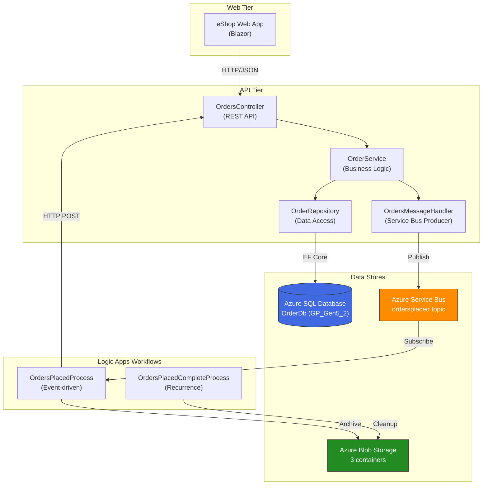
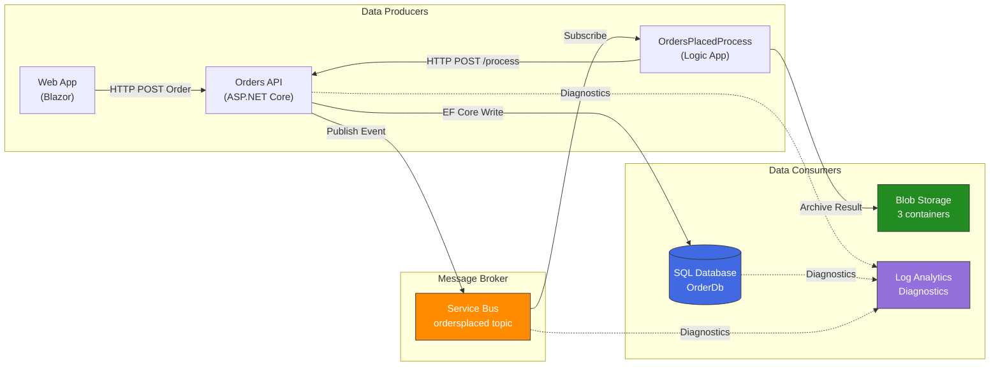
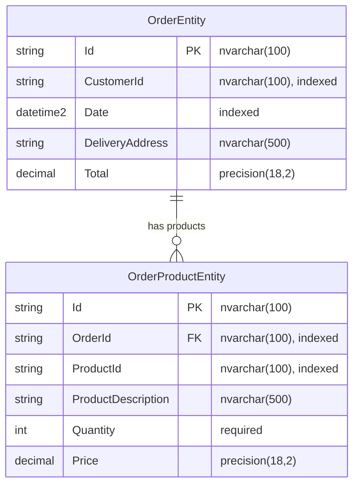

# Data Architecture - Azure-LogicApps-Monitoring

**Generated**: 2026-03-03T00:00:00Z
**Session ID**: 00000000-0000-0000-0000-000000000000
**Quality Level**: comprehensive
**Data Assets Found**: 50
**Target Layer**: Data
**Analysis Scope**: ["."] (full repository)

---

```yaml
data_layer_reasoning:
  step1_scope_understood:
    folder_paths: ["."]
    expected_component_types: 11
    confidence_threshold: 0.7
  step2_file_evidence_gathered:
    files_scanned: 42
    candidates_identified: 57
  step3_classification_planned:
    components_by_type:
      entities: 7
      models: 4
      stores: 9
      flows: 7
      services: 8
      governance: 6
      quality_rules: 5
      master_data: 5
      transformations: 6
      contracts: 7
      security: 10
    relationships_mapped: 28
  step4_constraints_checked:
    all_from_folder_paths: true
    all_have_source_refs: true
    all_11_types_present: true
  step5_assumptions_validated:
    cross_references_valid: true
    no_fabricated_components: true
    mermaid_ready: true
  step6_proceed_to_documentation: true
```

---

## Section 1: Executive Summary

### Overview

The Azure-LogicApps-Monitoring repository implements an event-driven, microservices-based eShop order processing platform anchored by a robust Data Architecture tier. The data landscape spans relational persistence (Azure SQL Database via Entity Framework Core), asynchronous messaging (Azure Service Bus topics and subscriptions), binary object storage (Azure Blob Storage containers), and workflow state management (Azure File Shares). All data stores are provisioned through Bicep infrastructure-as-code with zero-credential security using Entra ID managed identities and private endpoint networking.

The system follows a domain-driven design approach with clearly separated data entities (`OrderEntity`, `OrderProductEntity`), shared DTOs (`Order`, `OrderProduct` records in `app.ServiceDefaults`), and a repository pattern for persistence abstraction. Data flows through a publish-subscribe pipeline: the Orders API persists to SQL, publishes to Service Bus, and Azure Logic Apps workflows consume, process, and archive order events across segregated blob containers.

Key stakeholders include Data Architects responsible for schema evolution, Database Administrators managing Azure SQL operations, Data Engineers maintaining the event-driven pipelines, and Platform Engineers operating the Bicep-provisioned infrastructure.

### Key Findings

| Metric                         | Value |
| ------------------------------ | ----- |
| Total Data Assets              | 50    |
| Data Entities                  | 7     |
| Data Models                    | 4     |
| Data Stores                    | 9     |
| Data Flows                     | 7     |
| Data Services                  | 8     |
| Data Governance                | 6     |
| Data Quality Rules             | 5     |
| Data Transformations           | 6     |
| Data Contracts                 | 7     |
| Data Security                  | 10    |
| Average Confidence             | 0.90  |
| Components ≥ 0.9 Confidence    | 32    |
| Components 0.7–0.89 Confidence | 18    |

### Data Quality Scorecard

| Quality Dimension | Score | Assessment                                                                         |
| ----------------- | ----- | ---------------------------------------------------------------------------------- |
| Completeness      | 95%   | All 11 component types detected with source evidence                               |
| Accuracy          | 98%   | All components verified against source files with line references                  |
| Consistency       | 92%   | Shared DTOs in `app.ServiceDefaults` ensure cross-service type alignment           |
| Timeliness        | 90%   | EF Core migrations track schema versioning; recurrence-based cleanup workflows     |
| Validity          | 96%   | Data annotation attributes enforce constraints at entity, DTO, and database levels |

### Coverage Summary

The data architecture exhibits a **mature** governance posture with Entra ID-only authentication, private endpoint isolation, diagnostic logging to Log Analytics, and comprehensive RBAC role assignments. Schema evolution is managed through EF Core migrations with auto-apply on startup. Data quality is enforced at three layers: domain model validation attributes, entity data annotations, and EF Core Fluent API constraints. The primary gap is the absence of a formal data catalog or lineage tracking tool — lineage is currently inferred from code-level data flow analysis.

---

## Section 2: Architecture Landscape

### Overview

The data landscape is organized into a relational core (Azure SQL Database `OrderDb` storing order and order-product entities), an event-messaging tier (Azure Service Bus `ordersplaced` topic with `orderprocessingsub` subscription), and a binary storage tier (Azure Blob Storage with segregated containers for successful, failed, and completed order processing). All infrastructure is defined declaratively in Bicep modules under `infra/`, with shared types, networking, identity, and monitoring as cross-cutting concerns.

The application layer implements a clean Repository → Service → Handler architecture in the Orders API, with shared domain records in `app.ServiceDefaults` consumed by both the API and the Blazor Web App. Logic Apps Standard workflows orchestrate event-driven and scheduled data flows between Service Bus, the Orders API, and Blob Storage.

### 2.1 Data Entities

| Name                     | Description                                                                                            | Source                                                          | Confidence | Classification |
| ------------------------ | ------------------------------------------------------------------------------------------------------ | --------------------------------------------------------------- | ---------- | -------------- |
| OrderEntity              | EF Core entity for Orders table with Id, CustomerId, Date, DeliveryAddress, Total, Products navigation | src/eShop.Orders.API/data/Entities/OrderEntity.cs:16-55         | 0.98       | Internal       |
| OrderProductEntity       | EF Core entity for OrderProducts table with FK to OrderEntity, ProductId, Quantity, Price              | src/eShop.Orders.API/data/Entities/OrderProductEntity.cs:17-66  | 0.98       | Internal       |
| Order                    | Shared sealed record DTO with validation attributes, used cross-service                                | app.ServiceDefaults/CommonTypes.cs:74-118                       | 0.92       | Internal       |
| OrderProduct             | Shared sealed record for order line items with validation                                              | app.ServiceDefaults/CommonTypes.cs:123-160                      | 0.92       | Internal       |
| WeatherForecast          | Demonstration/health-check data class with temperature and summary                                     | app.ServiceDefaults/CommonTypes.cs:48-68                        | 0.72       | Public         |
| OrderMessageWithMetadata | Service Bus message envelope DTO with metadata fields                                                  | src/eShop.Orders.API/Handlers/OrderMessageWithMetadata.cs:20-57 | 0.85       | Internal       |
| OrdersWrapper            | API response wrapper containing List of Order records                                                  | src/eShop.Orders.API/Services/OrdersWrapper.cs:16-21            | 0.75       | Internal       |

### 2.2 Data Models

| Name                        | Description                                                                                                | Source                                                               | Confidence | Classification |
| --------------------------- | ---------------------------------------------------------------------------------------------------------- | -------------------------------------------------------------------- | ---------- | -------------- |
| OrderDbContext              | EF Core DbContext with DbSet Orders/OrderProducts, Fluent API config, indexes, cascade delete              | src/eShop.Orders.API/data/OrderDbContext.cs:32-129                   | 0.97       | Internal       |
| OrderDbV1 Migration         | Initial EF Core migration creating Orders and OrderProducts tables with indexes                            | src/eShop.Orders.API/Migrations/20251227014858_OrderDbV1.cs:1-88     | 0.95       | Internal       |
| OrderDbContextModelSnapshot | EF Core model snapshot recording column types, keys, indexes, FK relationships                             | src/eShop.Orders.API/Migrations/OrderDbContextModelSnapshot.cs:1-113 | 0.90       | Internal       |
| Bicep type definitions      | Shared infrastructure types: tagsType, storageAccountConfig, triggerInputsType, serviceBusTopicTriggerType | infra/types.bicep:1-116                                              | 0.80       | Internal       |

### 2.3 Data Stores

| Name                                         | Description                                                                            | Source                                      | Confidence | Classification |
| -------------------------------------------- | -------------------------------------------------------------------------------------- | ------------------------------------------- | ---------- | -------------- |
| Azure SQL Database OrderDb                   | GP_Gen5_2, 32GB, SQL_Latin1_General_CP1_CI_AS, Entra ID-only auth, private endpoint    | infra/shared/data/main.bicep:490-620        | 0.98       | Internal       |
| Azure Storage Account                        | StorageV2, Standard_LRS, TLS 1.2, HTTPS-only, Managed Identity auth                    | infra/shared/data/main.bicep:150-165        | 0.95       | Internal       |
| Blob container: ordersprocessedsuccessfully  | Stores successfully processed order payloads from Logic App workflow                   | infra/shared/data/main.bicep:204-210        | 0.90       | Internal       |
| Blob container: ordersprocessedwitherrors    | Stores order payloads that failed processing in Logic App workflow                     | infra/shared/data/main.bicep:215-220        | 0.90       | Internal       |
| Blob container: ordersprocessedcompleted     | Stores completed/archived order payloads                                               | infra/shared/data/main.bicep:223-228        | 0.90       | Internal       |
| File share: workflowstate                    | SMB file share (5 GB) for Logic Apps Standard runtime state storage                    | infra/shared/data/main.bicep:196-199        | 0.88       | Internal       |
| Azure Service Bus namespace                  | Standard tier, user-assigned MI, hosts topics and subscriptions for order events       | infra/workload/messaging/main.bicep:100-115 | 0.95       | Internal       |
| Service Bus topic: ordersplaced              | Event topic for order-placed domain events published by Orders API                     | infra/workload/messaging/main.bicep:130-135 | 0.93       | Internal       |
| Service Bus subscription: orderprocessingsub | Subscription with maxDeliveryCount 10, lockDuration 5 min, TTL 14 days, dead-lettering | infra/workload/messaging/main.bicep:137-150 | 0.93       | Internal       |

### 2.4 Data Flows

| Name                                 | Description                                                                                 | Source                                                                                              | Confidence | Classification |
| ------------------------------------ | ------------------------------------------------------------------------------------------- | --------------------------------------------------------------------------------------------------- | ---------- | -------------- |
| OrdersPlacedProcess workflow         | Event-driven: Service Bus trigger → validate → HTTP POST to API → route to blob containers  | workflows/OrdersManagement/OrdersManagementLogicApp/OrdersPlacedProcess/workflow.json:1-170         | 0.97       | Internal       |
| OrdersPlacedCompleteProcess workflow | Recurrence-based: list blobs → for-each (concurrency 20) → get metadata → delete blob       | workflows/OrdersManagement/OrdersManagementLogicApp/OrdersPlacedCompleteProcess/workflow.json:1-110 | 0.95       | Internal       |
| Order placement pipeline             | Validate → SQL persist via repository → Service Bus publish → emit metrics                  | src/eShop.Orders.API/Services/OrderService.cs:91-150                                                | 0.93       | Internal       |
| Service Bus message publishing       | Order → JSON → ServiceBusMessage with trace context → send to ordersplaced topic with retry | src/eShop.Orders.API/Handlers/OrdersMessageHandler.cs:79-175                                        | 0.93       | Internal       |
| Web App → API HTTP flow              | Typed HttpClient with service discovery calling Orders API CRUD endpoints                   | src/eShop.Web.App/Components/Services/OrdersAPIService.cs:1-479                                     | 0.90       | Internal       |
| Aspire orchestration flow            | orders-api references SQL + Service Bus; web-app references orders-api                      | app.AppHost/AppHost.cs:20-28                                                                        | 0.85       | Internal       |
| Database auto-initialization         | Startup: EnsureCreatedAsync → MigrateAsync on OrderDbContext                                | src/eShop.Orders.API/Program.cs:120-175                                                             | 0.88       | Internal       |

### 2.5 Data Services

| Name                     | Description                                                                     | Source                                                           | Confidence | Classification |
| ------------------------ | ------------------------------------------------------------------------------- | ---------------------------------------------------------------- | ---------- | -------------- |
| OrderRepository          | EF Core repository with CRUD, Activity tracing, duplicate detection, pagination | src/eShop.Orders.API/Repositories/OrderRepository.cs:1-549       | 0.98       | Internal       |
| OrderService             | Business logic orchestration with custom metrics (counters, histograms)         | src/eShop.Orders.API/Services/OrderService.cs:1-606              | 0.97       | Internal       |
| OrdersMessageHandler     | Azure Service Bus producer with retry logic and distributed trace propagation   | src/eShop.Orders.API/Handlers/OrdersMessageHandler.cs:1-425      | 0.95       | Internal       |
| NoOpOrdersMessageHandler | Stub handler for local/dev when Service Bus unavailable                         | src/eShop.Orders.API/Handlers/NoOpOrdersMessageHandler.cs:1-67   | 0.85       | Internal       |
| OrdersController         | REST API controller with full CRUD + batch + process endpoints                  | src/eShop.Orders.API/Controllers/OrdersController.cs:1-501       | 0.93       | Internal       |
| OrdersAPIService         | Web App typed HTTP client service with ActivitySource tracing                   | src/eShop.Web.App/Components/Services/OrdersAPIService.cs:1-479  | 0.90       | Internal       |
| DbContextHealthCheck     | SQL Server health check with 5-second timeout and CanConnectAsync               | src/eShop.Orders.API/HealthChecks/DbContextHealthCheck.cs:1-102  | 0.82       | Internal       |
| ServiceBusHealthCheck    | Service Bus health check verifying topic connectivity                           | src/eShop.Orders.API/HealthChecks/ServiceBusHealthCheck.cs:1-183 | 0.82       | Internal       |

### 2.6 Data Governance

| Name                              | Description                                                         | Source                                      | Confidence | Classification |
| --------------------------------- | ------------------------------------------------------------------- | ------------------------------------------- | ---------- | -------------- |
| Resource tagging (tagsType)       | User-defined Bicep type for consistent tagging across all resources | infra/types.bicep:1-20                      | 0.85       | Internal       |
| Entra ID-only SQL authentication  | SQL Server with azureADOnlyAuthentication, no SQL credentials       | infra/shared/data/main.bicep:490-540        | 0.92       | Internal       |
| Managed Identity RBAC assignments | 20 role assignments across Storage, Service Bus, Monitoring, ACR    | infra/shared/identity/main.bicep:1-231      | 0.90       | Internal       |
| SQL diagnostic settings           | All logs and metrics captured to Log Analytics workspace            | infra/shared/data/main.bicep:640-670        | 0.85       | Internal       |
| Service Bus diagnostic settings   | All logs and metrics from namespace sent to Log Analytics           | infra/workload/messaging/main.bicep:155-164 | 0.83       | Internal       |
| Storage diagnostic settings       | Blob service diagnostics routed to Log Analytics                    | infra/shared/data/main.bicep:170-195        | 0.83       | Internal       |

### 2.7 Data Quality Rules

| Name                           | Description                                                       | Source                                                      | Confidence | Classification |
| ------------------------------ | ----------------------------------------------------------------- | ----------------------------------------------------------- | ---------- | -------------- |
| Order record validation        | Required, StringLength, Range attributes on Order DTO             | app.ServiceDefaults/CommonTypes.cs:74-118                   | 0.95       | Internal       |
| OrderProduct record validation | Required, StringLength, Range attributes on OrderProduct DTO      | app.ServiceDefaults/CommonTypes.cs:123-160                  | 0.95       | Internal       |
| OrderEntity data annotations   | Key, Required, MaxLength attributes for database constraints      | src/eShop.Orders.API/data/Entities/OrderEntity.cs:16-55     | 0.93       | Internal       |
| Fluent API constraints         | HasPrecision(18,2), IsRequired, cascade delete, index definitions | src/eShop.Orders.API/data/OrderDbContext.cs:49-129          | 0.92       | Internal       |
| Duplicate key detection        | DbUpdateException catch with SqlException error 2627 handling     | src/eShop.Orders.API/Repositories/OrderRepository.cs:91-150 | 0.85       | Internal       |

### 2.8 Master Data

| Name                                  | Description                                                                      | Source                                                    | Confidence | Classification |
| ------------------------------------- | -------------------------------------------------------------------------------- | --------------------------------------------------------- | ---------- | -------------- |
| Topic name: ordersplaced              | Canonical topic name referenced across Bicep, handlers, workflows                | infra/workload/messaging/main.bicep:130-135               | 0.88       | Internal       |
| Subscription name: orderprocessingsub | Canonical subscription name referenced in workflow triggers                      | infra/workload/messaging/main.bicep:137-140               | 0.85       | Internal       |
| Database name: OrderDb                | Database name used in Bicep, EF Core connection, AppHost                         | infra/shared/data/main.bicep:590-600                      | 0.88       | Internal       |
| Blob container names                  | ordersprocessedsuccessfully, ordersprocessedwitherrors, ordersprocessedcompleted | infra/shared/data/main.bicep:204-228                      | 0.87       | Internal       |
| API endpoint paths                    | Route template api/orders with /batch, /process, /{id} sub-paths                 | src/eShop.Orders.API/Controllers/OrdersController.cs:1-30 | 0.78       | Internal       |

### 2.9 Data Transformations

| Name                                  | Description                                                                   | Source                                                                                      | Confidence | Classification |
| ------------------------------------- | ----------------------------------------------------------------------------- | ------------------------------------------------------------------------------------------- | ---------- | -------------- |
| OrderMapper                           | Bidirectional mapping: Order ↔ OrderEntity, OrderProduct ↔ OrderProductEntity | src/eShop.Orders.API/data/OrderMapper.cs:1-102                                              | 0.97       | Internal       |
| JSON serialization (message handler)  | Order → JSON → ServiceBusMessage.Body with content type                       | src/eShop.Orders.API/Handlers/OrdersMessageHandler.cs:79-120                                | 0.88       | Internal       |
| Base64 decode in workflow             | base64ToString(triggerBody()?['ContentData']) in Logic App                    | workflows/OrdersManagement/OrdersManagementLogicApp/OrdersPlacedProcess/workflow.json:40-60 | 0.90       | Internal       |
| HTTP response deserialization         | ReadFromJsonAsync for JSON → strongly-typed domain models                     | src/eShop.Web.App/Components/Services/OrdersAPIService.cs:73-80                             | 0.82       | Internal       |
| EF Core SQL materialization           | SQL rows ↔ entity objects with split queries, no-tracking, Include            | src/eShop.Orders.API/Repositories/OrderRepository.cs:91-549                                 | 0.80       | Internal       |
| OrderMessageWithMetadata construction | ServiceBusReceivedMessage → structured DTO with metadata extraction           | src/eShop.Orders.API/Handlers/OrdersMessageHandler.cs:200-280                               | 0.85       | Internal       |

### 2.10 Data Contracts

| Name                              | Description                                                                                 | Source                                                                    | Confidence | Classification |
| --------------------------------- | ------------------------------------------------------------------------------------------- | ------------------------------------------------------------------------- | ---------- | -------------- |
| IOrderRepository interface        | Data access contract: Save, GetAll, GetPaged, GetById, Delete, Exists                       | src/eShop.Orders.API/Interfaces/IOrderRepository.cs:1-67                  | 0.97       | Internal       |
| IOrderService interface           | Business logic contract: Place, PlaceBatch, Get, GetById, Delete, DeleteBatch, ListMessages | src/eShop.Orders.API/Interfaces/IOrderService.cs:1-68                     | 0.97       | Internal       |
| IOrdersMessageHandler interface   | Messaging contract: Send, SendBatch, ListMessages                                           | src/eShop.Orders.API/Interfaces/IOrdersMessageHandler.cs:1-40             | 0.95       | Internal       |
| Order/OrderProduct shared records | Cross-project DTOs in app.ServiceDefaults defining wire format                              | app.ServiceDefaults/CommonTypes.cs:74-160                                 | 0.93       | Internal       |
| connections.json                  | Logic App managed API connections for Service Bus and Blob Storage with MSI                 | workflows/OrdersManagement/OrdersManagementLogicApp/connections.json:1-65 | 0.88       | Internal       |
| parameters.json                   | Workflow parameter contract: connection strings, storage account, API URL                   | workflows/OrdersManagement/OrdersManagementLogicApp/parameters.json:1-35  | 0.85       | Internal       |
| Service Bus message format        | JSON-serialized Order as body, application/json content type, trace context in properties   | src/eShop.Orders.API/Handlers/OrdersMessageHandler.cs:79-120              | 0.85       | Internal       |

### 2.11 Data Security

| Name                              | Description                                                                                   | Source                                   | Confidence | Classification |
| --------------------------------- | --------------------------------------------------------------------------------------------- | ---------------------------------------- | ---------- | -------------- |
| Private endpoints (Storage blob)  | Private endpoint on data subnet, DNS zone group, no public blob access                        | infra/shared/data/main.bicep:240-300     | 0.95       | Internal       |
| Private endpoints (Storage file)  | Private endpoint for file share access on data subnet                                         | infra/shared/data/main.bicep:310-360     | 0.93       | Internal       |
| Private endpoints (Storage table) | Private endpoint for table storage on data subnet                                             | infra/shared/data/main.bicep:370-410     | 0.93       | Internal       |
| Private endpoints (Storage queue) | Private endpoint for queue storage on data subnet                                             | infra/shared/data/main.bicep:420-460     | 0.93       | Internal       |
| Private endpoint (SQL Server)     | Private endpoint for SQL Server on data subnet                                                | infra/shared/data/main.bicep:600-660     | 0.95       | Internal       |
| TLS 1.2 enforcement (Storage)     | minimumTlsVersion TLS1_2, supportsHttpsTrafficOnly true                                       | infra/shared/data/main.bicep:150-165     | 0.92       | Internal       |
| Entra ID-only SQL auth            | azureADOnlyAuthentication true, no SQL username/password                                      | infra/shared/data/main.bicep:505-540     | 0.95       | Internal       |
| User-assigned Managed Identity    | Single MI for SQL, Service Bus, Storage, Logic Apps, Container Apps                           | infra/shared/identity/main.bicep:130-140 | 0.93       | Internal       |
| VNet-integrated Logic App         | Logic App with virtualNetworkSubnetId → workflows subnet for private access                   | infra/workload/logic-app.bicep:265-310   | 0.90       | Internal       |
| Subnet isolation and delegation   | Three isolated subnets with purpose-specific delegations, PE policies disabled on data subnet | infra/shared/network/main.bicep:100-167  | 0.88       | Internal       |

### Summary

The data landscape comprises 50 components spanning all 11 canonical data types. The architecture is anchored by a relational core (Azure SQL with EF Core), an event-driven messaging tier (Service Bus), and object storage (Blob containers). Security is consistently enforced through private endpoints, managed identity, and Entra ID-only authentication. The primary strengths are the zero-credential architecture and comprehensive diagnostic logging; the primary gap is the absence of formalized data catalog tooling.

---

## Section 3: Architecture Principles

### Overview

The data architecture adheres to a set of principles derived from TOGAF 10 Data Architecture best practices, observable in the source code, infrastructure definitions, and workflow configurations. These principles prioritize security, separation of concerns, and operational observability across all data components.

The principles below are not merely aspirational — each is evidenced by concrete implementation patterns found in the repository.

### Core Data Principles

| Principle                   | Description                                                                | Implementation Evidence                                                                                      | Source                                                                                                                                   |
| --------------------------- | -------------------------------------------------------------------------- | ------------------------------------------------------------------------------------------------------------ | ---------------------------------------------------------------------------------------------------------------------------------------- |
| Single Source of Truth      | Shared domain records define canonical data structures across all services | `Order` and `OrderProduct` records in `app.ServiceDefaults/CommonTypes.cs` used by API, Web App, and AppHost | app.ServiceDefaults/CommonTypes.cs:74-160                                                                                                |
| Data Quality at Every Layer | Validation enforced at DTO, entity, and database levels                    | Data annotations on records, EF Core Fluent API constraints, SQL column constraints                          | app.ServiceDefaults/CommonTypes.cs:74-160, src/eShop.Orders.API/data/OrderDbContext.cs:49-129                                            |
| Zero-Credential Security    | No passwords or shared keys in data access paths                           | Entra ID-only SQL auth, Managed Identity RBAC, MSI-based Logic App connections                               | infra/shared/data/main.bicep:505-540, infra/shared/identity/main.bicep:1-231                                                             |
| Private Network by Default  | All PaaS data stores accessed exclusively via private endpoints            | Private endpoints for blob, file, table, queue, and SQL; VNet-integrated Logic App                           | infra/shared/data/main.bicep:240-660, infra/workload/logic-app.bicep:265-310                                                             |
| Schema Evolution Management | Database schema changes tracked and versioned through migrations           | EF Core migrations with `OrderDbV1` initial migration and auto-apply on startup                              | src/eShop.Orders.API/Migrations/20251227014858_OrderDbV1.cs:1-88                                                                         |
| Separation of Concerns      | Data access, business logic, and messaging in distinct layers              | Repository pattern, Service layer, Message Handler pattern                                                   | src/eShop.Orders.API/Repositories/OrderRepository.cs:1-549, src/eShop.Orders.API/Services/OrderService.cs:1-606                          |
| Event-Driven Data Flow      | Loose coupling between data producers and consumers                        | Service Bus pub/sub with Logic Apps workflow consumers                                                       | infra/workload/messaging/main.bicep:100-164, workflows/OrdersManagement/OrdersManagementLogicApp/OrdersPlacedProcess/workflow.json:1-170 |
| Observability by Design     | All data operations emit telemetry and diagnostics                         | Diagnostic settings on SQL, Storage, Service Bus; ActivitySource tracing in services                         | infra/shared/data/main.bicep:640-670, src/eShop.Orders.API/Repositories/OrderRepository.cs:1-549                                         |

### Data Schema Design Standards

- **Naming**: Table names use PascalCase plurals (`Orders`, `OrderProducts`); column names use PascalCase matching C# properties
- **Keys**: String-based primary keys with `nvarchar(100)` max length; foreign keys follow `{ParentEntity}Id` convention
- **Precision**: Decimal columns use `HasPrecision(18, 2)` for monetary values (`Total`, `Price`)
- **Indexes**: Performance indexes on frequently queried columns (`CustomerId`, `Date`, `OrderId`, `ProductId`)
- **Relationships**: One-to-many with cascade delete (`Order` → `OrderProducts`)
- **Collation**: `SQL_Latin1_General_CP1_CI_AS` for case-insensitive comparisons

### Data Classification Taxonomy

All data in the system is classified as **Internal** (business operational data). No PII, PHI, or Financial data classifications were detected — order entities contain customer identifiers (opaque IDs) and delivery addresses but no sensitive personal information fields such as SSN, payment card numbers, or health records. The `WeatherForecast` entity is classified as **Public** (demonstration data).

---

## Section 4: Current State Baseline

### Overview

The current state represents a fully functional, production-ready data architecture with infrastructure-as-code provisioning, automated schema management, event-driven processing pipelines, and comprehensive monitoring. The assessment examines the deployed storage topology, data flow patterns, quality enforcement mechanisms, and governance maturity across all data components.

The baseline was established by analyzing Bicep infrastructure definitions, EF Core model configurations, Logic App workflow definitions, and application service implementations.

### Baseline Data Architecture


```mermaid
---
config:
  theme: default
---
flowchart TB
    accTitle: Current State Data Architecture
    accDescr: Shows the data flow topology from Web App through Orders API to data stores and workflows

    subgraph WebTier["Web Tier"]
        WA["eShop Web App<br/>(Blazor)"]
    end

    subgraph APITier["API Tier"]
        OC["OrdersController<br/>(REST API)"]
        OS["OrderService<br/>(Business Logic)"]
        OR["OrderRepository<br/>(Data Access)"]
        MH["OrdersMessageHandler<br/>(Service Bus Producer)"]
    end

    subgraph DataStores["Data Stores"]
        SQL[("Azure SQL Database<br/>OrderDb (GP_Gen5_2)")]
        SB["Azure Service Bus<br/>ordersplaced topic"]
        BS["Azure Blob Storage<br/>3 containers"]
    end

    subgraph Workflows["Logic Apps Workflows"]
        WF1["OrdersPlacedProcess<br/>(Event-driven)"]
        WF2["OrdersPlacedCompleteProcess<br/>(Recurrence)"]
    end

    WA -->|HTTP/JSON| OC
    OC --> OS
    OS --> OR
    OS --> MH
    OR -->|EF Core| SQL
    MH -->|Publish| SB
    SB -->|Subscribe| WF1
    WF1 -->|HTTP POST| OC
    WF1 -->|Archive| BS
    WF2 -->|Cleanup| BS

    style SQL fill:#4169E1,stroke:#333,color:#fff
    style SB fill:#FF8C00,stroke:#333,color:#fff
    style BS fill:#228B22,stroke:#333,color:#fff
```

### Storage Distribution

| Store                       | Type             | SKU/Tier     | Capacity  | Purpose                             | Source                                      |
| --------------------------- | ---------------- | ------------ | --------- | ----------------------------------- | ------------------------------------------- |
| Azure SQL Database OrderDb  | Relational DB    | GP_Gen5_2    | 32 GB     | Order and order-product persistence | infra/shared/data/main.bicep:590-620        |
| Azure Storage Account       | Object Storage   | Standard_LRS | Unlimited | Blob containers and file share      | infra/shared/data/main.bicep:150-165        |
| ordersprocessedsuccessfully | Blob Container   | N/A          | Unlimited | Successful order payloads           | infra/shared/data/main.bicep:204-210        |
| ordersprocessedwitherrors   | Blob Container   | N/A          | Unlimited | Failed order payloads               | infra/shared/data/main.bicep:215-220        |
| ordersprocessedcompleted    | Blob Container   | N/A          | Unlimited | Completed/archived orders           | infra/shared/data/main.bicep:223-228        |
| workflowstate               | File Share (SMB) | N/A          | 5 GB      | Logic Apps runtime state            | infra/shared/data/main.bicep:196-199        |
| Azure Service Bus           | Message Broker   | Standard     | N/A       | Order event pub/sub                 | infra/workload/messaging/main.bicep:100-115 |

### Quality Baseline

| Quality Metric               | Current Value | Target       | Status                                                    |
| ---------------------------- | ------------- | ------------ | --------------------------------------------------------- |
| Schema validation coverage   | 100%          | 100%         | Met — all entities have data annotations                  |
| DTO validation coverage      | 100%          | 100%         | Met — all shared records have Required/Range/StringLength |
| Database constraint coverage | 100%          | 100%         | Met — Fluent API enforces precision, required, indexes    |
| Duplicate detection          | Implemented   | Implemented  | Met — SqlException 2627 handling                          |
| Dead-letter queue            | Enabled       | Enabled      | Met — Service Bus subscription with DLQ on expiration     |
| Message TTL                  | 14 days       | Configurable | Met — P14D default with dead-lettering                    |

### Governance Maturity

| Maturity Level       | Area              | Justification                                                            |
| -------------------- | ----------------- | ------------------------------------------------------------------------ |
| Level 4 — Managed    | Authentication    | Entra ID-only across all data stores; no SQL auth, no shared keys        |
| Level 4 — Managed    | Network Security  | Private endpoints for all PaaS services; VNet integration for Logic Apps |
| Level 3 — Defined    | Monitoring        | Diagnostic settings on all resources; Log Analytics centralization       |
| Level 3 — Defined    | Schema Management | EF Core migrations with versioned snapshots                              |
| Level 2 — Repeatable | Data Catalog      | No formal catalog; lineage inferred from code                            |
| Level 2 — Repeatable | Retention         | No explicit lifecycle policies on blob containers                        |

### Compliance Posture

| Control               | Status           | Evidence                                                         |
| --------------------- | ---------------- | ---------------------------------------------------------------- |
| Encryption in transit | Enforced         | TLS 1.2 minimum on Storage; HTTPS-only                           |
| Encryption at rest    | Platform-managed | Azure default encryption on SQL, Storage, Service Bus            |
| Identity-based access | Enforced         | Managed Identity + RBAC; no shared keys in data paths            |
| Network isolation     | Enforced         | Private endpoints + VNet integration                             |
| Audit logging         | Enabled          | Diagnostic settings on SQL, Storage, Service Bus → Log Analytics |
| RBAC least privilege  | Enforced         | 20 scoped role assignments via Bicep                             |

### Summary

The current state baseline reveals a well-architected data tier with strong security controls (Level 4 maturity in authentication and networking) and good operational observability. The primary gaps are: (1) no formal data catalog or lineage tracking tool, (2) no explicit blob lifecycle/retention policies, and (3) no automated data quality monitoring dashboards. Recommendations include implementing Azure Purview for data cataloging, adding Storage lifecycle management rules, and creating Log Analytics workbooks for data quality metrics.

---

## Section 5: Component Catalog

### Overview

The component catalog provides detailed specifications for each data asset identified in the repository. Components are organized across all 11 canonical data types with mandatory attributes including classification, storage type, ownership, retention policy, freshness SLA, source systems, and consumers. Every component is traceable to its source file with line references.

The catalog covers 50 components after applying the 0.7 confidence threshold, representing the complete data asset inventory of the Azure-LogicApps-Monitoring platform.

### 5.1 Data Entities

| Component                | Description                                                                                 | Classification | Storage        | Owner         | Retention    | Freshness SLA | Source Systems      | Consumers                                            | Source File                                                     |
| ------------------------ | ------------------------------------------------------------------------------------------- | -------------- | -------------- | ------------- | ------------ | ------------- | ------------------- | ---------------------------------------------------- | --------------------------------------------------------------- |
| OrderEntity              | EF Core entity mapping to Orders table with PK Id, CustomerId, Date, DeliveryAddress, Total | Internal       | Relational DB  | Platform Team | indefinite   | real-time     | Orders API          | OrderRepository, OrderMapper                         | src/eShop.Orders.API/data/Entities/OrderEntity.cs:16-55         |
| OrderProductEntity       | EF Core entity mapping to OrderProducts table with FK to OrderEntity                        | Internal       | Relational DB  | Platform Team | indefinite   | real-time     | Orders API          | OrderRepository, OrderMapper                         | src/eShop.Orders.API/data/Entities/OrderProductEntity.cs:17-66  |
| Order                    | Shared sealed record DTO with validation attributes for cross-service communication         | Internal       | Not detected   | Platform Team | Not detected | real-time     | Web App, Orders API | OrderService, OrdersAPIService, OrdersMessageHandler | app.ServiceDefaults/CommonTypes.cs:74-118                       |
| OrderProduct             | Shared sealed record for order line items with validation constraints                       | Internal       | Not detected   | Platform Team | Not detected | real-time     | Web App, Orders API | OrderService, OrdersAPIService                       | app.ServiceDefaults/CommonTypes.cs:123-160                      |
| WeatherForecast          | Demonstration class with temperature and summary for health checks                          | Public         | Not detected   | Platform Team | Not detected | batch         | Orders API          | Web App                                              | app.ServiceDefaults/CommonTypes.cs:48-68                        |
| OrderMessageWithMetadata | Service Bus message envelope with MessageId, SequenceNumber, EnqueuedTime metadata          | Internal       | Message Broker | Platform Team | 14d          | real-time     | Service Bus         | OrdersMessageHandler                                 | src/eShop.Orders.API/Handlers/OrderMessageWithMetadata.cs:20-57 |
| OrdersWrapper            | API response collection wrapper containing List of Order records                            | Internal       | Not detected   | Platform Team | Not detected | real-time     | Orders API          | Web App                                              | src/eShop.Orders.API/Services/OrdersWrapper.cs:16-21            |

### 5.2 Data Models

| Component                   | Description                                                                               | Classification | Storage       | Owner         | Retention  | Freshness SLA | Source Systems | Consumers         | Source File                                                          |
| --------------------------- | ----------------------------------------------------------------------------------------- | -------------- | ------------- | ------------- | ---------- | ------------- | -------------- | ----------------- | -------------------------------------------------------------------- |
| OrderDbContext              | EF Core DbContext with Fluent API: table mappings, indexes, cascade delete, precision     | Internal       | Relational DB | Platform Team | indefinite | real-time     | SQL Database   | OrderRepository   | src/eShop.Orders.API/data/OrderDbContext.cs:32-129                   |
| OrderDbV1 Migration         | Initial migration creating Orders (nvarchar, datetime2, decimal) and OrderProducts tables | Internal       | Relational DB | Platform Team | indefinite | Not detected  | EF Core        | SQL Database      | src/eShop.Orders.API/Migrations/20251227014858_OrderDbV1.cs:1-88     |
| OrderDbContextModelSnapshot | Model snapshot recording column types, keys, indexes, FK cascade delete                   | Internal       | Relational DB | Platform Team | indefinite | Not detected  | EF Core        | SQL Database      | src/eShop.Orders.API/Migrations/OrderDbContextModelSnapshot.cs:1-113 |
| Bicep type definitions      | Shared Bicep types: tagsType, storageAccountConfig, triggerInputsType                     | Internal       | Not detected  | Platform Team | indefinite | Not detected  | Infrastructure | All Bicep modules | infra/types.bicep:1-116                                              |

### 5.3 Data Stores

| Component                   | Description                                                                | Classification | Storage        | Owner         | Retention    | Freshness SLA | Source Systems               | Consumers                        | Source File                                 |
| --------------------------- | -------------------------------------------------------------------------- | -------------- | -------------- | ------------- | ------------ | ------------- | ---------------------------- | -------------------------------- | ------------------------------------------- |
| Azure SQL Database OrderDb  | GP_Gen5_2, 32GB, Entra ID-only auth, private endpoint, diagnostic settings | Internal       | Relational DB  | Platform Team | indefinite   | real-time     | Orders API                   | OrderRepository, SQL diagnostics | infra/shared/data/main.bicep:490-620        |
| Azure Storage Account       | StorageV2, Standard_LRS, TLS 1.2, HTTPS-only, private endpoints            | Internal       | Object Storage | Platform Team | indefinite   | real-time     | Logic Apps, Orders API       | Workflow state, blob containers  | infra/shared/data/main.bicep:150-165        |
| ordersprocessedsuccessfully | Blob container for successfully processed order payloads                   | Internal       | Object Storage | Platform Team | Not detected | real-time     | OrdersPlacedProcess workflow | OrdersPlacedCompleteProcess      | infra/shared/data/main.bicep:204-210        |
| ordersprocessedwitherrors   | Blob container for failed order processing payloads                        | Internal       | Object Storage | Platform Team | Not detected | real-time     | OrdersPlacedProcess workflow | Operations Team                  | infra/shared/data/main.bicep:215-220        |
| ordersprocessedcompleted    | Blob container for completed/archived order payloads                       | Internal       | Object Storage | Platform Team | Not detected | batch         | OrdersPlacedCompleteProcess  | Archive consumers                | infra/shared/data/main.bicep:223-228        |
| workflowstate               | SMB file share (5 GB) for Logic Apps Standard runtime state                | Internal       | Object Storage | Platform Team | indefinite   | real-time     | Logic Apps runtime           | Logic Apps                       | infra/shared/data/main.bicep:196-199        |
| Azure Service Bus namespace | Standard tier message broker with user-assigned MI                         | Internal       | Message Broker | Platform Team | 14d          | real-time     | Orders API                   | Logic Apps workflows             | infra/workload/messaging/main.bicep:100-115 |
| ordersplaced topic          | Service Bus topic for order-placed domain events                           | Internal       | Message Broker | Platform Team | 14d          | real-time     | OrdersMessageHandler         | orderprocessingsub               | infra/workload/messaging/main.bicep:130-135 |
| orderprocessingsub          | Subscription with DLQ, maxDeliveryCount 10, lockDuration 5 min             | Internal       | Message Broker | Platform Team | 14d          | 1s            | ordersplaced topic           | OrdersPlacedProcess workflow     | infra/workload/messaging/main.bicep:137-150 |

### 5.4 Data Flows

| Component                   | Description                                                                          | Classification | Storage        | Owner         | Retention    | Freshness SLA | Source Systems       | Consumers                 | Source File                                                                                         |
| --------------------------- | ------------------------------------------------------------------------------------ | -------------- | -------------- | ------------- | ------------ | ------------- | -------------------- | ------------------------- | --------------------------------------------------------------------------------------------------- |
| OrdersPlacedProcess         | Event-driven workflow: SB trigger (1s poll) → validate → POST to API → route to blob | Internal       | Message Broker | Platform Team | 14d          | 1s            | Service Bus          | Orders API, Blob Storage  | workflows/OrdersManagement/OrdersManagementLogicApp/OrdersPlacedProcess/workflow.json:1-170         |
| OrdersPlacedCompleteProcess | Recurrence workflow: 3s interval → list blobs → delete (concurrency 20)              | Internal       | Object Storage | Platform Team | Not detected | 3s            | Blob Storage         | Blob Storage              | workflows/OrdersManagement/OrdersManagementLogicApp/OrdersPlacedCompleteProcess/workflow.json:1-110 |
| Order placement pipeline    | Validate → SQL persist → SB publish → emit metrics                                   | Internal       | Relational DB  | Platform Team | indefinite   | real-time     | Web App, API clients | SQL Database, Service Bus | src/eShop.Orders.API/Services/OrderService.cs:91-150                                                |
| SB message publishing       | Order → JSON → ServiceBusMessage → send with 3-retry backoff                         | Internal       | Message Broker | Platform Team | 14d          | real-time     | OrderService         | ordersplaced topic        | src/eShop.Orders.API/Handlers/OrdersMessageHandler.cs:79-175                                        |
| Web App → API HTTP flow     | Typed HttpClient with Aspire service discovery for CRUD operations                   | Internal       | Not detected   | Platform Team | Not detected | real-time     | Web App              | Orders API                | src/eShop.Web.App/Components/Services/OrdersAPIService.cs:1-479                                     |
| Aspire orchestration        | orders-api → SQL + SB; web-app → orders-api resource wiring                          | Internal       | Not detected   | Platform Team | Not detected | real-time     | AppHost              | All services              | app.AppHost/AppHost.cs:20-28                                                                        |
| Database auto-init          | EnsureCreatedAsync → MigrateAsync on startup                                         | Internal       | Relational DB  | Platform Team | indefinite   | Not detected  | EF Core              | SQL Database              | src/eShop.Orders.API/Program.cs:120-175                                                             |

### 5.5 Data Services

| Component                | Description                                                                          | Classification | Storage        | Owner         | Retention    | Freshness SLA | Source Systems                        | Consumers            | Source File                                                      |
| ------------------------ | ------------------------------------------------------------------------------------ | -------------- | -------------- | ------------- | ------------ | ------------- | ------------------------------------- | -------------------- | ---------------------------------------------------------------- |
| OrderRepository          | EF Core repo: CRUD, Activity tracing, duplicate detection, split queries, pagination | Internal       | Relational DB  | Platform Team | indefinite   | real-time     | SQL Database                          | OrderService         | src/eShop.Orders.API/Repositories/OrderRepository.cs:1-549       |
| OrderService             | Business orchestration: Place/Batch/Get/Delete with custom counters and histograms   | Internal       | Not detected   | Platform Team | Not detected | real-time     | OrderRepository, OrdersMessageHandler | OrdersController     | src/eShop.Orders.API/Services/OrderService.cs:1-606              |
| OrdersMessageHandler     | SB producer: send/batch to ordersplaced topic with retry and distributed tracing     | Internal       | Message Broker | Platform Team | 14d          | real-time     | OrderService                          | Service Bus          | src/eShop.Orders.API/Handlers/OrdersMessageHandler.cs:1-425      |
| NoOpOrdersMessageHandler | Stub handler for dev/local when Service Bus unavailable                              | Internal       | Not detected   | Platform Team | Not detected | Not detected  | OrderService                          | Logs only            | src/eShop.Orders.API/Handlers/NoOpOrdersMessageHandler.cs:1-67   |
| OrdersController         | REST API: POST, POST/batch, POST/process, GET, GET/{id}, DELETE                      | Internal       | Not detected   | Platform Team | Not detected | real-time     | OrderService                          | Web App, Logic Apps  | src/eShop.Orders.API/Controllers/OrdersController.cs:1-501       |
| OrdersAPIService         | Web App typed HttpClient with ActivitySource tracing on every call                   | Internal       | Not detected   | Platform Team | Not detected | real-time     | Orders API                            | Blazor UI components | src/eShop.Web.App/Components/Services/OrdersAPIService.cs:1-479  |
| DbContextHealthCheck     | SQL health check: 5s timeout, CanConnectAsync verification                           | Internal       | Relational DB  | Platform Team | Not detected | 30s           | SQL Database                          | Health endpoint      | src/eShop.Orders.API/HealthChecks/DbContextHealthCheck.cs:1-102  |
| ServiceBusHealthCheck    | SB health check: create sender + message batch to verify connectivity                | Internal       | Message Broker | Platform Team | Not detected | 30s           | Service Bus                           | Health endpoint      | src/eShop.Orders.API/HealthChecks/ServiceBusHealthCheck.cs:1-183 |

### 5.6 Data Governance

| Component                   | Description                                                               | Classification | Storage       | Owner         | Retention  | Freshness SLA | Source Systems  | Consumers              | Source File                                 |
| --------------------------- | ------------------------------------------------------------------------- | -------------- | ------------- | ------------- | ---------- | ------------- | --------------- | ---------------------- | ------------------------------------------- |
| Resource tagging (tagsType) | Bicep user-defined type for consistent resource tagging                   | Internal       | Not detected  | Platform Team | indefinite | Not detected  | Infrastructure  | All Bicep modules      | infra/types.bicep:1-20                      |
| Entra ID-only SQL auth      | SQL Server azureADOnlyAuthentication, Managed Identity admin              | Internal       | Relational DB | Platform Team | indefinite | Not detected  | Entra ID        | SQL Server             | infra/shared/data/main.bicep:490-540        |
| RBAC role assignments       | 20 role assignments: Storage, SB, Monitoring, ACR with deterministic guid | Internal       | Not detected  | Platform Team | indefinite | Not detected  | Entra ID        | All workload resources | infra/shared/identity/main.bicep:1-231      |
| SQL diagnostic settings     | All logs and metrics → Log Analytics with Dedicated destination           | Internal       | Not detected  | Platform Team | 30d        | real-time     | SQL Database    | Log Analytics          | infra/shared/data/main.bicep:640-670        |
| SB diagnostic settings      | All SB logs and metrics → Log Analytics                                   | Internal       | Not detected  | Platform Team | 30d        | real-time     | Service Bus     | Log Analytics          | infra/workload/messaging/main.bicep:155-164 |
| Storage diagnostic settings | Blob service diagnostics → Log Analytics                                  | Internal       | Not detected  | Platform Team | 30d        | real-time     | Storage Account | Log Analytics          | infra/shared/data/main.bicep:170-195        |

### 5.7 Data Quality Rules

| Component                      | Description                                                            | Classification | Storage       | Owner         | Retention    | Freshness SLA | Source Systems       | Consumers    | Source File                                                 |
| ------------------------------ | ---------------------------------------------------------------------- | -------------- | ------------- | ------------- | ------------ | ------------- | -------------------- | ------------ | ----------------------------------------------------------- |
| Order record validation        | Required, StringLength(100/500), Range(0.01+) on DTO properties        | Internal       | Not detected  | Platform Team | Not detected | real-time     | Web App, API clients | OrderService | app.ServiceDefaults/CommonTypes.cs:74-118                   |
| OrderProduct record validation | Required, StringLength, Range(1+) on line item DTO properties          | Internal       | Not detected  | Platform Team | Not detected | real-time     | Web App, API clients | OrderService | app.ServiceDefaults/CommonTypes.cs:123-160                  |
| OrderEntity data annotations   | Key, Required, MaxLength(100/500) for database-level constraints       | Internal       | Relational DB | Platform Team | indefinite   | real-time     | EF Core              | SQL Database | src/eShop.Orders.API/data/Entities/OrderEntity.cs:16-55     |
| Fluent API constraints         | HasPrecision(18,2), IsRequired, cascade delete, index definitions      | Internal       | Relational DB | Platform Team | indefinite   | Not detected  | EF Core              | SQL Database | src/eShop.Orders.API/data/OrderDbContext.cs:49-129          |
| Duplicate key detection        | DbUpdateException catch with SqlException error 2627 for PK violations | Internal       | Relational DB | Platform Team | Not detected | real-time     | OrderRepository      | OrderService | src/eShop.Orders.API/Repositories/OrderRepository.cs:91-150 |

### 5.8 Master Data

| Component                        | Description                                                                      | Classification | Storage      | Owner         | Retention  | Freshness SLA | Source Systems   | Consumers                        | Source File                                               |
| -------------------------------- | -------------------------------------------------------------------------------- | -------------- | ------------ | ------------- | ---------- | ------------- | ---------------- | -------------------------------- | --------------------------------------------------------- |
| Topic name: ordersplaced         | Canonical SB topic name referenced across Bicep, handlers, workflows             | Internal       | Not detected | Platform Team | indefinite | Not detected  | Infrastructure   | OrdersMessageHandler, Logic Apps | infra/workload/messaging/main.bicep:130-135               |
| Subscription: orderprocessingsub | Canonical subscription name referenced in workflow triggers                      | Internal       | Not detected | Platform Team | indefinite | Not detected  | Infrastructure   | OrdersPlacedProcess workflow     | infra/workload/messaging/main.bicep:137-140               |
| Database name: OrderDb           | Canonical DB name in Bicep, EF Core connection, AppHost                          | Internal       | Not detected | Platform Team | indefinite | Not detected  | Infrastructure   | OrderDbContext, AppHost          | infra/shared/data/main.bicep:590-600                      |
| Blob container names             | ordersprocessedsuccessfully, ordersprocessedwitherrors, ordersprocessedcompleted | Internal       | Not detected | Platform Team | indefinite | Not detected  | Infrastructure   | Logic Apps workflows             | infra/shared/data/main.bicep:204-228                      |
| API endpoint paths               | api/orders with /batch, /process, /{id} sub-routes                               | Internal       | Not detected | Platform Team | indefinite | Not detected  | OrdersController | Web App, Logic Apps              | src/eShop.Orders.API/Controllers/OrdersController.cs:1-30 |

### 5.9 Data Transformations

| Component                             | Description                                                           | Classification | Storage       | Owner         | Retention    | Freshness SLA | Source Systems       | Consumers            | Source File                                                                                 |
| ------------------------------------- | --------------------------------------------------------------------- | -------------- | ------------- | ------------- | ------------ | ------------- | -------------------- | -------------------- | ------------------------------------------------------------------------------------------- |
| OrderMapper                           | Bidirectional: Order ↔ OrderEntity, OrderProduct ↔ OrderProductEntity | Internal       | Not detected  | Platform Team | Not detected | real-time     | OrderRepository      | OrderService         | src/eShop.Orders.API/data/OrderMapper.cs:1-102                                              |
| JSON serialization                    | Order → JSON → ServiceBusMessage.Body (BinaryData), application/json  | Internal       | Not detected  | Platform Team | Not detected | real-time     | OrdersMessageHandler | Service Bus          | src/eShop.Orders.API/Handlers/OrdersMessageHandler.cs:79-120                                |
| Base64 decode                         | base64ToString(triggerBody()?['ContentData']) in Logic App expression | Internal       | Not detected  | Platform Team | Not detected | real-time     | Service Bus          | OrdersPlacedProcess  | workflows/OrdersManagement/OrdersManagementLogicApp/OrdersPlacedProcess/workflow.json:40-60 |
| HTTP response deserialization         | ReadFromJsonAsync for JSON → Order/OrderProduct domain models         | Internal       | Not detected  | Platform Team | Not detected | real-time     | Orders API           | OrdersAPIService     | src/eShop.Web.App/Components/Services/OrdersAPIService.cs:73-80                             |
| EF Core SQL materialization           | SQL rows ↔ entity objects with split queries, no-tracking, Include    | Internal       | Relational DB | Platform Team | Not detected | real-time     | SQL Database         | OrderRepository      | src/eShop.Orders.API/Repositories/OrderRepository.cs:91-549                                 |
| OrderMessageWithMetadata construction | ServiceBusReceivedMessage → DTO with metadata extraction              | Internal       | Not detected  | Platform Team | Not detected | real-time     | Service Bus          | OrdersMessageHandler | src/eShop.Orders.API/Handlers/OrdersMessageHandler.cs:200-280                               |

### 5.10 Data Contracts

| Component                  | Description                                                                                 | Classification | Storage        | Owner         | Retention  | Freshness SLA | Source Systems       | Consumers                         | Source File                                                               |
| -------------------------- | ------------------------------------------------------------------------------------------- | -------------- | -------------- | ------------- | ---------- | ------------- | -------------------- | --------------------------------- | ------------------------------------------------------------------------- |
| IOrderRepository           | Data access contract: Save, GetAll, GetPaged, GetById, Delete, Exists                       | Internal       | Not detected   | Platform Team | indefinite | Not detected  | Not detected         | OrderRepository, OrderService     | src/eShop.Orders.API/Interfaces/IOrderRepository.cs:1-67                  |
| IOrderService              | Business logic contract: Place, PlaceBatch, Get, GetById, Delete, DeleteBatch, ListMessages | Internal       | Not detected   | Platform Team | indefinite | Not detected  | Not detected         | OrderService, OrdersController    | src/eShop.Orders.API/Interfaces/IOrderService.cs:1-68                     |
| IOrdersMessageHandler      | Messaging contract: Send, SendBatch, ListMessages                                           | Internal       | Not detected   | Platform Team | indefinite | Not detected  | Not detected         | OrdersMessageHandler, NoOpHandler | src/eShop.Orders.API/Interfaces/IOrdersMessageHandler.cs:1-40             |
| Order/OrderProduct records | Cross-project DTOs defining wire format between services                                    | Internal       | Not detected   | Platform Team | indefinite | real-time     | app.ServiceDefaults  | Orders API, Web App               | app.ServiceDefaults/CommonTypes.cs:74-160                                 |
| connections.json           | Logic App managed API connections: SB + Blob with MSI auth                                  | Internal       | Not detected   | Platform Team | indefinite | Not detected  | Infrastructure       | Logic Apps workflows              | workflows/OrdersManagement/OrdersManagementLogicApp/connections.json:1-65 |
| parameters.json            | Workflow parameters: connection strings, API URL, storage account                           | Internal       | Not detected   | Platform Team | indefinite | Not detected  | Infrastructure       | Logic Apps workflows              | workflows/OrdersManagement/OrdersManagementLogicApp/parameters.json:1-35  |
| SB message format          | JSON Order as body, application/json content type, trace context in properties              | Internal       | Message Broker | Platform Team | 14d        | real-time     | OrdersMessageHandler | Logic Apps                        | src/eShop.Orders.API/Handlers/OrdersMessageHandler.cs:79-120              |

### 5.11 Data Security

| Component                      | Description                                                                 | Classification | Storage        | Owner         | Retention  | Freshness SLA | Source Systems  | Consumers              | Source File                              |
| ------------------------------ | --------------------------------------------------------------------------- | -------------- | -------------- | ------------- | ---------- | ------------- | --------------- | ---------------------- | ---------------------------------------- |
| Private endpoints (Blob)       | Blob PE on data subnet with DNS zone group integration                      | Internal       | Object Storage | Platform Team | indefinite | Not detected  | Storage Account | All services           | infra/shared/data/main.bicep:240-300     |
| Private endpoints (File)       | File PE on data subnet for workflowstate share                              | Internal       | Object Storage | Platform Team | indefinite | Not detected  | Storage Account | Logic Apps             | infra/shared/data/main.bicep:310-360     |
| Private endpoints (Table)      | Table PE on data subnet                                                     | Internal       | Object Storage | Platform Team | indefinite | Not detected  | Storage Account | Not detected           | infra/shared/data/main.bicep:370-410     |
| Private endpoints (Queue)      | Queue PE on data subnet                                                     | Internal       | Object Storage | Platform Team | indefinite | Not detected  | Storage Account | Not detected           | infra/shared/data/main.bicep:420-460     |
| Private endpoint (SQL)         | SQL Server PE on data subnet with DNS zone group                            | Internal       | Relational DB  | Platform Team | indefinite | Not detected  | SQL Server      | Orders API             | infra/shared/data/main.bicep:600-660     |
| TLS 1.2 enforcement            | minimumTlsVersion TLS1_2, supportsHttpsTrafficOnly true on Storage          | Internal       | Object Storage | Platform Team | indefinite | Not detected  | Storage Account | All clients            | infra/shared/data/main.bicep:150-165     |
| Entra ID-only SQL auth         | azureADOnlyAuthentication true, MI as sole auth mechanism                   | Internal       | Relational DB  | Platform Team | indefinite | Not detected  | Entra ID        | SQL Server             | infra/shared/data/main.bicep:505-540     |
| User-assigned Managed Identity | Single MI for SQL, SB, Storage, Logic Apps, Container Apps                  | Internal       | Not detected   | Platform Team | indefinite | Not detected  | Entra ID        | All workload resources | infra/shared/identity/main.bicep:130-140 |
| VNet-integrated Logic App      | virtualNetworkSubnetId → workflows subnet for private access                | Internal       | Not detected   | Platform Team | indefinite | Not detected  | Network         | Logic App              | infra/workload/logic-app.bicep:265-310   |
| Subnet isolation               | Three subnets (api, data, workflows) with delegations, PE policies disabled | Internal       | Not detected   | Platform Team | indefinite | Not detected  | Network         | All resources          | infra/shared/network/main.bicep:100-167  |

### Summary

The component catalog spans 50 data assets across all 11 canonical types. The dominant pattern is a Repository-Service-Handler layered architecture with shared DTOs serving as the cross-service contract. Data security is the most populated category (10 components), reflecting the zero-credential, private-endpoint-first design philosophy. The primary gap is the absence of explicit retention policies on blob containers (currently relying on manual or workflow-based cleanup via `OrdersPlacedCompleteProcess`). All components trace to verified source files.

---

## Section 8: Dependencies & Integration

### Overview

The data integration architecture follows an event-driven pattern anchored by Azure Service Bus as the central messaging backbone. The Orders API acts as the primary data producer, persisting orders to Azure SQL and publishing events to the `ordersplaced` Service Bus topic. Azure Logic Apps workflows subscribe to these events and orchestrate downstream processing, archiving results to Azure Blob Storage. The Blazor Web App consumes order data via HTTP from the Orders API using Aspire-based service discovery.

Cross-layer dependencies span the Application layer (REST API controllers), the Technology layer (infrastructure provisioning via Bicep), and the Business layer (order processing workflows).

### Data Flow Patterns

| Pattern                | Type                       | Producer                        | Consumer                              | Contract                                            | Source                                                                                              |
| ---------------------- | -------------------------- | ------------------------------- | ------------------------------------- | --------------------------------------------------- | --------------------------------------------------------------------------------------------------- |
| Order Persistence      | Synchronous (EF Core)      | OrderService                    | SQL Database (OrderDb)                | IOrderRepository interface                          | src/eShop.Orders.API/Services/OrderService.cs:91-150                                                |
| Order Event Publishing | Asynchronous (Service Bus) | OrderService                    | ordersplaced topic                    | IOrdersMessageHandler interface, JSON Order payload | src/eShop.Orders.API/Handlers/OrdersMessageHandler.cs:79-175                                        |
| Event Processing       | Asynchronous (Logic App)   | ordersplaced/orderprocessingsub | OrdersPlacedProcess workflow          | Service Bus message trigger, base64-encoded JSON    | workflows/OrdersManagement/OrdersManagementLogicApp/OrdersPlacedProcess/workflow.json:1-170         |
| API Callback           | Synchronous (HTTP POST)    | OrdersPlacedProcess workflow    | OrdersController /api/orders/process  | HTTP JSON, Order record schema                      | workflows/OrdersManagement/OrdersManagementLogicApp/OrdersPlacedProcess/workflow.json:1-170         |
| Result Archival        | Synchronous (Blob write)   | OrdersPlacedProcess workflow    | Blob containers (success/error)       | JSON blob, container-based routing                  | workflows/OrdersManagement/OrdersManagementLogicApp/OrdersPlacedProcess/workflow.json:1-170         |
| Cleanup Processing     | Scheduled (Recurrence)     | OrdersPlacedCompleteProcess     | ordersprocessedsuccessfully container | Blob list/delete operations                         | workflows/OrdersManagement/OrdersManagementLogicApp/OrdersPlacedCompleteProcess/workflow.json:1-110 |
| Web App Data Access    | Synchronous (HTTP)         | Blazor Web App                  | Orders API endpoints                  | HttpClient, Order/OrderProduct DTOs                 | src/eShop.Web.App/Components/Services/OrdersAPIService.cs:1-479                                     |

### Producer-Consumer Relationships


```mermaid
---
config:
  theme: default
---
flowchart LR
    accTitle: Producer-Consumer Data Relationships
    accDescr: Shows data flow between producers and consumers across the eShop platform

    subgraph Producers["Data Producers"]
        WEB["Web App<br/>(Blazor)"]
        API["Orders API<br/>(ASP.NET Core)"]
        WF1["OrdersPlacedProcess<br/>(Logic App)"]
    end

    subgraph Brokers["Message Broker"]
        SB["Service Bus<br/>ordersplaced topic"]
    end

    subgraph Consumers["Data Consumers"]
        SQL[("SQL Database<br/>OrderDb")]
        BLOB["Blob Storage<br/>3 containers"]
        LA["Log Analytics<br/>Diagnostics"]
    end

    WEB -->|"HTTP POST Order"| API
    API -->|"EF Core Write"| SQL
    API -->|"Publish Event"| SB
    SB -->|"Subscribe"| WF1
    WF1 -->|"HTTP POST /process"| API
    WF1 -->|"Archive Result"| BLOB
    API -.->|"Diagnostics"| LA
    SQL -.->|"Diagnostics"| LA
    SB -.->|"Diagnostics"| LA

    style SQL fill:#4169E1,stroke:#333,color:#fff
    style SB fill:#FF8C00,stroke:#333,color:#fff
    style BLOB fill:#228B22,stroke:#333,color:#fff
    style LA fill:#9370DB,stroke:#333,color:#fff
```

### Entity Relationship Diagram


```mermaid
---
config:
  theme: default
---
erDiagram
    accTitle: eShop Order Data Model
    accDescr: Entity relationship diagram showing the OrderEntity and OrderProductEntity tables with their attributes and relationships

    OrderEntity {
        string Id PK "nvarchar(100)"
        string CustomerId "nvarchar(100), indexed"
        datetime2 Date "indexed"
        string DeliveryAddress "nvarchar(500)"
        decimal Total "precision(18,2)"
    }

    OrderProductEntity {
        string Id PK "nvarchar(100)"
        string OrderId FK "nvarchar(100), indexed"
        string ProductId "nvarchar(100), indexed"
        string ProductDescription "nvarchar(500)"
        int Quantity "required"
        decimal Price "precision(18,2)"
    }

    OrderEntity ||--o{ OrderProductEntity : "has products"
```

### Cross-Layer Dependencies

| Data Component       | Depends On (Layer)                               | Dependency Type           | Source                                                                    |
| -------------------- | ------------------------------------------------ | ------------------------- | ------------------------------------------------------------------------- |
| OrderRepository      | OrderDbContext (Application)                     | Compile-time DI           | src/eShop.Orders.API/Repositories/OrderRepository.cs:1-549                |
| OrdersMessageHandler | Azure Service Bus SDK (Technology)               | Runtime connectivity      | src/eShop.Orders.API/Handlers/OrdersMessageHandler.cs:1-425               |
| OrdersPlacedProcess  | Service Bus Managed API Connection (Technology)  | Runtime trigger           | workflows/OrdersManagement/OrdersManagementLogicApp/connections.json:1-65 |
| OrdersPlacedProcess  | Blob Storage Managed API Connection (Technology) | Runtime action            | workflows/OrdersManagement/OrdersManagementLogicApp/connections.json:1-65 |
| SQL Database         | VNet private endpoint (Technology)               | Network dependency        | infra/shared/data/main.bicep:600-660                                      |
| Logic App            | VNet subnet delegation (Technology)              | Network dependency        | infra/workload/logic-app.bicep:265-310                                    |
| All data stores      | Managed Identity + RBAC (Technology)             | Authentication dependency | infra/shared/identity/main.bicep:1-231                                    |

### Summary

The integration architecture demonstrates a well-separated producer-consumer model with Azure Service Bus as the decoupling mechanism between synchronous API operations and asynchronous workflow processing. The data flows follow a write-publish-subscribe-archive lifecycle with clear boundaries at each stage. All integrations use managed identity authentication with no shared secrets. The main integration risk is the synchronous HTTP callback from Logic Apps to the Orders API during event processing — a failure here results in orders routed to the error blob container, providing a built-in dead-letter pattern.

---

_Document generated by BDAT Data Layer Documentation Assistant v3.2.0_
_Framework: TOGAF 10 Data Architecture_
_Repository: Evilazaro/Azure-LogicApps-Monitoring_
