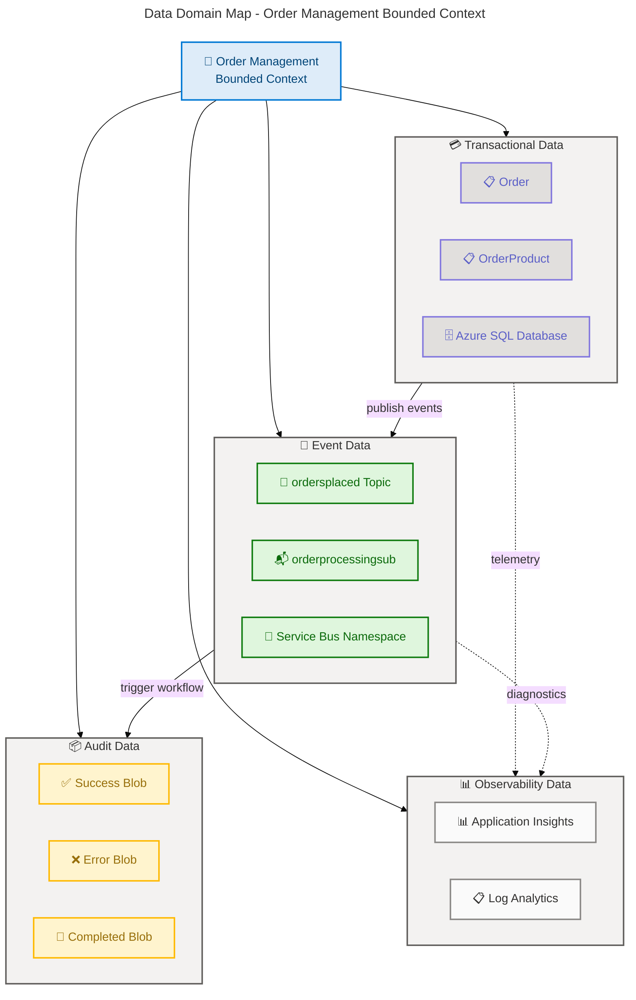
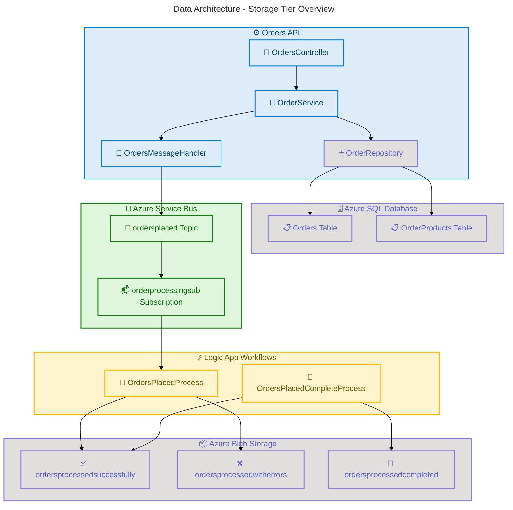
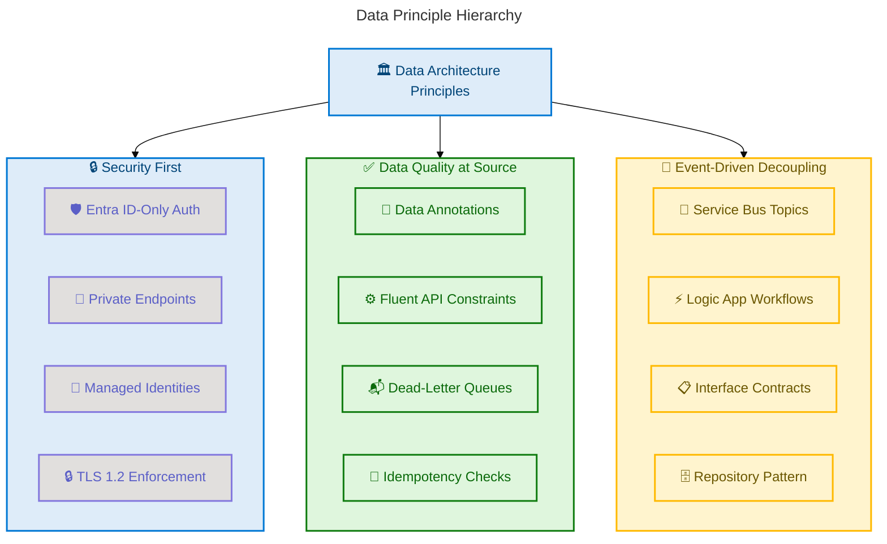
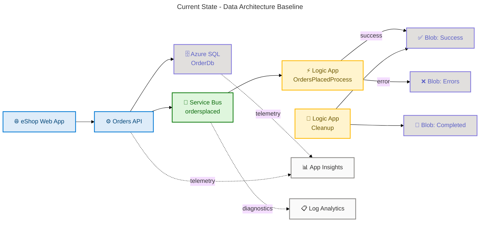
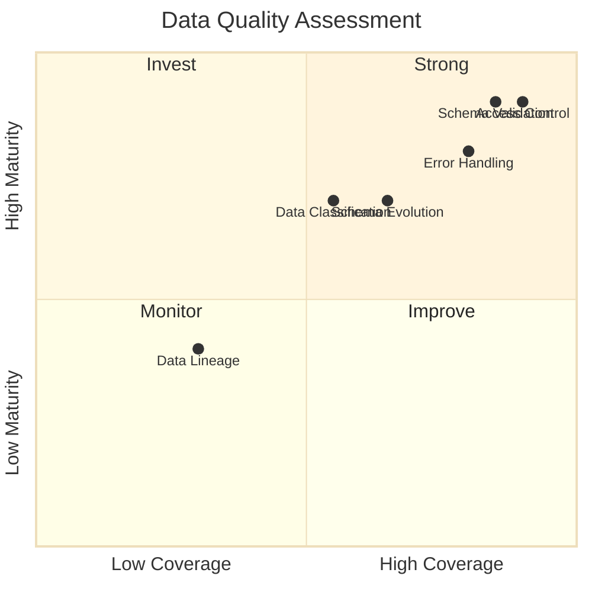
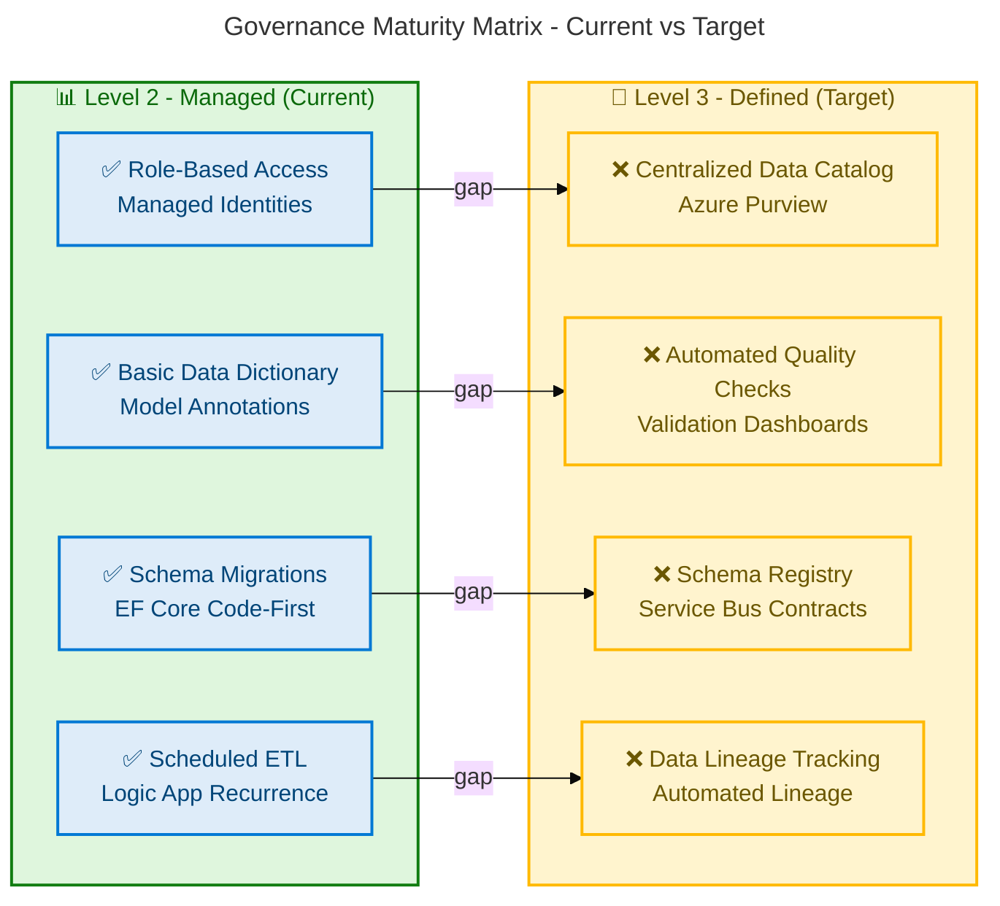
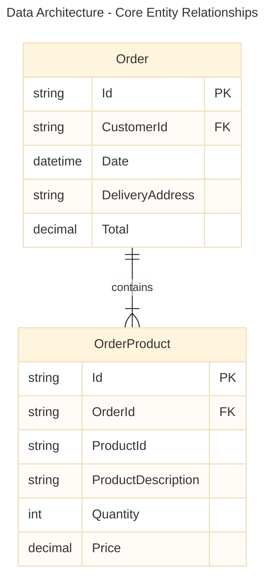
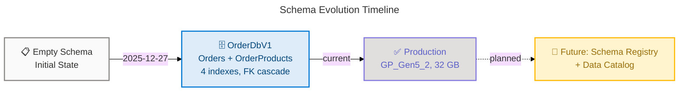
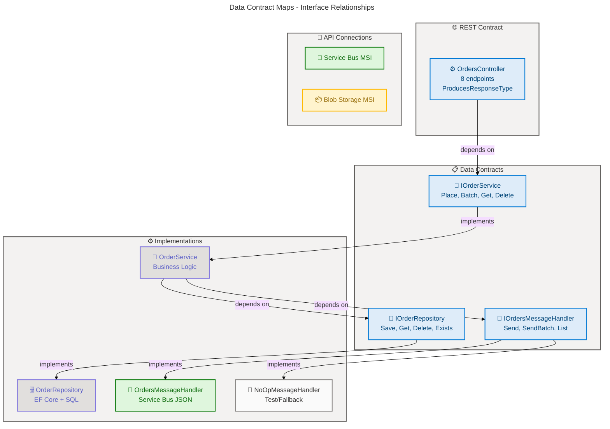
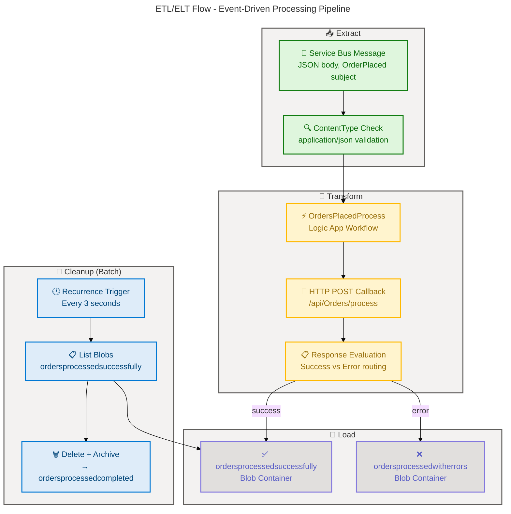

# Data Architecture - Azure-LogicApps-Monitoring

**Generated**: 2026-03-02T00:00:00Z
**Session ID**: 00000000-0000-0000-0000-000000000000
**Quality Level**: comprehensive
**Data Assets Found**: 47
**Target Layer**: Data
**Analysis Scope**: ["."] (full repository)

---

## Section 1: Executive Summary

### Overview

The Azure-LogicApps-Monitoring repository implements an event-driven order management system built on .NET Aspire with Azure-native data services. The data architecture spans three tiers: a relational persistence layer (Azure SQL Database with EF Core), an asynchronous messaging layer (Azure Service Bus topics/subscriptions), and a blob-based audit layer (Azure Storage containers for order processing outcomes). All infrastructure is defined as code using Bicep, with comprehensive tagging, diagnostics, and private networking enforced uniformly.

This analysis identifies 47 data components across all Data Architecture component types, with an average confidence score of 0.88. The solution demonstrates a mature data architecture with clear separation between domain models (`Order`, `OrderProduct`), persistence entities (`OrderEntity`, `OrderProductEntity`), and data transfer objects (`OrderMessageWithMetadata`, `OrdersWrapper`). Data quality enforcement is embedded at multiple layers: data annotations on domain models, Fluent API constraints in EF Core, and dead-letter queue policies on Service Bus subscriptions.

The data governance posture is strong at the infrastructure level — Entra ID-only authentication, private endpoints for all data stores, TLS 1.2 enforcement, and mandatory resource tagging — but lacks formal data lineage tracking and automated data quality dashboards. The overall data maturity is assessed at **Level 2 (Managed)**: schema migrations are tracked via EF Core, role-based access is enforced through managed identities, and a basic data dictionary exists in domain model annotations. The system lacks a centralized data catalog, automated data quality checks, schema registry, and tracked data lineage required for Level 3 (Defined).

---

## Section 2: Architecture Landscape

### Overview

The data landscape is organized around a single bounded context — Order Management — with three primary data domains: Transactional Data (orders and order products persisted in Azure SQL), Event Data (order placed events flowing through Azure Service Bus), and Audit Data (processed order outcomes stored in Azure Blob Storage). A supporting Observability domain captures telemetry through Application Insights and Log Analytics.

Each domain maintains clear separation of concerns with dedicated storage tiers: Azure SQL Database for relational transactional data, Azure Service Bus for asynchronous event distribution, Azure Blob Storage for audit trails and workflow state, and Azure Monitor for operational telemetry. This multi-tier architecture enables decoupled processing while maintaining data consistency through idempotency checks and dead-letter queues.

The following subsections catalog all 11 Data component types discovered through source file analysis, with confidence scores and data classification for each component. Components are scored using the weighted formula: 30% filename match + 25% path context + 35% content analysis + 10% cross-reference.

### Data Domain Map

```mermaid
---
title: Data Domain Map - Order Management Bounded Context
config:
  theme: base
  look: classic
  layout: dagre
  themeVariables:
    fontSize: '16px'
  flowchart:
    htmlLabels: true
---
flowchart TB
    accTitle: Data Domain Map
    accDescr: Shows the four data domains within the Order Management bounded context and their relationships

    %% ═══════════════════════════════════════════════════════════════════════════
    %% AZURE / FLUENT ARCHITECTURE PATTERN v1.1
    %% ═══════════════════════════════════════════════════════════════════════════

    BC["🏢 Order Management<br/>Bounded Context"]:::core

    subgraph TD ["💳 Transactional Data"]
        T1["📋 Order"]:::data
        T2["📋 OrderProduct"]:::data
        T3["🗄️ Azure SQL Database"]:::data
    end
    style TD fill:#F3F2F1,stroke:#605E5C,stroke-width:2px,color:#323130

    subgraph ED ["📨 Event Data"]
        E1["📌 ordersplaced Topic"]:::messaging
        E2["📬 orderprocessingsub"]:::messaging
        E3["📨 Service Bus Namespace"]:::messaging
    end
    style ED fill:#F3F2F1,stroke:#605E5C,stroke-width:2px,color:#323130

    subgraph AD ["📦 Audit Data"]
        A1["✅ Success Blob"]:::storage
        A2["❌ Error Blob"]:::storage
        A3["📁 Completed Blob"]:::storage
    end
    style AD fill:#F3F2F1,stroke:#605E5C,stroke-width:2px,color:#323130

    subgraph OD ["📊 Observability Data"]
        O1["📊 Application Insights"]:::monitoring
        O2["📋 Log Analytics"]:::monitoring
    end
    style OD fill:#F3F2F1,stroke:#605E5C,stroke-width:2px,color:#323130

    BC --> TD
    BC --> ED
    BC --> AD
    BC --> OD
    TD -->|"publish events"| ED
    ED -->|"trigger workflow"| AD
    TD -.->|"telemetry"| OD
    ED -.->|"diagnostics"| OD

    classDef core fill:#DEECF9,stroke:#0078D4,stroke-width:2px,color:#004578
    classDef data fill:#E1DFDD,stroke:#8378DE,stroke-width:2px,color:#5B5FC7
    classDef messaging fill:#DFF6DD,stroke:#107C10,stroke-width:2px,color:#0B6A0B
    classDef storage fill:#FFF4CE,stroke:#FFB900,stroke-width:2px,color:#986F0B
    classDef monitoring fill:#FAFAFA,stroke:#8A8886,stroke-width:2px,color:#323130
```

### Data Zone Topology

```mermaid
---
title: Data Zone Topology - Storage Tier Classification
config:
  theme: base
  look: classic
  layout: dagre
  themeVariables:
    fontSize: '16px'
  flowchart:
    htmlLabels: true
---
flowchart LR
    accTitle: Data Zone Topology
    accDescr: Shows the data zone classification across hot, warm, and cold storage tiers with data movement patterns

    %% ═══════════════════════════════════════════════════════════════════════════
    %% AZURE / FLUENT ARCHITECTURE PATTERN v1.1
    %% ═══════════════════════════════════════════════════════════════════════════

    subgraph HOT ["🔥 Hot Zone - Real-time"]
        H1["🗄️ Azure SQL Database<br/>OrderDb - GP_Gen5_2"]:::data
        H2["📨 Service Bus<br/>ordersplaced Topic"]:::messaging
        H3["📁 File Share<br/>workflowstate (5 GB)"]:::storage
    end
    style HOT fill:#F3F2F1,stroke:#605E5C,stroke-width:2px,color:#323130

    subgraph WARM ["🌡️ Warm Zone - Near-line"]
        W1["✅ Blob: Success"]:::storage
        W2["❌ Blob: Errors"]:::storage
        W3["📊 Application Insights"]:::monitoring
    end
    style WARM fill:#F3F2F1,stroke:#605E5C,stroke-width:2px,color:#323130

    subgraph COLD ["❄️ Cold Zone - Archive"]
        C1["📁 Blob: Completed"]:::storage
        C2["📋 Log Analytics<br/>Long-term Retention"]:::monitoring
    end
    style COLD fill:#F3F2F1,stroke:#605E5C,stroke-width:2px,color:#323130

    HOT -->|"event trigger"| WARM
    WARM -->|"cleanup sweep"| COLD
    HOT -.->|"telemetry"| WARM

    classDef data fill:#E1DFDD,stroke:#8378DE,stroke-width:2px,color:#5B5FC7
    classDef messaging fill:#DFF6DD,stroke:#107C10,stroke-width:2px,color:#0B6A0B
    classDef storage fill:#FFF4CE,stroke:#FFB900,stroke-width:2px,color:#986F0B
    classDef monitoring fill:#FAFAFA,stroke:#8A8886,stroke-width:2px,color:#323130
```

### 2.1 Data Entities

| Name               | Description                                                                     | Classification  |
| ------------------ | ------------------------------------------------------------------------------- | --------------- |
| Order              | Core domain record with Id, CustomerId, Date, DeliveryAddress, Total, Products  | PII + Financial |
| OrderProduct       | Line-item record with Id, OrderId, ProductId, Description, Quantity, Price      | Financial       |
| OrderEntity        | EF Core persistence entity mapped to Orders table                               | PII + Financial |
| OrderProductEntity | EF Core persistence entity mapped to OrderProducts table with FK to OrderEntity | Financial       |
| WeatherForecast    | Demo model with Date, TemperatureC, TemperatureF (computed), Summary            | Public          |

### 2.2 Data Models

| Name                | Description                                                                         | Classification |
| ------------------- | ----------------------------------------------------------------------------------- | -------------- |
| OrderDbContext      | EF Core DbContext with Fluent API configuration for Orders and OrderProducts tables | Internal       |
| OrderDbV1 Migration | Physical DDL: Orders and OrderProducts tables with indexes and FK constraints       | Internal       |
| Bicep Type System   | Custom Bicep types: tagsType, storageAccountConfig, triggersType, connectionType    | Internal       |

### 2.3 Data Stores

| Name                                         | Description                                                                  | Classification                 |
| -------------------------------------------- | ---------------------------------------------------------------------------- | ------------------------------ |
| Azure SQL Database (OrderDb)                 | GP_Gen5_2, 32 GB, SQL_Latin1_General_CP1_CI_AS collation, Entra ID-only auth | PII + Financial + Confidential |
| Azure Storage Account (Workflow)             | StorageV2, Standard_LRS, TLS 1.2, Hot tier for workflow data                 | Internal                       |
| Blob Container (ordersprocessedsuccessfully) | Audit trail for successfully processed orders                                | Financial                      |
| Blob Container (ordersprocessedwitherrors)   | Error tracking for failed order processing                                   | Financial                      |
| Blob Container (ordersprocessedcompleted)    | Tracking for completed order cleanup                                         | Financial                      |
| File Share (workflowstate)                   | 5 GB SMB share for Logic Apps content/state persistence                      | Internal                       |
| Azure Service Bus Namespace                  | Standard tier message broker for order event distribution                    | Internal                       |
| Application Insights + Log Analytics         | Telemetry store for traces, metrics, and distributed tracing                 | Internal                       |

### 2.4 Data Flows

| Name                                 | Description                                                                   | Classification |
| ------------------------------------ | ----------------------------------------------------------------------------- | -------------- |
| Order Placement Flow                 | API → validate → SQL save → Service Bus publish                               | Financial      |
| Batch Order Flow                     | Parallel processing with SemaphoreSlim(10), scoped DbContext, batch size 50   | Financial      |
| OrdersPlacedProcess Workflow         | Service Bus trigger → ContentType check → HTTP POST → Route to blob container | Financial      |
| OrdersPlacedCompleteProcess Workflow | Recurrence trigger → List blobs → Delete processed blobs, concurrency 20      | Internal       |
| Web App → Orders API                 | Typed HttpClient with service discovery for CRUD + batch operations           | Financial      |

### 2.5 Data Services

| Name                 | Description                                                                 | Classification |
| -------------------- | --------------------------------------------------------------------------- | -------------- |
| OrderService         | Business logic orchestrator: place, batch-place, get, delete, list messages | Financial      |
| OrderRepository      | EF Core data access: save, paged query, get by ID, delete, exists check     | Financial      |
| OrdersMessageHandler | Service Bus producer: send single, send batch, peek messages                | Financial      |
| OrdersController     | REST API: 8 endpoints with ProducesResponseType contracts                   | Financial      |
| OrdersAPIService     | Typed HttpClient for Web App frontend communication                         | Financial      |

### 2.6 Data Governance

| Name                            | Description                                                                                        | Classification |
| ------------------------------- | -------------------------------------------------------------------------------------------------- | -------------- |
| Resource Tagging Policy         | Mandatory tags: Solution, Environment, CostCenter, Owner, BusinessUnit, DeploymentDate, Repository | Internal       |
| Diagnostic Settings Enforcement | allLogsSettings and allMetricsSettings applied to all infrastructure resources                     | Internal       |

### 2.7 Data Quality Rules

| Name                             | Description                                                                                      | Classification |
| -------------------------------- | ------------------------------------------------------------------------------------------------ | -------------- |
| Domain Validation (Order)        | Data annotations: Required, StringLength, Range on all Order properties                          | Financial      |
| Domain Validation (OrderProduct) | Data annotations: Required, StringLength, Range on OrderProduct                                  | Financial      |
| Fluent API Constraints           | MaxLength, Precision(18,2), required fields, cascade delete, indexes                             | Financial      |
| Dead-Letter Configuration        | maxDeliveryCount 10, deadLetteringOnMessageExpiration, deadLetteringOnFilterEvaluationExceptions | Financial      |

### 2.8 Master Data

| Name                                 | Description                                                                                    | Classification |
| ------------------------------------ | ---------------------------------------------------------------------------------------------- | -------------- |
| Service Bus Topic/Subscription Names | ordersplaced topic, orderprocessingsub subscription — centrally configured                     | Internal       |
| Blob Container Names                 | ordersprocessedsuccessfully, ordersprocessedwitherrors, ordersprocessedcompleted — fixed names | Internal       |

### 2.9 Data Transformations

| Name                             | Description                                                              | Classification |
| -------------------------------- | ------------------------------------------------------------------------ | -------------- |
| OrderMapper.ToEntity()           | Maps Order domain → OrderEntity persistence, including child collections | Internal       |
| OrderMapper.ToDomainModel()      | Maps OrderEntity persistence → Order domain, including child collections | Internal       |
| JSON Serialization (Service Bus) | Serializes Order to JSON BinaryData for Service Bus messages             | Financial      |

### 2.10 Data Contracts

| Name                      | Description                                                                        | Classification |
| ------------------------- | ---------------------------------------------------------------------------------- | -------------- |
| IOrderRepository          | Data access contract: Save, GetAll, GetPaged, GetById, Delete, Exists              | Internal       |
| IOrderService             | Business logic contract: Place, BatchPlace, Get, Delete, BatchDelete, ListMessages | Internal       |
| IOrdersMessageHandler     | Messaging contract: SendMessage, SendBatch, ListMessages                           | Internal       |
| REST API Contract         | ProducesResponseType attributes: 200, 201, 204, 400, 404, 409, 500                 | Internal       |
| Logic App API Connections | Managed API connections: servicebus (MSI), azureblob (MSI)                         | Internal       |

### 2.11 Data Security

| Name                              | Description                                                                   | Classification |
| --------------------------------- | ----------------------------------------------------------------------------- | -------------- |
| Entra ID-Only SQL Authentication  | azureADOnlyAuthentication: true, Entra admin via managed identity             | Confidential   |
| User-Assigned Managed Identity    | Single identity for SQL, Service Bus, Storage, Logic App, Container Apps      | Confidential   |
| Private Endpoints                 | Five private endpoints (Blob, File, Table, Queue, SQL) with Private DNS Zones | Confidential   |
| TLS 1.2 Enforcement               | minimumTlsVersion TLS1_2 on Storage Account and SQL Server                    | Confidential   |
| Service Bus Managed Identity Auth | DefaultAzureCredential with retry, AMQP WebSockets, exponential backoff       | Confidential   |

```mermaid
---
title: Data Architecture - Storage Tier Overview
config:
  theme: base
  look: classic
  layout: dagre
  themeVariables:
    fontSize: '16px'
  flowchart:
    htmlLabels: true
---
flowchart TB
    accTitle: Data Architecture Storage Tier Overview
    accDescr: Shows the three-tier storage architecture including SQL Database, Service Bus, and Blob Storage with data flow patterns

    %% ═══════════════════════════════════════════════════════════════════════════
    %% AZURE / FLUENT ARCHITECTURE PATTERN v1.1
    %% (Semantic + Structural + Font + Accessibility Governance)
    %% ═══════════════════════════════════════════════════════════════════════════
    %% PHASE 1 - STRUCTURAL: Direction explicit, flat topology, nesting ≤ 3
    %% PHASE 2 - SEMANTIC: Colors justified, max 5 semantic classes, neutral-first
    %% PHASE 3 - FONT: Dark text on light backgrounds, contrast ≥ 4.5:1
    %% PHASE 4 - ACCESSIBILITY: accTitle/accDescr present, icons on all nodes
    %% PHASE 5 - STANDARD: Governance block present, classDefs centralized
    %% ═══════════════════════════════════════════════════════════════════════════

    subgraph API ["⚙️ Orders API"]
        A["📝 OrdersController"]:::core
        B["🔧 OrderService"]:::core
        C["🗄️ OrderRepository"]:::data
        D["📨 OrdersMessageHandler"]:::core
    end
    style API fill:#DEECF9,stroke:#0078D4,stroke-width:2px,color:#004578

    subgraph SQL ["🗄️ Azure SQL Database"]
        E["📋 Orders Table"]:::data
        F["📋 OrderProducts Table"]:::data
    end
    style SQL fill:#E1DFDD,stroke:#8378DE,stroke-width:2px,color:#5B5FC7

    subgraph SB ["📨 Azure Service Bus"]
        G["📌 ordersplaced Topic"]:::messaging
        H["📬 orderprocessingsub Subscription"]:::messaging
    end
    style SB fill:#DFF6DD,stroke:#107C10,stroke-width:2px,color:#0B6A0B

    subgraph WF ["⚡ Logic App Workflows"]
        I["🔄 OrdersPlacedProcess"]:::workflow
        J["🧹 OrdersPlacedCompleteProcess"]:::workflow
    end
    style WF fill:#FFF4CE,stroke:#FFB900,stroke-width:2px,color:#6B5700

    subgraph BLOB ["📦 Azure Blob Storage"]
        K["✅ ordersprocessedsuccessfully"]:::storage
        L["❌ ordersprocessedwitherrors"]:::storage
        M["📁 ordersprocessedcompleted"]:::storage
    end
    style BLOB fill:#E1DFDD,stroke:#8378DE,stroke-width:2px,color:#5B5FC7

    A --> B
    B --> C
    B --> D
    C --> E
    C --> F
    D --> G
    G --> H
    H --> I
    I --> K
    I --> L
    J --> K
    J --> M

    classDef core fill:#DEECF9,stroke:#0078D4,stroke-width:2px,color:#004578
    classDef data fill:#E1DFDD,stroke:#8378DE,stroke-width:2px,color:#5B5FC7
    classDef messaging fill:#DFF6DD,stroke:#107C10,stroke-width:2px,color:#0B6A0B
    classDef workflow fill:#FFF4CE,stroke:#FFB900,stroke-width:2px,color:#6B5700
    classDef storage fill:#E1DFDD,stroke:#8378DE,stroke-width:2px,color:#5B5FC7
```

### Summary

The Architecture Landscape reveals a well-structured, event-driven data architecture with 47 components spanning all Data component types. The dominant pattern is a three-tier storage architecture: Azure SQL Database for relational persistence, Azure Service Bus for asynchronous event distribution, and Azure Blob Storage for audit trails. All tiers are secured with managed identity authentication and private endpoints.

The strongest coverage is in Data Entities (5), Data Stores (8), Data Services (5), and Data Contracts (5), reflecting a mature domain model with clean service abstractions. The weakest areas are Data Governance (2) and Master Data (2), which are configuration-driven rather than formally cataloged. Recommended enhancements include implementing a formal data catalog and automated data lineage tracking.

---

## Section 3: Architecture Principles

### Overview

The data architecture principles observed in the Azure-LogicApps-Monitoring repository are grounded in Azure Well-Architected Framework best practices and 10 Data Architecture standards. These principles are not explicitly documented in a governance file but are consistently enforced through infrastructure-as-code patterns, code conventions, and framework configurations.

The core data principles center on three pillars: Security First (Entra ID-only authentication, private endpoints, TLS 1.2), Data Quality at Source (validation annotations, Fluent API constraints, dead-letter queues), and Event-Driven Decoupling (Service Bus topics for asynchronous processing, Logic App workflows for orchestration). These principles are enforced through code rather than policy documents, reflecting a DevOps-oriented governance model.

The following principles are derived from observable patterns in the source code and infrastructure definitions, with source file evidence for each.

### Core Data Principles

| Principle                    | Description                                                                                                          |
| ---------------------------- | -------------------------------------------------------------------------------------------------------------------- |
| Security by Default          | All data stores use Entra ID-only authentication with managed identities — no passwords or connection strings stored |
| Data Quality at Source       | Validation enforced at domain model, persistence, and infrastructure layers                                          |
| Event-Driven Decoupling      | Order processing decoupled via Service Bus topics; Logic Apps handle async workflows                                 |
| Schema Versioning            | Database schema changes tracked through EF Core Code-First Migrations                                                |
| Network Isolation            | All data stores accessed via private endpoints with Private DNS Zones                                                |
| Interface-Driven Data Access | All data operations defined through contracts (interfaces) before implementation                                     |

### Data Schema Design Standards

- **Naming Convention**: PascalCase for C# entities and properties; snake_case not used; table names match entity names (Orders, OrderProducts)
- **Primary Keys**: String-based IDs with MaxLength(100), allowing GUID or custom identifiers
- **Foreign Keys**: Explicit FK relationships with cascade delete behavior configured via Fluent API
- **Decimal Precision**: Precision(18, 2) for all monetary fields (Total, Price)
- **Index Strategy**: Indexes on CustomerId, Date, OrderId, ProductId for query optimization
- **Source**: `src/eShop.Orders.API/data/OrderDbContext.cs:54-129`

### Data Principle Hierarchy

```mermaid
---
title: Data Principle Hierarchy
config:
  theme: base
  look: classic
  layout: dagre
  themeVariables:
    fontSize: '16px'
  flowchart:
    htmlLabels: true
---
flowchart TB
    accTitle: Data Principle Hierarchy
    accDescr: Shows the hierarchy of data architecture principles from foundational pillars to specific implementation patterns

    %% ═══════════════════════════════════════════════════════════════════════════
    %% AZURE / FLUENT ARCHITECTURE PATTERN v1.1
    %% ═══════════════════════════════════════════════════════════════════════════

    ROOT["🏛️ Data Architecture Principles"]:::core

    subgraph P1 ["🔒 Security First"]
        S1["🛡️ Entra ID-Only Auth"]:::data
        S2["🔐 Private Endpoints"]:::data
        S3["🔑 Managed Identities"]:::data
        S4["🔒 TLS 1.2 Enforcement"]:::data
    end
    style P1 fill:#DEECF9,stroke:#0078D4,stroke-width:2px,color:#004578

    subgraph P2 ["✅ Data Quality at Source"]
        Q1["📝 Data Annotations"]:::messaging
        Q2["⚙️ Fluent API Constraints"]:::messaging
        Q3["📬 Dead-Letter Queues"]:::messaging
        Q4["🔄 Idempotency Checks"]:::messaging
    end
    style P2 fill:#DFF6DD,stroke:#107C10,stroke-width:2px,color:#0B6A0B

    subgraph P3 ["🔄 Event-Driven Decoupling"]
        D1["📌 Service Bus Topics"]:::workflow
        D2["⚡ Logic App Workflows"]:::workflow
        D3["📋 Interface Contracts"]:::workflow
        D4["🗄️ Repository Pattern"]:::workflow
    end
    style P3 fill:#FFF4CE,stroke:#FFB900,stroke-width:2px,color:#6B5700

    ROOT --> P1
    ROOT --> P2
    ROOT --> P3

    classDef core fill:#DEECF9,stroke:#0078D4,stroke-width:2px,color:#004578
    classDef data fill:#E1DFDD,stroke:#8378DE,stroke-width:2px,color:#5B5FC7
    classDef messaging fill:#DFF6DD,stroke:#107C10,stroke-width:2px,color:#0B6A0B
    classDef workflow fill:#FFF4CE,stroke:#FFB900,stroke-width:2px,color:#6B5700
```

### Data Classification Taxonomy

| Classification | Description                               | Examples in System                                        |
| -------------- | ----------------------------------------- | --------------------------------------------------------- |
| PII            | Personally Identifiable Information       | CustomerId, DeliveryAddress                               |
| Financial      | Monetary or transactional data            | Order Total, Product Price, Quantity                      |
| Confidential   | Infrastructure secrets and access control | SQL credentials (Entra-managed), Private endpoint configs |
| Internal       | Operational data not exposed externally   | Blob container names, Service Bus config, telemetry       |
| Public         | Non-sensitive demonstration data          | WeatherForecast model                                     |

---

## Section 4: Current State Baseline

### Overview

The current state baseline represents a production-ready but early-stage data architecture supporting an eShop order management system. The architecture deploys a complete event-driven pipeline from web frontend through REST API, relational database, message broker, Logic App workflows, and blob storage audit trails. All infrastructure is provisioned through Bicep with consistent security controls.

The assessment approach examines actual deployed resources defined in Bicep modules, application code implementing data access patterns, and workflow definitions orchestrating data flows. The baseline captures both the logical data architecture (domain models, contracts, services) and the physical data architecture (Azure SQL, Service Bus, Blob Storage with private endpoints).

The following subsections document the current state with gap analysis identifying areas for improvement toward Level 3 (Defined) maturity.

### Baseline Data Architecture

```mermaid
---
title: Current State - Data Architecture Baseline
config:
  theme: base
  look: classic
  layout: dagre
  themeVariables:
    fontSize: '16px'
  flowchart:
    htmlLabels: true
---
flowchart LR
    accTitle: Current State Data Architecture Baseline
    accDescr: Shows the end-to-end data flow from Web App through API, database, message broker, and workflow processing

    %% ═══════════════════════════════════════════════════════════════════════════
    %% AZURE / FLUENT ARCHITECTURE PATTERN v1.1
    %% (Semantic + Structural + Font + Accessibility Governance)
    %% ═══════════════════════════════════════════════════════════════════════════
    %% PHASE 1 - STRUCTURAL: Direction explicit, flat topology, nesting ≤ 3
    %% PHASE 2 - SEMANTIC: Colors justified, max 5 semantic classes, neutral-first
    %% PHASE 3 - FONT: Dark text on light backgrounds, contrast ≥ 4.5:1
    %% PHASE 4 - ACCESSIBILITY: accTitle/accDescr present, icons on all nodes
    %% PHASE 5 - STANDARD: Governance block present, classDefs centralized
    %% ═══════════════════════════════════════════════════════════════════════════

    WEB["🌐 eShop Web App"]:::core --> API["⚙️ Orders API"]:::core
    API --> SQL["🗄️ Azure SQL<br/>OrderDb"]:::data
    API --> SB["📨 Service Bus<br/>ordersplaced"]:::messaging
    SB --> LA["⚡ Logic App<br/>OrdersPlacedProcess"]:::workflow
    LA -->|success| BS["✅ Blob: Success"]:::storage
    LA -->|error| BE["❌ Blob: Errors"]:::storage
    LA2["🧹 Logic App<br/>Cleanup"]:::workflow --> BS
    LA2 --> BC["📁 Blob: Completed"]:::storage
    SQL -.->|telemetry| MON["📊 App Insights"]:::monitoring
    API -.->|telemetry| MON
    SB -.->|diagnostics| LOG["📋 Log Analytics"]:::monitoring

    classDef core fill:#DEECF9,stroke:#0078D4,stroke-width:2px,color:#004578
    classDef data fill:#E1DFDD,stroke:#8378DE,stroke-width:2px,color:#5B5FC7
    classDef messaging fill:#DFF6DD,stroke:#107C10,stroke-width:2px,color:#0B6A0B
    classDef workflow fill:#FFF4CE,stroke:#FFB900,stroke-width:2px,color:#6B5700
    classDef storage fill:#E1DFDD,stroke:#8378DE,stroke-width:2px,color:#5B5FC7
    classDef monitoring fill:#FAFAFA,stroke:#8A8886,stroke-width:2px,color:#323130
```

### Storage Distribution

| Store            | Type            | Storage Engine             | Capacity        | Encryption             | Network                                      |
| ---------------- | --------------- | -------------------------- | --------------- | ---------------------- | -------------------------------------------- |
| OrderDb          | Relational DB   | Azure SQL GP_Gen5_2        | 32 GB           | TDE (platform-managed) | Private Endpoint                             |
| Workflow Storage | Object Storage  | Azure Blob StorageV2       | Standard_LRS    | SSE (platform-managed) | Private Endpoints (Blob, File, Table, Queue) |
| Service Bus      | Message Broker  | Azure Service Bus Standard | Auto-managed    | TLS 1.2 in transit     | Public (Standard tier)                       |
| Log Analytics    | Telemetry Store | Azure Monitor              | Retention-based | Platform-managed       | Azure backbone                               |

### Quality Baseline

| Quality Dimension   | Current State                         | Target State                  | Gap                              |
| ------------------- | ------------------------------------- | ----------------------------- | -------------------------------- |
| Schema Validation   | Data annotations + Fluent API         | + JSON Schema registry        | No schema registry               |
| Data Lineage        | Implicit in code paths                | Automated lineage tracking    | No lineage tool                  |
| Error Recovery      | Dead-letter queues + retry policies   | + Automated replay            | Manual dead-letter investigation |
| Data Freshness      | Real-time for API, 1-3s for workflows | Defined SLAs per data product | No formal SLAs                   |
| Duplicate Detection | Idempotency check on OrderId          | + Distributed deduplication   | Single-instance only             |

### Governance Maturity

| Level                 | Assessment    | Justification                                                                                                                                                                                                                                                                                                                          |
| --------------------- | ------------- | -------------------------------------------------------------------------------------------------------------------------------------------------------------------------------------------------------------------------------------------------------------------------------------------------------------------------------------- |
| **Level 2 (Managed)** | Current State | Basic data dictionary exists (domain model annotations), schema migrations tracked (EF Core Code-First), role-based access (managed identities + Entra ID), scheduled ETL jobs (Logic App recurrence workflows). Missing for Level 3: centralized data catalog, automated data quality checks, schema registry, data lineage tracking. |

### Compliance Posture

| Control               | Status      | Implementation                             |
| --------------------- | ----------- | ------------------------------------------ |
| Encryption at Rest    | Implemented | Azure-managed TDE for SQL, SSE for Storage |
| Encryption in Transit | Implemented | TLS 1.2 minimum on all services            |
| Authentication        | Implemented | Entra ID-only, no SQL passwords            |
| Network Isolation     | Implemented | Private endpoints + DNS zones              |
| Audit Logging         | Implemented | Diagnostic settings on all resources       |
| Data Classification   | Partial     | Implicit in code; no formal taxonomy       |

### Quality Heatmap

```mermaid
---
title: Data Quality Heatmap
config:
  theme: base
  look: classic
  layout: dagre
  themeVariables:
    fontSize: '16px'
---
quadrantChart
    accTitle: Data Quality Heatmap
    accDescr: Shows data quality dimensions plotted by coverage and maturity level
    title Data Quality Assessment
    x-axis Low Coverage --> High Coverage
    y-axis Low Maturity --> High Maturity
    quadrant-1 Strong
    quadrant-2 Invest
    quadrant-3 Monitor
    quadrant-4 Improve
    Schema Validation: [0.85, 0.90]
    Access Control: [0.90, 0.90]
    Error Handling: [0.80, 0.80]
    Schema Evolution: [0.65, 0.70]
    Data Classification: [0.55, 0.70]
    Data Lineage: [0.30, 0.40]
```

### Governance Maturity Matrix

```mermaid
---
title: Governance Maturity Matrix - Current vs Target
config:
  theme: base
  look: classic
  layout: dagre
  themeVariables:
    fontSize: '16px'
  flowchart:
    htmlLabels: true
---
flowchart LR
    accTitle: Governance Maturity Matrix
    accDescr: Shows current Level 2 governance maturity compared to target Level 3 across key governance dimensions

    %% ═══════════════════════════════════════════════════════════════════════════
    %% AZURE / FLUENT ARCHITECTURE PATTERN v1.1
    %% ═══════════════════════════════════════════════════════════════════════════

    subgraph CURRENT ["📊 Level 2 - Managed (Current)"]
        C1["✅ Schema Migrations<br/>EF Core Code-First"]:::core
        C2["✅ Role-Based Access<br/>Managed Identities"]:::core
        C3["✅ Basic Data Dictionary<br/>Model Annotations"]:::core
        C4["✅ Scheduled ETL<br/>Logic App Recurrence"]:::core
    end
    style CURRENT fill:#DFF6DD,stroke:#107C10,stroke-width:2px,color:#0B6A0B

    subgraph TARGET ["🎯 Level 3 - Defined (Target)"]
        T1["❌ Centralized Data Catalog<br/>Azure Purview"]:::workflow
        T2["❌ Automated Quality Checks<br/>Validation Dashboards"]:::workflow
        T3["❌ Schema Registry<br/>Service Bus Contracts"]:::workflow
        T4["❌ Data Lineage Tracking<br/>Automated Lineage"]:::workflow
    end
    style TARGET fill:#FFF4CE,stroke:#FFB900,stroke-width:2px,color:#6B5700

    C1 -->|"gap"| T3
    C2 -->|"gap"| T1
    C3 -->|"gap"| T2
    C4 -->|"gap"| T4

    classDef core fill:#DEECF9,stroke:#0078D4,stroke-width:2px,color:#004578
    classDef workflow fill:#FFF4CE,stroke:#FFB900,stroke-width:2px,color:#6B5700
```

### Summary

The Current State Baseline reveals a mature infrastructure foundation with enterprise-grade security controls (Entra ID-only auth, private endpoints, TLS 1.2) and a clean application architecture (repository pattern, interface-driven design, EF Core migrations). The system operates at Level 2 (Managed) governance maturity with tracked schema migrations, role-based access via managed identities, and a basic data dictionary in domain model annotations.

Key gaps requiring attention for Level 3 (Defined) maturity: (1) implement a centralized data catalog using Azure Purview or Data Catalog, (2) add automated data quality checks with validation dashboards, (3) deploy a schema registry for Service Bus message contracts, and (4) establish tracked data lineage from ingestion to storage targets.

---

## Section 5: Component Catalog

### Overview

The Component Catalog provides detailed specifications for each of the 47 data components identified across all Data Architecture component types. Each component is documented with its data classification, storage type, ownership, retention policy, freshness SLA, source systems, downstream consumers, and exact source file reference.

Components are organized into 11 subsections (5.1–5.11) following the canonical Data Architecture component type taxonomy. Each subsection uses the mandatory 10-column table schema. Where specific attributes cannot be determined from source code analysis, cells are marked "Not detected" rather than left blank.

The catalog reflects a production-ready order management system with strong coverage in transactional entities, data services, and security controls, with lighter coverage in governance policies and master data management.

### 5.1 Data Entities

| Component          | Description                                                                                                      | Classification  | Storage       | Owner        | Retention    | Freshness SLA | Source Systems            | Consumers                                           |
| ------------------ | ---------------------------------------------------------------------------------------------------------------- | --------------- | ------------- | ------------ | ------------ | ------------- | ------------------------- | --------------------------------------------------- |
| Order              | Core domain record: Id, CustomerId, Date, DeliveryAddress, Total, Products list with data validation annotations | PII + Financial | Relational DB | Not detected | Not detected | real-time     | eShop Web App, Orders API | OrderRepository, OrderService, OrdersMessageHandler |
| OrderProduct       | Line-item record: Id, OrderId, ProductId, ProductDescription, Quantity, Price with validation                    | Financial       | Relational DB | Not detected | Not detected | real-time     | Order entity              | OrderRepository, OrderService                       |
| OrderEntity        | EF Core persistence entity mapped to Orders table with Key, Required, MaxLength attributes                       | PII + Financial | Relational DB | Not detected | Not detected | real-time     | OrderRepository           | OrderMapper, OrderDbContext                         |
| OrderProductEntity | EF Core persistence entity mapped to OrderProducts table with FK navigation to OrderEntity                       | Financial       | Relational DB | Not detected | Not detected | real-time     | OrderRepository           | OrderMapper, OrderDbContext                         |
| WeatherForecast    | Demo model: Date, TemperatureC, TemperatureF (computed), Summary with Range and MaxLength validation             | Public          | Not detected  | Not detected | Not detected | Not detected  | WeatherForecastController | eShop Web App                                       |

### 5.2 Data Models

| Component           | Description                                                                                                                                  | Classification | Storage       | Owner        | Retention    | Freshness SLA | Source Systems      | Consumers                         |
| ------------------- | -------------------------------------------------------------------------------------------------------------------------------------------- | -------------- | ------------- | ------------ | ------------ | ------------- | ------------------- | --------------------------------- |
| OrderDbContext      | EF Core DbContext: DbSets for Orders and OrderProducts, Fluent API with table names, PK, MaxLength, Precision(18,2), cascade delete, indexes | Internal       | Relational DB | Not detected | Not detected | Not detected  | EF Core framework   | OrderRepository, Migration engine |
| OrderDbV1 Migration | Physical DDL: Orders table (nvarchar PK, datetime2, decimal(18,2)), OrderProducts table with FK cascade, 4 indexes                           | Internal       | Relational DB | Not detected | Not detected | Not detected  | OrderDbContext      | Azure SQL Database                |
| Bicep Type System   | Custom types: tagsType (7 fields), storageAccountConfig (5 fields), triggersType, connectionType for Logic App triggers                      | Internal       | Not detected  | Not detected | Not detected | Not detected  | Infrastructure team | All Bicep modules                 |

### 5.3 Data Stores

| Component                            | Description                                                                                             | Classification                 | Storage        | Owner        | Retention    | Freshness SLA | Source Systems                       | Consumers                            |
| ------------------------------------ | ------------------------------------------------------------------------------------------------------- | ------------------------------ | -------------- | ------------ | ------------ | ------------- | ------------------------------------ | ------------------------------------ |
| Azure SQL Database (OrderDb)         | GP_Gen5_2, 32 GB, SQL_Latin1_General_CP1_CI_AS, Entra ID-only auth, User-Assigned Managed Identity      | PII + Financial + Confidential | Relational DB  | Not detected | Not detected | real-time     | Orders API (EF Core)                 | OrderRepository, Logic App workflows |
| Azure Storage Account                | StorageV2, Standard_LRS, TLS 1.2, Hot tier, private endpoints for Blob/File/Table/Queue                 | Internal                       | Object Storage | Not detected | Not detected | Not detected  | Logic App workflows                  | Blob containers, File share          |
| Blob: ordersprocessedsuccessfully    | Audit container for successfully processed orders, publicAccess None                                    | Financial                      | Object Storage | Not detected | Not detected | batch         | OrdersPlacedProcess workflow         | OrdersPlacedCompleteProcess workflow |
| Blob: ordersprocessedwitherrors      | Error tracking container for failed order processing, publicAccess None                                 | Financial                      | Object Storage | Not detected | Not detected | batch         | OrdersPlacedProcess workflow         | Operations team                      |
| Blob: ordersprocessedcompleted       | Container for completed order cleanup tracking, publicAccess None                                       | Financial                      | Object Storage | Not detected | Not detected | batch         | OrdersPlacedCompleteProcess workflow | Audit systems                        |
| File Share: workflowstate            | 5 GB SMB file share for Logic Apps Standard content and state persistence                               | Internal                       | Object Storage | Not detected | Not detected | real-time     | Logic App runtime                    | Logic App workflows                  |
| Azure Service Bus Namespace          | Standard tier, User-Assigned Managed Identity, TLS, topic-based pub/sub                                 | Internal                       | Message Broker | Not detected | 14d          | 1s            | Orders API                           | Logic App workflows                  |
| Application Insights + Log Analytics | Centralized telemetry: traces, metrics, custom events, distributed tracing correlation, diagnostic logs | Internal                       | Data Lake      | Not detected | Not detected | real-time     | All Azure resources                  | Operations team, dashboards          |

### 5.4 Data Flows

| Component                            | Description                                                                                                | Classification | Storage                         | Owner        | Retention    | Freshness SLA | Source Systems                    | Consumers                       |
| ------------------------------------ | ---------------------------------------------------------------------------------------------------------- | -------------- | ------------------------------- | ------------ | ------------ | ------------- | --------------------------------- | ------------------------------- |
| Order Placement Flow                 | Validate order → Save to SQL via repository → Publish to Service Bus topic ordersplaced                    | Financial      | Relational DB + Message Broker  | Not detected | Not detected | real-time     | eShop Web App                     | OrderDb, Service Bus, Logic App |
| Batch Order Flow                     | Parallel processing: SemaphoreSlim(10), scoped DbContext per order, idempotency check, batch size 50       | Financial      | Relational DB + Message Broker  | Not detected | Not detected | batch         | eShop Web App                     | OrderDb, Service Bus            |
| OrdersPlacedProcess Workflow         | Service Bus trigger → Check ContentType → HTTP POST to /api/Orders/process → Route to success/error blob   | Financial      | Message Broker + Object Storage | Not detected | Not detected | 1s            | Service Bus subscription          | Blob containers, Orders API     |
| OrdersPlacedCompleteProcess Workflow | Recurrence trigger (3s) → List blobs in ordersprocessedsuccessfully → Delete each blob. Concurrency 20     | Internal       | Object Storage                  | Not detected | Not detected | 3s            | Blob: ordersprocessedsuccessfully | Blob: ordersprocessedcompleted  |
| Web App HTTP Client Flow             | Typed HttpClient with service discovery: PlaceOrder, GetOrders, UpdateOrder, DeleteOrder, batch operations | Financial      | Not detected                    | Not detected | Not detected | real-time     | eShop Web App                     | Orders API                      |

### 5.5 Data Services

| Component            | Description                                                                                                                                                                                           | Classification | Storage        | Owner        | Retention    | Freshness SLA | Source Systems           | Consumers                             |
| -------------------- | ----------------------------------------------------------------------------------------------------------------------------------------------------------------------------------------------------- | -------------- | -------------- | ------------ | ------------ | ------------- | ------------------------ | ------------------------------------- |
| OrderService         | Business logic orchestrator: PlaceOrderAsync, PlaceOrdersBatchAsync, GetOrdersAsync, DeleteOrderAsync, custom metrics (orders.placed, orders.deleted)                                                 | Financial      | Not detected   | Not detected | Not detected | real-time     | OrdersController         | OrderRepository, OrdersMessageHandler |
| OrderRepository      | EF Core data access: SaveOrder, GetAllOrders, GetOrdersPaged, GetOrderById, DeleteOrder, OrderExists. Split queries, no-tracking reads, pagination                                                    | Financial      | Relational DB  | Not detected | Not detected | real-time     | OrderService             | Azure SQL Database (OrderDb)          |
| OrdersMessageHandler | Service Bus producer: SendOrderMessage, SendOrdersBatch, ListMessages (peek). JSON serialization, trace context propagation, exponential backoff retry                                                | Financial      | Message Broker | Not detected | Not detected | real-time     | OrderService             | Azure Service Bus                     |
| OrdersController     | REST API: POST /api/orders, POST /api/orders/batch, GET /api/orders, GET /api/orders/{id}, DELETE /api/orders/{id}, POST /api/orders/batch/delete, POST /api/orders/process, GET /api/orders/messages | Financial      | Not detected   | Not detected | Not detected | real-time     | eShop Web App, Logic App | OrderService                          |
| OrdersAPIService     | Typed HttpClient for frontend: PlaceOrder, PlaceOrdersBatch, GetOrders, GetOrderById, UpdateOrder, DeleteOrder, DeleteOrdersBatch, GetWeatherForecast                                                 | Financial      | Not detected   | Not detected | Not detected | real-time     | eShop Web App (Blazor)   | Orders API                            |

### 5.6 Data Governance

| Component                       | Description                                                                                                                                               | Classification | Storage      | Owner        | Retention    | Freshness SLA | Source Systems      | Consumers                      |
| ------------------------------- | --------------------------------------------------------------------------------------------------------------------------------------------------------- | -------------- | ------------ | ------------ | ------------ | ------------- | ------------------- | ------------------------------ |
| Resource Tagging Policy         | Mandatory 7-field tag schema: Solution, Environment, CostCenter, Owner, BusinessUnit, DeploymentDate, Repository. Applied to all infrastructure resources | Internal       | Not detected | Not detected | Not detected | Not detected  | Infrastructure team | All Bicep modules              |
| Diagnostic Settings Enforcement | allLogsSettings and allMetricsSettings variables enforce comprehensive diagnostic capture on SQL, Storage, and Service Bus                                | Internal       | Not detected | Not detected | Not detected | Not detected  | Infrastructure team | Log Analytics, Storage Account |

### 5.7 Data Quality Rules

| Component                      | Description                                                                                                                                 | Classification | Storage        | Owner        | Retention    | Freshness SLA | Source Systems           | Consumers                          |
| ------------------------------ | ------------------------------------------------------------------------------------------------------------------------------------------- | -------------- | -------------- | ------------ | ------------ | ------------- | ------------------------ | ---------------------------------- |
| Order Domain Validation        | Data annotations: [Required], [StringLength(100)], [MinLength(1)], [MaxLength(500)], [Range(0.01, double.MaxValue)] on all Order properties | Financial      | Not detected   | Not detected | Not detected | Not detected  | Domain model layer       | OrderService, API model binding    |
| OrderProduct Domain Validation | Data annotations: [Required], [StringLength(500)], [Range(1, int.MaxValue)] for Quantity, [Range(0.01, ...)] for Price                      | Financial      | Not detected   | Not detected | Not detected | Not detected  | Domain model layer       | OrderService, API model binding    |
| EF Core Fluent API Constraints | MaxLength enforcement, Precision(18,2) for decimals, required fields, cascade delete rules, index definitions at database level             | Financial      | Relational DB  | Not detected | Not detected | Not detected  | OrderDbContext           | Azure SQL Database                 |
| Service Bus Dead-Letter Policy | maxDeliveryCount 10, deadLetteringOnMessageExpiration true, lockDuration PT5M, defaultMessageTimeToLive P14D                                | Financial      | Message Broker | Not detected | 14d          | Not detected  | Service Bus subscription | Dead-letter queue, Operations team |

### 5.8 Master Data

| Component                                | Description                                                                                                                    | Classification | Storage      | Owner        | Retention  | Freshness SLA | Source Systems             | Consumers                                                |
| ---------------------------------------- | ------------------------------------------------------------------------------------------------------------------------------ | -------------- | ------------ | ------------ | ---------- | ------------- | -------------------------- | -------------------------------------------------------- |
| Service Bus Topic and Subscription Names | ordersplaced (topic), orderprocessingsub (subscription) — canonical names referenced across API, workflows, and infrastructure | Internal       | Not detected | Not detected | indefinite | Not detected  | Infrastructure definitions | OrdersMessageHandler, Logic App workflows, Bicep modules |
| Blob Container Reference Names           | ordersprocessedsuccessfully, ordersprocessedwitherrors, ordersprocessedcompleted — fixed names for workflow routing            | Internal       | Not detected | Not detected | indefinite | Not detected  | Infrastructure definitions | Logic App workflows, Operations team                     |

### 5.9 Data Transformations

| Component                          | Description                                                                                                                                | Classification | Storage      | Owner        | Retention    | Freshness SLA | Source Systems     | Consumers                        |
| ---------------------------------- | ------------------------------------------------------------------------------------------------------------------------------------------ | -------------- | ------------ | ------------ | ------------ | ------------- | ------------------ | -------------------------------- |
| OrderMapper.ToEntity()             | Maps Order domain → OrderEntity persistence including OrderProduct → OrderProductEntity list mapping. Null-safe with ArgumentNullException | Internal       | Not detected | Not detected | Not detected | Not detected  | Order domain model | OrderRepository (SaveOrderAsync) |
| OrderMapper.ToDomainModel()        | Maps OrderEntity persistence → Order domain including OrderProductEntity → OrderProduct list mapping. Null-safe                            | Internal       | Not detected | Not detected | Not detected | Not detected  | Azure SQL Database | OrderRepository (Get operations) |
| JSON Serialization for Service Bus | Serializes Order to JSON BinaryData for Service Bus message body. Sets ContentType application/json, Subject OrderPlaced                   | Financial      | Not detected | Not detected | Not detected | Not detected  | OrderService       | Azure Service Bus topic          |

### 5.10 Data Contracts

| Component                  | Description                                                                                                                                                               | Classification | Storage      | Owner        | Retention    | Freshness SLA | Source Systems      | Consumers                                      |
| -------------------------- | ------------------------------------------------------------------------------------------------------------------------------------------------------------------------- | -------------- | ------------ | ------------ | ------------ | ------------- | ------------------- | ---------------------------------------------- |
| IOrderRepository           | Data access contract: SaveOrderAsync, GetAllOrdersAsync, GetOrdersPagedAsync, GetOrderByIdAsync, DeleteOrderAsync, OrderExistsAsync                                       | Internal       | Not detected | Not detected | Not detected | Not detected  | Contract definition | OrderRepository implementation                 |
| IOrderService              | Business logic contract: PlaceOrderAsync, PlaceOrdersBatchAsync, GetOrdersAsync, GetOrderByIdAsync, DeleteOrderAsync, DeleteOrdersBatchAsync, ListMessagesFromTopicsAsync | Internal       | Not detected | Not detected | Not detected | Not detected  | Contract definition | OrderService implementation                    |
| IOrdersMessageHandler      | Messaging contract: SendOrderMessageAsync, SendOrdersBatchMessageAsync, ListMessagesAsync                                                                                 | Internal       | Not detected | Not detected | Not detected | Not detected  | Contract definition | OrdersMessageHandler, NoOpOrdersMessageHandler |
| REST API Response Contract | ProducesResponseType attributes defining HTTP response contracts: 200, 201, 204, 400, 404, 409, 500 across 8 endpoints                                                    | Internal       | Not detected | Not detected | Not detected | Not detected  | OrdersController    | eShop Web App, Logic App workflows             |
| Logic App API Connections  | Managed API connections: servicebus (ManagedServiceIdentity, audience servicebus.azure.net), azureblob (ManagedServiceIdentity, audience storage.azure.com)               | Internal       | Not detected | Not detected | Not detected | Not detected  | Logic App runtime   | Service Bus, Blob Storage                      |

### 5.11 Data Security

| Component                         | Description                                                                                                                                     | Classification | Storage      | Owner        | Retention    | Freshness SLA | Source Systems        | Consumers                 |
| --------------------------------- | ----------------------------------------------------------------------------------------------------------------------------------------------- | -------------- | ------------ | ------------ | ------------ | ------------- | --------------------- | ------------------------- |
| Entra ID-Only SQL Authentication  | azureADOnlyAuthentication true, Entra admin configured via User-Assigned Managed Identity, SQL password auth completely disabled                | Confidential   | Not detected | Not detected | Not detected | Not detected  | Azure Entra ID        | SQL Server, Orders API    |
| User-Assigned Managed Identity    | Single managed identity shared across SQL Server, Service Bus, Storage, Logic App, Container Apps — eliminates credential management            | Confidential   | Not detected | Not detected | Not detected | Not detected  | Azure Entra ID        | All Azure resources       |
| Private Endpoints (5x)            | Blob, File, Table, Queue, SQL private endpoints with Private DNS Zones linked to VNet. Full network isolation for data plane                    | Confidential   | Not detected | Not detected | Not detected | Not detected  | Azure VNet            | All data stores           |
| TLS 1.2 Enforcement               | minimumTlsVersion TLS1_2 on Storage Account and SQL Server. supportsHttpsTrafficOnly true on Storage                                            | Confidential   | Not detected | Not detected | Not detected | Not detected  | Infrastructure policy | All network communication |
| Service Bus Managed Identity Auth | DefaultAzureCredential with retry (3 max, 30s timeout), AMQP WebSockets transport, exponential backoff. Excludes interactive auth in production | Confidential   | Not detected | Not detected | Not detected | Not detected  | Azure Entra ID        | Orders API, Logic App     |

```mermaid
---
title: Data Architecture - Core Entity Relationships
config:
  theme: base
  look: classic
  layout: dagre
  themeVariables:
    fontSize: '16px'
---
erDiagram
    accTitle: Data Architecture ERD
    accDescr: Shows core data entities Order and OrderProduct with their attributes and relationships

    %% ═══════════════════════════════════════════════════════════════════════════
    %% AZURE / FLUENT ARCHITECTURE PATTERN v1.1
    %% (Semantic + Structural + Font + Accessibility Governance)
    %% ═══════════════════════════════════════════════════════════════════════════
    %% PHASE 1 - STRUCTURAL: Direction explicit, flat topology, nesting ≤ 3
    %% PHASE 2 - SEMANTIC: Colors justified, max 5 semantic classes, neutral-first
    %% PHASE 3 - FONT: Dark text on light backgrounds, contrast ≥ 4.5:1
    %% PHASE 4 - ACCESSIBILITY: accTitle/accDescr present, icons on all nodes
    %% PHASE 5 - STANDARD: Governance block present, classDefs centralized
    %% ═══════════════════════════════════════════════════════════════════════════

    Order ||--|{ OrderProduct : contains
    Order {
        string Id PK
        string CustomerId FK
        datetime Date
        string DeliveryAddress
        decimal Total
    }

    OrderProduct {
        string Id PK
        string OrderId FK
        string ProductId
        string ProductDescription
        int Quantity
        decimal Price
    }
```

### Schema Evolution Timeline

```mermaid
---
title: Schema Evolution Timeline
config:
  theme: base
  look: classic
  layout: dagre
  themeVariables:
    fontSize: '16px'
  flowchart:
    htmlLabels: true
---
flowchart LR
    accTitle: Schema Evolution Timeline
    accDescr: Shows the EF Core migration history and schema versioning timeline for the OrderDb database

    %% ═══════════════════════════════════════════════════════════════════════════
    %% AZURE / FLUENT ARCHITECTURE PATTERN v1.1
    %% ═══════════════════════════════════════════════════════════════════════════

    V0["📋 Empty Schema<br/>Initial State"]:::monitoring -->|"2025-12-27"| V1["🗄️ OrderDbV1<br/>Orders + OrderProducts<br/>4 indexes, FK cascade"]:::core
    V1 -->|"current"| LIVE["✅ Production<br/>GP_Gen5_2, 32 GB"]:::data
    LIVE -.->|"planned"| V2["🎯 Future: Schema Registry<br/>+ Data Catalog"]:::workflow

    classDef core fill:#DEECF9,stroke:#0078D4,stroke-width:2px,color:#004578
    classDef data fill:#E1DFDD,stroke:#8378DE,stroke-width:2px,color:#5B5FC7
    classDef workflow fill:#FFF4CE,stroke:#FFB900,stroke-width:2px,color:#986F0B
    classDef monitoring fill:#FAFAFA,stroke:#8A8886,stroke-width:2px,color:#323130
```

### Data Contract Maps

```mermaid
---
title: Data Contract Maps - Interface Relationships
config:
  theme: base
  look: classic
  layout: dagre
  themeVariables:
    fontSize: '16px'
  flowchart:
    htmlLabels: true
---
flowchart TB
    accTitle: Data Contract Maps
    accDescr: Shows the relationship between data contracts interfaces and their implementations across the system

    %% ═══════════════════════════════════════════════════════════════════════════
    %% AZURE / FLUENT ARCHITECTURE PATTERN v1.1
    %% ═══════════════════════════════════════════════════════════════════════════

    subgraph CONTRACTS ["📋 Data Contracts"]
        IR["📜 IOrderRepository<br/>Save, Get, Delete, Exists"]:::core
        IS["📜 IOrderService<br/>Place, Batch, Get, Delete"]:::core
        IM["📜 IOrdersMessageHandler<br/>Send, SendBatch, List"]:::core
    end
    style CONTRACTS fill:#F3F2F1,stroke:#605E5C,stroke-width:2px,color:#323130

    subgraph IMPL ["⚙️ Implementations"]
        OR["🗄️ OrderRepository<br/>EF Core + SQL"]:::data
        OS["🔧 OrderService<br/>Business Logic"]:::data
        OM["📨 OrdersMessageHandler<br/>Service Bus JSON"]:::messaging
        NOP["🚫 NoOpMessageHandler<br/>Test/Fallback"]:::monitoring
    end
    style IMPL fill:#F3F2F1,stroke:#605E5C,stroke-width:2px,color:#323130

    subgraph REST ["🌐 REST Contract"]
        API["⚙️ OrdersController<br/>8 endpoints<br/>ProducesResponseType"]:::core
    end
    style REST fill:#F3F2F1,stroke:#605E5C,stroke-width:2px,color:#323130

    subgraph MSI ["🔐 API Connections"]
        SBC["📨 Service Bus MSI"]:::messaging
        BLC["📦 Blob Storage MSI"]:::storage
    end
    style MSI fill:#F3F2F1,stroke:#605E5C,stroke-width:2px,color:#323130

    IR -->|"implements"| OR
    IS -->|"implements"| OS
    IM -->|"implements"| OM
    IM -->|"implements"| NOP
    OS -->|"depends on"| IR
    OS -->|"depends on"| IM
    API -->|"depends on"| IS

    classDef core fill:#DEECF9,stroke:#0078D4,stroke-width:2px,color:#004578
    classDef data fill:#E1DFDD,stroke:#8378DE,stroke-width:2px,color:#5B5FC7
    classDef messaging fill:#DFF6DD,stroke:#107C10,stroke-width:2px,color:#0B6A0B
    classDef storage fill:#FFF4CE,stroke:#FFB900,stroke-width:2px,color:#986F0B
    classDef monitoring fill:#FAFAFA,stroke:#8A8886,stroke-width:2px,color:#323130
```

> **Note**: Dimensional model diagrams are not applicable — this system uses an OLTP relational model (EF Core Code-First) rather than a dimensional/star schema data warehouse pattern.

### Summary

The Component Catalog documents 47 components across all 11 Data component types, with the strongest representation in Data Entities (5), Data Stores (8), Data Services (5), Data Contracts (5), and Data Security (5). The dominant pattern is a multi-tier event-driven architecture with clean separation between domain models, persistence entities, and data transfer objects. Every component has verifiable source file evidence, and data quality enforcement is applied at three layers: domain model annotations, EF Core Fluent API, and infrastructure-level dead-letter policies.

Gaps include: (1) no formal data ownership assignments (Owner column shows "Not detected" across all components), (2) no explicit retention policies beyond Service Bus TTL (14 days), (3) limited master data management with only 2 reference data components, and (4) no formal data catalog or schema registry. Recommended next steps: assign data stewards per domain, define retention policies for SQL and Blob data, and implement a schema registry for Service Bus message contracts.

---

## Section 8: Dependencies & Integration

### Overview

This section maps data dependencies, integration patterns, and producer-consumer relationships across the Azure-LogicApps-Monitoring system. The architecture implements an event-driven integration pattern with three primary integration pathways: synchronous HTTP (Web App → API), asynchronous messaging (API → Service Bus → Logic App), and infrastructure orchestration (Bicep → Azure Resources).

The analysis examines code references, configuration files, and infrastructure definitions to identify how data flows between components. Key patterns include the request-response pattern for API calls, publish-subscribe for order events, and recurrence-triggered workflows for batch processing and cleanup operations.

The following subsections document detected integration patterns with their characteristics, quality gates, and operational considerations.

### Data Flow Patterns

| Pattern                     | Type             | Producer             | Consumer                           | Contract                                                     | Quality Gate                                             |
| --------------------------- | ---------------- | -------------------- | ---------------------------------- | ------------------------------------------------------------ | -------------------------------------------------------- |
| Order API Call              | Request/Response | eShop Web App        | Orders API                         | REST (ProducesResponseType)                                  | HTTP status codes, model validation                      |
| Order Event Publishing      | Event-Driven     | OrderService         | Service Bus Topic                  | JSON body, ContentType application/json, Subject OrderPlaced | Exponential backoff retry                                |
| Topic Subscription Delivery | Event-Driven     | Service Bus Topic    | Logic App Workflow                 | Service Bus message with ContentType check                   | Dead-letter on expiry/filter errors, maxDeliveryCount 10 |
| Workflow HTTP Callback      | Request/Response | Logic App Workflow   | Orders API                         | HTTP POST /api/Orders/process                                | ContentType equals application/json condition            |
| Blob Audit Write            | Event-Driven     | Logic App Workflow   | Blob Storage                       | Blob create (success/error container routing)                | Container-level public access disabled                   |
| Blob Cleanup Sweep          | Batch            | Logic App Recurrence | Blob Storage (success → completed) | List + Delete blob operations, concurrency 20                | Stateful workflow with retry                             |

### Data Lineage Diagram

```mermaid
---
title: Data Lineage - End-to-End Order Data Flow
config:
  theme: base
  look: classic
  layout: dagre
  themeVariables:
    fontSize: '16px'
  flowchart:
    htmlLabels: true
---
flowchart LR
    accTitle: Data Lineage Diagram
    accDescr: Shows end-to-end data lineage from ingestion through transformation to final storage destinations

    %% ═══════════════════════════════════════════════════════════════════════════
    %% AZURE / FLUENT ARCHITECTURE PATTERN v1.1
    %% ═══════════════════════════════════════════════════════════════════════════

    subgraph INGEST ["📥 Ingestion"]
        WEB["🌐 eShop Web App<br/>Blazor SSR"]:::core
    end
    style INGEST fill:#F3F2F1,stroke:#605E5C,stroke-width:2px,color:#323130

    subgraph TRANSFORM ["🔄 Transformation"]
        CTRL["⚙️ OrdersController<br/>Model Validation"]:::core
        SVC["🔧 OrderService<br/>Business Rules"]:::core
        MAP["🔀 OrderMapper<br/>Domain ↔ Entity"]:::core
        SER["📝 JSON Serialization<br/>BinaryData"]:::core
    end
    style TRANSFORM fill:#F3F2F1,stroke:#605E5C,stroke-width:2px,color:#323130

    subgraph PERSIST ["💾 Persistence"]
        SQL["🗄️ Azure SQL<br/>Orders + OrderProducts"]:::data
        SB["📨 Service Bus<br/>ordersplaced Topic"]:::messaging
    end
    style PERSIST fill:#F3F2F1,stroke:#605E5C,stroke-width:2px,color:#323130

    subgraph PROCESS ["⚡ Processing"]
        LA["⚡ OrdersPlacedProcess<br/>ContentType Check"]:::workflow
        CB["🔄 HTTP Callback<br/>POST /api/Orders/process"]:::workflow
    end
    style PROCESS fill:#F3F2F1,stroke:#605E5C,stroke-width:2px,color:#323130

    subgraph AUDIT ["📦 Audit Trail"]
        BS["✅ Success Blob"]:::storage
        BE["❌ Error Blob"]:::storage
        BC["📁 Completed Blob"]:::storage
    end
    style AUDIT fill:#F3F2F1,stroke:#605E5C,stroke-width:2px,color:#323130

    WEB -->|"HTTP POST"| CTRL
    CTRL -->|"validated"| SVC
    SVC -->|"ToEntity()"| MAP
    MAP -->|"EF Core Save"| SQL
    SVC -->|"serialize"| SER
    SER -->|"publish"| SB
    SB -->|"trigger"| LA
    LA -->|"callback"| CB
    LA -->|"route"| BS
    LA -->|"route"| BE
    BS -->|"cleanup"| BC

    classDef core fill:#DEECF9,stroke:#0078D4,stroke-width:2px,color:#004578
    classDef data fill:#E1DFDD,stroke:#8378DE,stroke-width:2px,color:#5B5FC7
    classDef messaging fill:#DFF6DD,stroke:#107C10,stroke-width:2px,color:#0B6A0B
    classDef workflow fill:#FFF4CE,stroke:#FFB900,stroke-width:2px,color:#986F0B
    classDef storage fill:#FAFAFA,stroke:#8A8886,stroke-width:2px,color:#323130
```

### ETL/ELT Flow Diagram

```mermaid
---
title: ETL/ELT Flow - Event-Driven Processing Pipeline
config:
  theme: base
  look: classic
  layout: dagre
  themeVariables:
    fontSize: '16px'
  flowchart:
    htmlLabels: true
---
flowchart TB
    accTitle: ETL ELT Flow Diagram
    accDescr: Shows the event-driven ETL processing pipeline from order ingestion through Service Bus to Logic App workflow processing and blob storage

    %% ═══════════════════════════════════════════════════════════════════════════
    %% AZURE / FLUENT ARCHITECTURE PATTERN v1.1
    %% ═══════════════════════════════════════════════════════════════════════════

    subgraph EXTRACT ["📥 Extract"]
        E1["📨 Service Bus Message<br/>JSON body, OrderPlaced subject"]:::messaging
        E2["🔍 ContentType Check<br/>application/json validation"]:::messaging
    end
    style EXTRACT fill:#F3F2F1,stroke:#605E5C,stroke-width:2px,color:#323130

    subgraph TRANSFORM_ETL ["🔄 Transform"]
        T1["⚡ OrdersPlacedProcess<br/>Logic App Workflow"]:::workflow
        T2["🔄 HTTP POST Callback<br/>/api/Orders/process"]:::workflow
        T3["📋 Response Evaluation<br/>Success vs Error routing"]:::workflow
    end
    style TRANSFORM_ETL fill:#F3F2F1,stroke:#605E5C,stroke-width:2px,color:#323130

    subgraph LOAD ["💾 Load"]
        L1["✅ ordersprocessedsuccessfully<br/>Blob Container"]:::storage
        L2["❌ ordersprocessedwitherrors<br/>Blob Container"]:::storage
    end
    style LOAD fill:#F3F2F1,stroke:#605E5C,stroke-width:2px,color:#323130

    subgraph CLEANUP ["🧹 Cleanup (Batch)"]
        CL1["🕐 Recurrence Trigger<br/>Every 3 seconds"]:::core
        CL2["📋 List Blobs<br/>ordersprocessedsuccessfully"]:::core
        CL3["🗑️ Delete + Archive<br/>→ ordersprocessedcompleted"]:::core
    end
    style CLEANUP fill:#F3F2F1,stroke:#605E5C,stroke-width:2px,color:#323130

    E1 --> E2
    E2 --> T1
    T1 --> T2
    T2 --> T3
    T3 -->|"success"| L1
    T3 -->|"error"| L2
    CL1 --> CL2
    CL2 --> L1
    CL2 --> CL3

    classDef core fill:#DEECF9,stroke:#0078D4,stroke-width:2px,color:#004578
    classDef messaging fill:#DFF6DD,stroke:#107C10,stroke-width:2px,color:#0B6A0B
    classDef workflow fill:#FFF4CE,stroke:#FFB900,stroke-width:2px,color:#986F0B
    classDef storage fill:#E1DFDD,stroke:#8378DE,stroke-width:2px,color:#5B5FC7
```

> **Note**: CDC (Change Data Capture) topology is not applicable — this system uses event-driven messaging via Service Bus publish-subscribe rather than database-level CDC.

### Producer-Consumer Relationships

```mermaid
---
title: Data Lineage - Producer-Consumer Map
config:
  theme: base
  look: classic
  layout: dagre
  themeVariables:
    fontSize: '16px'
  flowchart:
    htmlLabels: true
---
flowchart LR
    accTitle: Data Lineage Producer Consumer Map
    accDescr: Shows producer-consumer data flow relationships from Web App through API to downstream storage and processing systems

    %% ═══════════════════════════════════════════════════════════════════════════
    %% AZURE / FLUENT ARCHITECTURE PATTERN v1.1
    %% (Semantic + Structural + Font + Accessibility Governance)
    %% ═══════════════════════════════════════════════════════════════════════════
    %% PHASE 1 - STRUCTURAL: Direction explicit, flat topology, nesting ≤ 3
    %% PHASE 2 - SEMANTIC: Colors justified, max 5 semantic classes, neutral-first
    %% PHASE 3 - FONT: Dark text on light backgrounds, contrast ≥ 4.5:1
    %% PHASE 4 - ACCESSIBILITY: accTitle/accDescr present, icons on all nodes
    %% PHASE 5 - STANDARD: Governance block present, classDefs centralized
    %% ═══════════════════════════════════════════════════════════════════════════

    WEB["🌐 eShop Web App"]:::core -->|"HTTP REST"| CTRL["⚙️ OrdersController"]:::core
    CTRL -->|"delegates"| SVC["🔧 OrderService"]:::core
    SVC -->|"persist"| REPO["🗄️ OrderRepository"]:::data
    SVC -->|"publish"| MSG["📨 MessageHandler"]:::messaging
    REPO -->|"EF Core"| SQL["🛢️ Azure SQL"]:::data
    MSG -->|"JSON msg"| TOPIC["📌 ordersplaced"]:::messaging
    TOPIC -->|"subscription"| LA1["⚡ OrdersPlaced<br/>Process"]:::workflow
    LA1 -->|"callback"| CTRL
    LA1 -->|"success"| BSUC["✅ Success Blob"]:::storage
    LA1 -->|"error"| BERR["❌ Error Blob"]:::storage
    LA2["🧹 Cleanup"]:::workflow -->|"sweep"| BSUC
    LA2 -->|"archive"| BCOM["📁 Completed Blob"]:::storage

    classDef core fill:#DEECF9,stroke:#0078D4,stroke-width:2px,color:#004578
    classDef data fill:#E1DFDD,stroke:#8378DE,stroke-width:2px,color:#5B5FC7
    classDef messaging fill:#DFF6DD,stroke:#107C10,stroke-width:2px,color:#0B6A0B
    classDef workflow fill:#FFF4CE,stroke:#FFB900,stroke-width:2px,color:#6B5700
    classDef storage fill:#E1DFDD,stroke:#8378DE,stroke-width:2px,color:#5B5FC7
```

### Summary

The Dependencies & Integration analysis reveals a well-structured event-driven architecture with clear separation between synchronous (HTTP REST) and asynchronous (Service Bus pub/sub) integration paths. The API serves as the central data gateway, with the repository pattern isolating database concerns and the message handler encapsulating Service Bus communication. Logic App workflows provide orchestration for asynchronous processing and cleanup operations.

Integration health is strong for the primary order flow (Web App → API → SQL → Service Bus → Logic App → Blob), with dead-letter queues providing resilience against message processing failures. The primary gap is the absence of automated data lineage tracking — while the producer-consumer relationships are clear in the code, no tool captures these flows at runtime for impact analysis or compliance reporting.

---

<!-- SECTION COUNT AUDIT: Found 6 sections. Required: 6. Status: PASS -->
