# Data Architecture Documentation

> **Repository:** Evilazaro/Azure-LogicApps-Monitoring  
> **Document Version:** 1.0  
> **Date:** 2026-01-28  
> **Classification:** TOGAF ADM Phase C - Data Architecture

---

## Table of Contents

- [Data Architecture Overview](#311-data-architecture-overview)
- [Data Entities & Models](#312-data-entities--models)
- [Data Stores Landscape](#313-data-stores-landscape)
- [Data Flow Architecture](#314-data-flow-architecture)
- [Monitoring Data Flow Architecture](#315-monitoring-data-flow-architecture)
- [Data State Management](#316-data-state-management)
- [Data Security & Governance](#317-data-security--governance)
- [Data Infrastructure (IaC)](#318-data-infrastructure-iac)

---

## 3.1.1 Data Architecture Overview

### TOGAF BDAT Framework

This documentation follows the TOGAF Business Data Architecture (BDAT) classification model to organize data components into four distinct categories: **System of Record (SoR)** for authoritative data sources, **System of Reference (SoRef)** for shared reference data and archives, **System of Engagement (SoE)** for transient interaction data, and **System of Insight (SoI)** for observability and analytics. This framework ensures clear data ownership, consistent governance, and aligned data management practices across the solution.

### Executive Summary

The eShop Orders Management solution implements a cloud-native data architecture on Microsoft Azure, centered around an event-driven order processing workflow. The architecture integrates a Blazor frontend (eShop.Web.App), an ASP.NET Core REST API (eShop.Orders.API), and an Azure Logic App workflow (OrdersPlacedProcess) that orchestrates asynchronous order processing through Azure Service Bus messaging.

Core data patterns include persistent relational storage via Azure SQL Database for order data, event-driven pub/sub messaging through Azure Service Bus topics, and blob-based archival storage for processed orders. The architecture employs Entity Framework Core for data access with a clear separation between domain models (Order, OrderProduct) and database entities (OrderEntity, OrderProductEntity).

The observability strategy leverages OpenTelemetry for distributed tracing, custom metrics via System.Diagnostics.Metrics, and structured logging exported to Azure Application Insights and Log Analytics Workspace. All infrastructure is defined as code using Bicep templates, ensuring reproducible deployments and version-controlled configuration.

### Data Architecture Principles

| Principle                   | Description                                    | Implementation                                     |
| --------------------------- | ---------------------------------------------- | -------------------------------------------------- |
| **Single Source of Truth**  | Each data element has one authoritative source | Azure SQL Database (OrderDb) as SoR for order data |
| **Event-Driven Processing** | Decouple producers and consumers via messaging | Service Bus topics with subscription-based routing |
| **Immutable Audit Trail**   | Processed orders archived for compliance       | Blob containers for success/error order archives   |
| **Defense in Depth**        | Multiple security layers for data protection   | Entra ID auth, TLS 1.2, Private Endpoints          |
| **Observable by Design**    | Built-in telemetry at every layer              | OpenTelemetry + Application Insights integration   |

### TOGAF BDAT Alignment

- 💾 **System of Record (SoR):** Azure SQL Database (OrderDb) - Authoritative source for order data
- 📚 **System of Reference (SoRef):** Azure Storage Account (blob containers, file share) - Processed order archives and workflow state
- ⚡ **System of Engagement (SoE):** Azure Service Bus (ordersplaced topic) - Transient message queue for order processing
- 📊 **System of Insight (SoI):** Log Analytics Workspace, Application Insights - Observability and analytics data

### Data Architecture Overview Diagram

---

## 3.1.2 Data Entities & Models

### Overview

The domain model centers on the Order aggregate, which represents customer purchase transactions with associated line items. The solution employs a clear separation between database entities (OrderEntity, OrderProductEntity) persisted via Entity Framework Core and domain transfer objects (Order, OrderProduct) used for API communication and business logic.

### Entity Inventory

| Entity             | Primary Key | Foreign Keys             | Source File                                                                                                          |
| ------------------ | ----------- | ------------------------ | -------------------------------------------------------------------------------------------------------------------- |
| OrderEntity        | Id (string) | None                     | [src/eShop.Orders.API/data/Entities/OrderEntity.cs](src/eShop.Orders.API/data/Entities/OrderEntity.cs)               |
| OrderProductEntity | Id (string) | OrderId → OrderEntity.Id | [src/eShop.Orders.API/data/Entities/OrderProductEntity.cs](src/eShop.Orders.API/data/Entities/OrderProductEntity.cs) |
| Order (DTO)        | Id (string) | None                     | [app.ServiceDefaults/CommonTypes.cs](app.ServiceDefaults/CommonTypes.cs)                                             |
| OrderProduct (DTO) | Id (string) | OrderId → Order.Id       | [app.ServiceDefaults/CommonTypes.cs](app.ServiceDefaults/CommonTypes.cs)                                             |

### Entity Attributes

**OrderEntity** (Database Entity)

- `Id`: string(100) - Primary Key
- `CustomerId`: string(100) - Customer identifier
- `Date`: DateTime - Order creation timestamp
- `DeliveryAddress`: string(500) - Shipping address
- `Total`: decimal(18,2) - Order total amount
- `Products`: ICollection\<OrderProductEntity\> - Navigation property

**OrderProductEntity** (Database Entity)

- `Id`: string(100) - Primary Key
- `OrderId`: string(100) - Foreign Key to OrderEntity
- `ProductId`: string(100) - Product identifier
- `ProductDescription`: string(500) - Product description
- `Quantity`: int - Quantity ordered
- `Price`: decimal(18,2) - Unit price

### Relationships & Indexes

**Relationships:**

- OrderEntity → OrderProductEntity: **One-to-Many** (Cascade Delete on OrderEntity deletion)

**Database Indexes:**

- Orders Table:
  - `IX_Orders_CustomerId` (CustomerId column)
  - `IX_Orders_Date` (Date column)
- OrderProducts Table:
  - `IX_OrderProducts_OrderId` (OrderId column - FK index)
  - `IX_OrderProducts_ProductId` (ProductId column)

### Entity-Relationship Diagram

---

## 3.1.3 Data Stores Landscape

### Storage Strategy Overview

The data storage strategy implements a multi-tier approach aligned with TOGAF classifications. Persistent relational data resides in Azure SQL Database, transient messaging flows through Azure Service Bus, reference data and archives are stored in Azure Blob Storage, and observability data aggregates in Azure Log Analytics. Each store is configured for its specific persistence and access patterns.

### 💾 System of Record (SoR)

| Store   | Technology                                | Purpose                             | Source                                                       |
| ------- | ----------------------------------------- | ----------------------------------- | ------------------------------------------------------------ |
| OrderDb | Azure SQL Database (Gen5, 2 vCores, 32GB) | Authoritative source for order data | [infra/shared/data/main.bicep](infra/shared/data/main.bicep) |

### 📚 System of Reference (SoRef)

| Store                       | Technology                              | Purpose                                | Source                                                       |
| --------------------------- | --------------------------------------- | -------------------------------------- | ------------------------------------------------------------ |
| Workflow Storage Account    | Azure Storage (StorageV2, Standard_LRS) | Blob containers and file share storage | [infra/shared/data/main.bicep](infra/shared/data/main.bicep) |
| ordersprocessedsuccessfully | Blob Container                          | Successfully processed orders archive  | [infra/shared/data/main.bicep](infra/shared/data/main.bicep) |
| ordersprocessedwitherrors   | Blob Container                          | Orders with processing errors          | [infra/shared/data/main.bicep](infra/shared/data/main.bicep) |
| ordersprocessedcompleted    | Blob Container                          | Completed order processing             | [infra/shared/data/main.bicep](infra/shared/data/main.bicep) |
| workflowstate               | File Share (5GB, SMB)                   | Logic App workflow state persistence   | [infra/shared/data/main.bicep](infra/shared/data/main.bicep) |

### ⚡ System of Engagement (SoE)

| Store                 | Technology                        | Purpose                             | Source                                                                     |
| --------------------- | --------------------------------- | ----------------------------------- | -------------------------------------------------------------------------- |
| Service Bus Namespace | Azure Service Bus (Standard tier) | Message broker for async processing | [infra/workload/messaging/main.bicep](infra/workload/messaging/main.bicep) |
| ordersplaced (Topic)  | Service Bus Topic                 | Pub/sub for order placed events     | [infra/workload/messaging/main.bicep](infra/workload/messaging/main.bicep) |
| orderprocessingsub    | Service Bus Subscription          | Logic App trigger subscription      | [infra/workload/messaging/main.bicep](infra/workload/messaging/main.bicep) |

### 📊 System of Insight (SoI)

| Store                   | Technology                           | Purpose                     | Source                                                                                                         |
| ----------------------- | ------------------------------------ | --------------------------- | -------------------------------------------------------------------------------------------------------------- |
| Log Analytics Workspace | Azure Log Analytics (PerGB2018)      | Centralized log aggregation | [infra/shared/monitoring/log-analytics-workspace.bicep](infra/shared/monitoring/log-analytics-workspace.bicep) |
| Application Insights    | Azure App Insights (workspace-based) | APM and distributed tracing | [infra/shared/monitoring/app-insights.bicep](infra/shared/monitoring/app-insights.bicep)                       |

### Configuration Details

**Service Bus:**

- Topic: `ordersplaced`
- Subscription: `orderprocessingsub`
  - maxDeliveryCount: 10
  - lockDuration: PT5M (5 minutes)
  - defaultMessageTimeToLive: P14D (14 days)
  - deadLetteringOnMessageExpiration: true

**SQL Server:**

- Authentication: Entra ID-only (azureADOnlyAuthentication: true)
- TLS: 1.2 minimum
- Network: Private endpoint with Private DNS Zone

### Data Stores Landscape Diagram

---

## 3.1.4 Data Flow Architecture

### Data Flow Overview

The data flow architecture implements both synchronous REST/HTTP patterns for client interactions and asynchronous AMQP messaging for event-driven order processing. Inbound flows accept orders via the API, processing flows validate and persist data, internal flows publish events to Service Bus, and outbound flows return order data to clients or archive processed orders to blob storage.

### 📥 Inbound Flows

| Flow              | Source      | Target           | Protocol       | Source File                                                                                                                                                                    |
| ----------------- | ----------- | ---------------- | -------------- | ------------------------------------------------------------------------------------------------------------------------------------------------------------------------------ |
| PlaceOrder        | HTTP Client | OrdersController | REST/HTTP POST | [src/eShop.Orders.API/Controllers/OrdersController.cs](src/eShop.Orders.API/Controllers/OrdersController.cs)                                                                   |
| PlaceOrdersBatch  | HTTP Client | OrdersController | REST/HTTP POST | [src/eShop.Orders.API/Controllers/OrdersController.cs](src/eShop.Orders.API/Controllers/OrdersController.cs)                                                                   |
| ProcessOrder      | HTTP Client | OrdersController | REST/HTTP POST | [src/eShop.Orders.API/Controllers/OrdersController.cs](src/eShop.Orders.API/Controllers/OrdersController.cs)                                                                   |
| ServiceBusTrigger | Service Bus | Logic App        | AMQP           | [workflows/OrdersManagement/OrdersManagementLogicApp/OrdersPlacedProcess/workflow.json](workflows/OrdersManagement/OrdersManagementLogicApp/OrdersPlacedProcess/workflow.json) |

### ⚙️ Processing Flows

| Flow             | Source       | Target          | Protocol       | Source File                                                                                                                                                                    |
| ---------------- | ------------ | --------------- | -------------- | ------------------------------------------------------------------------------------------------------------------------------------------------------------------------------ |
| OrderValidation  | OrderService | OrderService    | In-process     | [src/eShop.Orders.API/Services/OrderService.cs](src/eShop.Orders.API/Services/OrderService.cs)                                                                                 |
| OrderToEntity    | OrderMapper  | OrderRepository | In-process     | [src/eShop.Orders.API/data/OrderMapper.cs](src/eShop.Orders.API/data/OrderMapper.cs)                                                                                           |
| LogicAppHttpCall | Logic App    | Orders API      | REST/HTTP POST | [workflows/OrdersManagement/OrdersManagementLogicApp/OrdersPlacedProcess/workflow.json](workflows/OrdersManagement/OrdersManagementLogicApp/OrdersPlacedProcess/workflow.json) |

### 🔄 Internal Flows

| Flow                | Source               | Target               | Protocol    | Source File                                                                                                    |
| ------------------- | -------------------- | -------------------- | ----------- | -------------------------------------------------------------------------------------------------------------- |
| SaveOrder           | OrderService         | OrderRepository      | EF Core/SQL | [src/eShop.Orders.API/Repositories/OrderRepository.cs](src/eShop.Orders.API/Repositories/OrderRepository.cs)   |
| PublishOrderMessage | OrderService         | OrdersMessageHandler | In-process  | [src/eShop.Orders.API/Services/OrderService.cs](src/eShop.Orders.API/Services/OrderService.cs)                 |
| SendToServiceBus    | OrdersMessageHandler | Service Bus          | AMQP        | [src/eShop.Orders.API/Handlers/OrdersMessageHandler.cs](src/eShop.Orders.API/Handlers/OrdersMessageHandler.cs) |

### 📤 Outbound Flows

| Flow             | Source           | Target       | Protocol       | Source File                                                                                                                                                                    |
| ---------------- | ---------------- | ------------ | -------------- | ------------------------------------------------------------------------------------------------------------------------------------------------------------------------------ |
| GetOrders        | OrdersController | HTTP Client  | REST/HTTP GET  | [src/eShop.Orders.API/Controllers/OrdersController.cs](src/eShop.Orders.API/Controllers/OrdersController.cs)                                                                   |
| GetOrderById     | OrdersController | HTTP Client  | REST/HTTP GET  | [src/eShop.Orders.API/Controllers/OrdersController.cs](src/eShop.Orders.API/Controllers/OrdersController.cs)                                                                   |
| BlobSuccessWrite | Logic App        | Storage Blob | Azure Blob API | [workflows/OrdersManagement/OrdersManagementLogicApp/OrdersPlacedProcess/workflow.json](workflows/OrdersManagement/OrdersManagementLogicApp/OrdersPlacedProcess/workflow.json) |
| BlobErrorWrite   | Logic App        | Storage Blob | Azure Blob API | [workflows/OrdersManagement/OrdersManagementLogicApp/OrdersPlacedProcess/workflow.json](workflows/OrdersManagement/OrdersManagementLogicApp/OrdersPlacedProcess/workflow.json) |

### Data Flow Diagram

### Key Transaction Sequence (Place Order Flow)

The PlaceOrder transaction represents the primary business flow, demonstrating synchronous API processing followed by asynchronous event-driven workflow execution.

```mermaid
%%{init: {
  'theme': 'base',
  'themeVariables': {
    'fontFamily': 'Segoe UI, Roboto, sans-serif',
    'fontSize': '12px',
    'actorBkg': '#bbdefb',
    'actorBorder': '#1e88e5',
    'actorTextColor': '#0d47a1',
    'actorLineColor': '#546e7a',
    'signalColor': '#263238',
    'signalTextColor': '#263238',
    'noteBkgColor': '#ffe082',
    'noteBorderColor': '#ffb300',
    'noteTextColor': '#e65100',
    'activationBkgColor': '#b3e5fc',
    'activationBorderColor': '#039be5',
    'sequenceNumberColor': '#ffffff'
  }
}}%%
sequenceDiagram
    autonumber

    participant Client as HTTP Client
    participant API as Orders API<br/>(ASP.NET Core)
    participant SVC as OrderService<br/>(Business Logic)
    participant MAP as OrderMapper<br/>(Transformation)
    participant REPO as OrderRepository<br/>(EF Core)
    participant DB as OrderDb<br/>(Azure SQL)
    participant MSG as OrdersMessageHandler<br/>(Publisher)
    participant SB as Service Bus<br/>(ordersplaced)
    participant LA as Logic App<br/>(Workflow)
    participant BLOB as Blob Storage<br/>(Archive)

    Note over Client,BLOB: 📥 Order Placement Flow

    Client->>+API: POST /api/orders<br/>Order JSON
    API->>+SVC: PlaceOrderAsync(order)

    Note right of SVC: ⚙️ Validation & Processing
    SVC->>SVC: ValidateOrder(order)
    SVC->>+MAP: ToEntity(order)
    MAP-->>-SVC: OrderEntity

    SVC->>+REPO: SaveAsync(orderEntity)
    REPO->>+DB: INSERT Orders<br/>OrderEntity
    DB-->>-REPO: Saved
    REPO-->>-SVC: Order saved

    Note right of SVC: 📤 Publish to Service Bus
    SVC->>+MSG: PublishOrderAsync(order)
    MSG-)SB: Publish<br/>ServiceBusMessage (JSON)
    MSG-->>-SVC: Published

    SVC-->>-API: Order result
    API-->>-Client: 201 Created<br/>Order JSON

    Note over SB,BLOB: ⚡ Async Processing

    SB-)+LA: Trigger<br/>ServiceBusMessage

    activate LA
    LA->>+API: POST /api/orders/process<br/>Order JSON
    API->>+SVC: ProcessOrderAsync(order)
    SVC-->>-API: Processed
    API-->>-LA: 200 OK

    alt Success
        LA->>BLOB: Write to ordersprocessedsuccessfully
    else Error
        LA->>BLOB: Write to ordersprocessedwitherrors
    end
    deactivate LA

    Note over Client,BLOB: ✅ Order Flow Complete
```

---

## 3.1.5 Monitoring Data Flow Architecture

### Observability Overview

The observability strategy implements a comprehensive 5-layer telemetry pipeline using OpenTelemetry as the instrumentation standard. The solution collects metrics (custom counters and histograms), structured logs (via ILogger), distributed traces (via ActivitySource), and health check data. Telemetry flows from application instrumentation through OTLP and Azure Monitor exporters to Application Insights and Log Analytics for aggregation and analysis.

### 🔧 Layer 1: Instrumentation

| Component                | Type    | Configuration                                                                       | Source                                                                                                                   |
| ------------------------ | ------- | ----------------------------------------------------------------------------------- | ------------------------------------------------------------------------------------------------------------------------ |
| ActivitySource           | Traces  | Sources: eShop.Orders.API, eShop.Web.App, Azure.Messaging.ServiceBus                | [app.ServiceDefaults/Extensions.cs](app.ServiceDefaults/Extensions.cs)                                                   |
| Meter (eShop.Orders.API) | Metrics | orders.placed, orders.deleted, orders.processing.errors, orders.processing.duration | [src/eShop.Orders.API/Services/OrderService.cs](src/eShop.Orders.API/Services/OrderService.cs)                           |
| DbContextHealthCheck     | Health  | Timeout: 5s, Tag: ready                                                             | [src/eShop.Orders.API/HealthChecks/DbContextHealthCheck.cs](src/eShop.Orders.API/HealthChecks/DbContextHealthCheck.cs)   |
| ServiceBusHealthCheck    | Health  | Timeout: 5s, Tag: ready                                                             | [src/eShop.Orders.API/HealthChecks/ServiceBusHealthCheck.cs](src/eShop.Orders.API/HealthChecks/ServiceBusHealthCheck.cs) |
| SelfHealthCheck          | Health  | Tag: live                                                                           | [app.ServiceDefaults/Extensions.cs](app.ServiceDefaults/Extensions.cs)                                                   |
| OpenTelemetry Logging    | Logs    | IncludeFormattedMessage: true, IncludeScopes: true                                  | [app.ServiceDefaults/Extensions.cs](app.ServiceDefaults/Extensions.cs)                                                   |

### 📡 Layer 2: Collection & Transport

| Component                    | Protocol      | Configuration                                           | Source                                                                 |
| ---------------------------- | ------------- | ------------------------------------------------------- | ---------------------------------------------------------------------- |
| OTLP Exporter                | OTLP          | OTEL_EXPORTER_OTLP_ENDPOINT                             | [app.ServiceDefaults/Extensions.cs](app.ServiceDefaults/Extensions.cs) |
| Azure Monitor Exporter       | Azure Monitor | APPLICATIONINSIGHTS_CONNECTION_STRING                   | [app.ServiceDefaults/Extensions.cs](app.ServiceDefaults/Extensions.cs) |
| ASP.NET Core Instrumentation | Traces        | Filter: /health, /alive excluded; RecordException: true | [app.ServiceDefaults/Extensions.cs](app.ServiceDefaults/Extensions.cs) |
| HTTP Client Instrumentation  | Traces        | RecordException: true                                   | [app.ServiceDefaults/Extensions.cs](app.ServiceDefaults/Extensions.cs) |
| SQL Client Instrumentation   | Traces        | RecordException: true                                   | [app.ServiceDefaults/Extensions.cs](app.ServiceDefaults/Extensions.cs) |

### 🗄️ Layer 3: Aggregation & Storage

| Component                  | Retention | Type                  | Source                                                                                                         |
| -------------------------- | --------- | --------------------- | -------------------------------------------------------------------------------------------------------------- |
| Log Analytics Workspace    | 30 days   | PerGB2018             | [infra/shared/monitoring/log-analytics-workspace.bicep](infra/shared/monitoring/log-analytics-workspace.bicep) |
| Application Insights       | 30 days   | workspace-based       | [infra/shared/monitoring/app-insights.bicep](infra/shared/monitoring/app-insights.bicep)                       |
| Diagnostic Storage Account | 30 days   | auto-delete lifecycle | [infra/shared/monitoring/log-analytics-workspace.bicep](infra/shared/monitoring/log-analytics-workspace.bicep) |

### 📊 Layer 4: Analysis & Visualization

| Component  | Purpose                      | Source |
| ---------- | ---------------------------- | ------ |
| Dashboards | _Not configured in codebase_ | N/A    |
| Workbooks  | _Not configured in codebase_ | N/A    |

### 🚨 Layer 5: Action & Alerting

| Component     | Purpose                      | Source |
| ------------- | ---------------------------- | ------ |
| Alert Rules   | _Not configured in codebase_ | N/A    |
| Action Groups | _Not configured in codebase_ | N/A    |

### Telemetry Summary

| Telemetry          | Type    | Source          | Sink                   | Retention |
| ------------------ | ------- | --------------- | ---------------------- | --------- |
| Distributed Traces | Traces  | ActivitySource  | Application Insights   | 30 days   |
| Custom Metrics     | Metrics | Meter           | Application Insights   | 30 days   |
| Structured Logs    | Logs    | ILogger + OTel  | Log Analytics          | 30 days   |
| Health Checks      | Health  | /health, /alive | ASP.NET Core endpoints | N/A       |

### Monitoring Data Flow Diagram

---

## 3.1.6 Data State Management

### Lifecycle Overview

The Order entity follows a well-defined lifecycle from initial receipt through validation, persistence, asynchronous processing, and archival. The state machine handles both success and failure paths, with dead-letter support for failed message processing and separate blob containers for archiving orders based on processing outcome.

### Order Lifecycle States

| State            | Description                     | Trigger                                  |
| ---------------- | ------------------------------- | ---------------------------------------- |
| Received         | Order received via HTTP POST    | Client submits POST /api/orders          |
| Validating       | Order validation in progress    | OrderService.PlaceOrderAsync()           |
| Mapping          | Converting to entity            | Validation passed                        |
| Persisting       | Saving to database              | OrderMapper.ToEntity()                   |
| Publishing       | Sending to Service Bus          | EF Core SaveChanges()                    |
| Published        | Message accepted by Service Bus | OrdersMessageHandler.PublishOrderAsync() |
| Triggered        | Logic App triggered             | Service Bus subscription                 |
| Processing       | Logic App processing            | Logic App receives message               |
| ArchivingSuccess | Writing to success blob         | Processing succeeded                     |
| ArchivingError   | Writing to error blob           | Processing failed                        |
| Completed        | Order lifecycle complete        | Blob write successful                    |
| Rejected         | Validation failed               | Invalid order data                       |

### State Transitions

**Success Path:**
Received → Validating → Mapping → Persisting → Publishing → Published → Triggered → Processing → ArchivingSuccess → Completed

**Failure Paths:**

- Validating → Rejected (validation failure → 400 Bad Request)
- Processing → ArchivingError → CompletedWithErrors (processing failure)

### Retention Policies

| Store                        | Retention  | Policy                         |
| ---------------------------- | ---------- | ------------------------------ |
| Azure SQL Database (OrderDb) | Indefinite | No auto-purge configured       |
| Service Bus Messages         | 14 days    | defaultMessageTimeToLive: P14D |
| Blob Archives                | Indefinite | No lifecycle policy configured |
| Log Analytics                | 30 days    | SKU: PerGB2018 default         |
| Application Insights         | 30 days    | Workspace-based default        |
| Diagnostic Storage           | 30 days    | Lifecycle auto-delete          |

### Data State Lifecycle Diagram

---

## 3.1.7 Data Security & Governance

### Authentication Mechanisms

| Component            | Authentication Method                           | Source                                                                     |
| -------------------- | ----------------------------------------------- | -------------------------------------------------------------------------- |
| Azure SQL Database   | Entra ID-only (azureADOnlyAuthentication: true) | [infra/shared/data/main.bicep](infra/shared/data/main.bicep)               |
| Service Bus          | Managed Identity                                | [infra/workload/messaging/main.bicep](infra/workload/messaging/main.bicep) |
| Storage Account      | Managed Identity / SAS                          | [infra/shared/data/main.bicep](infra/shared/data/main.bicep)               |
| Application Insights | Connection String                               | [app.ServiceDefaults/Extensions.cs](app.ServiceDefaults/Extensions.cs)     |

### Data Encryption

| Layer      | Encryption Type    | Configuration                         |
| ---------- | ------------------ | ------------------------------------- |
| In Transit | TLS 1.2 minimum    | SQL Server minimalTlsVersion: '1.2'   |
| At Rest    | Azure-managed keys | Default for SQL, Storage, Service Bus |
| Network    | Private Endpoints  | SQL Server with Private DNS Zone      |

### Access Control Patterns

- **Principle of Least Privilege:** Services use Managed Identity with minimal RBAC roles
- **Network Isolation:** Private endpoints for SQL Database
- **No Shared Secrets:** Entra ID authentication eliminates SQL connection string passwords

---

## 3.1.8 Data Infrastructure (IaC)

### Bicep Resource Inventory

| Resource                | Bicep File                                                                                                     | Dependencies                      |
| ----------------------- | -------------------------------------------------------------------------------------------------------------- | --------------------------------- |
| SQL Server + Database   | [infra/shared/data/main.bicep](infra/shared/data/main.bicep)                                                   | Virtual Network, Private DNS Zone |
| Storage Account         | [infra/shared/data/main.bicep](infra/shared/data/main.bicep)                                                   | None                              |
| Service Bus Namespace   | [infra/workload/messaging/main.bicep](infra/workload/messaging/main.bicep)                                     | None                              |
| Log Analytics Workspace | [infra/shared/monitoring/log-analytics-workspace.bicep](infra/shared/monitoring/log-analytics-workspace.bicep) | Storage Account (diagnostics)     |
| Application Insights    | [infra/shared/monitoring/app-insights.bicep](infra/shared/monitoring/app-insights.bicep)                       | Log Analytics Workspace           |

### Configuration Parameters

| Parameter          | Description    | Default          |
| ------------------ | -------------- | ---------------- |
| SQL Server SKU     | Gen5, 2 vCores | 32GB storage     |
| Service Bus Tier   | Standard       | Pub/sub enabled  |
| Storage Redundancy | Standard_LRS   | Local redundancy |
| Log Analytics SKU  | PerGB2018      | 30-day retention |

### Deployment Considerations

- **Order:** Deploy shared infrastructure (networking, monitoring) before workload resources
- **Dependencies:** SQL private endpoint requires VNet and DNS zone
- **Post-deployment:** Run database migrations after SQL deployment
