# Data Architecture

> **Version:** 1.0 | **Date:** 2026-01-28 | **Standard:** TOGAF ADM Phase C

---

## 3.1.1 Data Architecture Overview

### TOGAF BDAT Framework

This solution follows the TOGAF Business Data Architecture (BDAT) classification model, organizing data stores into four categories: **System of Record (SoR)** for authoritative transactional data, **System of Reference (SoRef)** for master and archived data, **System of Engagement (SoE)** for real-time interaction and messaging, and **System of Insight (SoI)** for analytics and observability. This framework ensures clear data ownership, appropriate persistence patterns, and optimal data flow design.

### Executive Summary

The eShop Orders solution implements a cloud-native data architecture on Azure, featuring a layered design that separates transactional persistence, event-driven messaging, and observability concerns. The architecture leverages Azure SQL Database as the authoritative system of record, Azure Service Bus for asynchronous order processing workflows, and Azure Storage for archival purposes.

Core data patterns include event-driven architecture with Service Bus topic/subscription messaging, ACID-compliant persistence via Entity Framework Core, and asynchronous workflow processing through Azure Logic Apps. The solution separates synchronous API operations from asynchronous background processing, enabling scalability and resilience.

Observability is implemented through OpenTelemetry instrumentation with dual export to OTLP endpoints and Azure Monitor. All infrastructure is defined as code using Bicep templates, ensuring reproducible deployments and configuration management.

### Data Architecture Principles

| Principle               | Description                                        | Implementation                                     |
| ----------------------- | -------------------------------------------------- | -------------------------------------------------- |
| Single Source of Truth  | Each data entity has one authoritative store       | Azure SQL Database is the SoR for Orders           |
| Event-Driven Decoupling | Async messaging separates producers from consumers | Service Bus ordersplaced topic triggers Logic Apps |
| Infrastructure as Code  | All data resources defined declaratively           | Bicep templates in `/infra` directory              |
| Defense in Depth        | Multiple security layers for data protection       | Managed Identity, TLS, encryption at rest          |
| Observable by Default   | Built-in telemetry for all data operations         | OpenTelemetry SDK with Application Insights        |

### TOGAF BDAT Alignment

- 💾 **System of Record (SoR):** Azure SQL Database - Order persistence
- 📚 **System of Reference (SoRef):** Azure Storage Account - Workflow state, order archives
- ⚡ **System of Engagement (SoE):** Azure Service Bus - Event messaging, workflow triggers
- 📊 **System of Insight (SoI):** Application Insights + Log Analytics Workspace - Telemetry


---

## 3.1.2 Data Entities & Models

### Overview

The domain model centers on the Order aggregate, representing customer purchase transactions with associated line items. OrderEntity serves as the aggregate root, maintaining referential integrity with OrderProductEntity through a one-to-many relationship with cascade delete behavior.

### Entity Inventory

| Entity             | Primary Key | Foreign Keys        | Source File                                                                                           |
| ------------------ | ----------- | ------------------- | ----------------------------------------------------------------------------------------------------- |
| OrderEntity        | Id (string) | -                   | [data/Entities/OrderEntity.cs](../../src/eShop.Orders.API/data/Entities/OrderEntity.cs)               |
| OrderProductEntity | Id (string) | OrderId → Orders.Id | [data/Entities/OrderProductEntity.cs](../../src/eShop.Orders.API/data/Entities/OrderProductEntity.cs) |

### Entity Attributes

**OrderEntity:**

- `Id`: string(100) - Primary Key
- `CustomerId`: string(100) - Customer identifier
- `Date`: DateTime - Order date
- `DeliveryAddress`: string(500) - Delivery address
- `Total`: decimal(18,2) - Order total

**OrderProductEntity:**

- `Id`: string(100) - Primary Key
- `OrderId`: string(100) - Foreign Key to Orders
- `ProductId`: string(100) - Product identifier
- `ProductDescription`: string(500) - Product description
- `Quantity`: int - Quantity ordered
- `Price`: decimal(18,2) - Unit price

### Relationships & Indexes

**Relationship:** OrderEntity → OrderProductEntity: 1:N (Cascade Delete)

**Indexes:**

- `IX_Orders_CustomerId` - Optimizes customer order lookups
- `IX_Orders_Date` - Optimizes date-range queries
- `IX_OrderProducts_OrderId` - Optimizes join operations
- `IX_OrderProducts_ProductId` - Optimizes product queries

**Source:** [OrderDbContext.cs](../../src/eShop.Orders.API/data/OrderDbContext.cs), [20251227014858_OrderDbV1.cs](../../src/eShop.Orders.API/Migrations/20251227014858_OrderDbV1.cs)


---

## 3.1.3 Data Stores Landscape

### Overview

The data storage strategy employs purpose-specific Azure services aligned with TOGAF classifications. Persistent stores (SQL, Blob) provide durability, while distributed stores (Service Bus) enable event-driven patterns with configurable message retention.

### 💾 System of Record (SoR)

| Store              | Technology     | Purpose                              | Source                                                             |
| ------------------ | -------------- | ------------------------------------ | ------------------------------------------------------------------ |
| Azure SQL Database | Gen5, 2 vCores | Order persistence, ACID transactions | [infra/shared/data/main.bicep](../../infra/shared/data/main.bicep) |

### 📚 System of Reference (SoRef)

| Store                 | Technology              | Purpose                        | Source                                                             |
| --------------------- | ----------------------- | ------------------------------ | ------------------------------------------------------------------ |
| Azure Storage Account | StorageV2, Standard_LRS | Workflow state, order archives | [infra/shared/data/main.bicep](../../infra/shared/data/main.bicep) |

**Containers:** `ordersprocessedsuccessfully`, `ordersprocessedwitherrors`, `ordersprocessedcompleted`
**File Share:** `workflowstate` (5GB quota - Logic Apps state)

### ⚡ System of Engagement (SoE)

| Store             | Technology    | Purpose                            | Source                                                                           |
| ----------------- | ------------- | ---------------------------------- | -------------------------------------------------------------------------------- |
| Azure Service Bus | Standard Tier | Event messaging, workflow triggers | [infra/workload/messaging/main.bicep](../../infra/workload/messaging/main.bicep) |

**Configuration:**

- Topic: `ordersplaced`
- Subscription: `orderprocessingsub` (maxDeliveryCount: 10, lockDuration: PT5M, TTL: P14D, deadLetteringOnExpiration: true)

### 📊 System of Insight (SoI)

| Store                   | Technology           | Purpose                 | Source                                                                                                               |
| ----------------------- | -------------------- | ----------------------- | -------------------------------------------------------------------------------------------------------------------- |
| Application Insights    | Workspace-based, Web | Traces, metrics, events | [infra/shared/monitoring/app-insights.bicep](../../infra/shared/monitoring/app-insights.bicep)                       |
| Log Analytics Workspace | PerGB2018, 30-day    | Log aggregation         | [infra/shared/monitoring/log-analytics-workspace.bicep](../../infra/shared/monitoring/log-analytics-workspace.bicep) |


---

## 3.1.4 Data Flow Architecture

### Overview

Data flows are categorized into synchronous REST operations (inbound/outbound) and asynchronous event-driven patterns (internal). The API layer handles immediate client requests while Service Bus decouples order placement from downstream processing.

### 📥 Inbound Flows

| Flow              | Source      | Target           | Protocol    | Source File                                                                                                                      |
| ----------------- | ----------- | ---------------- | ----------- | -------------------------------------------------------------------------------------------------------------------------------- |
| PlaceOrder        | HTTP Client | OrdersController | REST (POST) | [Controllers/OrdersController.cs](../../src/eShop.Orders.API/Controllers/OrdersController.cs)                                    |
| PlaceOrdersBatch  | HTTP Client | OrdersController | REST (POST) | [Controllers/OrdersController.cs](../../src/eShop.Orders.API/Controllers/OrdersController.cs)                                    |
| GetOrders         | HTTP Client | OrdersController | REST (GET)  | [Controllers/OrdersController.cs](../../src/eShop.Orders.API/Controllers/OrdersController.cs)                                    |
| GetOrderById      | HTTP Client | OrdersController | REST (GET)  | [Controllers/OrdersController.cs](../../src/eShop.Orders.API/Controllers/OrdersController.cs)                                    |
| ServiceBusTrigger | Service Bus | Logic App        | AMQP        | [OrdersPlacedProcess/workflow.json](../../workflows/OrdersManagement/OrdersManagementLogicApp/OrdersPlacedProcess/workflow.json) |

### ⚙️ Processing Flows

| Flow            | Source         | Target           | Protocol    | Source File                                                                                                                      |
| --------------- | -------------- | ---------------- | ----------- | -------------------------------------------------------------------------------------------------------------------------------- |
| SaveOrder       | OrderService   | OrderRepository  | EF Core     | [Repositories/OrderRepository.cs](../../src/eShop.Orders.API/Repositories/OrderRepository.cs)                                    |
| EntityMapping   | Order (Domain) | OrderEntity (DB) | In-memory   | [data/OrderMapper.cs](../../src/eShop.Orders.API/data/OrderMapper.cs)                                                            |
| OrderValidation | Logic App      | Orders API       | REST (POST) | [OrdersPlacedProcess/workflow.json](../../workflows/OrdersManagement/OrdersManagementLogicApp/OrdersPlacedProcess/workflow.json) |

### 🔄 Internal Flows

| Flow                | Source               | Target             | Protocol | Source File                                                                                     |
| ------------------- | -------------------- | ------------------ | -------- | ----------------------------------------------------------------------------------------------- |
| PublishOrderMessage | OrdersMessageHandler | Service Bus Topic  | AMQP     | [Handlers/OrdersMessageHandler.cs](../../src/eShop.Orders.API/Handlers/OrdersMessageHandler.cs) |
| DBPersistence       | OrderRepository      | Azure SQL Database | SQL/TDS  | [Repositories/OrderRepository.cs](../../src/eShop.Orders.API/Repositories/OrderRepository.cs)   |

### 📤 Outbound Flows

| Flow        | Source           | Target       | Protocol | Source File                                                                                                                      |
| ----------- | ---------------- | ------------ | -------- | -------------------------------------------------------------------------------------------------------------------------------- |
| BlobSuccess | Logic App        | Blob Storage | HTTPS    | [OrdersPlacedProcess/workflow.json](../../workflows/OrdersManagement/OrdersManagementLogicApp/OrdersPlacedProcess/workflow.json) |
| BlobErrors  | Logic App        | Blob Storage | HTTPS    | [OrdersPlacedProcess/workflow.json](../../workflows/OrdersManagement/OrdersManagementLogicApp/OrdersPlacedProcess/workflow.json) |
| APIResponse | OrdersController | HTTP Client  | REST     | [Controllers/OrdersController.cs](../../src/eShop.Orders.API/Controllers/OrdersController.cs)                                    |

```mermaid
%%{init: {
  'theme': 'base',
  'themeVariables': {
    'fontFamily': 'Segoe UI, Roboto, Helvetica Neue, Arial, sans-serif',
    'fontSize': '13px',
    'lineColor': '#546e7a',
    'textColor': '#263238'
  }
}}%%
flowchart LR
    classDef inbound fill:#b3e5fc,stroke:#039be5,stroke-width:2px,color:#01579b,rx:6,ry:6
    classDef processing fill:#ffcc80,stroke:#fb8c00,stroke-width:2px,color:#e65100,rx:6,ry:6
    classDef storage fill:#c5cae9,stroke:#3949ab,stroke-width:2px,color:#1a237e,rx:6,ry:6
    classDef outbound fill:#c5e1a5,stroke:#7cb342,stroke-width:2px,color:#33691e,rx:6,ry:6
    classDef external fill:#cfd8dc,stroke:#546e7a,stroke-width:2px,color:#263238,rx:8,ry:8

    subgraph IN["📥 Inbound Flows"]
        HTTP{{"HTTP Client"}}
        SBTRIG[["Service Bus<br/>Trigger"]]
    end

    subgraph PROC["⚙️ Processing Flows"]
        CTRL["OrdersController"]
        SVC["OrderService"]
        REPO["OrderRepository"]
        MAP["OrderMapper"]
        LA["Logic App<br/>OrdersPlacedProcess"]
    end

    subgraph STORE["💾 Storage"]
        SQL[("Azure SQL<br/>Database")]
        SB[["Service Bus<br/>ordersplaced"]]
        BLOB>"Blob Storage"]
    end

    subgraph OUT["📤 Outbound Flows"]
        RESP["API Response<br/>Order/Order[]"]
        BLOBSUC>"ordersprocessed<br/>successfully"]
        BLOBERR>"ordersprocessed<br/>witherrors"]
    end

    HTTP -->|"POST /api/orders<br/>Order"| CTRL
    HTTP -->|"POST /api/orders/batch<br/>Order[]"| CTRL
    HTTP -->|"GET /api/orders"| CTRL
    CTRL -->|"Business Logic"| SVC
    SVC -->|"Domain → Entity"| MAP
    MAP -->|"OrderEntity"| REPO
    REPO -->|"EF Core<br/>SQL/TDS"| SQL
    SVC -.->|"Publish<br/>Order JSON"| SB
    SBTRIG -.->|"AMQP<br/>ServiceBusMessage"| LA
    LA -->|"POST Validate<br/>Order"| CTRL
    LA -->|"Archive Success<br/>HTTPS"| BLOBSUC
    LA -->|"Archive Error<br/>HTTPS"| BLOBERR
    CTRL -->|"REST Response"| RESP

    class HTTP,SBTRIG external
    class CTRL,SVC,REPO,MAP,LA processing
    class SQL,SB,BLOB storage
    class RESP,BLOBSUC,BLOBERR outbound

    linkStyle 4,5,6,7 stroke:#1e88e5,stroke-width:2px
    linkStyle 8,9 stroke:#ffb300,stroke-width:2px,stroke-dasharray:5 5
```



### Key Transaction: PlaceOrder Sequence


---

## 3.1.5 Monitoring Data Flow Architecture

### Overview

The observability strategy implements OpenTelemetry-based instrumentation with dual export paths. Traces, metrics, and logs flow through OTLP and Azure Monitor exporters to Application Insights, which forwards to Log Analytics for unified analysis. Layers 4 (Visualization) and 5 (Alerting) are not implemented in the current IaC.

### 🔧 Layer 1: Instrumentation

| Component             | Type                | Configuration              | Source                                                                                                    |
| --------------------- | ------------------- | -------------------------- | --------------------------------------------------------------------------------------------------------- |
| ActivitySource        | Traces              | Source: "eShop.Orders.API" | [Program.cs](../../src/eShop.Orders.API/Program.cs)                                                       |
| OpenTelemetry SDK     | Traces/Metrics/Logs | ASP.NET Core, HTTP, SQL    | [Extensions.cs](../../app.ServiceDefaults/Extensions.cs)                                                  |
| DbContextHealthCheck  | Health              | 5s timeout                 | [HealthChecks/DbContextHealthCheck.cs](../../src/eShop.Orders.API/HealthChecks/DbContextHealthCheck.cs)   |
| ServiceBusHealthCheck | Health              | 5s timeout                 | [HealthChecks/ServiceBusHealthCheck.cs](../../src/eShop.Orders.API/HealthChecks/ServiceBusHealthCheck.cs) |
| Self Health Check     | Health              | Liveness probe             | [Extensions.cs](../../app.ServiceDefaults/Extensions.cs)                                                  |

### 📡 Layer 2: Collection & Transport

| Component              | Protocol | Configuration                         | Source                                                                           |
| ---------------------- | -------- | ------------------------------------- | -------------------------------------------------------------------------------- |
| OTLP Exporter          | OTLP     | OTEL_EXPORTER_OTLP_ENDPOINT           | [Extensions.cs](../../app.ServiceDefaults/Extensions.cs)                         |
| Azure Monitor Exporter | HTTPS    | APPLICATIONINSIGHTS_CONNECTION_STRING | [Extensions.cs](../../app.ServiceDefaults/Extensions.cs)                         |
| Diagnostic Settings    | ARM      | Service Bus, Storage, SQL logs        | [infra/workload/messaging/main.bicep](../../infra/workload/messaging/main.bicep) |

### 🗄️ Layer 3: Aggregation & Storage

| Component               | Retention       | Type                  | Source                                                                                       |
| ----------------------- | --------------- | --------------------- | -------------------------------------------------------------------------------------------- |
| Application Insights    | Workspace-based | Traces/Metrics/Events | [app-insights.bicep](../../infra/shared/monitoring/app-insights.bicep)                       |
| Log Analytics Workspace | 30 days         | Logs                  | [log-analytics-workspace.bicep](../../infra/shared/monitoring/log-analytics-workspace.bicep) |

### 📊 Layer 4: Analysis & Visualization

| Component         | Purpose                        | Source |
| ----------------- | ------------------------------ | ------ |
| _Not Implemented_ | No dashboards/workbooks in IaC | -      |

### 🚨 Layer 5: Action & Alerting

| Component         | Purpose               | Source |
| ----------------- | --------------------- | ------ |
| _Not Implemented_ | No alert rules in IaC | -      |

### Telemetry Summary

| Telemetry | Type                   | Source            | Sink          | Retention |
| --------- | ---------------------- | ----------------- | ------------- | --------- |
| Metrics   | Runtime, HTTP, ASP.NET | OpenTelemetry SDK | App Insights  | 30 days   |
| Logs      | Structured             | OpenTelemetry SDK | Log Analytics | 30 days   |
| Traces    | Distributed            | ActivitySource    | App Insights  | 30 days   |
| Events    | ActivityEvents         | eShop.Orders.API  | App Insights  | 30 days   |
| Health    | /health, /alive        | Health Checks     | Endpoints     | N/A       |


---

## 3.1.6 Data State Management

### Overview

Order data follows a defined lifecycle from HTTP receipt through persistence, event publishing, and asynchronous workflow processing. The state machine encompasses both synchronous API handling and asynchronous Logic App processing paths.

### Order Lifecycle States

| State              | Description                    | Trigger                     |
| ------------------ | ------------------------------ | --------------------------- |
| Received           | HTTP POST request received     | Client request              |
| Validating         | Controller validates input     | Controller receives         |
| ValidationFailed   | Invalid data rejected          | Invalid input               |
| Mapped             | Domain object mapped to entity | Valid data                  |
| Persisting         | Saving to database             | OrderMapper.ToEntity()      |
| Persisted          | Stored in Azure SQL            | OrderRepository.SaveOrder() |
| Publishing         | Sending to Service Bus         | OrdersMessageHandler        |
| Published          | Message in Service Bus topic   | AMQP publish                |
| Triggered          | Logic App workflow started     | Service Bus trigger         |
| WorkflowValidating | Logic App validates order      | Logic App process           |
| ProcessedSuccess   | Validation passed              | Validation OK               |
| ProcessedError     | Validation failed              | Validation failed           |
| ArchivedSuccess    | Stored in success container    | Archive success             |
| ArchivedError      | Stored in error container      | Archive error               |
| Completed          | Lifecycle complete             | Final state                 |

### Retention Policies

| Store                | Retention   | Policy                  |
| -------------------- | ----------- | ----------------------- |
| Azure SQL Database   | Long-term   | Application-managed     |
| Service Bus Messages | 14 days     | TTL with dead-lettering |
| Blob Archives        | Medium-term | Container-based         |
| Log Analytics        | 30 days     | PerGB2018 pricing tier  |


---

## 3.1.7 Data Security & Governance

### Authentication & Access Control

- **Managed Identity:** Azure services use system-assigned managed identities for cross-service authentication
- **Connection Strings:** Stored in Azure Key Vault and injected via environment variables
- **Service Bus Access:** SAS tokens with scoped permissions per subscription

### Data Encryption

- **At Rest:** Azure SQL TDE (Transparent Data Encryption), Storage Service Encryption
- **In Transit:** TLS 1.2+ for all connections (SQL, Service Bus, Storage, HTTPS)

### Data Classification

| Data Type       | Classification        | Handling                         |
| --------------- | --------------------- | -------------------------------- |
| Customer Orders | Business Confidential | Encrypted storage, audit logging |
| Customer IDs    | PII Reference         | Indexed, not exposed in logs     |
| Telemetry       | Operational           | 30-day retention                 |

---

## 3.1.8 Data Infrastructure (IaC)

### Bicep Resources

| Resource                | Module                                                | Purpose                  |
| ----------------------- | ----------------------------------------------------- | ------------------------ |
| Azure SQL Database      | infra/shared/data/main.bicep                          | Order persistence        |
| Azure Storage Account   | infra/shared/data/main.bicep                          | Workflow state, archives |
| Azure Service Bus       | infra/workload/messaging/main.bicep                   | Event messaging          |
| Application Insights    | infra/shared/monitoring/app-insights.bicep            | APM telemetry            |
| Log Analytics Workspace | infra/shared/monitoring/log-analytics-workspace.bicep | Log aggregation          |

### Resource Dependencies

```
Log Analytics Workspace
    └── Application Insights
Azure Storage Account
    └── Logic App (workflowstate file share)
Azure Service Bus
    └── Logic App Trigger (ordersplaced subscription)
Azure SQL Database
    └── Orders API (EF Core connection)
```

---
