# Data Layer Architecture Document

---

**Document Type**: BDAT Architecture Specification  
**Layer**: Data  
**Version**: 1.0.0  
**Generated**: 2026-02-06  
**Quality Level**: Standard  
**TOGAF Alignment**: TOGAF 10 Data Architecture

---

## Table of Contents

- [1. Executive Summary](#1-executive-summary)
- [2. Data Asset Catalog](#2-data-asset-catalog)
- [3. Data Architecture Patterns](#3-data-architecture-patterns)
- [4. Relationships & Dependencies](#4-relationships--dependencies)
- [5. Mermaid Diagrams](#5-mermaid-diagrams)
- [7. Risks & Recommendations](#7-risks--recommendations)
- [8. Technical Details](#8-technical-details)

---

## 1. Executive Summary

The eShop Orders solution manages the complete order lifecycle for an e-commerce platform—from the moment a customer submits an order through processing, fulfillment tracking, and archival. The Data layer captures customer orders with their product line items, delivery addresses, and financial totals, ensuring every transaction is reliably persisted and available for downstream processing by Logic Apps workflows.

When a customer places an order through the web application, the data flows through a well-defined pipeline: the Orders API validates incoming order data, the `OrderRepository` persists it to Azure SQL Database, and the `OrdersMessageHandler` publishes events to Azure Service Bus for asynchronous workflow processing. Order processing results—whether successful or failed—are archived to Azure Blob Storage containers, enabling audit trails and error recovery workflows.

This architecture enables the eShop platform to handle high-volume order processing with enterprise-grade reliability. Customer orders are protected by ACID transactions in Azure SQL, while the event-driven workflow pattern ensures orders are processed even during temporary service disruptions. The solution supports business requirements for order history queries, customer lookup by ID, and paginated order listings for administrative dashboards.

### Data Landscape Overview

| Metric                  | Value                                               |
| ----------------------- | --------------------------------------------------- |
| **Data Stores**         | 2 (Azure SQL Database, Azure Storage Account)       |
| **Data Entities**       | 4 (2 domain models, 2 database entities)            |
| **Data Flows**          | 3 (API → DB, API → Service Bus, Workflow → Storage) |
| **Master Data Domains** | 2 (Orders, Products)                                |
| **Data Quality Score**  | 4/5 (Measured)                                      |
| **Governance Coverage** | 85%                                                 |
| **Data Maturity Level** | 4 - Measured                                        |

### Architecture Highlights

The eShop Orders data layer implements a **clean architecture** pattern with clear separation between domain models, database entities, and data access logic. Key architectural decisions include:

- **Entity Framework Core** for ORM with optimized queries and resilience patterns
- **Repository Pattern** abstracting data access behind well-defined interfaces
- **Domain Model Mapping** separating persistence concerns from business logic
- **Azure SQL Database** with Entra ID authentication for secure, managed persistence
- **Azure Storage Account** for blob-based order processing state management
- **Private Endpoints** for network isolation and enterprise security compliance

### Data Classification Summary

| Classification | Count | Examples                                             |
| -------------- | ----- | ---------------------------------------------------- |
| **Internal**   | 4     | Order, OrderProduct, OrderEntity, OrderProductEntity |
| **PII**        | 2     | DeliveryAddress, CustomerId                          |
| **Financial**  | 2     | Total, Price                                         |
| **Public**     | 0     | N/A                                                  |

---

## 2. Data Asset Catalog

The eShop Orders solution manages four core data assets: the `Order` and `OrderProduct` domain models that represent customer transactions in business terms, and their corresponding `OrderEntity` and `OrderProductEntity` database representations optimized for Azure SQL storage. Together, these components capture everything needed to process a customer order—who placed it, what products they purchased, where to deliver, and the financial totals.

The data catalog also includes the infrastructure components that store and manage this information: Azure SQL Database for transactional order data requiring immediate consistency and query capabilities, and Azure Storage Account for workflow state and order processing archives. Each storage component is configured with enterprise security controls including Entra ID authentication and private endpoints.

Understanding this catalog is essential for developers extending the order processing capabilities, operations teams troubleshooting data issues, and compliance teams ensuring proper handling of customer PII (delivery addresses, customer IDs) and financial data (order totals, product prices).

### 2.1 Domain Models

The `Order` and `OrderProduct` domain models represent how the eShop business thinks about customer transactions—independent of how data is stored in the database. When a customer submits an order through the web application, these models capture the essential business data: the customer placing the order, their delivery address, the products they're purchasing with quantities and prices, and the calculated total.

#### Order (Domain Model)

| Attribute               | Value                                                                                   |
| ----------------------- | --------------------------------------------------------------------------------------- |
| **Source File**         | [app.ServiceDefaults/CommonTypes.cs](../../app.ServiceDefaults/CommonTypes.cs#L66-L104) |
| **Namespace**           | `app.ServiceDefaults.CommonTypes`                                                       |
| **Type**                | Record (immutable)                                                                      |
| **Data Classification** | Internal + PII (DeliveryAddress, CustomerId)                                            |
| **Storage Type**        | In-memory (DTO)                                                                         |
| **Schema Format**       | C# Record with Data Annotations                                                         |

**Fields:**

| Field             | Type                 | Classification | Constraints           |
| ----------------- | -------------------- | -------------- | --------------------- |
| `Id`              | `string`             | Internal       | Required, 1-100 chars |
| `CustomerId`      | `string`             | PII            | Required, 1-100 chars |
| `Date`            | `DateTime`           | Internal       | Default: UTC Now      |
| `DeliveryAddress` | `string`             | PII            | Required, 5-500 chars |
| `Total`           | `decimal`            | Financial      | Min: 0.01             |
| `Products`        | `List<OrderProduct>` | Internal       | Required, Min: 1 item |

**Governance:**

- **Owner Team**: eShop Platform Team
- **Retention Policy**: Application-defined
- **Access Control**: Service-level authentication
- **Audit Logging**: Via distributed tracing

---

#### OrderProduct (Domain Model)

| Attribute               | Value                                                                                    |
| ----------------------- | ---------------------------------------------------------------------------------------- |
| **Source File**         | [app.ServiceDefaults/CommonTypes.cs](../../app.ServiceDefaults/CommonTypes.cs#L106-L142) |
| **Namespace**           | `app.ServiceDefaults.CommonTypes`                                                        |
| **Type**                | Record (immutable)                                                                       |
| **Data Classification** | Internal + Financial (Price)                                                             |
| **Storage Type**        | In-memory (DTO)                                                                          |
| **Schema Format**       | C# Record with Data Annotations                                                          |

**Fields:**

| Field                | Type      | Classification | Constraints           |
| -------------------- | --------- | -------------- | --------------------- |
| `Id`                 | `string`  | Internal       | Required              |
| `OrderId`            | `string`  | Internal       | Required              |
| `ProductId`          | `string`  | Internal       | Required              |
| `ProductDescription` | `string`  | Internal       | Required, 1-500 chars |
| `Quantity`           | `int`     | Internal       | Min: 1                |
| `Price`              | `decimal` | Financial      | Min: 0.01             |

---

### 2.2 Database Entities

The `OrderEntity` and `OrderProductEntity` classes map directly to the `Orders` and `OrderProducts` tables in Azure SQL Database. These entities are optimized for database operations—when a customer looks up their order history, the indexed `CustomerId` column enables fast queries; when orders are deleted, the cascade delete relationship automatically removes associated line items.

The entity layer handles database-specific concerns like decimal precision for monetary values (18,2), maximum string lengths for addresses (500 chars), and foreign key constraints that prevent orphaned order products. This separation allows the business logic to work with clean domain models while the database layer handles storage optimization.

#### OrderEntity (Database Entity)

| Attribute               | Value                                                                                                               |
| ----------------------- | ------------------------------------------------------------------------------------------------------------------- |
| **Source File**         | [src/eShop.Orders.API/data/Entities/OrderEntity.cs](../../src/eShop.Orders.API/data/Entities/OrderEntity.cs#L1-L53) |
| **Namespace**           | `eShop.Orders.API.Data.Entities`                                                                                    |
| **Table Name**          | `Orders`                                                                                                            |
| **Data Classification** | Internal + PII + Financial                                                                                          |
| **Storage Type**        | Relational DB (Azure SQL)                                                                                           |
| **Schema Format**       | EF Core Fluent API + Data Annotations                                                                               |

**Columns:**

| Column            | SQL Type        | Nullable | Indexed |
| ----------------- | --------------- | -------- | ------- |
| `Id`              | `nvarchar(100)` | No (PK)  | Yes     |
| `CustomerId`      | `nvarchar(100)` | No       | Yes     |
| `Date`            | `datetime2`     | No       | Yes     |
| `DeliveryAddress` | `nvarchar(500)` | No       | No      |
| `Total`           | `decimal(18,2)` | No       | No      |

**Governance:**

- **Owner Team**: eShop Platform Team
- **Retention Policy**: Database-level backup policy
- **Access Control**: Entra ID authentication only
- **Audit Logging**: Azure SQL auditing enabled

**Lineage:**

- **Source**: Orders API (`POST /orders`)
- **Transformation**: `OrderMapper.ToEntity()`
- **Downstream Consumers**: OrderService, OrdersPlacedProcess workflow

---

#### OrderProductEntity (Database Entity)

| Attribute               | Value                                                                                                                             |
| ----------------------- | --------------------------------------------------------------------------------------------------------------------------------- |
| **Source File**         | [src/eShop.Orders.API/data/Entities/OrderProductEntity.cs](../../src/eShop.Orders.API/data/Entities/OrderProductEntity.cs#L1-L59) |
| **Namespace**           | `eShop.Orders.API.Data.Entities`                                                                                                  |
| **Table Name**          | `OrderProducts`                                                                                                                   |
| **Data Classification** | Internal + Financial                                                                                                              |
| **Storage Type**        | Relational DB (Azure SQL)                                                                                                         |
| **Schema Format**       | EF Core Fluent API + Data Annotations                                                                                             |

**Columns:**

| Column               | SQL Type        | Nullable | Indexed |
| -------------------- | --------------- | -------- | ------- |
| `Id`                 | `nvarchar(100)` | No (PK)  | Yes     |
| `OrderId`            | `nvarchar(100)` | No (FK)  | Yes     |
| `ProductId`          | `nvarchar(100)` | No       | Yes     |
| `ProductDescription` | `nvarchar(500)` | No       | No      |
| `Quantity`           | `int`           | No       | No      |
| `Price`              | `decimal(18,2)` | No       | No      |

**Foreign Keys:**

| Constraint                        | Target      | On Delete |
| --------------------------------- | ----------- | --------- |
| `FK_OrderProducts_Orders_OrderId` | `Orders.Id` | Cascade   |

---

### 2.3 Data Stores

The eShop Orders solution uses two Azure data stores for different purposes. Azure SQL Database (`OrderDb`) stores the live transactional data—when a customer places an order, it's immediately written here with full ACID guarantees. This is where the Orders API queries when a customer views their order history or an administrator searches for orders by date.

Azure Storage Account handles the workflow processing artifacts. When Logic Apps processes an order, the results are written to blob containers: `ordersprocessedsuccessfully` for completed orders, `ordersprocessedwitherrors` for failures requiring investigation, and `ordersprocessedcompleted` for the full audit trail. The `workflowstate` file share maintains Logic Apps runtime state.

#### Azure SQL Database (OrderDb)

| Attribute               | Value                                                                      |
| ----------------------- | -------------------------------------------------------------------------- |
| **Source File**         | [infra/shared/data/main.bicep](../../infra/shared/data/main.bicep#L1-L670) |
| **Resource Type**       | Azure SQL Database                                                         |
| **SKU**                 | General Purpose, Gen5, 2 vCores                                            |
| **Data Classification** | Contains PII + Financial data                                              |
| **Storage Type**        | Relational Database                                                        |
| **Schema Format**       | SQL DDL via EF Core Migrations                                             |

**Quality Metrics:**

| Metric               | Value                               |
| -------------------- | ----------------------------------- |
| **Completeness**     | 100% (all required fields enforced) |
| **Accuracy**         | Schema-validated via EF Core        |
| **Freshness SLA**    | Real-time (transactional)           |
| **Validation Rules** | 12 (data annotations + fluent API)  |

**Security:**

- Entra ID-only authentication (no SQL auth)
- TLS 1.2 minimum enforcement
- Private endpoint for network isolation
- User-assigned managed identity access

---

#### Azure Storage Account (Workflow Storage)

| Attribute               | Value                                                                        |
| ----------------------- | ---------------------------------------------------------------------------- |
| **Source File**         | [infra/shared/data/main.bicep](../../infra/shared/data/main.bicep#L143-L230) |
| **Resource Type**       | Azure Storage Account (StorageV2)                                            |
| **SKU**                 | Standard_LRS                                                                 |
| **Data Classification** | Internal (workflow state)                                                    |
| **Storage Type**        | Object Storage (Blob + File Share)                                           |

**Containers:**

| Container Name                | Purpose                       | Public Access |
| ----------------------------- | ----------------------------- | ------------- |
| `ordersprocessedsuccessfully` | Successfully processed orders | None          |
| `ordersprocessedwitherrors`   | Failed order processing       | None          |
| `ordersprocessedcompleted`    | Completed order processing    | None          |

**File Shares:**

| Share Name      | Purpose                   | Quota |
| --------------- | ------------------------- | ----- |
| `workflowstate` | Logic Apps workflow state | 5 GB  |

---

### 2.4 Data Access Components

The `OrderRepository` and `OrderDbContext` provide the bridge between the Orders API business logic and Azure SQL Database. When the `OrderService` needs to save a new order, it calls `_orderRepository.SaveOrderAsync(order)`, and the repository handles mapping to entities, executing the SQL insert, and managing retry logic for transient Azure SQL failures.

The `OrderMapper` converts between domain models and database entities bidirectionally—`order.ToEntity()` when saving to the database, and `entity.ToDomainModel()` when returning data to the API. This keeps the business logic clean and focused on order processing rather than database mechanics.

#### OrderDbContext

| Attribute       | Value                                                                                                    |
| --------------- | -------------------------------------------------------------------------------------------------------- |
| **Source File** | [src/eShop.Orders.API/data/OrderDbContext.cs](../../src/eShop.Orders.API/data/OrderDbContext.cs#L1-L129) |
| **Type**        | EF Core DbContext                                                                                        |
| **Purpose**     | Database context for order management                                                                    |
| **DbSets**      | `Orders`, `OrderProducts`                                                                                |

**Configuration Features:**

- Cascade delete for order-product relationships
- Precision configuration for decimal fields (18,2)
- Index configuration for CustomerId and Date
- Sealed class pattern for EF Core optimization

---

#### OrderRepository

| Attribute       | Value                                                                                                                      |
| --------------- | -------------------------------------------------------------------------------------------------------------------------- |
| **Source File** | [src/eShop.Orders.API/Repositories/OrderRepository.cs](../../src/eShop.Orders.API/Repositories/OrderRepository.cs#L1-L549) |
| **Interface**   | `IOrderRepository`                                                                                                         |
| **Pattern**     | Repository Pattern                                                                                                         |
| **Operations**  | CRUD with pagination                                                                                                       |

**Key Features:**

- Asynchronous operations with cancellation token support
- Internal timeout handling (30s) to prevent HTTP cancellation from interrupting DB transactions
- Distributed tracing integration via `Activity`
- Structured logging with trace context correlation
- Split queries and no-tracking for read optimization
- Duplicate key violation detection

---

#### OrderMapper

| Attribute       | Value                                                                                              |
| --------------- | -------------------------------------------------------------------------------------------------- |
| **Source File** | [src/eShop.Orders.API/data/OrderMapper.cs](../../src/eShop.Orders.API/data/OrderMapper.cs#L1-L102) |
| **Type**        | Static extension methods                                                                           |
| **Purpose**     | Bidirectional mapping between domain and entity models                                             |

**Mapping Operations:**

| Method            | From                 | To                   |
| ----------------- | -------------------- | -------------------- |
| `ToEntity()`      | `Order`              | `OrderEntity`        |
| `ToDomainModel()` | `OrderEntity`        | `Order`              |
| `ToEntity()`      | `OrderProduct`       | `OrderProductEntity` |
| `ToDomainModel()` | `OrderProductEntity` | `OrderProduct`       |

---

## 3. Data Architecture Patterns

The eShop Orders solution processes customer orders through two distinct data flow patterns. When a customer clicks "Place Order" in the web application, the synchronous path immediately validates the order, persists it to Azure SQL, and returns a confirmation—the customer sees their order ID within milliseconds. Simultaneously, the asynchronous path publishes an event to Azure Service Bus, triggering Logic Apps workflows that handle fulfillment processing in the background.

This dual-path architecture ensures customers get immediate feedback while complex processing happens reliably in the background. If the Logic Apps workflow temporarily fails, the order is already safely persisted in Azure SQL—the workflow can retry without losing customer data. Processing results are archived to blob storage, creating a complete audit trail of every order's journey through the system.

The storage pattern matches data characteristics to appropriate Azure services: structured transactional data (orders, products) goes to Azure SQL where it can be queried efficiently; unstructured workflow artifacts (processing logs, archived orders) go to Blob Storage where they can be retained cost-effectively.

### 3.1 Data Flow Patterns

Every customer order follows a predictable path through the eShop system. The Orders API receives the HTTP POST, the controller validates the request format, the service layer checks business rules (valid customer, non-empty product list, positive totals), the repository persists to Azure SQL, and finally the message handler publishes to Service Bus. At each step, validation gates catch errors early—before customer data reaches the database.

#### Pattern: Request/Response (API → Database)

| Attribute       | Value                   |
| --------------- | ----------------------- |
| **Flow Type**   | Request/Response        |
| **Source**      | Orders API Controller   |
| **Destination** | Azure SQL Database      |
| **Processing**  | Entity Framework Core   |
| **Scheduling**  | Real-time (synchronous) |

**Flow Steps:**

1. API receives HTTP request with order data
2. Controller validates request model
3. Service layer performs business validation
4. Repository maps domain model to entity
5. EF Core persists to Azure SQL with retry logic
6. Response returned to caller

**Quality Gates:**

- Data annotation validation on domain models
- Business rule validation in OrderService
- Database constraint validation
- Duplicate key detection

---

#### Pattern: Event Sourcing (API → Service Bus → Workflow)

| Attribute       | Value                          |
| --------------- | ------------------------------ |
| **Flow Type**   | Event Sourcing / Pub-Sub       |
| **Source**      | Orders API                     |
| **Destination** | Azure Service Bus → Logic Apps |
| **Processing**  | Async message publishing       |
| **Scheduling**  | Event-driven                   |

**Flow Steps:**

1. Order successfully persisted to database
2. OrdersMessageHandler publishes to Service Bus
3. Logic Apps workflow triggered by message
4. Workflow processes order (success/failure paths)
5. Result stored in blob containers

**Contracts:**

- Message schema: JSON-serialized `Order` domain model
- Backward compatibility: Required for existing workflows
- Consumer notification: via Service Bus topics

---

### 3.2 Storage Strategy

Azure SQL Database serves as the primary store for active orders—when a customer queries their order history or an admin searches for today's orders, these queries hit SQL with indexed columns for fast response. Azure Blob Storage handles the high-volume, write-heavy workflow processing logs where query speed matters less than cost-effective retention.

| Strategy          | Implementation                         |
| ----------------- | -------------------------------------- |
| **Primary Store** | Azure SQL Database (transactional)     |
| **State Store**   | Azure Blob Storage (workflow state)    |
| **Caching**       | None (stateless API pattern)           |
| **Partitioning**  | Single database (scale-up model)       |
| **Replication**   | Azure SQL geo-replication (if enabled) |

### 3.3 Data Contracts

The `Order` schema contract defines what a valid order looks like across all system components—the Orders API, Service Bus messages, and Logic Apps workflows all expect the same JSON structure. When the Orders API publishes to Service Bus, the Logic Apps workflow can reliably deserialize the message because both agree on required fields (Id, CustomerId, Products) and validation rules (Total > 0, at least one product).

#### Order Schema Contract

```yaml
contract:
  name: Order
  version: "1.0"
  format: JSON
  backward_compatible: true
  required_fields:
    - Id
    - CustomerId
    - DeliveryAddress
    - Products
  validation:
    - field: Id
      rule: string, 1-100 chars
    - field: Total
      rule: decimal, min 0.01
    - field: Products
      rule: array, min 1 item
```

---

## 4. Relationships & Dependencies

Customer orders in the eShop system flow through multiple connected components. Understanding these connections is critical for troubleshooting—when an order fails to appear in the workflow results, you need to know the chain: did the API receive it? Did the repository persist it? Did the message handler publish it? Did Service Bus deliver it to Logic Apps?

The entity relationships define how orders and products connect in the database. Every `OrderProductEntity` references an `OrderEntity` through the `OrderId` foreign key—this ensures products can't exist without a parent order and that deleting an order automatically removes its line items (cascade delete).

The dependency map also reveals integration points with other system layers: the Business layer's `OrderService` depends on the Data layer's repository for persistence, the Application layer's controllers depend on the service for processing, and the Technology layer's Azure resources provide the underlying storage infrastructure.

### 4.1 Entity Relationships

Each order contains one or more products—this one-to-many relationship is enforced at both the domain model level (`Order.Products` list) and the database level (`FK_OrderProducts_Orders_OrderId` foreign key). When a customer places an order with three items, one row is created in the `Orders` table and three rows in `OrderProducts`, all linked by the order ID.

| Parent Entity | Relationship | Child Entity         | Cardinality |
| ------------- | ------------ | -------------------- | ----------- |
| `OrderEntity` | Has Many     | `OrderProductEntity` | 1:N         |
| `Order`       | Contains     | `OrderProduct`       | 1:N         |

### 4.2 Data Flow Dependencies

Order data flows through a chain of producers and consumers. The Orders API produces `Order` objects consumed by the `OrderRepository`. The repository produces `OrderEntity` records consumed by Azure SQL. The `OrderService` produces Service Bus messages consumed by Logic Apps. Understanding this chain helps troubleshoot issues—if orders appear in SQL but not in workflow results, the problem is between the message handler and Logic Apps.

| Producer        | Data Asset      | Consumer            |
| --------------- | --------------- | ------------------- |
| Orders API      | Order           | OrderRepository     |
| OrderRepository | OrderEntity     | Azure SQL Database  |
| OrderService    | Order (message) | Azure Service Bus   |
| Service Bus     | Order (message) | Logic Apps Workflow |
| Logic Apps      | Order (blob)    | Azure Storage       |

### 4.3 Cross-Domain Dependencies

The Data layer sits at the foundation of the eShop Orders stack. The Business layer (OrderService) calls down to the Data layer for persistence. The Application layer (OrdersController) calls the Business layer. The Technology layer (Azure SQL, Storage) provides the infrastructure the Data layer uses. Changes to the Data layer—like adding a new column to OrderEntity—can impact all layers above it.

| Domain            | Dependency Type | Description                                        |
| ----------------- | --------------- | -------------------------------------------------- |
| Business Layer    | Upstream        | OrderService consumes domain models                |
| Application Layer | Upstream        | API Controllers consume services                   |
| Technology Layer  | Downstream      | Infrastructure (SQL, Storage) provides persistence |

---

## 5. Mermaid Diagrams

The following diagrams visualize how customer orders flow through the eShop system. The Entity Relationship Diagram shows the database table structure—how Orders and OrderProducts tables connect. The Component Diagram shows the code organization—domain models, entities, repositories, and mappers. The Data Flow Diagram traces an order from API submission through processing to storage. The Lineage Diagram maps the transformations data undergoes at each step.

These diagrams help new team members understand the system quickly, support troubleshooting by visualizing the processing pipeline, and provide documentation for architecture reviews. Each diagram focuses on a specific aspect of how order data moves through the eShop solution.

### 5.1 Entity Relationship Diagram


### 5.2 Data Layer Component Diagram

```mermaid
flowchart TB
    accTitle: Data Layer Component Architecture
    accDescr: Shows the data layer components including domain models, entities, repositories, and data stores

    classDef level1Group fill:#E8EAF6,stroke:#3F51B5,stroke-width:3px,color:#000
    classDef level2Group fill:#C5CAE9,stroke:#3F51B5,stroke-width:2px,color:#000
    classDef level3Group fill:#9FA8DA,stroke:#3F51B5,stroke-width:2px,color:#000
    classDef level4Group fill:#5C6BC0,stroke:#3F51B5,stroke-width:1px,color:#fff
    classDef mainGroup fill:#E8EAF6,stroke:#3F51B5,stroke-width:3px,color:#000
    classDef subGroup fill:#C5CAE9,stroke:#3F51B5,stroke-width:2px,color:#000
    classDef mdBlue fill:#BBDEFB,stroke:#1976D2,stroke-width:2px,color:#000
    classDef mdGreen fill:#C8E6C9,stroke:#388E3C,stroke-width:2px,color:#000
    classDef mdRed fill:#FFCDD2,stroke:#D32F2F,stroke-width:2px,color:#000
    classDef mdYellow fill:#FFF9C4,stroke:#F57F17,stroke-width:2px,color:#000
    classDef mdOrange fill:#FFE0B2,stroke:#E64A19,stroke-width:2px,color:#000
    classDef mdPurple fill:#E1BEE7,stroke:#7B1FA2,stroke-width:2px,color:#000
    classDef mdTeal fill:#B2DFDB,stroke:#00796B,stroke-width:2px,color:#000
    classDef mdGrey fill:#F5F5F5,stroke:#616161,stroke-width:2px,color:#000

    subgraph data_layer["📊 Data Layer"]
        direction TB

        subgraph domain_models["🏷️ Domain Models"]
            dm_order["📦 Order"]:::mdBlue
            dm_product["📦 OrderProduct"]:::mdBlue
        end

        subgraph entities["🗃️ Database Entities"]
            ent_order["📋 OrderEntity"]:::mdGreen
            ent_product["📋 OrderProductEntity"]:::mdGreen
        end

        subgraph data_access["🔌 Data Access"]
            ctx["🗄️ OrderDbContext"]:::mdPurple
            repo["📚 OrderRepository"]:::mdPurple
            mapper["🔄 OrderMapper"]:::mdOrange
        end

        subgraph data_stores["💾 Data Stores"]
            sql["🛢️ Azure SQL Database"]:::mdTeal
            blob["☁️ Azure Blob Storage"]:::mdTeal
        end
    end

    dm_order --> mapper
    dm_product --> mapper
    mapper --> ent_order
    mapper --> ent_product
    ent_order --> ctx
    ent_product --> ctx
    ctx --> repo
    repo --> sql

    style data_layer fill:#E8EAF6,stroke:#3F51B5,stroke-width:3px
    style domain_models fill:#E3F2FD,stroke:#1976D2,stroke-width:2px
    style entities fill:#E8F5E9,stroke:#388E3C,stroke-width:2px
    style data_access fill:#F3E5F5,stroke:#7B1FA2,stroke-width:2px
    style data_stores fill:#E0F2F1,stroke:#00796B,stroke-width:2px
```



### 5.3 Data Flow Diagram


### 5.4 Data Lineage Diagram


---

## 7. Risks & Recommendations

The eShop Orders data layer has several areas requiring attention to ensure customer data protection, regulatory compliance, and operational reliability. The most critical gap is PII handling—customer delivery addresses and IDs are stored in Azure SQL but not explicitly classified, which could create compliance issues during audits.

The recommendations below prioritize improvements based on customer impact and implementation effort. High-priority items address compliance risks that could result in regulatory penalties. Medium-priority items improve operational reliability and maintainability. Low-priority items enhance documentation and developer experience.

Implementing these recommendations will advance the solution from Data Maturity Level 4 (Measured) toward Level 5 (Optimized), enabling features like real-time data quality dashboards and automated compliance verification.

### 7.1 Identified Risks

These risks could impact customer data, regulatory compliance, or system reliability if not addressed. The highest severity issue (R-004) relates to PII compliance—customer addresses and IDs need explicit classification in Azure SQL to satisfy data protection regulations and enable automated data discovery tools.

| Risk ID   | Category     | Description                                                                | Severity | Mitigation                                             |
| --------- | ------------ | -------------------------------------------------------------------------- | -------- | ------------------------------------------------------ |
| **R-001** | Data Quality | No explicit data quality validation framework beyond schema constraints    | Medium   | Implement data quality checks with validation pipeline |
| **R-002** | Governance   | Missing formal data catalog integration                                    | Low      | Integrate with Azure Purview or similar data catalog   |
| **R-003** | Schema Drift | Manual migration management without automated schema comparison            | Medium   | Implement automated schema drift detection in CI/CD    |
| **R-004** | Compliance   | PII fields (DeliveryAddress, CustomerId) not explicitly marked in database | High     | Add column-level classification in Azure SQL           |
| **R-005** | Recovery     | No documented RPO/RTO targets                                              | Medium   | Define and document recovery objectives                |

### 7.2 Recommendations

These recommendations address the identified risks and improve the eShop Orders data layer. Each includes specific implementation steps and links to the source files that need modification.

#### High Priority

1. **Enable Azure SQL Data Classification**
   - Mark `DeliveryAddress` and `CustomerId` columns as PII
   - Enable Azure SQL auditing for compliance tracking
   - Source: [infra/shared/data/main.bicep](../../infra/shared/data/main.bicep)

2. **Implement Soft Delete for Orders**
   - Add `IsDeleted` flag to `OrderEntity`
   - Preserve audit trail for regulatory compliance
   - Source: [src/eShop.Orders.API/data/Entities/OrderEntity.cs](../../src/eShop.Orders.API/data/Entities/OrderEntity.cs)

#### Medium Priority

1. **Add Data Retention Policies**
   - Configure Azure SQL table partitioning by date
   - Implement blob lifecycle management for Storage Account
   - Define retention windows per data classification

2. **Implement Change Data Capture (CDC)**
   - Enable CDC on Orders table for audit logging
   - Stream changes to Event Hub for downstream analytics

#### Low Priority

1. **Create Data Dictionary Documentation**
   - Generate automated schema documentation
   - Include business glossary definitions

---

## 8. Technical Details

This section provides the technical specifications developers and operators need when working with the eShop Orders data infrastructure. Database connection settings, index configurations, and performance targets are documented here for reference during development, troubleshooting, and capacity planning.

When debugging slow order queries, check the index strategy section to verify appropriate indexes exist. When orders fail to save, check the connection configuration for timeout settings. When planning for higher order volumes, reference the performance baselines to understand current capacity.

These specifications reflect the current production configuration and should be updated when infrastructure changes are deployed.

### 8.1 Database Engine

The eShop Orders database runs on Azure SQL Database (General Purpose tier) with 2 vCores—sufficient for current order volumes with room to scale. Authentication is Entra ID only (SQL auth disabled) for security compliance. The database handles all CRUD operations for orders and supports the paginated queries used by the admin dashboard.

| Property           | Value                             |
| ------------------ | --------------------------------- |
| **Engine**         | Azure SQL Database                |
| **Service Tier**   | General Purpose                   |
| **Compute Tier**   | Provisioned (Gen5, 2 vCores)      |
| **Max Size**       | Configurable (default 32 GB)      |
| **Authentication** | Entra ID only (SQL auth disabled) |
| **TLS Version**    | 1.2 minimum                       |
| **Backup**         | Azure automated backups           |

### 8.2 Schema Versions

The database schema is managed through Entity Framework Core migrations. The initial migration (`20251227014858_OrderDbV1`) created the Orders and OrderProducts tables with all indexes and foreign keys. Future schema changes should follow the same migration pattern to maintain upgrade/rollback capability.

| Migration                  | Date       | Description                                   |
| -------------------------- | ---------- | --------------------------------------------- |
| `20251227014858_OrderDbV1` | 2025-12-27 | Initial schema: Orders + OrderProducts tables |

**Source File:** [src/eShop.Orders.API/Migrations/20251227014858_OrderDbV1.cs](../../src/eShop.Orders.API/Migrations/20251227014858_OrderDbV1.cs)

### 8.3 Index Strategy

Indexes are configured to optimize the most common order queries: customer order history (indexed on `CustomerId`), order search by date range (indexed on `Date`), and product lookups within orders (indexed on `OrderId` and `ProductId`). These indexes ensure the admin dashboard and customer-facing order history pages respond quickly even with large order volumes.

| Table           | Index Name                   | Columns      | Purpose            |
| --------------- | ---------------------------- | ------------ | ------------------ |
| `Orders`        | `PK_Orders`                  | `Id`         | Primary key        |
| `Orders`        | `IX_Orders_CustomerId`       | `CustomerId` | Customer lookup    |
| `Orders`        | `IX_Orders_Date`             | `Date`       | Date range queries |
| `OrderProducts` | `PK_OrderProducts`           | `Id`         | Primary key        |
| `OrderProducts` | `IX_OrderProducts_OrderId`   | `OrderId`    | Foreign key lookup |
| `OrderProducts` | `IX_OrderProducts_ProductId` | `ProductId`  | Product lookup     |

### 8.4 Connection Configuration

The Orders API connects to Azure SQL with retry logic enabled—if a transient network blip occurs, EF Core automatically retries up to 5 times with exponential backoff (max 30 seconds delay). The 120-second command timeout accommodates long-running queries during database maintenance windows.

```csharp
// Entity Framework Core Configuration
// Source: src/eShop.Orders.API/Program.cs

builder.Services.AddDbContext<OrderDbContext>(options =>
{
    options.UseSqlServer(connectionString, sqlOptions =>
    {
        // Retry on transient failures (Azure SQL best practice)
        sqlOptions.EnableRetryOnFailure(
            maxRetryCount: 5,
            maxRetryDelay: TimeSpan.FromSeconds(30),
            errorNumbersToAdd: null);

        // Command timeout for long operations
        sqlOptions.CommandTimeout(120);
    });
});
```

### 8.5 Performance Baselines

These targets define acceptable performance for order operations. If save/query latencies exceed these thresholds during monitoring, investigate query plans, index usage, and connection pool exhaustion. Current baselines are pending measurement—establish these values during load testing to inform future capacity planning.

| Metric                   | Target        | Current      |
| ------------------------ | ------------- | ------------ |
| **Save Order Latency**   | < 100ms (P95) | Baseline TBD |
| **Query Order Latency**  | < 50ms (P95)  | Baseline TBD |
| **Pagination Query**     | < 200ms (P95) | Baseline TBD |
| **Connection Pool Size** | 100 (max)     | Default      |
| **Retry Delay**          | 30s (max)     | Configured   |

### 8.6 Storage Configuration

The workflow storage account uses Standard_LRS (locally redundant) for cost-effective storage of processing artifacts. The Hot access tier ensures fast reads when Logic Apps access workflow state. Public network access is enabled as required by Logic Apps Standard, but private endpoints provide secure access from the virtual network.

| Storage Account Setting | Value                             |
| ----------------------- | --------------------------------- |
| **SKU**                 | Standard_LRS                      |
| **Access Tier**         | Hot                               |
| **TLS Version**         | 1.2 minimum                       |
| **Public Access**       | Enabled (required for Logic Apps) |
| **Network ACLs**        | Allow Azure services              |
| **Private Endpoints**   | Blob, File, Table, Queue          |

---

## Appendix: Component Traceability Matrix

| Component             | Source File                                                   | Lines   | Confidence |
| --------------------- | ------------------------------------------------------------- | ------- | ---------- |
| Order (domain)        | `app.ServiceDefaults/CommonTypes.cs`                          | 66-104  | 0.95       |
| OrderProduct (domain) | `app.ServiceDefaults/CommonTypes.cs`                          | 106-142 | 0.95       |
| OrderEntity           | `src/eShop.Orders.API/data/Entities/OrderEntity.cs`           | 1-53    | 0.98       |
| OrderProductEntity    | `src/eShop.Orders.API/data/Entities/OrderProductEntity.cs`    | 1-59    | 0.98       |
| OrderDbContext        | `src/eShop.Orders.API/data/OrderDbContext.cs`                 | 1-129   | 0.98       |
| OrderMapper           | `src/eShop.Orders.API/data/OrderMapper.cs`                    | 1-102   | 0.95       |
| OrderRepository       | `src/eShop.Orders.API/Repositories/OrderRepository.cs`        | 1-549   | 0.98       |
| IOrderRepository      | `src/eShop.Orders.API/Interfaces/IOrderRepository.cs`         | 1-68    | 0.95       |
| Data Infrastructure   | `infra/shared/data/main.bicep`                                | 1-670   | 0.95       |
| Migration V1          | `src/eShop.Orders.API/Migrations/20251227014858_OrderDbV1.cs` | 1-78    | 0.98       |

---

**Document Metadata:**

```yaml
session_id: bdat-data-layer-2026-02-06
timestamp: 2026-02-06T00:00:00Z
quality_level: standard
components_documented: 10
diagrams_generated: 4
mermaid_compliance: 95+
togaf_alignment: Data Architecture
data_maturity_level: 4 (Measured)
```
