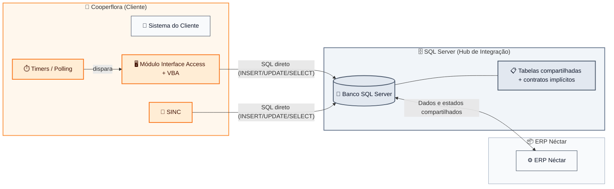
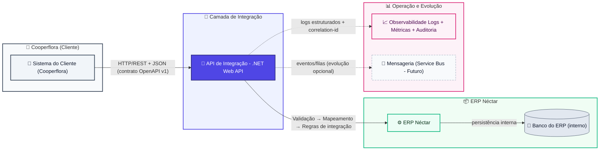
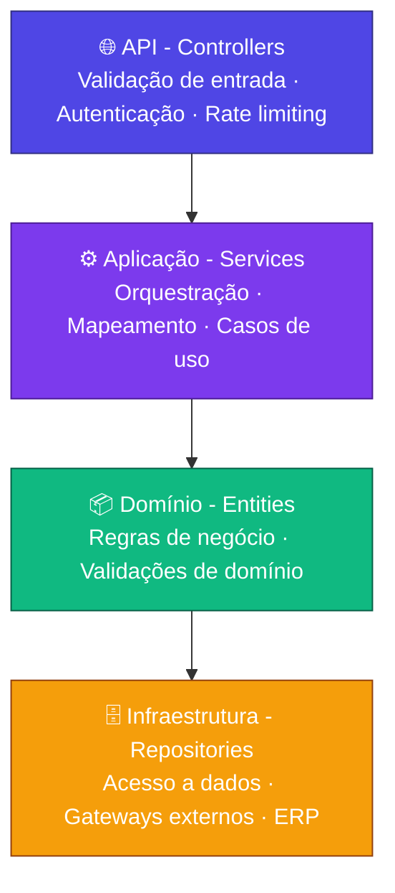
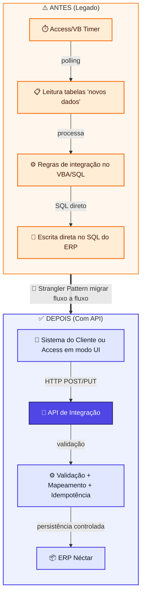
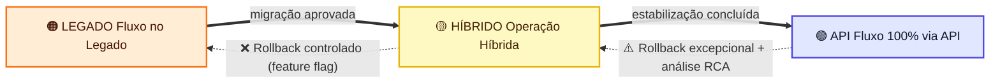
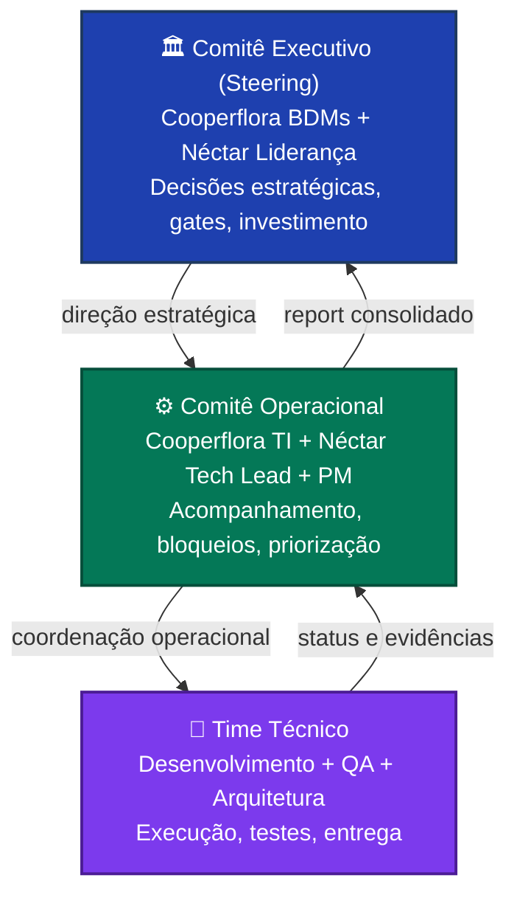
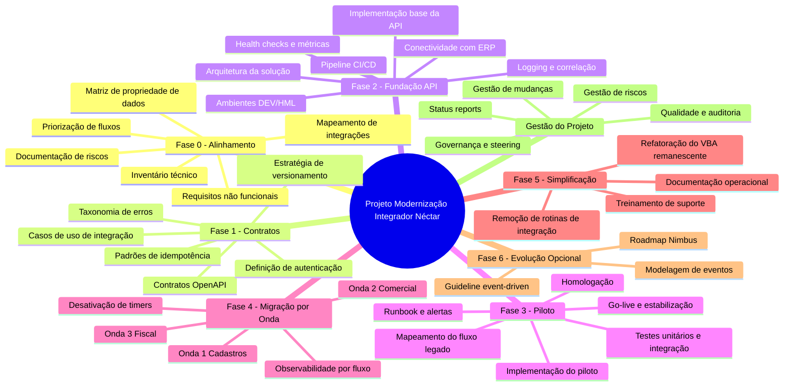
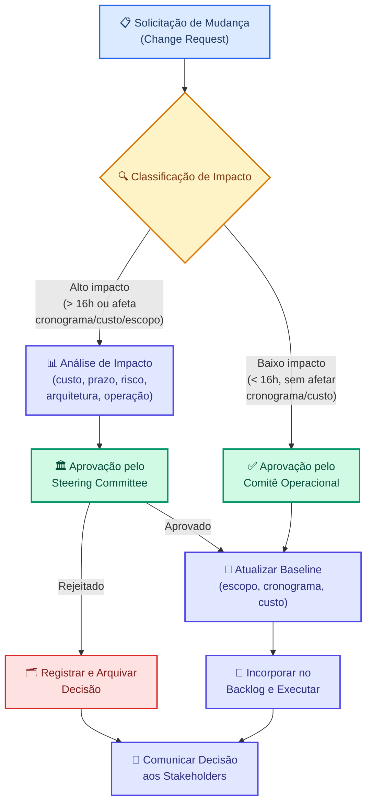

# Plano de Projeto — Modernização do Módulo Integrador do Sistema Néctar (Cooperflora)

> **Versão:** 1.0  
> **Data de emissão:** Abril de 2026  
> **Classificação:** Confidencial — Uso exclusivo dos stakeholders do projeto  
> **Status:** Pronto para aprovação

---

## Sumário

1. [Resumo Executivo](#1--resumo-executivo)
2. [Entendimento Consolidado do Projeto](#2--entendimento-consolidado-do-projeto)
3. [Arquitetura](#3-%EF%B8%8F-arquitetura)
4. [Objetivos, Escopo e Fora de Escopo](#4--objetivos-escopo-e-fora-de-escopo)
5. [Estratégia de Entrega, Metodologia e Governança](#5-%EF%B8%8F-estratégia-de-entrega-metodologia-e-governança)
6. [Estrutura Analítica do Projeto (WBS)](#6--estrutura-analítica-do-projeto-wbs)
7. [Cronograma Detalhado](#7-%EF%B8%8F-cronograma-detalhado)
8. [Estimativa Detalhada de Esforço e Custos](#8--estimativa-detalhada-de-esforço-e-custos)
9. [Plano de Recursos](#9--plano-de-recursos)
10. [Plano de Qualidade](#10--plano-de-qualidade)
11. [Plano de Comunicação](#11--plano-de-comunicação)
12. [Análise de Riscos, Mitigação e Contingência](#12-%EF%B8%8F-análise-de-riscos-mitigação-e-contingência)
13. [KPIs, Métricas de Sucesso e Critérios de Aceitação](#13--kpis-métricas-de-sucesso-e-critérios-de-aceitação)
14. [Plano de Monitoramento, Controle e Gestão de Mudanças](#14-%EF%B8%8F-plano-de-monitoramento-controle-e-gestão-de-mudanças)
15. [Premissas, Exclusões, Dependências e Itens em Aberto](#15--premissas-exclusões-dependências-e-itens-em-aberto)
16. [Conclusão e Recomendação Final](#16--conclusão-e-recomendação-final)

---

## 1. 🚀 Resumo Executivo

### Síntese do Projeto

Este plano formaliza o projeto de **modernização do Módulo Integrador/Interface** utilizado pela **Cooperflora** para integrar com o **ERP Néctar**. O projeto substituirá o modelo atual — baseado em acesso direto ao SQL Server como "hub" de integração, com regras de negócio distribuídas em código VBA/Access e orquestração por timers/polling — por uma **camada de serviços moderna (API REST/.NET)** com contratos explícitos (OpenAPI), segurança, observabilidade e rastreabilidade por transação.

### Contexto e Motivação

A Cooperflora opera sua integração com o ERP Néctar por meio de um módulo legado (Microsoft Access + VBA) e rotinas auxiliares do componente SINC. Este modelo depende criticamente de **co-localização de infraestrutura** (mesmo servidor ou rede com acesso amplo) e de **acesso direto ao banco de dados** do ERP, que atua como barramento implícito de integração. Tabelas compartilhadas, flags de status e convenções não documentadas representam os "contratos" entre sistemas.

Embora funcional no cenário atual, essa arquitetura impõe **riscos crescentes**: incidentes em mudanças de schema ou infraestrutura, custo elevado de suporte, homologação lenta, dependência de especialistas no legado e impossibilidade de operar em cenários com rede segregada ou nuvem. **O cenário futuro não prevê banco compartilhado**, tornando a abordagem atual um bloqueio para evolução.

### Proposta de Valor

A modernização entregará:

- **Contratos explícitos e versionados** (OpenAPI), eliminando ambiguidades e acelerando homologação
- **Desacoplamento total do banco** como interface de integração, viabilizando cenários futuros
- **Observabilidade de ponta a ponta** (logs estruturados, métricas, auditoria por transação)
- **Segurança e controle de acesso** na camada de integração
- **Migração incremental** (Strangler Pattern), sem interrupção operacional
- **Preparação arquitetural** para evolução event-driven e eventual migração para Nimbus

### Abordagem Recomendada

Adoção do **Strangler Pattern** com migração **fluxo a fluxo**, em 7 fases (Fase 0 a Fase 6), operação híbrida controlada por feature flags e rollback por fluxo. Metodologia **híbrida** (cerimônias ágeis para entrega + governança preditiva para controle e aprovações).

### Visão Consolidada

| Dimensão                                      | Resumo                                                                                                              |
| --------------------------------------------- | ------------------------------------------------------------------------------------------------------------------- |
| 🕐 **Prazo estimado (Fases 0–5)**             | ~31 semanas (~7,5 meses)                                                                                            |
| 💰 **Investimento base (Fases 0–5 + Gestão)** | US$ 346.200,00                                                                                                      |
| 💰 **Investimento com contingência (10%)**    | US$ 380.850,00                                                                                                      |
| 💰 **Fase 6 opcional (planejamento)**         | US$ 14.400,00                                                                                                       |
| ⚠️ **Riscos principais**                      | Dependências ocultas no legado; inconsistência de dados na operação híbrida; atrasos em homologação; escopo mutável |
| ✅ **Fator crítico de sucesso**               | Participação ativa da Cooperflora na validação, homologação e gestão de mudanças                                    |

### Recomendação Executiva

Recomendamos a **aprovação imediata do projeto** e o início pela **Fase 0 (Alinhamento)**, que tem investimento contido, risco mínimo e gera a base de governança e visibilidade necessárias para decisões informadas nas fases subsequentes. A abordagem incremental permite ajustar ritmo e prioridades a cada fase, com entregas verificáveis e gates de aprovação antes de cada compromisso adicional de investimento.

---

## 2. 🧩 Entendimento Consolidado do Projeto

### 2.1 Contexto de Negócio

A **Cooperflora** é uma cooperativa que utiliza o **ERP Néctar** como sistema de gestão empresarial. Para conectar seus processos internos ao ERP, a Cooperflora depende de um **Módulo Integrador/Interface** desenvolvido em Microsoft Access com lógica VBA, complementado pelo componente auxiliar **SINC** — responsável por criação de pedidos e atualização de status via webhooks.

A integração é sustentada por um modelo em que o **SQL Server do ERP opera como hub de integração**: ambos os sistemas leem e escrevem diretamente em tabelas compartilhadas, utilizando flags, status e convenções históricas como mecanismo de coordenação. Este modelo funciona porque os sistemas estão **co-localizados na mesma infraestrutura** e compartilham credenciais de acesso ao banco.

Para o negócio, as consequências do modelo atual são:

- **Risco operacional elevado**: mudanças no schema do banco ou na infraestrutura podem quebrar integrações sem aviso
- **Custo de suporte crescente**: investigação de falhas depende de análise manual em Access/SQL
- **Homologação lenta e imprevisível**: ausência de contratos formais gera retrabalho e regressões
- **Dependência de especialistas no legado**: regras de integração mescladas com código VBA de interface
- **Bloqueio para evolução**: cenário futuro sem banco compartilhado inviabiliza o modelo atual

### 2.2 Contexto Técnico

A arquitetura técnica atual apresenta as seguintes características:

| Componente              | Descrição Técnica                                                                                                                               |
| ----------------------- | ----------------------------------------------------------------------------------------------------------------------------------------------- |
| **Módulo Integrador**   | Aplicação Microsoft Access + VBA com formulários, timers e rotinas de integração                                                                |
| **SINC**                | Componente de integração que cria pedidos (`POST /api/pedidos`) e atualiza status (`POST /api/atualizarPedido/{chaveItens}/{evento}`) no Néctar |
| **ERP Néctar**          | Sistema ERP com banco SQL Server; possui API parcial para recebimento de pedidos                                                                |
| **Banco de Integração** | Tabelas no SQL Server utilizadas como barramento (tblPedidos, chaveItens, tabelas de status)                                                    |
| **Orquestração**        | Timers/polling no Access/VBA que varrem registros "novos" e aplicam regras                                                                      |
| **Webhooks**            | WebhookDispatcher no Néctar notifica o SINC sobre eventos processados (ex.: `pedido.processado`)                                                |
| **Processamento**       | WebhookProcessorResolver identifica tipo de evento; PedidoProcessadoProcessor trata pedidos processados                                         |
| **CI/CD**               | Pipeline no GitLab com deploy por push com tag semântica (formato `0.0.x`)                                                                      |
| **Hospedagem**          | Servidores Cooperflora (on-premises)                                                                                                            |

**Fluxo atual de pedidos (SINC → Néctar):**

1. Pedido criado no SINC
2. SINC invoca `POST /api/pedidos` do Néctar
3. Néctar cria registro em tblPedidos e atualiza chaveItens no banco de integração
4. Néctar invoca endpoint de atualização de status
5. Integrador processa o evento e dispara webhooks para notificar o SINC

### 2.3 Necessidades Identificadas

| Categoria               | Necessidade                                                                        |
| ----------------------- | ---------------------------------------------------------------------------------- |
| **Desacoplamento**      | Eliminar dependência do banco SQL Server como interface de integração              |
| **Contratos**           | Formalizar contratos de integração com OpenAPI, versionamento e erros padronizados |
| **Orquestração**        | Migrar de timers/polling para integrações transacionais via API                    |
| **Governança de dados** | Definir source of truth por domínio e eliminar dual-write                          |
| **Observabilidade**     | Implementar logs estruturados, métricas, alertas e correlação por transação        |
| **Segurança**           | Adicionar autenticação, autorização e hardening na camada de integração            |
| **Continuidade**        | Garantir operação contínua durante migração (operação híbrida por fluxo)           |
| **Evolução**            | Preparar arquitetura para cenários futuros (rede segregada, nuvem, mensageria)     |

### 2.4 Requisitos Identificados

#### Requisitos Funcionais (explícitos)

- API de integração .NET Web API como camada intermediária
- Endpoints RESTful para cada domínio de integração
- Processamento de eventos via webhooks (WebhookProcessorResolver, PedidoProcessadoProcessor)
- Operação híbrida (legado + API) com roteamento por fluxo
- Desativação progressiva de timers no módulo Access/VBA

#### Requisitos Funcionais (implícitos — premissas adotadas)

- Validação de entrada em todos os endpoints da API
- Mapeamento e normalização de dados entre formatos do cliente e do ERP
- Mecanismo de reprocessamento para transações com falha
- Auditoria de operações (quem enviou, quando, resultado)

#### Requisitos Não Funcionais (identificados, pendentes de quantificação)

| Requisito                      | Status                                                     |
| ------------------------------ | ---------------------------------------------------------- |
| Latência por transação         | ⚠️ Pendente de definição de SLA por fluxo                  |
| Volume de dados                | ⚠️ Pendente de quantificação por domínio                   |
| Disponibilidade                | ⚠️ Pendente de definição (ex.: 99,5% em horário comercial) |
| Segurança (mecanismo de auth)  | ⚠️ Pendente de decisão (OAuth2, API Key, mTLS)             |
| Retenção de logs/auditoria     | ⚠️ Pendente de definição                                   |
| Tempo de recuperação (RTO/RPO) | ⚠️ Pendente de definição                                   |

### 2.5 Stakeholders Identificados

| Stakeholder                        | Papel no Projeto                                                               | Tipo de Envolvimento   |
| ---------------------------------- | ------------------------------------------------------------------------------ | ---------------------- |
| **Cooperflora — TI**               | Ponto focal técnico do cliente; valida conectividade, ambientes e segurança    | Operacional e técnico  |
| **Cooperflora — Operação**         | Usuários dos fluxos de integração; participam de homologação                   | Validação e aceite     |
| **Cooperflora — Áreas de Negócio** | Proprietários dos processos (cadastro, comercial, fiscal); definem prioridades | Decisão de negócio     |
| **Néctar — Produto/Arquitetura**   | Define direção técnica, contratos e padrões da API de integração               | Liderança técnica      |
| **Néctar — Desenvolvimento**       | Implementa a API, testes, observabilidade e CI/CD                              | Execução técnica       |
| **Néctar — Suporte/Operação**      | Suporte pós-go-live; operação e monitoramento da integração                    | Operação e sustentação |

### 2.6 Lacunas, Ambiguidades e Pontos Pendentes

| #   | Lacuna / Ambiguidade                                                            | Impacto Potencial                                  | Recomendação                             |
| --- | ------------------------------------------------------------------------------- | -------------------------------------------------- | ---------------------------------------- |
| L1  | Quantidade exata de fluxos de integração no legado não quantificada             | Pode afetar duração e custo da Fase 4              | Resolver na Fase 0 (inventário técnico)  |
| L2  | Requisitos não funcionais (latência, volume, disponibilidade) não quantificados | Pode gerar retrabalho em requisitos de performance | Resolver na Fase 0                       |
| L3  | Mecanismo de autenticação/autorização não definido                              | Afeta design da Fase 2 e segurança                 | Definir na Fase 1                        |
| L4  | Propriedade de dados (source of truth) por domínio não definida                 | Pode gerar conflitos de dados na operação híbrida  | Resolver na Fase 0                       |
| L5  | Disponibilidade da Cooperflora para homologação não confirmada                  | Pode atrasar Fases 3-5                             | Confirmar antes do kickoff               |
| L6  | Infraestrutura de ambientes DEV/HML não dimensionada                            | Pode atrasar Fase 2                                | Planejar em paralelo com Fase 1          |
| L7  | Complexidade real das regras de negócio no VBA não mensurada                    | Pode aumentar esforço de extração e reconstrução   | Mitigar com engenharia reversa na Fase 0 |
| L8  | Relação entre CDC/Service Broker e modelo de evolução não priorizada            | Pode gerar esforço não planejado                   | Tratar como escopo da Fase 6 (opcional)  |

---

## 3. 🏗️ Arquitetura

### 3.1 Introdução

Esta seção documenta a **transformação arquitetural** proposta no projeto, apresentando a arquitetura atual (AS-IS), a arquitetura alvo (TO-BE), a visão comparativa entre ambas, e os princípios, padrões e diretrizes que orientam todas as decisões técnicas. O objetivo é estabelecer uma referência formal e verificável para stakeholders de negócio (BDMs) e técnicos (TDMs) sobre **de onde partimos, para onde vamos e como chegaremos lá**.

A modernização não se limita a substituir componentes: ela redefine a **fronteira de integração** — do banco como interface para a API como contrato — e introduz capacidades estruturais (observabilidade, segurança, resiliência, governança de contratos) que sustentam a evolução futura com risco controlado.

### 3.2 Arquitetura Atual (AS-IS)

A Cooperflora utiliza um **Módulo Integrador/Interface (Access + VBA)**, com apoio do componente **SINC**, operando com forte dependência do **SQL Server** do ERP como ambiente de integração. Na prática, a integração é implementada como **acesso direto a tabelas** (leitura e escrita), com o banco assumindo o papel de "barramento" através de tabelas compartilhadas, flags/status e convenções que representam estados do processo.

O modelo é sustentado por **timers/polling**: rotinas periódicas varrem registros "novos", aplicam validações/regras e persistem resultados no banco do ERP, em geral sem uma fronteira de serviço explícita. Do ponto de vista técnico, isso aumenta o acoplamento ao schema e cria dependência de comportamentos históricos (contratos implícitos), além de dificultar isolamento de responsabilidades entre UI/legado, regras de integração e persistência.

Essa topologia funciona sobretudo por **co-localização** (mesmo servidor ou rede com acesso amplo) e por credenciais/acessos permissivos ao SQL Server. Em cenários com segregação de rede, credenciais e ambientes (ou evolução para nuvem), o padrão tende a falhar ou exigir exceções arquiteturais, elevando risco operacional e complexidade de manutenção.



### 3.3 Visão Comparativa

| Dimensão                                    | Arquitetura Atual                                                                                                                     | Arquitetura Alvo                                                                                                                   | Benefícios esperados                                                                                                                                        |
| ------------------------------------------- | ------------------------------------------------------------------------------------------------------------------------------------- | ---------------------------------------------------------------------------------------------------------------------------------- | ----------------------------------------------------------------------------------------------------------------------------------------------------------- |
| Fronteira de integração e acoplamento       | Banco como interface: dependência direta de schema/tabelas, co-localização e credenciais; mudanças de banco/infra afetam integrações. | API como fronteira: contratos e gateways definidos; banco do ERP permanece interno ao ERP (não é interface externa).               | Reduz acoplamento e risco de ruptura; substitui o "hub" no banco por camada de serviços; habilita operação em cenários segregados/nuvem.                    |
| Mecanismo de execução e orquestração        | Timers/polling no Access/VBA; varredura de "novos" registros; concorrência/duplicidade dependem de convenções e estados em tabelas.   | Integração transacional via REST/JSON; orquestração explícita na API; evolução opcional para assíncrono quando houver ganho claro. | Elimina polling/timers; melhora previsibilidade de execução; controle explícito de concorrência e reprocessamento.                                          |
| Contratos e versionamento                   | Contratos implícitos (colunas/flags/convenções); sem versionamento formal; alto risco de regressão em alterações.                     | OpenAPI como fonte de verdade; versionamento semântico (ex.: `/v1`); taxonomia de erros e validações padronizadas.                 | Elimina ambiguidades e "efeitos colaterais"; habilita testes de contrato automatizados e compatibilidade planejada entre versões.                           |
| Observabilidade e rastreabilidade           | Baixa: rastreio por investigação em Access/SQL, logs esparsos e estados em tabelas; correlação entre etapas é limitada.               | Logs estruturados, correlation-id ponta a ponta, métricas por endpoint/fluxo, dashboards/alertas e auditoria por transação.        | Reduz MTTR; diagnóstico end-to-end via correlation-id; governança operacional com métricas, alertas e trilha de auditoria.                                  |
| Resiliência, idempotência e reprocessamento | Tratamento de falhas "informal": retries manuais/rotinas; risco de duplicidade e inconsistência em reprocessos.                       | Timeouts/retries controlados, idempotência por chave, políticas de erro padronizadas e trilha de reprocessamento auditável.        | Elimina duplicidades e inconsistências; aumenta robustez frente a falhas de rede/ERP; reprocessamento seguro e auditável.                                   |
| Evolução e governança de mudança            | Evolução lenta e arriscada; dependência de especialistas no legado; mudanças no banco podem quebrar integrações sem sinalização.      | Migração incremental (strangler) por fluxo; feature flags e rollback; governança de contrato/escopo e padrões repetíveis.          | Acelera evolução com risco controlado; reduz dependência do legado; centraliza regras em serviços governáveis; viabiliza migração incremental com rollback. |

### 3.4 Arquitetura Alvo (TO-BE)

A arquitetura alvo introduz uma **API de Integração (.NET Web API)** como fronteira explícita entre o sistema da Cooperflora e o ERP Néctar, eliminando o banco como mecanismo de integração. O cliente passa a integrar por **HTTP/REST + JSON**, e a API concentra responsabilidades de integração: validação, normalização/mapeamento, aplicação de regras de integração, orquestração e persistência através de mecanismos internos (ex.: chamadas ao ERP e/ou acesso ao SQL do ERP quando aplicável), sem expor o banco como interface.

Do ponto de vista de engenharia, a API estabelece padrões essenciais: **contratos OpenAPI** versionados, taxonomia de erros, idempotência por chave, e controles de resiliência (timeouts/retries), reduzindo duplicidades e inconsistências em reprocessamentos. A convivência com o legado é suportada por operação híbrida por fluxo (feature flags/roteamento), permitindo migração incremental com rollback controlado.

Como requisito operacional, a arquitetura alvo incorpora **observabilidade** (logs estruturados, métricas, auditoria e correlation-id) e prepara o caminho para evolução assíncrona (ex.: fila/eventos) onde houver ganho claro, mantendo o princípio central: **a integração não depende de acesso direto ao banco do ERP** e pode operar em cenários segregados/nuvem.



### 3.5 Princípios Arquiteturais (BDAT/TOGAF)

Os princípios abaixo orientam as decisões técnicas do projeto, organizados conforme o modelo **BDAT** (Business, Data, Application, Technology) do framework TOGAF. Cada princípio inclui a razão de negócio (BDM) e as implicações técnicas (TDM).

#### Princípios de Negócio (Business)

| Princípio                    | Descrição                                                           | Implicação para BDMs                                    | Implicação para TDMs                                     |
| ---------------------------- | ------------------------------------------------------------------- | ------------------------------------------------------- | -------------------------------------------------------- |
| **Continuidade operacional** | A integração deve funcionar sem interrupções durante a modernização | Operações não param; risco de transição mitigado        | Operação híbrida por fluxo; rollback controlado          |
| **Evolução incremental**     | Migração fluxo a fluxo (Strangler Pattern), sem "big bang"          | Entregas frequentes; valor demonstrado progressivamente | Feature flags; convivência legado/API por fluxo          |
| **Governança de mudanças**   | Mudanças seguem controle formal com critérios de aceite             | Previsibilidade de prazo/custo; escopo protegido        | Versionamento de contratos; breaking changes controlados |

#### Princípios de Dados (Data)

| Princípio                          | Descrição                                                | Implicação para BDMs                        | Implicação para TDMs                              |
| ---------------------------------- | -------------------------------------------------------- | ------------------------------------------- | ------------------------------------------------- |
| **Source of truth definido**       | Cada domínio tem um dono claro (quem é fonte de verdade) | Reduz conflitos e conciliações manuais      | Direção de fluxo explícita; sem dual-write        |
| **Contratos explícitos (OpenAPI)** | Payloads, erros e versões documentados formalmente       | Homologação mais rápida; menos ambiguidades | OpenAPI como fonte de verdade; testes de contrato |
| **Rastreabilidade por transação**  | Toda operação é rastreável ponta a ponta                 | Auditoria facilitada; diagnóstico rápido    | Correlation-id propagado; logs estruturados       |

#### Princípios de Aplicação (Application)

| Princípio                                       | Descrição                                       | Implicação para BDMs                         | Implicação para TDMs                               |
| ----------------------------------------------- | ----------------------------------------------- | -------------------------------------------- | -------------------------------------------------- |
| **Desacoplamento (sem acesso direto ao banco)** | Sistema do cliente não depende do schema do ERP | Mudanças no ERP não quebram integrações      | API como fronteira; banco interno ao ERP           |
| **Separação de responsabilidades**              | UI, regras de integração e domínio separados    | Menor dependência de especialistas no legado | Lógica em serviços testáveis; legado reduzido a UI |
| **Idempotência e resiliência**                  | Reprocessamentos não corrompem dados            | Menos incidentes por duplicidade             | Chaves de idempotência; retries controlados        |

#### Princípios de Tecnologia (Technology)

| Princípio                            | Descrição                                            | Implicação para BDMs                         | Implicação para TDMs                            |
| ------------------------------------ | ---------------------------------------------------- | -------------------------------------------- | ----------------------------------------------- |
| **Observabilidade como requisito**   | Tudo que integra deve ser monitorável e auditável    | Visibilidade operacional; MTTR reduzido      | Logs estruturados; métricas; dashboards/alertas |
| **Segurança por design**             | Autenticação, autorização e hardening desde o início | Redução de risco de exposição                | OAuth2/API Key/mTLS; TLS; rate limiting         |
| **Preparação para nuvem/segregação** | Integração funciona sem co-localização de banco      | Habilita iniciativas futuras de modernização | API REST/JSON; sem dependência de rede local    |

### 3.6 Padrões Técnicos de Integração

Esta subseção detalha os **padrões técnicos** que operacionalizam os princípios arquiteturais. Enquanto os princípios orientam "o quê" e "por quê", os padrões definem "como" implementar.

#### Padrão de API e Contratos

| Aspecto           | Padrão Definido                                                                     |
| ----------------- | ----------------------------------------------------------------------------------- |
| **Estilo**        | REST/JSON como protocolo de integração                                              |
| **Contratos**     | OpenAPI/Swagger como fonte de verdade; especificação versionada por fluxo           |
| **Versionamento** | Versão no path (`/v1`, `/v2`); política de compatibilidade e deprecação documentada |
| **Geração**       | Clientes gerados a partir do contrato quando aplicável (SDK, tipos)                 |

#### Tratamento de Erros

| Código HTTP | Categoria          | Uso                                                      |
| ----------- | ------------------ | -------------------------------------------------------- |
| 4xx         | Erros de validação | Payload inválido, campos obrigatórios, regras de negócio |
| 401         | Autenticação       | Token ausente ou inválido                                |
| 403         | Autorização        | Permissão negada para a operação                         |
| 409         | Conflito           | Violação de idempotência ou estado inconsistente         |
| 503         | Indisponibilidade  | ERP ou dependência fora do ar                            |

**Payload de erro padrão:**

```json
{
  "code": "VALIDATION_ERROR",
  "message": "Descrição legível do erro",
  "details": [{ "field": "campo", "issue": "descrição" }],
  "correlationId": "uuid-da-transacao"
}
```

#### Idempotência e Reprocessamento

| Aspecto           | Padrão                                                                                |
| ----------------- | ------------------------------------------------------------------------------------- |
| **Chave**         | Header `Idempotency-Key` ou chave de negócio + origem (ex.: `pedido-123-cooperflora`) |
| **Comportamento** | Reenvio retorna mesmo resultado sem duplicar efeitos colaterais                       |
| **Auditoria**     | Resultado do reprocessamento registrado com correlation-id                            |
| **Janela**        | Idempotência garantida por período configurável (ex.: 24h)                            |

#### Propriedade de Dados (Source of Truth)

| Domínio     | Source of Truth | Direção do Fluxo                       | Observação        |
| ----------- | --------------- | -------------------------------------- | ----------------- |
| Pessoas     | A definir       | Cooperflora → ERP ou ERP → Cooperflora | Validar na Fase 0 |
| Produtos    | A definir       | A definir                              | Validar na Fase 0 |
| Pedidos     | A definir       | A definir                              | Validar na Fase 0 |
| Faturamento | A definir       | A definir                              | Validar na Fase 0 |

> **Regra**: Evitar dual-write. Quando inevitável durante transição, exigir governança explícita e trilha de auditoria.

#### Evolução para Event-Driven

| Critério para adoção                        | Padrão                             |
| ------------------------------------------- | ---------------------------------- |
| Picos de carga que exigem desacoplamento    | Considerar fila (ex.: Service Bus) |
| Latência tolerável (não crítico tempo-real) | Candidato a assíncrono             |
| Múltiplos consumidores                      | Modelar como evento publicado      |

**Padrões obrigatórios para event-driven:**

- Dead Letter Queue (DLQ) para mensagens não processadas
- Retries com backoff exponencial
- Tratamento de poison messages
- Preservação de correlation-id entre eventos

### 3.7 Diretrizes de Arquitetura e Desenvolvimento

#### Arquitetura em Camadas



| Diretriz                       | Descrição                                          |
| ------------------------------ | -------------------------------------------------- |
| Validação na borda             | Validar entrada na camada API antes de propagar    |
| Regras de integração testáveis | Lógica em serviços com injeção de dependência      |
| Desacoplamento do ERP          | Acesso ao ERP via gateways/repositórios abstraídos |

#### Estratégia de Testes

| Tipo           | Escopo                           | Ferramenta/Abordagem                    |
| -------------- | -------------------------------- | --------------------------------------- |
| **Unitário**   | Regras de validação e mapeamento | xUnit/NUnit + mocks                     |
| **Integração** | API ↔ ERP (ou mocks controlados) | TestServer + dados de referência        |
| **Contrato**   | Validação do OpenAPI             | Mock server / consumer-driven contracts |
| **E2E**        | Cenários por fluxo               | Auditoria de efeitos + correlation-id   |

#### DevOps e Ambientes

| Ambiente | Propósito                          | Dados                                |
| -------- | ---------------------------------- | ------------------------------------ |
| **DEV**  | Desenvolvimento e testes unitários | Dados sintéticos ou anonimizados     |
| **HML**  | Homologação com stakeholders       | Dados representativos (anonimizados) |
| **PRD**  | Produção                           | Dados reais                          |

**Pipeline CI/CD:**

1. Build + lint
2. Testes unitários
3. Validação de contrato OpenAPI
4. Testes de integração
5. Deploy para ambiente alvo
6. Smoke test pós-deploy

### 3.8 Estratégia de Modernização: Strangler Pattern

A abordagem adotada é o **Strangler Pattern**, com extração gradual da lógica de integração do legado e introdução de uma camada de serviço moderna. O processo é executado **fluxo a fluxo**, garantindo continuidade operacional e redução de risco.



**Ciclo de execução por fluxo:**

| Etapa | Ação                                  | Entregável                                      |
| ----- | ------------------------------------- | ----------------------------------------------- |
| 1     | Mapear fluxo e dependências no legado | Diagrama de fluxo + inventário de dependências  |
| 2     | Definir contrato OpenAPI              | Especificação versionada                        |
| 3     | Implementar fluxo na API              | Endpoint com validação, idempotência, auditoria |
| 4     | Roteamento híbrido (legado → API)     | Feature flag ativa + fallback configurado       |
| 5     | Estabilização e desativação do timer  | Métricas OK + timer desligado                   |
| 6     | Repetir para próximo fluxo            | Padrões consolidados                            |

### 3.9 Operação Híbrida e Ciclo de Estados

A convivência é gerenciada **por fluxo**, não por "sistema inteiro". Cada fluxo transita por três estados, com critérios de transição e possibilidade de rollback.



| Estado      | Descrição                                  | Critério de Transição                                 |
| ----------- | ------------------------------------------ | ----------------------------------------------------- |
| **Legado**  | Fluxo operando via timers/polling          | Contrato aprovado + API implementada                  |
| **Híbrido** | API ativa + legado funcional como fallback | Estabilização OK (≥2 semanas sem incidentes críticos) |
| **API**     | Fluxo 100% via API, timer desativado       | Aceite formal + evidência de desativação              |

**Estratégias de rollback:**

- Feature flags por fluxo com roteamento configurável
- Janela de estabilização (ex.: 2 semanas) com monitoramento reforçado
- Reprocessamento via mecanismos de reenvio/replay com idempotência
- Plano de comunicação com critérios de acionamento de rollback

---

## 4. 🎯 Objetivos, Escopo e Fora de Escopo

### 4.1 Objetivos Estratégicos

| #   | Objetivo Estratégico                                                  | Indicador de Sucesso                                          |
| --- | --------------------------------------------------------------------- | ------------------------------------------------------------- |
| OE1 | Eliminar dependência do banco SQL Server como interface de integração | 100% dos fluxos críticos operando via API ao final do projeto |
| OE2 | Garantir continuidade operacional durante toda a migração             | Zero interrupções não planejadas atribuíveis ao projeto       |
| OE3 | Habilitar cenários futuros com rede segregada e/ou nuvem              | API operacional sem dependência de co-localização             |
| OE4 | Reduzir risco operacional e custo de suporte da integração            | Redução mensurável de incidentes de integração                |

### 4.2 Objetivos Táticos

| #   | Objetivo Tático                                                             | Fase Alvo |
| --- | --------------------------------------------------------------------------- | --------- |
| OT1 | Mapear integralmente todos os pontos de integração e dependências do legado | Fase 0    |
| OT2 | Definir e aprovar contratos OpenAPI por domínio de negócio                  | Fase 1    |
| OT3 | Estabelecer API funcional com observabilidade e pipeline CI/CD              | Fase 2    |
| OT4 | Colocar primeiro fluxo em produção via API (piloto)                         | Fase 3    |
| OT5 | Migrar progressivamente todos os fluxos críticos                            | Fase 4    |
| OT6 | Simplificar o legado até que não execute mais nenhuma integração crítica    | Fase 5    |

### 4.3 Objetivos Técnicos

| #    | Objetivo Técnico                                                                                                               |
| ---- | ------------------------------------------------------------------------------------------------------------------------------ |
| OTc1 | Implementar API de integração .NET Web API com arquitetura em camadas, injeção de dependência e separação de responsabilidades |
| OTc2 | Formalizar contratos OpenAPI com versionamento semântico, taxonomia de erros e validação automatizada                          |
| OTc3 | Implementar observabilidade: logs estruturados, correlation-id ponta a ponta, métricas por endpoint, dashboards e alertas      |
| OTc4 | Implementar segurança: autenticação, autorização, rate limiting, TLS e princípio do menor privilégio                           |
| OTc5 | Implementar idempotência por chave e mecanismos de reprocessamento auditável                                                   |
| OTc6 | Estabelecer pipeline CI/CD com build, testes, validação de contrato e deploy automatizado                                      |
| OTc7 | Documentar guideline para evolução event-driven (CDC, Service Broker, Service Bus)                                             |

### 4.4 Escopo do Projeto

O escopo contempla a **modernização incremental do Módulo Integrador/Interface**, com transição do modelo "banco como hub de integração" para uma camada de serviços (API), mantendo a operação contínua do negócio.

| #   | Item de Escopo                       | Descrição                                                                                                                  |
| --- | ------------------------------------ | -------------------------------------------------------------------------------------------------------------------------- |
| E1  | **API de Integração (.NET Web API)** | Camada intermediária com validação, mapeamento, resiliência, health checks, logging estruturado e correlação por transação |
| E2  | **Contratos OpenAPI**                | Modelagem de payloads, erros, versionamento e requisitos por fluxo (idempotência, limites, SLAs alvo)                      |
| E3  | **Fluxo piloto end-to-end**          | Implementação completa do fluxo "Cadastro de Pessoas" via API, com estabilização em produção                               |
| E4  | **Operação híbrida por fluxo**       | Feature flags, roteamento legado/API, critérios de cutover, procedimentos de rollback                                      |
| E5  | **Descomissionamento de timers**     | Inventário, substituição por chamadas via API, desligamento progressivo com critérios por fluxo                            |
| E6  | **Observabilidade e auditoria**      | Logs estruturados, métricas, dashboards, alertas e auditoria por transação                                                 |
| E7  | **Segurança da API**                 | Autenticação, autorização, rate limiting, validação de payload, hardening                                                  |
| E8  | **Migração de fluxos por onda**      | Cadastros (pessoas, produtos, auxiliares), Comercial (pedidos, movimentos), Fiscal (faturamento)                           |
| E9  | **Simplificação do legado**          | Remoção de rotinas de integração do Access/VBA, refatoração do remanescente                                                |
| E10 | **Guideline de evolução**            | Documentação técnica para evolução event-driven (CDC, Service Broker, Service Bus), sem implantação obrigatória            |

#### Escopo por Domínio de Negócio

| Domínio                     | Fluxos em Escopo                                  | Prioridade              |
| --------------------------- | ------------------------------------------------- | ----------------------- |
| **Fundação de Plataforma**  | API, contratos, observabilidade, segurança, CI/CD | Alta (Fases 0–2)        |
| **Cadastros (Master Data)** | Pessoas (piloto), Produtos, Tabelas auxiliares    | Alta (Fases 3–4)        |
| **Comercial**               | Pedidos, Movimentos                               | Média (Fase 4)          |
| **Fiscal/Faturamento**      | Faturamento, Notas fiscais                        | Média-Baixa (Fases 4–5) |
| **Operação e Governança**   | Runbooks, dashboards, alertas, gestão de mudanças | Contínuo                |

### 4.5 Fora de Escopo

| #   | Item Fora de Escopo                                             | Justificativa                                                                                  |
| --- | --------------------------------------------------------------- | ---------------------------------------------------------------------------------------------- |
| FE1 | Reescrita completa do ERP Néctar                                | Programa maior e não necessário para o objetivo do projeto                                     |
| FE2 | Reescrita completa do sistema do cliente (Cooperflora)          | O projeto foca no integrador; mudanças no cliente limitam-se ao necessário para consumir a API |
| FE3 | Migração completa para arquitetura event-driven                 | O escopo contempla preparação e guideline; implantação depende de Fase 6 (opcional)            |
| FE4 | Projeto integral de migração para Nimbus                        | Apenas preparação arquitetural e roadmap                                                       |
| FE5 | Mudanças funcionais profundas nos processos de negócio          | Foco em modernização técnica, mantendo compatibilidade funcional                               |
| FE6 | Novas integrações não listadas no escopo                        | Devem seguir processo de controle de mudanças                                                  |
| FE7 | Migração de infraestrutura para nuvem                           | O projeto prepara a arquitetura; migração de infra é iniciativa separada                       |
| FE8 | Treinamento de usuários finais da Cooperflora                   | Responsabilidade da Cooperflora, com suporte de documentação do projeto                        |
| FE9 | Implantação de CDC/Service Broker/Azure Service Bus em produção | Planejamento e guideline estão em escopo; implantação é Fase 6 (opcional)                      |

### 4.6 Condicionantes de Sucesso

| #   | Condicionante                                                                  | Impacto se Ausente                                       |
| --- | ------------------------------------------------------------------------------ | -------------------------------------------------------- |
| C1  | Participação ativa da Cooperflora em workshops, homologação e validação        | Atrasos em fases de validação e risco de retrabalho      |
| C2  | Acesso técnico aos ambientes SQL Server, Access e infraestrutura de rede       | Bloqueio na Fase 2 e impossibilidade de validação em HML |
| C3  | Disponibilidade de SMEs (Subject Matter Experts) do negócio para mapear regras | Regras de integração incompletas ou incorretas           |
| C4  | Estabilidade do ambiente de produção durante janelas de migração               | Aumento de risco e possíveis rollbacks desnecessários    |
| C5  | Compromisso com o processo de controle de mudanças                             | Scope creep e comprometimento do cronograma/custo        |

---

## 5. 🏗️ Estratégia de Entrega, Metodologia e Governança

### 5.1 Abordagem Metodológica: Híbrida

Adoção de uma abordagem **híbrida**, combinando:

- **Governança preditiva** para planejamento, baseline de custos/prazo, controle de mudanças e aprovações formais
- **Execução ágil** para entrega incremental, feedback rápido e adaptação por fluxo

**Justificativa para a abordagem híbrida:**

| Característica do Projeto                     | Requer Governança Preditiva       | Requer Agilidade                    |
| --------------------------------------------- | --------------------------------- | ----------------------------------- |
| Operação crítica em produção                  | ✅ Controle de escopo e rollback  |                                     |
| Migração incremental por fluxo                |                                   | ✅ Entregas frequentes e feedback   |
| Envolvimento do cliente para validação        |                                   | ✅ Iterações curtas com homologação |
| Necessidade de previsibilidade de custo       | ✅ Baseline de investimento       |                                     |
| Regras de negócio não totalmente documentadas |                                   | ✅ Descoberta progressiva           |
| Convivência legado/API por período estendido  | ✅ Critérios formais de transição |                                     |

### 5.2 Estrutura de Governança



#### Comitê Executivo (Steering)

| Aspecto               | Definição                                                                                                      |
| --------------------- | -------------------------------------------------------------------------------------------------------------- |
| **Composição**        | BDMs da Cooperflora + Liderança do Néctar                                                                      |
| **Periodicidade**     | Mensal (ou sob demanda para gates e escalonamentos)                                                            |
| **Responsabilidades** | Aprovação de gates entre fases; decisões de investimento; priorização estratégica; resolução de escalonamentos |
| **Artefatos**         | Relatório executivo de status; painel de riscos; registro de decisões                                          |

#### Comitê Operacional

| Aspecto               | Definição                                                                                        |
| --------------------- | ------------------------------------------------------------------------------------------------ |
| **Composição**        | TI Cooperflora + Tech Lead Néctar + PM                                                           |
| **Periodicidade**     | Semanal                                                                                          |
| **Responsabilidades** | Acompanhamento de progresso; gestão de bloqueios; revisão de backlog; coordenação de homologação |
| **Artefatos**         | Status report semanal; log de impedimentos; ata de decisões                                      |

#### Time Técnico

| Aspecto               | Definição                                                                |
| --------------------- | ------------------------------------------------------------------------ |
| **Composição**        | Desenvolvedores + QA + Arquiteto                                         |
| **Periodicidade**     | Daily (15 min) + sessões técnicas conforme necessidade                   |
| **Responsabilidades** | Implementação; testes; instrumentação; code review; documentação técnica |
| **Artefatos**         | Código; testes; especificações OpenAPI; evidências de qualidade          |

### 5.3 Ritos e Cerimônias

| Rito                           | Periodicidade         | Duração | Participantes                 | Objetivo                                                     |
| ------------------------------ | --------------------- | ------- | ----------------------------- | ------------------------------------------------------------ |
| **Kickoff**                    | Única                 | 2h      | Todos os stakeholders         | Alinhamento inicial, validação do plano, definição de papéis |
| **Daily**                      | Diária                | 15 min  | Time técnico                  | Sincronização, impedimentos                                  |
| **Revisão de Sprint/Iteração** | Quinzenal             | 1h      | Time técnico + Cooperflora TI | Demonstração de entregáveis, feedback                        |
| **Comitê Operacional**         | Semanal               | 1h      | Cooperflora TI + Néctar PM/TL | Status, bloqueios, priorização                               |
| **Steering Committee**         | Mensal                | 1h      | BDMs + Liderança              | Gates, investimento, escalonamentos                          |
| **Retrospectiva**              | Quinzenal             | 45 min  | Time técnico                  | Melhoria contínua                                            |
| **Revisão de Arquitetura**     | Sob demanda           | 1-2h    | Arquiteto + Tech Lead + SMEs  | Decisões técnicas com impacto estrutural                     |
| **Gate de Fase**               | Ao final de cada fase | 1-2h    | Steering + Operacional        | Aprovação para prosseguir à fase seguinte                    |

### 5.4 Gates de Aprovação entre Fases

| Gate        | Localização     | Decisor          | Critério Principal                                                      |
| ----------- | --------------- | ---------------- | ----------------------------------------------------------------------- |
| **G0 → G1** | Final da Fase 0 | Steering         | Inventário completo; escopo validado; riscos aceitáveis                 |
| **G1 → G2** | Final da Fase 1 | Steering         | Contratos aprovados; padrões de integração definidos                    |
| **G2 → G3** | Final da Fase 2 | Operacional + TL | API funcional em DEV/HML; smoke test OK; pipeline CI/CD validado        |
| **G3 → G4** | Final da Fase 3 | Steering         | Piloto estável em produção (≥2 semanas); lições aprendidas documentadas |
| **G4 → G5** | Fase 4 (80%+)   | Steering         | ≥80% dos fluxos críticos via API; timers de fluxos migrados desativados |
| **G5 → G6** | Final da Fase 5 | Steering         | Legado simplificado; operação estável; documentação entregue            |

### 5.5 Gestão de Backlog e Requisitos

- Backlog centralizado e priorizado pelo critério **valor de negócio × risco × complexidade**
- Requisitos validados por domínio com stakeholders de negócio
- Contratos OpenAPI como **artefato vivo** — atualizado e versionado a cada iteração
- Definition of Done (DoD) por tipo de entregável (contrato, endpoint, fluxo, documentação)

### 5.6 Gestão de Mudanças (resumo — detalhado na Seção 14)

- Mudanças em escopo, contratos ou cronograma seguem processo formal de **Change Request**
- Avaliação obrigatória de impacto (custo, prazo, risco, arquitetura, operação)
- Aprovação conforme criticidade: Operacional (baixo impacto) ou Steering (impacto estratégico)
- Baseline atualizada somente após aprovação formal

---

## 6. 📦 Estrutura Analítica do Projeto (WBS)

### 6.1 Visão Geral da WBS



### 6.2 Decomposição Detalhada

#### WBS — Fase 0: Alinhamento e Contenção de Riscos

| WBS | Entregável                                                    | Critério de Entrada                     | Critério de Saída                                         |
| --- | ------------------------------------------------------------- | --------------------------------------- | --------------------------------------------------------- |
| 0.1 | Inventário técnico do módulo Access/VBA e SINC                | Acesso ao código-fonte e banco de dados | Lista completa de rotinas, timers, tabelas e dependências |
| 0.2 | Mapeamento de pontos de integração (fluxos, tabelas, eventos) | Inventário técnico (0.1)                | Diagrama de fluxos e dependências validado                |
| 0.3 | Matriz de propriedade de dados por domínio                    | Mapeamento (0.2) + input de negócio     | Matriz aprovada por Cooperflora e Néctar                  |
| 0.4 | Requisitos não funcionais e restrições                        | Input de TI e operação da Cooperflora   | Lista quantificada e priorizada                           |
| 0.5 | Priorização de fluxos para migração                           | Todos os entregáveis 0.1–0.4            | Backlog priorizado com critérios do piloto                |
| 0.6 | Documentação de riscos e plano de mitigação                   | Todos os entregáveis 0.1–0.5            | Registro de riscos com mitigações aprovado                |

#### WBS — Fase 1: Definição dos Contratos de Integração

| WBS | Entregável                               | Critério de Entrada                 | Critério de Saída                            |
| --- | ---------------------------------------- | ----------------------------------- | -------------------------------------------- |
| 1.1 | Documentação de casos de uso por domínio | Gate G0 aprovado                    | Casos de uso documentados e validados        |
| 1.2 | Especificação OpenAPI v1 (piloto)        | Caso de uso (1.1)                   | Contrato OpenAPI aprovado por ambos os times |
| 1.3 | Taxonomia de erros e padronização        | Caso de uso (1.1)                   | Documento de padrões aprovado                |
| 1.4 | Estratégia de versionamento da API       | Contrato (1.2)                      | Guideline de versionamento documentado       |
| 1.5 | Padrões de idempotência por fluxo        | Caso de uso (1.1)                   | Documento técnico aprovado                   |
| 1.6 | Definição de autenticação/autorização    | Requisitos de segurança (0.4)       | Mecanismo de auth definido e aprovado        |
| 1.7 | Plano de testes de contrato              | Contrato (1.2) + padrões (1.3, 1.5) | Estratégia de teste de contrato documentada  |

#### WBS — Fase 2: Fundação da API

| WBS | Entregável                                      | Critério de Entrada              | Critério de Saída                         |
| --- | ----------------------------------------------- | -------------------------------- | ----------------------------------------- |
| 2.1 | Arquitetura da solução (camadas, DI, validação) | Gate G1 aprovado                 | Documento de arquitetura + solução criada |
| 2.2 | Implementação base da API (.NET Web API)        | Arquitetura (2.1)                | Código-fonte com estrutura base funcional |
| 2.3 | Logging estruturado e correlation-id            | API base (2.2)                   | Padrões de log implementados e validados  |
| 2.4 | Health checks e métricas                        | API base (2.2)                   | Endpoints de saúde + métricas expostas    |
| 2.5 | Conectividade segura com ERP (SQL Server)       | Acesso a ambientes DEV/HML       | Conexão validada com evidência            |
| 2.6 | Pipeline CI/CD (build, test, deploy)            | Código-fonte (2.2) + infra de CI | Pipeline funcional com evidência          |
| 2.7 | Configuração de ambientes DEV/HML               | Infraestrutura provisionada      | Ambientes documentados e acessíveis       |
| 2.8 | Documentação Swagger/Scalar                     | API funcional (2.2)              | Documentação acessível e atualizada       |
| 2.9 | Smoke tests de ponta a ponta                    | Todos os entregáveis 2.1–2.8     | Relatório de smoke test aprovado          |

#### WBS — Fase 3: Fluxo Piloto

| WBS  | Entregável                                                 | Critério de Entrada                       | Critério de Saída                                  |
| ---- | ---------------------------------------------------------- | ----------------------------------------- | -------------------------------------------------- |
| 3.1  | Mapeamento detalhado do fluxo legado (Cadastro de Pessoas) | Gate G2 aprovado                          | Documento de mapeamento validado                   |
| 3.2  | Implementação do fluxo na API                              | Contrato OpenAPI (1.2) + mapeamento (3.1) | Endpoint funcional com validação e idempotência    |
| 3.3  | Instrumentação de observabilidade                          | Implementação (3.2)                       | Logs, métricas e auditoria configurados            |
| 3.4  | Testes unitários e de integração                           | Implementação (3.2)                       | Relatório de testes com cobertura adequada         |
| 3.5  | Testes E2E                                                 | Testes (3.4) + ambiente HML (2.7)         | Cenários E2E validados                             |
| 3.6  | Ajustes no legado para convivência                         | Implementação (3.2)                       | Legado adaptado com feature flag                   |
| 3.7  | Homologação com usuários                                   | Testes (3.4, 3.5)                         | Aceite de homologação assinado                     |
| 3.8  | Go-live e janela de estabilização                          | Homologação (3.7)                         | ≥2 semanas estável em produção                     |
| 3.9  | Runbook operacional e alertas                              | Go-live (3.8)                             | Runbook publicado + alertas ativos                 |
| 3.10 | Relatório de lições aprendidas                             | Estabilização (3.8)                       | Documento com lições e ajustes para próximas ondas |

#### WBS — Fase 4: Migração por Onda

| WBS | Entregável                                      | Critério de Entrada         | Critério de Saída                                    |
| --- | ----------------------------------------------- | --------------------------- | ---------------------------------------------------- |
| 4.1 | **Onda 1 — Cadastros** (Produtos, Auxiliares)   | Gate G3 + padrões do piloto | Fluxos cadastrais 100% via API + timers desativados  |
| 4.2 | **Onda 2 — Comercial** (Pedidos, Movimentos)    | Onda 1 concluída            | Fluxos comerciais via API + timers desativados       |
| 4.3 | **Onda 3 — Fiscal** (Faturamento, NF)           | Onda 2 concluída            | Fluxos fiscais via API + compliance validado         |
| 4.4 | Observabilidade por fluxo (dashboards, alertas) | Cada onda completada        | Dashboards por domínio operacionais                  |
| 4.5 | Desativação de timers (por fluxo migrado)       | Estabilização de cada onda  | Evidência de timer desativado sem regressão          |
| 4.6 | Matriz de integração atualizada                 | Cada onda completada        | Matriz classificando cada fluxo (legado/híbrido/API) |

#### WBS — Fase 5: Simplificação do Legado

| WBS | Entregável                                             | Critério de Entrada               | Critério de Saída                            |
| --- | ------------------------------------------------------ | --------------------------------- | -------------------------------------------- |
| 5.1 | Remoção de formulários/rotinas de integração obsoletas | ≥80% dos fluxos críticos migrados | Código legado limpo de rotinas de integração |
| 5.2 | Refatoração do VBA remanescente (somente UI)           | Remoção (5.1)                     | Código legado simplificado e documentado     |
| 5.3 | Migração de regras de negócio para API/SPs             | Implementação das ondas (4.1–4.3) | Regras centralizadas em serviços testáveis   |
| 5.4 | Documentação operacional final                         | Todos os entregáveis 5.1–5.3      | Documentação entregue e validada             |
| 5.5 | Atualização de runbooks e alertas                      | Documentação (5.4)                | Runbooks finais publicados                   |
| 5.6 | Treinamento operacional de suporte                     | Documentação (5.4)                | Evidência de treinamento realizado           |
| 5.7 | Testes de regressão finais                             | Todos os entregáveis 5.1–5.3      | Relatório de regressão sem falhas críticas   |

#### WBS — Fase 6: Evolução Opcional (Planejamento)

| WBS | Entregável                                        | Critério de Entrada             | Critério de Saída                   |
| --- | ------------------------------------------------- | ------------------------------- | ----------------------------------- |
| 6.1 | Guideline de arquitetura event-driven             | Padrões do projeto consolidados | Documento técnico aprovado          |
| 6.2 | Modelagem de eventos por domínio                  | Guideline (6.1)                 | Catálogo de eventos documentado     |
| 6.3 | Roadmap de migração para Nimbus                   | Todos os entregáveis 6.1–6.2    | Roadmap com custo e prazo estimados |
| 6.4 | Avaliação de tecnologias (Service Bus, CDC, etc.) | Requisitos de evolução          | Análise comparativa documentada     |

#### WBS — Gestão do Projeto (transversal)

| WBS  | Entregável                               | Periodicidade    |
| ---- | ---------------------------------------- | ---------------- |
| GP.1 | Status reports (operacional e executivo) | Semanal / Mensal |
| GP.2 | Gestão de riscos e issues                | Contínua         |
| GP.3 | Gestão de mudanças (Change Requests)     | Sob demanda      |
| GP.4 | Governança e steering committees         | Mensal           |
| GP.5 | Controle de qualidade e auditorias       | Por fase         |

---

## 7. 🗓️ Cronograma Detalhado

### 7.1 Premissas do Cronograma

- **Data projetada de kickoff**: Maio de 2026 _(premissa adotada — sujeita a aprovação do cliente)_
- Semana de trabalho: 5 dias úteis, 8 horas/dia
- As datas específicas serão ajustadas na aprovação formal do kickoff
- Fases são sequenciais com possibilidade de paralelismo parcial onde indicado
- Buffers estão embutidos nas estimativas de duração

### 7.2 Diagrama Gantt

```mermaid
gantt
    title Cronograma do Projeto - Modernização Integrador Néctar
    dateFormat YYYY-MM-DD
    axisFormat %d/%m/%y
    tickInterval 2week

    section Fase 0 - Alinhamento
    Inventário técnico Access/VBA/SINC          :f01, 2026-05-04, 5d
    Mapeamento de integrações                   :f02, after f01, 4d
    Matriz de propriedade de dados              :f03, after f02, 2d
    Requisitos não funcionais                   :f04, after f02, 2d
    Priorização de fluxos                       :f05, after f03, 2d
    Documentação de riscos                      :f06, after f05, 1d
    Gate G0 - Go/No-Go                          :milestone, g0, after f06, 0d

    section Fase 1 - Contratos
    Casos de uso de integração                  :f11, after g0, 3d
    Especificação OpenAPI v1 piloto             :f12, after f11, 5d
    Taxonomia de erros e padrões                :f13, after f11, 2d
    Estratégia de versionamento                 :f14, after f12, 1d
    Padrões de idempotência                     :f15, after f12, 2d
    Definição de autenticação                   :f16, after f13, 2d
    Plano de testes de contrato                 :f17, after f15, 1d
    Gate G1 - Contratos aprovados               :milestone, g1, after f17, 0d

    section Fase 2 - Fundação API
    Arquitetura da solução                      :f21, after g1, 5d
    Implementação base da API                   :f22, after f21, 8d
    Logging e correlation-id                    :f23, after f22, 3d
    Health checks e métricas                    :f24, after f22, 2d
    Conectividade com ERP                       :f25, after f21, 3d
    Pipeline CI/CD                              :f26, after f22, 4d
    Configuração ambientes DEV/HML             :f27, after f21, 3d
    Documentação Swagger                        :f28, after f23, 1d
    Smoke tests                                 :f29, after f28, 2d
    Gate G2 - Infra pronta                      :milestone, g2, after f29, 0d

    section Fase 3 - Piloto
    Mapeamento fluxo legado Pessoas             :f31, after g2, 3d
    Implementação do fluxo na API               :crit, f32, after f31, 10d
    Instrumentação observabilidade              :f33, after f32, 3d
    Testes unitários e integração               :f34, after f32, 4d
    Testes E2E                                  :f35, after f34, 2d
    Ajustes legado para convivência             :f36, after f32, 3d
    Homologação com usuários                    :f37, after f35, 2d
    Go-live e estabilização                     :crit, f38, after f37, 10d
    Runbook e alertas                           :f39, after f37, 2d
    Lições aprendidas                           :f310, after f38, 1d
    Gate G3 - Piloto estável                    :milestone, g3, after f310, 0d

    section Fase 4 - Onda 1 Cadastros
    Mapeamento fluxos cadastrais                :f41, after g3, 4d
    Implementação Onda 1                        :crit, f42, after f41, 15d
    Testes Onda 1                               :f43, after f42, 6d
    Homologação Onda 1                          :f44, after f43, 3d
    Estabilização Onda 1                        :f45, after f44, 10d

    section Fase 4 - Onda 2 Comercial
    Mapeamento fluxos comerciais                :f46, after f44, 5d
    Implementação Onda 2                        :crit, f47, after f46, 20d
    Testes Onda 2                               :f48, after f47, 7d
    Homologação Onda 2                          :f49, after f48, 4d
    Estabilização Onda 2                        :f410, after f49, 10d

    section Fase 4 - Onda 3 Fiscal
    Mapeamento fluxos fiscais                   :f411, after f49, 4d
    Implementação Onda 3                        :f412, after f411, 15d
    Testes Onda 3                               :f413, after f412, 6d
    Homologação Onda 3                          :f414, after f413, 3d
    Estabilização Onda 3                        :f415, after f414, 10d
    Gate G4 - Migração concluída                :milestone, g4, after f415, 0d

    section Fase 5 - Simplificação
    Remoção rotinas de integração               :f51, after g4, 10d
    Refatoração VBA remanescente                :f52, after f51, 8d
    Migração regras para API/SPs                :f53, after f51, 8d
    Documentação operacional                    :f54, after f52, 4d
    Runbooks finais                             :f55, after f54, 2d
    Treinamento suporte                         :f56, after f54, 2d
    Testes regressão finais                     :f57, after f53, 5d
    Gate G5 - Legado simplificado               :milestone, g5, after f57, 0d

    section Fase 6 - Evolução - Opcional
    Guideline event-driven                      :f61, after g5, 4d
    Modelagem de eventos                        :f62, after f61, 3d
    Roadmap Nimbus                              :f63, after f62, 3d
    Avaliação de tecnologias                    :f64, after f61, 2d
    Entrega do guideline                        :milestone, g6, after f63, 0d
```



### 7.3 Cronograma Resumido por Fase

| Fase                             | Duração    | Data Início Projetada | Data Fim Projetada | Marco de Aceite                             |
| -------------------------------- | ---------- | --------------------- | ------------------ | ------------------------------------------- |
| **Fase 0** — Alinhamento         | 2 semanas  | 04/Mai/2026           | 16/Mai/2026        | Gate G0: Escopo validado, riscos aceitáveis |
| **Fase 1** — Contratos           | 2 semanas  | 18/Mai/2026           | 30/Mai/2026        | Gate G1: Contratos aprovados                |
| **Fase 2** — Fundação API        | 3 semanas  | 01/Jun/2026           | 20/Jun/2026        | Gate G2: API funcional em DEV/HML           |
| **Fase 3** — Piloto              | 4 semanas  | 22/Jun/2026           | 18/Jul/2026        | Gate G3: Piloto estável em produção         |
| **Fase 4** — Migração por Onda   | 12 semanas | 20/Jul/2026           | 10/Out/2026        | Gate G4: ≥80% fluxos via API                |
| **Fase 5** — Simplificação       | 8 semanas  | 12/Out/2026           | 05/Dez/2026        | Gate G5: Legado sem integrações críticas    |
| **Fase 6** — Evolução (opcional) | 2 semanas  | Após Fase 5           | A definir          | Gate G6: Guideline entregue                 |

**Duração total estimada (Fases 0–5):** ~31 semanas (~7,5 meses)

### 7.4 Marcos Críticos

| #   | Marco                              | Data Projetada | Significado                        |
| --- | ---------------------------------- | -------------- | ---------------------------------- |
| M1  | Kickoff do projeto                 | 04/Mai/2026    | Início oficial da execução         |
| M2  | Gate G0 — Inventário e alinhamento | 16/Mai/2026    | Base de conhecimento consolidada   |
| M3  | Gate G1 — Contratos aprovados      | 30/Mai/2026    | Contrato como fonte de verdade     |
| M4  | Gate G2 — API funcional            | 20/Jun/2026    | Infraestrutura pronta para piloto  |
| M5  | Gate G3 — Piloto em produção       | 18/Jul/2026    | Primeiro valor entregue ao negócio |
| M6  | Gate G4 — Migração concluída       | 10/Out/2026    | Fluxos críticos migrados           |
| M7  | Gate G5 — Legado simplificado      | 05/Dez/2026    | Projeto entregue                   |

### 7.5 Caminho Crítico

O caminho crítico do projeto percorre a sequência: **Inventário técnico → Contratos OpenAPI → Implementação base da API → Implementação do piloto → Go-live/estabilização → Implementação Onda 2 (Comercial) → Simplificação do legado**. Qualquer atraso nessas atividades impacta diretamente a data final do projeto.

As atividades com maior risco de atraso no caminho crítico são:

- Implementação do fluxo piloto (Fase 3) — depende da qualidade do mapeamento e da completude dos contratos
- Implementação da Onda 2 — Comercial (Fase 4) — maior complexidade transacional (pedidos, movimentos)
- Go-live e estabilização — depende de disponibilidade da Cooperflora e estabilidade do ambiente

---

## 8. 💵 Estimativa Detalhada de Esforço e Custos

### 8.1 Premissas da Estimativa

- **Taxa hora**: US$ 150,00/hora
- **Fórmula**: `Custo = Horas estimadas × US$ 150,00`
- Estimativas baseadas em análise do escopo identificado, complexidade dos fluxos e referências de projetos similares de modernização de integração
- As estimativas consideram equipe multidisciplinar (arquiteto, desenvolvedores, QA, PM)
- Horas incluem desenvolvimento, testes, documentação, reuniões e coordenação
- **Premissa adotada**: a quantidade e complexidade dos fluxos de integração será refinada na Fase 0; variações significativas poderão impactar a estimativa da Fase 4

### 8.2 Estimativa Analítica por Fase e Atividade

#### Fase 0 — Alinhamento e Contenção de Riscos

| #   | Atividade                                                   |   Horas |   Custo (US$) |
| --- | ----------------------------------------------------------- | ------: | ------------: |
| 0.1 | Inventário técnico (Access/VBA e SINC — engenharia reversa) |      48 |      7.200,00 |
| 0.2 | Mapeamento de pontos de integração                          |      32 |      4.800,00 |
| 0.3 | Matriz de propriedade de dados (workshops + documentação)   |      16 |      2.400,00 |
| 0.4 | Requisitos não funcionais e restrições                      |      16 |      2.400,00 |
| 0.5 | Priorização de fluxos e construção do backlog               |      12 |      1.800,00 |
| 0.6 | Documentação de riscos e plano de mitigação                 |      12 |      1.800,00 |
| 0.7 | Configuração de governança do projeto                       |      12 |      1.800,00 |
| 0.8 | Workshops de alinhamento com stakeholders                   |      12 |      1.800,00 |
|     | **Subtotal Fase 0**                                         | **160** | **24.000,00** |

#### Fase 1 — Definição dos Contratos de Integração

| #   | Atividade                                                |   Horas |   Custo (US$) |
| --- | -------------------------------------------------------- | ------: | ------------: |
| 1.1 | Identificação e documentação de casos de uso por domínio |      24 |      3.600,00 |
| 1.2 | Modelagem de contratos OpenAPI (DTOs, schemas, exemplos) |      40 |      6.000,00 |
| 1.3 | Taxonomia de erros e padronização de respostas           |      16 |      2.400,00 |
| 1.4 | Estratégia de versionamento da API                       |       8 |      1.200,00 |
| 1.5 | Padrões de idempotência por fluxo                        |      16 |      2.400,00 |
| 1.6 | Definição de autenticação/autorização                    |      16 |      2.400,00 |
| 1.7 | Workshops técnicos de validação                          |      16 |      2.400,00 |
| 1.8 | Documentação final e revisão dos contratos               |      16 |      2.400,00 |
|     | **Subtotal Fase 1**                                      | **152** | **22.800,00** |

#### Fase 2 — Fundação da API

| #    | Atividade                                      |   Horas |   Custo (US$) |
| ---- | ---------------------------------------------- | ------: | ------------: |
| 2.1  | Arquitetura da solução (camadas, DI, patterns) |      40 |      6.000,00 |
| 2.2  | Implementação base da API (.NET Web API)       |      64 |      9.600,00 |
| 2.3  | Logging estruturado e correlation-id           |      24 |      3.600,00 |
| 2.4  | Health checks e métricas de aplicação          |      16 |      2.400,00 |
| 2.5  | Conectividade segura com ERP (SQL Server)      |      24 |      3.600,00 |
| 2.6  | Pipeline CI/CD (build, test, deploy)           |      32 |      4.800,00 |
| 2.7  | Configuração de ambientes DEV/HML              |      24 |      3.600,00 |
| 2.8  | Documentação Swagger/Scalar                    |       8 |      1.200,00 |
| 2.9  | Smoke tests de ponta a ponta                   |      16 |      2.400,00 |
| 2.10 | Code review e validação de qualidade           |      12 |      1.800,00 |
|      | **Subtotal Fase 2**                            | **260** | **39.000,00** |

#### Fase 3 — Fluxo Piloto (Cadastro de Pessoas)

| #    | Atividade                                                        |   Horas |   Custo (US$) |
| ---- | ---------------------------------------------------------------- | ------: | ------------: |
| 3.1  | Mapeamento detalhado do fluxo legado                             |      24 |      3.600,00 |
| 3.2  | Implementação do endpoint na API (validação, mapeamento, regras) |      80 |     12.000,00 |
| 3.3  | Implementação de idempotência                                    |      16 |      2.400,00 |
| 3.4  | Instrumentação de observabilidade (logs, métricas, auditoria)    |      24 |      3.600,00 |
| 3.5  | Testes unitários                                                 |      32 |      4.800,00 |
| 3.6  | Testes de integração                                             |      24 |      3.600,00 |
| 3.7  | Testes E2E                                                       |      16 |      2.400,00 |
| 3.8  | Ajustes no legado para convivência (feature flag)                |      24 |      3.600,00 |
| 3.9  | Suporte à homologação com usuários                               |      16 |      2.400,00 |
| 3.10 | Go-live e suporte à estabilização (2+ semanas)                   |      24 |      3.600,00 |
| 3.11 | Elaboração de runbook operacional e configuração de alertas      |      16 |      2.400,00 |
| 3.12 | Documentação de lições aprendidas                                |       8 |      1.200,00 |
|      | **Subtotal Fase 3**                                              | **304** | **45.600,00** |

#### Fase 4 — Migração por Onda

**Onda 1 — Cadastros (Produtos, Tabelas Auxiliares)**

| #     | Atividade                           |   Horas |   Custo (US$) |
| ----- | ----------------------------------- | ------: | ------------: |
| 4.1.1 | Mapeamento de fluxos cadastrais     |      32 |      4.800,00 |
| 4.1.2 | Implementação na API                |     120 |     18.000,00 |
| 4.1.3 | Testes (unitários, integração, E2E) |      48 |      7.200,00 |
| 4.1.4 | Homologação                         |      24 |      3.600,00 |
| 4.1.5 | Go-live e estabilização             |      24 |      3.600,00 |
|       | **Subtotal Onda 1**                 | **248** | **37.200,00** |

**Onda 2 — Comercial (Pedidos, Movimentos)**

| #     | Atividade                           |   Horas |   Custo (US$) |
| ----- | ----------------------------------- | ------: | ------------: |
| 4.2.1 | Mapeamento de fluxos comerciais     |      40 |      6.000,00 |
| 4.2.2 | Implementação na API                |     160 |     24.000,00 |
| 4.2.3 | Testes (unitários, integração, E2E) |      56 |      8.400,00 |
| 4.2.4 | Homologação                         |      32 |      4.800,00 |
| 4.2.5 | Go-live e estabilização             |      32 |      4.800,00 |
|       | **Subtotal Onda 2**                 | **320** | **48.000,00** |

**Onda 3 — Fiscal/Faturamento**

| #     | Atividade                           |   Horas |   Custo (US$) |
| ----- | ----------------------------------- | ------: | ------------: |
| 4.3.1 | Mapeamento de fluxos fiscais        |      32 |      4.800,00 |
| 4.3.2 | Implementação na API                |     120 |     18.000,00 |
| 4.3.3 | Testes (unitários, integração, E2E) |      48 |      7.200,00 |
| 4.3.4 | Homologação                         |      24 |      3.600,00 |
| 4.3.5 | Go-live e estabilização             |      24 |      3.600,00 |
|       | **Subtotal Onda 3**                 | **248** | **37.200,00** |

**Atividades Transversais da Fase 4**

| #    | Atividade                                               |   Horas |   Custo (US$) |
| ---- | ------------------------------------------------------- | ------: | ------------: |
| 4.T1 | Revisões de arquitetura (por onda)                      |      40 |      6.000,00 |
| 4.T2 | Gestão de feature flags e roteamento                    |      16 |      2.400,00 |
| 4.T3 | Aprimoramento de observabilidade (dashboards por fluxo) |      24 |      3.600,00 |
| 4.T4 | Desativação de timers (por fluxo migrado)               |      24 |      3.600,00 |
| 4.T5 | Coordenação e gestão de projeto (PM)                    |      48 |      7.200,00 |
|      | **Subtotal Transversal Fase 4**                         | **152** | **22.800,00** |

| | **TOTAL FASE 4** | **968** | **145.200,00** |

#### Fase 5 — Simplificação do Legado

| #   | Atividade                                                |   Horas |   Custo (US$) |
| --- | -------------------------------------------------------- | ------: | ------------: |
| 5.1 | Remoção de formulários e rotinas de integração obsoletas |      80 |     12.000,00 |
| 5.2 | Refatoração do VBA remanescente (somente UI)             |      60 |      9.000,00 |
| 5.3 | Migração de regras de negócio para API/Stored Procedures |      60 |      9.000,00 |
| 5.4 | Documentação operacional final                           |      32 |      4.800,00 |
| 5.5 | Atualização de runbooks e alertas                        |      16 |      2.400,00 |
| 5.6 | Treinamento operacional de suporte                       |      16 |      2.400,00 |
| 5.7 | Testes de regressão finais                               |      40 |      6.000,00 |
| 5.8 | Finalização de monitoramento e dashboards                |      24 |      3.600,00 |
| 5.9 | Coordenação e gestão de projeto (PM)                     |      24 |      3.600,00 |
|     | **Subtotal Fase 5**                                      | **352** | **52.800,00** |

#### Gestão do Projeto (Transversal — todas as fases)

| #    | Atividade                                      |   Horas |   Custo (US$) |
| ---- | ---------------------------------------------- | ------: | ------------: |
| GP.1 | Status reports (semanais + executivos mensais) |      40 |      6.000,00 |
| GP.2 | Steering committees e gates de aprovação       |      24 |      3.600,00 |
| GP.3 | Gestão de riscos e issues                      |      16 |      2.400,00 |
| GP.4 | Gestão de mudanças (Change Requests)           |      16 |      2.400,00 |
| GP.5 | Controle de qualidade e auditorias             |      16 |      2.400,00 |
|      | **Subtotal Gestão do Projeto**                 | **112** | **16.800,00** |

#### Fase 6 — Evolução Opcional (Planejamento)

| #   | Atividade                                         |  Horas |   Custo (US$) |
| --- | ------------------------------------------------- | -----: | ------------: |
| 6.1 | Guideline de arquitetura event-driven             |     32 |      4.800,00 |
| 6.2 | Modelagem de eventos por domínio                  |     24 |      3.600,00 |
| 6.3 | Roadmap de migração para Nimbus                   |     24 |      3.600,00 |
| 6.4 | Avaliação de tecnologias (Service Bus, CDC, etc.) |     16 |      2.400,00 |
|     | **Subtotal Fase 6 (opcional)**                    | **96** | **14.400,00** |

### 8.3 Visão Executiva Consolidada

| Bloco                           |     Horas |    Custo (US$) | % do Total |
| ------------------------------- | --------: | -------------: | ---------: |
| Fase 0 — Alinhamento            |       160 |      24.000,00 |       6,9% |
| Fase 1 — Contratos              |       152 |      22.800,00 |       6,6% |
| Fase 2 — Fundação API           |       260 |      39.000,00 |      11,3% |
| Fase 3 — Piloto                 |       304 |      45.600,00 |      13,2% |
| Fase 4 — Migração por Onda      |       968 |     145.200,00 |      41,9% |
| Fase 5 — Simplificação          |       352 |      52.800,00 |      15,3% |
| Gestão do Projeto               |       112 |      16.800,00 |       4,8% |
| **TOTAL BASE (Fases 0–5 + GP)** | **2.308** | **346.200,00** |   **100%** |
| Contingência (10%)              |       231 |      34.650,00 |          — |
| **TOTAL COM CONTINGÊNCIA**      | **2.539** | **380.850,00** |          — |
| Fase 6 — Evolução (opcional)    |        96 |      14.400,00 |          — |
| **TOTAL MÁXIMO PROJETADO**      | **2.635** | **395.250,00** |          — |

### 8.4 Memória de Cálculo

```
Fórmula aplicada em todas as linhas:
Custo = Horas estimadas × US$ 150,00/hora

Exemplos:
  Fase 0: 160h × US$ 150,00 = US$ 24.000,00
  Fase 3: 304h × US$ 150,00 = US$ 45.600,00
  Fase 4: 968h × US$ 150,00 = US$ 145.200,00
  Total base: 2.308h × US$ 150,00 = US$ 346.200,00
  Contingência 10%: 2.308h × 10% = 231h → 231h × US$ 150,00 = US$ 34.650,00
  Total com contingência: 2.539h × US$ 150,00 = US$ 380.850,00
```

### 8.5 Observações sobre a Estimativa

1. A **Fase 4 concentra 41,9% do esforço** total, refletindo a natureza do projeto (migração fluxo a fluxo de múltiplos domínios). Esta é a fase com maior sensibilidade a variações: a quantidade e complexidade dos fluxos descobertos na Fase 0 podem alterar a estimativa.

2. A **contingência de 10%** é conservadora e considera que a Fase 0 mitigará boa parte da incerteza. Se a Fase 0 revelar complexidade significativamente superior à esperada, a contingência poderá ser reavaliada no Gate G0.

3. A **Fase 6 é cotada separadamente** por ser opcional. O investimento será aprovado apenas se houver justificativa de ROI/valor em governança.

4. As estimativas **não incluem custos de infraestrutura, licenciamento, ferramentas ou recursos do cliente** — estes são responsabilidade da Cooperflora e devem ser provisionados conforme listado nas premissas.

---

## 9. 👥 Plano de Recursos

### 9.1 Perfis e Responsabilidades

| Perfil                              | Responsabilidades                                                                        | Competências Esperadas                                                    |
| ----------------------------------- | ---------------------------------------------------------------------------------------- | ------------------------------------------------------------------------- |
| **Solutions Architect / Tech Lead** | Arquitetura da API; padrões de integração; revisão técnica; mentoria; decisões de design | .NET, API design, OpenAPI, SQL Server, arquitetura distribuída, segurança |
| **Backend Developer Senior**        | Implementação da API; lógica de integração; testes; observabilidade                      | .NET/C#, ASP.NET Web API, SQL Server, xUnit/NUnit, CI/CD                  |
| **Backend Developer Pleno**         | Implementação de fluxos; testes; CI/CD; instrumentação                                   | .NET/C#, ASP.NET Web API, SQL Server, testes automatizados                |
| **QA Engineer**                     | Estratégia de testes; execução; automação; validação de contrato                         | Testes de API, testes de contrato, testes de integração, observabilidade  |
| **Project Manager**                 | Planejamento; governança; comunicação; gestão de riscos e mudanças                       | Gestão de projetos, comunicação, governança, metodologias híbridas        |

### 9.2 Alocação por Fase

| Perfil                  | F0  | F1  | F2  | F3  | F4  | F5  | F6  | GP   |
| ----------------------- | --- | --- | --- | --- | --- | --- | --- | ---- |
| **Solutions Architect** | 50% | 50% | 40% | 30% | 20% | 15% | 40% | —    |
| **Backend Dev Senior**  | 20% | 30% | 60% | 80% | 80% | 60% | 20% | —    |
| **Backend Dev Pleno**   | —   | 10% | 40% | 60% | 70% | 40% | —   | —    |
| **QA Engineer**         | —   | 10% | 20% | 40% | 40% | 30% | —   | —    |
| **Project Manager**     | 30% | 20% | 15% | 20% | 15% | 15% | 10% | 100% |

### 9.3 Participação do Cliente (Cooperflora)

| Papel do Cliente                         | Fase(s)    | Tipo de Participação                                             | Dedicação Esperada               |
| ---------------------------------------- | ---------- | ---------------------------------------------------------------- | -------------------------------- |
| **TI — Ponto focal técnico**             | Todas      | Acesso a ambientes, rede, credenciais; coordenação de infra      | ~20% ao longo do projeto         |
| **Operação — Usuários de integração**    | 0, 3, 4, 5 | Validação de fluxos; homologação; feedback                       | ~10% em fases de homologação     |
| **Áreas de Negócio — Donos de processo** | 0, 1, 3, 4 | Definição de prioridades; validação de regras de negócio; aceite | Sob demanda em workshops e gates |
| **SMEs do legado**                       | 0, 3, 4    | Apoio em engenharia reversa; esclarecimento de regras            | ~15% em fases de mapeamento      |

### 9.4 Matriz RACI (Simplificada por Fase)

| Entregável              | Architect | Dev Sr | Dev Pl | QA    | PM    | Coop TI | Coop Negócio        |
| ----------------------- | --------- | ------ | ------ | ----- | ----- | ------- | ------------------- |
| Inventário técnico (F0) | **R**     | C      | —      | —     | A     | C       | I                   |
| Contratos OpenAPI (F1)  | **R**     | C      | C      | C     | A     | C       | I                   |
| API Base (F2)           | A         | **R**  | C      | C     | I     | C       | —                   |
| Fluxo Piloto (F3)       | C         | **R**  | C      | **R** | A     | C       | **R** (homologação) |
| Migração por Onda (F4)  | C         | **R**  | **R**  | **R** | A     | C       | **R** (homologação) |
| Simplificação (F5)      | C         | **R**  | C      | **R** | A     | C       | I                   |
| Guideline Evolução (F6) | **R**     | C      | —      | —     | A     | I       | I                   |
| Governança              | I         | I      | I      | I     | **R** | C       | **A**               |

> **R** = Responsible | **A** = Accountable | **C** = Consulted | **I** = Informed

### 9.5 Ferramentas, Tecnologias e Ambientes

| Categoria               | Ferramenta / Tecnologia                                                         | Responsável pela Provisão             |
| ----------------------- | ------------------------------------------------------------------------------- | ------------------------------------- |
| **Linguagem/Framework** | .NET 6+, ASP.NET Web API, C#                                                    | Néctar                                |
| **Banco de Dados**      | SQL Server 2017+                                                                | Cooperflora (infra) / Néctar (acesso) |
| **Contratos**           | OpenAPI / Swagger / Scalar                                                      | Néctar                                |
| **Versionamento**       | GitLab                                                                          | Néctar                                |
| **CI/CD**               | Pipeline GitLab (tag-based: `0.0.x`)                                            | Néctar                                |
| **Testes**              | xUnit/NUnit, testes de contrato, Postman/Newman                                 | Néctar                                |
| **Observabilidade**     | Logging estruturado, métricas de aplicação _(ferramenta pendente de definição)_ | ⚠️ Pendente                           |
| **Monitoramento**       | Dashboards e alertas _(ferramenta pendente de definição)_                       | ⚠️ Pendente                           |
| **Ambientes**           | DEV, HML, PRD — Servidores Cooperflora                                          | Cooperflora (infra)                   |
| **Comunicação**         | _(Premissa adotada: e-mail, videocall, ferramenta de gestão a definir)_         | Ambos                                 |

### 9.6 Recursos Críticos

| Recurso                                       | Criticidade | Risco se Ausente                                                   |
| --------------------------------------------- | ----------- | ------------------------------------------------------------------ |
| Acesso ao código-fonte do Access/VBA e SINC   | Alta        | Bloqueio na Fase 0 — impossibilidade de mapeamento                 |
| Acesso ao SQL Server do ERP (DEV/HML)         | Alta        | Bloqueio na Fase 2 — impossibilidade de validação de conectividade |
| Ambiente de homologação (HML) isolado         | Alta        | Impossibilidade de testes E2E e homologação segura                 |
| SME com conhecimento do legado                | Alta        | Mapeamento incompleto; regras incorretas na API                    |
| Ambiente de produção com janela de manutenção | Média       | Atraso em go-lives e estabilizações                                |

---

## 10. ✅ Plano de Qualidade

### 10.1 Princípio Geral

A qualidade será tratada como **atributo contínuo e verificável em todas as fases**, não como inspeção tardia. Cada entregável terá critérios de aceite, evidências obrigatórias e responsável pela validação.

### 10.2 Qualidade por Dimensão

| Dimensão                | Atividade de Qualidade                                | Quando                     | Evidência                        | Validador                  |
| ----------------------- | ----------------------------------------------------- | -------------------------- | -------------------------------- | -------------------------- |
| **Escopo**              | Revisão de escopo contra baseline em cada gate        | Final de cada fase         | Ata de gate com checklist        | PM + Steering              |
| **Requisitos**          | Revisão de contratos OpenAPI com stakeholders         | Fase 1 e atualizações      | Contrato assinado/aprovado       | Architect + Cooperflora TI |
| **Arquitetura**         | Revisão de arquitetura e aderência a princípios       | Fase 2 e revisões por onda | Documento de arquitetura         | Architect                  |
| **Código**              | Code review obrigatório; padrões de codificação       | Toda implementação         | Pull Request aprovado            | Architect / Dev Sr         |
| **Testes — Unitários**  | Cobertura mínima de regras de validação e mapeamento  | Toda implementação         | Relatório de cobertura           | QA / Developer             |
| **Testes — Integração** | Validação de API ↔ ERP com dados de referência        | Por fluxo implementado     | Relatório de testes              | QA                         |
| **Testes — Contrato**   | Conformidade do endpoint com especificação OpenAPI    | Por endpoint               | Resultado de validação           | QA / Architect             |
| **Testes — E2E**        | Cenários de ponta a ponta por fluxo                   | Antes de cada homologação  | Evidência de cenários            | QA                         |
| **Testes — Regressão**  | Fluxos já migrados não afetados por novas mudanças    | Após cada onda             | Relatório de regressão           | QA                         |
| **Segurança**           | Validação de autenticação, autorização e hardening    | Fase 2 e atualizações      | Checklist de segurança           | Architect                  |
| **Dados**               | Validação de mapeamento e consistência entre sistemas | Por fluxo migrado          | Relatório de reconciliação       | QA + Cooperflora           |
| **Observabilidade**     | Validação de logs, métricas, alertas e correlation-id | Por fluxo implementado     | Dashboard funcional + alertas    | Dev Sr / QA                |
| **Documentação**        | Revisão de completude e atualidade                    | Por fase                   | Documento atualizado e acessível | PM                         |
| **Implantação**         | Smoke test pós-deploy; rollback testado               | Cada deploy                | Resultado de smoke test          | Dev Sr / QA                |
| **Homologação**         | Aceite formal do fluxo pelo cliente                   | Por fluxo / onda           | Termo de aceite assinado         | Cooperflora                |

### 10.3 Definition of Done (DoD)

| Tipo de Entregável   | DoD                                                                                                                                                       |
| -------------------- | --------------------------------------------------------------------------------------------------------------------------------------------------------- |
| **Contrato OpenAPI** | Schema completo; exemplos; erros padronizados; revisado por Architect; aprovado por Cooperflora                                                           |
| **Endpoint/Fluxo**   | Code review aprovado; testes unitários passando; testes de integração passando; contrato validado; observabilidade instrumentada; documentação atualizada |
| **Onda de migração** | Todos os fluxos da onda com DoD de endpoint; testes de regressão aprovados; timer desativado; homologação aceita pelo cliente                             |
| **Go-live**          | Smoke test OK; dashboards ativos; alertas configurados; runbook publicado; plano de rollback testado                                                      |

### 10.4 Gestão de Defeitos

- Defeitos encontrados em testes ou homologação são registrados, classificados por severidade e tratados antes do aceite
- **Bloqueantes** e **Críticos**: corrigidos antes de prosseguir
- **Maiores**: corrigidos na mesma iteração quando possível; podem ser priorizados para próxima iteração com aprovação
- **Menores**: registrados no backlog e priorizados

### 10.5 Melhoria Contínua

- Retrospectivas quinzenais com identificação de pontos de melhoria
- Relatório de lições aprendidas ao final de cada fase (obrigatório)
- Ajustes nos padrões e processos incorporados progressivamente

---

## 11. 📡 Plano de Comunicação

### 11.1 Matriz de Comunicação

| #   | Rito / Comunicação             | Objetivo                                                | Stakeholders                  | Periodicidade         | Canal                  | Formato                        | Responsável    |
| --- | ------------------------------ | ------------------------------------------------------- | ----------------------------- | --------------------- | ---------------------- | ------------------------------ | -------------- |
| C1  | **Kickoff do Projeto**         | Alinhamento inicial, validação do plano, papéis e ritos | Todos                         | Único                 | Videocall              | Apresentação + Ata             | PM             |
| C2  | **Daily Standup**              | Sincronização do time técnico; impedimentos             | Time técnico                  | Diária (15 min)       | Videocall / Chat       | Oral                           | Tech Lead      |
| C3  | **Revisão de Iteração**        | Demonstração de entregáveis; feedback do cliente        | Time + Cooperflora TI         | Quinzenal (1h)        | Videocall              | Demo + Discussão               | PM / Tech Lead |
| C4  | **Status Report Operacional**  | Progresso, bloqueios, métricas, próximos passos         | Cooperflora TI + PM + TL      | Semanal (1h)          | Videocall + E-mail     | Relatório + Reunião            | PM             |
| C5  | **Status Report Executivo**    | Visão consolidada: prazo, custo, riscos, decisões       | Steering Committee            | Mensal (1h)           | Videocall + E-mail     | Apresentação executiva         | PM             |
| C6  | **Steering Committee**         | Gates de fase; decisões estratégicas; escalonamentos    | BDMs + Liderança              | Mensal ou sob demanda | Videocall              | Apresentação + Ata de decisões | PM             |
| C7  | **Revisão de Arquitetura**     | Decisões técnicas com impacto estrutural                | Architect + TL + SMEs         | Sob demanda (1-2h)    | Videocall              | Documento técnico + Ata        | Architect      |
| C8  | **Retrospectiva**              | Melhoria contínua do processo                           | Time técnico                  | Quinzenal (45 min)    | Videocall              | Ata com ações                  | PM / Tech Lead |
| C9  | **Comunicado de Go-Live**      | Informar sobre migração de fluxo em produção            | Todos os stakeholders         | A cada go-live        | E-mail                 | Comunicado formal              | PM             |
| C10 | **Escalonamento**              | Resolução de bloqueios e conflitos fora do operacional  | PM → Steering                 | Sob demanda           | E-mail + Videocall     | Documento de escalonamento     | PM             |
| C11 | **Registro de Decisões**       | Documentar decisões do projeto para rastreabilidade     | Todos                         | Contínuo              | Repositório do projeto | Log de decisões                | PM             |
| C12 | **Alinhamento Técnico Ad Hoc** | Dúvidas técnicas, coordenação de integração             | Time técnico + Cooperflora TI | Sob demanda           | Chat / Videocall       | Oral + Registro em ata         | Tech Lead      |

### 11.2 Regras de Escalonamento

| Nível | Tipo de Bloqueio                                   | Tempo Máximo sem Resolução | Escalonado Para         |
| ----- | -------------------------------------------------- | -------------------------- | ----------------------- |
| 1     | Impedimento técnico                                | 24h                        | Tech Lead → Architect   |
| 2     | Bloqueio operacional (ambiente, acesso, recurso)   | 48h                        | PM → Cooperflora TI     |
| 3     | Decisão de escopo, contrato ou prioridade          | 72h                        | PM → Comitê Operacional |
| 4     | Decisão estratégica, investimento ou risco crítico | 1 semana                   | PM → Steering Committee |

---

## 12. ⚠️ Análise de Riscos, Mitigação e Contingência

### 12.1 Matriz de Riscos

| #   | Risco                                                                | Causa                                                                                                   | Consequência                                                        | Prob.    | Imp.     | Crit.      | Estratégia de Mitigação                                                                                           | Plano de Contingência                                                                             | Gatilho                                                   | Responsável             |
| --- | -------------------------------------------------------------------- | ------------------------------------------------------------------------------------------------------- | ------------------------------------------------------------------- | -------- | -------- | ---------- | ----------------------------------------------------------------------------------------------------------------- | ------------------------------------------------------------------------------------------------- | --------------------------------------------------------- | ----------------------- |
| R01 | **Dependências ocultas no legado (VBA/SQL)**                         | Lógica de integração não documentada e dispersa em formulários VBA, eventos de tela e stored procedures | Atraso no mapeamento; escopo subestimado; regras incompletas na API | 🔴 Alta  | 🔴 Alto  | 🔴 Crítico | Engenharia reversa na Fase 0; sessões dedicadas com SMEs do legado; validação sistemática por fluxo               | Ampliar Fase 0 com sessões adicionais; reestimar Fase 4 no Gate G0                                | Mapeamento incompleto após 1ª semana da Fase 0            | Architect               |
| R02 | **Inconsistência de dados na operação híbrida**                      | Dual-write ou conflito de propriedade durante convivência legado/API                                    | Dados divergentes entre sistemas; incidentes operacionais           | 🟡 Média | 🔴 Alto  | 🔴 Crítico | Definir source of truth por domínio na Fase 0; idempotência obrigatória; auditoria por transação (correlation-id) | Executar reconciliação de dados por fluxo; ativar rollback via feature flag                       | Detecção de divergência de dados em produção              | Architect / QA          |
| R03 | **Atraso em homologação por disponibilidade do cliente**             | Cooperflora com agenda restrita ou indisponibilidade de SMEs/usuários                                   | Atraso nas Fases 3, 4 e 5; ciclos de homologação estendidos         | 🟡 Média | 🔴 Alto  | 🟠 Alto    | Agendar janelas de homologação com antecedência; alinhar disponibilidade no kickoff; buffer no cronograma         | Ajustar cronograma e comunicar impacto no Steering; replanejar onda seguinte                      | Atraso de >3 dias úteis em uma janela de homologação      | PM                      |
| R04 | **Escopo mutável ou expansão não controlada**                        | Descoberta de novos fluxos, mudanças de prioridade ou solicitações adicionais durante execução          | Aumento de custo e prazo; comprometimento dos gates                 | 🟡 Média | 🔴 Alto  | 🟠 Alto    | Baseline de escopo na Fase 0; processo formal de Change Request; gates de aprovação                               | Avaliar impact, reprovar ou repriorizar; ajustar baseline somente com aprovação do Steering       | Change Request recebido durante execução de fase          | PM                      |
| R05 | **Falhas de conectividade ou acesso ao ERP (ambientes)**             | Restrições de rede, firewall, credenciais ou indisponibilidade do SQL Server                            | Bloqueio na Fase 2 e em testes de integração                        | 🟡 Média | 🔴 Alto  | 🟠 Alto    | Validação de conectividade antecipada (Fase 1 em paralelo); alinhamento com TI Cooperflora                        | Provisionar ambiente alternativo ou usar mocks enquanto acesso é restabelecido                    | Tentativa de conexão com falha no início da Fase 2        | Cooperflora TI / Dev Sr |
| R06 | **Resistência organizacional à mudança**                             | Usuários ou áreas de negócio receosas com a migração; apego ao modelo atual                             | Atrasos em homologação; rollbacks desnecessários; perda de momentum | 🟡 Média | 🟡 Médio | 🟡 Médio   | Comunicação proativa; envolvimento desde a Fase 0; demonstrações de valor no piloto                               | Sessões de esclarecimento. Acompanhamento pós-go-live mais intensivo                              | Reclamações formais ou recusa de validação                | PM / Cooperflora BDMs   |
| R07 | **Complexidade das regras de negócio no VBA superior ao esperado**   | Regras de integração entrelaçadas com UI, eventos, macros e dependências não óbvias                     | Aumento de esforço para extração e reconstrução na API              | 🟡 Média | 🟡 Médio | 🟡 Médio   | Engenharia reversa na Fase 0; critérios de complexidade por fluxo; piloto para validar padrão                     | Estender tempo de implementação; aplicar shadow tables ou stored procedures para regras complexas | Fluxo com >2x o esforço estimado no mapeamento            | Architect / Dev Sr      |
| R08 | **Indisponibilidade do ambiente de produção em janelas de migração** | Restrições operacionais, manutenções conflitantes ou incidentes                                         | Atraso nos go-lives e estabilizações                                | 🟢 Baixa | 🔴 Alto  | 🟡 Médio   | Planejar janelas com antecedência; comunicar cronograma; buffer de estabilização                                  | Reagendar go-live; manter feature flag em modo legado                                             | Janela de manutenção cancelada ou ambiente instável       | PM / Cooperflora TI     |
| R09 | **Perda de conhecimento institucional**                              | Saída ou indisponibilidade prolongada de SMEs que conhecem o legado                                     | Impossibilidade de mapear ou validar regras; retrabalho             | 🟢 Baixa | 🔴 Alto  | 🟡 Médio   | Documentação progressiva desde a Fase 0; transferência de conhecimento; sessões gravadas                          | Buscar fonte alternativa; estender mapeamento com análise de código e dados                       | SME indisponível por >1 semana em fase de mapeamento      | PM / Architect          |
| R10 | **Problemas de performance da API sob carga**                        | Design inadequado, consultas SQL não otimizadas, volume não previsto                                    | Latência excessiva; timeouts; degradação da experiência             | 🟢 Baixa | 🟡 Médio | 🟢 Baixo   | Requisitos de performance definidos na Fase 0; testes de carga básicos na Fase 3; monitoramento                   | Otimizar consultas; implementar cache; ajustar configuração                                       | Latência p95 acima do SLA definido                        | Dev Sr                  |
| R11 | **Dívida técnica acumulada durante migração**                        | Pressão de prazo; decisões temporárias não revertidas; code review insuficiente                         | Degradação da qualidade; aumento de custo de manutenção             | 🟢 Baixa | 🟡 Médio | 🟢 Baixo   | Code review obrigatório; DoD rigoroso; retrospectivas com ação sobre dívida                                       | Sprint dedicado a refatoração antes de Fase 5 se dívida exceder threshold                         | >3 itens de dívida técnica identificados em retrospectiva | Architect               |

### 12.2 Mapa de Calor

|                    | 🟢 Impacto Baixo | 🟡 Impacto Médio | 🔴 Impacto Alto    |
| ------------------ | ---------------- | ---------------- | ------------------ |
| 🔴 **Prob. Alta**  | —                | —                | R01                |
| 🟡 **Prob. Média** | —                | R06, R07         | R02, R03, R04, R05 |
| 🟢 **Prob. Baixa** | R11              | R10              | R08, R09           |

### 12.3 Indicadores de Monitoramento de Riscos

| Indicador                                       | Frequência | Limiar de Alerta     | Ação                               |
| ----------------------------------------------- | ---------- | -------------------- | ---------------------------------- |
| Fluxos mapeados vs. fluxos descobertos (Fase 0) | Semanal    | >20% de desvio       | Reavaliar escopo e esforço         |
| Dias de atraso em homologação                   | Semanal    | >3 dias úteis        | Escalonar para Cooperflora TI      |
| Change Requests acumulados                      | Semanal    | >3 CRs pendentes     | Sessão de priorização com Steering |
| Incidentes em produção pós-go-live              | Diário     | ≥1 incidente crítico | Avaliar rollback; análise RCA      |
| Cobertura de testes por fluxo                   | Por onda   | <70%                 | Bloqueio de go-live até correção   |

---

## 13. 📈 KPIs, Métricas de Sucesso e Critérios de Aceitação

### 13.1 KPIs do Projeto

#### KPIs de Prazo

| KPI                       | Fórmula                                                      | Meta          | Frequência |
| ------------------------- | ------------------------------------------------------------ | ------------- | ---------- |
| Aderência ao cronograma   | (Atividades concluídas no prazo / Total de atividades) × 100 | ≥85%          | Semanal    |
| Desvio de prazo por fase  | (Data real de conclusão − Data planejada) em dias            | ≤5 dias úteis | Por fase   |
| Marcos atingidos no prazo | (Marcos concluídos no prazo / Total de marcos) × 100         | ≥80%          | Mensal     |

#### KPIs de Custo

| KPI                          | Fórmula                                                              | Meta                     | Frequência |
| ---------------------------- | -------------------------------------------------------------------- | ------------------------ | ---------- |
| CPI (Cost Performance Index) | Valor Agregado / Custo Real                                          | ≥0,95                    | Mensal     |
| Variação de custo por fase   | (Custo real − Custo planejado) / Custo planejado × 100               | ≤10%                     | Por fase   |
| Consumo de contingência      | Horas de contingência consumidas / Horas de contingência total × 100 | <50% até Fase 3 completa | Mensal     |

#### KPIs de Qualidade

| KPI                                   | Fórmula                                                 | Meta                                   | Frequência      |
| ------------------------------------- | ------------------------------------------------------- | -------------------------------------- | --------------- |
| Taxa de defeitos críticos em produção | Defeitos críticos / Total de fluxos migrados            | 0 (zero defeitos críticos em produção) | Contínuo        |
| Cobertura de testes por fluxo         | Cenários de teste executados / Cenários previstos × 100 | ≥90%                                   | Por onda        |
| Taxa de retrabalho em homologação     | Rejeições / Total de submissões × 100                   | <15%                                   | Por homologação |

#### KPIs de Produtividade

| KPI                      | Fórmula                            | Meta                        | Frequência |
| ------------------------ | ---------------------------------- | --------------------------- | ---------- |
| Fluxos migrados por onda | Qtd. de fluxos completados na onda | Conforme backlog priorizado | Por onda   |
| Throughput de endpoints  | Endpoints entregues por iteração   | Progressivo                 | Quinzenal  |

#### KPIs de Governança

| KPI                                   | Fórmula                                           | Meta              | Frequência |
| ------------------------------------- | ------------------------------------------------- | ----------------- | ---------- |
| Change Requests aprovados vs. total   | CRs aprovados / CRs submetidos × 100              | — (monitoramento) | Mensal     |
| Tempo médio de resolução de bloqueios | Dias entre identificação e resolução              | <5 dias úteis     | Semanal    |
| Gates aprovados na data               | (Gates aprovados no prazo / Total de gates) × 100 | ≥80%              | Por gate   |

#### KPIs de Negócio / Adoção

| KPI                                 | Fórmula                                                 | Meta                    | Frequência |
| ----------------------------------- | ------------------------------------------------------- | ----------------------- | ---------- |
| % de fluxos operando via API        | Fluxos migrados / Total de fluxos críticos × 100        | 100% ao final da Fase 5 | Mensal     |
| Redução de incidentes de integração | Incidentes pós-migração vs. baseline pré-migração       | Redução ≥50%            | Trimestral |
| MTTR (tempo médio de recuperação)   | Média de tempo entre detecção e resolução de incidentes | Redução vs. baseline    | Trimestral |

### 13.2 Critérios de Aceitação por Entregável

| Entregável                   | Critério de Aceitação                                                      | Métrica                                                            | Evidência                                    | Validador                  |
| ---------------------------- | -------------------------------------------------------------------------- | ------------------------------------------------------------------ | -------------------------------------------- | -------------------------- |
| **Inventário técnico (F0)**  | 100% dos pontos de integração mapeados e validados                         | Cobertura do inventário vs. código-fonte                           | Documento de inventário aprovado             | Cooperflora TI + Architect |
| **Contratos OpenAPI (F1)**   | Contratos aprovados por ambos os times, com exemplos e erros padronizados  | Conformidade com checklist de contrato                             | Especificação OpenAPI versionada             | Cooperflora TI + Architect |
| **API Base (F2)**            | API funcional em DEV/HML com smoke test positivo, pipeline CI/CD validado  | Smoke test passando; health check OK; pipeline executando          | Relatório de smoke test; URL acessível       | Dev Sr / QA                |
| **Fluxo Piloto (F3)**        | Fluxo estável em produção por ≥2 semanas, sem incidentes críticos          | Taxa de erro <1%; latência p95 < SLA; 0 incidentes críticos        | Dashboards; logs; relatório de estabilização | Cooperflora + Architect    |
| **Cada Onda (F4)**           | Fluxos da onda operando via API; timers desativados; homologação aceita    | 100% fluxos da onda migrados; 0 timers ativos para fluxos migrados | Evidência de desativação; termo de aceite    | Cooperflora + PM           |
| **Legado simplificado (F5)** | Legado não executa integrações críticas; documentação operacional entregue | 0 rotinas de integração ativas no legado                           | Checklist de remoção; documentação publicada | Cooperflora TI + PM        |
| **Guideline evolução (F6)**  | Documento técnico aprovado com roadmap e estimativas                       | Completude do guideline vs. checklist                              | Documento aprovado                           | Steering                   |

---

## 14. 🎛️ Plano de Monitoramento, Controle e Gestão de Mudanças

### 14.1 Controle de Progresso

| Mecanismo                         | Descrição                                                                               | Frequência | Responsável |
| --------------------------------- | --------------------------------------------------------------------------------------- | ---------- | ----------- |
| **Burndown / Progresso por fase** | Acompanhamento de horas consumidas vs. planejadas; atividades concluídas vs. planejadas | Semanal    | PM          |
| **Status Report Operacional**     | Relatório semanal com RAG (Red/Amber/Green) por fase, bloqueios e próximos passos       | Semanal    | PM          |
| **Status Report Executivo**       | Visão consolidada para Steering: prazo, custo, qualidade, riscos, decisões              | Mensal     | PM          |
| **Earned Value Analysis**         | CPI e SPI para gestão de custo e prazo (quando volume de dados suficiente)              | Mensal     | PM          |

### 14.2 Controle de Escopo

- **Baseline de escopo** definida e aprovada na seção 4 deste documento
- Qualquer alteração segue processo de **Change Request** (descrito abaixo)
- Comparação periódica do escopo executado vs. baseline em cada gate de fase

### 14.3 Controle de Custo

- Acompanhamento de horas consumidas por fase e atividade
- Comparação mensal: custo real vs. custo planejado (CPI)
- Alerta automático: desvio >10% em qualquer fase → revisão no Comitê Operacional
- Desvio >15% → escalonamento para Steering com proposta de ajuste

### 14.4 Controle de Prazo

- Acompanhamento semanal de aderência ao cronograma
- Identificação proativa de atividades no caminho crítico com atraso
- Replanejamento formal quando desvio acumulado >5 dias úteis em fase

### 14.5 Gestão de Riscos e Issues

- Registro centralizado de riscos e issues (RAID log)
- Revisão semanal no Comitê Operacional
- Riscos com probabilidade ou impacto alterados devem ser comunicados imediatamente
- Issues com >48h sem resolução são escalonados conforme regra de escalonamento

### 14.6 Gestão de Decisões

- Toda decisão significativa (arquitetura, escopo, contrato, prioridade) é registrada no **Log de Decisões** com: data, contexto, decisão, decisor, impacto e status
- Decisões do Steering são documentadas em ata formal e distribuídas em até 24h

### 14.7 Workflow de Change Request



### 14.8 Regras de Aprovação de Change Requests

| Impacto   | Limiar                                                                    | Aprovador               | Prazo de Decisão |
| --------- | ------------------------------------------------------------------------- | ----------------------- | ---------------- |
| **Baixo** | <16 horas; não afeta cronograma, custo ou escopo                          | Comitê Operacional      | 48h              |
| **Médio** | 16–80 horas; afeta cronograma de uma onda, sem impacto no milestone final | Comitê Operacional + PM | 72h              |
| **Alto**  | >80 horas; afeta milestone, custo total ou escopo do projeto              | Steering Committee      | 1 semana         |

### 14.9 Health Check do Projeto

| Dimensão         | 🟢 Verde                                    | 🟡 Amarelo                      | 🔴 Vermelho                             |
| ---------------- | ------------------------------------------- | ------------------------------- | --------------------------------------- |
| **Prazo**        | No prazo ou <3 dias de atraso               | 3–5 dias de atraso acumulado    | >5 dias de atraso acumulado             |
| **Custo**        | CPI ≥ 0,95                                  | CPI entre 0,85 e 0,95           | CPI < 0,85                              |
| **Qualidade**    | 0 defeitos críticos; DoD cumprido           | 1 defeito crítico em resolução  | >1 defeito crítico sem resolução        |
| **Riscos**       | Todos os riscos com mitigação ativa         | ≥1 risco com mitigação atrasada | ≥1 risco materializado sem contingência |
| **Stakeholders** | Engajamento adequado; homologações no prazo | 1 atraso em homologação         | >1 atraso ou recusa de validação        |

### 14.10 Auditoria de Entregáveis

- Cada gate de fase inclui **checklist de auditoria** dos entregáveis previstos na WBS
- Entregáveis devem estar **concluídos, evidenciados e aceitos** antes da aprovação do gate
- PM responsável por compilar evidências e submetê-las ao aprovador do gate

---

## 15. 🧠 Premissas, Exclusões, Dependências e Itens em Aberto

### 15.1 Premissas Adotadas

| #    | Premissa                                                                                                                                                  | Impacto se Invalidada                                    |
| ---- | --------------------------------------------------------------------------------------------------------------------------------------------------------- | -------------------------------------------------------- |
| PA01 | O kickoff do projeto ocorrerá em maio de 2026, condicionado à aprovação formal deste plano                                                                | Desloca todo o cronograma proporcionalmente              |
| PA02 | A Cooperflora disponibilizará acesso ao código-fonte do Access/VBA, ao banco SQL Server (DEV/HML) e a SMEs do legado dentro de 1 semana após o kickoff    | Bloqueio na Fase 0 e atraso em cascata                   |
| PA03 | A Cooperflora designará pontos focais (TI e negócio) com autoridade para validação e aceite                                                               | Atrasos em homologação e gates de aprovação              |
| PA04 | A quantidade e complexidade dos fluxos de integração serão refinadas na Fase 0; variações significativas acionarão revisão de estimativas                 | Potencial aumento de custo e prazo na Fase 4             |
| PA05 | Os ambientes de desenvolvimento (DEV) e homologação (HML) serão provisionados pela Cooperflora até o início da Fase 2                                     | Bloqueio na Fase 2                                       |
| PA06 | O módulo SINC e as APIs existentes do Néctar (criação de pedidos, atualização de status) permanecerão estáveis durante a migração                         | Retrabalho em integrações já mapeadas                    |
| PA07 | A decisão sobre o mecanismo de autenticação (OAuth2, API Key, mTLS) será tomada na Fase 1                                                                 | Atraso no design de segurança da Fase 2                  |
| PA08 | O pipeline CI/CD existente no GitLab (tag-based: `0.0.x`) será mantido e adaptado para a nova API                                                         | Necessidade de criar nova infraestrutura de CI/CD        |
| PA09 | O fluxo piloto recomendado é "Cadastro de Pessoas"; a escolha final será validada na Fase 0                                                               | Pode alterar a complexidade e duração do piloto          |
| PA10 | A Cooperflora não realizará mudanças estruturais (schema, infraestrutura) nos ambientes de integração durante as fases de migração sem comunicação prévia | Risco de regressão e instabilidade                       |
| PA11 | A equipe do projeto (Néctar) terá dedicação conforme descrito no plano de recursos                                                                        | Redução de throughput e atraso no cronograma             |
| PA12 | A taxa de US$ 150,00/hora é válida para todo o período do projeto                                                                                         | Alteração exige revisão contratual e do plano financeiro |

### 15.2 Exclusões

| #    | Exclusão                                                                                       | Referência                        |
| ---- | ---------------------------------------------------------------------------------------------- | --------------------------------- |
| EX01 | Custos de infraestrutura, licenciamento, ferramentas e recursos da Cooperflora                 | Seção 8 — Premissas da estimativa |
| EX02 | Treinamento de usuários finais da Cooperflora                                                  | Seção 4.5 — FE8                   |
| EX03 | Migração de infraestrutura para nuvem                                                          | Seção 4.5 — FE7                   |
| EX04 | Implementação de CDC/Service Broker/Azure Service Bus em produção                              | Seção 4.5 — FE9                   |
| EX05 | Suporte pós-projeto (sustentação) — não incluso neste plano; deve ser contratado separadamente | —                                 |
| EX06 | Custos de viagem, deslocamento ou despesas                                                     | —                                 |

### 15.3 Dependências Externas

| #    | Dependência                                      | De Quem                 | Quando                    | Criticidade |
| ---- | ------------------------------------------------ | ----------------------- | ------------------------- | ----------- |
| DE01 | Acesso ao código-fonte Access/VBA e SINC         | Cooperflora TI          | Até 1 semana após kickoff | 🔴 Crítica  |
| DE02 | Acesso ao banco SQL Server do ERP (DEV/HML)      | Cooperflora TI          | Até início da Fase 2      | 🔴 Crítica  |
| DE03 | Provisão de ambientes DEV e HML                  | Cooperflora TI          | Até início da Fase 2      | 🔴 Crítica  |
| DE04 | Disponibilidade de SMEs do legado                | Cooperflora             | Fases 0, 3, 4             | 🔴 Crítica  |
| DE05 | Disponibilidade de usuários para homologação     | Cooperflora Operação    | Fases 3, 4, 5             | 🟠 Alta     |
| DE06 | Decisão sobre mecanismo de autenticação          | Cooperflora TI + Néctar | Fase 1                    | 🟠 Alta     |
| DE07 | Janelas de manutenção para go-lives em produção  | Cooperflora TI          | Fases 3, 4                | 🟡 Média    |
| DE08 | Estabilidade do SINC e APIs existentes do Néctar | Néctar Produto          | Todo o projeto            | 🟡 Média    |

### 15.4 Itens em Aberto / Pendentes de Validação

| #    | Item                                                                        | Status      | Responsável                  | Prazo Recomendado |
| ---- | --------------------------------------------------------------------------- | ----------- | ---------------------------- | ----------------- |
| IA01 | Quantidade exata de fluxos de integração no legado                          | ⚠️ Pendente | Cooperflora TI + Architect   | Fase 0            |
| IA02 | Requisitos não funcionais quantificados (latência, volume, disponibilidade) | ⚠️ Pendente | Cooperflora TI + Néctar      | Fase 0            |
| IA03 | Mecanismo de autenticação/autorização da API                                | ⚠️ Pendente | Cooperflora TI + Architect   | Fase 1            |
| IA04 | Proprietário de dados (source of truth) por domínio                         | ⚠️ Pendente | Cooperflora BDMs + Architect | Fase 0            |
| IA05 | Ferramenta de observabilidade e monitoramento                               | ⚠️ Pendente | Néctar + Cooperflora TI      | Fase 2            |
| IA06 | Confirmação da data de kickoff                                              | ⚠️ Pendente | Cooperflora BDMs             | Antes do kickoff  |
| IA07 | Confirmação do fluxo piloto (Pessoas ou alternativo)                        | ⚠️ Pendente | Cooperflora BDMs + Architect | Fase 0            |
| IA08 | Modelo de sustentação pós-projeto                                           | ⚠️ Pendente | Cooperflora + Néctar         | Fase 5            |
| IA09 | Restrições de rede/firewall entre ambientes                                 | ⚠️ Pendente | Cooperflora TI               | Antes da Fase 2   |
| IA10 | Política de retenção de logs e dados de auditoria                           | ⚠️ Pendente | Cooperflora TI               | Fase 1            |

### 15.5 Fatores que Podem Alterar Prazo, Custo ou Escopo

| Fator                                              | Direção de Impacto                          | Magnitude Estimada                            |
| -------------------------------------------------- | ------------------------------------------- | --------------------------------------------- |
| Quantidade real de fluxos > estimativa             | ⬆️ Aumento de custo e prazo na Fase 4       | Proporcional à quantidade adicional           |
| Complexidade das regras VBA > esperada             | ⬆️ Aumento de esforço por fluxo             | +20% a +40% na Fase 4 se generalizado         |
| Indisponibilidade prolongada de SMEs               | ⬆️ Atraso em mapeamento e validação         | Semanas de atraso por indisponibilidade       |
| Ambientes provisionados com atraso                 | ⬆️ Atraso na Fase 2 e todas as subsequentes | 1:1 (cada dia de atraso impacta o cronograma) |
| Simplificação: fluxos menos complexos que esperado | ⬇️ Redução de custo e prazo                 | -10% a -20% na Fase 4                         |
| Alta disponibilidade do cliente para homologação   | ⬇️ Ciclos de validação mais rápidos         | Dias economizados por onda                    |

---

## 16. 🏁 Conclusão e Recomendação Final

### Síntese do Planejamento

Este plano de projeto formaliza a estratégia, o escopo, o cronograma, o investimento e a governança necessários para modernizar o Módulo Integrador/Interface da Cooperflora, substituindo o modelo de integração baseado em acesso direto ao banco de dados por uma camada de serviços moderna, segura e observável.

O projeto foi estruturado em **7 fases** (Fase 0 a Fase 6), com abordagem **incremental (Strangler Pattern)**, entrega **fluxo a fluxo**, **operação híbrida controlada** e **gates formais de aprovação** entre fases. Essa estrutura permite ao cliente aprovar progressivamente cada etapa, com visibilidade de valor, custo e risco a cada checkpoint.

### Visão Consolidada Final

| Dimensão                          | Valor                                                 |
| --------------------------------- | ----------------------------------------------------- |
| **Prazo total (Fases 0–5)**       | ~31 semanas (~7,5 meses)                              |
| **Esforço base**                  | 2.308 horas                                           |
| **Investimento base**             | US$ 346.200,00                                        |
| **Contingência (10%)**            | US$ 34.650,00 (231 horas)                             |
| **Investimento com contingência** | US$ 380.850,00                                        |
| **Fase 6 — opcional**             | US$ 14.400,00 (96 horas)                              |
| **Investimento máximo projetado** | US$ 395.250,00                                        |
| **Equipe base**                   | 5 perfis (Architect, 2 Developers, QA, PM)            |
| **Marcos críticos**               | 7 gates de aprovação                                  |
| **Riscos críticos**               | 4 (R01, R02, R03, R04) — todos com mitigação definida |

### Fatores Críticos de Sucesso

1. **Participação ativa da Cooperflora** em workshops, homologação, gates e gestão de mudanças
2. **Estabilidade do ambiente** e disponibilidade de acesso técnico durante toda a execução
3. **Disciplina no controle de escopo** — respeito ao processo de Change Request
4. **Qualidade do mapeamento na Fase 0** — base para todas as estimativas e decisões subsequentes
5. **Comunicação transparente** entre os times, com escalonamento ágil de bloqueios

### Próximos Passos Recomendados

| #   | Ação                                                                    | Responsável                | Prazo                   |
| --- | ----------------------------------------------------------------------- | -------------------------- | ----------------------- |
| 1   | Aprovação formal deste plano de projeto pelo cliente                    | Cooperflora BDMs           | Imediato                |
| 2   | Confirmação da data de kickoff e disponibilidade de recursos            | Cooperflora TI + BDMs      | 1 semana após aprovação |
| 3   | Garantir acesso ao código-fonte (Access/VBA/SINC) e ao SQL Server (DEV) | Cooperflora TI             | Antes do kickoff        |
| 4   | Designar pontos focais (TI, Operação, Negócio) por parte da Cooperflora | Cooperflora BDMs           | Antes do kickoff        |
| 5   | Kickoff do projeto e início da Fase 0                                   | PM + Todos os stakeholders | Data acordada           |

### Condições Recomendadas para Kickoff

O projeto poderá ser iniciado quando as seguintes condições forem atendidas:

- ✅ Plano de projeto aprovado pelo cliente
- ✅ Data de kickoff confirmada
- ✅ Pontos focais designados (TI, Operação, Negócio)
- ✅ Acesso ao código-fonte e aos ambientes garantido
- ✅ Contrato comercial assinado

### Recomendação Final

A modernização do Módulo Integrador é uma **iniciativa necessária e urgente** para a Cooperflora. O modelo atual de integração — baseado em acesso direto ao banco de dados, timers, contratos implícitos e regras dispersas em código legado — representa um **risco crescente** para a operação e um **bloqueio** para cenários futuros com rede segregada ou nuvem.

A abordagem proposta é **conservadora no risco e progressiva no valor**: cada fase entrega benefícios mensuráveis, com gates de aprovação que permitem ao cliente decidir sobre a continuidade a cada etapa. O investimento é **defensável e rastreável**, com memória de cálculo transparente e contingência adequada.

**Recomendamos a aprovação deste plano e o início imediato das atividades de preparação para o kickoff.**

---

> **Documento preparado para aprovação do cliente.**
> **Classificação: Confidencial.**
> **Qualquer reprodução ou distribuição deve ser autorizada pelos stakeholders do projeto.**
