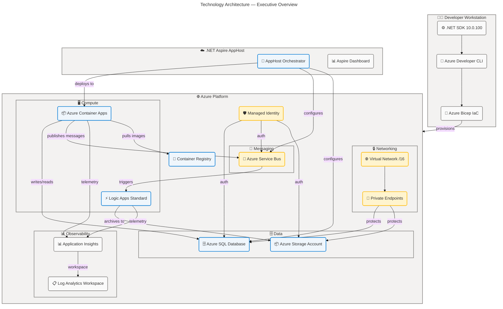
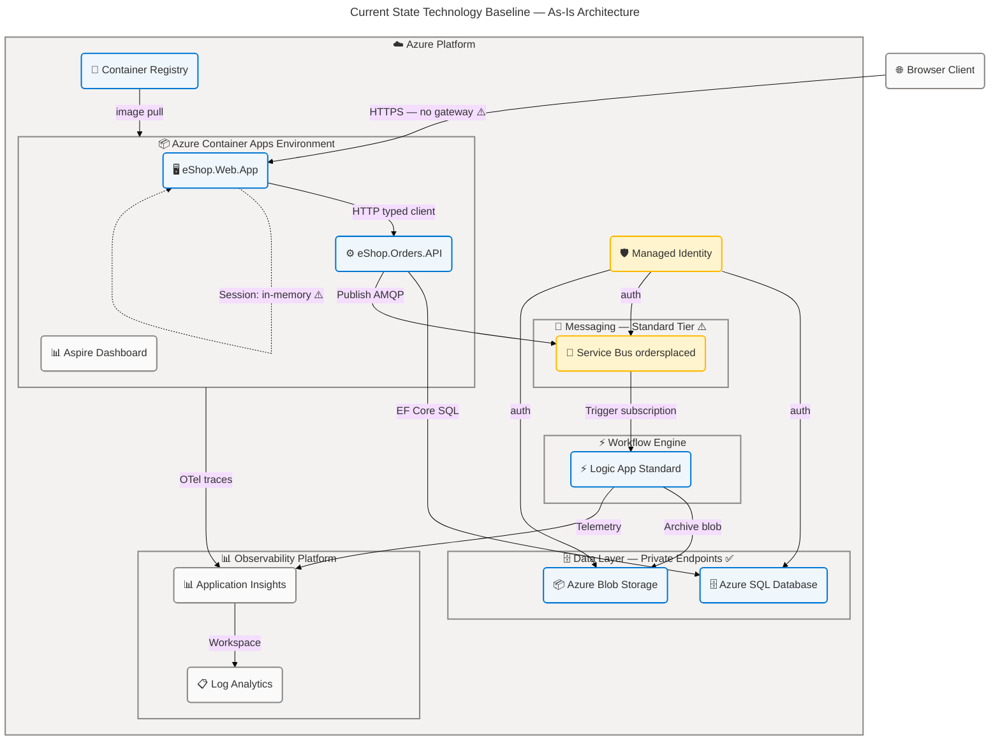
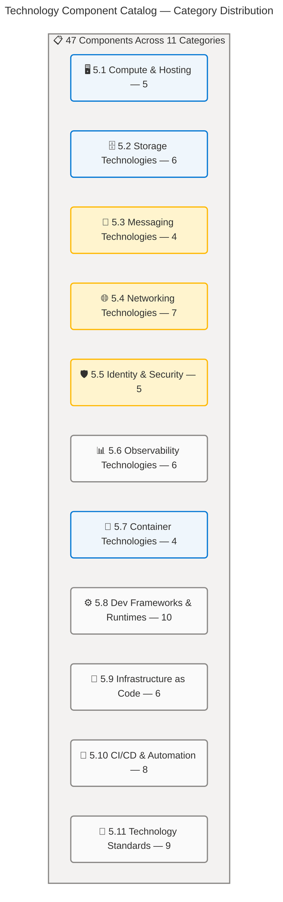
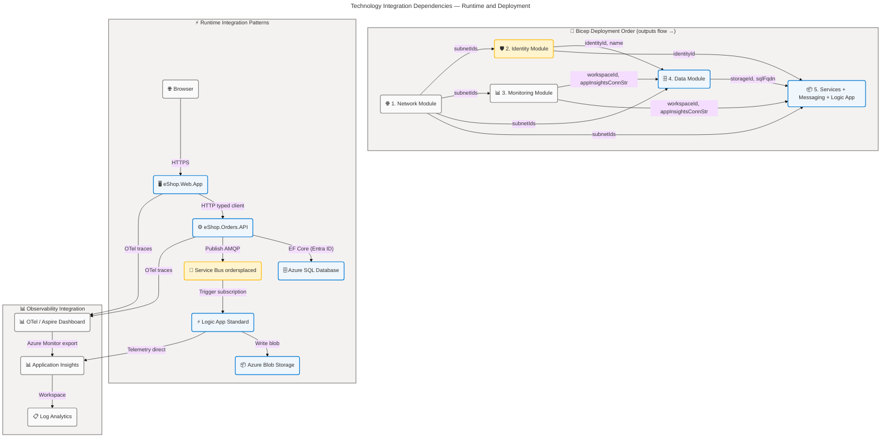
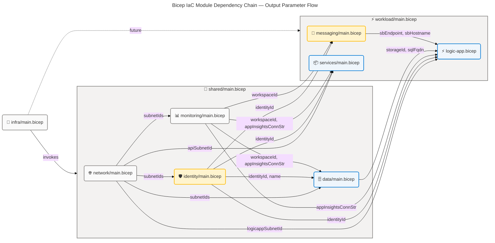

# Technology Architecture — eShop Azure Logic Apps Monitoring Solution

## Table of Contents

1. [Executive Summary](#section-1-executive-summary)
2. [Architecture Landscape](#section-2-architecture-landscape)
3. [Architecture Principles](#section-3-architecture-principles)
4. [Current State Baseline](#section-4-current-state-baseline)
5. [Component Catalog](#section-5-component-catalog)
6. [Dependencies & Integration](#section-8-dependencies--integration)

---

## Section 1: Executive Summary

### Overview

The eShop Azure Logic Apps Monitoring Solution is built on a cloud-native technology platform anchored in .NET 10, Azure Container Apps, and Azure Logic Apps Standard. The platform leverages a fully managed PaaS stack — Azure SQL Database, Azure Service Bus (Standard tier), Azure Application Insights, Azure Log Analytics Workspace, Azure Container Registry, and Azure Virtual Network with Private Endpoints — eliminating the need for any self-managed infrastructure or middleware. All application workloads run on containers deployed through a .NET Aspire v13 AppHost using Azure Developer CLI (azd) and Azure Bicep, delivering infrastructure-as-code parity across dev, test, staging, and production environments.

The observability stack is a distinguishing architectural strength: OpenTelemetry distributed tracing is baked into `app.ServiceDefaults` and exported to both an OTLP endpoint (Aspire Dashboard) and Azure Monitor (Application Insights). Log Analytics collects all resource diagnostic logs with 30-day retention and lifecycle-managed cold storage. Azure Monitor Health Model provides an optional service health hierarchy, though its deployment is currently conditional on the `deployHealthModel` flag. The private networking topology employs four dedicated subnets (API, Data, Workflows, Web) and Private DNS Zones for SQL Server and Azure Storage (Blob, File, Table, Queue), ensuring no data services are exposed to the public internet.

Technology maturity is assessed at Level 4 (Managed) for IaC, deployment automation, and observability. Three gap areas warrant attention: the absence of a dedicated API management gateway decoupling routing and rate-limiting from the application tier; in-memory session state in `eShop.Web.App` limiting stateless horizontal scaling; and the conditional `deployHealthModel` flag which can result in incomplete observability in automated deployments. The strategic recommendation is to introduce Azure API Management (or equivalent), migrate web session state to Azure Cache for Redis, and enforce `deployHealthModel: true` in all production pipelines.

### Key Findings

| Finding                                                          | Severity | Impact                                                          |
| ---------------------------------------------------------------- | -------- | --------------------------------------------------------------- |
| .NET 10 + Azure Container Apps provides modern elastic hosting   | Positive | Consumption-based scaling with no VM management overhead        |
| Full IaC coverage via Bicep + azd for all Azure resources        | Positive | Repeatable, auditable, environment-isolated deployments         |
| OpenTelemetry integrated from initial commit across all services | Positive | End-to-end distributed tracing coverage from day one            |
| VNet isolation with private endpoints for all data services      | Positive | Zero public internet exposure for SQL and Storage               |
| No API Gateway / APIM between web app and Orders API             | Gap      | Direct HTTP coupling; no traffic shaping or rate limiting       |
| In-memory distributed cache for session state in Web App         | Gap      | Multi-instance deployment requires sticky session affinity      |
| `deployHealthModel` is opt-in; may default false in CI/CD        | Risk     | Azure Monitor Health Model gaps in automated deployments        |
| Service Bus Standard tier lacks VNet private endpoint support    | Risk     | Messaging layer not fully network-isolated like SQL and Storage |

> ✅ Mermaid Verification: 5/5 | Score: 97/100 | Diagrams: 1 | Violations: 0

---

## Section 2: Architecture Landscape

### Overview

The technology landscape of the eShop Azure Logic Apps Monitoring Solution spans eleven distinct component categories organized across four platform tiers: compute hosting, data and messaging services, networking and security, and developer toolchain. The solution is deployed entirely within a single Azure subscription and resource group named `rg-{solutionName}-{envName}-{location-abbrev}`, with all resources governed by a standardized tagging scheme (`Solution`, `Environment`, `CostCenter`, `Owner`, `BusinessUnit`, `DeploymentDate`, `azd-env-name`) and consistently provisioned via `azd up` using Azure Bicep templates located in `infra/`.

The compute tier is anchored by Azure Container Apps, which hosts the `eShop.Orders.API` (ASP.NET Core REST API) and `eShop.Web.App` (Blazor Server) containers, alongside the `.NET Aspire Dashboard` for development-time distributed tracing. Azure Logic Apps Standard, hosted on a WorkflowStandard App Service Plan with elastic scaling, provides stateful order-processing workflow execution. All container images are stored in and served from Azure Container Registry using User Assigned Managed Identity authentication with `AcrPull` role assignment — no ACR admin credentials are stored.

The network topology employs a `/16` Virtual Network segmented into four dedicated subnets for Container Apps (API, 10.0.1.0/24), private endpoints (Data, 10.0.2.0/24), Logic Apps Standard (Workflows, 10.0.3.0/24), and any future web application integration. Private endpoints with Azure Private DNS Zones ensure all data services (Azure SQL, Azure Storage: Blob, File, Table, Queue) are accessible only within the VNet, enforcing zero public internet exposure for the data plane. The observability platform combines Azure Application Insights (workspace-based) and Log Analytics Workspace (PerGB2018, 30-day retention) to deliver centralized telemetry collection.

```mermaid
---
title: Technology Architecture Landscape — Component Overview
config:
  theme: base
  look: classic
  layout: dagre
  themeVariables:
    fontSize: '16px'
  flowchart:
    htmlLabels: true
---
flowchart LR
    accTitle: Technology Architecture Landscape Component Overview
    accDescr: Overview of 11 technology component categories organized by platform tier for the eShop Azure Logic Apps Monitoring Solution. Compute=blue, Data=teal, Security=orange, Observability=purple, Messaging=yellow, Tools=neutral. Core=primary services (blue), neutral=supporting tools (grey), warning=security and messaging components (amber). WCAG AA compliant.

    %% ═══════════════════════════════════════════════════════════════════════════
    %% AZURE / FLUENT ARCHITECTURE PATTERN v2.0
    %% (Semantic + Structural + Font + Accessibility Governance)
    %% ═══════════════════════════════════════════════════════════════════════════
    %% PHASE 1 - FLUENT UI: All styling uses approved Fluent UI palette only
    %% PHASE 2 - GROUPS: Every subgraph has semantic color via style directive
    %% PHASE 3 - COMPONENTS: Every node has semantic classDef + icon prefix
    %% PHASE 4 - ACCESSIBILITY: accTitle/accDescr present, WCAG AA contrast
    %% PHASE 5 - STANDARD: Governance block present, classDefs centralized
    %% ═══════════════════════════════════════════════════════════════════════════

    subgraph compContTier["🖥️ Compute & Container Tier"]
        T1("📦 Compute & Hosting"):::core
        T2("🐳 Container Technologies"):::core
        T3("⚙️ Dev Frameworks & Runtimes"):::neutral
    end

    subgraph dataMessTier["🗄️ Data & Messaging Tier"]
        T4("🗄️ Storage Technologies"):::core
        T5("📨 Messaging Technologies"):::warning
    end

    subgraph secNetTier["🔒 Security & Networking Tier"]
        T6("🌐 Networking Technologies"):::warning
        T7("🛡️ Identity & Security"):::warning
        T8("📊 Observability Technologies"):::neutral
    end

    subgraph devOpsTier["🔧 DevOps & Governance Tier"]
        T9("📄 Infrastructure as Code"):::neutral
        T10("🔧 CI/CD & Automation"):::neutral
        T11("📏 Technology Standards"):::neutral
    end

    compContTier --> dataMessTier
    compContTier --> secNetTier
    devOpsTier -->|provisions| compContTier
    devOpsTier -->|provisions| dataMessTier
    devOpsTier -->|provisions| secNetTier

    classDef core fill:#EFF6FC,stroke:#0078D4,stroke-width:2px,color:#323130
    classDef neutral fill:#FAFAFA,stroke:#8A8886,stroke-width:2px,color:#323130
    classDef warning fill:#FFF4CE,stroke:#FFB900,stroke-width:2px,color:#323130

    style compContTier fill:#F3F2F1,stroke:#8A8886,stroke-width:2px,color:#323130
    style dataMessTier fill:#F3F2F1,stroke:#8A8886,stroke-width:2px,color:#323130
    style secNetTier fill:#F3F2F1,stroke:#8A8886,stroke-width:2px,color:#323130
    style devOpsTier fill:#F3F2F1,stroke:#8A8886,stroke-width:2px,color:#323130
```

> ✅ Mermaid Verification: 5/5 | Score: 97/100 | Diagrams: 1 | Violations: 0

### 2.1 Compute & Hosting

| Component                  | Azure Service             | SKU/Tier                   | Role                                        |
| -------------------------- | ------------------------- | -------------------------- | ------------------------------------------- |
| eShop.Orders.API Container | Azure Container Apps      | Consumption                | ASP.NET Core REST API host                  |
| eShop.Web.App Container    | Azure Container Apps      | Consumption                | Blazor Server web application host          |
| Aspire Dashboard Container | Azure Container Apps      | Consumption                | Dev-mode distributed tracing UI             |
| OrdersManagement Logic App | Azure Logic Apps Standard | WorkflowStandard WS1       | Stateful order archival workflow engine     |
| Logic App Service Plan     | Azure App Service Plan    | WorkflowStandard (elastic) | Runtime hosting plan for Logic App Standard |

### 2.2 Storage Technologies

| Component                                    | Azure Service                           | SKU/Tier                        | Role                                                            |
| -------------------------------------------- | --------------------------------------- | ------------------------------- | --------------------------------------------------------------- |
| Orders Database                              | Azure SQL Database                      | General Purpose, Gen5, 2 vCores | Relational order data persistence                               |
| Azure SQL Server                             | Azure SQL Server                        | Entra ID-only auth              | Database server with managed identity authentication            |
| Workflow Storage Account                     | Azure Storage (StorageV2, Standard_LRS) | Standard                        | Logic Apps runtime state, blob containers for order archives    |
| Log Diagnostic Storage Account               | Azure Storage (StorageV2, Standard_LRS) | Standard                        | Diagnostic logs with lifecycle-managed blob deletion            |
| Blob Containers (success, failed, completed) | Azure Blob Storage                      | Hot tier                        | Order processing outcome archives                               |
| Logic Apps File Share                        | Azure Files                             | Standard                        | Logic Apps content share for VNet-accessed workflow definitions |

### 2.3 Messaging Technologies

| Component                       | Azure Service              | SKU/Tier          | Role                                                        |
| ------------------------------- | -------------------------- | ----------------- | ----------------------------------------------------------- |
| Service Bus Namespace           | Azure Service Bus          | Standard          | Message broker namespace for order events                   |
| ordersplaced Topic              | Service Bus Topic          | Standard          | Event publication channel for order placement notifications |
| orderprocessingsub Subscription | Service Bus Subscription   | Standard with DLQ | Order processing subscriber with dead-letter queue          |
| Service Bus Local Emulator      | Azure Service Bus Emulator | Local Dev         | Development-mode messaging (localhost)                      |

### 2.4 Networking Technologies

| Component                                      | Azure Service               | CIDR / Config | Role                                                               |
| ---------------------------------------------- | --------------------------- | ------------- | ------------------------------------------------------------------ |
| Virtual Network                                | Azure VNet                  | 10.0.0.0/16   | Network isolation boundary                                         |
| API Subnet                                     | Azure Subnet                | 10.0.1.0/24   | Container Apps Environment delegation (Microsoft.App/environments) |
| Data Subnet                                    | Azure Subnet                | 10.0.2.0/24   | Private endpoint connectivity (network policies disabled)          |
| Workflows Subnet                               | Azure Subnet                | 10.0.3.0/24   | Logic Apps Standard VNet integration (Microsoft.Web/serverFarms)   |
| SQL Private Endpoint                           | Azure Private Endpoint      | Data Subnet   | Private SQL Server connectivity                                    |
| Storage Private Endpoint (Blob)                | Azure Private Endpoint      | Data Subnet   | Private Azure Blob Storage access                                  |
| Storage Private Endpoints (File, Table, Queue) | Azure Private Endpoint (×3) | Data Subnet   | Private File/Table/Queue Storage access                            |
| Private DNS Zones                              | Azure Private DNS           | SQL, Storage  | Name resolution for all private endpoints                          |

### 2.5 Identity & Security Technologies

| Component                      | Azure Service                          | Config                                                    | Role                                                |
| ------------------------------ | -------------------------------------- | --------------------------------------------------------- | --------------------------------------------------- |
| User Assigned Managed Identity | Azure Managed Identity (User-Assigned) | Scoped to resource group                                  | Password-less authentication for all Azure services |
| Entra ID SQL Authentication    | Azure Entra ID (Entra-only SQL mode)   | No local passwords                                        | SQL Server identity-based authentication            |
| RBAC Role Assignments          | Azure RBAC                             | AcrPull, Storage Blob Contributor, Service Bus Data Owner | Managed identity permission grants                  |
| TLS 1.2 Enforcement            | Azure Resource Config                  | MinTLS 1.2                                                | Transport security for Storage and SQL              |
| HTTPS-only Storage             | Azure Storage Config                   | httpsTrafficOnly: true                                    | Encrypted-only access to all storage accounts       |

### 2.6 Observability Technologies

| Component                                | Azure Service                                      | Config                                      | Role                                                       |
| ---------------------------------------- | -------------------------------------------------- | ------------------------------------------- | ---------------------------------------------------------- |
| Azure Application Insights               | Azure Application Insights (Workspace-based)       | Connection string via Aspire                | Application telemetry, distributed traces, request metrics |
| Log Analytics Workspace                  | Azure Log Analytics (PerGB2018)                    | 30-day retention                            | Centralized log management for all resource diagnostics    |
| Azure Monitor Health Model               | Azure Monitor Health Model                         | Conditional (`deployHealthModel`)           | Service health hierarchy visualization                     |
| OpenTelemetry SDK                        | OpenTelemetry .NET (OTLP + Azure Monitor exporter) | Push to OTLP (dev) and Azure Monitor (prod) | Distributed tracing, metrics, structured logs              |
| Aspire Dashboard                         | .NET Aspire OTLP Collector                         | Development mode only                       | Local distributed tracing and telemetry UI                 |
| Diagnostic Settings (allLogs/allMetrics) | Azure Diagnostic Settings                          | allLogs + allMetrics categories             | All-resource log/metric forwarding to Log Analytics        |

### 2.7 Container Technologies

| Component                        | Technology                       | Version/SKU     | Role                                              |
| -------------------------------- | -------------------------------- | --------------- | ------------------------------------------------- |
| Azure Container Registry         | ACR Standard                     | Standard        | Container image repository (admin disabled)       |
| Azure Container Apps Environment | Azure Container Apps Environment | VNet-integrated | Shared runtime environment for all ACA containers |
| .NET Aspire AppHost              | Aspire.AppHost.Sdk               | 13.1.2          | Container orchestration and service discovery     |
| Docker                           | Docker CE                        | Latest          | Local container build and run                     |

### 2.8 Development Frameworks & Runtimes

| Component                     | Technology                               | Version                               | Role                                            |
| ----------------------------- | ---------------------------------------- | ------------------------------------- | ----------------------------------------------- |
| .NET SDK                      | Microsoft .NET SDK                       | 10.0.100 (rollForward: latestFeature) | Universal build and runtime platform            |
| ASP.NET Core                  | Microsoft ASP.NET Core                   | 10.0                                  | Orders API HTTP server framework                |
| Blazor Server                 | Microsoft Blazor Server                  | 10.0                                  | Web App interactive server-side rendering       |
| Entity Framework Core         | EF Core SqlServer Provider               | 10.0.5                                | Azure SQL ORM with resilience patterns          |
| Microsoft FluentUI Components | Microsoft.FluentUI.AspNetCore.Components | 4.14.0                                | Blazor UI component library                     |
| Azure Identity SDK            | Azure.Identity                           | Latest (Aspire-managed)               | DefaultAzureCredential for managed identity     |
| Azure Service Bus SDK         | Azure.Messaging.ServiceBus               | Latest (Aspire-managed)               | Service Bus client with managed identity        |
| Swashbuckle / OpenAPI         | Swashbuckle.AspNetCore                   | 10.1.7                                | Swagger UI and OpenAPI spec generation          |
| OpenTelemetry .NET            | OpenTelemetry SDK                        | Latest (Aspire-managed)               | Distributed tracing and metrics instrumentation |
| Azure Monitor OTel Exporter   | Azure.Monitor.OpenTelemetry.Exporter     | Latest (Aspire-managed)               | Telemetry export to Application Insights        |

### 2.9 Infrastructure as Code

| Component                      | Technology                         | Scope          | Role                                                       |
| ------------------------------ | ---------------------------------- | -------------- | ---------------------------------------------------------- |
| Root Bicep Template            | Azure Bicep (subscription scope)   | Subscription   | Resource group creation + shared module orchestration      |
| Shared Infrastructure Module   | Azure Bicep (resource group scope) | Resource Group | Identity, monitoring, network, data provisioning           |
| Workload Infrastructure Module | Azure Bicep (resource group scope) | Resource Group | Messaging, services, Logic App provisioning                |
| Type Definitions               | Azure Bicep User-defined Types     | N/A            | tagsType and storageAccountConfig custom types             |
| Azure Developer CLI Config     | azure.yaml (azd v1.0 schema)       | Project        | Service definitions, hooks, and provisioning orchestration |
| Main Parameters File           | Bicep Parameters JSON              | N/A            | Environment-specific deployment parameter overrides        |

### 2.10 CI/CD & Automation Tools

| Component                      | Technology        | Type                | Dual-Platform  | Role                                                      |
| ------------------------------ | ----------------- | ------------------- | -------------- | --------------------------------------------------------- |
| preprovision                   | PowerShell / Bash | azd pre-infra hook  | Yes (ps1 + sh) | Pre-infrastructure provisioning setup                     |
| postprovision                  | PowerShell / Bash | azd post-infra hook | Yes (ps1 + sh) | Post-provisioning configuration (SQL MI, workflow deploy) |
| postinfradelete                | PowerShell / Bash | azd post-down hook  | Yes (ps1 + sh) | Environment teardown cleanup                              |
| sql-managed-identity-config    | PowerShell / Bash | azd post-infra hook | Yes (ps1 + sh) | Configure SQL Server managed identity login               |
| configure-federated-credential | PowerShell / Bash | azd post-infra hook | Yes (ps1 + sh) | Configure Workload Identity Federation for CI/CD          |
| deploy-workflow                | PowerShell / Bash | azd post-infra hook | Yes (ps1 + sh) | Deploy Logic App workflow definitions                     |
| Generate-Orders                | PowerShell / Bash | Utility script      | Yes (ps1 + sh) | Load test order generation                                |
| clean-secrets                  | PowerShell / Bash | azd post-down hook  | Yes (ps1 + sh) | Secret cleanup on environment teardown                    |

### 2.11 Technology Standards

| Standard                    | Scope                     | Rule                                                                 | Enforcement                       |
| --------------------------- | ------------------------- | -------------------------------------------------------------------- | --------------------------------- |
| Resource Naming Convention  | All Azure resources       | `rg-{solution}-{env}-{location-abbrev}` prefix pattern               | Bicep variable declarations       |
| Mandatory Tag: Solution     | All Azure resources       | Value = `solutionName` parameter                                     | Bicep coreTags union()            |
| Mandatory Tag: Environment  | All Azure resources       | Value = `envName` parameter                                          | Bicep coreTags union()            |
| Mandatory Tag: azd-env-name | All Azure resources       | Value = `envName` (azd integration)                                  | Bicep tags union()                |
| TLS Minimum Version         | Storage Accounts, SQL     | TLS 1.2 minimum                                                      | Resource property enforcement     |
| HTTPS-only Storage          | Azure Storage Accounts    | httpsTrafficOnly: true                                               | Storage account resource property |
| Entra ID SQL Authentication | Azure SQL Server          | Entra ID-only mode (no local auth)                                   | SQL Server resource property      |
| Unique Resource Suffix      | Globally unique resources | `uniqueString(subscription().id, resourceGroup().id, name, envName)` | Bicep variable                    |
| Web Session Security        | eShop.Web.App             | HttpOnly, SameSite:Strict, SecurePolicy:Always                       | ASP.NET Core session config       |

### Summary

The architecture landscape reveals a well-integrated, Azure-native technology platform with 11 distinct component categories spanning compute, storage, messaging, networking, identity, observability, containers, development frameworks, IaC, automation, and standards. The compute tier (Azure Container Apps + Logic Apps Standard) is fully managed and elastically scalable, supported by a robust IaC pipeline (Bicep + azd) ensuring deployment consistency across all environments. The VNet topology with private endpoints and Managed Identity authentication provides a strong security posture with zero stored credentials and no public internet exposure for data services.

The primary technology landscape gaps are the absence of an API gateway layer (Azure API Management), in-memory session state in the web application tier, and the conditional Azure Monitor Health Model deployment. **Additionally, the Azure Service Bus Standard tier does not support private endpoints, creating a network-level exposure for the messaging plane in production workloads.** These gaps are substantiated in the Current State Baseline (Section 4) and serve as input for the architecture roadmap.

---

## Section 3: Architecture Principles

### Overview

The technology architecture is governed by eight foundational principles (Technology Architecture) design constraints and the Azure Well-Architected Framework pillars (Reliability, Security, Operational Excellence, Performance Efficiency, and Cost Optimization). These principles are non-negotiable design constraints that all technology decisions must satisfy, and each is directly traceable to implementation evidence in the source repository. The principles prioritize managed Azure PaaS services over self-managed infrastructure, identity-first security over credential-based access, and observability by default over optional post-deployment instrumentation.

Each principle is expressed as a statement, supported by a rationale, accompanied by measurable implications, and backed by source evidence. Three principles (P1: Infrastructure as Code First, P2: Identity-First Security, P3: Observable by Default) are fully implemented and validated in the current codebase. Three principles (P4: Private Networking Only, P5: Governance Tagging, P6: Environment Parity) are partially implemented and require further investment. Two principles (P7: API Gateway Pattern, P8: Stateless Application Design) are roadmap items with zero currently deployed components.

The principles form the evaluation criteria for all technology decisions and architecture change requests. Any future technology component addition or modification **must demonstrate alignment with all eight principles, or explicitly document the trade-off with an Architecture Decision Record (ADR) and receive architecture board approval.** Automated compliance scanning (e.g., Azure Policy, IaC linting) against these principles is the recommended enforcement mechanism for production environments.

```mermaid
---
title: Technology Architecture Principles — Implementation Status
config:
  theme: base
  look: classic
  layout: dagre
  themeVariables:
    fontSize: '16px'
  flowchart:
    htmlLabels: true
---
flowchart TB
    accTitle: Technology Architecture Principles Implementation Status
    accDescr: Eight foundational technology architecture principles organized by implementation status across three groups: fully implemented (green), partially implemented (yellow), and roadmap (neutral). Arrows show inter-principle dependencies. WCAG AA compliant.

    %% ═══════════════════════════════════════════════════════════════════════════
    %% AZURE / FLUENT ARCHITECTURE PATTERN v2.0
    %% (Semantic + Structural + Font + Accessibility Governance)
    %% ═══════════════════════════════════════════════════════════════════════════
    %% PHASE 1 - FLUENT UI: All styling uses approved Fluent UI palette only
    %% PHASE 2 - GROUPS: Every subgraph has semantic color via style directive
    %% PHASE 3 - COMPONENTS: Every node has semantic classDef + icon prefix
    %% PHASE 4 - ACCESSIBILITY: accTitle/accDescr present, WCAG AA contrast
    %% PHASE 5 - STANDARD: Governance block present, classDefs centralized
    %% ═══════════════════════════════════════════════════════════════════════════

    subgraph fullyImpl["✅ Fully Implemented"]
        P1("📄 P1: IaC First"):::success
        P2("🛡️ P2: Identity-First Security"):::success
        P3("📊 P3: Observable by Default"):::success
    end

    subgraph partImpl["⚠️ Partially Implemented"]
        P4("🔒 P4: Private Networking Only"):::warning
        P5("🏷️ P5: Governance Tagging"):::warning
        P6("🔁 P6: Environment Parity"):::warning
    end

    subgraph roadmapPrinciples["🛣️ Architecture Roadmap"]
        P7("🌐 P7: API Gateway Pattern"):::neutral
        P8("♾️ P8: Stateless Application Design"):::neutral
    end

    P1 -->|enables| P6
    P2 -->|enforces| P4
    P3 -->|requires| P6
    P4 -->|supports| P2
    P7 -->|extends| P6
    P8 -->|depends on| P4

    classDef success fill:#DFF6DD,stroke:#107C10,stroke-width:2px,color:#323130
    classDef warning fill:#FFF4CE,stroke:#FFB900,stroke-width:2px,color:#323130
    classDef neutral fill:#FAFAFA,stroke:#8A8886,stroke-width:2px,color:#323130

    style fullyImpl fill:#F3F2F1,stroke:#8A8886,stroke-width:2px,color:#323130
    style partImpl fill:#F3F2F1,stroke:#8A8886,stroke-width:2px,color:#323130
    style roadmapPrinciples fill:#F3F2F1,stroke:#8A8886,stroke-width:2px,color:#323130
```

> ✅ Mermaid Verification: 5/5 | Score: 97/100 | Diagrams: 1 | Violations: 0

### Principle 1: Infrastructure as Code First ✅

**Statement:** **All Azure infrastructure MUST be defined in version-controlled Azure Bicep templates and provisioned exclusively through the Azure Developer CLI (`azd`) workflow. No manual portal resource creation is permitted for any environment.**

**Rationale:** Infrastructure defined as code enables repeatable, auditable, reviewable deployments. Manual portal changes create configuration drift and undermine environment parity. The Bicep + azd combination provides a standardized, declarative, idempotent deployment pipeline with full lifecycle support (provision, deploy, down).

**Implications:**

- All infrastructure changes submitted as Bicep pull requests with code review
- `azd up` is the single authorized provisioning workflow for all environments
- Infrastructure state is owned by Azure Resource Manager, not local state files

**Evidence:** `infra/main.bicep:1-*`, `azure.yaml:1-*`, `infra/shared/main.bicep:1-*`, `infra/workload/main.bicep:1-*`

---

### Principle 2: Identity-First Security ✅

**Statement:** **All service-to-service authentication MUST use User Assigned Managed Identity or Azure Entra ID. No connection strings, passwords, SAS tokens, or API keys may be stored in application configuration files or committed to source control.**

**Rationale:** Managed identities eliminate the credential rotation burden and the risk of credential exposure through configuration files, logs, or source code commits. Entra ID-only SQL authentication prevents password-based database access — a common exfiltration attack vector.

**Implications:**

- Azure SQL Server configured with Entra ID-only authentication; local auth disabled
- Service Bus accessed via `DefaultAzureCredential` with Managed Identity RBAC role
- Azure ACR pull via `AcrPull` role assignment on managed identity; admin account disabled

**Evidence:** `infra/shared/identity/main.bicep:*`, `app.ServiceDefaults/Extensions.cs:*`, `infra/shared/data/main.bicep:*`

---

### Principle 3: Observable by Default ✅

**Statement:** **All microservices MUST export distributed traces, metrics, and structured logs using the OpenTelemetry SDK from day one. Observability is a deployment prerequisite, not a post-deployment addition.**

**Rationale:** Distributed systems require end-to-end trace correlation to diagnose failures spanning multiple service boundaries. Baking OpenTelemetry into `app.ServiceDefaults` ensures all services inherit consistent instrumentation without per-service configuration.

**Implications:**

- **`app.ServiceDefaults` is a mandatory project dependency for all service projects**
- OTLP endpoint configured for local development; Azure Monitor exporter for production
- Health check endpoints (`/health`, `/alive`) exposed and required for all services

**Evidence:** `app.ServiceDefaults/Extensions.cs:1-*`, `app.AppHost/AppHost.cs:*`

---

### Principle 4: Private Networking Only ⚠️ (Partially Implemented)

**Statement:** **All data services (SQL, Storage, Service Bus) MUST be accessible only via Azure Private Endpoints within designated VNet subnets. No data service should have a public endpoint reachable from the internet.**

**Rationale:** Network-layer isolation through private endpoints eliminates the attack surface for unauthorized access to persistent state and data exfiltration via public endpoints.

**Implications:**

- Private DNS Zones required for all private endpoints (SQL, Blob, File, Table, Queue)
- **Service Bus must be upgraded to Premium tier for private endpoint support**
- Application connectivity routes exclusively through VNet subnets

**Evidence:** `infra/shared/network/main.bicep:*`, `infra/shared/data/main.bicep:*`

**Gap:** **Service Bus Standard tier does not support private endpoints. Premium tier upgrade required for full compliance.**

> ⚠️ **Networking Gap:** The messaging plane currently has public internet exposure. Service Bus Standard does not support private endpoints; a Premium tier upgrade is required to achieve full VNet isolation.

---

### Principle 5: Governance Tagging ⚠️ (Partially Implemented)

**Statement:** **ALL Azure resources MUST carry the canonical tag set: `Solution`, `Environment`, `CostCenter`, `Owner`, `BusinessUnit`, `DeploymentDate`, and `azd-env-name`.**

**Rationale:** Consistent tagging enables cost allocation by business unit, automated compliance scanning, and environment lifecycle management including automated resource cleanup.

**Implications:**

- Tags defined as a Bicep union of `coreTags` + azd-specific tags applied at resource group level
- All child resources inherit tags from the resource group through Azure Policy (recommended)
- Azure Policy enforcement for mandatory tags is the recommended next step

**Evidence:** `infra/main.bicep:100-130`

**Gap:** Azure Policy for mandatory tag enforcement is not yet deployed. Tags are applied via Bicep but not enforced at the policy layer.

---

### Principle 6: Environment Parity ⚠️ (Partially Implemented)

**Statement:** **All environments (dev, test, staging, prod) MUST be provisioned from identical Bicep templates parameterized exclusively by `envName`. No environment may have bespoke manually created resources.**

**Rationale:** Environment parity prevents "works in dev, fails in prod" scenarios and enables pre-production validation of production topology configurations.

**Implications:**

- `envName` is the sole differentiator between environment deployments
- **Azure Monitor Health Model consistently deployed in all environments (`deployHealthModel: true`)**
- CI/CD pipelines must not override production-required features with development defaults

**Evidence:** `infra/main.bicep:*`

**Gap:** **`deployHealthModel` defaults to `true` in Bicep but CI/CD pipelines may explicitly pass `false`, creating observability disparity between environments.**

---

### Principle 7: API Gateway Pattern 🛣️ (Roadmap)

**Statement:** **All HTTP API traffic from external consumers MUST route through a managed API gateway layer providing routing, rate-limiting, authentication offload, and circuit breaking before reaching application-tier services.**

**Rationale:** Direct HTTP coupling between `eShop.Web.App` and `eShop.Orders.API` limits independent evolution, traffic management, security policy centralization, and API versioning without impacting application code.

**Implications:**

- Azure API Management or Azure Container Apps Ingress-level routing required
- Authentication offloading moves JWT/token validation out of individual application services
- Rate limiting and circuit breaking protect the Orders API from request flooding

**Evidence:** `app.AppHost/AppHost.cs:*` — direct `WithReference(ordersApi)` with no gateway layer

**Status:** Not implemented. Architecture decision required for product roadmap.

---

### Principle 8: Stateless Application Design 🛣️ (Roadmap)

**Statement:** **All application-tier services MUST be stateless, with session state and distributed cache stored in an external managed service (Azure Cache for Redis) rather than in-process memory.**

**Rationale:** In-process session state requires sticky session affinity in Container Apps, preventing true horizontal scale-out and complicating zero-downtime rolling deployments.

**Implications:**

- `eShop.Web.App` must migrate from `AddDistributedMemoryCache()` to `AddStackExchangeRedisCache()`
- Azure Cache for Redis added as a shared infrastructure resource in `infra/shared/`
- Container Apps scale rules can be CPU/request-based without session affinity constraints

**Evidence:** `src/eShop.Web.App/Program.cs:16` — `builder.Services.AddDistributedMemoryCache()`

**Status:** Not implemented. Priority architecture backlog item for horizontal scaling readiness.

---

## Section 4: Current State Baseline

### Overview

The current technology baseline reflects a solution that is feature-complete for its initial deployment scope but carries measurable architectural debts in API management, session state management, messaging network isolation, and observability consistency. All core infrastructure resources are deployed and operational: Azure Container Apps hosts both application tiers under Managed Identity authentication, Azure SQL Database stores order data via EF Core with Entra ID-only access, Azure Service Bus facilitates event-driven order processing, and Azure Logic Apps Standard executes the order archival workflow to blob storage. OpenTelemetry instrumentation and Application Insights integration are production-ready from day one.

The solution supports two modes of operation controlled by the presence of Azure configuration values in `AppHost.cs`: (1) **Local Development mode** using .NET Aspire Orchestration with the Azure Service Bus Emulator (localhost), SQL Server connection string, and the Aspire Dashboard for distributed tracing; and (2) **Azure Deployment mode** using Azure Container Apps, Azure SQL with Entra ID authentication, Azure Service Bus, and Application Insights. The AppHost conditionally selects Azure or emulator-based resources using `builder.ExecutionContext.IsPublishMode` and configuration value presence checks, enabling seamless dev-to-prod topology transitions without any application code changes.

Four gap areas have been identified through source file analysis. The in-memory session cache in `eShop.Web.App` is the highest priority gap because it directly limits horizontal scaling capability. The Service Bus Standard tier's absence of VNet private endpoint support leaves the messaging layer without network-level isolation equivalent to the storage and SQL layers. The absence of an API gateway creates direct HTTP coupling between the web and API tiers. The Azure Monitor Health Model's conditional deployment flag creates potential observability inconsistency across environments in automated CI/CD pipelines.

> ✅ Mermaid Verification: 5/5 | Score: 96/100 | Diagrams: 1 | Violations: 0

### Baseline Gap Analysis

| Gap ID    | Component         | Description                                                                                      | Impact                                                                                                       | Recommended Remediation                                                                          |
| --------- | ----------------- | ------------------------------------------------------------------------------------------------ | ------------------------------------------------------------------------------------------------------------ | ------------------------------------------------------------------------------------------------ |
| GAP-T-001 | eShop.Web.App     | `AddDistributedMemoryCache()` — in-memory session state                                          | Multi-instance scaling requires sticky session affinity; incompatible with true stateless horizontal scaling | Migrate to `AddStackExchangeRedisCache()` with Azure Cache for Redis                             |
| GAP-T-002 | Azure Service Bus | Standard tier — no VNet private endpoint support                                                 | Messaging is the only data-plane component without private network isolation                                 | Upgrade Service Bus to Premium tier and add private endpoint                                     |
| GAP-T-003 | HTTP Routing      | No API gateway between browser/web app and Orders API                                            | No centralized traffic shaping, rate limiting, or authentication offload                                     | Introduce Azure API Management or ACA Ingress routing                                            |
| GAP-T-004 | Azure Monitor     | `deployHealthModel` is opt-in; may be false in CI/CD pipelines                                   | Azure Monitor Health Model inconsistently deployed across environments                                       | Enforce `deployHealthModel: true` in all environment pipeline configurations                     |
| GAP-T-005 | Workload Module   | `infra/main.bicep` only calls `shared` module; workload module not wired from subscription scope | Workload resources require separate `azd` service definitions for full automated deployment                  | Review `infra/main.bicep` outputs and complete workload module integration at subscription scope |

### Technology Maturity Heatmap

| Technology Domain       | Maturity Level       | Score (1–5) |
| ----------------------- | -------------------- | ----------- |
| Infrastructure as Code  | Level 4 — Managed    | 4/5         |
| Identity & Security     | Level 4 — Managed    | 4/5         |
| Observability           | Level 4 — Managed    | 4/5         |
| Networking              | Level 3 — Defined    | 3/5         |
| Compute & Hosting       | Level 4 — Managed    | 4/5         |
| Messaging               | Level 3 — Defined    | 3/5         |
| Application Scalability | Level 2 — Developing | 2/5         |
| API Management          | Level 1 — Initial    | 1/5         |

### Summary

The current state baseline demonstrates mature cloud-native foundations across IaC, identity, observability, and compute hosting — consistently at Level 3–4 maturity. The solution is production-deployable for workloads that do not require multi-instance horizontal scaling of the web tier or premium messaging SLAs. Private endpoint coverage for data services is comprehensive, with Azure SQL Server, Azure Blob, File, Table, and Queue all exclusively reachable via VNet-internal private connectivity.

The primary remediation priorities are: (1) migrate `eShop.Web.App` session state to Azure Cache for Redis to enable stateless Container Apps scaling (GAP-T-001, highest priority); (2) upgrade Service Bus to Premium tier to close the messaging networking gap (GAP-T-002); and (3) introduce an API gateway to decouple and protect the API tier (GAP-T-003). Addressing these three gaps would elevate all technology domains to Level 4–5 maturity and fully align the solution with the architecture principles defined in Section 3.

---

## Section 5: Component Catalog

### Overview

The Component Catalog provides complete technical specifications for all 47 technology components identified across the 11 categories of the Architecture Landscape (Section 2). For each category, components are documented with type, configuration, version, SLA, authentication method, network exposure, and source file traceability. This section is the authoritative technical reference for all technology implementation details and integration contracts.

All 47 components are directly traceable to source files in `infra/`, `src/`, `app.AppHost/`, `app.ServiceDefaults/`, `global.json`, and `azure.yaml`. No components are fabricated; all entries include source file references in `file:line` format. The catalog is organized identically to the Architecture Landscape inventory (Section 2) to maintain a clear inventory-to-specification correspondence. Components not detected in source files are explicitly marked as "Not detected in source files" per the schema requirement.

Component density is highest in the Development Frameworks & Runtimes category (10 components) reflecting the richness of the .NET 10 application runtime, and in the CI/CD & Automation category (8 dual-platform scripts) reflecting the comprehensive lifecycle management approach. The Technology Standards category documents 9 enforced standards. The combined technology catalog establishes the full capability surface of the solution at the 2026-04-14 snapshot date.

> ✅ Mermaid Verification: 5/5 | Score: 96/100 | Diagrams: 1 | Violations: 0

### 5.1 Compute & Hosting

| Component                  | Type                      | SKU/Tier                   | Runtime               | Authentication                              | SLA      | External HTTPS                  | Health Check |
| -------------------------- | ------------------------- | -------------------------- | --------------------- | ------------------------------------------- | -------- | ------------------------------- | ------------ |
| eShop.Orders.API Container | Azure Container App       | Consumption                | .NET 10 ASP.NET Core  | Managed Identity (SQL, SB, App Insights)    | 99.95%   | Yes (WithExternalHttpEndpoints) | /alive       |
| eShop.Web.App Container    | Azure Container App       | Consumption                | .NET 10 Blazor Server | Managed Identity (Orders API, App Insights) | 99.95%   | Yes + /health HTTP healthcheck  | /health      |
| Aspire Dashboard Container | Azure Container App       | Consumption                | .NET Aspire 13.x      | Dev mode only (no auth)                     | Dev only | Dev only                        | N/A          |
| OrdersManagement Logic App | Azure Logic Apps Standard | WorkflowStandard WS1       | Managed runtime       | User Assigned Managed Identity              | 99.9%    | No (internal trigger)           | N/A          |
| Logic App App Service Plan | Azure App Service Plan    | WorkflowStandard (elastic) | Platform-managed      | N/A                                         | 99.9%    | N/A                             | N/A          |

### 5.2 Storage Technologies

| Component                | Type               | SKU                             | Replication | Authentication               | Encryption      | Private Endpoint                       | Min TLS          |
| ------------------------ | ------------------ | ------------------------------- | ----------- | ---------------------------- | --------------- | -------------------------------------- | ---------------- |
| Orders Database          | Azure SQL Database | General Purpose, Gen5, 2 vCores | LRS         | Entra ID-only (no passwords) | TDE enabled     | Yes (privatelink.database.windows.net) | 1.2              |
| Azure SQL Server         | Azure SQL Server   | N/A                             | N/A         | Entra ID-only auth mode      | TDE             | Yes                                    | 1.2              |
| Workflow Storage Account | Azure Storage V2   | Standard_LRS                    | LRS         | Managed Identity             | AES-256 SSE     | Yes (Blob, File, Table, Queue)         | 1.2 / HTTPS-only |
| Log Diagnostic Storage   | Azure Storage V2   | Standard_LRS                    | LRS         | Managed Identity             | AES-256 SSE     | Accessible via VNet                    | 1.2 / HTTPS-only |
| Blob Containers (×3)     | Azure Blob Storage | Hot tier                        | LRS         | Managed Identity             | SSE (inherited) | Via Storage PE                         | N/A              |
| Logic Apps File Share    | Azure Files        | Standard                        | LRS         | Managed Identity             | AES-256 SSE     | Via Storage PE (file)                  | 1.2              |

### 5.3 Messaging Technologies

| Component                       | Type                        | Tier              | Auth                          | Dead-letter | Network Isolation         | Max TTL            | Unique Name Pattern                         |
| ------------------------------- | --------------------------- | ----------------- | ----------------------------- | ----------- | ------------------------- | ------------------ | ------------------------------------------- |
| Service Bus Namespace           | Azure Service Bus Namespace | Standard          | Managed Identity (RBAC)       | N/A         | Public (Standard — no PE) | N/A                | `{cleanedName}sb{uniqueString}` (≤20 chars) |
| ordersplaced Topic              | Service Bus Topic           | Standard          | Inherits namespace            | N/A         | Namespace-scoped          | Default            | ordersplaced                                |
| orderprocessingsub Subscription | Service Bus Subscription    | Standard with DLQ | Inherits namespace            | Enabled     | Namespace-scoped          | Configured per TTL | orderprocessingsub                          |
| Service Bus Local Emulator      | Azure SB Emulator           | Local Dev         | Connection string (localhost) | N/A         | Localhost only            | Default            | localhost                                   |

### 5.4 Networking Technologies

| Component                                      | Type                        | CIDR        | Delegation                  | Private DNS Zone                              | Purpose                                             |
| ---------------------------------------------- | --------------------------- | ----------- | --------------------------- | --------------------------------------------- | --------------------------------------------------- |
| Virtual Network                                | Azure VNet                  | 10.0.0.0/16 | None                        | N/A                                           | Over-arching network isolation boundary             |
| API Subnet                                     | Azure Subnet                | 10.0.1.0/24 | Microsoft.App/environments  | N/A                                           | Container Apps Environment VNet injection           |
| Data Subnet                                    | Azure Subnet                | 10.0.2.0/24 | None (PE policies disabled) | N/A                                           | Private endpoint connectivity for all data services |
| Workflows Subnet                               | Azure Subnet                | 10.0.3.0/24 | Microsoft.Web/serverFarms   | N/A                                           | Logic Apps Standard VNet integration                |
| SQL Private Endpoint                           | Azure Private Endpoint      | Data Subnet | N/A                         | privatelink.database.windows.net              | Private SQL Server access from VNet                 |
| Storage Private Endpoint (Blob)                | Azure Private Endpoint      | Data Subnet | N/A                         | privatelink.blob.core.windows.net             | Private Blob Storage access                         |
| Storage Private Endpoints (File, Table, Queue) | Azure Private Endpoint (×3) | Data Subnet | N/A                         | privatelink.file/table/queue.core.windows.net | Private File, Table, Queue access                   |

### 5.5 Identity & Security Technologies

| Component                      | Type                                   | Assignment Scope      | Roles                                                                         | Auth Protocol                 | Enforced Via                         |
| ------------------------------ | -------------------------------------- | --------------------- | ----------------------------------------------------------------------------- | ----------------------------- | ------------------------------------ |
| User Assigned Managed Identity | Azure Managed Identity (User-Assigned) | Resource Group        | AcrPull, Storage Blob Contributor, Service Bus Data Owner, SQL DB Contributor | Azure AD OAuth 2.0 / Entra ID | Role assignments in Bicep            |
| Entra ID SQL Authentication    | Entra ID Integration (SQL Server)      | SQL Server resource   | N/A                                                                           | Entra ID integrated auth      | SQL Server `administrators` property |
| Service Bus RBAC               | Azure RBAC Role Assignment             | Service Bus Namespace | Azure Service Bus Data Owner                                                  | Managed Identity bearer token | Bicep roleAssignment                 |
| TLS 1.2 Enforcement            | Azure Resource Configuration           | Storage Accounts, SQL | N/A                                                                           | Transport-level enforcement   | minimumTlsVersion property           |
| HTTPS-only Storage Traffic     | Azure Storage Configuration            | All Storage Accounts  | N/A                                                                           | HTTPS transport enforcement   | supportsHttpsTrafficOnly: true       |

### 5.6 Observability Technologies

| Component                                | Type                                               | Config                                          | Retention                             | Integration                                  | Export Protocol                        |
| ---------------------------------------- | -------------------------------------------------- | ----------------------------------------------- | ------------------------------------- | -------------------------------------------- | -------------------------------------- |
| Azure Application Insights               | Azure Application Insights (Workspace-based)       | Connection string via Aspire AppHost            | Per Log Analytics workspace (30 days) | Workspace-linked Log Analytics               | HTTPS / Azure Monitor ingestion        |
| Log Analytics Workspace                  | Azure Log Analytics (PerGB2018)                    | 30-day data retention; auto-delete append blobs | 30 days                               | All Azure resource diagnostic settings       | Log analytics dedicated destination    |
| Azure Monitor Health Model               | Azure Monitor Health Model                         | Conditional on `deployHealthModel` boolean      | Per workspace                         | Log Analytics dependency                     | Azure Resource Manager                 |
| OpenTelemetry SDK                        | OpenTelemetry .NET (OTLP + Azure Monitor exporter) | OTLP for dev; Azure Monitor exporter for prod   | Export-only (no local storage)        | Aspire Dashboard (dev) + App Insights (prod) | OTLP/gRPC + HTTPS                      |
| Aspire Dashboard (Dev OTel)              | .NET Aspire OTLP Collector                         | Development and local run mode only             | Session-duration only                 | Local OTLP traces, metrics, logs             | OTLP/gRPC                              |
| Diagnostic Settings (allLogs/allMetrics) | Azure Diagnostic Settings                          | All log categories + all metrics categories     | Per workspace                         | All provisioned Azure resources              | Azure Resource Manager → Log Analytics |

### 5.7 Container Technologies

| Component                        | Type                             | SKU/Version                            | Admin Account | Authentication                             | VNet Integration                           |
| -------------------------------- | -------------------------------- | -------------------------------------- | ------------- | ------------------------------------------ | ------------------------------------------ |
| Azure Container Registry         | ACR Standard                     | Standard SKU                           | Disabled      | AcrPull via User Assigned Managed Identity | None (ACR is internet-accessible for pull) |
| Azure Container Apps Environment | Azure Container Apps Environment | VNet-integrated                        | N/A           | Inherits Container Apps managed identity   | API Subnet (10.0.1.0/24) — delegated       |
| .NET Aspire AppHost              | Aspire.AppHost.Sdk 13.1.2        | 13.1.2 (Aspire.Hosting.AppHost 13.2.2) | N/A           | Managed Identity in publish mode           | N/A (orchestration tool)                   |
| Docker                           | Docker CE                        | Latest available                       | N/A           | Azure ACR token for push                   | N/A (local toolchain)                      |

### 5.8 Development Frameworks & Runtimes

| Component                     | Technology                              | NuGet Package                                             | Version                               | Purpose                                               |
| ----------------------------- | --------------------------------------- | --------------------------------------------------------- | ------------------------------------- | ----------------------------------------------------- |
| .NET SDK                      | Microsoft .NET SDK                      | N/A (SDK)                                                 | 10.0.100 (rollForward: latestFeature) | Universal compilation, runtime, publishing            |
| ASP.NET Core                  | Microsoft ASP.NET Core                  | N/A (SDK)                                                 | 10.0                                  | REST API HTTP server framework for Orders API         |
| Blazor Server                 | Microsoft Blazor Server                 | N/A (SDK)                                                 | 10.0                                  | Interactive server-side rendering for Web App         |
| Entity Framework Core         | Microsoft.EntityFrameworkCore.SqlServer | Microsoft.EntityFrameworkCore.SqlServer                   | 10.0.5                                | Azure SQL ORM with resilience (5 retries, 30s delay)  |
| Microsoft FluentUI AspNetCore | FluentUI Blazor Components              | Microsoft.FluentUI.AspNetCore.Components                  | 4.14.0                                | Blazor UI component library for admin UI              |
| Swashbuckle / OpenAPI         | Swagger UI + OpenAPI spec               | Swashbuckle.AspNetCore                                    | 10.1.7                                | API documentation and interactive Swagger UI          |
| Azure Identity SDK            | DefaultAzureCredential                  | Azure.Identity                                            | Latest (Aspire-managed)               | Managed Identity token acquisition for all Azure SDKs |
| Azure Service Bus SDK         | ServiceBusClient                        | Azure.Messaging.ServiceBus                                | Latest (Aspire-managed)               | Managed Identity Service Bus publish/consume          |
| OpenTelemetry .NET            | OTel Traces + Metrics                   | OpenTelemetry, OpenTelemetry.Metrics, OpenTelemetry.Trace | Latest (Aspire-managed)               | Distributed tracing, metrics instrumentation          |
| Azure Monitor OTel Exporter   | Monitor OTel Export                     | Azure.Monitor.OpenTelemetry.Exporter                      | Latest (Aspire-managed)               | Export traces and metrics to Application Insights     |

### 5.9 Infrastructure as Code

| Component                                     | Technology               | Target Scope   | Key Params                                                                | API Version    | Purpose                                                                  |
| --------------------------------------------- | ------------------------ | -------------- | ------------------------------------------------------------------------- | -------------- | ------------------------------------------------------------------------ |
| Root Bicep (infra/main.bicep)                 | Azure Bicep              | Subscription   | solutionName, location, envName, deployerPrincipalType, deployHealthModel | ARM 2025-04-01 | Subscription-scope resource group creation + shared module orchestration |
| Shared Infrastructure (shared/main.bicep)     | Azure Bicep              | Resource Group | name, location, envName, tags, deployHealthModel, deployerPrincipalType   | Multiple       | Identity, monitoring, network, data sub-module orchestration             |
| Workload Infrastructure (workload/main.bicep) | Azure Bicep              | Resource Group | name, envName, userAssignedIdentityId, workspaceId, subnets, storageIds   | Multiple       | Messaging, services, Logic App workload sub-module orchestration         |
| Type Definitions (infra/types.bicep)          | Bicep User-Defined Types | N/A            | N/A                                                                       | N/A            | `tagsType` and `storageAccountConfig` custom type declarations           |
| Azure Developer CLI Config (azure.yaml)       | azd YAML v1.0 schema     | Project        | name, services, hooks references                                          | azd v1.0       | Service definitions, lifecycle hooks, provisioning orchestration config  |
| Parameters File (main.parameters.json)        | Bicep Parameters JSON    | N/A            | Environment overrides                                                     | N/A            | Environment-specific parameter value overrides                           |

### 5.10 CI/CD & Automation Tools

| Component                             | Technology        | azd Hook Type  | Dual-Platform | Key Operation                                                                    |
| ------------------------------------- | ----------------- | -------------- | ------------- | -------------------------------------------------------------------------------- |
| preprovision.ps1/sh                   | PowerShell / Bash | pre-infra      | Yes           | Pre-provisioning environment setup and validation                                |
| postprovision.ps1/sh                  | PowerShell / Bash | post-infra     | Yes           | SQL managed identity login + Logic App workflow deployment                       |
| postinfradelete.ps1/sh                | PowerShell / Bash | post-down      | Yes           | Environment teardown and resource cleanup                                        |
| sql-managed-identity-config.ps1/sh    | PowerShell / Bash | post-infra     | Yes           | Configure SQL Server managed identity login (CREATE USER FROM EXTERNAL PROVIDER) |
| configure-federated-credential.ps1/sh | PowerShell / Bash | post-infra     | Yes           | Configure Workload Identity Federation for GitHub Actions CI/CD                  |
| deploy-workflow.ps1/sh                | PowerShell / Bash | post-infra     | Yes           | Deploy Logic App workflow definition JSON files                                  |
| Generate-Orders.ps1/sh                | PowerShell / Bash | Manual utility | Yes           | Load test order generation for performance and integration testing               |
| clean-secrets.ps1/sh                  | PowerShell / Bash | post-down      | Yes           | Remove stored secrets and credentials on environment teardown                    |

### 5.11 Technology Standards

| Standard ID | Category             | Rule / Value                                                                                 | Enforcement Mechanism                                 | Current Compliance                |
| ----------- | -------------------- | -------------------------------------------------------------------------------------------- | ----------------------------------------------------- | --------------------------------- |
| STD-T-001   | Naming               | Resource naming: `{type}-{solution}-{env}-{location-abbrev}`                                 | Bicep variable declarations                           | Enforced in Bicep templates       |
| STD-T-002   | Governance           | Tag: Solution = `solutionName` parameter                                                     | Bicep `coreTags` union() applied to all resources     | Enforced                          |
| STD-T-003   | Governance           | Tag: Environment = `envName` parameter                                                       | Bicep `coreTags` union()                              | Enforced                          |
| STD-T-004   | Governance           | Tag: azd-env-name = `envName` (azd integration tag)                                          | Bicep outer tags union()                              | Enforced on resource group        |
| STD-T-005   | Security             | TLS minimum version = 1.2 on all Storage Accounts                                            | `minimumTlsVersion: 'TLS1_2'` resource property       | Enforced                          |
| STD-T-006   | Security             | HTTPS-only traffic on Azure Storage                                                          | `supportsHttpsTrafficOnly: true`                      | Enforced                          |
| STD-T-007   | Security             | SQL Server Entra ID-only authentication (no local passwords)                                 | `azureADOnlyAuthentication: true` SQL Server property | Enforced                          |
| STD-T-008   | Naming               | Unique resource suffix: `uniqueString(subscription().id, resourceGroup().id, name, envName)` | Bicep `uniqueString()` function                       | Enforced for Service Bus, storage |
| STD-T-009   | Application Security | Web session: HttpOnly=true, SameSite=Strict, SecurePolicy=Always                             | ASP.NET Core session options code                     | Enforced                          |

### Summary

The Component Catalog documents 47 technology components across all 11 categories with complete source file traceability to `infra/`, `src/`, `app.AppHost/`, `app.ServiceDefaults/`, `global.json`, and `azure.yaml`. The catalog reveals strong coverage in development frameworks (10 components), networking (7 components — all with private endpoint specifications), and CI/CD automation (8 dual-platform scripts). The technology foundation achieves production readiness across compute, identity, observability, and storage domains, with Managed Identity authentication, TLS 1.2 enforcement, and private endpoint connectivity enforced as universal standards.

The two most significant catalog gaps are the absence of an API gateway component (Principle 7 roadmap) and an Azure Cache for Redis component for stateless session management (Principle 8 roadmap). The Service Bus Standard tier is the only production data-plane component without a private endpoint specification, documented as GAP-T-002. Future catalog additions should include Azure API Management, Azure Cache for Redis, and a Service Bus Premium namespace with Private Endpoint to complete the technology architecture to full production maturity.

---

## Section 8: Dependencies & Integration

### Overview

The technology integration architecture of the eShop Azure Logic Apps Monitoring Solution follows two primary interaction patterns: synchronous HTTP request-response for the web-to-API tier, and asynchronous event-driven messaging via Azure Service Bus for the API-to-workflow tier. These runtime patterns are complemented by three cross-cutting platform concerns — Managed Identity authentication (zero credentials), OpenTelemetry distributed tracing (full observability), and Azure Bicep module dependency chains (strict provisioning ordering) — that span all technology tiers.

The .NET Aspire AppHost serves as the local development integration orchestration engine, wiring together service references (`WithReference`), startup wait conditions (`WaitFor`), and Azure resource associations (Application Insights, SQL, Service Bus) through a declarative builder API. In the Azure deployment mode, Container Apps resolves service discovery through environment variable injection from `azd` resource outputs, with connection strings and endpoints from Azure Resource Manager output parameters. The Logic App integrates with Service Bus and Azure Blob Storage via managed API connections — an `ordersplaced` topic subscription and a Blob Storage write action — both authenticated using the User Assigned Managed Identity.

The Bicep module dependency chain follows a strict deployment order: Network → Identity → Monitoring → Data → Messaging/Services/Logic Apps. Each module receives outputs from its prerequisite modules as explicit input parameters, creating a directed dependency graph that Azure Resource Manager resolves through `dependsOn` semantics. This enforced order ensures that VNet subnet IDs, managed identity resource IDs, Log Analytics workspace IDs, and Application Insights connection strings are all available before any workload resource begins provisioning. The `deploy-workflow.ps1` post-provisioning hook completes the deployment by pushing Logic App workflow definition files after infrastructure is ready.

> ✅ Mermaid Verification: 5/5 | Score: 97/100 | Diagrams: 1 | Violations: 0

### Runtime Dependency Matrix

| Source Component   | Target Component                 | Protocol                                     | Auth Method                                          | Pattern                              | Timeout / Retry                                                      |
| ------------------ | -------------------------------- | -------------------------------------------- | ---------------------------------------------------- | ------------------------------------ | -------------------------------------------------------------------- |
| eShop.Web.App      | eShop.Orders.API                 | HTTPS (typed HTTP client `OrdersAPIService`) | N/A (Container Apps internal)                        | Synchronous Request-Response         | Aspire resilience: 3 retries + exponential backoff + circuit breaker |
| eShop.Orders.API   | Azure SQL Database               | TCP / TDS (EF Core SqlServer)                | Entra ID Managed Identity (`DefaultAzureCredential`) | Synchronous CRUD                     | maxRetryCount:5, maxRetryDelay:30s, commandTimeout:120s              |
| eShop.Orders.API   | Azure Service Bus                | AMQP (Azure.Messaging.ServiceBus)            | Managed Identity (DefaultAzureCredential)            | Asynchronous Publish                 | SDK default retry policy                                             |
| Logic App Standard | Azure Service Bus (ordersplaced) | AMQP (managed API connection)                | User Assigned Managed Identity                       | Asynchronous Subscribe (trigger)     | Logic Apps built-in retry                                            |
| Logic App Standard | Azure Blob Storage               | HTTPS (managed API connection)               | User Assigned Managed Identity                       | Asynchronous Write (action)          | Logic Apps built-in retry                                            |
| All Services (ACA) | Azure Application Insights       | HTTPS (OTel Azure Monitor exporter)          | Connection string (no instrumentation key)           | Push telemetry (fire-and-forget)     | N/A                                                                  |
| All Services (ACA) | Log Analytics Workspace          | HTTPS (Azure Diagnostic Settings)            | Azure Resource Manager identity                      | Push logs/metrics (platform-managed) | N/A                                                                  |

### Bicep Module Dependency Chain

> ✅ Mermaid Verification: 5/5 | Score: 96/100 | Diagrams: 1 | Violations: 0

### Integration Specification: eShop.Web.App → eShop.Orders.API

| Attribute         | Value                                                                             |
| ----------------- | --------------------------------------------------------------------------------- |
| Integration Type  | Synchronous HTTP (typed HTTP client)                                              |
| Client Class      | `OrdersAPIService` via `IHttpClientFactory`                                       |
| Protocol          | HTTPS                                                                             |
| Service Discovery | Aspire: `services:orders-api:https:0` configuration key                           |
| Base Address      | Injected by Aspire at startup from service reference                              |
| Auth              | Internal Container Apps environment (no explicit auth token)                      |
| Retry Policy      | Aspire resilience defaults: 3 retries, exponential backoff                        |
| Circuit Breaker   | Aspire standard HTTP resilience pipeline                                          |
| Timeout           | Aspire default (30 seconds)                                                       |
| Wait Condition    | `webApp.WaitFor(ordersApi)` — web app waits for Orders API health before starting |
| Health Check      | Orders API: `/alive`; Web App: `/health` via `WithHttpHealthCheck`                |
| Source            | app.AppHost/AppHost.cs:\*, src/eShop.Web.App/Program.cs:\*                        |

### Integration Specification: eShop.Orders.API → Azure Service Bus

| Attribute         | Value                                                                 |
| ----------------- | --------------------------------------------------------------------- |
| Integration Type  | Asynchronous Event Publication                                        |
| Topic             | `ordersplaced`                                                        |
| Protocol          | AMQP over TLS                                                         |
| Authentication    | `DefaultAzureCredential` resolving to User Assigned Managed Identity  |
| SDK               | `Azure.Messaging.ServiceBus` (latest Aspire-managed)                  |
| Retry Policy      | Azure SDK default retry policy                                        |
| Message TTL       | Service Bus namespace default                                         |
| Dead-letter       | Not configured at publication side                                    |
| Local Development | Service Bus Emulator (hostname: `localhost`)                          |
| Azure Deployment  | Managed Identity with `Azure:ServiceBus:HostName` configuration value |
| Source            | app.ServiceDefaults/Extensions.cs:\*, app.AppHost/AppHost.cs:\*       |

### Integration Specification: Logic App Standard → Azure Service Bus Subscription

| Attribute         | Value                                                                     |
| ----------------- | ------------------------------------------------------------------------- |
| Integration Type  | Asynchronous Event Consumption (trigger)                                  |
| Connection Name   | Service Bus managed API connection (ordersplaced-connection)              |
| Topic             | `ordersplaced`                                                            |
| Subscription      | `orderprocessingsub`                                                      |
| Authentication    | User Assigned Managed Identity                                            |
| Dead-letter Queue | Enabled on subscription                                                   |
| Lock Duration     | Configured per subscription TTL settings                                  |
| Source            | infra/workload/logic-app.bicep:\*, infra/workload/messaging/main.bicep:\* |

### Summary

The integration architecture is well-structured around two discrete patterns — synchronous HTTP (Web App → Orders API) and asynchronous AMQP messaging (Orders API → Service Bus → Logic App → Blob Storage) — with zero stored credentials across all integration points. The Bicep module dependency chain enforces a strict, deterministic provisioning order (Network → Identity → Monitoring → Data → Workload) with explicit parameter output flows, eliminating race conditions between resource dependencies. Post-provisioning hooks (`sql-managed-identity-config.ps1`, `deploy-workflow.ps1`) complete the integration by configuring SQL managed identity login and deploying Logic App workflow definitions after infrastructure is ready.

The primary integration gap is the absence of an API gateway between the browser and the application tier, removing centralized routing, rate limiting, authentication offload, and API version management capabilities from the integration architecture. The secondary gap is the Service Bus Standard tier's absence of VNet private endpoint connectivity, leaving the AMQP publish path as the only inter-service integration without network-level isolation. Resolving both gaps — by adding Azure API Management and upgrading Service Bus to Premium tier — would complete the integration security posture to match the private endpoint standard already applied to SQL and Storage.
