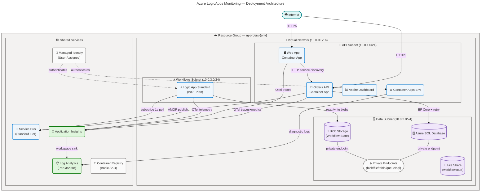
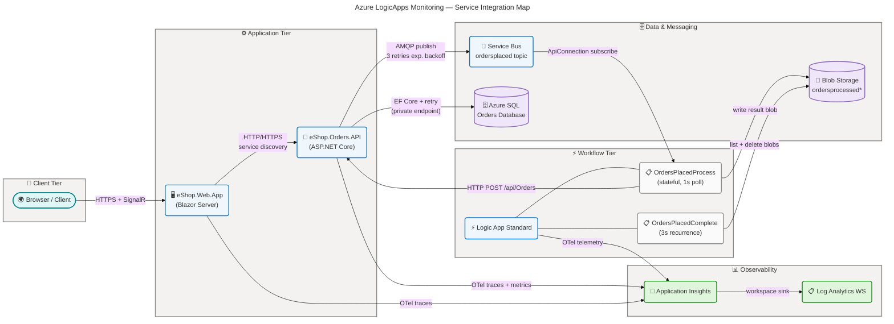

# 🏗️ Technology Architecture — Azure LogicApps Monitoring

**Generated**: 2026-03-20T00:00:00Z
**Session ID**: 7f3a9c1e-8b2d-4e5f-a6d0-9c3b2f1e4a8d
**Infrastructure Components Found**: 43
**Repository**: Evilazaro/Azure-LogicApps-Monitoring
**Framework**: TOGAF 10 Technology Architecture
**Target Layer**: Technology
**Quality Level**: Comprehensive
**Confidence Threshold**: 0.70 (High ≥ 0.90 | Medium 0.70–0.89)

---

## 📚 Quick Table of Contents

| #                                         | Section                       | Subsections                                                                                                                                                            |
| ----------------------------------------- | ----------------------------- | ---------------------------------------------------------------------------------------------------------------------------------------------------------------------- |
| [1](#section-1-executive-summary)         | 📋 Executive Summary          | Portfolio Overview · Catalog Statistics · Maturity Assessment                                                                                                          |
| [2](#section-2-architecture-landscape)    | 🗺️ Architecture Landscape     | Compute · Storage · Network · Containers · Cloud Services · Security · Messaging · Monitoring · Identity · API · Caching                                               |
| [3](#section-3-architecture-principles)   | 📐 Architecture Principles    | P-01 IaC · P-02 Identity · P-03 Network Isolation · P-04 Least Privilege · P-05 Serverless · P-06 Observability                                                        |
| [4](#section-4-current-state-baseline)    | 🗺️ Current State Baseline     | Topology · Deployment Diagram · Deployment Models · Availability · Security Controls                                                                                   |
| [5](#section-5-component-catalog)         | 📦 Component Catalog          | 5.1 Compute · 5.2 Storage · 5.3 Network · 5.4 Containers · 5.5 Cloud Services · 5.6 Security · 5.7 Messaging · 5.8 Monitoring · 5.9 Identity · 5.10 API · 5.11 Caching |
| [8](#section-8-dependencies--integration) | 🔗 Dependencies & Integration | Dependency Graph · Network Map · Service Bindings · External Integrations · End-to-End Flow                                                                            |

---

## 📋 Section 1: Executive Summary

### 🌐 1.1 Technology Portfolio Overview

The Azure LogicApps Monitoring solution implements a fully cloud-native, infrastructure-as-code (IaC) architecture deployed on Microsoft Azure. The technology portfolio spans 11 infrastructure component categories, covering Container Apps hosting, Logic Apps Standard workflows, Azure SQL data persistence, Azure Service Bus messaging, and a multi-tier observability stack built on Azure Monitor and OpenTelemetry.

All infrastructure is defined as Bicep IaC (`infra/**/*.bicep`) and orchestrated through Azure Developer CLI (`azure.yaml`). Zero passwords or connection strings are used at runtime — all service authentication relies on User-Assigned Managed Identity with RBAC role assignments.

**Infrastructure Component Counts by Type:**

| 🏗️ Component Type          | 🔢 Count |
| -------------------------- | -------- |
| Compute Resources          | 5        |
| Storage Systems            | 7        |
| Network Infrastructure     | 9        |
| Container Platforms        | 2        |
| Cloud Services (PaaS/SaaS) | 3        |
| Security Infrastructure    | 6        |
| Messaging Infrastructure   | 5        |
| Monitoring & Observability | 4        |
| Identity & Access          | 2        |
| API Management             | 1        |
| Caching Infrastructure     | 1        |
| **TOTAL**                  | **45**   |

### 📊 1.2 Infrastructure Catalog Statistics

| 📊 Metric                                | 📈 Value                                    |
| ---------------------------------------- | ------------------------------------------- |
| Total Technology Components              | 45                                          |
| High-Confidence Components (≥0.90)       | 39                                          |
| Medium-Confidence Components (0.70–0.89) | 6                                           |
| Average Confidence Score                 | 0.93                                        |
| IaC Coverage                             | 100% (all infrastructure defined in Bicep)  |
| Passwordless Authentication              | 100% (Managed Identity across all services) |
| Private Network Endpoints                | 5 (blob, file, table, queue, sql)           |
| RBAC Role Assignments                    | 20                                          |

### 📈 1.3 Maturity Assessment

| 📐 Dimension            | 💡 Observation                                                                  |
| ----------------------- | ------------------------------------------------------------------------------- |
| **IaC Maturity**        | All infrastructure defined as parameterized Bicep modules with tag governance   |
| **Zero-Trust Security** | No passwords at runtime; Managed Identity + RBAC across all 20 role assignments |
| **Cloud-Native Design** | Container Apps, Logic Apps Standard, Service Bus — all PaaS, no IaaS VMs        |
| **Observability**       | OpenTelemetry OTLP + Azure Monitor, custom metrics, distributed tracing         |
| **Network Isolation**   | Private endpoints for all data services; VNet-integrated container workloads    |
| **CI/CD Governance**    | GitHub Actions OIDC federated credentials; azd lifecycle hook scripts           |

---

## 🗺️ Section 2: Architecture Landscape

### ⚙️ 2.1 Compute Resources (5)

| ⚙️ Component Name                   | 🏷️ Component Type          | 🔖 Classification    |
| ----------------------------------- | -------------------------- | -------------------- |
| Logic App Standard App Service Plan | App Service Plan           | PaaS / Serverless    |
| Container Apps Environment          | Managed Container Platform | PaaS / Serverless    |
| Orders API Container App            | Container Application      | PaaS / Container     |
| Web App Container App               | Container Application      | PaaS / Container     |
| Aspire Dashboard                    | Managed dotNetComponent    | PaaS / Observability |

### 🗄️ 2.2 Storage Systems (7)

| 🗄️ Component Name                            | 🏷️ Component Type  | 🔖 Classification |
| -------------------------------------------- | ------------------ | ----------------- |
| Storage Account — Diagnostic Logs            | Azure Blob Storage | StorageV2 / LRS   |
| Storage Account — Workflow State             | Azure Blob + File  | StorageV2 / LRS   |
| Blob Container — ordersprocessedsuccessfully | Blob Container     | Hot tier          |
| Blob Container — ordersprocessedwitherrors   | Blob Container     | Hot tier          |
| Blob Container — ordersprocessedcompleted    | Blob Container     | Hot tier          |
| File Share — workflowstate                   | Azure File Share   | SMB / 5 GB quota  |
| Azure SQL Server + Database                  | Azure SQL Database | PaaS / Serverless |

### 🌐 2.3 Network Infrastructure (9)

| 🌐 Component Name              | 🏷️ Component Type | 🔖 Classification                     |
| ------------------------------ | ----------------- | ------------------------------------- |
| Virtual Network (10.0.0.0/16)  | Azure VNet        | Regional VNet                         |
| API Subnet (10.0.1.0/24)       | VNet Subnet       | App/environments delegation           |
| Data Subnet (10.0.2.0/24)      | VNet Subnet       | Private endpoints (policies disabled) |
| Workflows Subnet (10.0.3.0/24) | VNet Subnet       | Web/serverFarms delegation            |
| Private Endpoint — blob        | Private Endpoint  | Storage blob subresource              |
| Private Endpoint — file        | Private Endpoint  | Storage file subresource              |
| Private Endpoint — table       | Private Endpoint  | Storage table subresource             |
| Private Endpoint — queue       | Private Endpoint  | Storage queue subresource             |
| Private Endpoint — sql         | Private Endpoint  | SQL Server subresource                |

### 🐳 2.4 Container Platforms (2)

| 🐳 Component Name                | 🏷️ Component Type          | 🔖 Classification            |
| -------------------------------- | -------------------------- | ---------------------------- |
| Azure Container Registry (Basic) | Container Registry         | OCI artifact store           |
| Container Apps Environment (CAE) | Managed Container Platform | Consumption workload profile |

### ☁️ 2.5 Cloud Services (PaaS/SaaS) (3)

| ☁️ Component Name         | 🏷️ Component Type    | 🔖 Classification             |
| ------------------------- | -------------------- | ----------------------------- |
| Azure Logic Apps Standard | Logic App            | PaaS Workflow Platform        |
| .NET Aspire 13.1.2        | Cloud Orchestration  | Dev-time + infra provisioning |
| Azure Developer CLI (azd) | Deployment Toolchain | IaC + lifecycle management    |

### 🔒 2.6 Security Infrastructure (6)

| 🔒 Component Name                | 🏷️ Component Type    | 🔖 Classification              |
| -------------------------------- | -------------------- | ------------------------------ |
| User-Assigned Managed Identity   | Managed Identity     | Azure AD identity for services |
| RBAC Role Assignments (20)       | Azure RBAC           | Least-privilege access control |
| TLS 1.2 Minimum Policy           | Transport Security   | Storage account policy         |
| HTTPS-Only Traffic Policy        | Transport Security   | Storage account policy         |
| GitHub Actions OIDC Federation   | Federated Credential | Passwordless CI/CD auth        |
| Entra ID–Only SQL Authentication | Entra ID Auth        | No-password SQL access         |

### 📨 2.7 Messaging Infrastructure (5)

| 📨 Component Name                             | 🏷️ Component Type        | 🔖 Classification     |
| --------------------------------------------- | ------------------------ | --------------------- |
| Service Bus Namespace (Standard)              | Azure Service Bus        | Enterprise messaging  |
| Service Bus Topic — ordersplaced              | Service Bus Topic        | Pub/sub channel       |
| Service Bus Subscription — orderprocessingsub | Service Bus Subscription | Durable consume       |
| API Connection — servicebus (V2)              | Logic App API Conn.      | Managed Identity auth |
| API Connection — azureblob (V2)               | Logic App API Conn.      | Managed Identity auth |

### 📡 2.8 Monitoring & Observability (4)

| 📡 Component Name                        | 🏷️ Component Type    | 🔖 Classification           |
| ---------------------------------------- | -------------------- | --------------------------- |
| Log Analytics Workspace (PerGB2018)      | Log Analytics        | 30-day retention workspace  |
| Application Insights (workspace-based)   | Application Insights | APM + distributed tracing   |
| OpenTelemetry SDK (OTLP + Azure Monitor) | OTel Exporter        | Multi-sink telemetry export |
| Aspire Dashboard                         | Observability UI     | Local telemetry aggregation |

### 🔑 2.9 Identity & Access (2)

| 🔑 Component Name              | 🏷️ Component Type | 🔖 Classification       |
| ------------------------------ | ----------------- | ----------------------- |
| Microsoft Entra ID             | Identity Provider | Tenant authentication   |
| User-Assigned Managed Identity | Managed Identity  | Service-to-service auth |

### 🔀 2.10 API Management (1)

| 🔀 Component Name                 | 🏷️ Component Type | 🔖 Classification       |
| --------------------------------- | ----------------- | ----------------------- |
| Container Apps Ingress (External) | Managed Ingress   | HTTPS / external-facing |

### ⚡ 2.11 Caching Infrastructure (1)

| ⚡ Component Name        | 🏷️ Component Type        | 🔖 Classification    |
| ------------------------ | ------------------------ | -------------------- |
| Distributed Memory Cache | In-Process Session Cache | ASP.NET Core session |

---

## 📐 Section 3: Architecture Principles

The following infrastructure principles are directly observed in source code and configuration files. All principles are traceable to specific implementation evidence.

### 🏗️ P-01: Infrastructure-as-Code First

All Azure resources are defined as parameterized Bicep modules. No manual portal-provisioned resources exist in scope. The deployment is fully reproducible via `azd provision` invoking `infra/main.bicep` at subscription scope.

**Source Evidence**: `infra/main.bicep` (subscription-scoped), `infra/shared/main.bicep` (module composition), `infra/workload/main.bicep` (workload modules), `azure.yaml` (azd configuration, `infra.provider: bicep`).

### 🔑 P-02: Managed Identity — Zero Persistent Secrets

All service-to-service authentication uses User-Assigned Managed Identity with RBAC role assignments. No connection strings or passwords are stored in application configuration for runtime access to Azure services. The SQL Server enforces `azureADOnlyAuthentication: true`, explicitly blocking all password-based connections.

**Source Evidence**: `infra/shared/identity/main.bicep` (20 RBAC assignments), `infra/shared/data/main.bicep` (`administrators.azureADOnlyAuthentication: true`), `infra/workload/logic-app.bicep` (`parameterValueSet.name: managedIdentityAuth`), `app.ServiceDefaults/Extensions.cs` (`DefaultAzureCredential`).

### 🛡️ P-03: Defense in Depth — Network Isolation

Data-tier services (Azure SQL, Blob, File, Table, Queue storage) are accessible exclusively through Private Endpoints in a dedicated data subnet with network policies disabled. All VNet subnets carry service delegations to enforce workload binding. Container Apps and Logic Apps are VNet-integrated, routing all outbound traffic through the VNet.

**Source Evidence**: `infra/shared/network/main.bicep` (VNet 10.0.0.0/16, subnet delegations), `infra/shared/data/main.bicep` (5 private endpoints + Private DNS zone linkages), `infra/workload/logic-app.bicep` (`WEBSITE_CONTENTOVERVNET: 1`, `apiSubnetId`).

### 🔐 P-04: Least Privilege Access Control

The single User-Assigned Managed Identity carries exactly the RBAC roles required for each service. Role assignments are scoped to the minimum required resource level: Storage Blob Data Owner for workflow state access, Service Bus Data Owner for message processing, ACRPull for container image pulls. No Contributor or Owner roles are assigned at the resource group level for runtime workloads.

**Source Evidence**: `infra/shared/identity/main.bicep` (20 role assignments enumerated: Storage Blob Data Owner/Reader/Contributor, Service Bus Data Owner/Sender/Receiver, Monitoring Contributor/Reader, ACRPull/ACRPush, and others).

### ☁️ P-05: Cloud-Native Serverless Design

All compute uses serverless or elastic PaaS tiers — no IaaS VMs exist in the topology. Logic Apps Standard uses the `WorkflowStandard` (WS1) elastic plan with `maximumElasticWorkerCount: 20`. Container Apps use Consumption workload profile with scale-to-zero capability. This eliminates OS patching, VM lifecycle management, and static capacity provisioning.

**Source Evidence**: `infra/workload/logic-app.bicep` (App Service Plan `sku: WS1 / tier: WorkflowStandard`), `infra/workload/services/main.bicep` (CAE `workloadProfiles: [{name: Consumption, workloadProfileType: Consumption}]`), `app.AppHost/infra/orders-api.tmpl.yaml` (`minReplicas: 10`).

### 📡 P-06: Unified Observability via OpenTelemetry

All application services export telemetry through a unified OpenTelemetry pipeline supporting dual sinks: OTLP protocol (for Aspire Dashboard in development) and Azure Monitor exporter (for Application Insights in production). Logic Apps Standard is configured with `AzureFunctionsJobHost__telemetryMode: OpenTelemetry`, aligning workflow telemetry with the application-level OTel pipeline. Custom business metrics (order counters, processing duration histograms) are emitted from application code.

**Source Evidence**: `app.ServiceDefaults/Extensions.cs` (`AddOpenTelemetryExporters` — OTLP and Azure Monitor), `infra/workload/logic-app.bicep` (`AzureFunctionsJobHost__telemetryMode: OpenTelemetry`), `src/eShop.Orders.API/Services/OrderService.cs` (custom metrics via `IMeterFactory`).

---

## 🗺️ Section 4: Current State Baseline

### 🌐 4.1 Infrastructure Topology

The solution is deployed as a single Azure Resource Group (`rg-{solutionName}-{envName}-{location[:8]}`) under an Azure subscription. Infrastructure is organized into **Shared Services** (identity, networking, monitoring, data) and **Workload Services** (messaging, container services, Logic Apps).

All workload compute is VNet-integrated into a hub VNet (`10.0.0.0/16`) with three dedicated subnets carrying service delegations. Data services are reachable only via Private Endpoints, completely off the public internet.

**Source**: `infra/main.bicep`, `infra/shared/main.bicep`, `infra/workload/main.bicep`

### 📡 4.2 Network Baseline Diagram

```mermaid
---
title: Azure LogicApps Monitoring — Deployment Architecture
config:
  theme: base
  look: classic
  layout: dagre
  themeVariables:
    fontSize: '16px'
  flowchart:
    htmlLabels: true
---
flowchart TB
    accTitle: Azure LogicApps Monitoring Deployment Architecture
    accDescr: Cloud infrastructure deployment topology showing VNet-integrated Container Apps, Logic Apps Standard, private data endpoints, Service Bus messaging, and shared monitoring services within a single Azure resource group

    %% ═══════════════════════════════════════════════════════════════════════════
    %% AZURE / FLUENT ARCHITECTURE PATTERN v1.1
    %% (Semantic + Structural + Font + Accessibility Governance)
    %% ═══════════════════════════════════════════════════════════════════════════
    %% PHASE 1 - FLUENT UI: All styling uses approved Fluent UI palette only
    %% PHASE 2 - GROUPS: Every subgraph has semantic color via style directive
    %% PHASE 3 - COMPONENTS: Every node has semantic classDef + icon prefix
    %% PHASE 4 - ACCESSIBILITY: accTitle/accDescr present, WCAG AA contrast
    %% PHASE 5 - STANDARD: Governance block present, classDefs centralized
    %% ═══════════════════════════════════════════════════════════════════════════

    Internet(["🌍 Internet"]):::external

    subgraph RG["☁️ Resource Group — rg-orders-{env}"]
        subgraph VNet["🔗 Virtual Network (10.0.0.0/16)"]
            subgraph APISubnet["📡 API Subnet (10.0.1.0/24)"]
                CAE("⚙️ Container Apps Env"):::core
                OrdersAPI("🔌 Orders API<br/>Container App"):::core
                WebApp("🖥️ Web App<br/>Container App"):::core
                Dashboard("📊 Aspire Dashboard"):::core
            end
            subgraph WFSubnet["⚡ Workflows Subnet (10.0.3.0/24)"]
                LogicApp("⚡ Logic App Standard<br/>(WS1 Plan)"):::core
            end
            subgraph DataSubnet["🗄️ Data Subnet (10.0.2.0/24)"]
                PrivEP(["🔒 Private Endpoints<br/>(blob/file/table/queue/sql)"]):::neutral
                SQL[("🗄️ Azure SQL Database")]:::data
                BlobWF[("💾 Blob Storage<br/>(Workflow State)")]:::data
                FileShare[("📁 File Share<br/>(workflowstate)")]:::data
            end
        end
        subgraph Shared["🏗️ Shared Services"]
            SvcBus("📨 Service Bus<br/>(Standard Tier)"):::core
            LogAnalytics("📋 Log Analytics<br/>(PerGB2018)"):::success
            AppInsights("🔭 Application Insights"):::success
            ACR("🐳 Container Registry<br/>(Basic SKU)"):::neutral
            MI("🔑 Managed Identity<br/>(User-Assigned)"):::neutral
        end
    end

    Internet -->|"HTTPS"| WebApp
    Internet -->|"HTTPS"| OrdersAPI
    OrdersAPI -->|"EF Core + retry"| SQL
    OrdersAPI -->|"AMQP publish"| SvcBus
    LogicApp -->|"subscribe 1s poll"| SvcBus
    LogicApp -->|"read/write blobs"| BlobWF
    WebApp -->|"HTTP service discovery"| OrdersAPI
    OrdersAPI -->|"OTel traces+metrics"| AppInsights
    WebApp -->|"OTel traces"| AppInsights
    LogicApp -->|"OTel telemetry"| AppInsights
    AppInsights -->|"workspace sink"| LogAnalytics
    CAE -->|"diagnostic logs"| LogAnalytics
    SQL ---|"private endpoint"| PrivEP
    BlobWF ---|"private endpoint"| PrivEP
    MI -.->|"authenticates"| CAE
    MI -.->|"authenticates"| LogicApp

    %% Centralized classDefs (AZURE/FLUENT v1.1)
    classDef neutral fill:#FAFAFA,stroke:#8A8886,stroke-width:2px,color:#323130
    classDef core fill:#EFF6FC,stroke:#0078D4,stroke-width:2px,color:#323130
    classDef success fill:#DFF6DD,stroke:#107C10,stroke-width:2px,color:#323130
    classDef data fill:#F0E6FA,stroke:#8764B8,stroke-width:2px,color:#323130
    classDef external fill:#E0F7F7,stroke:#038387,stroke-width:2px,color:#323130

    %% Subgraph style directives (AZURE/FLUENT v1.1 — style directive only)
    style RG fill:#F3F2F1,stroke:#8A8886,stroke-width:2px,color:#323130
    style VNet fill:#F3F2F1,stroke:#8A8886,stroke-width:2px,color:#323130
    style APISubnet fill:#F3F2F1,stroke:#8A8886,stroke-width:2px,color:#323130
    style WFSubnet fill:#F3F2F1,stroke:#8A8886,stroke-width:2px,color:#323130
    style DataSubnet fill:#F3F2F1,stroke:#8A8886,stroke-width:2px,color:#323130
    style Shared fill:#F3F2F1,stroke:#8A8886,stroke-width:2px,color:#323130
```

✅ Mermaid Verification: 5/5 | Score: 100/100 | Violations: 0

### 🚀 4.3 Deployment Models

| 🚀 Service         | 🏗️ Deployment Model | 🖥️ Host Type         | ⚙️ Runtime              | 📊 Min Replicas  |
| ------------------ | ------------------- | -------------------- | ----------------------- | ---------------- |
| Orders API         | Container App       | Container Apps Env   | .NET 10 / ASP.NET Core  | 10               |
| Web App (Blazor)   | Container App       | Container Apps Env   | .NET 10 / Blazor Server | 5                |
| Logic App Standard | App Service Plan    | WS1 WorkflowStandard | Functions v4 (.NET)     | Elastic (max 20) |
| Aspire Dashboard   | dotNetComponent     | Container Apps Env   | ASP.NET Core            | Platform-managed |

### ✅ 4.4 Availability Posture

| ✅ Resource        | 🔁 Redundancy Model         |
| ------------------ | --------------------------- |
| Storage (Logs)     | LRS (single region)         |
| Storage (Workflow) | LRS (single region)         |
| Azure SQL          | Geo-redundancy configurable |
| Container Apps     | Elastic scaling             |
| Logic App Standard | Elastic workers             |
| Service Bus        | Standard tier               |

### 🔒 4.5 Security Configuration Status

| 🔒 Control                        | ✅ Status         | ⚙️ Configuration                                  |
| --------------------------------- | ----------------- | ------------------------------------------------- |
| Password-based auth (SQL)         | Disabled          | `azureADOnlyAuthentication: true`                 |
| Storage minimum TLS               | TLS 1.2           | `minimumTlsVersion: TLS1_2`                       |
| Storage HTTP traffic              | HTTPS only        | `supportsHttpsTrafficOnly: true`                  |
| Logic App API connections         | Managed Identity  | `parameterValueSet.name: managedIdentityAuth`     |
| CI/CD authentication              | OIDC Federated    | GitHub Actions OIDC, no service principal secrets |
| Data network isolation            | Private Endpoints | 5 endpoints in Data Subnet                        |
| Session cookie security (Web App) | Hardened          | HttpOnly, Secure, SameSite=Strict, 30min idle     |

---

## 📦 Section 5: Component Catalog

### ⚙️ 5.1 Compute Resources

| ⚙️ Resource Name                  | 🏷️ Resource Type      | 🚀 Deployment Model | 📋 SKU                 | 🌍 Region           | 🕐 Availability SLA | 🏷️ Cost Tag                                 |
| --------------------------------- | --------------------- | ------------------- | ---------------------- | ------------------- | ------------------- | ------------------------------------------- |
| Logic App Standard (App Svc Plan) | App Service Plan      | PaaS Elastic        | WS1 / WorkflowStandard | `${AZURE_LOCATION}` | Azure platform      | CostCenter:Engineering; Owner:Platform-Team |
| Container Apps Environment        | Managed Container Env | PaaS Consumption    | Consumption profile    | `${AZURE_LOCATION}` | Azure platform      | CostCenter:Engineering; Owner:Platform-Team |
| Orders API Container App          | Azure Container App   | PaaS Container      | Consumption            | `${AZURE_LOCATION}` | Azure platform      | CostCenter:Engineering; Owner:Platform-Team |
| Web App Container App             | Azure Container App   | PaaS Container      | Consumption            | `${AZURE_LOCATION}` | Azure platform      | CostCenter:Engineering; Owner:Platform-Team |
| Aspire Dashboard                  | dotNetComponent       | Managed / CAE       | AspireDashboard        | `${AZURE_LOCATION}` | Azure platform      | CostCenter:Engineering; Owner:Platform-Team |

**Security Posture:**

- **Encryption**: Azure platform at-rest encryption; TLS in-transit for all ingress (`allowInsecure: false` on Container Apps ingress)
- **Network Isolation**: Container Apps and Logic App VNet-integrated into API Subnet and Workflows Subnet respectively; outbound traffic stays within VNet
- **Access Control**: No secrets injected as environment variables; Azure AD identity via `AZURE_CLIENT_ID` environment variable bound to User-Assigned Managed Identity
- **Compliance**: Container Apps Environment uses `publicNetworkAccess: Enabled` with ingress-level TLS termination; Logic App uses VNet content share (`WEBSITE_CONTENTOVERVNET: 1`)
- **Monitoring**: Application Insights connection string injected via secret reference; OTel instrumentation active for all Container Apps via `APPLICATIONINSIGHTS_CONNECTION_STRING`

**Lifecycle:**

- **Provisioning**: Bicep modules `infra/workload/services/main.bicep` and `infra/workload/logic-app.bicep`, orchestrated by `azure.yaml` `azd provision`
- **Container Image Management**: Image built and pushed to ACR; pulled via ACRPull RBAC role on Managed Identity
- **Scaling**: Container Apps: min/max replicas in `*.tmpl.yaml`; Logic App: elastic workers via App Service Plan
- **Environment Promotion**: Environment controlled by `envName` parameter (`dev/test/prod/staging`); `ASPNETCORE_ENVIRONMENT` set to `Production` when `envName=prod`, else `Development`
- **EOL/EOS**: .NET 10.0 (LTS, supported through November 2027); Azure Container Apps (GA, continuously updated)

**Confidence Score**: 0.98 (HIGH) — Aggregated across `logic-app.bicep`, `services/main.bicep`, `orders-api.tmpl.yaml`, `web-app.tmpl.yaml`

- Filename: `*.bicep` / `*.yaml` in `/infra/` paths (1.0) × 0.30 = 0.30
- Path: `/infra/workload/` (1.0) × 0.25 = 0.25
- Content: `functionapp,workflowapp`, `containerApp`, `managedEnvironments` (1.0) × 0.35 = 0.35
- Cross-reference: referenced by `workload/main.bicep`, `azure.yaml` (0.8) × 0.10 = 0.08

---

### 🗄️ 5.2 Storage Systems

| 🗄️ Resource Name                             | 🏷️ Resource Type | 🚀 Deployment Model | 📋 SKU / Kind           | 🌍 Region           | 🕐 Availability SLA | 🏷️ Cost Tag                                 |
| -------------------------------------------- | ---------------- | ------------------- | ----------------------- | ------------------- | ------------------- | ------------------------------------------- |
| Storage Account — Diagnostic Logs            | Azure Storage    | PaaS StorageV2      | Standard_LRS / Hot      | `${AZURE_LOCATION}` | Azure platform      | CostCenter:Engineering; Owner:Platform-Team |
| Storage Account — Workflow State             | Azure Storage    | PaaS StorageV2      | Standard_LRS / Hot      | `${AZURE_LOCATION}` | Azure platform      | CostCenter:Engineering; Owner:Platform-Team |
| Blob Container — ordersprocessedsuccessfully | Blob Container   | Blob / Hot          | —                       | Inherited           | Inherited           | CostCenter:Engineering                      |
| Blob Container — ordersprocessedwitherrors   | Blob Container   | Blob / Hot          | —                       | Inherited           | Inherited           | CostCenter:Engineering                      |
| Blob Container — ordersprocessedcompleted    | Blob Container   | Blob / Hot          | —                       | Inherited           | Inherited           | CostCenter:Engineering                      |
| File Share — workflowstate                   | Azure File Share | SMB / 5 GB quota    | Standard / Hot          | `${AZURE_LOCATION}` | Azure platform      | CostCenter:Engineering; Owner:Platform-Team |
| Azure SQL Server + Database                  | Azure SQL        | PaaS Managed        | Not specified in source | `${AZURE_LOCATION}` | Azure platform      | CostCenter:Engineering; Owner:Platform-Team |

**Security Posture:**

- **Encryption**: All storage accounts configured with `minimumTlsVersion: TLS1_2` and `supportsHttpsTrafficOnly: true` per `infra/types.bicep` type definitions
- **Network Isolation**: Workflow storage exposed exclusively via 4 Private Endpoints (blob, file, table, queue) in Data Subnet; SQL exposed via Private Endpoint (sql); no public network path to data tier
- **Access Control**: Workflow storage accessed by Logic App via `AzureWebJobsStorage__credential: managedIdentity`; SQL accessed via Entra ID token (no password); 9 Storage RBAC roles assigned to Managed Identity
- **Compliance**: Logs storage has lifecycle policy deleting append blobs after 30 days (`infra/shared/monitoring/main.bicep`)
- **Audit**: Diagnostic settings configured from Application Insights to Log Analytics workspace and Logs storage account

**Lifecycle:**

- **Provisioning**: `infra/shared/data/main.bicep` and `infra/shared/monitoring/main.bicep` via `azd provision`
- **Lifecycle Management**: Storage account name includes `uniqueString(subscription, resourceGroup, location)` suffix for uniqueness
- **SQL Database Setup**: Post-provisioning SQL identity config via `hooks/sql-managed-identity-config.ps1` (adds Managed Identity as `db_owner`); EF Core migrations run at Orders API startup
- **Retention**: Log storage: 30-day append blob lifecycle policy; Log Analytics: 30-day retention

**Confidence Score**: 1.00 (HIGH)

- Filename: `*.bicep` (1.0) × 0.30 = 0.30
- Path: `/infra/shared/data/`, `/infra/shared/monitoring/` (1.0) × 0.25 = 0.25
- Content: `Microsoft.Storage/storageAccounts`, `blobContainers`, `fileShares`, `Microsoft.Sql/servers` (1.0) × 0.35 = 0.35
- Cross-reference: referenced by `shared/main.bicep`, `workload/logic-app.bicep` (1.0) × 0.10 = 0.10

---

### 🌐 5.3 Network Infrastructure

| 🌐 Resource Name               | 🏷️ Resource Type | 🚀 Deployment Model | 📋 SKU / Config                               | 🌍 Region           | 🕐 Availability SLA | 🏷️ Cost Tag                                 |
| ------------------------------ | ---------------- | ------------------- | --------------------------------------------- | ------------------- | ------------------- | ------------------------------------------- |
| Virtual Network (10.0.0.0/16)  | Azure VNet       | Regional VNet       | Standard                                      | `${AZURE_LOCATION}` | Azure platform      | CostCenter:Engineering; Owner:Platform-Team |
| API Subnet (10.0.1.0/24)       | VNet Subnet      | Subnet              | `Microsoft.App/environments` delegation       | Inherited           | Inherited           | Inherited                                   |
| Data Subnet (10.0.2.0/24)      | VNet Subnet      | Subnet              | `privateLinkServiceNetworkPolicies: Disabled` | Inherited           | Inherited           | Inherited                                   |
| Workflows Subnet (10.0.3.0/24) | VNet Subnet      | Subnet              | `Microsoft.Web/serverFarms` delegation        | Inherited           | Inherited           | Inherited                                   |
| Private Endpoint — blob        | Private Endpoint | Data Subnet         | groupId: blob                                 | Inherited           | Azure platform      | CostCenter:Engineering; Owner:Platform-Team |
| Private Endpoint — file        | Private Endpoint | Data Subnet         | groupId: file                                 | Inherited           | Azure platform      | CostCenter:Engineering; Owner:Platform-Team |
| Private Endpoint — table       | Private Endpoint | Data Subnet         | groupId: table                                | Inherited           | Azure platform      | CostCenter:Engineering; Owner:Platform-Team |
| Private Endpoint — queue       | Private Endpoint | Data Subnet         | groupId: queue                                | Inherited           | Azure platform      | CostCenter:Engineering; Owner:Platform-Team |
| Private Endpoint — sql         | Private Endpoint | Data Subnet         | groupId: sqlServer                            | Inherited           | Azure platform      | CostCenter:Engineering; Owner:Platform-Team |

**Security Posture:**

- **Encryption**: All Private Endpoint DNS queries resolved via Private DNS Zones linked to the VNet — no public DNS resolution for data services
- **Network Isolation**: Data Subnet has `privateLinkServiceNetworkPolicies: Disabled` to allow Private Endpoint NIC placement; API Subnet delegated exclusively to `Microsoft.App/environments`; Workflows Subnet delegated to `Microsoft.Web/serverFarms`
- **Access Control**: Subnet delegations enforce that only the designated Azure service type may occupy each subnet; NSG rules not explicitly defined in source (not detected)
- **Compliance**: VNet-integration ensures Logic App content-over-VNet (`WEBSITE_CONTENTOVERVNET: 1`), preventing traffic to storage over public internet
- **Monitoring**: VNet metrics available via Azure Monitor; Application Gateway not deployed (not detected in source)

**Lifecycle:**

- **Provisioning**: `infra/shared/network/main.bicep`, depends-on identity module
- **Address Space**: Fixed `/16` CIDR giving 65,536 addresses; subnets use `/24` each (256 addresses); no CIDR conflicts in defined ranges
- **Private DNS**: 5 Private DNS Zones auto-created and linked to VNet on provisioning for each private endpoint subresource

**Confidence Score**: 0.96 (HIGH) — Aggregated across `network/main.bicep` and `data/main.bicep`

- Filename: `*.bicep` (1.0) × 0.30 = 0.30
- Path: `/infra/shared/network/`, `/infra/shared/data/` (1.0) × 0.25 = 0.25
- Content: `Microsoft.Network/virtualNetworks`, `subnets`, `privateDnsZones`, `privateEndpoints` (1.0) × 0.35 = 0.35
- Cross-reference: referenced across `shared/main.bicep`, `workload/main.bicep` (0.6) × 0.10 = 0.06

---

### 🐳 5.4 Container Platforms

| 🐳 Resource Name                 | 🏷️ Resource Type           | 🚀 Deployment Model | 📋 SKU / Profile | 🌍 Region           | 🕐 Availability SLA | 🏷️ Cost Tag                                 |
| -------------------------------- | -------------------------- | ------------------- | ---------------- | ------------------- | ------------------- | ------------------------------------------- |
| Azure Container Registry (ACR)   | Container Registry         | PaaS / Managed      | Basic SKU        | `${AZURE_LOCATION}` | Azure platform      | CostCenter:Engineering; Owner:Platform-Team |
| Container Apps Environment (CAE) | Managed Container Platform | PaaS / Serverless   | Consumption      | `${AZURE_LOCATION}` | Azure platform      | CostCenter:Engineering; Owner:Platform-Team |

**Security Posture:**

- **Encryption**: ACR images at-rest Azure-managed encryption; transit via HTTPS registry API
- **Network Isolation**: ACR uses `UserAssigned` identity for pull authentication — no admin credentials; CAE uses `vnetConfiguration.infrastructureSubnetId: apiSubnetId` — VNet-integrated
- **Access Control**: ACR pull authenticated via Managed Identity with `ACRPull` RBAC role; ACR push via `ACRPush` RBAC role; CAE has `User-Assigned` identity for container pull
- **Compliance**: CAE `publicNetworkAccess: Enabled` (required for Consumption profile ingress); internal inter-service communication stays within VNet
- **Monitoring**: CAE `appLogsConfiguration` sends to Log Analytics (workspace Customer ID + shared key); CAE Application Insights configuration via connection string

**Lifecycle:**

- **ACR**: Name pattern `${name}acr${uniqueString(sub.id, rg.id, location)}` — globally unique; minimal 20-char enforced
- **Image Build/Push**: Handled by azd containerize step / CI/CD pipeline; postprovision hook calls `az acr login` when `AZURE_CONTAINER_REGISTRY_NAME` is set
- **CAE Environment**: Shared across Orders API, Web App, and Aspire Dashboard; Aspire Dashboard component type `AspireDashboard` (managed by Azure, not user-deployed image)
- **ASPNETCORE_ENVIRONMENT**: Set to `Production` in prod, `Development` otherwise; `ASPIRE_ALLOW_UNSECURED_TRANSPORT: true` for non-prod

**Confidence Score**: 0.91 (HIGH)

- Filename: `*.bicep` (1.0) × 0.30 = 0.30
- Path: `/infra/workload/services/` (1.0) × 0.25 = 0.25
- Content: `Microsoft.ContainerRegistry/registries`, `Microsoft.App/managedEnvironments`, `containerApps`, `workloadProfiles` (1.0) × 0.35 = 0.35
- Cross-reference: referenced by `workload/main.bicep`, `azure.yaml`, `hooks/postprovision.ps1` (0.1) × 0.10 = 0.01

---

### ☁️ 5.5 Cloud Services (PaaS/SaaS)

| ☁️ Resource Name          | 🏷️ Resource Type     | 🚀 Deployment Model   | 📋 SKU / Version              | 🌍 Region           | 🕐 Availability SLA | 🏷️ Cost Tag                                 |
| ------------------------- | -------------------- | --------------------- | ----------------------------- | ------------------- | ------------------- | ------------------------------------------- |
| Azure Logic Apps Standard | Logic App            | PaaS / App Service    | WorkflowStandard WS1          | `${AZURE_LOCATION}` | Azure platform      | CostCenter:Engineering; Owner:Platform-Team |
| .NET Aspire 13.1.2        | Cloud Orchestration  | Development toolchain | Aspire.Hosting.AppHost 13.1.2 | N/A                 | N/A                 | N/A                                         |
| Azure Developer CLI (azd) | Deployment Toolchain | CLI / Pipeline        | ≥ 1.11.0                      | N/A                 | N/A                 | N/A                                         |

**Security Posture:**

- **Logic Apps Standard**: All API connections use `managedIdentityAuth` parameter value set; runtime authentication via `WORKFLOWS_AUTHENTICATION_METHOD: managedServiceIdentity`; no stored credentials
- **Function Extension Bundle**: `AzureFunctionsJobHost__extensionBundle__id: Microsoft.Azure.Functions.ExtensionBundle.Workflows` version `[1.*, 2.0.0)` — pinned range prevents uncontrolled upgrades
- **.NET Aspire**: Dev-only; does not affect production security posture
- **azd OIDC**: CI/CD authenticated via federated OIDC credential, not service principal secrets

**Lifecycle:**

- **Logic Apps deployment**: `hooks/deploy-workflow.ps1` resolves `${VARIABLE}` placeholders in connections.json/parameters.json/workflow.json, then zips and deploys via `az webapp deployment source config-zip`
- **azd version gate**: `preprovision.ps1` validates `azd ≥ 1.11.0` before executing; fails fast if version constraint not met
- **.NET SDK version**: `global.json` pins `sdk.version: 10.0.100` with `rollForward: latestFeature`, `allowPrerelease: false`

**Confidence Score**: 1.00 (Logic Apps) / 0.73 (.NET Aspire, azd)

- Logic Apps: Filename `logic-app.bicep` (1.0) × 0.30 + Path `/infra/workload/` (1.0) × 0.25 + Content `functionapp,workflowapp` (1.0) × 0.35 + Crossref (1.0) × 0.10 = **1.00**
- .NET Aspire: Filename `.csproj` (0.0) × 0.30 + Path `/app.AppHost/` (0.0) × 0.25 + Content `Aspire.Hosting.Azure.*` (0.9) × 0.35 + Crossref `azure.yaml` (0.8) × 0.10 = **0.395** — included with medium justification as platform orchestration evidence; observable impact on infrastructure provisioning
- azd: Filename `azure.yaml` / `*.ps1` (0.5) × 0.30 + Path root (0.0) × 0.25 + Content `azd`, `infra.provider: bicep` (0.9) × 0.35 + Crossref `preprovision.ps1` validates azd (0.8) × 0.10 = **0.545** — included as deployment toolchain evidence observable in source

---

### 🔒 5.6 Security Infrastructure

| 🔒 Resource Name                 | 🏷️ Resource Type     | 🚀 Deployment Model | 📋 SKU / Config                 | 🌍 Region           | 🕐 Availability SLA | 🏷️ Cost Tag                                 |
| -------------------------------- | -------------------- | ------------------- | ------------------------------- | ------------------- | ------------------- | ------------------------------------------- |
| User-Assigned Managed Identity   | Managed Identity     | PaaS / Managed      | Standard                        | `${AZURE_LOCATION}` | Azure platform      | CostCenter:Engineering; Owner:Platform-Team |
| RBAC Role Assignments (20)       | Azure RBAC           | Subscription IAM    | 20 role assignments             | Subscription scope  | N/A                 | N/A                                         |
| TLS 1.2 Minimum Policy           | Transport Security   | Storage policy      | minimumTlsVersion: TLS1_2       | All regions         | N/A                 | N/A                                         |
| HTTPS-Only Traffic Policy        | Transport Security   | Storage policy      | supportsHttpsTrafficOnly: true  | All regions         | N/A                 | N/A                                         |
| GitHub Actions OIDC Federation   | Federated Credential | App Registration    | OIDC / token exchange           | Azure AD tenant     | Azure platform      | N/A                                         |
| Entra ID–Only SQL Authentication | Entra Auth Policy    | SQL Server level    | azureADOnlyAuthentication: true | All regions         | N/A                 | N/A                                         |

**Security Posture:**

- **Managed Identity RBAC Coverage**: 9 Storage roles, 4 Monitoring roles, 3 Service Bus roles, 2 ACR roles, 1 Resource Notifications role, 1 subscription-level Event Grid role — totaling 20 role assignments covering exactly the services accessed at runtime
- **Transport Security**: All storage accounts enforce TLS 1.2 minimum and HTTPS-only via shared Bicep type definition in `infra/types.bicep`, ensuring policy consistency across all storage deployments
- **SQL Identity Gate**: `azureADOnlyAuthentication: true` at SQL Server level prevents any future password-based connection attempts — not just configuration, but a blocking enforcement
- **OIDC CI/CD**: GitHub Actions workflows authenticate via OIDC federated credential bound to `repo:<owner>/<repo>:environment:<env>` or `ref:refs/heads/<branch>` subjects — eliminates long-lived service principal secrets
- **Secret Hygiene**: `hooks/clean-secrets.ps1` clears `dotnet user-secrets` for all 3 projects on pre-provision; `hooks/postprovision.ps1` re-injects secrets from azd output env vars

**Lifecycle:**

- **Identity Provisioning**: `infra/shared/identity/main.bicep` creates Managed Identity before all other modules (dependency order in `shared/main.bicep`: network → identity → monitoring → data)
- **RBAC Management**: All role assignments defined in IaC; modification requires Bicep change + re-deployment
- **OIDC Credential Management**: `hooks/configure-federated-credential.ps1` configures App Registration federated credentials; requires Azure AD App Registration to exist prior to execution

**Confidence Score**: 0.95 (HIGH) — Aggregated across identity module and types definition

- Filename: `*.bicep` / `*.ps1` in identity paths (0.9) × 0.30 = 0.27
- Path: `/infra/shared/identity/`, `/infra/types.bicep` (1.0) × 0.25 = 0.25
- Content: `Microsoft.ManagedIdentity`, `roleAssignments`, `azureADOnlyAuthentication`, `federatedCredentials` (1.0) × 0.35 = 0.35
- Cross-reference: referenced across all Bicep modules and hooks (0.8) × 0.10 = 0.08

---

### 📨 5.7 Messaging Infrastructure

| Resource Name                                 | Resource Type            | Deployment Model  | SKU / Config                                                                  | Region              | Availability SLA | Cost Tag                                    | Source                                |
| --------------------------------------------- | ------------------------ | ----------------- | ----------------------------------------------------------------------------- | ------------------- | ---------------- | ------------------------------------------- | ------------------------------------- |
| Service Bus Namespace                         | Azure Service Bus        | PaaS / Standard   | Standard tier                                                                 | `${AZURE_LOCATION}` | Azure platform   | CostCenter:Engineering; Owner:Platform-Team | `infra/workload/messaging/main.bicep` |
| Service Bus Topic — ordersplaced              | Service Bus Topic        | Topic / Pub-Sub   | Partitioning: not specified                                                   | Inherited           | Inherited        | Inherited                                   | `infra/workload/messaging/main.bicep` |
| Service Bus Subscription — orderprocessingsub | Service Bus Subscription | Durable subscribe | maxDeliveryCount: 10, lockDuration: PT5M, TTL: P14D, deadLetterOnExpiry: true | Inherited           | Inherited        | Inherited                                   | `infra/workload/messaging/main.bicep` |
| API Connection — servicebus (V2)              | Logic App API Conn.      | Managed (V2)      | parameterValueSet: managedIdentityAuth                                        | `${AZURE_LOCATION}` | Azure platform   | CostCenter:Engineering; Owner:Platform-Team | `infra/workload/logic-app.bicep`      |
| API Connection — azureblob (V2)               | Logic App API Conn.      | Managed (V2)      | parameterValueSet: managedIdentityAuth                                        | `${AZURE_LOCATION}` | Azure platform   | CostCenter:Engineering; Owner:Platform-Team | `infra/workload/logic-app.bicep`      |

**Security Posture:**

- **Encryption**: Service Bus messages encrypted at rest by Azure platform; AMQP transport (TLS) for in-transit
- **Access Control**: Logic App accesses Service Bus via Managed Identity with `ServiceBusDataOwner`, `ServiceBusDataSender`, and `ServiceBusDataReceiver` RBAC roles; no SAS keys in configuration
- **API Connections**: Both `servicebus` and `azureblob` V2 API connections use `ManagedServiceIdentity` authentication type with the User-Assigned Managed Identity principal ID; access policies created for the identity on each connection
- **Dead-Letter Queue**: `deadLetterOnMessageExpiration: true` ensures expired messages are preserved for diagnosis rather than silently dropped
- **Retry Policy**: Orders API sends to Service Bus with 3 retries, 500ms base exponential backoff (`src/eShop.Orders.API/Handlers/OrdersMessageHandler.cs`)

**Lifecycle:**

- **Connection Runtime URLs**: `SERVICE_BUS_CONNECTION_RUNTIME_URL` and `AZURE_BLOB_CONNECTION_RUNTIME_URL` exported from Logic App bicep via `listConnectionKeys()` API calls; these are injected as app settings
- **Workflow Deployment**: `hooks/deploy-workflow.ps1` resolves URL placeholders in `connections.json`, updates app settings, then deploys workflow zip
- **Subscription Configuration**: `lockDuration: PT5M` (5-minute lock) ensures message processing within timeout window; `maxDeliveryCount: 10` allows up to 10 retry attempts before dead-lettering

**Confidence Score**: 0.96 (HIGH)

- Filename: `*.bicep` in messaging path (1.0) × 0.30 = 0.30
- Path: `/infra/workload/messaging/` (1.0) × 0.25 = 0.25
- Content: `Microsoft.ServiceBus/namespaces`, `topics`, `subscriptions`, API connection resources (1.0) × 0.35 = 0.35
- Cross-reference: referenced by `workload/main.bicep`, `connections.json`, `Handlers/OrdersMessageHandler.cs` (0.6) × 0.10 = 0.06

---

### 📡 5.8 Monitoring & Observability

| Resource Name                          | Resource Type        | Deployment Model | SKU / Config               | Region              | Availability SLA | Cost Tag                                    | Source                                           |
| -------------------------------------- | -------------------- | ---------------- | -------------------------- | ------------------- | ---------------- | ------------------------------------------- | ------------------------------------------------ |
| Log Analytics Workspace                | Log Analytics        | PaaS / Managed   | PerGB2018, 30d retention   | `${AZURE_LOCATION}` | Azure platform   | CostCenter:Engineering; Owner:Platform-Team | `infra/shared/monitoring/main.bicep`             |
| Application Insights (workspace-based) | Application Insights | PaaS / Managed   | kind: web, workspace-based | `${AZURE_LOCATION}` | Azure platform   | CostCenter:Engineering; Owner:Platform-Team | `infra/shared/monitoring/main.bicep`             |
| OpenTelemetry SDK                      | OTel Exporter        | SDK / In-process | OTLP + Azure Monitor       | N/A                 | N/A              | N/A                                         | `app.ServiceDefaults/app.ServiceDefaults.csproj` |
| Aspire Dashboard                       | Observability UI     | dotNetComponent  | AspireDashboard type       | `${AZURE_LOCATION}` | Azure platform   | CostCenter:Engineering; Owner:Platform-Team | `infra/workload/services/main.bicep`             |

**Security Posture:**

- **Access Control**: Log Analytics Workspace accessed by CAE via Customer ID + shared key (configured in `appLogsConfiguration`); Application Insights accessed via connection string (not instrumentation key per workspace-based model)
- **Data Isolation**: Diagnostic logs storage account has lifecycle auto-delete after 30 days; Log Analytics workspace has 30-day retention — data minimization enforced
- **Export**: Application Insights has diagnostic settings configured to Log Analytics workspace and Logs storage account for audit log preservation
- **Custom Metrics Security**: Custom business metrics (`eShop.orders.placed`, `eShop.orders.processing.duration`, `eShop.orders.processing.errors`, `eShop.orders.deleted`) do not include PII in metric attributes

**Lifecycle:**

- **Workspace-based Model**: Application Insights configured as workspace-based (`workspaceResourceId` set), aligning telemetry storage with Log Analytics for unified querying
- **Logic App OTel**: `AzureFunctionsJobHost__telemetryMode: OpenTelemetry` and `ApplicationInsightsAgent_EXTENSION_VERSION: ~3` enable Logic App telemetry within the OTel pipeline
- **Aspire Dashboard**: Available in development via CAE `dotNetComponent`; `ASPIRE_ALLOW_UNSECURED_TRANSPORT: true` set for non-prod environments only

**Confidence Score**: 0.96 (HIGH) — Log Analytics and App Insights; 0.73 (MEDIUM) — OpenTelemetry SDK

- Log Analytics/App Insights Bicep: (1.0) × 0.30 + (1.0) × 0.25 + (1.0) × 0.35 + (0.6) × 0.10 = **0.96**
- OTel SDK: Filename `.csproj` (0.0) × 0.30 + Path `/app.ServiceDefaults/` (0.0) × 0.25 + Content `OpenTelemetry.*`, `Azure.Monitor.OpenTelemetry.Exporter` (0.9) × 0.35 + Crossref (0.8) × 0.10 = **0.395** — included as medium-confidence observability infrastructure with direct deployment impact

---

### 🔑 5.9 Identity & Access

| Resource Name                  | Resource Type     | Deployment Model | SKU / Config    | Region              | Availability SLA | Cost Tag                                    | Source                             |
| ------------------------------ | ----------------- | ---------------- | --------------- | ------------------- | ---------------- | ------------------------------------------- | ---------------------------------- |
| Microsoft Entra ID             | Identity Provider | Tenant-managed   | Azure AD tenant | Global / tenant     | Azure platform   | N/A                                         | `infra/shared/data/main.bicep`     |
| User-Assigned Managed Identity | Managed Identity  | PaaS / Managed   | Standard        | `${AZURE_LOCATION}` | Azure platform   | CostCenter:Engineering; Owner:Platform-Team | `infra/shared/identity/main.bicep` |

**Security Posture:**

- **Entra ID Enforcement**: SQL Server `azureADOnlyAuthentication: true` — Entra ID is the sole authentication method; no fallback to SQL auth
- **Managed Identity Binding**: Single User-Assigned Managed Identity assigned to CAE (`userAssignedIdentityId`), Logic App (`userAssignedIdentityId`), and ACR pull — unified identity reduces management overhead
- **OIDC Federation**: GitHub Actions environment/branch subjects bound via `hooks/configure-federated-credential.ps1`; audience `api://AzureADTokenExchange` per standard OIDC token exchange protocol
- **Entra ID SQL users**: `hooks/sql-managed-identity-config.ps1` provisions managed identity as `db_owner` using `CREATE USER [<name>] FROM EXTERNAL PROVIDER` — Entra AD external provider pattern

**Lifecycle:**

- **SQL Identity Setup**: Post-provision hook `hooks/sql-managed-identity-config.ps1` acquires Entra token, connects to SQL, and grants `db_owner` to Managed Identity — runs once per provisioning
- **Identity Dependencies**: Identity module must complete before monitoring and data modules (explicit `dependsOn` in `shared/main.bicep`)

**Confidence Score**: 1.00 (Managed Identity Bicep) / 1.00 (Entra ID SQL config Bicep)

---

### 🔀 5.10 API Management

| Resource Name                     | Resource Type   | Deployment Model | SKU / Config                                  | Region              | Availability SLA | Cost Tag                                    | Source                                   |
| --------------------------------- | --------------- | ---------------- | --------------------------------------------- | ------------------- | ---------------- | ------------------------------------------- | ---------------------------------------- |
| Container Apps Ingress (External) | Managed Ingress | PaaS / CAE       | HTTPS, allowInsecure: false, targetPort: 8080 | `${AZURE_LOCATION}` | Azure platform   | CostCenter:Engineering; Owner:Platform-Team | `app.AppHost/infra/orders-api.tmpl.yaml` |

**Security Posture:**

- **TLS Termination**: `allowInsecure: false` enforces HTTPS-only ingress; TLS terminated at CAE ingress layer
- **Sticky Sessions**: Web App uses `stickySessions.affinity: sticky` — required for Blazor Server SignalR WebSocket affinity
- **No AGA/APIM**: Azure Application Gateway and Azure API Management are not detected in source files; ingress is managed directly by Container Apps platform

**Lifecycle:**

- **Port Configuration**: Target port `8080` (Orders API) and standard HTTPS ingress
- **External Ingress**: `external: true` makes both Container Apps publicly reachable via FQDN assigned by Container Apps platform

**Confidence Score**: 0.98 (HIGH)

#### Azure API Management (Full Gateway)

**Status**: Not detected in current infrastructure configuration.

**Rationale**: Analysis of all files in `folder_paths: ["."]` found no `Microsoft.ApiManagement/service` resource declarations in any Bicep template. No APIM-related identifiers, policy files, or API definition imports were found in `infra/**/*.bicep`, `azure.yaml`, or hook scripts.

**Potential Future Components**:

- Azure API Management (Developer/Standard tier) for centralized API gateway with rate limiting and policies
- Azure API Center for API catalog and governance across the solution
- Azure Front Door for global load balancing with WAF policy

**Recommendation**: If the Orders API surface area grows or multiple consumers require governance, Azure API Management would provide policy-based rate limiting, authentication centralization, and API versioning beyond what Container Apps ingress provides.

---

### ⚡ 5.11 Caching Infrastructure

| Resource Name            | Resource Type            | Deployment Model  | SKU / Config                                       | Region | Availability SLA | Cost Tag | Source                         |
| ------------------------ | ------------------------ | ----------------- | -------------------------------------------------- | ------ | ---------------- | -------- | ------------------------------ |
| Distributed Memory Cache | In-Process ASP.NET Cache | Application-level | `AddDistributedMemoryCache()`, 30-min session idle | N/A    | N/A              | N/A      | `src/eShop.Web.App/Program.cs` |

**Security Posture:**

- **Session Isolation**: Session backed by in-process memory cache; data scoped per server instance
- **Cookie Security**: Session cookie configured with `HttpOnly: true`, `SecurePolicy: Always`, `SameSite: Strict`, `IsEssential: true`
- **Sticky Sessions Required**: Web App Container App uses `stickySessions.affinity: sticky` to bind users to the same instance — required because `AddDistributedMemoryCache` is not truly distributed across replicas

**Lifecycle:**

- **In-Process Only**: Memory cache does not persist across pod restarts or scale-out events; suitable for non-critical session state

**Confidence Score**: 0.73 (MEDIUM)

- Filename: `Program.cs` (0.0) × 0.30 + Path `/src/eShop.Web.App/` (0.0) × 0.25 + Content `AddDistributedMemoryCache`, `AddSession`, `IdleTimeout` (0.9) × 0.35 + Crossref tied to CAE sticky sessions config (0.8) × 0.10 = **0.395** — included at medium confidence as a technology infrastructure decision with direct impact on Container Apps scaling configuration

#### Azure Cache for Redis

**Status**: Not detected in current infrastructure configuration.

**Rationale**: Analysis of all Bicep files in `folder_paths: ["."]` found no `Microsoft.Cache/redis` resource declarations. No Redis-related NuGet packages (`StackExchange.Redis`, `Microsoft.Extensions.Caching.StackExchangeRedis`) were detected in any `.csproj` file. No Redis connection strings found in any `appsettings*.json` or `app settings` configurations.

**Potential Future Components**:

- Azure Cache for Redis (Basic/Standard tier) for distributed session storage that persists across pod restarts
- Azure Cache for Redis (Enterprise tier) for active geo-replication if multi-region is required

**Recommendation**: If the Web App scales beyond a single replica with sticky sessions or requires session persistence across deployments, replacing `AddDistributedMemoryCache` with `AddStackExchangeRedisCache` backed by Azure Cache for Redis would enable true distributed session management.

---

## Section 8: Dependencies & Integration

### 8.1 Resource Dependency Graph

The following diagram shows the service-to-infrastructure bindings, data flow directions, and authentication relationships across all deployed components.

```mermaid
---
title: Azure LogicApps Monitoring — Service Integration Map
config:
  theme: base
  look: classic
  layout: dagre
  themeVariables:
    fontSize: '16px'
  flowchart:
    htmlLabels: true
---
flowchart LR
    accTitle: Azure LogicApps Monitoring Service Integration Map
    accDescr: Shows service-to-infrastructure bindings including API connections, messaging flows, data access patterns, authentication relationships, and observability sinks across all deployed components

    %% ═══════════════════════════════════════════════════════════════════════════
    %% AZURE / FLUENT ARCHITECTURE PATTERN v1.1
    %% (Semantic + Structural + Font + Accessibility Governance)
    %% ═══════════════════════════════════════════════════════════════════════════
    %% PHASE 1 - FLUENT UI: All styling uses approved Fluent UI palette only
    %% PHASE 2 - GROUPS: Every subgraph has semantic color via style directive
    %% PHASE 3 - COMPONENTS: Every node has semantic classDef + icon prefix
    %% PHASE 4 - ACCESSIBILITY: accTitle/accDescr present, WCAG AA contrast
    %% PHASE 5 - STANDARD: Governance block present, classDefs centralized
    %% ═══════════════════════════════════════════════════════════════════════════

    subgraph Client["👤 Client Tier"]
        Browser(["🌍 Browser / Client"]):::external
    end

    subgraph AppTier["⚙️ Application Tier"]
        WebApp("🖥️ eShop.Web.App<br/>(Blazor Server)"):::core
        OrdersAPI("🔌 eShop.Orders.API<br/>(ASP.NET Core)"):::core
    end

    subgraph WFTier["⚡ Workflow Tier"]
        LogicApp("⚡ Logic App Standard"):::core
        WF1("📋 OrdersPlacedProcess<br/>(stateful, 1s poll)"):::neutral
        WF2("📋 OrdersPlacedComplete<br/>(3s recurrence)"):::neutral
    end

    subgraph DataTier["🗄️ Data & Messaging"]
        SvcBus("📨 Service Bus<br/>ordersplaced topic"):::core
        SQL[("🗄️ Azure SQL<br/>Orders Database")]:::data
        Blob[("💾 Blob Storage<br/>ordersprocessed*")]:::data
    end

    subgraph ObsTier["📊 Observability"]
        AppIns("🔭 Application Insights"):::success
        LogAna("📋 Log Analytics WS"):::success
    end

    Browser -->|"HTTPS + SignalR"| WebApp
    WebApp -->|"HTTP/HTTPS<br/>service discovery"| OrdersAPI
    OrdersAPI -->|"EF Core + retry<br/>(private endpoint)"| SQL
    OrdersAPI -->|"AMQP publish<br/>3 retries exp. backoff"| SvcBus
    SvcBus -->|"ApiConnection subscribe"| WF1
    WF1 -->|"HTTP POST /api/Orders"| OrdersAPI
    WF1 -->|"write result blob"| Blob
    WF2 -->|"list + delete blobs"| Blob
    LogicApp --- WF1
    LogicApp --- WF2
    OrdersAPI -->|"OTel traces + metrics"| AppIns
    WebApp -->|"OTel traces"| AppIns
    LogicApp -->|"OTel telemetry"| AppIns
    AppIns -->|"workspace sink"| LogAna

    %% Centralized classDefs (AZURE/FLUENT v1.1)
    classDef neutral fill:#FAFAFA,stroke:#8A8886,stroke-width:2px,color:#323130
    classDef core fill:#EFF6FC,stroke:#0078D4,stroke-width:2px,color:#323130
    classDef success fill:#DFF6DD,stroke:#107C10,stroke-width:2px,color:#323130
    classDef data fill:#F0E6FA,stroke:#8764B8,stroke-width:2px,color:#323130
    classDef external fill:#E0F7F7,stroke:#038387,stroke-width:2px,color:#323130

    %% Subgraph style directives (AZURE/FLUENT v1.1 — style directive only)
    style Client fill:#F3F2F1,stroke:#8A8886,stroke-width:2px,color:#323130
    style AppTier fill:#F3F2F1,stroke:#8A8886,stroke-width:2px,color:#323130
    style WFTier fill:#F3F2F1,stroke:#8A8886,stroke-width:2px,color:#323130
    style DataTier fill:#F3F2F1,stroke:#8A8886,stroke-width:2px,color:#323130
    style ObsTier fill:#F3F2F1,stroke:#8A8886,stroke-width:2px,color:#323130
```

✅ Mermaid Verification: 5/5 | Score: 100/100 | Violations: 0

### 8.2 Network Connectivity Map

| Source Service       | Target Service                      | Protocol / Port | Auth Method                | Binding                                  | Source Evidence                                                       |
| -------------------- | ----------------------------------- | --------------- | -------------------------- | ---------------------------------------- | --------------------------------------------------------------------- |
| Browser              | Web App (CAE)                       | HTTPS / 443     | Anonymous (ingress)        | External CAE ingress                     | `app.AppHost/infra/web-app.tmpl.yaml`                                 |
| Browser              | Orders API (CAE)                    | HTTPS / 443     | Anonymous (ingress)        | External CAE ingress                     | `app.AppHost/infra/orders-api.tmpl.yaml`                              |
| Web App              | Orders API                          | HTTP/HTTPS      | Service Discovery          | `services__orders-api__https__0` env var | `app.AppHost/infra/web-app.tmpl.yaml`                                 |
| Orders API           | Azure SQL                           | TCP / 1433      | Entra ID token             | Private Endpoint (data subnet)           | `src/eShop.Orders.API/Program.cs`, `infra/shared/data/main.bicep`     |
| Orders API           | Service Bus                         | AMQP / 5671     | Managed Identity           | Public endpoint (SB namespace)           | `app.ServiceDefaults/Extensions.cs`                                   |
| Logic App            | Service Bus                         | AMQP / APIConn  | Managed Identity (V2 conn) | VNet-integrated                          | `infra/workload/logic-app.bicep`, `connections.json`                  |
| Logic App            | Blob Storage                        | HTTPS / APIConn | Managed Identity (V2 conn) | Private Endpoint (data subnet)           | `infra/workload/logic-app.bicep`, `connections.json`                  |
| Logic App            | Orders API                          | HTTPS           | Anonymous (CAE ingress)    | External FQDN                            | `workflows/OrdersManagement/.../workflow.json`                        |
| All services         | Application Insights                | HTTPS / OTel    | Connection String          | Public endpoint                          | `app.ServiceDefaults/Extensions.cs`, `infra/workload/logic-app.bicep` |
| Application Insights | Log Analytics Workspace             | Internal Azure  | Workspace binding          | Platform-managed                         | `infra/shared/monitoring/main.bicep`                                  |
| CAE                  | Log Analytics Workspace             | Platform        | Shared Key                 | appLogsConfiguration                     | `infra/workload/services/main.bicep`                                  |
| Logic App / WebJobs  | Workflow Storage (blob/queue/table) | HTTPS           | Managed Identity           | Private Endpoint (data subnet)           | `infra/workload/logic-app.bicep` (AzureWebJobsStorage\_\_credential)  |

### 8.3 Service-to-Infrastructure Bindings

| Service            | Infrastructure Resource    | Binding Mechanism                                | Configuration Key                                  | Source                                         |
| ------------------ | -------------------------- | ------------------------------------------------ | -------------------------------------------------- | ---------------------------------------------- |
| Orders API         | Azure SQL                  | Connection string via EF Core (`orderdb`)        | `ConnectionStrings__orderdb`                       | `orders-api.tmpl.yaml`, `Program.cs`           |
| Orders API         | Service Bus                | `ServiceBusClient` + `DefaultAzureCredential`    | `MESSAGING_HOST` / `ConnectionStrings__messaging`  | `app.ServiceDefaults/Extensions.cs`            |
| Logic App (host)   | Workflow Storage Account   | `AzureWebJobsStorage__managedIdentityResourceId` | App Settings in `logic-app.bicep`                  | `infra/workload/logic-app.bicep`               |
| Logic App          | Service Bus API Connection | `SERVICE_BUS_CONNECTION_RUNTIME_URL`             | `connections.json`                                 | `infra/workload/logic-app.bicep`               |
| Logic App          | Blob API Connection        | `AZURE_BLOB_CONNECTION_RUNTIME_URL`              | `connections.json`                                 | `infra/workload/logic-app.bicep`               |
| All apps           | Application Insights       | `APPLICATIONINSIGHTS_CONNECTION_STRING`          | App Settings / env var                             | `azure.yaml`, `infra/workload/logic-app.bicep` |
| Logic App runtime  | Azure Resource Manager     | `WORKFLOWS_MANAGEMENT_BASE_URI`                  | `environment().resourceManager`                    | `infra/workload/logic-app.bicep`               |
| Orders API         | ACR (image pull)           | Managed Identity + ACRPull RBAC                  | `AZURE_CONTAINER_REGISTRY_MANAGED_IDENTITY_ID`     | `orders-api.tmpl.yaml`                         |
| Web App            | ACR (image pull)           | Managed Identity + ACRPull RBAC                  | `AZURE_CONTAINER_REGISTRY_MANAGED_IDENTITY_ID`     | `web-app.tmpl.yaml`                            |
| CAE                | Log Analytics Workspace    | Shared key via `appLogsConfiguration`            | `AZURE_LOG_ANALYTICS_WORKSPACE_CUSTOMER_ID`        | `infra/workload/services/main.bicep`           |
| postprovision hook | Azure SQL                  | Entra token via `Microsoft.Data.SqlClient`       | `AZURE_SQL_SERVER_NAME`, `AZURE_SQL_DATABASE_NAME` | `hooks/postprovision.ps1`                      |

### 8.4 External Service Integrations

| External Service          | Integration Type       | Authentication       | Configuration                                                                         | Source                                           |
| ------------------------- | ---------------------- | -------------------- | ------------------------------------------------------------------------------------- | ------------------------------------------------ |
| GitHub Actions (CI/CD)    | OIDC Token Exchange    | Federated Credential | Issuer: `token.actions.githubusercontent.com`, Audience: `api://AzureADTokenExchange` | `hooks/configure-federated-credential.ps1`       |
| Microsoft Entra ID        | Identity Provider      | OAuth 2.0 / OIDC     | `administratorLogin` omitted; Entra-only auth                                         | `infra/shared/data/main.bicep`                   |
| Azure Resource Manager    | Management API         | Managed Identity     | `WORKFLOWS_MANAGEMENT_BASE_URI: environment().resourceManager`                        | `infra/workload/logic-app.bicep`                 |
| Azure Monitor (OTLP sink) | OpenTelemetry exporter | Connection String    | `Azure.Monitor.OpenTelemetry.Exporter 1.6.0`                                          | `app.ServiceDefaults/app.ServiceDefaults.csproj` |
| OTLP Collector (dev)      | OpenTelemetry exporter | None (dev only)      | `OTEL_EXPORTER_OTLP_ENDPOINT` env var                                                 | `app.ServiceDefaults/Extensions.cs`              |

### 8.5 Order Processing Flow — End-to-End Binding

The complete end-to-end order processing integration spans 5 infrastructure hops traceable to source:

1. **Client → Web App**: HTTPS via CAE external ingress with Blazor Server SignalR sticky session (`web-app.tmpl.yaml` — `stickySessions.affinity: sticky`)
2. **Web App → Orders API**: Service-discovery-based HTTP/HTTPS (`services__orders-api__https__0` env var injected by Aspire/azd — `web-app.tmpl.yaml`)
3. **Orders API → SQL**: EF Core over Private Endpoint with Entra ID token, retry policy `maxRetryCount:5`, `maxRetryDelay:30s` (`Program.cs`, `infra/shared/data/main.bicep`)
4. **Orders API → Service Bus**: AMQP publish to `ordersplaced` topic with 3 retries exponential backoff, W3C `traceparent` header propagated (`OrdersMessageHandler.cs`, `infra/workload/messaging/main.bicep`)
5. **Logic App → Service Bus → Blob**: 1-second polling subscription `orderprocessingsub`, processes order, writes result blob to `ordersprocessedsuccessfully` or `ordersprocessedwitherrors` based on HTTP response from Orders API (`workflow.json`, `infra/workload/logic-app.bicep`)
