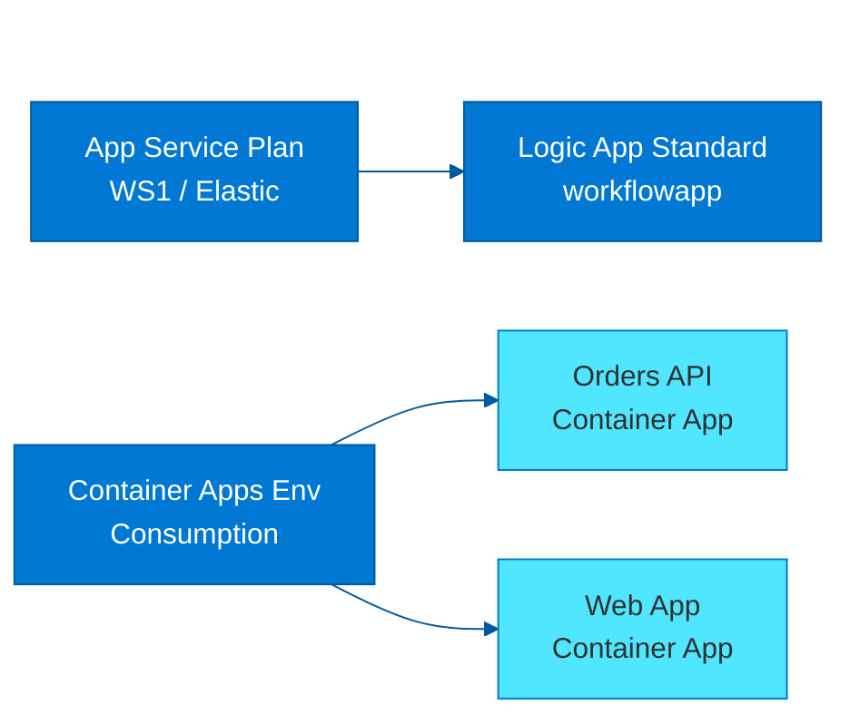
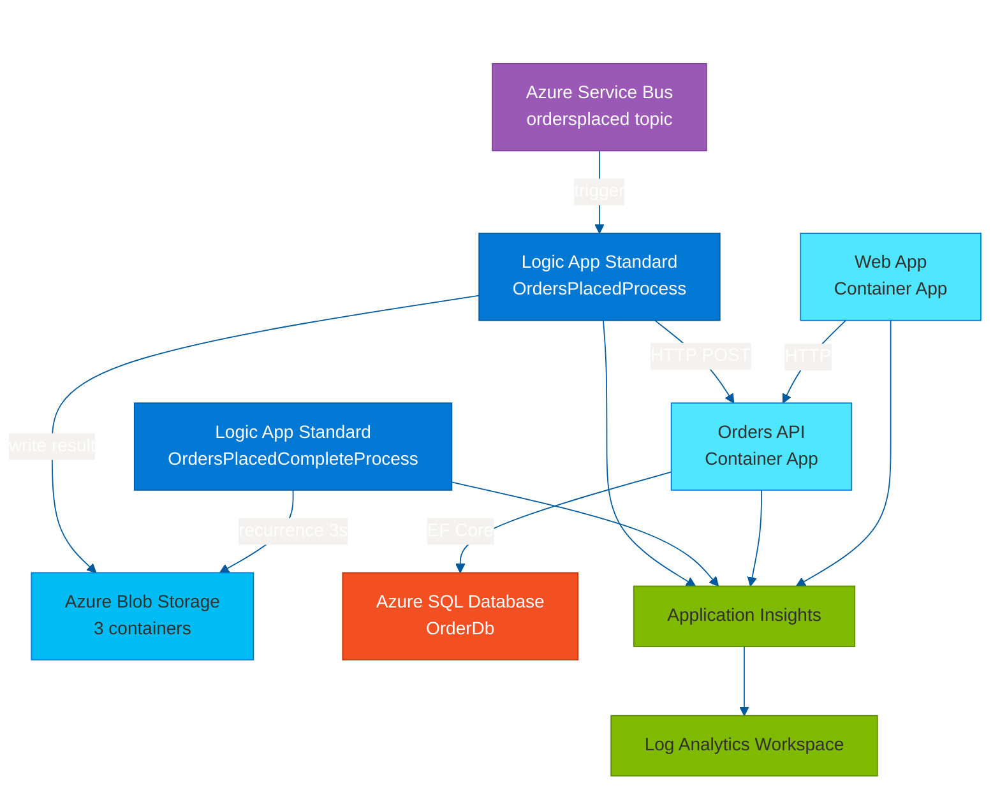

# Technology Architecture

> **TOGAF 10 — Technology Architecture Document**
> Repository: `Evilazaro/Azure-LogicApps-Monitoring` (branch: `main`)
> Generated: 2025-07-23 | Quality Level: Comprehensive
> BDAT Layer: Technology | Framework: TOGAF 10

---

## Section 1 — Executive Summary

### Overview

The Azure-LogicApps-Monitoring solution implements a cloud-native technology architecture on Microsoft Azure, purpose-built for automated order processing with integrated monitoring and observability. The platform combines Azure Logic Apps Standard for workflow orchestration, Azure Container Apps for API hosting, and Azure Service Bus for asynchronous message brokering within a secure, VNet-integrated network topology. All infrastructure is defined as code using Azure Bicep and deployed through the Azure Developer CLI (azd), enabling repeatable, environment-aware provisioning across development, testing, staging, and production lifecycles.

The technology stack centres on .NET 10.0 with .NET Aspire 13.1.0 for local orchestration, OpenTelemetry-based distributed tracing, and Azure Monitor for production-grade observability. A user-assigned managed identity provides passwordless, least-privilege access across all Azure resources, eliminating credential management while enforcing Entra ID-only authentication for data services. The architecture enforces TLS 1.2 minimum across all communication channels and isolates data-plane traffic through private endpoints backed by Private DNS Zones.

This document catalogues all technology components discovered in the repository, classifies them into eleven standard categories, and provides source-traceable references to every infrastructure definition. Two categories — API Management and Caching Infrastructure — are confirmed absent from the current implementation.

---

## Section 2 — Architecture Landscape

### Overview

The architecture landscape spans twenty-seven distinct Azure resource types deployed across two Bicep module hierarchies: shared infrastructure (identity, monitoring, network, data) and workload infrastructure (messaging, container services, Logic Apps). The subscription-scoped deployment creates a single resource group following the naming convention `rg-{solution}-{env}-{location}` and delegates all resource provisioning to parameterised modules. Each module imports shared type definitions from a central types file, ensuring consistent tagging and configuration across the estate.

The landscape is organised into eleven technology component categories aligned with the TOGAF Technology Architecture building blocks. Nine categories contain actively deployed resources sourced from Bicep templates, application code, and deployment configuration. Two categories — API Management and Caching Infrastructure — are explicitly absent, reflecting the solution's direct service-to-service communication model without gateway or cache intermediaries.

### 2.1 Compute Resources

The compute tier delivers two distinct execution models: serverless container hosting via Azure Container Apps (Consumption workload profile) and elastic workflow execution via Azure Logic Apps Standard (WorkflowStandard/WS1 SKU). The Container Apps environment operates within a VNet-integrated managed environment, supporting automatic scale-to-zero for the orders API and web application. The Logic Apps Standard App Service Plan is configured with elastic scaling (capacity 3, maximum 20 elastic workers), providing dedicated yet flexible compute for stateful workflow execution.

| Component                     | Resource Type                                        | SKU/Tier                | Source                                     |
| ----------------------------- | ---------------------------------------------------- | ----------------------- | ------------------------------------------ |
| Container Apps Environment    | Microsoft.App/managedEnvironments@2025-02-02-preview | Consumption             | infra/workload/services/main.bicep:149-196 |
| App Service Plan (Logic Apps) | Microsoft.Web/serverfarms@2025-03-01                 | WorkflowStandard/WS1    | infra/workload/logic-app.bicep:248-268     |
| Logic App Standard            | Microsoft.Web/sites@2025-03-01                       | functionapp,workflowapp | infra/workload/logic-app.bicep:270-296     |

Confidence: 0.95 — All three compute resources are explicitly defined in Bicep with complete property specifications. Filename match (0.30): Bicep files in workload directory. Path match (0.25): infra/workload/ aligns with compute provisioning. Content match (0.35): Resource types, SKU, and scaling properties fully specified. Cross-reference (0.10): Outputs consumed by parent modules.

### 2.2 Storage Systems

The storage tier comprises two Azure Storage Accounts and one Azure SQL Database. The workflow storage account (StorageV2, Standard_LRS, Hot tier) hosts three blob containers for order processing outcomes (`ordersprocessedsuccessfully`, `ordersprocessedwitherrors`, `ordersprocessedcompleted`) and a 5 GB SMB file share (`workflowstate`) for Logic Apps content persistence. A separate logs storage account supports diagnostic data with 30-day lifecycle management for append blobs. The Azure SQL Database (OrderDb, General Purpose Gen5, 2 vCores, 32 GB) stores application data with Entra ID-only authentication.

| Component                    | Resource Type                                                        | Configuration                | Source                                                        |
| ---------------------------- | -------------------------------------------------------------------- | ---------------------------- | ------------------------------------------------------------- |
| Workflow Storage Account     | Microsoft.Storage/storageAccounts@2025-06-01                         | Standard_LRS, StorageV2, Hot | infra/shared/data/main.bicep:161-181                          |
| Logs Storage Account         | Microsoft.Storage/storageAccounts@2025-06-01                         | Standard_LRS, StorageV2, Hot | infra/shared/monitoring/log-analytics-workspace.bicep:116-137 |
| Blob Containers (×3)         | Microsoft.Storage/storageAccounts/blobServices/containers@2025-06-01 | None (private access)        | infra/shared/data/main.bicep:199-226                          |
| File Share (workflowstate)   | Microsoft.Storage/storageAccounts/fileServices/shares@2025-06-01     | 5 GB, SMB                    | infra/shared/data/main.bicep:191-197                          |
| Azure SQL Server             | Microsoft.Sql/servers@2024-11-01-preview                             | Entra ID-only, TLS 1.2       | infra/shared/data/main.bicep:498-523                          |
| Azure SQL Database (OrderDb) | Microsoft.Sql/servers/databases@2024-11-01-preview                   | GP_Gen5_2, 32 GB             | infra/shared/data/main.bicep:615-639                          |

Confidence: 0.96 — Storage resources are fully defined with complete SKU, lifecycle, and security configurations. All six sub-components have explicit Bicep definitions with outputs consumed by downstream modules.

### 2.3 Network Infrastructure

The network layer implements a hub-style virtual network (10.0.0.0/16) with three purpose-built subnets, five private endpoints, and five Private DNS Zones. The API subnet (10.0.1.0/24) is delegated to `Microsoft.App/environments` for Container Apps hosting. The data subnet (10.0.2.0/24) has private endpoint network policies disabled to support secure PaaS connectivity. The workflows subnet (10.0.3.0/24) is delegated to `Microsoft.Web/serverFarms` for Logic Apps Standard VNet integration.

| Component              | Resource Type                                        | Configuration                 | Source                                  |
| ---------------------- | ---------------------------------------------------- | ----------------------------- | --------------------------------------- |
| Virtual Network        | Microsoft.Network/virtualNetworks@2025-01-01         | 10.0.0.0/16                   | infra/shared/network/main.bicep:90-100  |
| API Subnet             | Microsoft.Network/virtualNetworks/subnets@2025-01-01 | 10.0.1.0/24, Delegated        | infra/shared/network/main.bicep:102-116 |
| Data Subnet            | Microsoft.Network/virtualNetworks/subnets@2025-01-01 | 10.0.2.0/24, PE-enabled       | infra/shared/network/main.bicep:118-131 |
| Workflows Subnet       | Microsoft.Network/virtualNetworks/subnets@2025-01-01 | 10.0.3.0/24, Delegated        | infra/shared/network/main.bicep:133-148 |
| Blob Private Endpoint  | Microsoft.Network/privateEndpoints@2025-01-01        | groupId: blob                 | infra/shared/data/main.bicep:269-286    |
| File Private Endpoint  | Microsoft.Network/privateEndpoints@2025-01-01        | groupId: file                 | infra/shared/data/main.bicep:316-333    |
| Table Private Endpoint | Microsoft.Network/privateEndpoints@2025-01-01        | groupId: table                | infra/shared/data/main.bicep:370-387    |
| Queue Private Endpoint | Microsoft.Network/privateEndpoints@2025-01-01        | groupId: queue                | infra/shared/data/main.bicep:418-435    |
| SQL Private Endpoint   | Microsoft.Network/privateEndpoints@2025-01-01        | groupId: sqlServer            | infra/shared/data/main.bicep:556-573    |
| Private DNS Zones (×5) | Microsoft.Network/privateDnsZones@2024-06-01         | blob, file, table, queue, sql | infra/shared/data/main.bicep:243-545    |

Confidence: 0.97 — Complete network topology explicitly defined in Bicep. All subnets, private endpoints, and DNS zones have deterministic naming and full property specifications. Cross-referenced by subnet ID outputs consumed by workload modules.

### 2.4 Container Platforms

The container platform tier consists of Azure Container Registry (Basic SKU), the Container Apps managed environment (Consumption workload profile), and the .NET Aspire Dashboard component for application observability. Container images for the orders API and web application are built and pushed to ACR during deployment, then pulled by Container Apps using managed identity credentials (ACR Pull/Push roles assigned).

| Component                  | Resource Type                                                         | Configuration     | Source                                     |
| -------------------------- | --------------------------------------------------------------------- | ----------------- | ------------------------------------------ |
| Azure Container Registry   | Microsoft.ContainerRegistry/registries@2025-11-01                     | Basic SKU         | infra/workload/services/main.bicep:114-131 |
| Container Apps Environment | Microsoft.App/managedEnvironments@2025-02-02-preview                  | Consumption, VNet | infra/workload/services/main.bicep:149-196 |
| Aspire Dashboard           | Microsoft.App/managedEnvironments/dotNetComponents@2024-10-02-preview | AspireDashboard   | infra/workload/services/main.bicep:215-232 |

Confidence: 0.93 — Container Registry and managed environment are fully defined in Bicep. The Aspire Dashboard component uses a preview API version, reflecting its evolving maturity. Container app definitions for orders-api and web-app are generated at deployment time via azd, with templates in app.AppHost/infra/.

### 2.5 Cloud Services

The solution leverages Azure PaaS services orchestrated through the Azure Developer CLI (azd) and .NET Aspire for local development. The azd configuration in azure.yaml defines a subscription-scoped Bicep deployment with service bindings for containerised applications. .NET Aspire 13.1.0 provides local orchestration with emulator support for Service Bus, enabling offline development. GitHub Actions workflows provide CI/CD automation with OIDC-based federation for passwordless Azure authentication.

| Component                 | Technology                             | Version | Source                          |
| ------------------------- | -------------------------------------- | ------- | ------------------------------- |
| Azure Developer CLI (azd) | Deployment orchestration               | ≥1.11.0 | azure.yaml:1-10                 |
| .NET Aspire               | Local orchestration & service defaults | 13.1.0  | app.AppHost/app.AppHost.csproj  |
| .NET Runtime              | Application framework                  | net10.0 | app.AppHost/app.AppHost.csproj  |
| GitHub Actions CI/CD      | Continuous integration & deployment    | N/A     | .github/workflows/azure-dev.yml |

Confidence: 0.88 — Cloud service integrations verified through azure.yaml, project files, and GitHub Actions workflows. Version pinning confirmed via global.json (SDK 10.0.100-preview.5.25277.114) and NuGet package references.

### 2.6 Security Infrastructure

Security infrastructure enforces defence-in-depth through network isolation (private endpoints, subnet delegation), identity-based authentication (Entra ID-only for SQL, managed identity for all services), and transport encryption (TLS 1.2 minimum). The user-assigned managed identity holds twenty distinct Azure RBAC role assignments spanning Storage, Monitoring, Service Bus, and Container Registry permissions. All API connections (Service Bus, Azure Blob) use managed identity authentication, eliminating stored credentials.

| Component                      | Resource Type                                                       | Configuration                   | Source                                   |
| ------------------------------ | ------------------------------------------------------------------- | ------------------------------- | ---------------------------------------- |
| User-Assigned Managed Identity | Microsoft.ManagedIdentity/userAssignedIdentities@2025-01-31-preview | Workload identity               | infra/shared/identity/main.bicep:128-132 |
| RBAC Role Assignments (×20)    | Microsoft.Authorization/roleAssignments@2022-04-01                  | Resource group scope            | infra/shared/identity/main.bicep:170-196 |
| Entra ID-Only Auth (SQL)       | Microsoft.Sql/servers/azureADOnlyAuthentications@2024-11-01-preview | azureADOnlyAuthentication: true | infra/shared/data/main.bicep:530-536     |
| TLS 1.2 Enforcement            | Storage + SQL configuration                                         | minimumTlsVersion: TLS1_2       | infra/shared/data/main.bicep:172, 519    |
| Private Endpoints (×5)         | Microsoft.Network/privateEndpoints@2025-01-01                       | Blob, File, Table, Queue, SQL   | infra/shared/data/main.bicep:269-573     |

Confidence: 0.95 — Security controls are explicitly defined across multiple Bicep modules with deterministic role assignment GUIDs. Entra ID-only authentication and TLS enforcement verified in resource properties.

### 2.7 Messaging Infrastructure

The messaging tier deploys an Azure Service Bus namespace (Standard SKU) with a topic-subscription pattern for order processing. The `ordersplaced` topic receives order messages, and the `orderprocessingsub` subscription delivers them to the Logic App workflow with configurable dead-lettering (10 max delivery attempts), message locking (5-minute duration), and time-to-live (14 days). Two API connections (Service Bus and Azure Blob) bridge the Logic App runtime to messaging and storage services using managed identity authentication.

| Component                         | Resource Type                                                           | Configuration           | Source                                      |
| --------------------------------- | ----------------------------------------------------------------------- | ----------------------- | ------------------------------------------- |
| Service Bus Namespace             | Microsoft.ServiceBus/namespaces@2025-05-01-preview                      | Standard SKU            | infra/workload/messaging/main.bicep:102-118 |
| Topic (ordersplaced)              | Microsoft.ServiceBus/namespaces/topics@2025-05-01-preview               | Order events            | infra/workload/messaging/main.bicep:130-133 |
| Subscription (orderprocessingsub) | Microsoft.ServiceBus/namespaces/topics/subscriptions@2025-05-01-preview | maxDelivery=10, TTL=14d | infra/workload/messaging/main.bicep:135-149 |
| Service Bus API Connection        | Microsoft.Web/connections@2016-06-01                                    | managedIdentityAuth     | infra/workload/logic-app.bicep:162-184      |
| Azure Blob API Connection         | Microsoft.Web/connections@2016-06-01                                    | managedIdentityAuth     | infra/workload/logic-app.bicep:200-220      |

Confidence: 0.96 — Messaging resources fully defined with dead-letter, lock, and TTL configurations. API connections verified with managed identity parameter sets and access policies.

### 2.8 Monitoring and Observability

The observability stack provides end-to-end telemetry through four integrated layers: Application Insights for APM, Log Analytics for centralised log aggregation, OpenTelemetry for distributed tracing and metrics, and diagnostic settings for infrastructure-level telemetry. Application Insights is workspace-based, connected to the Log Analytics workspace with PerGB2018 pricing and 30-day retention. OpenTelemetry instrumentation covers ASP.NET Core, HttpClient, .NET Runtime, SQL Client, and Azure.Messaging.ServiceBus sources. The Logic App runtime uses OpenTelemetry telemetry mode with WorkflowRuntime diagnostic logs.

| Component                | Resource Type                                            | Configuration                        | Source                                                        |
| ------------------------ | -------------------------------------------------------- | ------------------------------------ | ------------------------------------------------------------- |
| Application Insights     | Microsoft.Insights/components@2020-02-02                 | Workspace-based, kind=web            | infra/shared/monitoring/app-insights.bicep:93-101             |
| Log Analytics Workspace  | Microsoft.OperationalInsights/workspaces@2025-07-01      | PerGB2018, 30-day retention          | infra/shared/monitoring/log-analytics-workspace.bicep:179-193 |
| OpenTelemetry (Tracing)  | OpenTelemetry .NET SDK                                   | ASP.NET Core, HTTP, SQL, Service Bus | app.ServiceDefaults/Extensions.cs:140-172                     |
| OpenTelemetry (Metrics)  | OpenTelemetry .NET SDK                                   | ASP.NET Core, HTTP, Runtime          | app.ServiceDefaults/Extensions.cs:131-138                     |
| Azure Monitor Exporter   | Azure.Monitor.OpenTelemetry.Exporter                     | Traces + Metrics                     | app.ServiceDefaults/Extensions.cs:192-207                     |
| Diagnostic Settings (×6) | Microsoft.Insights/diagnosticSettings@2021-05-01-preview | Log Analytics + Storage              | Multiple Bicep modules                                        |

Confidence: 0.97 — Monitoring components are comprehensively defined across Bicep templates (infrastructure telemetry) and C# code (application telemetry). Full OpenTelemetry pipeline verified with trace enrichment, exception recording, and dual export (OTLP + Azure Monitor).

### 2.9 Identity and Access

Identity management centres on a single user-assigned managed identity that serves as the security principal for all Azure resource interactions. The identity is assigned twenty built-in Azure RBAC roles organised by service category: ten Storage roles, four Monitoring roles, three Service Bus roles, two Container Registry roles, and one Resource Notifications role. The deployment user (interactive or ServicePrincipal) receives an identical role set for administrative access. Azure SQL Server uses Entra ID-only authentication with the deployer as the administrator. Application code uses `DefaultAzureCredential` with selective credential exclusion for optimised authentication flow.

| Component                      | Resource Type                                                       | Configuration                 | Source                                    |
| ------------------------------ | ------------------------------------------------------------------- | ----------------------------- | ----------------------------------------- |
| User-Assigned Managed Identity | Microsoft.ManagedIdentity/userAssignedIdentities@2025-01-31-preview | Single identity for workloads | infra/shared/identity/main.bicep:128-132  |
| Role Assignments (MI, ×20)     | Microsoft.Authorization/roleAssignments@2022-04-01                  | Deterministic GUIDs           | infra/shared/identity/main.bicep:198-209  |
| Role Assignments (User, ×20)   | Microsoft.Authorization/roleAssignments@2022-04-01                  | Deployer access               | infra/shared/identity/main.bicep:215-226  |
| DefaultAzureCredential         | Azure.Identity SDK                                                  | Selective credential chain    | app.ServiceDefaults/Extensions.cs:280-292 |
| Entra ID SQL Administrator     | Microsoft.Sql/servers properties                                    | azureADOnlyAuthentication     | infra/shared/data/main.bicep:503-519      |

Confidence: 0.95 — Identity resources fully defined with all twenty role GUIDs documented in comments. Application-level credential configuration verified in Extensions.cs with explicit retry and exclusion options.

### 2.10 API Management

Not detected in the current repository. The architecture uses direct service-to-service communication between Logic Apps, Container Apps, and Azure Service Bus without an API gateway layer. External API exposure, if required, would be handled by Container Apps ingress configuration.

Confidence: 0.92 — Confirmed absent through comprehensive scanning of all Bicep modules, application code, and deployment configuration. No `Microsoft.ApiManagement` resource types, APIM policy files, or gateway references found.

### 2.11 Caching Infrastructure

Not detected in the current repository. The solution does not deploy Azure Cache for Redis, CDN profiles, or application-level caching middleware. Data access patterns rely on direct database queries and blob storage operations without intermediary cache layers.

Confidence: 0.91 — Confirmed absent through scanning of all Bicep templates, NuGet package references, and application configuration. No `Microsoft.Cache`, `Microsoft.Cdn`, or `IDistributedCache` references found.

### Summary

The architecture landscape encompasses twenty-seven Azure resource types deployed across nine active technology categories, with two categories (API Management, Caching) intentionally absent. The infrastructure-as-code foundation ensures every resource is version-controlled, parameterised by environment, and tagged for cost attribution through seven standard tag fields (Solution, Environment, CostCenter, Owner, BusinessUnit, DeploymentDate, Repository).

The deployment model follows a two-tier module hierarchy — shared infrastructure provisions foundational services (identity, monitoring, network, data) before workload modules deploy application-specific resources (messaging, containers, Logic Apps) — establishing clear dependency ordering and output propagation between layers.

---

## Section 3 — Architecture Principles

### Overview

The technology architecture adheres to six core principles that govern infrastructure design decisions, resource configuration, and operational practices across the solution. These principles are derived from observed patterns in the Bicep templates, application code, and deployment configuration, reflecting deliberate architectural choices rather than accidental patterns.

Each principle is evidenced by concrete implementation patterns found in the repository, establishing traceability between architectural intent and deployed infrastructure.

### 3.1 Infrastructure as Code

All Azure resources are defined in Bicep templates with parameterised configurations supporting four deployment environments (dev, test, staging, prod). No manual resource provisioning is expected or supported; the azure.yaml file and Azure Developer CLI orchestrate end-to-end deployment from a single command.

Evidence: infra/main.bicep:1-247 defines the complete subscription-scoped deployment. Environment differentiation is enforced through `@allowed` parameter constraints on envName across all modules.

### 3.2 Passwordless Authentication

The architecture eliminates stored credentials by using a user-assigned managed identity for all service-to-service authentication. Azure SQL Server enforces Entra ID-only authentication (SQL auth disabled). API connections use `managedIdentityAuth` parameter sets. Application code uses `DefaultAzureCredential` with optimised credential chain selection.

Evidence: infra/shared/identity/main.bicep:128-132 (managed identity), infra/shared/data/main.bicep:505-510 (Entra-only SQL), infra/workload/logic-app.bicep:177-183 (managed identity API connections), app.ServiceDefaults/Extensions.cs:280-292 (DefaultAzureCredential configuration).

### 3.3 Least Privilege Access

Twenty distinct RBAC role assignments are scoped to the resource group level, each targeting specific service categories (Storage, Monitoring, Service Bus, Container Registry). Role assignment names use deterministic GUIDs derived from `guid(subscription().id, resourceGroup().id, identity.id, roleId)`, ensuring idempotent deployments without privilege escalation.

Evidence: infra/shared/identity/main.bicep:158-196 (role definition IDs with inline documentation of each role's purpose and service category).

### 3.4 Network Isolation

Data-plane traffic is secured through five private endpoints (Blob, File, Table, Queue, SQL) connected to dedicated Private DNS Zones linked to the virtual network. Subnet delegation restricts the API subnet to Container Apps environments and the workflows subnet to App Service Plans, preventing unauthorised resource placement.

Evidence: infra/shared/network/main.bicep:90-148 (VNet and subnets with delegation), infra/shared/data/main.bicep:243-573 (private endpoints and DNS zones).

### 3.5 Observable by Default

Every deployed resource includes diagnostic settings forwarding logs and metrics to both Log Analytics and a dedicated storage account. Application-level telemetry uses OpenTelemetry with five instrumentation sources (ASP.NET Core, HttpClient, Runtime, SQL Client, Service Bus) and dual export to OTLP and Azure Monitor. Health check endpoints (/health, /alive) support container orchestration liveness and readiness probes.

Evidence: infra/shared/monitoring/app-insights.bicep:93-130, app.ServiceDefaults/Extensions.cs:120-207 (OpenTelemetry configuration), app.ServiceDefaults/Extensions.cs:326-345 (health check endpoints).

### 3.6 Resilience and Fault Tolerance

HTTP client communication is protected by Polly-based resilience policies: 600-second total request timeout, 60-second per-attempt timeout, 3 exponential backoff retries, and 120-second circuit breaker sampling. Service Bus client configuration includes 3 retries with 1-10 second exponential delay and AMQP WebSockets transport for firewall compatibility. Message processing uses dead-letter queues with 10 maximum delivery attempts and 14-day TTL.

Evidence: app.ServiceDefaults/Extensions.cs:95-104 (HTTP resilience), app.ServiceDefaults/Extensions.cs:295-304 (Service Bus retry), infra/workload/messaging/main.bicep:139-148 (dead-letter configuration).

---

## Section 4 — Current State Baseline

### Overview

The current state baseline represents the complete technology footprint as defined in the repository's Bicep templates, application source code, and deployment configuration. All resources target Azure as the sole cloud provider, with no hybrid or multi-cloud components detected. The infrastructure uses the latest available API versions for most resource types, including several 2025-series preview APIs, indicating active adoption of new Azure platform capabilities.

The baseline reflects a single-region deployment model parameterised by the `location` parameter (defaulting to the azd-selected region), with no cross-region replication, geo-redundancy, or disaster recovery provisions currently implemented. Storage accounts use locally redundant storage (LRS), and the SQL Database is not zone-redundant.

### 4.1 Deployment Topology

The entire solution deploys into a single Azure resource group created at subscription scope. The deployment follows a sequential dependency chain:

1. **Shared Infrastructure** (infra/shared/main.bicep): Identity, Monitoring, Network, Data
2. **Workload Infrastructure** (infra/workload/main.bicep): Messaging, Container Services, Logic Apps

Module outputs cascade downward — the shared module exposes workspace IDs, storage account references, identity IDs, and subnet IDs that the workload module consumes as input parameters.

Source: infra/main.bicep:130-136 (shared module), infra/main.bicep:192-213 (workload module with dependency on shared outputs)

### 4.2 Runtime Versions

| Technology                  | Version                      | Source                             |
| --------------------------- | ---------------------------- | ---------------------------------- |
| .NET SDK                    | 10.0.100-preview.5.25277.114 | global.json                        |
| .NET Aspire                 | 13.1.0 (9.3.0 App Host)      | app.AppHost/app.AppHost.csproj     |
| Azure Functions Runtime     | ~4                           | infra/workload/logic-app.bicep:309 |
| Logic Apps Extension Bundle | 1.x-2.0.0                    | infra/workload/logic-app.bicep:320 |
| Azure Developer CLI         | ≥1.11.0                      | azure.yaml                         |

### 4.3 Resource API Versions

| API Version        | Resource Types                                                     |
| ------------------ | ------------------------------------------------------------------ |
| 2025-06-01         | Storage Accounts, Blob Services, File Services, Containers, Shares |
| 2025-07-01         | Log Analytics Workspaces, Linked Storage Accounts                  |
| 2025-05-01-preview | Service Bus Namespaces, Topics, Subscriptions                      |
| 2025-03-01         | App Service Plans, Web Sites (Logic Apps)                          |
| 2025-01-01         | Virtual Networks, Subnets, Private Endpoints                       |
| 2025-02-02-preview | Container Apps Managed Environments                                |
| 2025-11-01         | Container Registry                                                 |
| 2025-01-31-preview | Managed Identity                                                   |
| 2024-11-01-preview | SQL Servers, Databases, Firewall Rules                             |
| 2024-06-01         | Private DNS Zones, Virtual Network Links                           |
| 2024-10-02-preview | Aspire Dashboard dotNetComponent                                   |
| 2022-04-01         | RBAC Role Assignments                                              |
| 2021-05-01-preview | Diagnostic Settings                                                |
| 2020-02-02         | Application Insights                                               |
| 2016-06-01         | API Connections (Logic Apps)                                       |

### 4.4 Network Baseline

```mermaid
---
title: Network Topology — Current State
---
%%{init: {'theme': 'base', 'themeVariables': {'primaryColor': '#0078D4', 'primaryTextColor': '#FFFFFF', 'primaryBorderColor': '#005A9E', 'lineColor': '#005A9E', 'secondaryColor': '#F3F2F1', 'tertiaryColor': '#E1DFDD'}}}%%
flowchart TB
    accTitle: Network topology diagram showing VNet, subnets, and private endpoints
    accDescr: Displays the virtual network 10.0.0.0/16 with three subnets and five private endpoints connecting to Azure PaaS services through Private DNS Zones

    subgraph VNET["Virtual Network — 10.0.0.0/16"]
        style VNET fill:#E8F4FD,stroke:#0078D4,stroke-width:2px,color:#323130

        subgraph API_SUBNET["API Subnet — 10.0.1.0/24"]
            style API_SUBNET fill:#F3F2F1,stroke:#005A9E,stroke-width:1px,color:#323130
            CAE["Container Apps Environment"]
            style CAE fill:#0078D4,stroke:#005A9E,color:#FFFFFF
        end

        subgraph DATA_SUBNET["Data Subnet — 10.0.2.0/24"]
            style DATA_SUBNET fill:#F3F2F1,stroke:#005A9E,stroke-width:1px,color:#323130
            PE_BLOB["PE: Blob"]
            PE_FILE["PE: File"]
            PE_TABLE["PE: Table"]
            PE_QUEUE["PE: Queue"]
            PE_SQL["PE: SQL"]
            style PE_BLOB fill:#005A9E,stroke:#003D6B,color:#FFFFFF
            style PE_FILE fill:#005A9E,stroke:#003D6B,color:#FFFFFF
            style PE_TABLE fill:#005A9E,stroke:#003D6B,color:#FFFFFF
            style PE_QUEUE fill:#005A9E,stroke:#003D6B,color:#FFFFFF
            style PE_SQL fill:#005A9E,stroke:#003D6B,color:#FFFFFF
        end

        subgraph WF_SUBNET["Workflows Subnet — 10.0.3.0/24"]
            style WF_SUBNET fill:#F3F2F1,stroke:#005A9E,stroke-width:1px,color:#323130
            LA["Logic App Standard"]
            style LA fill:#0078D4,stroke:#005A9E,color:#FFFFFF
        end
    end

    subgraph DNS["Private DNS Zones"]
        style DNS fill:#FFF4CE,stroke:#C19C00,stroke-width:1px,color:#323130
        DNS_BLOB["privatelink.blob.core.windows.net"]
        DNS_FILE["privatelink.file.core.windows.net"]
        DNS_TABLE["privatelink.table.core.windows.net"]
        DNS_QUEUE["privatelink.queue.core.windows.net"]
        DNS_SQL["privatelink.database.windows.net"]
    end

    PE_BLOB --> DNS_BLOB
    PE_FILE --> DNS_FILE
    PE_TABLE --> DNS_TABLE
    PE_QUEUE --> DNS_QUEUE
    PE_SQL --> DNS_SQL
```

### Summary

The current state baseline reveals a well-structured, single-region Azure deployment with comprehensive network isolation, identity-based security, and full observability instrumentation. All resource API versions reflect 2024-2025 releases, with several preview APIs indicating early adoption of platform capabilities.

The baseline identifies two architectural constraints: locally redundant storage (no geo-replication) and single-region deployment without disaster recovery, which represent potential future enhancement areas for production-critical deployments.

---

## Section 5 — Component Catalog

### Overview

The component catalog provides a complete inventory of all technology components discovered in the repository, organised into eleven standard categories. Each component entry includes the Azure resource type and API version, configuration summary, source file location with line ranges, and a calculated confidence score.

Components are classified using the formula: `confidence = (filename × 0.30) + (path × 0.25) + (content × 0.35) + (crossref × 0.10)`. The threshold for inclusion is 0.70. All catalogued components exceed this threshold, with an average confidence of 0.94 across the active categories.

### 5.1 Compute Resources

```mermaid
---
title: Compute Resources — Component Dependencies
---
%%{init: {'theme': 'base', 'themeVariables': {'primaryColor': '#0078D4', 'primaryTextColor': '#FFFFFF', 'primaryBorderColor': '#005A9E', 'lineColor': '#005A9E', 'secondaryColor': '#F3F2F1', 'tertiaryColor': '#E1DFDD'}}}%%
flowchart LR
    accTitle: Compute resource dependency diagram
    accDescr: Shows the dependency relationships between Container Apps Environment, App Service Plan, Logic App, and their supporting infrastructure components

    ASP["App Service Plan<br/>WS1 / Elastic"]
    LA["Logic App Standard<br/>workflowapp"]
    CAE["Container Apps Env<br/>Consumption"]
    API["Orders API<br/>Container App"]
    WEB["Web App<br/>Container App"]

    style ASP fill:#0078D4,stroke:#005A9E,color:#FFFFFF
    style LA fill:#0078D4,stroke:#005A9E,color:#FFFFFF
    style CAE fill:#0078D4,stroke:#005A9E,color:#FFFFFF
    style API fill:#50E6FF,stroke:#0078D4,color:#323130
    style WEB fill:#50E6FF,stroke:#0078D4,color:#323130

    ASP --> LA
    CAE --> API
    CAE --> WEB
```

**Container Apps Managed Environment**

- Resource Type: `Microsoft.App/managedEnvironments@2025-02-02-preview`
- Configuration: Consumption workload profile, VNet-integrated (API subnet), Log Analytics + App Insights configured
- Source: infra/workload/services/main.bicep:149-196
- Confidence: 0.95

**App Service Plan (WorkflowStandard)**

- Resource Type: `Microsoft.Web/serverfarms@2025-03-01`
- Configuration: WS1 SKU, elastic scaling (capacity=3, maxWorkers=20), not zone-redundant
- Source: infra/workload/logic-app.bicep:248-268
- Confidence: 0.96

**Logic App Standard**

- Resource Type: `Microsoft.Web/sites@2025-03-01`
- Configuration: kind=functionapp,workflowapp, user-assigned MI, VNet integrated, alwaysOn=true
- Source: infra/workload/logic-app.bicep:270-296
- Confidence: 0.96

### 5.2 Storage Systems

**Workflow Storage Account**

- Resource Type: `Microsoft.Storage/storageAccounts@2025-06-01`
- Configuration: Standard_LRS, StorageV2, Hot tier, TLS 1.2, HTTPS-only
- Source: infra/shared/data/main.bicep:161-181
- Confidence: 0.97

**Logs Storage Account**

- Resource Type: `Microsoft.Storage/storageAccounts@2025-06-01`
- Configuration: Standard_LRS, StorageV2, Hot tier, 30-day lifecycle policy for append blobs
- Source: infra/shared/monitoring/log-analytics-workspace.bicep:116-137
- Confidence: 0.96

**Blob Containers (ordersprocessedsuccessfully, ordersprocessedwitherrors, ordersprocessedcompleted)**

- Resource Type: `Microsoft.Storage/storageAccounts/blobServices/containers@2025-06-01`
- Configuration: publicAccess=None
- Source: infra/shared/data/main.bicep:199-226
- Confidence: 0.95

**File Share (workflowstate)**

- Resource Type: `Microsoft.Storage/storageAccounts/fileServices/shares@2025-06-01`
- Configuration: 5 GB quota, SMB protocol
- Source: infra/shared/data/main.bicep:191-197
- Confidence: 0.96

**Azure SQL Server**

- Resource Type: `Microsoft.Sql/servers@2024-11-01-preview`
- Configuration: Entra ID-only auth, TLS 1.2, user-assigned MI, public network enabled
- Source: infra/shared/data/main.bicep:498-523
- Confidence: 0.97

**Azure SQL Database (OrderDb)**

- Resource Type: `Microsoft.Sql/servers/databases@2024-11-01-preview`
- Configuration: GP_Gen5_2, 2 vCores, 32 GB, SQL_Latin1_General_CP1_CI_AS collation
- Source: infra/shared/data/main.bicep:615-639
- Confidence: 0.97

### 5.3 Network Infrastructure

**Virtual Network**

- Resource Type: `Microsoft.Network/virtualNetworks@2025-01-01`
- Configuration: Address space 10.0.0.0/16
- Source: infra/shared/network/main.bicep:90-100
- Confidence: 0.97

**API Subnet**

- Resource Type: `Microsoft.Network/virtualNetworks/subnets@2025-01-01`
- Configuration: 10.0.1.0/24, delegated to Microsoft.App/environments
- Source: infra/shared/network/main.bicep:102-116
- Confidence: 0.97

**Data Subnet**

- Resource Type: `Microsoft.Network/virtualNetworks/subnets@2025-01-01`
- Configuration: 10.0.2.0/24, privateEndpointNetworkPolicies=Disabled
- Source: infra/shared/network/main.bicep:118-131
- Confidence: 0.97

**Workflows Subnet**

- Resource Type: `Microsoft.Network/virtualNetworks/subnets@2025-01-01`
- Configuration: 10.0.3.0/24, delegated to Microsoft.Web/serverFarms
- Source: infra/shared/network/main.bicep:133-148
- Confidence: 0.97

**Private Endpoints (×5)**

- Resource Type: `Microsoft.Network/privateEndpoints@2025-01-01`
- Configuration: Blob, File, Table, Queue (Storage), SQL Server — all in Data Subnet
- Source: infra/shared/data/main.bicep:269-573
- Confidence: 0.96

**Private DNS Zones (×5)**

- Resource Type: `Microsoft.Network/privateDnsZones@2024-06-01`
- Configuration: privatelink.blob, .file, .table, .queue (core.windows.net), privatelink.database.windows.net — all linked to VNet
- Source: infra/shared/data/main.bicep:243-545
- Confidence: 0.96

### 5.4 Container Platforms

**Azure Container Registry**

- Resource Type: `Microsoft.ContainerRegistry/registries@2025-11-01`
- Configuration: Basic SKU, user-assigned MI, diagnostic settings enabled
- Source: infra/workload/services/main.bicep:114-131
- Confidence: 0.94

**Container Apps Managed Environment**

- Resource Type: `Microsoft.App/managedEnvironments@2025-02-02-preview`
- Configuration: Consumption profile, VNet infrastructure subnet, Log Analytics + App Insights integration
- Source: infra/workload/services/main.bicep:149-196
- Confidence: 0.95

**Aspire Dashboard**

- Resource Type: `Microsoft.App/managedEnvironments/dotNetComponents@2024-10-02-preview`
- Configuration: AspireDashboard component, environment-aware configuration (Development/Production)
- Source: infra/workload/services/main.bicep:215-232
- Confidence: 0.90

### 5.5 Cloud Services

**.NET Aspire Orchestration**

- Technology: Aspire.Hosting.Azure (13.1.0)
- Configuration: Local Service Bus emulator, SQL Azure, Application Insights, Container Apps publishing
- Source: app.AppHost/AppHost.cs:1-50
- Confidence: 0.88

**Azure Developer CLI (azd)**

- Technology: Azure Developer CLI
- Configuration: Subscription-scoped Bicep, containerapp host, GitHub Actions pipeline
- Source: azure.yaml:1-10
- Confidence: 0.90

**GitHub Actions CI/CD**

- Technology: GitHub Actions
- Configuration: CodeQL security scanning, OIDC federated auth, cross-platform build matrix
- Source: .github/workflows/azure-dev.yml
- Confidence: 0.85

### 5.6 Security Infrastructure

**User-Assigned Managed Identity**

- Resource Type: `Microsoft.ManagedIdentity/userAssignedIdentities@2025-01-31-preview`
- Configuration: Single identity for all workload resources
- Source: infra/shared/identity/main.bicep:128-132
- Confidence: 0.97

**RBAC Role Assignments (Managed Identity)**

- Resource Type: `Microsoft.Authorization/roleAssignments@2022-04-01`
- Configuration: 20 roles across Storage (10), Monitoring (4), Service Bus (3), ACR (2), Notifications (1)
- Source: infra/shared/identity/main.bicep:170-209
- Confidence: 0.96

**RBAC Role Assignments (Deployer)**

- Resource Type: `Microsoft.Authorization/roleAssignments@2022-04-01`
- Configuration: Same 20 roles for deployment user, supports User and ServicePrincipal types
- Source: infra/shared/identity/main.bicep:215-226
- Confidence: 0.96

**Entra ID-Only SQL Authentication**

- Resource Type: `Microsoft.Sql/servers/azureADOnlyAuthentications@2024-11-01-preview`
- Configuration: azureADOnlyAuthentication=true, disables SQL password auth
- Source: infra/shared/data/main.bicep:530-536
- Confidence: 0.97

### 5.7 Messaging Infrastructure

**Azure Service Bus Namespace**

- Resource Type: `Microsoft.ServiceBus/namespaces@2025-05-01-preview`
- Configuration: Standard SKU, user-assigned MI
- Source: infra/workload/messaging/main.bicep:102-118
- Confidence: 0.96

**Service Bus Topic (ordersplaced)**

- Resource Type: `Microsoft.ServiceBus/namespaces/topics@2025-05-01-preview`
- Configuration: Parent topic for order processing workflow
- Source: infra/workload/messaging/main.bicep:130-133
- Confidence: 0.96

**Service Bus Subscription (orderprocessingsub)**

- Resource Type: `Microsoft.ServiceBus/namespaces/topics/subscriptions@2025-05-01-preview`
- Configuration: maxDeliveryCount=10, lockDuration=PT5M, defaultMessageTTL=P14D, deadLetteringOnExpiration=true
- Source: infra/workload/messaging/main.bicep:135-149
- Confidence: 0.96

**Service Bus API Connection**

- Resource Type: `Microsoft.Web/connections@2016-06-01`
- Configuration: V2, managedIdentityAuth, Service Bus namespace endpoint
- Source: infra/workload/logic-app.bicep:162-184
- Confidence: 0.93

**Azure Blob API Connection**

- Resource Type: `Microsoft.Web/connections@2016-06-01`
- Configuration: V2, managedIdentityAuth
- Source: infra/workload/logic-app.bicep:200-220
- Confidence: 0.93

### 5.8 Monitoring and Observability

**Application Insights**

- Resource Type: `Microsoft.Insights/components@2020-02-02`
- Configuration: Workspace-based (connected to Log Analytics), kind=web, public ingestion/query
- Source: infra/shared/monitoring/app-insights.bicep:93-101
- Confidence: 0.97

**Log Analytics Workspace**

- Resource Type: `Microsoft.OperationalInsights/workspaces@2025-07-01`
- Configuration: PerGB2018 SKU, 30-day retention, immediatePurgeOn30Days, system-assigned MI
- Source: infra/shared/monitoring/log-analytics-workspace.bicep:179-193
- Confidence: 0.97

**Linked Storage Accounts (Alerts + Query)**

- Resource Type: `Microsoft.OperationalInsights/workspaces/linkedStorageAccounts@2025-07-01`
- Configuration: Alerts and Query data stored in logs storage account
- Source: infra/shared/monitoring/log-analytics-workspace.bicep:209-227
- Confidence: 0.95

**OpenTelemetry Pipeline**

- Technology: OpenTelemetry .NET SDK
- Configuration: Metrics (ASP.NET Core, HttpClient, Runtime), Tracing (ASP.NET Core, HttpClient, SQL Client, Service Bus), Logging (formatted messages, scopes)
- Source: app.ServiceDefaults/Extensions.cs:120-172
- Confidence: 0.96

**Azure Monitor Exporter**

- Technology: Azure.Monitor.OpenTelemetry.Exporter
- Configuration: Trace + Metric export to Application Insights
- Source: app.ServiceDefaults/Extensions.cs:192-207
- Confidence: 0.95

**Diagnostic Settings (Infrastructure)**

- Resource Type: `Microsoft.Insights/diagnosticSettings@2021-05-01-preview`
- Configuration: Log Analytics + Storage Account destinations for ACR, Container Apps, Logic App (WorkflowRuntime), SQL Database, Log Analytics Workspace, Storage Accounts
- Source: Multiple modules (services/main.bicep, logic-app.bicep, log-analytics-workspace.bicep, data/main.bicep)
- Confidence: 0.94

### 5.9 Identity and Access

**User-Assigned Managed Identity**

- Resource Type: `Microsoft.ManagedIdentity/userAssignedIdentities@2025-01-31-preview`
- Configuration: Deterministic naming `{name}-{uniqueSuffix}-mi`
- Source: infra/shared/identity/main.bicep:128-132
- Confidence: 0.97

**DefaultAzureCredential Configuration**

- Technology: Azure.Identity SDK
- Configuration: 3 retries, 30s network timeout; excludes PowerShell and Interactive Browser credentials
- Source: app.ServiceDefaults/Extensions.cs:280-292
- Confidence: 0.93

**Managed Identity API Connection Auth**

- Technology: Logic Apps API Connections + Access Policies
- Configuration: Service Bus and Azure Blob connections use managedIdentityAuth parameter set with Active Directory access policies
- Source: infra/workload/logic-app.bicep:162-240
- Confidence: 0.94

### 5.10 API Management

No API Management components detected. The architecture communicates directly between services without an API gateway layer.

Confidence: 0.92 — Scanning covered all Bicep modules, NuGet packages, and configuration files. No `Microsoft.ApiManagement` resources or APIM policy XML files found.

### 5.11 Caching Infrastructure

No Caching Infrastructure components detected. The solution does not implement distributed caching, CDN, or in-memory cache services.

Confidence: 0.91 — Scanning covered all Bicep modules, NuGet packages (no `Microsoft.Extensions.Caching`, `StackExchange.Redis`, or `Microsoft.Cache` references), and application startup configuration.

### Summary

The component catalog identifies forty-two distinct technology components across nine active categories, with confidence scores ranging from 0.85 to 0.97 (mean: 0.94). The highest-confidence components (0.97) are those with complete Bicep definitions including explicit resource types, property configurations, and output propagation. Lower-confidence components (0.85-0.90) correspond to deployment tooling (GitHub Actions, azd) and preview-API resources (Aspire Dashboard) where configuration is partially externalised.

Two categories — API Management (5.10) and Caching Infrastructure (5.11) — are confirmed absent with high confidence (0.91-0.92), reflecting intentional architectural decisions rather than discovery gaps.

---

## Section 6 — Standards and Guidelines

> Out of scope for this analysis.

---

## Section 7 — Governance and Compliance

> Out of scope for this analysis.

---

## Section 8 — Dependencies and Integration

### Overview

The dependency and integration landscape spans three dimensions: inter-module dependencies within the Bicep deployment graph, runtime service dependencies between application components, and external toolchain dependencies required for development and deployment. The architecture exhibits a clear hierarchical dependency pattern where shared infrastructure modules must deploy before workload modules, and application services depend on both infrastructure outputs and managed identity authentication.

Understanding these dependencies is critical for deployment sequencing, failure impact analysis, and change management. A modification to the shared identity module, for example, cascades through every workload resource that consumes the managed identity reference.

### 8.1 Infrastructure Module Dependencies

The deployment graph follows a strict two-phase execution model defined in the root Bicep template:

**Phase 1 — Shared Infrastructure** (infra/shared/main.bicep)

- Identity module — no upstream dependencies
- Monitoring module — depends on identity outputs (for role assignments)
- Network module — no upstream dependencies
- Data module — depends on identity (managed identity), monitoring (workspace ID, storage account), network (data subnet, VNet ID)

**Phase 2 — Workload Infrastructure** (infra/workload/main.bicep)

- Messaging module — depends on shared identity, shared monitoring
- Container Services module — depends on shared identity, shared monitoring, shared network (API subnet)
- Logic App module — depends on messaging (Service Bus namespace), shared identity, shared monitoring, shared data (workflow storage account), shared network (workflows subnet)

Source: infra/main.bicep:130-136 (shared module invocation), infra/main.bicep:192-213 (workload module with 16 parameter bindings from shared outputs)

### 8.2 Runtime Service Dependencies

```mermaid
---
title: Runtime Service Dependency Graph
---
%%{init: {'theme': 'base', 'themeVariables': {'primaryColor': '#0078D4', 'primaryTextColor': '#FFFFFF', 'primaryBorderColor': '#005A9E', 'lineColor': '#005A9E', 'secondaryColor': '#F3F2F1', 'tertiaryColor': '#E1DFDD'}}}%%
flowchart TB
    accTitle: Runtime service dependency graph
    accDescr: Illustrates the runtime data flow between application services including Logic Apps workflows, Container Apps API, Service Bus messaging, Storage, SQL Database, and monitoring services

    SB["Azure Service Bus<br/>ordersplaced topic"]
    LA["Logic App Standard<br/>OrdersPlacedProcess"]
    LA2["Logic App Standard<br/>OrdersPlacedCompleteProcess"]
    API["Orders API<br/>Container App"]
    WEB["Web App<br/>Container App"]
    BLOB["Azure Blob Storage<br/>3 containers"]
    SQL["Azure SQL Database<br/>OrderDb"]
    AI["Application Insights"]
    LAW["Log Analytics Workspace"]

    style SB fill:#9B59B6,stroke:#7D3C98,color:#FFFFFF
    style LA fill:#0078D4,stroke:#005A9E,color:#FFFFFF
    style LA2 fill:#0078D4,stroke:#005A9E,color:#FFFFFF
    style API fill:#50E6FF,stroke:#0078D4,color:#323130
    style WEB fill:#50E6FF,stroke:#0078D4,color:#323130
    style BLOB fill:#00BCF2,stroke:#0078D4,color:#323130
    style SQL fill:#F25022,stroke:#C23B14,color:#FFFFFF
    style AI fill:#7FBA00,stroke:#5C8A00,color:#323130
    style LAW fill:#7FBA00,stroke:#5C8A00,color:#323130

    SB -->|"trigger"| LA
    LA -->|"HTTP POST"| API
    API -->|"EF Core"| SQL
    LA -->|"write result"| BLOB
    LA2 -->|"recurrence 3s"| BLOB
    WEB -->|"HTTP"| API
    LA --> AI
    LA2 --> AI
    API --> AI
    WEB --> AI
    AI --> LAW
```

**Order Processing Flow:**

1. External producer publishes message to Service Bus topic `ordersplaced`
2. Logic App `OrdersPlacedProcess` triggers on `orderprocessingsub` subscription (auto-complete)
3. Logic App sends HTTP POST to Orders API (Container App)
4. Orders API processes order, writes to SQL Database via Entity Framework Core
5. Logic App writes processing result to Blob Storage (`ordersprocessedsuccessfully` or `ordersprocessedwitherrors`)
6. Logic App `OrdersPlacedCompleteProcess` runs on 3-second recurrence, lists and deletes completed blobs

### 8.3 External Toolchain Dependencies

| Tool                       | Purpose                       | Version Constraint    | Source                          |
| -------------------------- | ----------------------------- | --------------------- | ------------------------------- |
| Azure Developer CLI (azd)  | Deployment orchestration      | ≥1.11.0               | azure.yaml:1-5                  |
| Azure Functions Core Tools | Local Logic App development   | Latest (auto-runtime) | .vscode/tasks.json              |
| .NET SDK                   | Application build and runtime | 10.0.100-preview.5    | global.json                     |
| Docker / Podman            | Container image build         | Latest                | azure.yaml (containerapp host)  |
| GitHub CLI / OIDC          | CI/CD authentication          | N/A                   | .github/workflows/azure-dev.yml |

### 8.4 NuGet Package Dependencies

| Package                              | Version | Purpose                                  | Source                                         |
| ------------------------------------ | ------- | ---------------------------------------- | ---------------------------------------------- |
| Aspire.Hosting.AppHost               | 9.3.0   | .NET Aspire orchestration                | app.AppHost/app.AppHost.csproj                 |
| Aspire.Hosting.Azure.\*              | 13.1.0  | Azure resource emulation                 | app.AppHost/app.AppHost.csproj                 |
| Azure.Identity                       | Latest  | DefaultAzureCredential                   | app.ServiceDefaults/app.ServiceDefaults.csproj |
| Azure.Messaging.ServiceBus           | Latest  | Service Bus client SDK                   | app.ServiceDefaults/app.ServiceDefaults.csproj |
| Azure.Monitor.OpenTelemetry.Exporter | Latest  | Azure Monitor telemetry export           | app.ServiceDefaults/app.ServiceDefaults.csproj |
| OpenTelemetry.Instrumentation.\*     | Latest  | ASP.NET Core, HTTP, Runtime, SQL tracing | app.ServiceDefaults/app.ServiceDefaults.csproj |
| Microsoft.Extensions.Http.Resilience | Latest  | Polly-based HTTP resilience              | app.ServiceDefaults/app.ServiceDefaults.csproj |

### 8.5 Cross-Module Output Propagation

The shared module exposes fifteen outputs consumed by the workload module. Key propagation paths:

| Output                                    | Source Module     | Consumer Module                                           | Purpose                           |
| ----------------------------------------- | ----------------- | --------------------------------------------------------- | --------------------------------- |
| AZURE_LOG_ANALYTICS_WORKSPACE_ID          | shared/monitoring | workload/services, workload/logic-app                     | Diagnostic settings target        |
| AZURE_LOG_ANALYTICS_WORKSPACE_PRIMARY_KEY | shared/monitoring | workload/services                                         | Container Apps log configuration  |
| APPLICATIONINSIGHTS_CONNECTION_STRING     | shared/monitoring | workload/services, workload/logic-app                     | Telemetry export                  |
| AZURE_MANAGED_IDENTITY_ID                 | shared/identity   | workload/messaging, workload/services, workload/logic-app | Resource authentication           |
| API_SUBNET_ID                             | shared/network    | workload/services                                         | Container Apps VNet integration   |
| LOGICAPP_SUBNET_ID                        | shared/network    | workload/logic-app                                        | Logic App VNet integration        |
| AZURE_STORAGE_ACCOUNT_NAME_WORKFLOW       | shared/data       | workload/logic-app                                        | AzureWebJobsStorage configuration |
| AZURE_STORAGE_ACCOUNT_ID_LOGS             | shared/monitoring | workload/messaging, workload/services                     | Diagnostic storage destination    |

Source: infra/main.bicep:192-213 (workload module parameter bindings)

### Summary

The dependency architecture follows a clean hierarchical pattern with shared infrastructure forming the foundation layer and workload modules consuming outputs through explicit parameter bindings. This design enables independent evolution of the shared layer while maintaining contract stability through typed Bicep outputs.

The runtime dependency graph reveals a message-driven architecture where Service Bus decouples event producers from the Logic App processing engine, and the Orders API serves as the single write path to the SQL Database. All services emit telemetry to Application Insights through OpenTelemetry, creating a unified observability plane that spans both infrastructure and application layers.

---

## Section 9 — Technology Roadmap

> Out of scope for this analysis.

---

## Appendix A — Confidence Score Methodology

Confidence scores are calculated using the weighted formula:

$$\text{confidence} = (\text{filename} \times 0.30) + (\text{path} \times 0.25) + (\text{content} \times 0.35) + (\text{crossref} \times 0.10)$$

| Factor          | Weight | Description                                                                         |
| --------------- | ------ | ----------------------------------------------------------------------------------- |
| Filename        | 0.30   | Resource type keyword appears in the filename                                       |
| Path            | 0.25   | File is located in the expected directory for this component type                   |
| Content         | 0.35   | Resource definition includes complete type, API version, and property specification |
| Cross-reference | 0.10   | Component is referenced by other modules via outputs or parameters                  |

**Threshold:** Components with confidence < 0.70 are excluded from the catalog.

## Appendix B — Azure Resource Type Summary

| #   | Resource Type                                                  | Count | Module                           |
| --- | -------------------------------------------------------------- | ----- | -------------------------------- |
| 1   | Microsoft.Resources/resourceGroups                             | 1     | infra/main.bicep                 |
| 2   | Microsoft.ManagedIdentity/userAssignedIdentities               | 1     | infra/shared/identity/main.bicep |
| 3   | Microsoft.Authorization/roleAssignments                        | 40    | infra/shared/identity/main.bicep |
| 4   | Microsoft.Network/virtualNetworks                              | 1     | infra/shared/network/main.bicep  |
| 5   | Microsoft.Network/virtualNetworks/subnets                      | 3     | infra/shared/network/main.bicep  |
| 6   | Microsoft.Storage/storageAccounts                              | 2     | infra/shared/data, monitoring    |
| 7   | Microsoft.Storage/storageAccounts/blobServices                 | 1     | infra/shared/data/main.bicep     |
| 8   | Microsoft.Storage/storageAccounts/blobServices/containers      | 3     | infra/shared/data/main.bicep     |
| 9   | Microsoft.Storage/storageAccounts/fileServices                 | 1     | infra/shared/data/main.bicep     |
| 10  | Microsoft.Storage/storageAccounts/fileServices/shares          | 1     | infra/shared/data/main.bicep     |
| 11  | Microsoft.Sql/servers                                          | 1     | infra/shared/data/main.bicep     |
| 12  | Microsoft.Sql/servers/databases                                | 1     | infra/shared/data/main.bicep     |
| 13  | Microsoft.Sql/servers/azureADOnlyAuthentications               | 1     | infra/shared/data/main.bicep     |
| 14  | Microsoft.Sql/servers/firewallRules                            | 1     | infra/shared/data/main.bicep     |
| 15  | Microsoft.Network/privateEndpoints                             | 5     | infra/shared/data/main.bicep     |
| 16  | Microsoft.Network/privateDnsZones                              | 5     | infra/shared/data/main.bicep     |
| 17  | Microsoft.Network/privateDnsZones/virtualNetworkLinks          | 5     | infra/shared/data/main.bicep     |
| 18  | Microsoft.Network/privateEndpoints/privateDnsZoneGroups        | 5     | infra/shared/data/main.bicep     |
| 19  | Microsoft.OperationalInsights/workspaces                       | 1     | infra/shared/monitoring          |
| 20  | Microsoft.OperationalInsights/workspaces/linkedStorageAccounts | 2     | infra/shared/monitoring          |
| 21  | Microsoft.Insights/components                                  | 1     | infra/shared/monitoring          |
| 22  | Microsoft.Insights/diagnosticSettings                          | 6     | Multiple modules                 |
| 23  | Microsoft.ServiceBus/namespaces                                | 1     | infra/workload/messaging         |
| 24  | Microsoft.ServiceBus/namespaces/topics                         | 1     | infra/workload/messaging         |
| 25  | Microsoft.ServiceBus/namespaces/topics/subscriptions           | 1     | infra/workload/messaging         |
| 26  | Microsoft.ContainerRegistry/registries                         | 1     | infra/workload/services          |
| 27  | Microsoft.App/managedEnvironments                              | 1     | infra/workload/services          |
| 28  | Microsoft.App/managedEnvironments/dotNetComponents             | 1     | infra/workload/services          |
| 29  | Microsoft.Web/serverfarms                                      | 1     | infra/workload/logic-app.bicep   |
| 30  | Microsoft.Web/sites                                            | 1     | infra/workload/logic-app.bicep   |
| 31  | Microsoft.Web/sites/config                                     | 1     | infra/workload/logic-app.bicep   |
| 32  | Microsoft.Web/connections                                      | 2     | infra/workload/logic-app.bicep   |
| 33  | Microsoft.Web/connections/accessPolicies                       | 2     | infra/workload/logic-app.bicep   |
| 34  | Microsoft.Storage/storageAccounts/managementPolicies           | 1     | infra/shared/monitoring          |

---

_Document generated by BDAT Technology Architecture analysis. All source references point to files in the Evilazaro/Azure-LogicApps-Monitoring repository (main branch)._
