# Technology Architecture Document

> **TOGAF Technology Layer** | Azure Logic Apps Monitoring Solution  
> **Version**: 1.0.0 | **Generated**: 2026-01-29  
> **Repository**: [Evilazaro/Azure-LogicApps-Monitoring](https://github.com/Evilazaro/Azure-LogicApps-Monitoring)

---

## Table of Contents

- [1. Executive Summary](#1-executive-summary)
- [2. Technology Inventory](#2-technology-inventory)
  - [2.1 Programming Languages & Runtimes](#21-programming-languages--runtimes)
  - [2.2 Frameworks & Libraries](#22-frameworks--libraries)
  - [2.3 Infrastructure & Platform Services](#23-infrastructure--platform-services)
  - [2.4 Data Storage Technologies](#24-data-storage-technologies)
  - [2.5 Messaging & Integration Services](#25-messaging--integration-services)
  - [2.6 DevOps & CI/CD Pipeline](#26-devops--cicd-pipeline)
  - [2.7 Monitoring & Observability](#27-monitoring--observability)
  - [2.8 Security & Authentication](#28-security--authentication)
  - [2.9 Networking Infrastructure](#29-networking-infrastructure)
- [3. Technology Standards](#3-technology-standards)
- [4. Dependencies Graph](#4-dependencies-graph)
- [Appendix A: Source File References](#appendix-a-source-file-references)

---

## 1. Executive Summary

### Overview

The Azure Logic Apps Monitoring Solution implements a **cloud-native distributed architecture** using modern Microsoft Azure services and .NET technologies. The solution leverages **.NET Aspire 13.1.0** for service orchestration, enabling a unified development experience with built-in observability and containerization support.

### Key Technology Decisions

| Decision Area      | Technology Choice                    | Rationale                                    |
| ------------------ | ------------------------------------ | -------------------------------------------- |
| **Runtime**        | .NET 10.0                            | Latest LTS with performance improvements     |
| **Orchestration**  | .NET Aspire 13.1.0                   | Unified local dev + cloud deployment         |
| **Frontend**       | Blazor Server + Fluent UI            | Interactive SPA with Microsoft design system |
| **Backend**        | ASP.NET Core Web API                 | RESTful services with OpenAPI support        |
| **Workflows**      | Azure Logic Apps Standard            | Serverless event-driven processing           |
| **Container Host** | Azure Container Apps                 | Managed Kubernetes without complexity        |
| **IaC**            | Bicep                                | Native Azure, type-safe deployments          |
| **CI/CD**          | GitHub Actions + Azure Developer CLI | GitOps with OIDC authentication              |

### Technology Distribution


---

## 2. Technology Inventory

### 2.1 Programming Languages & Runtimes

| Technology       | Version  | Source File                                                                   | Purpose                                 |
| ---------------- | -------- | ----------------------------------------------------------------------------- | --------------------------------------- |
| **C#**           | Latest   | [global.json](../../global.json)                                              | Primary programming language            |
| **.NET SDK**     | 10.0.100 | [global.json](../../global.json)                                              | Application runtime and build toolchain |
| **ASP.NET Core** | 10.0     | [eShop.Orders.API.csproj](../../src/eShop.Orders.API/eShop.Orders.API.csproj) | Web framework reference                 |

**Configuration Details** (from `global.json`):

```json
{
  "sdk": {
    "version": "10.0.100",
    "rollForward": "latestFeature",
    "allowPrerelease": false
  }
}
```

---

### 2.2 Frameworks & Libraries

#### Application Frameworks

| Name                                         | Version | Type                 | Source                                                               |
| -------------------------------------------- | ------- | -------------------- | -------------------------------------------------------------------- |
| **.NET Aspire SDK**                          | 13.1.0  | Orchestration        | [app.AppHost.csproj](../../app.AppHost/app.AppHost.csproj)           |
| **Aspire.Hosting.AppHost**                   | 13.1.0  | Host Framework       | [app.AppHost.csproj](../../app.AppHost/app.AppHost.csproj)           |
| **Blazor Server**                            | 10.0    | Frontend Framework   | [eShop.Web.App.csproj](../../src/eShop.Web.App/eShop.Web.App.csproj) |
| **Microsoft.FluentUI.AspNetCore.Components** | 4.13.2  | UI Component Library | [eShop.Web.App.csproj](../../src/eShop.Web.App/eShop.Web.App.csproj) |

#### Azure Integration Libraries

| Name                                         | Version | Type                   | Source                                                                             |
| -------------------------------------------- | ------- | ---------------------- | ---------------------------------------------------------------------------------- |
| **Aspire.Hosting.Azure.ApplicationInsights** | 13.1.0  | Monitoring Integration | [app.AppHost.csproj](../../app.AppHost/app.AppHost.csproj)                         |
| **Aspire.Hosting.Azure.ServiceBus**          | 13.1.0  | Messaging Integration  | [app.AppHost.csproj](../../app.AppHost/app.AppHost.csproj)                         |
| **Aspire.Hosting.Azure.Sql**                 | 13.1.0  | Database Integration   | [app.AppHost.csproj](../../app.AppHost/app.AppHost.csproj)                         |
| **Aspire.Hosting.Azure.Storage**             | 13.1.0  | Storage Integration    | [app.AppHost.csproj](../../app.AppHost/app.AppHost.csproj)                         |
| **Azure.Identity**                           | 1.17.1  | Authentication         | [app.ServiceDefaults.csproj](../../app.ServiceDefaults/app.ServiceDefaults.csproj) |
| **Azure.Messaging.ServiceBus**               | 7.20.1  | Service Bus Client     | [app.ServiceDefaults.csproj](../../app.ServiceDefaults/app.ServiceDefaults.csproj) |

#### Data Access & API

| Name                                        | Version | Type              | Source                                                                        |
| ------------------------------------------- | ------- | ----------------- | ----------------------------------------------------------------------------- |
| **Microsoft.EntityFrameworkCore.SqlServer** | 10.0.2  | ORM               | [eShop.Orders.API.csproj](../../src/eShop.Orders.API/eShop.Orders.API.csproj) |
| **Microsoft.AspNetCore.OpenApi**            | 10.0.2  | API Documentation | [eShop.Orders.API.csproj](../../src/eShop.Orders.API/eShop.Orders.API.csproj) |
| **Swashbuckle.AspNetCore.Swagger**          | 10.1.0  | Swagger Core      | [eShop.Orders.API.csproj](../../src/eShop.Orders.API/eShop.Orders.API.csproj) |
| **Swashbuckle.AspNetCore.SwaggerGen**       | 10.1.0  | Swagger Generator | [eShop.Orders.API.csproj](../../src/eShop.Orders.API/eShop.Orders.API.csproj) |
| **Swashbuckle.AspNetCore.SwaggerUI**        | 10.1.0  | Swagger UI        | [eShop.Orders.API.csproj](../../src/eShop.Orders.API/eShop.Orders.API.csproj) |

#### Observability Libraries

| Name                                             | Version     | Type                    | Source                                                                             |
| ------------------------------------------------ | ----------- | ----------------------- | ---------------------------------------------------------------------------------- |
| **Azure.Monitor.OpenTelemetry.Exporter**         | 1.5.0       | Telemetry Export        | [app.ServiceDefaults.csproj](../../app.ServiceDefaults/app.ServiceDefaults.csproj) |
| **OpenTelemetry.Exporter.OpenTelemetryProtocol** | 1.15.0      | OTLP Exporter           | [app.ServiceDefaults.csproj](../../app.ServiceDefaults/app.ServiceDefaults.csproj) |
| **OpenTelemetry.Extensions.Hosting**             | 1.15.0      | Host Integration        | [app.ServiceDefaults.csproj](../../app.ServiceDefaults/app.ServiceDefaults.csproj) |
| **OpenTelemetry.Instrumentation.AspNetCore**     | 1.15.0      | ASP.NET Instrumentation | [app.ServiceDefaults.csproj](../../app.ServiceDefaults/app.ServiceDefaults.csproj) |
| **OpenTelemetry.Instrumentation.Http**           | 1.15.0      | HTTP Instrumentation    | [app.ServiceDefaults.csproj](../../app.ServiceDefaults/app.ServiceDefaults.csproj) |
| **OpenTelemetry.Instrumentation.Runtime**        | 1.15.0      | Runtime Metrics         | [app.ServiceDefaults.csproj](../../app.ServiceDefaults/app.ServiceDefaults.csproj) |
| **OpenTelemetry.Instrumentation.SqlClient**      | 1.14.0-rc.1 | SQL Instrumentation     | [app.ServiceDefaults.csproj](../../app.ServiceDefaults/app.ServiceDefaults.csproj) |

#### Resilience & Service Discovery

| Name                                      | Version | Type              | Source                                                                             |
| ----------------------------------------- | ------- | ----------------- | ---------------------------------------------------------------------------------- |
| **Microsoft.Extensions.Http.Resilience**  | 10.2.0  | HTTP Resilience   | [app.ServiceDefaults.csproj](../../app.ServiceDefaults/app.ServiceDefaults.csproj) |
| **Microsoft.Extensions.ServiceDiscovery** | 10.2.0  | Service Discovery | [app.ServiceDefaults.csproj](../../app.ServiceDefaults/app.ServiceDefaults.csproj) |

#### Testing Frameworks

| Name                                          | Version | Type                | Source                                                                                                         |
| --------------------------------------------- | ------- | ------------------- | -------------------------------------------------------------------------------------------------------------- |
| **MSTest.Sdk**                                | 4.0.1   | Test SDK            | [eShop.Orders.API.Tests.csproj](../../src/tests/eShop.Orders.API.Tests/eShop.Orders.API.Tests.csproj)          |
| **MSTest.TestFramework**                      | 4.0.2   | Test Framework      | All test projects                                                                                              |
| **MSTest.TestAdapter**                        | 4.0.2   | Test Adapter        | All test projects                                                                                              |
| **NSubstitute**                               | 5.3.0   | Mocking Library     | All test projects                                                                                              |
| **Aspire.Hosting.Testing**                    | 13.1.0  | Aspire Testing      | [app.AppHost.Tests.csproj](../../src/tests/app.AppHost.Tests/app.AppHost.Tests.csproj)                         |
| **Microsoft.EntityFrameworkCore.InMemory**    | 10.0.2  | In-Memory DB        | [eShop.Orders.API.Tests.csproj](../../src/tests/eShop.Orders.API.Tests/eShop.Orders.API.Tests.csproj)          |
| **RichardSzalay.MockHttp**                    | 7.0.0   | HTTP Mocking        | [eShop.Web.App.Tests.csproj](../../src/tests/eShop.Web.App.Tests/eShop.Web.App.Tests.csproj)                   |
| **Microsoft.AspNetCore.Mvc.Testing**          | 10.0.0  | Integration Testing | [app.ServiceDefaults.Tests.csproj](../../src/tests/app.ServiceDefaults.Tests/app.ServiceDefaults.Tests.csproj) |
| **Microsoft.Testing.Extensions.CodeCoverage** | 18.3.2  | Code Coverage       | All test projects                                                                                              |
| **Microsoft.Testing.Extensions.TrxReport**    | 2.0.2   | Test Reporting      | All test projects                                                                                              |

#### Framework Taxonomy


---

### 2.3 Infrastructure & Platform Services

| Service                       | Provider        | Configuration File                                                                             | Purpose                                       |
| ----------------------------- | --------------- | ---------------------------------------------------------------------------------------------- | --------------------------------------------- |
| **Azure Container Apps**      | Microsoft Azure | [infra/workload/services/main.bicep](../../infra/workload/services/main.bicep)                 | Managed container hosting for API and Web App |
| **Azure Container Registry**  | Microsoft Azure | [infra/workload/services/main.bicep](../../infra/workload/services/main.bicep)                 | Private container image repository            |
| **Azure Logic Apps Standard** | Microsoft Azure | [infra/workload/logic-app.bicep](../../infra/workload/logic-app.bicep)                         | Serverless workflow orchestration             |
| **Azure App Service Plan**    | Microsoft Azure | [infra/workload/logic-app.bicep](../../infra/workload/logic-app.bicep)                         | WorkflowStandard tier for Logic Apps          |
| **Azure Functions Runtime**   | Microsoft Azure | [workflows/.../host.json](../../workflows/OrdersManagement/OrdersManagementLogicApp/host.json) | Logic Apps workflow execution engine          |
| **Azure Resource Group**      | Microsoft Azure | [infra/main.bicep](../../infra/main.bicep)                                                     | Resource container and governance boundary    |
| **.NET Aspire Dashboard**     | Microsoft       | [infra/workload/services/main.bicep](../../infra/workload/services/main.bicep)                 | Distributed tracing and observability UI      |
| **Azure Subscription**        | Microsoft Azure | [infra/main.bicep](../../infra/main.bicep)                                                     | Subscription-scoped deployment                |

#### Infrastructure Topology


---

### 2.4 Data Storage Technologies

| Technology                | Type            | Configuration                                                      | Purpose                                                  |
| ------------------------- | --------------- | ------------------------------------------------------------------ | -------------------------------------------------------- |
| **Azure SQL Database**    | Relational      | [infra/shared/data/main.bicep](../../infra/shared/data/main.bicep) | Order data persistence (General Purpose, Gen5, 2 vCores) |
| **Azure SQL Server**      | Database Server | [infra/shared/data/main.bicep](../../infra/shared/data/main.bicep) | SQL Server with Entra ID-only authentication             |
| **Azure Storage Account** | Object/File     | [infra/shared/data/main.bicep](../../infra/shared/data/main.bicep) | StorageV2, Standard_LRS for workflows and logs           |
| **Azure Blob Storage**    | Object Storage  | [infra/shared/data/main.bicep](../../infra/shared/data/main.bicep) | Containers: success, failed, completed orders            |
| **Azure File Share**      | File Storage    | [infra/shared/data/main.bicep](../../infra/shared/data/main.bicep) | Logic Apps workflow state persistence                    |

#### Storage Configuration Details

**SQL Database** (from `infra/shared/data/main.bicep`):

- **SKU**: General Purpose, Gen5
- **vCores**: 2
- **Authentication**: Microsoft Entra ID only
- **TLS**: 1.2 minimum
- **Connectivity**: Private endpoint

**Storage Account**:

- **Kind**: StorageV2
- **Replication**: Standard_LRS
- **Services**: Blob, File, Table, Queue
- **Security**: Private endpoints, TLS 1.2

#### Data Flow

```mermaid
%%{init: {
  'theme': 'base',
  'flowchart': { 'curve': 'basis', 'htmlLabels': true },
  'themeVariables': {
    'fontFamily': 'Segoe UI, Roboto, Arial, sans-serif',
    'fontSize': '14px',
    'primaryColor': '#E8F5E9',
    'primaryBorderColor': '#2E7D32',
    'lineColor': '#455A64'
  }
}}%%
flowchart LR
    subgraph app["Application Layer"]
        api["🔧 Orders API"]
        webapp["🌐 Web App"]
    end

    subgraph data["Data Layer"]
        sql[("🐘 Azure SQL<br/>Orders DB")]
        blob["📦 Blob Storage"]
        files["📁 File Share"]
    end

    subgraph containers["Blob Containers"]
        success["✅ success/"]
        failed["❌ failed/"]
        completed["✔️ completed/"]
    end

    api ==> sql
    api --> blob
    webapp --> api
    blob --> success
    blob --> failed
    blob --> completed

    la["🔄 Logic Apps"] --> files
    la --> blob

    classDef app fill:#E3F2FD,stroke:#1565C0,stroke-width:2px
    classDef data fill:#E8F5E9,stroke:#2E7D32,stroke-width:2px
    classDef container fill:#FFF3E0,stroke:#E65100,stroke-width:1px

    class api,webapp app
    class sql,blob,files data
    class success,failed,completed container
```



---

### 2.5 Messaging & Integration Services

| Integration                    | Type                 | Configuration                                                                                                | Purpose                                   |
| ------------------------------ | -------------------- | ------------------------------------------------------------------------------------------------------------ | ----------------------------------------- |
| **Azure Service Bus**          | Message Broker       | [infra/workload/messaging/main.bicep](../../infra/workload/messaging/main.bicep)                             | Pub/Sub messaging, Standard tier          |
| **Service Bus Topic**          | Pub/Sub              | [infra/workload/messaging/main.bicep](../../infra/workload/messaging/main.bicep)                             | `ordersplaced` topic for order events     |
| **Service Bus Subscription**   | Consumer             | [infra/workload/messaging/main.bicep](../../infra/workload/messaging/main.bicep)                             | `orderprocessingsub` with dead-lettering  |
| **Service Bus API Connection** | Logic Apps Connector | [workflows/.../connections.json](../../workflows/OrdersManagement/OrdersManagementLogicApp/connections.json) | MSI-authenticated Service Bus connection  |
| **Azure Blob API Connection**  | Logic Apps Connector | [workflows/.../connections.json](../../workflows/OrdersManagement/OrdersManagementLogicApp/connections.json) | MSI-authenticated Blob storage connection |

#### Messaging Configuration

**Service Bus** (from `infra/workload/messaging/main.bicep`):

- **SKU**: Standard
- **Topic**: `ordersplaced`
- **Subscription**: `orderprocessingsub`
- **Features**: Dead-lettering, TTL configuration
- **Authentication**: User Assigned Managed Identity

#### Integration Sequence

```mermaid
%%{init: {
  'theme': 'base',
  'themeVariables': {
    'fontFamily': 'Segoe UI, Roboto, Arial, sans-serif',
    'fontSize': '14px',
    'actorLineColor': '#1565C0',
    'signalColor': '#455A64'
  }
}}%%
sequenceDiagram
    autonumber
    participant Web as 🌐 Web App
    participant API as 🔧 Orders API
    participant SB as 📨 Service Bus
    participant LA as 🔄 Logic Apps
    participant Blob as 📦 Blob Storage
    participant SQL as 🐘 SQL Database

    Web->>API: POST /orders
    API->>SQL: Insert Order
    API->>SB: Publish to ordersplaced
    API-->>Web: Order Created

    SB->>LA: Trigger OrdersPlacedProcess
    LA->>LA: Process Order

    alt Success
        LA->>Blob: Store in success/
        LA->>SB: Publish completion
    else Failure
        LA->>Blob: Store in failed/
    end

    LA->>LA: OrdersPlacedCompleteProcess
    LA->>Blob: Archive to completed/
```



---

### 2.6 DevOps & CI/CD Pipeline

| Tool                          | Purpose                  | Configuration File                                                       |
| ----------------------------- | ------------------------ | ------------------------------------------------------------------------ |
| **GitHub Actions**            | CI/CD Automation         | [.github/workflows/](../../.github/workflows/)                           |
| **Azure Developer CLI (azd)** | Deployment Orchestration | [azure.yaml](../../azure.yaml)                                           |
| **Bicep**                     | Infrastructure as Code   | [infra/](../../infra/)                                                   |
| **CodeQL**                    | Security Scanning        | [ci-dotnet-reusable.yml](../../.github/workflows/ci-dotnet-reusable.yml) |
| **Dependabot**                | Dependency Updates       | [dependabot.yml](../../.github/dependabot.yml)                           |
| **go-sqlcmd**                 | SQL Configuration        | [azure-dev.yml](../../.github/workflows/azure-dev.yml)                   |

#### CI/CD Workflows

| Workflow                     | File                                                                     | Purpose                                      |
| ---------------------------- | ------------------------------------------------------------------------ | -------------------------------------------- |
| **CD - Azure Deployment**    | [azure-dev.yml](../../.github/workflows/azure-dev.yml)                   | Infrastructure provisioning + app deployment |
| **CI - .NET Build and Test** | [ci-dotnet.yml](../../.github/workflows/ci-dotnet.yml)                   | Build, test, analyze across platforms        |
| **CI - Reusable Workflow**   | [ci-dotnet-reusable.yml](../../.github/workflows/ci-dotnet-reusable.yml) | Shared CI logic with CodeQL                  |

#### Pipeline Configuration

**Azure Developer CLI** (from `azure.yaml`):

- **Project**: `azure-logicapps-monitoring`
- **IaC Provider**: Bicep
- **Minimum azd Version**: >= 1.11.0
- **Hooks**: preprovision, postprovision, postinfradelete

**GitHub Actions Features**:

- Cross-platform builds (Ubuntu, Windows, macOS)
- Code coverage with Cobertura
- OIDC/Federated credential authentication
- Automatic dependency updates (weekly)

#### Pipeline Flow

```mermaid
%%{init: {
  'theme': 'base',
  'flowchart': { 'curve': 'basis', 'htmlLabels': true },
  'themeVariables': {
    'fontFamily': 'Segoe UI, Roboto, Arial, sans-serif',
    'fontSize': '14px',
    'primaryColor': '#ECEFF1',
    'primaryBorderColor': '#37474F',
    'lineColor': '#455A64'
  }
}}%%
flowchart LR
    subgraph ci["🔨 CI Pipeline"]
        build["📦 Build<br/>Multi-platform"]
        test["🧪 Test<br/>+ Coverage"]
        analyze["🔍 Analyze<br/>Formatting"]
        codeql["🛡️ CodeQL<br/>Security"]
    end

    subgraph cd["🚀 CD Pipeline"]
        auth["🔑 OIDC Auth"]
        provision["☁️ azd provision<br/>Bicep Deploy"]
        sqlconfig["🐘 SQL Config<br/>go-sqlcmd"]
        deploy["📤 azd deploy<br/>Container Apps"]
    end

    subgraph automation["🤖 Automation"]
        dependabot["📦 Dependabot<br/>Weekly Updates"]
    end

    build --> test --> analyze --> codeql
    codeql --> auth --> provision --> sqlconfig --> deploy
    dependabot -.-> ci

    classDef ci fill:#E3F2FD,stroke:#1565C0,stroke-width:2px
    classDef cd fill:#E8F5E9,stroke:#2E7D32,stroke-width:2px
    classDef auto fill:#FFF3E0,stroke:#E65100,stroke-width:2px

    class build,test,analyze,codeql ci
    class auth,provision,sqlconfig,deploy cd
    class dependabot auto
```



---

### 2.7 Monitoring & Observability

| Technology                        | Purpose             | Configuration                                                                                                        |
| --------------------------------- | ------------------- | -------------------------------------------------------------------------------------------------------------------- |
| **Azure Application Insights**    | APM & Telemetry     | [infra/shared/monitoring/app-insights.bicep](../../infra/shared/monitoring/app-insights.bicep)                       |
| **Azure Log Analytics Workspace** | Centralized Logging | [infra/shared/monitoring/log-analytics-workspace.bicep](../../infra/shared/monitoring/log-analytics-workspace.bicep) |
| **OpenTelemetry**                 | Distributed Tracing | [app.ServiceDefaults.csproj](../../app.ServiceDefaults/app.ServiceDefaults.csproj)                                   |
| **.NET Aspire Dashboard**         | Local Observability | [infra/workload/services/main.bicep](../../infra/workload/services/main.bicep)                                       |
| **Azure Monitor Health Model**    | Service Health      | [infra/shared/monitoring/main.bicep](../../infra/shared/monitoring/main.bicep)                                       |

#### Observability Stack

| Component           | Integration                              | Protocol      |
| ------------------- | ---------------------------------------- | ------------- |
| **ASP.NET Core**    | OpenTelemetry.Instrumentation.AspNetCore | OTLP          |
| **HTTP Client**     | OpenTelemetry.Instrumentation.Http       | OTLP          |
| **SQL Client**      | OpenTelemetry.Instrumentation.SqlClient  | OTLP          |
| **Runtime Metrics** | OpenTelemetry.Instrumentation.Runtime    | OTLP          |
| **Azure Export**    | Azure.Monitor.OpenTelemetry.Exporter     | Azure Monitor |

#### Telemetry Configuration (from `host.json`):

```json
{
  "telemetryMode": "OpenTelemetry",
  "extensions": {
    "workflow": {
      "Settings": {
        "Runtime.ApplicationInsightTelemetryVersion": "v2"
      }
    }
  }
}
```

#### Monitoring Architecture

```mermaid
%%{init: {
  'theme': 'base',
  'flowchart': { 'curve': 'basis', 'htmlLabels': true },
  'themeVariables': {
    'fontFamily': 'Segoe UI, Roboto, Arial, sans-serif',
    'fontSize': '14px',
    'primaryColor': '#ECEFF1',
    'primaryBorderColor': '#37474F'
  }
}}%%
flowchart TB
    subgraph apps["Application Services"]
        api["🔧 Orders API"]
        webapp["🌐 Web App"]
        la["🔄 Logic Apps"]
    end

    subgraph otel["OpenTelemetry Layer"]
        aspnet["ASP.NET<br/>Instrumentation"]
        http["HTTP<br/>Instrumentation"]
        sql["SQL<br/>Instrumentation"]
        runtime["Runtime<br/>Metrics"]
    end

    subgraph azure["Azure Monitor"]
        ai["📈 Application<br/>Insights"]
        law["📋 Log Analytics<br/>Workspace"]
        dashboard["📊 Aspire<br/>Dashboard"]
    end

    api --> aspnet & http & sql
    webapp --> aspnet & http
    la --> ai

    aspnet & http & sql & runtime --> ai
    ai --> law

    api & webapp -.-> dashboard

    classDef apps fill:#E3F2FD,stroke:#1565C0,stroke-width:2px
    classDef otel fill:#F3E5F5,stroke:#6A1B9A,stroke-width:2px
    classDef azure fill:#ECEFF1,stroke:#37474F,stroke-width:2px

    class api,webapp,la apps
    class aspnet,http,sql,runtime otel
    class ai,law,dashboard azure
```



---

### 2.8 Security & Authentication

| Technology                     | Purpose                     | Configuration                                                                      |
| ------------------------------ | --------------------------- | ---------------------------------------------------------------------------------- |
| **Azure Managed Identity**     | Passwordless Authentication | [infra/shared/identity/main.bicep](../../infra/shared/identity/main.bicep)         |
| **Microsoft Entra ID**         | Identity Provider           | [infra/shared/data/main.bicep](../../infra/shared/data/main.bicep)                 |
| **OIDC/Federated Credentials** | CI/CD Authentication        | [azure-dev.yml](../../.github/workflows/azure-dev.yml)                             |
| **Azure.Identity**             | SDK Authentication          | [app.ServiceDefaults.csproj](../../app.ServiceDefaults/app.ServiceDefaults.csproj) |

#### Authentication Patterns

| Service                | Authentication Method | Configuration        |
| ---------------------- | --------------------- | -------------------- |
| **Azure SQL**          | Entra ID only         | Managed Identity     |
| **Service Bus**        | Managed Identity      | User Assigned        |
| **Blob Storage**       | Managed Identity      | User Assigned        |
| **Container Registry** | Managed Identity      | User Assigned        |
| **GitHub to Azure**    | OIDC                  | Federated Credential |

#### Security Configuration

**SQL Server** (Entra ID Only):

```
Authentication: Microsoft Entra ID only
No SQL authentication enabled
```

**Logic Apps Connections** (from `connections.json`):

```json
{
  "authentication": {
    "type": "ManagedServiceIdentity",
    "audience": "https://servicebus.azure.net"
  }
}
```

#### Security Layers


---

### 2.9 Networking Infrastructure

| Technology                  | Purpose                 | Configuration                                                            |
| --------------------------- | ----------------------- | ------------------------------------------------------------------------ |
| **Azure Virtual Network**   | Network Isolation       | [infra/shared/network/main.bicep](../../infra/shared/network/main.bicep) |
| **Azure Subnets**           | Workload Segmentation   | [infra/shared/network/main.bicep](../../infra/shared/network/main.bicep) |
| **Azure Private Endpoints** | Secure PaaS Access      | [infra/shared/data/main.bicep](../../infra/shared/data/main.bicep)       |
| **Azure Private DNS Zones** | Private Name Resolution | [infra/shared/data/main.bicep](../../infra/shared/data/main.bicep)       |

#### Network Architecture

| Subnet               | Address Range | Delegation                 | Purpose                   |
| -------------------- | ------------- | -------------------------- | ------------------------- |
| **API Subnet**       | 10.0.1.0/24   | Microsoft.App/environments | Container Apps hosting    |
| **Data Subnet**      | 10.0.2.0/24   | None (Private Endpoints)   | PaaS private connectivity |
| **Workflows Subnet** | 10.0.3.0/24   | Microsoft.Web/serverFarms  | Logic Apps Standard       |

#### Private Endpoints

| Service           | Endpoint Type | DNS Zone                           |
| ----------------- | ------------- | ---------------------------------- |
| **Blob Storage**  | blob          | privatelink.blob.core.windows.net  |
| **File Storage**  | file          | privatelink.file.core.windows.net  |
| **Table Storage** | table         | privatelink.table.core.windows.net |
| **Queue Storage** | queue         | privatelink.queue.core.windows.net |
| **SQL Server**    | sqlServer     | privatelink.database.windows.net   |

#### Network Topology

```mermaid
%%{init: {
  'theme': 'base',
  'flowchart': { 'curve': 'basis', 'htmlLabels': true },
  'themeVariables': {
    'fontFamily': 'Segoe UI, Roboto, Arial, sans-serif',
    'fontSize': '14px',
    'primaryColor': '#E8EAF6',
    'primaryBorderColor': '#283593'
  }
}}%%
flowchart TB
    subgraph vnet["🌐 Virtual Network<br/>10.0.0.0/16"]
        subgraph api["API Subnet<br/>10.0.1.0/24"]
            aca["🐳 Container Apps"]
        end

        subgraph data["Data Subnet<br/>10.0.2.0/24"]
            pe_blob["PE: Blob"]
            pe_file["PE: File"]
            pe_sql["PE: SQL"]
        end

        subgraph workflows["Workflows Subnet<br/>10.0.3.0/24"]
            la["🔄 Logic Apps"]
        end
    end

    subgraph paas["PaaS Services"]
        storage["📁 Storage Account"]
        sqldb["🐘 SQL Database"]
    end

    subgraph dns["Private DNS Zones"]
        dns_blob["blob.core.windows.net"]
        dns_sql["database.windows.net"]
    end

    pe_blob --> storage
    pe_file --> storage
    pe_sql --> sqldb

    pe_blob -.-> dns_blob
    pe_sql -.-> dns_sql

    classDef subnet fill:#E8EAF6,stroke:#283593,stroke-width:2px
    classDef pe fill:#F3E5F5,stroke:#6A1B9A,stroke-width:1px
    classDef paas fill:#E8F5E9,stroke:#2E7D32,stroke-width:2px
    classDef dns fill:#ECEFF1,stroke:#37474F,stroke-width:1px

    class api,data,workflows subnet
    class pe_blob,pe_file,pe_sql pe
    class storage,sqldb paas
    class dns_blob,dns_sql dns
```



---

## 3. Technology Standards

### Identified Patterns and Conventions

| Pattern                     | Implementation                                      | Rationale                                                |
| --------------------------- | --------------------------------------------------- | -------------------------------------------------------- |
| **Shared Service Defaults** | `app.ServiceDefaults` project                       | Centralized observability, resilience, service discovery |
| **Infrastructure Modules**  | Bicep modules in `infra/shared/`, `infra/workload/` | Separation of concerns, reusability                      |
| **Naming Conventions**      | `{name}-{uniqueString}-{resourceType}`              | Global uniqueness, traceability                          |
| **Tag Strategy**            | Solution, Environment, CostCenter, Owner tags       | Governance and cost tracking                             |
| **Diagnostic Settings**     | All logs + All metrics to Log Analytics             | Comprehensive observability                              |

### Version Management Approach

| Aspect               | Strategy                         | Configuration                                           |
| -------------------- | -------------------------------- | ------------------------------------------------------- |
| **.NET SDK**         | Pin major, roll forward features | `global.json`: `"rollForward": "latestFeature"`         |
| **NuGet Packages**   | Dependabot weekly updates        | `dependabot.yml`: Monday 06:00 UTC                      |
| **Azure Resources**  | Latest stable API versions       | Bicep: `@2025-*` API versions                           |
| **Testing Platform** | Microsoft.Testing.Platform       | `global.json`: `"runner": "Microsoft.Testing.Platform"` |

### Standards Taxonomy


---

## 4. Dependencies Graph

### Full Technology Dependencies


---

## Appendix A: Source File References

### Configuration Files Analyzed

| Category                    | Files                                                                                | Count |
| --------------------------- | ------------------------------------------------------------------------------------ | ----- |
| **Project Files (.csproj)** | app.AppHost, app.ServiceDefaults, eShop.Orders.API, eShop.Web.App, + 4 test projects | 8     |
| **Infrastructure (.bicep)** | main.bicep, shared/_, workload/_                                                     | 13    |
| **CI/CD (.yml)**            | azure-dev.yml, ci-dotnet.yml, ci-dotnet-reusable.yml, dependabot.yml                 | 4     |
| **Application Config**      | appsettings.json, global.json, azure.yaml, host.json                                 | 8     |
| **Logic Apps**              | workflow.json, connections.json, parameters.json                                     | 5     |

### Key File Paths

| Resource                | Path                                                                                                   |
| ----------------------- | ------------------------------------------------------------------------------------------------------ |
| **Solution File**       | [app.sln](../../app.sln)                                                                               |
| **SDK Configuration**   | [global.json](../../global.json)                                                                       |
| **Azure Configuration** | [azure.yaml](../../azure.yaml)                                                                         |
| **Main Infrastructure** | [infra/main.bicep](../../infra/main.bicep)                                                             |
| **AppHost Project**     | [app.AppHost/app.AppHost.csproj](../../app.AppHost/app.AppHost.csproj)                                 |
| **Service Defaults**    | [app.ServiceDefaults/app.ServiceDefaults.csproj](../../app.ServiceDefaults/app.ServiceDefaults.csproj) |
| **Orders API**          | [src/eShop.Orders.API/eShop.Orders.API.csproj](../../src/eShop.Orders.API/eShop.Orders.API.csproj)     |
| **Web App**             | [src/eShop.Web.App/eShop.Web.App.csproj](../../src/eShop.Web.App/eShop.Web.App.csproj)                 |
| **Logic App Workflows** | [workflows/OrdersManagement/](../../workflows/OrdersManagement/)                                       |
| **CI Workflow**         | [.github/workflows/ci-dotnet.yml](../../.github/workflows/ci-dotnet.yml)                               |
| **CD Workflow**         | [.github/workflows/azure-dev.yml](../../.github/workflows/azure-dev.yml)                               |

---

> **Document Generated**: 2026-01-29  
> **TOGAF Layer**: Technology Architecture  
> **Verification**: ✅ All technologies verified from source files  
> **Diagram Standards**: TOGAF color palette applied per [mermaid-enterprise-standards.md](./technology/references/mermaid-enterprise-standards.md)
