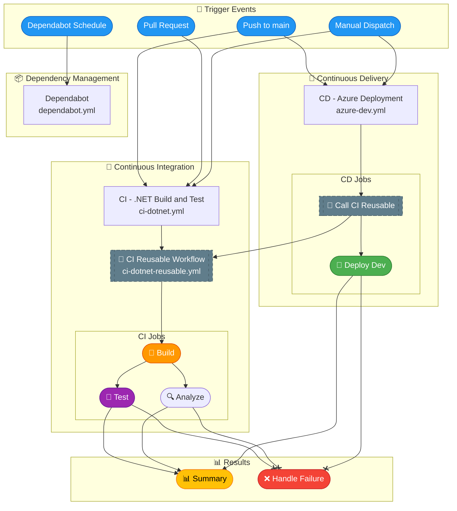

# 🔧 DevOps Documentation

> Comprehensive documentation for GitHub Actions workflows used in the Azure Logic Apps Monitoring project.

---

## 📑 Table of Contents

- [Overview](#-overview)
- [Master Pipeline Diagram](#️-master-pipeline-diagram)
- [Workflow Documentation](#-workflow-documentation)
- [Quick Reference](#-quick-reference)
- [Required Secrets & Variables](#-required-secrets--variables)
- [Related Documentation](#-related-documentation)
- [Additional Resources](#-additional-resources)

---

## 📋 Overview

The project uses **GitHub Actions** for continuous integration (CI) and continuous delivery (CD) to Azure. The pipeline architecture follows best practices for .NET development with **Azure Developer CLI (azd)** for infrastructure provisioning and application deployment.

### Key Highlights

- ✅ **Automated CI/CD** - Full automation from code push to deployment
- 🔐 **OIDC Authentication** - Secure, secretless Azure authentication
- 🔄 **Reusable Workflows** - DRY principle with shared CI components
- 📊 **Comprehensive Reporting** - Detailed summaries and test results

---

## 🗺️ Master Pipeline Diagram

## 📁 Workflow Documentation

| Workflow File | Documentation | Purpose |
|---------------|---------------|---------|
| [azure-dev.yml](../../.github/workflows/azure-dev.yml) | [azure-dev.md](./azure-dev.md) | 🚀 CD - Provisions Azure infrastructure and deploys the application |
| [ci-dotnet.yml](../../.github/workflows/ci-dotnet.yml) | [ci-dotnet.md](./ci-dotnet.md) | 🔄 CI - Orchestrates the .NET build and test pipeline |
| [ci-dotnet-reusable.yml](../../.github/workflows/ci-dotnet-reusable.yml) | [ci-dotnet-reusable.md](./ci-dotnet-reusable.md) | 🔧 Reusable workflow for .NET CI operations |

## 📊 Quick Reference

| Workflow | Triggers | Jobs | Environment |
|----------|----------|------|-------------|
| **CD - Azure Deployment** | `push:main`, `workflow_dispatch` | CI → Deploy Dev → Summary | `dev` |
| **CI - .NET Build and Test** | `push:*`, `pull_request:main`, `workflow_dispatch` | CI (calls reusable) | N/A |
| **CI - .NET Reusable** | `workflow_call` | Build → Test → Analyze → Summary | N/A |

## 🔐 Required Secrets & Variables

### Repository Variables (Required for CD)

| Variable | Description | Example |
|----------|-------------|---------|
| `AZURE_CLIENT_ID` | Azure AD App Registration Client ID | `xxxxxxxx-xxxx-xxxx-xxxx-xxxxxxxxxxxx` |
| `AZURE_TENANT_ID` | Azure AD Tenant ID | `xxxxxxxx-xxxx-xxxx-xxxx-xxxxxxxxxxxx` |
| `AZURE_SUBSCRIPTION_ID` | Azure Subscription ID | `xxxxxxxx-xxxx-xxxx-xxxx-xxxxxxxxxxxx` |
| `AZURE_ENV_NAME` | Azure environment name (optional) | `dev` |
| `AZURE_LOCATION` | Azure region (optional) | `eastus2` |

### GitHub Environment

| Environment | Protection Rules |
|-------------|------------------|
| `dev` | None (auto-deploy) |

## 🔗 Related Documentation

- [Architecture Documentation](../architecture/README.md)
- [Azure Developer CLI Documentation](https://learn.microsoft.com/en-us/azure/developer/azure-developer-cli/)
- [GitHub Actions Documentation](https://docs.github.com/en/actions)
- [Federated Credentials Setup](https://learn.microsoft.com/en-us/azure/developer/github/connect-from-azure)

## 📚 Additional Resources

- [Hooks Documentation](../hooks/README.md) - Pre/post deployment scripts
- [Infrastructure Documentation](../../infra/README.md) - Bicep templates
