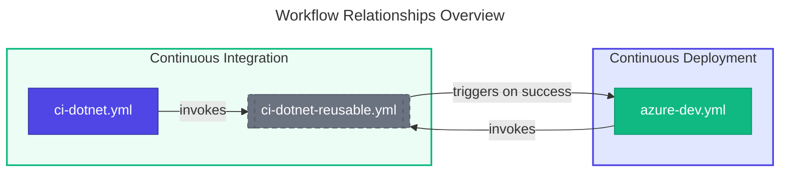

# 📚 DevOps Documentation

> Central index for all GitHub Actions workflow documentation in the Azure Logic Apps Monitoring repository.

> [!NOTE]
> **Audience:** DevOps Engineers, Platform Engineers, Developers  
> **Reading time:** ~3 minutes

---

📑 Table of Contents

- [📄 Workflow Documentation](#-workflow-documentation)
- [🔄 Workflow Relationships](#-workflow-relationships)
- [📊 Quick Reference](#-quick-reference)
- [🔧 Maintenance](#-maintenance)
- [📚 Related Documents](#-related-documents)

---

## 📄 Workflow Documentation

| Document | Workflow File | Type | Description |
|:---------|:--------------|:-----|:------------|
| [🛠️ CI - .NET Build and Test](ci-dotnet.md) | `ci-dotnet.yml` | CI Orchestration | Triggers and configures the reusable CI workflow |
| [🔄 CI - .NET Reusable Workflow](ci-dotnet-reusable.md) | `ci-dotnet-reusable.yml` | Reusable CI | Cross-platform build, test, analysis, and security scanning |
| [🚀 CD - Azure Deployment](azure-dev.md) | `azure-dev.yml` | CD | Infrastructure provisioning and application deployment to Azure |

---

## 🔄 Workflow Relationships

---

## 📊 Quick Reference

### 🔐 Permissions Summary

| Workflow | id-token | contents | checks | pull-requests | security-events |
|:---------|:---------|:---------|:-------|:--------------|:----------------|
| `ci-dotnet.yml` | - | read | write | write | write |
| `ci-dotnet-reusable.yml` | - | read | write | write | write |
| `azure-dev.yml` | write | read | write | write | write |

### ⚡ Trigger Summary

| Workflow | push | pull_request | workflow_dispatch | workflow_call |
|:---------|:-----|:-------------|:------------------|:--------------|
| `ci-dotnet.yml` | ✅ | ✅ | ✅ | - |
| `ci-dotnet-reusable.yml` | - | - | - | ✅ |
| `azure-dev.yml` | ✅ | - | ✅ | - |

### ⚙️ Required Configuration

| Item | Type | Required By |
|:-----|:-----|:------------|
| `AZURE_CLIENT_ID` | Repository Variable | `azure-dev.yml` |
| `AZURE_TENANT_ID` | Repository Variable | `azure-dev.yml` |
| `AZURE_SUBSCRIPTION_ID` | Repository Variable | `azure-dev.yml` |
| `dev` | GitHub Environment | `azure-dev.yml` |
| Federated Credentials | Azure AD | `azure-dev.yml` |

---

## 🔧 Maintenance

> [!IMPORTANT]
> These documents should be updated when:
>
> - Workflow triggers or conditions change
> - New jobs or steps are added
> - Permissions are modified
> - Input/output parameters change
> - Security-relevant configurations are updated

---

## 📚 Related Documents

| Document | Description |
|:---------|:------------|
| [Azure Developer CLI](https://learn.microsoft.com/azure/developer/azure-developer-cli/) | Official azd documentation |
| [GitHub Actions Reusable Workflows](https://docs.github.com/en/actions/sharing-automations/reusing-workflows) | GitHub documentation for reusable workflows |
| [OIDC Federation Setup](../hooks/configure-federated-credential.md) | Instructions for setting up Azure AD federation |

---

**Last updated:** January 2026

---

[⬆️ Back to Top](#-devops-documentation)

