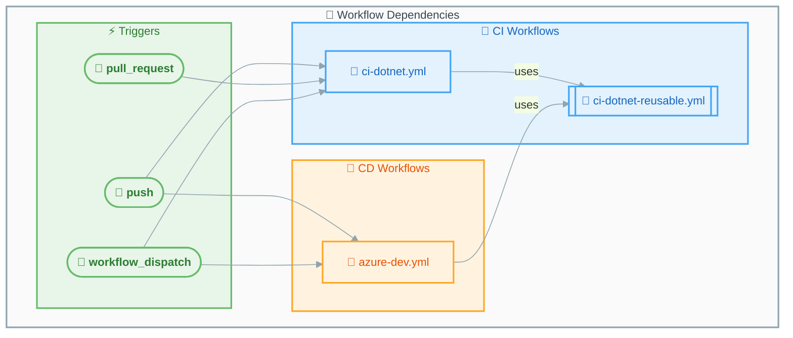

# GitHub Actions Workflows Documentation

This directory contains comprehensive documentation for all GitHub Actions workflows in this repository.

## 📋 Workflow Index

| Workflow | File | Purpose | Type |
|----------|------|---------|------|
| [CD - Azure Deployment](azure-dev.md) | `azure-dev.yml` | Provisions Azure infrastructure and deploys the application | Deployment |
| [CI - .NET Reusable Workflow](ci-dotnet-reusable.md) | `ci-dotnet-reusable.yml` | Cross-platform CI pipeline (build, test, analyze, security) | Reusable |
| [CI - .NET Build and Test](ci-dotnet.md) | `ci-dotnet.yml` | Orchestrates CI by calling the reusable workflow | CI Orchestrator |

## 🔄 Workflow Relationships



## 📊 CI/CD Pipeline Overview

### Continuous Integration (CI)

The CI pipeline is triggered on:

- **Push** to `main`, `feature/**`, `bugfix/**`, `hotfix/**`, `release/**`, `chore/**`, `docs/**`, `refactor/**`, `test/**` branches
- **Pull requests** targeting `main`
- **Manual dispatch** via GitHub UI or CLI

**Jobs executed:**

| Job | Description | Platforms |
|-----|-------------|-----------|
| 🔨 Build | Compiles .NET solution | Ubuntu, Windows, macOS |
| 🧪 Test | Runs tests with coverage | Ubuntu, Windows, macOS |
| 🔍 Analyze | Verifies code formatting | Ubuntu |
| 🛡️ CodeQL | Security vulnerability scanning | Ubuntu |

### Continuous Deployment (CD)

The CD pipeline is triggered on:

- **Push** to `docs987678` branch (with path filters)
- **Manual dispatch** via GitHub UI or CLI

**Jobs executed:**

| Job | Description | Environment |
|-----|-------------|-------------|
| 🔄 CI | Calls reusable CI workflow | Cross-platform |
| 🚀 Deploy Dev | Provisions infrastructure and deploys | Ubuntu → Azure |
| 📊 Summary | Generates deployment report | Ubuntu |

## 🔐 Security Features

| Feature | Description |
|---------|-------------|
| **OIDC Authentication** | Uses federated credentials (no stored secrets) |
| **CodeQL Scanning** | Security vulnerability detection in C# code |
| **Pinned Actions** | All actions use SHA-pinned versions |
| **Least Privilege** | Minimal permissions at workflow and job level |

## 📦 Artifacts Generated

| Artifact | Source | Description |
|----------|--------|-------------|
| `build-artifacts-{os}` | CI | Compiled binaries per platform |
| `test-results-{os}` | CI | Test results (.trx) per platform |
| `code-coverage-{os}` | CI | Cobertura coverage reports per platform |
| `codeql-sarif-results` | CI | Security scan results (SARIF) |

## 🚀 Quick Start

### Running CI Manually

```bash
# Run with default settings
gh workflow run ci-dotnet.yml

# Run with Debug configuration
gh workflow run ci-dotnet.yml -f configuration=Debug

# Run without code analysis
gh workflow run ci-dotnet.yml -f enable-code-analysis=false
```

### Running CD Manually

```bash
# Run deployment with CI checks
gh workflow run azure-dev.yml

# Run deployment skipping CI (use with caution)
gh workflow run azure-dev.yml -f skip-ci=true
```

## 📝 Prerequisites

### For CI Workflows

- .NET SDK 10.0.x (installed automatically)
- Repository access with appropriate permissions

### For CD Workflows

- Azure subscription with configured resources
- GitHub Environment: `dev`
- Repository variables:
  - `AZURE_CLIENT_ID`
  - `AZURE_TENANT_ID`
  - `AZURE_SUBSCRIPTION_ID`
- Federated credentials configured in Azure Entra ID

## 📖 Additional Resources

- [GitHub Actions Documentation](https://docs.github.com/en/actions)
- [Azure Developer CLI](https://learn.microsoft.com/en-us/azure/developer/azure-developer-cli/)
- [CodeQL Documentation](https://docs.github.com/en/code-security/code-scanning/introduction-to-code-scanning/about-code-scanning-with-codeql)
- [.NET CLI Reference](https://learn.microsoft.com/en-us/dotnet/core/tools/)

---

*Documentation generated for workflows in `.github/workflows/`*
