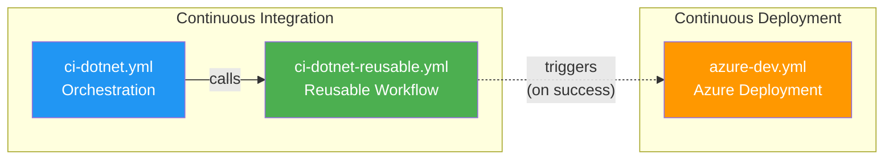

# 🚀 DevOps Documentation

> [!NOTE]
> **Target Audience:** DevOps Engineers, Developers, Platform Engineers<br>
> **Last Updated:** January 2026

---

## 📑 Table of Contents

- [📋 Overview](#-overview)
- [📄 Workflow Documentation](#-workflow-documentation)
- [🔄 Workflow Relationships](#-workflow-relationships)
- [🏁 Quick Start](#-quick-start)
- [📚 Additional Resources](#-additional-resources)

---

## 📋 Overview

This folder contains comprehensive documentation for all GitHub Actions workflows in the Azure Logic Apps Monitoring repository. Each document provides detailed information about workflow triggers, configuration, jobs, troubleshooting, and usage examples.

### Repository Information

| Property | Value |
|:---------|:------|
| **Repository** | `Evilazaro/Azure-LogicApps-Monitoring` |
| **Default Branch** | `main` |
| **Workflows Location** | `.github/workflows/` |

---

## 📄 Workflow Documentation

| Document | Workflow File | Type | Description |
|:---------|:--------------|:-----|:------------|
| [📘 CI - .NET Build and Test](ci-dotnet.md) | `ci-dotnet.yml` | CI Orchestration | Triggers CI pipeline on code changes |
| [📗 CI - .NET Reusable Workflow](ci-dotnet-reusable.md) | `ci-dotnet-reusable.yml` | Reusable CI | Cross-platform build, test, and analysis |
| [📙 CD - Azure Deployment](azure-dev.md) | `azure-dev.yml` | CD | Deploys infrastructure and applications to Azure |

---

## 🔄 Workflow Relationships



### Workflow Execution Flow

1. **CI Orchestration** (`ci-dotnet.yml`)
   - Triggers on push/PR events
   - Passes configuration to reusable workflow
   - Manages concurrency and cancellation

2. **Reusable CI** (`ci-dotnet-reusable.yml`)
   - Executes cross-platform builds (Ubuntu, Windows, macOS)
   - Runs unit tests with coverage collection
   - Performs code analysis and formatting checks
   - Executes CodeQL security scanning

3. **CD Deployment** (`azure-dev.yml`)
   - Provisions Azure infrastructure via Bicep
   - Deploys applications to Azure services
   - Configures SQL Managed Identity
   - Runs post-deployment validation

---

## 🏁 Quick Start

### View Workflow Status

```bash
# List all workflow runs
gh run list

# View specific workflow runs
gh run list --workflow=ci-dotnet.yml
gh run list --workflow=azure-dev.yml
```

### Trigger Workflows Manually

```bash
# Trigger CI workflow
gh workflow run ci-dotnet.yml

# Trigger CD workflow (requires environment selection)
gh workflow run azure-dev.yml -f environment=dev
```

### Check Workflow Files

```bash
# List workflow files
ls -la .github/workflows/

# View workflow configuration
cat .github/workflows/ci-dotnet.yml
```

---

## 📚 Additional Resources

### 🔗 External Documentation

- [GitHub Actions Documentation](https://docs.github.com/actions)
- [Workflow Syntax Reference](https://docs.github.com/actions/using-workflows/workflow-syntax-for-github-actions)
- [Azure Developer CLI (azd)](https://learn.microsoft.com/azure/developer/azure-developer-cli/)
- [.NET CLI Reference](https://docs.microsoft.com/dotnet/core/tools/)

### 🆘 Support

- 📖 [Repository Issues](https://github.com/Evilazaro/Azure-LogicApps-Monitoring/issues)
- 💬 Contact the DevOps team for assistance

---

<div align="center">

[⬆️ Back to Top](#-devops-documentation) | [📖 Repository Home](../../README.md)

</div>
