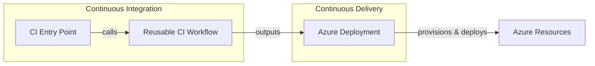

# DevOps Documentation

This folder contains documentation for the CI/CD workflows used in this repository.

## 🧭 Overview

The DevOps documentation describes GitHub Actions workflows that automate the build, test, and deployment processes for the Azure Logic Apps Monitoring solution. The workflows follow a modular design with reusable components to ensure consistency across all .NET projects.

## 📄 Documents

| Document | Description |
|----------|-------------|
| [CI - .NET Build and Test Workflow](ci-dotnet.md) | Entry point for .NET CI with trigger configuration and path filtering |
| [CI - .NET Reusable Workflow](ci-dotnet-reusable.md) | Comprehensive reusable CI workflow for cross-platform builds, testing, and security scanning |
| [CD - Azure Deployment Workflow](azure-dev.md) | Complete CD pipeline for Azure infrastructure provisioning and application deployment |

## 🔄 Workflow Relationships

## 🚀 Getting Started

1. Read [CI - .NET Build and Test Workflow](ci-dotnet.md) to understand trigger configuration
2. Read [CI - .NET Reusable Workflow](ci-dotnet-reusable.md) for details on build, test, and analysis jobs
3. Read [CD - Azure Deployment Workflow](azure-dev.md) for infrastructure provisioning and deployment

## Prerequisites

Before using these workflows, ensure the following are configured:

- **Repository Variables**: `AZURE_CLIENT_ID`, `AZURE_TENANT_ID`, `AZURE_SUBSCRIPTION_ID`
- **Azure Entra ID**: Federated credentials for GitHub Actions OIDC authentication
- **GitHub Environment**: `dev` environment (optional but recommended)
