# DevOps Documentation

## Overview

This folder contains comprehensive documentation for the CI/CD pipelines and DevOps configurations used in the Azure Logic Apps Monitoring solution. The project uses GitHub Actions for continuous integration and deployment to Azure.

## Architecture Overview

The DevOps architecture follows a modern CI/CD approach with:

- **Reusable Workflows**: Modular, DRY workflow design
- **Cross-Platform Testing**: Validation across Ubuntu, Windows, and macOS
- **Security-First**: CodeQL scanning on every CI run
- **Infrastructure as Code**: Azure resources provisioned via Bicep templates
- **OIDC Authentication**: Secure, secretless authentication with Azure

## Master Pipeline Diagram

```mermaid
flowchart TD
    subgraph Triggers["🎯 Trigger Events"]
        T_PUSH([Push to Branch])
        T_PR([Pull Request])
        T_MANUAL([Manual Dispatch])
        T_SCHEDULE([Weekly Schedule])
    end

    subgraph Dependabot["🤖 Dependabot"]
        DEP_NUGET[NuGet Updates]
        DEP_ACTIONS[Actions Updates]
    end

    subgraph CIWorkflow["📋 CI Workflow (ci-dotnet.yml)"]
        CI_ENTRY[CI Entry Point]
    end

    subgraph ReusableCI["🔄 Reusable CI (ci-dotnet-reusable.yml)"]
        direction TB

        subgraph BuildMatrix["🔨 Build (Matrix)"]
            B_U[Ubuntu]
            B_W[Windows]
            B_M[macOS]
        end

        subgraph TestMatrix["🧪 Test (Matrix)"]
            T_U[Ubuntu]
            T_W[Windows]
            T_M[macOS]
        end

        ANALYZE[🔍 Analyze<br/>Code Format]
        CODEQL[🛡️ CodeQL<br/>Security Scan]
        CI_SUMMARY[📊 CI Summary]
    end

    subgraph CDWorkflow["🚀 CD Workflow (azure-dev.yml)"]
        direction TB
        CD_CI[🔄 CI Stage]
        CD_DEPLOY[🚀 Deploy Dev]
        CD_SUMMARY[📊 CD Summary]

        subgraph DeployPhases["Deployment Phases"]
            DP1[Setup & Auth]
            DP2[Provision Infra]
            DP3[SQL Config]
            DP4[Deploy App]
        end
    end

    subgraph Azure["☁️ Azure"]
        AZ_RG[(Resource Group)]
        AZ_ACA[Container Apps]
        AZ_SQL[(Azure SQL)]
        AZ_SB[Service Bus]
    end

    %% Trigger Flows
    T_PUSH --> CI_ENTRY
    T_PR --> CI_ENTRY
    T_MANUAL --> CI_ENTRY
    T_MANUAL --> CD_CI
    T_PUSH --> CD_CI

    %% Dependabot
    T_SCHEDULE --> DEP_NUGET
    T_SCHEDULE --> DEP_ACTIONS
    DEP_NUGET -.->|PR| T_PR
    DEP_ACTIONS -.->|PR| T_PR

    %% CI Flow
    CI_ENTRY --> BuildMatrix
    BuildMatrix --> TestMatrix
    BuildMatrix --> ANALYZE
    BuildMatrix --> CODEQL
    TestMatrix --> CI_SUMMARY
    ANALYZE --> CI_SUMMARY
    CODEQL --> CI_SUMMARY

    %% CD Flow
    CD_CI -->|Calls| BuildMatrix
    CD_CI -->|success/skipped| CD_DEPLOY
    CD_DEPLOY --> DP1
    DP1 --> DP2
    DP2 --> DP3
    DP3 --> DP4
    DP4 --> CD_SUMMARY

    %% Azure Deployment
    DP2 --> AZ_RG
    DP3 --> AZ_SQL
    DP4 --> AZ_ACA
    AZ_ACA --> AZ_SB

    %% Styling
    classDef trigger fill:#2196F3,stroke:#1565C0,color:#fff
    classDef dependabot fill:#0366d6,stroke:#0550ae,color:#fff
    classDef ci fill:#FF9800,stroke:#EF6C00,color:#fff
    classDef test fill:#9C27B0,stroke:#6A1B9A,color:#fff
    classDef security fill:#607D8B,stroke:#455A64,color:#fff
    classDef deploy fill:#4CAF50,stroke:#2E7D32,color:#fff
    classDef azure fill:#0078D4,stroke:#005A9E,color:#fff
    classDef summary fill:#00BCD4,stroke:#0097A7,color:#fff

    class T_PUSH,T_PR,T_MANUAL,T_SCHEDULE trigger
    class DEP_NUGET,DEP_ACTIONS dependabot
    class CI_ENTRY,B_U,B_W,B_M ci
    class T_U,T_W,T_M,ANALYZE test
    class CODEQL security
    class CD_CI,CD_DEPLOY,DP1,DP2,DP3,DP4 deploy
    class AZ_RG,AZ_ACA,AZ_SQL,AZ_SB azure
    class CI_SUMMARY,CD_SUMMARY summary
```



## Table of Contents

| Document                                        | Description                                      |
| ----------------------------------------------- | ------------------------------------------------ |
| [CI - .NET Build and Test](ci-dotnet.md)        | Main CI workflow orchestrating builds and tests  |
| [CI - Reusable Workflow](ci-dotnet-reusable.md) | Reusable CI workflow with cross-platform support |
| [CD - Azure Deployment](azure-dev.md)           | Continuous deployment to Azure using azd         |
| [Dependabot Configuration](dependabot.md)       | Automated dependency update configuration        |

## Quick Reference

### Workflows Summary

| Workflow                 | File                     | Triggers                     | Purpose                  |
| ------------------------ | ------------------------ | ---------------------------- | ------------------------ |
| CI - .NET Build and Test | `ci-dotnet.yml`          | push, pull_request, dispatch | Code quality validation  |
| CI - Reusable            | `ci-dotnet-reusable.yml` | workflow_call                | Shared CI implementation |
| CD - Azure Deployment    | `azure-dev.yml`          | push, dispatch               | Deploy to Azure          |
| Dependabot               | `dependabot.yml`         | schedule (weekly)            | Dependency updates       |

### Jobs Overview

| Job           | Workflow(s)           | Runners                | Purpose                     |
| ------------- | --------------------- | ---------------------- | --------------------------- |
| 🔨 Build      | CI Reusable           | ubuntu, windows, macos | Compile solution            |
| 🧪 Test       | CI Reusable           | ubuntu, windows, macos | Execute tests with coverage |
| 🔍 Analyze    | CI Reusable           | ubuntu-latest          | Code format verification    |
| 🛡️ CodeQL     | CI Reusable           | ubuntu-latest          | Security scanning           |
| 🚀 Deploy Dev | CD Azure              | ubuntu-latest          | Deploy to dev environment   |
| 📊 Summary    | CI Reusable, CD Azure | ubuntu-latest          | Generate reports            |

### Required Secrets & Variables

| Name                    | Type     | Used In | Description                    |
| ----------------------- | -------- | ------- | ------------------------------ |
| `AZURE_CLIENT_ID`       | Variable | CD      | Azure AD application client ID |
| `AZURE_TENANT_ID`       | Variable | CD      | Azure AD tenant ID             |
| `AZURE_SUBSCRIPTION_ID` | Variable | CD      | Azure subscription ID          |
| `AZURE_ENV_NAME`        | Variable | CD      | Azure environment name         |
| `AZURE_LOCATION`        | Variable | CD      | Azure region                   |

### Artifacts Generated

| Artifact               | Workflow | Contents                      | Retention |
| ---------------------- | -------- | ----------------------------- | --------- |
| `build-artifacts-{os}` | CI       | Compiled binaries             | 30 days   |
| `test-results-{os}`    | CI       | Test results (.trx)           | 30 days   |
| `code-coverage-{os}`   | CI       | Coverage reports (Cobertura)  | 30 days   |
| `codeql-sarif-results` | CI       | Security scan results (SARIF) | 30 days   |

## Pipeline Flow

### CI Pipeline (Pull Requests & Pushes)

```mermaid
sequenceDiagram
    participant Dev as Developer
    participant GH as GitHub
    participant CI as CI Workflow
    participant Matrix as Build/Test Matrix

    Dev->>GH: Push commit / Create PR
    GH->>CI: Trigger workflow
    CI->>Matrix: Start parallel builds

    par Ubuntu
        Matrix->>Matrix: Build → Test → Coverage
    and Windows
        Matrix->>Matrix: Build → Test → Coverage
    and macOS
        Matrix->>Matrix: Build → Test → Coverage
    end

    Matrix->>CI: Results
    CI->>CI: Analyze (format check)
    CI->>CI: CodeQL (security scan)
    CI->>GH: Post status checks
    GH->>Dev: Display results
```



### CD Pipeline (Deployment)


## Local Development

### Running CI Checks Locally

```bash
# Build solution
dotnet build app.sln --configuration Release

# Run tests with coverage
dotnet test app.sln --configuration Release --collect:"XPlat Code Coverage"

# Check code formatting
dotnet format app.sln --verify-no-changes

# Fix formatting issues
dotnet format app.sln
```

### Deploying Locally with azd

```bash
# Login to Azure
azd auth login

# Provision infrastructure
azd provision

# Deploy application
azd deploy

# Full provision and deploy
azd up
```

## Best Practices

### Security

- ✅ OIDC authentication (no stored secrets)
- ✅ CodeQL security scanning on every CI run
- ✅ Pinned action versions (SHA-based)
- ✅ Least-privilege permissions
- ✅ Dependabot for dependency updates

### Reliability

- ✅ Retry logic for transient failures
- ✅ Cross-platform testing (Ubuntu, Windows, macOS)
- ✅ Fail-fast disabled for complete feedback
- ✅ Comprehensive error reporting

### Maintainability

- ✅ Reusable workflow patterns
- ✅ Configurable inputs
- ✅ Detailed workflow summaries
- ✅ Semantic commit messages

## Troubleshooting

### Common Issues

| Issue                     | Solution                                     |
| ------------------------- | -------------------------------------------- |
| OIDC auth fails           | Verify federated credential configuration    |
| Tests fail on specific OS | Check platform-specific code paths           |
| Format check fails        | Run `dotnet format` locally                  |
| CodeQL timeout            | Review query configuration and codebase size |
| Deployment fails          | Check Azure portal for resource status       |

### Getting Help

1. Check individual workflow documentation for detailed troubleshooting
2. Review workflow logs in GitHub Actions
3. Check Azure portal for deployment status
4. Open an issue in the repository

## Related Documentation

- [Azure Developer CLI](https://learn.microsoft.com/azure/developer/azure-developer-cli/)
- [GitHub Actions](https://docs.github.com/en/actions)
- [.NET CLI](https://learn.microsoft.com/dotnet/core/tools/)
- [CodeQL](https://codeql.github.com/docs/)
