# 🔧 DevOps Documentation

> [!NOTE]
> 🎯 **For DevOps Engineers and Platform Teams**: Comprehensive documentation for GitHub Actions workflows used in CI/CD pipelines.  
> ⏱️ **Estimated reading time:** 10 minutes for overview, 30 minutes for complete documentation

📍 <strong>Quick Navigation</strong>

| Previous | Index | Next |
|:---------|:------:|--------:|
| — | [📚 Docs Index](../README.md) | [Azure Deployment →](azure-dev.md) |

---

## 📑 Table of Contents

- [📋 Overview](#-overview)
- [🗺️ Master Pipeline Diagram](#%EF%B8%8F-master-pipeline-diagram)
- [📁 Workflow Documentation](#-workflow-documentation)
- [📊 Quick Reference](#-quick-reference)
- [🔐 Required Secrets & Variables](#-required-secrets--variables)
- [🔗 Related Documentation](#-related-documentation)
- [📚 Additional Resources](#-additional-resources)

---

## 📋 Overview

The project uses **GitHub Actions** for continuous integration (CI) and continuous delivery (CD) to Azure. The pipeline architecture follows best practices for .NET development with **Azure Developer CLI (azd)** for infrastructure provisioning and application deployment.

### Key Highlights

- ✅ **Automated CI/CD** - Full automation from code push to deployment
- 🔐 **OIDC Authentication** - Secure, secretless Azure authentication
- 🔄 **Reusable Workflows** - DRY principle with shared CI components
- 📊 **Comprehensive Reporting** - Detailed summaries and test results

---

## 🗺️ Master Pipeline Diagram

```mermaid
---
title: DevOps Master Pipeline Architecture
---
flowchart TB
    %% ===== TRIGGER EVENTS =====
    subgraph TriggersGroup["🎯 Trigger Events"]
        push(["Push to Main"])
        pr(["Pull Request"])
        manual(["Manual Dispatch"])
    end

    %% ===== CONTINUOUS INTEGRATION =====
    subgraph CIGroup["🔄 Continuous Integration"]
        direction TB
        ci_workflow["CI - .NET Build and Test"]

        subgraph CIJobs["CI Jobs (via Reusable Workflow)"]
            direction TB
            subgraph MatrixJobs["Matrix: Ubuntu, Windows, macOS"]
                build(["Build"])
                test(["Test"])
            end
            analyze(["Analyze"])
        end
    end

    %% ===== CONTINUOUS DELIVERY =====
    subgraph CDGroup["🚀 Continuous Delivery"]
        direction TB
        cd_workflow["CD - Azure Deployment"]

        subgraph CDJobs["CD Jobs"]
            ci_stage[["CI Stage (Reusable)"]]
            deploy(["Deploy Dev"])
        end
    end

    %% ===== EXTERNAL SERVICES =====
    subgraph ExternalGroup["🔧 External Services"]
        dependabot["Dependabot<br/>(Config-based)"]
    end

    %% ===== RESULTS =====
    subgraph ResultsGroup["📊 Results"]
        summary_job(["Summary"])
        failure_handler(["Handle Failure"])
    end

    %% ===== TRIGGER CONNECTIONS =====
    push -->|triggers| ci_workflow
    push -->|triggers| cd_workflow
    pr -->|triggers| ci_workflow
    manual -->|triggers| ci_workflow
    manual -->|triggers| cd_workflow

    %% ===== CI FLOW =====
    ci_workflow -->|calls reusable| MatrixJobs
    MatrixJobs -->|parallel| build
    build -->|on success| test
    build -->|on success| analyze
    test -->|reports to| summary_job
    analyze -->|reports to| summary_job

    %% ===== CD FLOW =====
    cd_workflow -->|runs| ci_stage
    ci_stage -->|on success| deploy
    deploy -->|reports to| summary_job

    %% ===== DEPENDABOT FLOW =====
    dependabot -.->|creates PRs| pr

    %% ===== FAILURE PATHS =====
    test --x|on failure| failure_handler
    analyze --x|on failure| failure_handler
    deploy --x|on failure| failure_handler

    %% ===== STYLING DEFINITIONS =====
    %% Primary components: Indigo - main processes/services
    classDef primary fill:#4F46E5,stroke:#3730A3,color:#FFFFFF
    %% Secondary components: Emerald - secondary elements
    classDef secondary fill:#10B981,stroke:#059669,color:#FFFFFF
    %% External systems: Gray - reusable/external calls
    classDef external fill:#6B7280,stroke:#4B5563,color:#FFFFFF,stroke-dasharray: 5 5
    %% Error/failure states: Red - error handling
    classDef failed fill:#F44336,stroke:#C62828,color:#FFFFFF
    %% Triggers: Indigo light - entry points
    classDef trigger fill:#818CF8,stroke:#4F46E5,color:#FFFFFF
    %% Data stores: Amber - reporting
    classDef datastore fill:#F59E0B,stroke:#D97706,color:#000000
    %% Matrix: Light emerald - parallel execution
    classDef matrix fill:#D1FAE5,stroke:#10B981,color:#000000

    %% ===== SUBGRAPH STYLING =====
    style TriggersGroup fill:#EEF2FF,stroke:#4F46E5,stroke-width:2px
    style CIGroup fill:#ECFDF5,stroke:#10B981,stroke-width:2px
    style CIJobs fill:#D1FAE5,stroke:#059669,stroke-width:1px
    style MatrixJobs fill:#E0E7FF,stroke:#4F46E5,stroke-width:1px
    style CDGroup fill:#EEF2FF,stroke:#4F46E5,stroke-width:2px
    style CDJobs fill:#E0E7FF,stroke:#3730A3,stroke-width:1px
    style ExternalGroup fill:#F3F4F6,stroke:#6B7280,stroke-width:2px
    style ResultsGroup fill:#FEF3C7,stroke:#F59E0B,stroke-width:2px

    %% ===== NODE STYLING =====
    class push,pr,manual trigger
    class build,test primary
    class deploy,analyze secondary
    class ci_stage external
    class dependabot external
    class failure_handler failed
    class summary_job datastore
```

---

## 📁 Workflow Documentation

| Workflow File                                                            | Documentation                                    | Purpose                                                             |
| ------------------------------------------------------------------------ | ------------------------------------------------ | ------------------------------------------------------------------- |
| [azure-dev.yml](../../.github/workflows/azure-dev.yml)                   | [azure-dev.md](./azure-dev.md)                   | 🚀 CD - Provisions Azure infrastructure and deploys the application |
| [ci-dotnet.yml](../../.github/workflows/ci-dotnet.yml)                   | [ci-dotnet.md](./ci-dotnet.md)                   | 🔄 CI - Orchestrates the .NET build and test pipeline               |
| [ci-dotnet-reusable.yml](../../.github/workflows/ci-dotnet-reusable.yml) | [ci-dotnet-reusable.md](./ci-dotnet-reusable.md) | 🔧 Reusable workflow for .NET CI operations                         |

---

## 📊 Quick Reference

| Workflow                     | Triggers                                           | Jobs                             | Platforms              |
| ---------------------------- | -------------------------------------------------- | -------------------------------- | ---------------------- |
| **CD - Azure Deployment**    | `push:main`, `workflow_dispatch`                   | CI → Deploy Dev → Summary        | Ubuntu (deploy)        |
| **CI - .NET Build and Test** | `push:*`, `pull_request:main`, `workflow_dispatch` | CI (calls reusable)              | Ubuntu, Windows, macOS |
| **CI - .NET Reusable**       | `workflow_call`                                    | Build → Test → Analyze → Summary | Ubuntu, Windows, macOS |

---

## 🔐 Required Secrets & Variables

### Repository Variables (Required for CD)

| Variable                | Description                         | Example                                |
| ----------------------- | ----------------------------------- | -------------------------------------- |
| `AZURE_CLIENT_ID`       | Azure AD App Registration Client ID | `xxxxxxxx-xxxx-xxxx-xxxx-xxxxxxxxxxxx` |
| `AZURE_TENANT_ID`       | Azure AD Tenant ID                  | `xxxxxxxx-xxxx-xxxx-xxxx-xxxxxxxxxxxx` |
| `AZURE_SUBSCRIPTION_ID` | Azure Subscription ID               | `xxxxxxxx-xxxx-xxxx-xxxx-xxxxxxxxxxxx` |
| `AZURE_ENV_NAME`        | Azure environment name (optional)   | `dev`                                  |
| `AZURE_LOCATION`        | Azure region (optional)             | `eastus2`                              |

### GitHub Environment

| Environment | Protection Rules   |
| ----------- | ------------------ |
| `dev`       | None (auto-deploy) |

---

## 🔗 Related Documentation

| Resource                                                                                                    | Description                                                |
| ----------------------------------------------------------------------------------------------------------- | ---------------------------------------------------------- |
| [Deployment Architecture](../architecture/07-deployment-architecture.md)                                    | CI/CD pipeline architecture and environment promotion flow |
| [Architecture Documentation](../architecture/README.md)                                                     | System architecture and design decisions                   |
| [Azure Developer CLI Documentation](https://learn.microsoft.com/en-us/azure/developer/azure-developer-cli/) | Official azd documentation                                 |
| [GitHub Actions Documentation](https://docs.github.com/en/actions)                                          | GitHub Actions reference                                   |
| [Federated Credentials Setup](https://learn.microsoft.com/en-us/azure/developer/github/connect-from-azure)  | OIDC authentication setup guide                            |

---

## 📚 Additional Resources

| Resource                                                 | Description                 |
| -------------------------------------------------------- | --------------------------- |
| [Developer Experience Documentation](../hooks/README.md) | Pre/post deployment scripts |
| [Infrastructure Documentation](../../infra/README.md)    | Bicep templates and IaC     |

---

[⬆️ Back to top](#-devops-documentation)
