# DevOps Documentation

## 📋 Overview

This folder contains documentation for the CI/CD pipelines and DevOps practices used in the Azure Logic Apps Monitoring solution.

## 📂 Contents

| Document                                       | Description                                    |
| ---------------------------------------------- | ---------------------------------------------- |
| [azure-dev-workflow.md](azure-dev-workflow.md) | CI/CD pipeline for provisioning and deployment |
| [ci-workflow.md](ci-workflow.md)               | Build validation pipeline for PRs              |

## 🔄 Pipeline Architecture

```mermaid
flowchart TB
    %% ============================================
    %% Pipeline Architecture Overview
    %% ============================================

    %% Class Definitions - Modern Color Palette
    classDef trigger fill:#EEF2FF,stroke:#4F46E5,stroke-width:2px,color:#312E81
    classDef ci fill:#DBEAFE,stroke:#2563EB,stroke-width:2px,color:#1E40AF
    classDef cd fill:#D1FAE5,stroke:#10B981,stroke-width:2px,color:#065F46
    classDef azure fill:#E0E7FF,stroke:#6366F1,stroke-width:2px,color:#3730A3

    %% ─────────────────────────────────────────────
    %% TRIGGERS
    %% ─────────────────────────────────────────────
    subgraph Triggers["🔔 Git Events"]
        direction LR
        H["📌 Push to main"]
        I["🔀 PR to main"]
        J["📝 Push to branch"]
    end

    %% ─────────────────────────────────────────────
    %% CI PIPELINE
    %% ─────────────────────────────────────────────
    subgraph CI["🔍 CI Pipeline (ci.yml)"]
        direction TB
        A["🔨 .NET Build"]
        B["☁️ Bicep Build"]
        C["🧪 Unit Tests"]
    end

    %% ─────────────────────────────────────────────
    %% CD PIPELINE
    %% ─────────────────────────────────────────────
    subgraph CD["🚀 CD Pipeline (azure-dev.yml)"]
        direction TB
        D["✅ CI Gate"]
        E["☁️ Provision Infra"]
        F["📦 Deploy Apps"]

        D --> E --> F
    end

    %% ─────────────────────────────────────────────
    %% CONNECTIONS
    %% ─────────────────────────────────────────────
    H --> D
    I --> A
    J --> A
    A --> D
    B --> D
    C --> D

    %% ─────────────────────────────────────────────
    %% APPLY STYLES
    %% ─────────────────────────────────────────────
    class H,I,J trigger
    class A,B,C ci
    class D,E,F cd
```

## 🔐 Security

All pipelines implement:

- **OIDC Authentication**: Passwordless Azure auth via federated credentials
- **Least-Privilege Permissions**: Only required GitHub token permissions
- **Environment Protection**: GitHub Environments with approval workflows
- **Concurrency Control**: Prevents race conditions in deployments

## 📖 Quick Links

- [GitHub Actions Documentation](https://docs.github.com/en/actions)
- [Azure Developer CLI](https://learn.microsoft.com/azure/developer/azure-developer-cli/)
- [OIDC with Azure](https://learn.microsoft.com/azure/developer/github/connect-from-azure)
