# azure-dev.yml - CI/CD Pipeline


## 📋 Overview

The `azure-dev.yml` workflow is the primary CI/CD pipeline for the Azure Logic Apps Monitoring solution. It provides automated continuous integration validation, Azure infrastructure provisioning, and application deployment using Azure Developer CLI (azd).

This workflow implements security best practices including **OIDC federated credentials** for passwordless Azure authentication, **least-privilege permissions**, and **deployment gating** based on unit test results.

## 📑 Table of Contents

- [📋 Overview](#-overview)
- [🎯 Purpose](#-purpose)
- [🚀 Triggers](#-triggers)
- [⚙️ Configuration](#️-configuration)
  - [🔐 Required Repository Variables](#-required-repository-variables)
  - [🛡️ Permissions](#️-permissions)
- [📊 Pipeline Flow](#-pipeline-flow)
  - [🔄 Workflow Diagram](#-workflow-diagram)
- [🏗️ Job: provision-and-deploy](#️-job-provision-and-deploy)
  - [📝 Steps Overview](#-steps-overview)
- [🔐 Security](#-security)
  - [🔑 OIDC Authentication](#-oidc-authentication)
  - [✅ Security Best Practices](#-security-best-practices)
- [📈 Pipeline Reporting](#-pipeline-reporting)
  - [🧪 Test Results](#-test-results)
  - [📋 Job Summary](#-job-summary)
- [🛠️ Usage](#️-usage)
  - [🔄 Automatic Execution](#-automatic-execution)
  - [💻 Manual Execution](#-manual-execution)
- [❌ Error Handling](#-error-handling)
- [📖 Related Documentation](#-related-documentation)
- [📜 Version History](#-version-history)

## 🎯 Purpose

This workflow:

- ✅ **Validates Code**: Builds .NET solution and runs unit tests before deployment
- ✅ **Validates Infrastructure**: Compiles Bicep templates to catch syntax errors
- ✅ **Gates Deployment**: Blocks deployment if unit tests fail
- ✅ **Provisions Infrastructure**: Deploys Azure resources using Bicep via azd
- ✅ **Deploys Application**: Deploys to Azure Container Apps using azd
- ✅ **Reports Results**: Generates comprehensive job summaries with test metrics

## 🚀 Triggers

The workflow is triggered by:

| Trigger    | Description                     | Configuration                                             |
| ---------- | ------------------------------- | --------------------------------------------------------- |
| **Push**   | Commits to `main` branch        | Excludes `**.md`, `docs/**`, `.gitignore`, `LICENSE`      |
| **Manual** | Workflow dispatch via GitHub UI | Optional environment selection (`dev`, `staging`, `prod`) |

### Path Filtering

The workflow ignores non-code changes to optimize CI runs:

```yaml
paths-ignore:
  - "**.md"
  - "docs/**"
  - ".gitignore"
  - "LICENSE"
```

## ⚙️ Configuration

### 🔐 Required Repository Variables

Configure these in **Settings → Secrets and Variables → Actions → Variables**:

| Variable                  | Description                  | Example                                |
| ------------------------- | ---------------------------- | -------------------------------------- |
| `AZURE_CLIENT_ID`         | Service Principal Client ID  | `12345678-1234-1234-1234-123456789012` |
| `AZURE_TENANT_ID`         | Azure AD Tenant ID           | `12345678-1234-1234-1234-123456789012` |
| `AZURE_SUBSCRIPTION_ID`   | Target Azure Subscription ID | `12345678-1234-1234-1234-123456789012` |
| `AZURE_LOCATION`          | Azure region for deployment  | `eastus2`                              |
| `AZURE_ENV_NAME`          | Environment name             | `dev`                                  |
| `DEPLOYER_PRINCIPAL_TYPE` | Principal type               | `ServicePrincipal`                     |

### 🛡️ Permissions

The workflow uses **least-privilege permissions**:

```yaml
permissions:
  id-token: write # OIDC federated credential authentication
  contents: read # Repository checkout
  statuses: write # Report deployment status checks
  checks: write # Create test report check runs
  actions: read # Required for dorny/test-reporter
```

## 📊 Pipeline Flow

### 🔄 Workflow Diagram

```mermaid
flowchart TB
    %% ============================================
    %% CI/CD Pipeline Flow Diagram
    %% Azure Logic Apps Monitoring Solution
    %% ============================================

    %% Class Definitions - Modern Color Palette
    classDef trigger fill:#EEF2FF,stroke:#4F46E5,stroke-width:2px,color:#312E81
    classDef ci fill:#DBEAFE,stroke:#2563EB,stroke-width:2px,color:#1E40AF
    classDef decision fill:#FEF3C7,stroke:#F59E0B,stroke-width:2px,color:#92400E
    classDef success fill:#D1FAE5,stroke:#10B981,stroke-width:2px,color:#065F46
    classDef failure fill:#FEE2E2,stroke:#EF4444,stroke-width:2px,color:#991B1B
    classDef infra fill:#E0E7FF,stroke:#6366F1,stroke-width:2px,color:#3730A3
    classDef deploy fill:#ECFDF5,stroke:#10B981,stroke-width:2px,color:#065F46

    %% ─────────────────────────────────────────────
    %% TRIGGER STAGE
    %% ─────────────────────────────────────────────
    subgraph Triggers["🔔 Workflow Triggers"]
        direction LR
        A["📌 Push to main"]
        B["🖱️ Manual Dispatch"]
    end

    %% ─────────────────────────────────────────────
    %% CI VALIDATION STAGE
    %% ─────────────────────────────────────────────
    subgraph CI["🔍 CI Validation"]
        direction TB
        C["🔧 Install Tools"]
        D["📥 Checkout Code"]
        E["⚙️ Setup .NET SDK"]
        F["📦 Cache & Restore"]
        G["🏗️ Build Solution"]
        H["🧪 Run Unit Tests"]

        C --> D --> E --> F --> G --> H
    end

    %% ─────────────────────────────────────────────
    %% DEPLOYMENT GATE
    %% ─────────────────────────────────────────────
    subgraph Gate["🚧 Quality Gate"]
        I{"Tests<br/>Passed?"}
        J["❌ Block Deploy"]
        K["✅ Continue"]
    end

    %% ─────────────────────────────────────────────
    %% INFRASTRUCTURE STAGE
    %% ─────────────────────────────────────────────
    subgraph Infra["☁️ Infrastructure Setup"]
        direction TB
        L["🔧 Setup Azure CLI"]
        M["📋 Build Bicep"]
        N["🔐 OIDC Login"]

        L --> M --> N
    end

    %% ─────────────────────────────────────────────
    %% DEPLOYMENT STAGE
    %% ─────────────────────────────────────────────
    subgraph Deploy["🚀 Azure Deployment"]
        direction TB
        O["☁️ azd provision"]
        P["📦 azd deploy"]
        Q["📊 Generate Summary"]

        O --> P --> Q
    end

    %% ─────────────────────────────────────────────
    %% FLOW CONNECTIONS
    %% ─────────────────────────────────────────────
    A --> C
    B --> C
    H --> I
    I -->|"No"| J
    I -->|"Yes"| K
    K --> L
    N --> O

    %% ─────────────────────────────────────────────
    %% APPLY STYLES
    %% ─────────────────────────────────────────────
    class A,B trigger
    class C,D,E,F,G,H ci
    class I decision
    class J failure
    class K success
    class L,M,N infra
    class O,P,Q deploy
```



## 🏗️ Job: provision-and-deploy

**Runner**: `ubuntu-latest`  
**Timeout**: 45 minutes  
**Environment**: Dynamic (from input or `vars.AZURE_ENV_NAME`)

### 📝 Steps Overview

| Step | Name                           | Description                     |
| ---- | ------------------------------ | ------------------------------- |
| 1    | Install required tools         | Updates apt and installs unzip  |
| 2    | Checkout repository            | Clones code with full history   |
| 3    | Setup .NET SDK                 | Installs .NET 8.x, 9.x, 10.x    |
| 4    | Install Aspire Workload        | Installs .NET Aspire workload   |
| 5    | Cache NuGet packages           | Caches dependencies for speed   |
| 6    | Restore dependencies           | Downloads NuGet packages        |
| 7    | Build .NET solution            | Compiles in Release mode        |
| 8    | Run unit tests                 | Executes tests with TRX output  |
| 9    | Parse test results             | Extracts metrics from TRX files |
| 10   | Upload test results            | Artifacts for download          |
| 11   | Generate test report           | dorny/test-reporter integration |
| 12   | Gate: Check test results       | Blocks if tests failed          |
| 13   | Setup Azure CLI and Bicep      | Installs Bicep CLI              |
| 14   | Build Bicep templates          | Validates IaC syntax            |
| 15   | Install Azure Developer CLI    | Installs azd                    |
| 16   | Install sqlcmd                 | For SQL managed identity setup  |
| 17   | Make hook scripts executable   | chmod +x hooks/\*.sh            |
| 18   | Authenticate Azure CLI (OIDC)  | Passwordless Azure login        |
| 19   | Authenticate azd               | Federated credentials           |
| 20   | Provision Azure Infrastructure | azd provision                   |
| 21   | Deploy Application             | azd deploy                      |
| 22   | Generate Deployment Summary    | Job summary with metrics        |

## 🔐 Security

### 🔑 OIDC Authentication

This workflow uses **OpenID Connect (OIDC) federated credentials** for passwordless Azure authentication:

```yaml
- uses: azure/login@v2
  with:
    client-id: ${{ vars.AZURE_CLIENT_ID }}
    tenant-id: ${{ vars.AZURE_TENANT_ID }}
    subscription-id: ${{ vars.AZURE_SUBSCRIPTION_ID }}
```

**Benefits:**

- No secrets stored in GitHub
- Token-based authentication with short-lived credentials
- Audit trail in Azure AD

### ✅ Security Best Practices

| Practice                    | Implementation                     |
| --------------------------- | ---------------------------------- |
| Least-privilege permissions | Only required permissions declared |
| OIDC authentication         | No stored secrets                  |
| Environment protection      | Uses GitHub Environments           |
| Concurrency control         | Prevents race conditions           |
| Input validation            | Path filtering on triggers         |

## 📈 Pipeline Reporting

### 🧪 Test Results

The workflow generates comprehensive test reports:

1. **TRX Files**: Uploaded as artifacts (14-day retention)
2. **Test Reporter**: Creates GitHub check run with annotations
3. **Job Summary**: Detailed metrics in workflow summary

### 📋 Job Summary

The workflow generates a deployment summary including:

- Build validation status (✅/❌)
- Test metrics (Total/Passed/Failed/Skipped)
- Pass rate percentage
- Deployment details (Environment, Region, Subscription)
- Run information (Branch, Commit, Actor, Workflow Run)

## 🛠️ Usage

### 🔄 Automatic Execution

The workflow runs automatically on push to `main`:

```bash
git push origin main
```

### 💻 Manual Execution

Trigger manually via GitHub Actions UI:

1. Navigate to **Actions** tab
2. Select **Continuous Integration, Provision & Deploy**
3. Click **Run workflow**
4. Select target environment (`dev`, `staging`, `prod`)
5. Click **Run workflow**

## ❌ Error Handling

| Scenario            | Behavior                               |
| ------------------- | -------------------------------------- |
| Test failures       | Deployment blocked at gate step        |
| Bicep syntax errors | Build fails before provisioning        |
| Azure auth failure  | Job fails with clear error             |
| Provisioning errors | Job fails, partial resources may exist |
| Deployment errors   | Job fails, infrastructure intact       |

**Retry Strategy**: Re-run failed jobs from GitHub Actions UI. For infrastructure issues, use `azd down` then `azd up` for clean deployment.

## 📖 Related Documentation

- [CI Workflow](ci-workflow.md) - Build validation pipeline
- [Azure Developer CLI](https://learn.microsoft.com/azure/developer/azure-developer-cli/)
- [OIDC Authentication](https://learn.microsoft.com/azure/developer/github/connect-from-azure)
- [GitHub Actions Best Practices](https://docs.github.com/en/actions/security-guides/security-hardening-for-github-actions)
- [postprovision Hook](../hooks/postprovision.md)
- [preprovision Hook](../hooks/preprovision.md)

## 📜 Version History

| Version | Date       | Changes                                                    |
| ------- | ---------- | ---------------------------------------------------------- |
| 1.0.0   | 2026-01-14 | Initial release with OIDC auth, test gating, job summaries |
