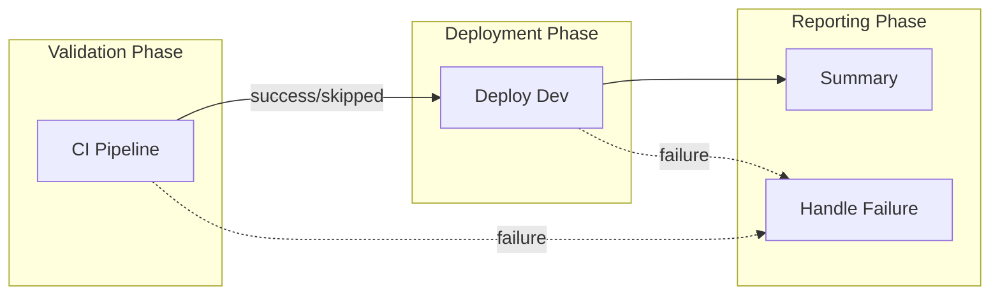
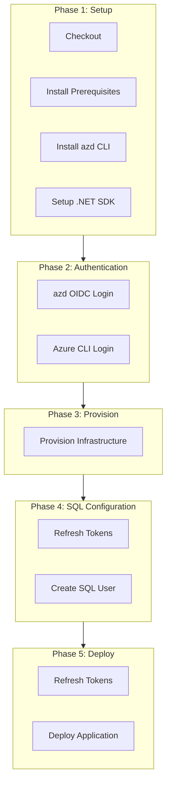

# CD - Azure Deployment Workflow Documentation

## Table of Contents

- [Overview](#-overview)
- [Triggers](#-triggers)
- [Pipeline Flow](#-pipeline-flow)
- [Jobs Breakdown](#-jobs-breakdown)
- [Inputs and Parameters](#-inputs-and-parameters)
- [Secrets and Variables](#-secrets-and-variables)
- [Permissions and Security Model](#-permissions-and-security-model)
- [Environments and Deployment Strategy](#-environments-and-deployment-strategy)
- [Failure Handling and Recovery](#-failure-handling-and-recovery)
- [How to Run This Workflow](#-how-to-run-this-workflow)
- [Extensibility and Customization](#-extensibility-and-customization)
- [Known Limitations and Gotchas](#-known-limitations-and-gotchas)
- [Ownership and Maintenance](#-ownership-and-maintenance)
- [Assumptions and Gaps](#-assumptions-and-gaps)

## 🧭 Overview

This workflow implements a complete Continuous Delivery (CD) pipeline that provisions Azure infrastructure and deploys a .NET application using Azure Developer CLI (`azd`) with OpenID Connect (OIDC) authentication.

### In-Scope Responsibilities

- Execute the reusable CI pipeline (build, test, analyze, CodeQL security scanning)
- Provision Azure infrastructure via Bicep templates using `azd provision`
- Configure Azure SQL Database with Managed Identity authentication
- Deploy application code using `azd deploy`
- Generate deployment summaries and failure reports
- Handle OIDC token refresh during long-running operations

### Out-of-Scope Responsibilities

- Multi-environment promotion (only deploys to `dev` environment)
- Manual approval gates (can be configured at environment level)
- Rollback automation (provides instructions only)
- Infrastructure teardown or cleanup

### In-Scope Responsibilities

- Execute the reusable CI pipeline (build, test, analyze, CodeQL security scanning)
- Provision Azure infrastructure via Bicep templates using `azd provision`
- Configure Azure SQL Database with Managed Identity authentication
- Deploy application code using `azd deploy`
- Generate deployment summaries and failure reports
- Handle OIDC token refresh during long-running operations

### Out-of-Scope Responsibilities

- Multi-environment promotion (only deploys to `dev` environment)
- Manual approval gates (can be configured at environment level)
- Rollback automation (provides instructions only)
- Infrastructure teardown or cleanup

---

## ⚙️ Triggers

| Trigger Type | Configuration | Description |
|-------------|---------------|-------------|
| `workflow_dispatch` | Optional `skip-ci` boolean input | Manual trigger with option to skip CI checks |
| `push` | Branch: `docs987678` | Automatic on push to specified branch |

### Path Filters (Push Trigger)

Changes to the following paths trigger the workflow:

| Path Pattern | Description |
|-------------|-------------|
| `src/**` | Application source code |
| `app.*/**` | App host and service defaults projects |
| `infra/**` | Infrastructure-as-Code (Bicep) templates |
| `azure.yaml` | Azure Developer CLI configuration |
| `.github/workflows/azure-dev.yml` | This workflow file |

### Concurrency Configuration

```yaml
concurrency:
  group: deploy-dev-${{ github.ref }}
  cancel-in-progress: false
```

- Prevents simultaneous deployments to the same environment
- Does not cancel in-progress deployments (preserves running deployments)

---

## 🔄 Pipeline Flow

### Mermaid Diagram



### Interpretation Notes

- **Parallelism**: CI and deployment jobs run sequentially; deployment depends on CI success or skip
- **Failure handling**: The `on-failure` job runs only when CI or deploy-dev fails, providing visual indication in the workflow graph
- **Summary job**: Always runs regardless of previous job outcomes to provide status visibility
- **Conditional flow**: Deployment proceeds if CI succeeds OR if CI is skipped via `skip-ci` input

### Detailed Deployment Flow



---

## 🛠 Jobs Breakdown

| Job | Responsibility | Key Outputs | Conditions |
|-----|---------------|-------------|------------|
| `ci` | Execute reusable CI workflow (build, test, analyze, CodeQL) | Build version, job results | Skipped if `skip-ci=true` |
| `deploy-dev` | Provision infrastructure, configure SQL, deploy application | `webapp-url`, `resource-group` | Runs if CI succeeds or is skipped |
| `summary` | Generate comprehensive workflow summary report | Workflow summary in GitHub Actions | Always runs |
| `on-failure` | Report failure with job statuses and next steps | Failure report | Only runs on failure |

### CI Job Details

The CI job calls the reusable workflow `.github/workflows/ci-dotnet-reusable.yml` with the following configuration:

| Input | Value |
|-------|-------|
| `configuration` | `Release` |
| `dotnet-version` | `10.0.x` |
| `solution-file` | `app.sln` |
| `enable-code-analysis` | `true` |
| `fail-on-format-issues` | `false` |

### Deploy-Dev Job Phases

| Phase | Steps | Purpose |
|-------|-------|---------|
| Setup | Checkout, Install prerequisites, Install azd, Setup .NET | Prepare runner environment |
| Auth | azd auth login, Azure CLI login | Establish OIDC authentication |
| Provision | `azd provision` with retry logic | Create Azure resources |
| SQL Config | Refresh tokens, Create SQL user | Configure Managed Identity |
| Deploy | Refresh tokens, `azd deploy` | Deploy application code |
| Summary | Generate deployment summary | Document deployment status |

---

## ⚙️ Inputs and Parameters

### Workflow Dispatch Inputs

| Input | Type | Required | Default | Description |
|-------|------|----------|---------|-------------|
| `skip-ci` | boolean | No | `false` | Skip CI checks (use with caution) |

> [!WARNING]
> Skipping CI checks allows untested code to be deployed. Use only for emergency fixes.

---

## 🔐 Secrets and Variables

### Required Repository Variables

| Variable | Scope | Purpose |
|----------|-------|---------|
| `AZURE_CLIENT_ID` | Repository | Service Principal/App Registration Client ID for OIDC |
| `AZURE_TENANT_ID` | Repository | Azure AD Tenant ID |
| `AZURE_SUBSCRIPTION_ID` | Repository | Target Azure Subscription ID |

### Optional Repository Variables

| Variable | Default | Purpose |
|----------|---------|---------|
| `AZURE_ENV_NAME` | `dev` | Azure Developer CLI environment name |
| `AZURE_LOCATION` | `eastus2` | Azure region for deployment |
| `DEPLOYER_PRINCIPAL_TYPE` | `ServicePrincipal` | Type of deployer principal |
| `DEPLOY_HEALTH_MODEL` | (none) | Health model deployment flag |

### Environment Variables (Workflow-Level)

| Variable | Value | Purpose |
|----------|-------|---------|
| `DOTNET_VERSION` | `10.0.x` | .NET SDK version |
| `DOTNET_SKIP_FIRST_TIME_EXPERIENCE` | `true` | Skip .NET welcome experience |
| `DOTNET_NOLOGO` | `true` | Suppress .NET CLI logo |
| `DOTNET_CLI_TELEMETRY_OPTOUT` | `true` | Disable .NET telemetry |

---

## 🔐 Permissions and Security Model

### GitHub Actions Permissions

| Permission | Level | Purpose |
|------------|-------|---------|
| `id-token` | write | Required for OIDC authentication with Azure |
| `contents` | read | Read repository contents for checkout |
| `checks` | write | Create check runs for test results |
| `pull-requests` | write | Post comments on pull requests |
| `security-events` | write | Upload CodeQL SARIF results |

### Authentication Approach

> [!NOTE]
> OIDC tokens expire approximately every 5 minutes. The workflow refreshes tokens before SQL and deploy operations to prevent AADSTS700024 errors.

- **OIDC/Federated Credentials**: No long-lived secrets stored in GitHub
- **Token refresh**: OIDC tokens refresh before SQL and deploy operations
- **Dual authentication**: Both `azd` and Azure CLI authenticate via OIDC

### Least-Privilege Analysis

| Aspect | Assessment |
|--------|------------|
| Permissions scope | Appropriate for CI/CD requirements |
| OIDC vs PAT | OIDC preferred (short-lived, no stored secrets) |
| SQL access | Uses Managed Identity with db_owner role |
| Risk | db_owner is broad; consider reducing for production |

---

## 🌐 Environments and Deployment Strategy

### Configured Environments

| Environment | Protection Rules | URL Output |
|-------------|-----------------|------------|
| `dev` | Configurable at repository level | `${{ steps.deploy.outputs.webapp-url }}` |

### Deployment Strategy

- **Single environment**: Only `dev` environment is configured
- **Infrastructure-first**: Provisioning completes before application deployment
- **SQL configuration**: Managed Identity user created after infrastructure provisioning

---

## ⚠️ Failure Handling and Recovery

### Retry Mechanisms

| Operation | Max Retries | Initial Delay | Backoff |
|-----------|-------------|---------------|---------|
| `azd provision` | 3 | 30 seconds | Exponential (2x) |
| `azd deploy` | 3 | 30 seconds | Exponential (2x) |
| SQL script execution | 3 | 15 seconds | Exponential (2x) |
| go-sqlcmd version fetch | 3 | 5 seconds | Fixed |

### Failure Behavior

- **CI failure**: Blocks deployment; failure job reports status
- **Provisioning failure**: Logs captured; deployment blocked
- **SQL configuration failure**: Detailed error output; deployment blocked
- **Deployment failure**: Rollback instructions provided in summary

### Manual Recovery

The workflow provides rollback instructions in the deployment summary:

```bash
# Option 1: Re-run with previous commit
gh workflow run azure-dev.yml --ref <previous-commit-sha>

# Option 2: Use Azure Developer CLI locally
git checkout <previous-commit-sha>
azd deploy --no-prompt
```

---

## 🚀 How to Run This Workflow

### Automatic Triggers

1. Push changes to the `docs987678` branch affecting paths: `src/**`, `app.*/**`, `infra/**`, `azure.yaml`, or this workflow file

### Manual Execution

1. Navigate to **Actions** tab in GitHub repository
2. Select **CD - Azure Deployment** workflow
3. Click **Run workflow**
4. Optionally check **Skip CI checks** (not recommended for production)
5. Click **Run workflow** button

### Common Operator Mistakes to Avoid

| Mistake | Consequence | Prevention |
|---------|-------------|------------|
| Skipping CI without review | Deploying untested code | Only skip CI for emergency fixes |
| Missing Azure variables | Authentication failure | Verify all required variables before first run |
| Expired federated credentials | OIDC authentication failure | Ensure federated credential configuration is current |
| Concurrent deployments | Race conditions | Concurrency configuration prevents this |

---

## 🧩 Extensibility and Customization

### Safe Extension Points

| Extension Point | How to Extend |
|-----------------|---------------|
| Additional environments | Duplicate `deploy-dev` job with new environment name |
| Post-deployment tests | Add new job with `needs: [deploy-dev]` |
| Notification integration | Add steps to `summary` or `on-failure` jobs |
| Additional Azure resources | Modify Bicep templates in `infra/` directory |

### What Should NOT Be Changed

| Component | Reason |
|-----------|--------|
| OIDC authentication flow | Security-critical; requires matched Azure configuration |
| Token refresh timing | Prevents AADSTS700024 token expiration errors |
| SQL SID calculation | Uses Client ID, not Object ID; change breaks authentication |
| Concurrency configuration | Prevents deployment race conditions |

### Adding New Environments

```yaml
deploy-staging:
  name: 🚀 Deploy Staging
  needs: [deploy-dev]
  environment:
    name: staging
  # Copy steps from deploy-dev, update environment variables
```

---

## ⚠️ Known Limitations and Gotchas

### Limitations

| Limitation | Impact | Workaround |
|------------|--------|------------|
| Single environment only | No staging/production promotion | Extend workflow with additional jobs |
| OIDC token expiration (~5 min) | Long operations may fail | Token refresh implemented before sensitive operations |
| go-sqlcmd required | ODBC sqlcmd doesn't support Azure AD | Workflow installs go-sqlcmd automatically |
| Branch filter (`docs987678`) | May not trigger on expected branches | Update branch filter in workflow file |

### Non-Obvious Behavior

> [!IMPORTANT]
> The SQL user SID is derived from the Client ID (Application ID), not the Object ID. Changing this calculation breaks authentication.

- **SID calculation**: SQL user SID derived from Client ID (Application ID), not Object ID
- **ODBC sqlcmd removal**: Workflow removes existing ODBC sqlcmd to prevent PATH conflicts
- **Token refresh**: Tokens refreshed twice: before SQL operations and before deployment
- **CI skip propagation**: Skipping CI allows deployment to proceed without validation

---

## 👥 Ownership and Maintenance

### Owning Team

| Role | Responsibility |
|------|----------------|
| Platform Engineering | Workflow structure, security configuration |
| Development Team | Application-specific customizations |
| Security Team | Review OIDC configuration, permission scope |

### Review Expectations

- Changes to OIDC authentication require security review
- Permission scope changes require security approval
- Infrastructure changes should be reviewed by platform team

### Change Management

| Change Type | Review Requirements |
|-------------|-------------------|
| Security/permissions | Security team approval |
| Infrastructure (Bicep) | Platform team review |
| Application deployment | Standard PR review |
| Workflow structure | Platform team + security review |

---

## 📋 Assumptions and Gaps

### Assumptions Made

1. **Federated credentials configured**: Azure Entra ID has federated credentials for GitHub Actions OIDC
2. **Required variables exist**: All repository variables (`AZURE_CLIENT_ID`, `AZURE_TENANT_ID`, `AZURE_SUBSCRIPTION_ID`) are configured
3. **Environment exists**: GitHub environment `dev` is configured (optional but recommended)
4. **Bicep templates valid**: Infrastructure templates in `infra/` are valid and tested

### Gaps Identified

| Gap | Impact | Recommendation |
|-----|--------|----------------|
| No multi-environment promotion | Limited deployment strategy | Add staging/production jobs |
| No automated rollback | Manual recovery required | Consider implementing rollback automation |
| Branch filter may be stale | Workflow may not trigger | Verify branch filter matches deployment branches |
| db_owner role is broad | Potential security risk | Consider reducing SQL permissions for production |

### Diagram Simplifications

- Deployment phases shown at high level; individual steps grouped for clarity
- Error handling flows indicated with dotted lines
- Token refresh operations not shown individually in main flow diagram

---

## 📚 See Also

- [CI - .NET Build and Test Workflow](ci-dotnet.md) - Entry point for CI operations
- [CI - .NET Reusable Workflow](ci-dotnet-reusable.md) - Detailed CI implementation
