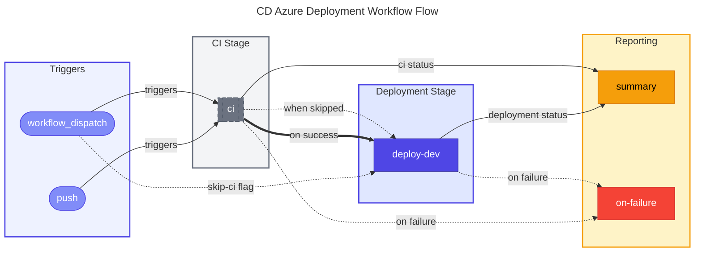

# 🚀 CD - Azure Deployment

> Provisions Azure infrastructure and deploys .NET applications using Azure Developer CLI (azd) with OIDC authentication.

> [!NOTE]
> **Audience:** DevOps Engineers, Platform Engineers, Developers  
> **Reading time:** ~15 minutes

---

<details>
<summary>🧭 Navigation</summary>

| Previous | Index | Next |
|:---------|:------|:-----|
| [🔄 CI Reusable Workflow](ci-dotnet-reusable.md) | [📚 Documentation Index](README.md) | — |

</details>

---

<details>
<summary>📑 Table of Contents</summary>

- [📋 Overview and Purpose](#-overview-and-purpose)
- [⚡ Triggers](#-triggers)
- [📊 High-Level Workflow Flow](#-high-level-workflow-flow)
- [🔧 Jobs Breakdown](#-jobs-breakdown)
- [📥 Inputs and Parameters](#-inputs-and-parameters)
- [🔐 Secrets and Variables](#-secrets-and-variables)
- [🛡️ Permissions and Security Model](#️-permissions-and-security-model)
- [🌍 Environments and Deployment Strategy](#-environments-and-deployment-strategy)
- [❌ Failure Handling and Recovery](#-failure-handling-and-recovery)
- [🚀 How to Run This Workflow](#-how-to-run-this-workflow)
- [🔌 Extensibility and Customization](#-extensibility-and-customization)
- [⚠️ Known Limitations and Gotchas](#️-known-limitations-and-gotchas)
- [👥 Ownership and Maintenance](#-ownership-and-maintenance)
- [📝 Assumptions and Gaps](#-assumptions-and-gaps)

</details>

---

## 📋 Overview and Purpose

### What This Workflow Does

This workflow provisions Azure infrastructure and deploys a .NET application using Azure Developer CLI (azd) with OpenID Connect (OIDC) authentication. It implements a complete continuous delivery pipeline with the following stages:

1. **CI Integration**: Calls the reusable CI workflow for build, test, and security validation
2. **Infrastructure Provisioning**: Deploys Azure resources via Bicep templates
3. **SQL Configuration**: Creates managed identity users in Azure SQL Database
4. **Application Deployment**: Deploys application code to Azure services

The workflow uses OIDC federated credentials, eliminating the need for stored secrets.

> [!TIP]
>
> ### ✅ When to Use
>
> - **Automated deployments**: Triggered on push to the configured branch with relevant path changes
> - **Manual deployments**: Via `workflow_dispatch` for controlled releases
> - **Infrastructure updates**: When Bicep templates or Azure configuration changes
> - **Application releases**: When application code changes require deployment

> [!CAUTION]
>
> ### ❌ When NOT to Use
>
> - **CI-only validation**: Use the CI workflow directly for build/test without deployment
> - **Production deployments**: This workflow targets the `dev` environment only
> - **Emergency hotfixes**: May want to skip CI using the `skip-ci` input for urgent fixes

---

## ⚡ Triggers

| Trigger | Conditions | Description |
|:--------|:-----------|:------------|
| `workflow_dispatch` | Manual | Allows manual execution with `skip-ci` option |
| `push` | Branch: `docs987678` | Triggers on push to the specified branch |
| `push` | Paths: `src/**`, `app.*/**`, `infra/**`, `azure.yaml`, `.github/workflows/azure-dev.yml` | Only runs when relevant files change |

### Manual Trigger Inputs

| Input | Type | Required | Default | Description |
|:------|:-----|:---------|:--------|:------------|
| `skip-ci` | boolean | No | `false` | Skip CI checks (use with caution) |

### Concurrency

```yaml
concurrency:
  group: deploy-dev-${{ github.ref }}
  cancel-in-progress: false
```

> [!IMPORTANT]
> Concurrent deployments to the same environment are queued, not cancelled, to prevent partial deployments.

---

## 📊 High-Level Workflow Flow

### Narrative Overview

The workflow executes in a linear sequence with conditional branching:

1. **CI Job** (optional): Runs the reusable CI workflow unless `skip-ci` is enabled
2. **Deploy-Dev Job**: Executes after CI succeeds or is skipped; performs infrastructure provisioning, SQL configuration, and application deployment
3. **Summary Job**: Always runs to provide consolidated status reporting
4. **On-Failure Job**: Executes only when preceding jobs fail

The Deploy-Dev job contains multiple phases that must complete sequentially: Setup, Authentication, Provision, Re-Auth, SQL Config, Re-Auth, Deploy, and Summary generation.

### Mermaid Diagram



### Interpretation Notes

- **Sequential deployment**: The deploy-dev job waits for CI to complete or be skipped before executing
- **Skip-CI path**: Manual triggers can bypass CI for emergency deployments
- **No parallel deployment**: Concurrency is configured to queue rather than cancel
- **Always-run summary**: The summary job executes regardless of upstream job status

---

## 🔧 Jobs Breakdown

| Job | Runner | Timeout | Responsibility | Dependencies |
|:----|:-------|:--------|:---------------|:-------------|
| `ci` | Varies (reusable) | Varies | Build, test, analyze, security scan | None |
| `deploy-dev` | `ubuntu-latest` | 30 min | Provision infrastructure, configure SQL, deploy app | `ci` (success or skipped) |
| `summary` | `ubuntu-latest` | 5 min | Generate consolidated workflow report | `ci`, `deploy-dev` |
| `on-failure` | `ubuntu-latest` | 5 min | Report failure details | `ci`, `deploy-dev` |

<details>
<summary>📖 Deploy-Dev Job Phases</summary>

### Deploy-Dev Job Phases

| Phase | Description |
|:------|:------------|
| Setup | Checkout, install go-sqlcmd, azd CLI, .NET SDK |
| Auth | OIDC authentication with Azure (azd + az CLI) |
| Provision | Infrastructure deployment via `azd provision` |
| Re-Auth (Pre-SQL) | Refresh OIDC tokens before SQL operations |
| SQL Config | Create managed identity user in Azure SQL |
| Re-Auth (Post-SQL) | Refresh OIDC tokens after SQL operations |
| Deploy | Application deployment via `azd deploy` |
| Summary | Generate deployment status report |

### Deploy-Dev Job Outputs

| Output | Description |
|:-------|:------------|
| `webapp-url` | URL of the deployed web application |
| `resource-group` | Azure resource group name |

</details>

---

## 📥 Inputs and Parameters

### Workflow-Level Inputs

| Input | Type | Required | Default | Description |
|:------|:-----|:---------|:--------|:------------|
| `skip-ci` | boolean | No | `false` | Skip CI checks (manual trigger only) |

### CI Workflow Parameters

The CI job passes the following configuration to the reusable workflow:

| Parameter | Value |
|:----------|:------|
| `configuration` | `Release` |
| `dotnet-version` | `10.0.x` |
| `solution-file` | `app.sln` |
| `enable-code-analysis` | `true` |
| `fail-on-format-issues` | `false` |

---

## 🔐 Secrets and Variables

### Repository Variables (Required)

| Variable | Scope | Purpose |
|:---------|:------|:--------|
| `AZURE_CLIENT_ID` | Repository | Azure AD application (client) ID for OIDC |
| `AZURE_TENANT_ID` | Repository | Azure AD tenant ID |
| `AZURE_SUBSCRIPTION_ID` | Repository | Target Azure subscription ID |

### Repository Variables (Optional)

| Variable | Default | Purpose |
|:---------|:--------|:--------|
| `AZURE_ENV_NAME` | `dev` | Azure Developer CLI environment name |
| `AZURE_LOCATION` | `eastus2` | Azure region for resource deployment |
| `DEPLOYER_PRINCIPAL_TYPE` | `ServicePrincipal` | Principal type for deployment |
| `DEPLOY_HEALTH_MODEL` | (none) | Health model deployment flag |

### Secrets

| Secret | Scope | Purpose |
|:-------|:------|:--------|
| `inherit` | Repository | All secrets inherited for CI workflow |

> [!NOTE]
> No explicit secrets are stored or referenced. OIDC federated credentials are used for Azure authentication.

---

## 🛡️ Permissions and Security Model

### GitHub Actions Permissions

| Permission | Level | Purpose |
|:-----------|:------|:--------|
| `id-token` | write | Required for OIDC authentication with Azure |
| `contents` | read | Read repository contents for checkout |
| `checks` | write | Create check runs for test results |
| `pull-requests` | write | Post comments on PRs |
| `security-events` | write | Upload CodeQL SARIF results |

### Authentication Model

> [!IMPORTANT]
> This workflow uses **OpenID Connect (OIDC) federated credentials**:
>
> - No client secrets are stored in GitHub
> - Tokens are short-lived (approximately 5 minutes)
> - Multiple re-authentication steps are required during long-running operations
> - Both Azure Developer CLI (`azd auth login`) and Azure CLI (`az login`) are authenticated

### Security Considerations

- **OIDC tokens expire**: The workflow includes re-authentication steps before and after SQL operations
- **Federated credentials required**: Azure AD must be configured with GitHub as a federated identity provider
- **No secret storage**: All authentication uses ephemeral OIDC tokens
- **Pinned actions**: All third-party actions use SHA-pinned versions
- **SQL SID from Client ID**: Uses application (client) ID, not object ID, for SQL user creation

### Action Versions

| Action | Version | SHA |
|:-------|:--------|:----|
| `actions/checkout` | v6.0.2 | `de0fac2e4500dabe0009e67214ff5f5447ce83dd` |
| `Azure/setup-azd` | v2.2.1 | `c495e71ba59e44bfaaac10a32c8ee90d191ca4a3` |
| `actions/setup-dotnet` | v5.1.0 | `baa11fbfe1d6520db94683bd5c7a3818018e4309` |
| `azure/login` | v2.4.0 | `a457da9ea143d694b1b9c7c869ebb04ebe844ef5` |

---

## 🌍 Environments and Deployment Strategy

### GitHub Environment

| Environment | Protection | Description |
|:------------|:-----------|:------------|
| `dev` | None specified | Development environment |

The workflow uses the `dev` GitHub Environment, which can be configured with:

- Required reviewers
- Wait timers
- Deployment branches
- Environment secrets/variables

### Deployment URL

The environment URL is dynamically set from the deployment output:

```yaml
environment:
  name: dev
  url: ${{ steps.deploy.outputs.webapp-url }}
```

### Promotion Strategy

This workflow deploys only to `dev`. Production deployments would require:

- Additional environment configurations
- Separate workflow jobs or a different workflow
- Approval gates and protection rules

---

## ❌ Failure Handling and Recovery

### Failure Behavior

| Scenario | Behavior |
|:---------|:---------|
| CI failure | Deploy-dev is skipped, workflow fails |
| Provision failure | Retries up to 3 times with exponential backoff |
| SQL configuration failure | Retries up to 3 times with exponential backoff |
| Deploy failure | Retries up to 3 times with exponential backoff |
| OIDC token expiration | Re-authentication is performed between long operations |

### Retry Configuration

| Operation | Max Retries | Initial Delay | Backoff |
|:----------|:------------|:--------------|:--------|
| Provision | 3 | 30 seconds | Exponential (x2) |
| SQL Script | 3 | 15 seconds | Exponential (x2) |
| Deploy | 3 | 30 seconds | Exponential (x2) |

### Recovery Steps

1. Review the deployment summary in the workflow run
2. Check Azure portal for resource status
3. Review `on-failure` job output for specific error details
4. For rollback, re-run the workflow targeting a previous commit:

```bash
gh workflow run azure-dev.yml --ref <previous-commit-sha>
```

Or deploy locally:

```bash
git checkout <previous-commit-sha>
azd deploy --no-prompt
```

---

## 🚀 How to Run This Workflow

### Automatic Trigger

Push changes to the configured branch with relevant path changes:

```bash
git checkout docs987678
# Make changes to src/**, infra/**, or azure.yaml
git add .
git commit -m "feat: update application"
git push origin docs987678
```

### Manual Trigger (Standard)

```bash
gh workflow run azure-dev.yml
```

### Manual Trigger (Skip CI)

```bash
gh workflow run azure-dev.yml -f skip-ci=true
```

> [!WARNING]
> Skipping CI bypasses build validation, test execution, and security scanning. Use only for emergency deployments.

### Via GitHub UI

1. Navigate to Actions tab
2. Select "CD - Azure Deployment"
3. Click "Run workflow"
4. Optionally check "Skip CI checks"
5. Click "Run workflow"

<details>
<summary>⚠️ Common Mistakes to Avoid</summary>

- **Pushing to wrong branch**: The trigger branch is `docs987678`, not `main`
- **Missing Azure configuration**: Ensure repository variables are configured
- **Expired federated credentials**: Verify Azure AD federation is active
- **Insufficient permissions**: Ensure the Azure AD application has required Azure RBAC roles

</details>

---

## 🔌 Extensibility and Customization

### ✅ Safe Extension Points

- **Add environments**: Create additional jobs for staging/production with appropriate conditions
- **Modify retry logic**: Adjust `MAX_RETRIES` and `RETRY_DELAY` values
- **Add post-deployment tests**: Insert smoke test steps after deployment
- **Extend SQL configuration**: Modify the SQL script for additional database setup

### ⛔ What Should NOT Be Changed

- **OIDC authentication flow**: Required for secure Azure access
- **Re-authentication steps**: Token refresh is necessary for long-running operations
- **Permission declarations**: Reducing permissions will break authentication
- **go-sqlcmd installation**: Required for Azure AD authentication with SQL

### Adding a Production Environment

```yaml
deploy-prod:
  name: Deploy Production
  needs: [ci, deploy-dev]
  if: success()
  environment:
    name: production
    url: ${{ steps.deploy.outputs.webapp-url }}
  # Similar steps as deploy-dev with production configuration
```

---

## ⚠️ Known Limitations and Gotchas

| Limitation | Impact | Mitigation |
|:-----------|:-------|:-----------|
| Single environment | Only deploys to `dev` | Create separate jobs for other environments |
| OIDC token lifetime | Tokens expire in ~5 minutes | Multiple re-auth steps are implemented |
| go-sqlcmd installation | Adds ~30 seconds to setup | Required for Azure AD SQL authentication |
| Trigger branch | Hardcoded to `docs987678` | Update trigger configuration as needed |
| No rollback automation | Manual rollback required | Use `azd down` or re-deploy previous commit |

> [!WARNING]
>
> ### OIDC Token Expiration
>
> The workflow includes three authentication points:
>
> 1. Initial authentication before provisioning
> 2. Re-authentication before SQL operations
> 3. Re-authentication before deployment
>
> This pattern addresses AADSTS700024 token expiration errors.

> [!TIP]
>
> ### SQL User Creation
>
> The workflow creates SQL users using the managed identity's **Client ID** (Application ID), not the Object ID. This is required because Azure SQL uses the Client ID for SID calculation in Entra ID authentication.

---

## 👥 Ownership and Maintenance

### Ownership

| Role | Responsibility |
|:-----|:---------------|
| DevOps Team | Workflow maintenance, Azure configuration |
| Platform Team | Azure infrastructure, Bicep templates |
| Security Team | OIDC configuration, permission reviews |
| Application Team | Application code, deployment validation |

### Review Expectations

- Changes to Azure credentials or permissions require Security team approval
- Infrastructure (Bicep) changes require Platform team review
- CI configuration changes require DevOps team review

### Change Management

- Test workflow changes using `workflow_dispatch` before merging
- Document Azure resource changes in infrastructure documentation
- Coordinate database schema changes with SQL configuration updates

---

## 📝 Assumptions and Gaps

### Assumptions

- Azure AD is configured with GitHub as a federated identity provider
- Repository variables contain valid Azure configuration
- The `dev` Azure environment exists or can be created
- go-sqlcmd is compatible with the Ubuntu runner
- Azure SQL Server allows Azure AD authentication
- The deployment identity has sufficient Azure RBAC permissions

### Gaps

- **No production deployment**: Only `dev` environment is configured
- **No approval gates**: GitHub Environment protection is not explicitly configured
- **No smoke tests**: Post-deployment validation is not automated
- **No notification integration**: No Slack/Teams notifications on success/failure
- **No rollback automation**: Rollback requires manual intervention
- **No blue-green deployment**: Single deployment target without traffic shifting
- **Limited observability**: No integration with Azure Application Insights for deployment tracking
- **Hardcoded trigger branch**: The trigger branch (`docs987678`) appears to be for testing rather than production use

### Prerequisites Documentation

> [!IMPORTANT]
> The workflow references external prerequisites that must be configured:
>
> - Azure Entra ID federated credentials
> - GitHub Environment: `dev`
> - Repository variables for Azure configuration
>
> See [configure-federated-credential.md](../hooks/configure-federated-credential.md) for setup instructions.

---

## 📚 Related Documents

| Document | Description |
|:---------|:------------|
| [🛠️ CI Orchestration](ci-dotnet.md) | CI workflow that validates code before deployment |
| [🔄 CI Reusable Workflow](ci-dotnet-reusable.md) | Reusable CI workflow called by both CI and CD |
| [📚 Documentation Index](README.md) | Central index of all DevOps documentation |
| [Federated Credential Setup](../hooks/configure-federated-credential.md) | Azure AD OIDC setup instructions |

---

<div align="center">

[⬆️ Back to Top](#-cd---azure-deployment) | [📚 Documentation Index](README.md)

</div>
