# 🚀 CD - Azure Deployment

> **Workflow File:** [azure-dev.yml](../../.github/workflows/azure-dev.yml)

---

## 📑 Table of Contents

- [📋 Overview](#-overview)
- [🗺️ Pipeline Visualization](#%EF%B8%8F-pipeline-visualization)
- [🎯 Triggers](#-triggers)
- [📋 Jobs & Steps](#-jobs--steps)
- [🔐 Prerequisites](#-prerequisites)
- [🔧 Environment Variables](#-environment-variables)
- [🚀 Usage Examples](#-usage-examples)
- [🔍 Troubleshooting](#-troubleshooting)
- [🔗 Related Documentation](#-related-documentation)

---

## 📋 Overview

This workflow provisions Azure infrastructure and deploys the .NET application using **Azure Developer CLI (azd)** with **OpenID Connect (OIDC)** authentication. It integrates the CI pipeline (build, test, analyze) before deploying to the development environment.

### Key Features

| Feature | Description |
| ------- | ----------- |
| ✅ **Integrated CI Pipeline** | Build, test, and code analysis before deployment |
| 🔐 **OIDC Authentication** | No stored secrets - uses federated credentials |
| 🌍 **Environment-based Deployment** | Protection rules and environment variables |
| 📊 **Deployment Summaries** | Detailed observability and reporting |
| 🔄 **Automatic Rollback** | Instructions provided on failure |

---

## 🗺️ Pipeline Visualization

```mermaid
flowchart LR
    subgraph Triggers["🎯 Triggers"]
        push([Push to main])
        manual([Manual Dispatch])
    end

    subgraph Conditions["⚙️ Conditions"]
        skip_ci{Skip CI?}
    end

    subgraph CI["🔄 CI Stage"]
        ci_job[["🔄 CI Reusable Workflow"]]
    end

    subgraph Deploy["🚀 Deploy Stage"]
        direction LR
        
        subgraph Setup["📦 Phase 1: Setup"]
            checkout["📥 Checkout"]
            prereq["📦 Install Prerequisites"]
            azd_install["🔧 Install Azure Developer CLI"]
            dotnet_setup["🔧 Setup .NET SDK"]
        end
        
        subgraph Auth["🔐 Phase 2: Authentication"]
            azd_auth["🔐 AZD Login (OIDC)"]
            az_login["🔑 Azure CLI Login"]
        end
        
        subgraph Provision["🏗️ Phase 3: Provision & Deploy"]
            provision["🏗️ Provision Infrastructure"]
            reauth["🔐 Re-authenticate"]
            deploy_app["🚀 Deploy Application"]
        end
        
        subgraph Summary["📊 Phase 4: Summary"]
            gen_summary["📊 Generate Summary"]
        end
    end

    subgraph Results["📊 Final Results"]
        summary_job(["📊 Workflow Summary"])
        failure_handler(["❌ Handle Failure"])
    end

    subgraph Outputs["📤 Outputs"]
        webapp_url[/"🌐 Web App URL"/]
        resource_group[/"📁 Resource Group"/]
    end

    %% Trigger flow
    push --> skip_ci
    manual --> skip_ci
    
    %% CI decision
    skip_ci -->|No| ci_job
    skip_ci -->|Yes| checkout
    ci_job --> checkout
    
    %% Deploy flow
    checkout --> prereq
    prereq --> azd_install
    azd_install --> dotnet_setup
    dotnet_setup --> azd_auth
    azd_auth --> az_login
    az_login --> provision
    provision --> reauth
    reauth --> deploy_app
    deploy_app --> gen_summary
    
    %% Summary flow
    gen_summary --> summary_job
    ci_job --> summary_job
    
    %% Failure flow
    ci_job --x failure_handler
    deploy_app --x failure_handler
    
    %% Output flow
    deploy_app --> webapp_url
    deploy_app --> resource_group

    %% Styling
    classDef trigger fill:#2196F3,stroke:#1565C0,color:#fff
    classDef condition fill:#FFC107,stroke:#F57F17,color:#000
    classDef build fill:#FF9800,stroke:#E65100,color:#fff
    classDef deploy fill:#4CAF50,stroke:#2E7D32,color:#fff
    classDef auth fill:#673AB7,stroke:#4527A0,color:#fff
    classDef reusable fill:#607D8B,stroke:#455A64,color:#fff,stroke-dasharray: 5 5
    classDef failed fill:#F44336,stroke:#C62828,color:#fff
    classDef summary fill:#00BCD4,stroke:#00838F,color:#fff
    classDef output fill:#8BC34A,stroke:#558B2F,color:#fff

    class push,manual trigger
    class skip_ci condition
    class ci_job reusable
    class checkout,prereq,azd_install,dotnet_setup build
    class azd_auth,az_login,reauth auth
    class provision,deploy_app deploy
    class gen_summary,summary_job summary
    class failure_handler failed
    class webapp_url,resource_group output
```



---

## 🎯 Triggers

| Event | Condition | Description |
| ----- | --------- | ----------- |
| `push` | Branch: `main` | Triggers on push to main branch |
| `push` | Paths: `src/**`, `app.*/**`, `infra/**`, `azure.yaml`, workflow file | Only runs when relevant files change |
| `workflow_dispatch` | Manual | Allows manual triggering with optional skip-ci input |

### Path Filters

The workflow monitors changes to these paths:

```yaml
paths:
  - "src/**"           # Source code changes
  - "app.*/**"         # .NET Aspire host/defaults projects
  - "infra/**"         # Infrastructure changes
  - "azure.yaml"       # Azure Developer CLI configuration
  - ".github/workflows/azure-dev.yml"  # This workflow
```

### Manual Dispatch Inputs

| Input | Type | Default | Description |
| ----- | ---- | ------- | ----------- |
| `skip-ci` | `boolean` | `false` | Skip CI checks (use with caution) |

> ⚠️ **Warning:** Skipping CI should only be used for emergency deployments or when CI has been validated separately.

---

## 📋 Jobs & Steps

### Job 1: 🔄 CI

**Condition:** Runs unless `skip-ci` is `true`

| Property | Value |
| -------- | ----- |
| **Type** | Reusable workflow call |
| **Workflow** | `.github/workflows/ci-dotnet-reusable.yml` |
| **Configuration** | `Release` |
| **Analysis** | Enabled |

### Job 2: 🚀 Deploy Dev

**Condition:** Runs when CI succeeds or is skipped

| Property | Value |
| -------- | ----- |
| **Runner** | `ubuntu-latest` |
| **Timeout** | 30 minutes |
| **Environment** | `dev` |
| **Needs** | `ci` |

#### Steps Overview

| Phase | Step | Description |
| ----- | ---- | ----------- |
| **Setup** | 📥 Checkout repository | Clones the repository |
| **Setup** | 📦 Install Prerequisites | Installs `jq`, `dos2unix`, `go-sqlcmd` |
| **Setup** | 🔧 Install Azure Developer CLI | Sets up azd |
| **Setup** | 🔧 Setup .NET SDK | Installs .NET 10.0.x |
| **Auth** | 🔐 Log in with Azure (OIDC) | Authenticates azd with federated credentials |
| **Auth** | 🔑 Azure CLI Login | Authenticates Azure CLI |
| **Deploy** | 🏗️ Provision Infrastructure | Runs `azd provision` |
| **Deploy** | 🔐 Re-authenticate | Refreshes authentication |
| **Deploy** | 🚀 Deploy Application | Runs `azd deploy` |
| **Summary** | 📊 Generate deployment summary | Creates detailed summary |

#### Job Outputs

| Output | Description |
| ------ | ----------- |
| `webapp-url` | URL of the deployed web application |
| `resource-group` | Name of the Azure resource group |

### Job 3: 📊 Summary

**Condition:** Always runs

| Property | Value |
| -------- | ----- |
| **Runner** | `ubuntu-latest` |
| **Timeout** | 5 minutes |
| **Needs** | `ci`, `deploy-dev` |

Generates comprehensive workflow summary with status badges and links.

### Job 4: ❌ Handle Failure

**Condition:** Runs on failure

| Property | Value |
| -------- | ----- |
| **Runner** | `ubuntu-latest` |
| **Timeout** | 5 minutes |
| **Needs** | `ci`, `deploy-dev` |

Reports failure with detailed job results and next steps.

---

## 🔐 Prerequisites

### Required Repository Variables

| Variable | Description | Required |
| -------- | ----------- | :------: |
| `AZURE_CLIENT_ID` | Azure AD App Registration Client ID | ✅ |
| `AZURE_TENANT_ID` | Azure AD Tenant ID | ✅ |
| `AZURE_SUBSCRIPTION_ID` | Azure Subscription ID | ✅ |
| `AZURE_ENV_NAME` | Azure environment name | ❌ (default: `dev`) |
| `AZURE_LOCATION` | Azure region | ❌ (default: `eastus2`) |
| `DEPLOYER_PRINCIPAL_TYPE` | Principal type for deployment | ❌ (default: `ServicePrincipal`) |
| `DEPLOY_HEALTH_MODEL` | Health model deployment flag | ❌ |

### Required Permissions

```yaml
permissions:
  id-token: write      # Required for OIDC authentication
  contents: read       # Required for checkout
  checks: write        # Required for status checks
  pull-requests: write # Required for PR comments
```

### GitHub Environment

| Environment | URL Output | Protection Rules |
| ----------- | ---------- | ---------------- |
| `dev` | `${{ steps.deploy.outputs.webapp-url }}` | None |

### Azure Prerequisites

1. **Federated Credentials** - Must be configured in Azure AD for GitHub Actions OIDC
2. **Resource Provider Registrations** - Required Azure providers must be registered
3. **Subscription Access** - Service principal must have appropriate permissions

---

## 🔧 Environment Variables

```yaml
env:
  DOTNET_VERSION: "10.0.x"
  DOTNET_SKIP_FIRST_TIME_EXPERIENCE: true
  DOTNET_NOLOGO: true
  DOTNET_CLI_TELEMETRY_OPTOUT: true
```

---

## 🚀 Usage Examples

### Automatic Deployment

Push changes to the `main` branch with changes in monitored paths:

```bash
git add src/
git commit -m "feat: add new feature"
git push origin main
```

### Manual Deployment (UI)

1. Go to **Actions** → **CD - Azure Deployment**
2. Click **Run workflow**
3. Optionally check **Skip CI checks**
4. Click **Run workflow**

### Manual Deployment (CLI)

```bash
gh workflow run azure-dev.yml --ref main
```

### Skip CI (Emergency Deploy)

```bash
gh workflow run azure-dev.yml --ref main -f skip-ci=true
```

> ⚠️ **Caution:** Only use skip-ci for emergency deployments when CI has been validated separately.

---

## 🔍 Troubleshooting

### Common Issues

| Issue | Cause | Solution |
| ----- | ----- | -------- |
| OIDC authentication fails | Invalid federated credentials | Verify Azure AD app registration configuration |
| Provision fails | Missing permissions | Check subscription RBAC assignments |
| Deploy fails | Resource conflicts | Review Azure portal for resource status |
| sqlcmd errors | Wrong version installed | Workflow installs go-sqlcmd automatically |

### Rollback Instructions

On deployment failure, the summary includes rollback instructions:

```bash
# Option 1: Re-run with previous commit
gh workflow run azure-dev.yml --ref <previous-commit-sha>

# Option 2: Use Azure Developer CLI locally
git checkout <previous-commit-sha>
azd deploy --no-prompt
```

### Viewing Logs

1. Navigate to the failed workflow run
2. Click on the failed job
3. Expand the failed step to view detailed logs
4. Check the deployment summary for environment details

---

## 🔗 Related Documentation

| Resource | Description |
| -------- | ----------- |
| [CI - .NET Reusable Workflow](./ci-dotnet-reusable.md) | Reusable CI workflow details |
| [Azure Developer CLI Documentation](https://learn.microsoft.com/en-us/azure/developer/azure-developer-cli/) | Official azd documentation |
| [Federated Credentials Setup](https://learn.microsoft.com/en-us/azure/developer/github/connect-from-azure) | OIDC authentication setup |
| [Hooks Documentation](../hooks/README.md) | Pre/post deployment scripts |

---

[⬆️ Back to top](#-cd---azure-deployment)
