# Workflow: CD - Azure Deployment


---

## Table of Contents

- [Overview](#overview)
- [Workflow Diagram](#workflow-diagram)
- [Jobs](#jobs)
  - [Job: ci](#job-ci)
  - [Job: deploy-dev](#job-deploy-dev)
  - [Job: summary](#job-summary)
  - [Job: on-failure](#job-on-failure)
- [Inputs and Secrets](#inputs-and-secrets)
- [Permissions](#permissions)
- [Artifacts and Outputs](#artifacts-and-outputs)
- [Dependencies](#dependencies)
- [Usage Examples](#usage-examples)
- [Concurrency](#concurrency)
- [Environment Variables](#environment-variables)
- [Related Workflows](#related-workflows)

---

## Overview

| Property | Value |
|:---------|:------|
| **File** | `.github/workflows/azure-dev.yml` |
| **Name** | CD - Azure Deployment |
| **Triggers** | `workflow_dispatch`, `push` (branches: `docs987678`, paths: `src/**`, `app.*/**`, `infra/**`, `azure.yaml`, `.github/workflows/azure-dev.yml`) |

This workflow provisions Azure infrastructure and deploys the .NET application using Azure Developer CLI (azd) with OpenID Connect (OIDC) authentication. It implements a complete CI/CD pipeline with security scanning, infrastructure provisioning, SQL database configuration with managed identity, and application deployment.

## Workflow Diagram

```mermaid
%%{init: {'theme': 'base', 'themeVariables': {'fontSize': '14px', 'primaryColor': '#E3F2FD', 'lineColor': '#90A4AE', 'textColor': '#37474F', 'clusterBkg': '#FAFAFA'}}}%%
flowchart TB
    subgraph wf["🔄 Workflow: CD - Azure Deployment"]
        direction TB
        
        subgraph triggers-stage["⚡ Stage: Triggers"]
            direction LR
            subgraph events["Events"]
                direction LR
                push-trigger(["🔔 push: docs987678"]):::node-trigger
                dispatch-trigger(["🔔 workflow_dispatch"]):::node-trigger
            end
        end
        
        subgraph ci-stage["🔨 Stage: CI Pipeline"]
            direction TB
            subgraph ci-group["🔄 Reusable Workflow"]
                direction LR
                ci-job[["🔄 CI"]]:::node-build
            end
        end
        
        subgraph deploy-stage["🚀 Stage: Deploy"]
            direction TB
            subgraph deploy-group["🚀 Deployment"]
                direction LR
                deploy-dev["🚀 Deploy Dev"]:::node-staging
            end
        end
        
        subgraph reporting-stage["📊 Stage: Reporting"]
            direction LR
            subgraph reporting-group["Reports"]
                direction LR
                summary["📊 Summary"]:::node-setup
                on-failure["❌ Handle Failure"]:::node-error
            end
        end
    end
    
    %% Trigger connections
    push-trigger & dispatch-trigger -->|"triggers"| ci-job
    
    %% CI to Deploy
    ci-job -->|"needs: ci (success/skipped)"| deploy-dev
    
    %% Deploy to Reporting
    deploy-dev --> summary
    ci-job & deploy-dev -.->|"if: failure()"| on-failure
    
    %% Style definitions for Level 1
    style wf fill:#FAFAFA,stroke:#90A4AE,stroke-width:2px,color:#37474F
    
    %% Style definitions for Level 2 stages
    style triggers-stage fill:#E8F5E9,stroke:#66BB6A,stroke-width:2px,color:#2E7D32
    style ci-stage fill:#E3F2FD,stroke:#42A5F5,stroke-width:2px,color:#1565C0
    style deploy-stage fill:#FFF3E0,stroke:#FFA726,stroke-width:2px,color:#E65100
    style reporting-stage fill:#F3E5F5,stroke:#AB47BC,stroke-width:2px,color:#7B1FA2
    
    %% Style definitions for Level 3 groups
    style events fill:#FFFFFF,stroke:#A5D6A7,stroke-width:1px,color:#2E7D32
    style ci-group fill:#FFFFFF,stroke:#90CAF9,stroke-width:1px,color:#1565C0
    style deploy-group fill:#FFFFFF,stroke:#FFCC80,stroke-width:1px,color:#E65100
    style reporting-group fill:#FFFFFF,stroke:#CE93D8,stroke-width:1px,color:#7B1FA2
    
    %% Node class definitions
    classDef node-trigger fill:#E8F5E9,stroke:#66BB6A,stroke-width:2px,color:#2E7D32,font-weight:bold
    classDef node-build fill:#E3F2FD,stroke:#42A5F5,stroke-width:2px,color:#1565C0
    classDef node-staging fill:#FFF3E0,stroke:#FFA726,stroke-width:2px,color:#E65100
    classDef node-setup fill:#ECEFF1,stroke:#90A4AE,stroke-width:2px,color:#546E7A
    classDef node-error fill:#FFEBEE,stroke:#EF5350,stroke-width:2px,color:#C62828
```



## Jobs

### Job: ci

- **Runs on:** (Defined by reusable workflow)
- **Depends on:** None
- **Condition:** `${{ github.event.inputs.skip-ci != 'true' }}`

This job calls the reusable CI workflow (`ci-dotnet-reusable.yml`) which executes build, test, analyze, and CodeQL scanning.

#### Steps

This is a reusable workflow call with the following inputs:

| Input | Value |
|:------|:------|
| `configuration` | `Release` |
| `dotnet-version` | `10.0.x` |
| `solution-file` | `app.sln` |
| `enable-code-analysis` | `true` |
| `fail-on-format-issues` | `false` |

---

### Job: deploy-dev

- **Runs on:** `ubuntu-latest`
- **Depends on:** `ci`
- **Condition:** `always() && (needs.ci.result == 'success' || needs.ci.result == 'skipped')`
- **Timeout:** 30 minutes
- **Environment:** `dev`

#### Steps

1. 📥 Checkout repository - `actions/checkout@de0fac2e4500dabe0009e67214ff5f5447ce83dd` (v6.0.2)
2. 📦 Install Prerequisites - (run script: installs jq, dos2unix, go-sqlcmd)
3. 🔧 Install Azure Developer CLI - `Azure/setup-azd@c495e71ba59e44bfaaac10a32c8ee90d191ca4a3` (v2.2.1)
4. 🔧 Setup .NET SDK - `actions/setup-dotnet@baa11fbfe1d6520db94683bd5c7a3818018e4309` (v5.1.0)
5. 🔐 Log in with Azure (Federated Credentials) - (run script: azd auth login)
6. 🔑 Logging in to Azure CLI - `azure/login@a457da9ea143d694b1b9c7c869ebb04ebe844ef5` (v2.4.0)
7. 🏗️ Provision Infrastructure - (run script: azd provision with retry logic)
8. 🔐 Refresh Azure credentials (Pre-SQL) - (run script: azd auth login)
9. 🔑 Refresh Azure CLI (Pre-SQL) - `azure/login@a457da9ea143d694b1b9c7c869ebb04ebe844ef5` (v2.4.0)
10. 🔑 Create SQL User with Client ID - (run script: SQL managed identity configuration)
11. 🔐 Log in with Azure (Federated Credentials) - (run script: azd auth login)
12. 🔑 Logging in to Azure CLI - `azure/login@a457da9ea143d694b1b9c7c869ebb04ebe844ef5` (v2.4.0)
13. 🚀 Deploy Application - (run script: azd deploy with retry logic)
14. 📊 Generate deployment summary - (run script: generates markdown summary)

---

### Job: summary

- **Runs on:** `ubuntu-latest`
- **Depends on:** `ci`, `deploy-dev`
- **Condition:** `always()`
- **Timeout:** 5 minutes

#### Steps

1. 📊 Generate workflow summary - (run script: generates comprehensive pipeline summary)

---

### Job: on-failure

- **Runs on:** `ubuntu-latest`
- **Depends on:** `ci`, `deploy-dev`
- **Condition:** `failure()`
- **Timeout:** 5 minutes

#### Steps

1. ❌ Report failure - (run script: generates failure report with next steps)

## Inputs and Secrets

### Inputs

| Name | Required | Default | Description |
|:-----|:--------:|:-------:|:------------|
| `skip-ci` | No | `false` | Skip CI checks (use with caution) |

### Secrets

| Name | Required | Description |
|:-----|:--------:|:------------|
| (inherited) | Yes | Secrets are inherited from the calling workflow via `secrets: inherit` |

### Repository Variables Referenced

| Variable | Required | Default | Description |
|:---------|:--------:|:-------:|:------------|
| `AZURE_CLIENT_ID` | Yes | — | Service Principal/App Registration Client ID |
| `AZURE_TENANT_ID` | Yes | — | Azure AD Tenant ID |
| `AZURE_SUBSCRIPTION_ID` | Yes | — | Target Azure Subscription |
| `AZURE_ENV_NAME` | No | `dev` | Azure environment name |
| `AZURE_LOCATION` | No | `eastus2` | Azure region |
| `DEPLOYER_PRINCIPAL_TYPE` | No | `ServicePrincipal` | Type of deployer principal |
| `DEPLOY_HEALTH_MODEL` | No | — | Health model configuration |

## Permissions

```yaml
permissions:
  id-token: write        # Required for OIDC authentication with Azure
  contents: read         # Read repository contents for checkout
  checks: write          # Create check runs for test results
  pull-requests: write   # Post comments on pull requests
  security-events: write # Upload CodeQL SARIF results to Security tab
```

## Artifacts and Outputs

### Artifacts

| Name | Path | Job |
|:-----|:-----|:----|
| (from CI workflow) | Various | `ci` |

### Outputs

| Output | Value | Source Job |
|:-------|:------|:----------:|
| `webapp-url` | `${{ steps.deploy.outputs.webapp-url }}` | `deploy-dev` |
| `resource-group` | `${{ steps.deploy.outputs.resource-group }}` | `deploy-dev` |

## Dependencies

### External Actions

| Action | Version | Purpose |
|:-------|:--------|:--------|
| `actions/checkout` | `v6.0.2` (SHA: `de0fac2e4500dabe0009e67214ff5f5447ce83dd`) | Checkout repository code |
| `Azure/setup-azd` | `v2.2.1` (SHA: `c495e71ba59e44bfaaac10a32c8ee90d191ca4a3`) | Install Azure Developer CLI |
| `actions/setup-dotnet` | `v5.1.0` (SHA: `baa11fbfe1d6520db94683bd5c7a3818018e4309`) | Setup .NET SDK |
| `azure/login` | `v2.4.0` (SHA: `a457da9ea143d694b1b9c7c869ebb04ebe844ef5`) | Azure CLI authentication |

### Reusable Workflows

| Workflow | Path | Description |
|:---------|:-----|:------------|
| `ci-dotnet-reusable.yml` | `./.github/workflows/ci-dotnet-reusable.yml` | .NET CI pipeline (build, test, analyze, CodeQL) |

## Usage Examples

### Manual Trigger

```bash
# Trigger deployment with CI checks
gh workflow run azure-dev.yml

# Trigger deployment skipping CI checks (use with caution)
gh workflow run azure-dev.yml -f skip-ci=true
```

### Triggered by Push

The workflow automatically triggers on push to the `docs987678` branch when changes are made to:

- `src/**` - Source code changes
- `app.*/**` - Application host changes
- `infra/**` - Infrastructure changes
- `azure.yaml` - Azure Developer CLI configuration
- `.github/workflows/azure-dev.yml` - Workflow file changes

## Concurrency

```yaml
concurrency:
  group: deploy-dev-${{ github.ref }}
  cancel-in-progress: false
```

Prevents simultaneous deployments to the same environment. Does not cancel in-progress deployments.

## Environment Variables

| Variable | Value | Description |
|:---------|:------|:------------|
| `DOTNET_VERSION` | `10.0.x` | .NET SDK version |
| `DOTNET_SKIP_FIRST_TIME_EXPERIENCE` | `true` | Skip .NET first-time setup |
| `DOTNET_NOLOGO` | `true` | Suppress .NET logo |
| `DOTNET_CLI_TELEMETRY_OPTOUT` | `true` | Disable .NET telemetry |

## Related Workflows

- [ci-dotnet-reusable.md](ci-dotnet-reusable.md) — Reusable CI workflow called by this deployment workflow
- [ci-dotnet.md](ci-dotnet.md) — Standalone CI workflow using the same reusable workflow

---

[↑ Back to Top](#workflow-cd---azure-deployment)
