# 🚀 CD - Azure Deployment Workflow

> [!NOTE]
> **Target Audience:** DevOps Engineers, Platform Engineers, Release Managers<br/>
> **Reading Time:** ~12 minutes

<details>
<summary>📍 Navigation</summary>

| Previous                             |           Index           |                        Next |
| :----------------------------------- | :-----------------------: | --------------------------: |
| [CI Reusable](ci-dotnet-reusable.md) | [DevOps Index](README.md) | [Dependabot](dependabot.md) |

</details>

---

## 📑 Table of Contents

- [🚀 CD - Azure Deployment Workflow](#-cd---azure-deployment-workflow)
  - [📑 Table of Contents](#-table-of-contents)
  - [📖 Overview](#-overview)
  - [📊 Pipeline Visualization](#-pipeline-visualization)
  - [🎯 Triggers](#-triggers)
  - [📋 Jobs](#-jobs)
  - [⚙️ Prerequisites](#️-prerequisites)
  - [🌐 Environment Variables](#-environment-variables)
  - [🔄 Concurrency](#-concurrency)
  - [💡 Usage Examples](#-usage-examples)
  - [🔧 Troubleshooting](#-troubleshooting)
  - [📚 Related Documentation](#-related-documentation)

---

## 📖 Overview

The **CD - Azure Deployment** workflow (`azure-dev.yml`) is the continuous delivery pipeline that provisions Azure infrastructure and deploys the .NET application using Azure Developer CLI (azd) with OpenID Connect (OIDC) authentication.

This workflow implements a comprehensive deployment pipeline with integrated CI validation, infrastructure provisioning, SQL Managed Identity configuration, and application deployment to Azure Container Apps.

---

## 📊 Pipeline Visualization

```mermaid
---
title: Azure Deployment Pipeline Architecture
---
flowchart TD
    %% ===== TRIGGER EVENTS =====
    subgraph Triggers["🎯 Triggers"]
        T1(["workflow_dispatch"])
        T2(["push to branch"])
    end

    %% ===== CI STAGE =====
    subgraph CI["🔄 CI Stage"]
        CI_JOB[["ci-dotnet-reusable.yml"]]
        CI_BUILD["🔨 Build"]
        CI_TEST["🧪 Test"]
        CI_ANALYZE["🔍 Analyze"]
        CI_CODEQL["🛡️ CodeQL"]
    end

    %% ===== DEPLOYMENT STAGE =====
    subgraph Deploy["🚀 Deploy Dev Stage"]
        direction TB
        D1["📥 Checkout"]
        D2["📦 Install Prerequisites"]
        D3["🔧 Install azd CLI"]
        D4["🔧 Setup .NET SDK"]
        D5["🔐 Azure Auth - OIDC"]
        D6["🏗️ Provision Infrastructure"]
        D7["🔐 Refresh Credentials Pre-SQL"]
        D8["🔑 Create SQL User"]
        D9["🔐 Refresh Credentials Post-SQL"]
        D10["🚀 Deploy Application"]
        D11[/"📊 Generate Summary"/]
    end

    %% ===== OUTPUT STAGE =====
    subgraph Summary["📊 Summary Stage"]
        SUM[/"📊 Workflow Summary"/]
    end

    %% ===== FAILURE HANDLING =====
    subgraph Failure["❌ Failure Handling"]
        FAIL["❌ Handle Failure"]
    end

    %% ===== TRIGGER FLOWS =====
    T1 -->|triggers| CI_JOB
    T2 -->|triggers| CI_JOB

    %% ===== CI INTERNAL FLOW =====
    CI_JOB ==>|executes| CI_BUILD
    CI_BUILD -->|compiles| CI_TEST
    CI_BUILD -->|validates| CI_ANALYZE
    CI_BUILD -->|scans| CI_CODEQL

    %% ===== CI TO DEPLOY =====
    CI_JOB -->|success or skipped| D1

    %% ===== DEPLOY INTERNAL FLOW =====
    D1 -->|next| D2
    D2 -->|next| D3
    D3 -->|next| D4
    D4 -->|next| D5
    D5 -->|authenticates| D6
    D6 -->|provisions| D7
    D7 -->|refreshes| D8
    D8 -->|configures| D9
    D9 -->|refreshes| D10
    D10 -->|generates| D11

    %% ===== DEPLOY TO SUMMARY =====
    D11 -->|completes| SUM

    %% ===== FAILURE HANDLING =====
    CI_JOB -.->|on failure| FAIL
    D10 -.->|on failure| FAIL

    %% ===== NODE STYLING =====
    classDef trigger fill:#818CF8,stroke:#4F46E5,color:#FFFFFF
    classDef external fill:#6B7280,stroke:#4B5563,color:#FFFFFF,stroke-dasharray:5 5
    classDef primary fill:#4F46E5,stroke:#3730A3,color:#FFFFFF
    classDef secondary fill:#10B981,stroke:#059669,color:#FFFFFF
    classDef datastore fill:#F59E0B,stroke:#D97706,color:#000000
    classDef failed fill:#F44336,stroke:#C62828,color:#FFFFFF

    %% ===== APPLY NODE CLASSES =====
    class T1,T2 trigger
    class CI_JOB external
    class CI_BUILD,CI_ANALYZE secondary
    class CI_TEST secondary
    class CI_CODEQL secondary
    class D1,D2,D3,D4,D5,D6,D7,D8,D9,D10 primary
    class D11,SUM datastore
    class FAIL failed

    %% ===== SUBGRAPH STYLING =====
    style Triggers fill:#EEF2FF,stroke:#4F46E5,stroke-width:2px
    style CI fill:#ECFDF5,stroke:#10B981,stroke-width:2px
    style Deploy fill:#E0E7FF,stroke:#4F46E5,stroke-width:2px
    style Summary fill:#FEF3C7,stroke:#F59E0B,stroke-width:2px
    style Failure fill:#FEE2E2,stroke:#F44336,stroke-width:2px
```

<details>
<summary>🔍 Click to expand deployment pipeline diagram</summary>



</details>

---

## 🎯 Triggers

| Trigger             | Condition                                                     | Description                   |
| :------------------ | :------------------------------------------------------------ | :---------------------------- |
| `workflow_dispatch` | Manual trigger with optional `skip-ci` input                  | Allows manual deployment runs |
| `push`              | Branch: `docs987678`                                          | Triggers on push to branch    |
| **Path Filters**    | `src/**`, `app.*/**`, `infra/**`, `azure.yaml`, workflow file | Only relevant file changes    |

### Manual Trigger Inputs

> [!CAUTION]
> The `skip-ci` option bypasses all build and test validation. Use only for emergency hotfixes.

| Input     | Type    | Default | Description                       |
| :-------- | :------ | :------ | :-------------------------------- |
| `skip-ci` | boolean | `false` | Skip CI checks (use with caution) |

---

## 📋 Jobs

### 1. 🔄 CI (Reusable Workflow)

Calls the reusable CI workflow (`ci-dotnet-reusable.yml`) for build, test, and security analysis.

| Property      | Value                                        |
| :------------ | :------------------------------------------- |
| **Condition** | `github.event.inputs.skip-ci != 'true'`      |
| **Workflow**  | `./.github/workflows/ci-dotnet-reusable.yml` |

**Configuration passed:**

```yaml
configuration: "Release"
dotnet-version: "10.0.x"
solution-file: "app.sln"
enable-code-analysis: true
fail-on-format-issues: false
```

### 2. 🚀 Deploy Dev

Deploys the application to the development environment.

| Property        | Value                     |
| :-------------- | :------------------------ |
| **Runner**      | `ubuntu-latest`           |
| **Timeout**     | 30 minutes                |
| **Depends On**  | `ci` (success or skipped) |
| **Environment** | `dev`                     |

#### Deployment Phases

<details>
<summary>🔍 View deployment phases diagram</summary>


</details>

#### Key Steps

| Step                           | Description                                                  |
| :----------------------------- | :----------------------------------------------------------- |
| 📥 Checkout repository         | Clone repository for deployment                              |
| 📦 Install Prerequisites       | Install jq, dos2unix, go-sqlcmd for SQL operations           |
| 🔧 Install Azure Developer CLI | Install latest azd CLI                                       |
| 🔧 Setup .NET SDK              | Install .NET 10.0.x SDK                                      |
| 🔐 Azure Auth (OIDC)           | Authenticate using federated credentials                     |
| 🏗️ Provision Infrastructure    | Run `azd provision` with retry logic (3 attempts)            |
| 🔐 Refresh Credentials         | Re-authenticate before SQL operations (OIDC token refresh)   |
| 🔑 Create SQL User             | Create managed identity user in SQL database using go-sqlcmd |
| 🚀 Deploy Application          | Run `azd deploy` with retry logic (3 attempts)               |
| 📊 Generate Summary            | Create deployment summary in workflow output                 |

#### Outputs

| Output           | Description                         |
| :--------------- | :---------------------------------- |
| `webapp-url`     | URL of the deployed web application |
| `resource-group` | Name of the Azure resource group    |

### 3. 📊 Summary

Generates a comprehensive workflow summary report.

| Property       | Value              |
| :------------- | :----------------- |
| **Runner**     | `ubuntu-latest`    |
| **Timeout**    | 5 minutes          |
| **Depends On** | `ci`, `deploy-dev` |
| **Condition**  | `always()`         |

### 4. ❌ Handle Failure

Reports pipeline failures with actionable information.

| Property      | Value           |
| :------------ | :-------------- |
| **Runner**    | `ubuntu-latest` |
| **Timeout**   | 5 minutes       |
| **Condition** | `failure()`     |

---

## ⚙️ Prerequisites

> [!IMPORTANT]
> All prerequisites must be configured before the first deployment. Missing configuration will cause authentication failures.

### Required Secrets/Variables

| Variable                  | Type     | Description                                  |
| :------------------------ | :------- | :------------------------------------------- |
| `AZURE_CLIENT_ID`         | Variable | Azure AD application (client) ID             |
| `AZURE_TENANT_ID`         | Variable | Azure AD tenant ID                           |
| `AZURE_SUBSCRIPTION_ID`   | Variable | Azure subscription ID                        |
| `AZURE_ENV_NAME`          | Variable | Azure environment name (default: `dev`)      |
| `AZURE_LOCATION`          | Variable | Azure region (default: `eastus2`)            |
| `DEPLOYER_PRINCIPAL_TYPE` | Variable | Principal type (default: `ServicePrincipal`) |
| `DEPLOY_HEALTH_MODEL`     | Variable | Enable health model deployment               |

### Required Permissions

```yaml
permissions:
  id-token: write # OIDC authentication with Azure
  contents: read # Read repository contents
  checks: write # Create check runs for test results
  pull-requests: write # Post comments on pull requests
  security-events: write # Upload CodeQL SARIF results
```

### GitHub Environment

The workflow requires a GitHub environment named `dev` with:

- Environment protection rules (optional)
- Environment-specific variables configured

### Azure Prerequisites

1. **Federated Credentials**: Configure OIDC federation in Azure Entra ID
2. **Service Principal**: Application with appropriate Azure RBAC roles
3. **Azure SQL**: Database with Entra ID authentication enabled

---

## 🌐 Environment Variables

| Variable                            | Value    | Description                  |
| :---------------------------------- | :------- | :--------------------------- |
| `DOTNET_VERSION`                    | `10.0.x` | .NET SDK version             |
| `DOTNET_SKIP_FIRST_TIME_EXPERIENCE` | `true`   | Skip .NET welcome experience |
| `DOTNET_NOLOGO`                     | `true`   | Suppress .NET logo           |
| `DOTNET_CLI_TELEMETRY_OPTOUT`       | `true`   | Disable telemetry            |

---

## 🔄 Concurrency

```yaml
concurrency:
  group: deploy-dev-${{ github.ref }}
  cancel-in-progress: false
```

Prevents simultaneous deployments to the same environment while ensuring in-progress deployments complete.

---

## 💡 Usage Examples

### Manual Deployment

> [!TIP]
> Use the GitHub CLI for quick workflow triggers from your terminal.

```bash
# Trigger deployment with CI checks
gh workflow run azure-dev.yml

# Trigger deployment skipping CI (use with caution)
gh workflow run azure-dev.yml -f skip-ci=true
```

### Rollback Instructions

```bash
# Option 1: Re-run with previous commit
gh workflow run azure-dev.yml --ref <previous-commit-sha>

# Option 2: Use Azure Developer CLI locally
git checkout <previous-commit-sha>
azd deploy --no-prompt
```

---

## 🔧 Troubleshooting

### Common Issues

| Issue                     | Cause                                 | Solution                                    |
| :------------------------ | :------------------------------------ | :------------------------------------------ |
| OIDC authentication fails | Federated credential misconfiguration | Verify Azure AD app registration settings   |
| SQL user creation fails   | Token expired during long operations  | Credentials are auto-refreshed; check logs  |
| Provisioning timeout      | Azure API throttling                  | Retry logic handles transient failures      |
| go-sqlcmd not found       | PATH conflict with ODBC sqlcmd        | Workflow removes ODBC version automatically |

### Debugging Steps

1. **Check Authentication**: Verify federated credentials in Azure portal
2. **Review Logs**: Expand collapsed log groups for detailed output
3. **Azure Portal**: Check resource group status and activity logs
4. **Re-run Workflow**: Use the "Re-run failed jobs" option

---

## 📚 Related Documentation

- [Azure Developer CLI Documentation](https://learn.microsoft.com/azure/developer/azure-developer-cli/)
- [GitHub Actions OIDC with Azure](https://learn.microsoft.com/azure/developer/github/connect-from-azure)
- [CI Workflow Documentation](ci-dotnet.md)
- [Reusable CI Workflow](ci-dotnet-reusable.md)

---

[⬆️ Back to Top](#-cd---azure-deployment-workflow)

---

<div align="center">

**[← CI Reusable](ci-dotnet-reusable.md)** | **[DevOps Index](README.md)** | **[Dependabot →](dependabot.md)**

</div>
