# CD - Azure Deployment


Provisions Azure infrastructure and deploys the .NET application using Azure Developer CLI (azd) with OpenID Connect (OIDC) authentication.

---

## Table of Contents

- [Overview](#overview)
  - [Purpose](#purpose)
  - [Scope](#scope)
  - [Key Features](#key-features)
  - [When to Use](#when-to-use)
- [Workflow Diagram](#workflow-diagram)
- [Prerequisites](#prerequisites)
- [Trigger Events](#trigger-events)
- [Configuration Reference](#configuration-reference)
  - [Environment Variables](#environment-variables)
  - [Secrets](#secrets)
  - [Repository Variables](#repository-variables)
- [Jobs & Steps Breakdown](#jobs--steps-breakdown)
  - [CI Job](#ci-job)
  - [Deploy Dev Job](#deploy-dev-job)
  - [Summary Job](#summary-job)
  - [On-Failure Job](#on-failure-job)
- [Outputs](#outputs)
- [Artifacts](#artifacts)
- [Usage Examples](#usage-examples)
- [Troubleshooting](#troubleshooting)
- [Related Resources](#related-resources)

---

## Overview

### Purpose

This workflow automates the continuous deployment (CD) pipeline for Azure infrastructure provisioning and application deployment. It leverages Azure Developer CLI (azd) with OIDC-based authentication to securely deploy applications without storing long-lived credentials.

### Scope

- Applies to the main application repository
- Deploys to the `dev` environment in Azure
- Provisions infrastructure using Bicep templates via azd
- Configures SQL Managed Identity for secure database access

### Key Features

- **Integrated CI Pipeline** - Calls reusable CI workflow with security scanning (CodeQL)
- **OIDC Authentication** - Uses Federated Credentials (no stored secrets required)
- **Environment Protection** - Leverages GitHub Environments with protection rules
- **SQL Managed Identity** - Automatically configures database user with go-sqlcmd
- **Deployment Summaries** - Generates comprehensive deployment reports and observability

### When to Use

- When deploying application changes to the `dev` environment
- When provisioning or updating Azure infrastructure
- When code changes are pushed to monitored paths
- For manual deployments via workflow dispatch

---

## Workflow Diagram

```mermaid
flowchart TD
    subgraph "Trigger"
        A([Push to Branch]) --> B{Skip CI?}
        C([Manual Dispatch]) --> B
    end

    subgraph "CI Stage"
        B -->|No| D[🔄 CI Workflow]
        B -->|Yes| E([Skip CI])
        D --> F{CI Success?}
        E --> G[Continue to Deploy]
        F -->|Yes| G
        F -->|No| H[❌ Handle Failure]
    end

    subgraph "Deploy Stage"
        G --> I[🚀 Deploy Dev]
        
        subgraph "Deployment Phases"
            I --> J[📦 Install Prerequisites]
            J --> K[🔧 Install azd & .NET]
            K --> L[🔐 Azure Login - OIDC]
            L --> M[🏗️ Provision Infrastructure]
            M --> N[🔐 Refresh Credentials]
            N --> O[🔑 Create SQL User]
            O --> P[🔐 Refresh Credentials]
            P --> Q[🚀 Deploy Application]
        end
        
        Q --> R{Deploy Success?}
        R -->|Yes| S[📊 Summary]
        R -->|No| H
    end

    subgraph "Reporting"
        S --> T([✅ Workflow Complete])
        H --> U([❌ Failure Report])
    end

    style D fill:#4CAF50,color:#fff
    style I fill:#2196F3,color:#fff
    style H fill:#f44336,color:#fff
    style S fill:#9C27B0,color:#fff
```



---

## Prerequisites

| Requirement | Type | Description | Setup Instructions |
|-------------|------|-------------|-------------------|
| **Azure Subscription** | Infrastructure | Active Azure subscription for resource deployment | [Create Azure account](https://azure.microsoft.com/free/) |
| **Federated Credentials** | Authentication | OIDC federation between GitHub and Azure Entra ID | [Configure federation](https://learn.microsoft.com/azure/developer/github/connect-from-azure) |
| **GitHub Environment** | Configuration | Environment named `dev` with protection rules | Create via **Settings** → **Environments** → **New environment** |
| **Repository Variables** | Configuration | `AZURE_CLIENT_ID`, `AZURE_TENANT_ID`, `AZURE_SUBSCRIPTION_ID` | Configure in **Settings** → **Secrets and variables** → **Actions** → **Variables** |
| **id-token: write** | Permission | Required for OIDC token generation | Automatically configured in workflow |
| **security-events: write** | Permission | Required for CodeQL SARIF upload | Automatically configured in workflow |

---

## Trigger Events

| Event | Branches | Paths | Conditions |
|-------|----------|-------|------------|
| **push** | `docs987678` | `src/**`, `app.*/**`, `infra/**`, `azure.yaml`, `.github/workflows/azure-dev.yml` | Automatic on push |
| **workflow_dispatch** | Any | N/A | Manual trigger with optional `skip-ci` input |

### Manual Trigger Inputs

| Input | Type | Default | Description |
|-------|------|---------|-------------|
| `skip-ci` | boolean | `false` | Skip CI checks (use with caution) |

---

## Configuration Reference

### Environment Variables

| Variable | Scope | Default | Description |
|----------|-------|---------|-------------|
| `DOTNET_VERSION` | Workflow | `10.0.x` | .NET SDK version to install |
| `DOTNET_SKIP_FIRST_TIME_EXPERIENCE` | Workflow | `true` | Skip .NET first-run experience |
| `DOTNET_NOLOGO` | Workflow | `true` | Suppress .NET welcome message |
| `DOTNET_CLI_TELEMETRY_OPTOUT` | Workflow | `true` | Disable .NET telemetry |
| `AZURE_ENV_NAME` | Job | `dev` | Azure Developer CLI environment name |
| `AZURE_LOCATION` | Job | `eastus2` | Azure region for deployment |
| `DEPLOYER_PRINCIPAL_TYPE` | Job | `ServicePrincipal` | Type of deployer principal |

### Secrets

| Secret Name | Required | Source | Purpose |
|-------------|----------|--------|---------|
| `inherit` | Yes | Reusable workflow | All secrets inherited for CI workflow |

> **Note:** This workflow uses OIDC authentication and does not require stored Azure credentials secrets.

### Repository Variables

| Variable | Required | Example Value | Description |
|----------|----------|---------------|-------------|
| `AZURE_CLIENT_ID` | Yes | `xxxxxxxx-xxxx-xxxx-xxxx-xxxxxxxxxxxx` | Azure AD Application (client) ID |
| `AZURE_TENANT_ID` | Yes | `xxxxxxxx-xxxx-xxxx-xxxx-xxxxxxxxxxxx` | Azure AD Tenant ID |
| `AZURE_SUBSCRIPTION_ID` | Yes | `xxxxxxxx-xxxx-xxxx-xxxx-xxxxxxxxxxxx` | Azure Subscription ID |
| `AZURE_ENV_NAME` | No | `dev` | Custom environment name (defaults to `dev`) |
| `AZURE_LOCATION` | No | `eastus2` | Azure region (defaults to `eastus2`) |
| `DEPLOYER_PRINCIPAL_TYPE` | No | `ServicePrincipal` | Principal type for deployment |
| `DEPLOY_HEALTH_MODEL` | No | `true` | Enable health model deployment |

---

## Jobs & Steps Breakdown

### CI Job

**Purpose:** Execute comprehensive CI pipeline including build, test, and security scanning.

- **Runner:** Defined by reusable workflow (cross-platform matrix)
- **Dependencies:** None
- **Conditions:** `github.event.inputs.skip-ci != 'true'`

**Steps:**

1. Calls `./.github/workflows/ci-dotnet-reusable.yml` reusable workflow
2. Passes configuration: `Release`, `.NET 10.0.x`, `app.sln`
3. Enables code analysis and CodeQL security scanning
4. Inherits all secrets for downstream use

### Deploy Dev Job

**Purpose:** Provision Azure infrastructure and deploy the application to the dev environment.

- **Runner:** `ubuntu-latest`
- **Dependencies:** `ci`
- **Conditions:** `always() && (needs.ci.result == 'success' || needs.ci.result == 'skipped')`
- **Timeout:** 30 minutes
- **Environment:** `dev` (with URL output)

**Steps:**

1. **📥 Checkout repository** - Clone the repository code
2. **📦 Install Prerequisites** - Install jq, dos2unix, and go-sqlcmd for SQL operations
3. **🔧 Install Azure Developer CLI** - Install latest azd version
4. **🔧 Setup .NET SDK** - Install .NET 10.0.x SDK
5. **🔐 Log in with Azure (Federated Credentials)** - Authenticate azd using OIDC
6. **🔑 Logging in to Azure CLI** - Authenticate az CLI using OIDC
7. **🏗️ Provision Infrastructure** - Run `azd provision` with retry logic
8. **🔐 Refresh Azure credentials (Pre-SQL)** - Refresh OIDC tokens before SQL operations
9. **🔑 Refresh Azure CLI (Pre-SQL)** - Re-authenticate az CLI
10. **🔑 Create SQL User with Client ID** - Create managed identity database user
11. **🔐 Log in with Azure (Post-SQL)** - Refresh credentials after SQL operations
12. **🔑 Logging in to Azure CLI (Post-SQL)** - Re-authenticate az CLI
13. **🚀 Deploy Application** - Run `azd deploy` with retry logic
14. **📊 Generate deployment summary** - Create GitHub Actions summary

### Summary Job

**Purpose:** Generate comprehensive workflow summary with pipeline status.

- **Runner:** `ubuntu-latest`
- **Dependencies:** `ci`, `deploy-dev`
- **Conditions:** `always()`
- **Timeout:** 5 minutes

**Steps:**

1. **📊 Generate workflow summary** - Create markdown summary with CI and deployment status

### On-Failure Job

**Purpose:** Handle and report pipeline failures with actionable information.

- **Runner:** `ubuntu-latest`
- **Dependencies:** `ci`, `deploy-dev`
- **Conditions:** `failure()`
- **Timeout:** 5 minutes

**Steps:**

1. **❌ Report failure** - Generate failure report with job statuses and next steps

---

## Outputs

| Output | Source Job | Description |
|--------|------------|-------------|
| `webapp-url` | `deploy-dev` | URL of the deployed web application |
| `resource-group` | `deploy-dev` | Name of the Azure resource group |

---

## Artifacts

| Artifact Name | Contents | Retention | Usage |
|---------------|----------|-----------|-------|
| `build-artifacts-{os}` | Compiled binaries per platform | 30 days | From CI workflow |
| `test-results-{os}` | Test results (.trx) per platform | 30 days | From CI workflow |
| `code-coverage-{os}` | Coverage reports (Cobertura) | 30 days | From CI workflow |
| `codeql-sarif-results` | Security scan results (SARIF) | 30 days | From CI workflow |

---

## Usage Examples

### Manual Trigger (Normal)

```yaml
# Trigger via GitHub CLI
gh workflow run azure-dev.yml

# Trigger via GitHub UI
# Navigate to Actions → CD - Azure Deployment → Run workflow
```

### Manual Trigger (Skip CI)

```yaml
# Skip CI checks for urgent deployment
gh workflow run azure-dev.yml -f skip-ci=true
```

> ⚠️ **Warning:** Skipping CI bypasses build verification and security scanning. Use only for critical hotfixes.

### Typical Developer Workflow

```yaml
# 1. Make code changes
git checkout -b feature/my-feature

# 2. Commit and push
git add .
git commit -m "feat: add new feature"
git push origin feature/my-feature

# 3. Create PR and merge to trigger deployment
# The workflow triggers automatically on push to monitored branches
```

---

## Troubleshooting

| Symptom | Possible Cause | Solution |
|---------|----------------|----------|
| **AADSTS700024: Token expired** | OIDC token expired during long operations | Token refresh steps are built-in. If persistent, reduce operation time or add more refresh points |
| **azd provision failed** | Azure API transient failure or quota limits | Workflow includes retry logic (3 attempts). Check Azure subscription quotas |
| **SQL user creation failed** | go-sqlcmd not found or wrong version | Workflow installs go-sqlcmd automatically. Verify installation step succeeded |
| **OIDC authentication failed** | Federated credential misconfiguration | Verify `AZURE_CLIENT_ID`, `AZURE_TENANT_ID` match your Azure AD app registration |
| **Permission denied** | Missing GitHub Environment configuration | Create `dev` environment in repository settings with required variables |
| **Deployment timeout** | Infrastructure provisioning taking too long | Default timeout is 30 minutes. Check Azure portal for resource status |
| **CI job skipped unexpectedly** | `skip-ci` input set to true | Verify workflow dispatch inputs or re-run without skip flag |

<details>
<summary>🔧 Advanced Debugging</summary>

### Enable Debug Logging

```yaml
# Re-run workflow with debug logging
gh workflow run azure-dev.yml --debug
```

### Check Azure Resource Status

```bash
# List resources in the environment
az resource list --resource-group rg-orders-dev-eastus2 -o table

# Check deployment operations
az deployment group list --resource-group rg-orders-dev-eastus2 -o table
```

### Verify OIDC Configuration

```bash
# Test OIDC login locally
az login --federated-token <token> --service-principal \
  -u $AZURE_CLIENT_ID -t $AZURE_TENANT_ID
```

</details>

---

## Related Resources

### Internal

- [ci-dotnet-reusable.md](ci-dotnet-reusable.md) - Reusable CI workflow documentation
- [ci-dotnet.md](ci-dotnet.md) - CI orchestration workflow documentation
- [infra/README.md](../../infra/README.md) - Infrastructure documentation

### External

- [Azure Developer CLI Documentation](https://learn.microsoft.com/azure/developer/azure-developer-cli/)
- [GitHub OIDC with Azure](https://learn.microsoft.com/azure/developer/github/connect-from-azure)
- [GitHub Actions Workflow Syntax](https://docs.github.com/actions/using-workflows/workflow-syntax-for-github-actions)
- [go-sqlcmd Documentation](https://github.com/microsoft/go-sqlcmd)

### Support

- 📖 [Repository Issues](https://github.com/Evilazaro/Azure-LogicApps-Monitoring/issues)
- 💬 Contact the DevOps team for deployment assistance

---

