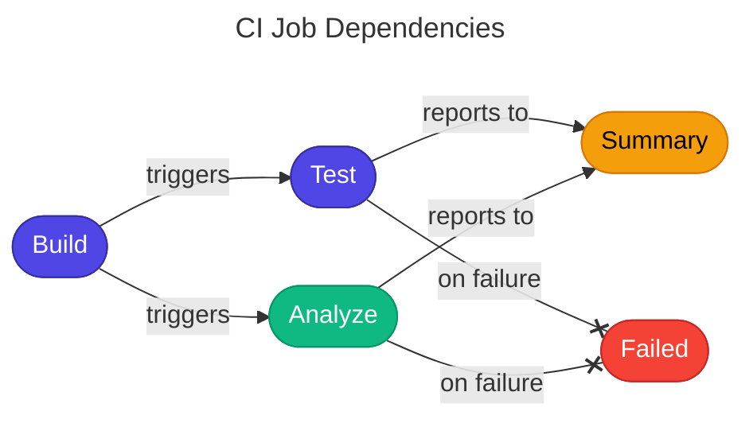

# 🔧 CI - .NET Reusable Workflow

> [!NOTE]
> **Workflow File:** [ci-dotnet-reusable.yml](../../.github/workflows/ci-dotnet-reusable.yml)  
> 🎯 **For DevOps Engineers**: Reusable CI workflow for consistent .NET build and test operations.

<details>
<summary>📍 <strong>Quick Navigation</strong></summary>

| Previous | Index | Next |
|:---------|:------:|--------:|
| [← CI Pipeline](ci-dotnet.md) | [📑 DevOps Index](README.md) | — |

</details>

---

## 📑 Table of Contents

- [📋 Overview](#-overview)
- [🗺️ Pipeline Visualization](#%EF%B8%8F-pipeline-visualization)
- [🎯 Trigger](#-trigger)
- [📥 Inputs](#-inputs)
- [📤 Outputs](#-outputs)
- [📋 Jobs & Steps](#-jobs--steps)
- [🔐 Prerequisites](#-prerequisites)
- [📦 Artifacts](#-artifacts)
- [🔧 Environment Variables](#-environment-variables)
- [🚀 Usage Examples](#-usage-examples)
- [🔍 Troubleshooting](#-troubleshooting)
- [🔗 Related Documentation](#-related-documentation)

---

## 📋 Overview

This is a reusable workflow that builds, tests, and analyzes .NET solutions. It can be called from other workflows with customizable parameters, enabling consistent CI practices across multiple pipelines.

### Key Features

| Feature                   | Description                               |
| ------------------------- | ----------------------------------------- |
| 🔄 **Fully Reusable**     | Via `workflow_call` trigger               |
| 🔨 **Configurable Build** | With version generation                   |
| 🧪 **Test Execution**     | With code coverage (Cobertura)            |
| 🔍 **Code Analysis**      | Formatting analysis with `dotnet format`  |
| 📊 **Detailed Summaries** | Job summaries and status badges           |
| 📦 **Artifact Upload**    | Per-platform builds, tests, and coverage  |
| 🖥️ **Cross-Platform**     | Always runs on Ubuntu, Windows, and macOS |

---

## 🗺️ Pipeline Visualization

```mermaid
---
title: CI - .NET Reusable Workflow Pipeline
---
flowchart LR
    %% ===== TRIGGER =====
    subgraph TriggerGroup["🎯 Trigger"]
        workflow_call(["workflow_call"])
    end

    %% ===== INPUT PARAMETERS =====
    subgraph InputsGroup["⚙️ Inputs"]
        direction LR
        config[/"configuration"/]
        dotnet[/"dotnet-version"/]
        solution[/"solution-file"/]
        analysis_flag[/"enable-code-analysis"/]
    end

    %% ===== BUILD JOB =====
    subgraph BuildJob["🔨 Build Job (Matrix)"]
        direction LR

        subgraph BuildMatrix["Cross-Platform Build"]
            b_ubuntu["Ubuntu"]
            b_windows["Windows"]
            b_macos["macOS"]
        end

        b_checkout["Checkout Repository"]
        b_setup["Setup .NET SDK"]
        b_workload["Update Workloads"]
        b_version["Generate Version"]
        b_restore["Restore Dependencies"]
        b_build["Build Solution"]
        b_upload["Upload Artifacts"]
        b_summary["Build Summary"]
    end

    %% ===== TEST JOB =====
    subgraph TestJob["🧪 Test Job (Matrix)"]
        direction LR

        subgraph TestMatrix["Cross-Platform Test"]
            t_ubuntu["Ubuntu"]
            t_windows["Windows"]
            t_macos["macOS"]
        end

        t_checkout["Checkout Repository"]
        t_setup["Setup .NET SDK"]
        t_workload["Update Workloads"]
        t_restore["Restore Dependencies"]
        t_build["Build Solution"]
        t_test["Run Tests + Coverage"]
        t_report["Publish Results"]
        t_upload["Upload Artifacts"]
        t_summary["Test Summary"]
    end

    %% ===== ANALYZE JOB =====
    subgraph AnalyzeJob["🔍 Analyze Job"]
        direction LR
        a_checkout["Checkout Repository"]
        a_setup["Setup .NET SDK"]
        a_workload["Update Workloads"]
        a_restore["Restore Dependencies"]
        a_format["Verify Formatting"]
        a_summary["Analysis Summary"]
        a_fail["Fail on Issues"]
    end

    %% ===== SUMMARY JOB =====
    subgraph SummaryJob["📊 Summary Job"]
        s_generate["Generate Summary"]
    end

    %% ===== FAILURE HANDLER =====
    subgraph FailureJob["❌ Failure Handler"]
        f_report["Report Failure"]
    end

    %% ===== WORKFLOW OUTPUTS =====
    subgraph OutputsGroup["📤 Outputs"]
        out_version[/"build-version"/]
        out_build[/"build-result"/]
        out_test[/"test-result"/]
        out_analyze[/"analyze-result"/]
    end

    %% ===== ARTIFACTS =====
    subgraph ArtifactsGroup["📦 Artifacts (per-platform)"]
        art_build[/"build-artifacts-{os}"/]
        art_test[/"test-results-{os}"/]
        art_cov[/"code-coverage-{os}"/]
    end

    %% Trigger flow - workflow initialization
    workflow_call -->|receives| InputsGroup
    InputsGroup -->|configures| BuildMatrix

    %% Build flow - compile and package on all platforms
    BuildMatrix -->|parallel builds| b_checkout
    b_checkout -->|clone repo| b_setup
    b_setup -->|install SDK| b_workload
    b_workload -->|update| b_version
    b_version -->|set version| b_restore
    b_restore -->|restore packages| b_build
    b_build -->|compile| b_upload
    b_upload -->|store artifacts| b_summary
    b_build -->|outputs| out_version

    %% Test flow - depends on build completion
    b_summary -->|on success| TestMatrix
    TestMatrix -->|parallel tests| t_checkout
    t_checkout -->|clone repo| t_setup
    t_setup -->|install SDK| t_workload
    t_workload -->|update| t_restore
    t_restore -->|restore packages| t_build
    t_build -->|compile| t_test
    t_test -->|execute tests| t_report
    t_report -->|publish| t_upload
    t_upload -->|store results| t_summary

    %% Analyze flow - depends on build completion
    b_summary -->|on success| a_checkout
    analysis_flag -.->|if enabled| a_checkout
    a_checkout -->|clone repo| a_setup
    a_setup -->|install SDK| a_workload
    a_workload -->|update| a_restore
    a_restore -->|restore packages| a_format
    a_format -->|check format| a_summary
    a_summary -->|evaluate| a_fail

    %% Summary flow - aggregate all results
    t_summary -->|report status| s_generate
    a_summary -->|report status| s_generate

    %% Failure flow - error paths
    t_test --x|on failure| f_report
    a_format --x|on failure| f_report

    %% Output connections - export results
    b_summary -->|outputs| out_build
    t_summary -->|outputs| out_test
    a_summary -->|outputs| out_analyze

    %% Artifact connections - store files
    b_upload -->|stores| art_build
    t_upload -->|stores| art_test
    t_upload -->|stores| art_cov

    %% ===== STYLING DEFINITIONS =====
    %% Primary components: Indigo - main processes/services
    classDef primary fill:#4F46E5,stroke:#3730A3,color:#FFFFFF
    %% Secondary components: Emerald - secondary elements
    classDef secondary fill:#10B981,stroke:#059669,color:#FFFFFF
    %% Data stores: Amber - artifacts and outputs
    classDef datastore fill:#F59E0B,stroke:#D97706,color:#000000
    %% External systems: Gray - reusable/external calls
    classDef external fill:#6B7280,stroke:#4B5563,color:#FFFFFF,stroke-dasharray: 5 5
    %% Error/failure states: Red - error handling
    classDef failed fill:#F44336,stroke:#C62828,color:#FFFFFF
    %% Triggers: Indigo light - entry points
    classDef trigger fill:#818CF8,stroke:#4F46E5,color:#FFFFFF
    %% Inputs: Light background - parameters
    classDef input fill:#F3F4F6,stroke:#6B7280,color:#000000
    %% Matrix: Light emerald - parallel execution
    classDef matrix fill:#D1FAE5,stroke:#10B981,color:#000000

    %% Subgraph background styling - lighter shades
    style TriggerGroup fill:#EEF2FF,stroke:#4F46E5,stroke-width:2px
    style InputsGroup fill:#F3F4F6,stroke:#6B7280,stroke-width:2px
    style BuildJob fill:#E0E7FF,stroke:#4F46E5,stroke-width:2px
    style BuildMatrix fill:#D1FAE5,stroke:#10B981,stroke-width:1px
    style TestJob fill:#E0E7FF,stroke:#4F46E5,stroke-width:2px
    style TestMatrix fill:#D1FAE5,stroke:#10B981,stroke-width:1px
    style AnalyzeJob fill:#ECFDF5,stroke:#10B981,stroke-width:2px
    style SummaryJob fill:#ECFDF5,stroke:#10B981,stroke-width:2px
    style FailureJob fill:#FEE2E2,stroke:#F44336,stroke-width:2px
    style OutputsGroup fill:#FEF3C7,stroke:#F59E0B,stroke-width:2px
    style ArtifactsGroup fill:#FEF3C7,stroke:#F59E0B,stroke-width:2px

    %% Apply styles to nodes
    class workflow_call trigger
    class config,dotnet,solution,analysis_flag input
    class b_ubuntu,b_windows,b_macos,t_ubuntu,t_windows,t_macos matrix
    class b_checkout,b_setup,b_workload,b_version,b_restore,b_build,b_upload,b_summary primary
    class t_checkout,t_setup,t_workload,t_restore,t_build,t_test,t_report,t_upload,t_summary primary
    class a_checkout,a_setup,a_workload,a_restore,a_format,a_summary,a_fail secondary
    class s_generate secondary
    class f_report failed
    class out_version,out_build,out_test,out_analyze datastore
    class art_build,art_test,art_cov datastore
```



---

## 🎯 Trigger

This workflow is triggered exclusively via `workflow_call` from other workflows.

```yaml
on:
  workflow_call:
    inputs: # ...
    outputs: # ...
```

> 💡 **Note:** This workflow cannot be triggered directly - it must be called from another workflow.

---

## 📥 Inputs

| Input                        | Type      | Required | Default           | Description                                                 |
| ---------------------------- | --------- | :------: | ----------------- | ----------------------------------------------------------- |
| `configuration`              | `string`  |    ❌    | `Release`         | Build configuration (Release/Debug)                         |
| `dotnet-version`             | `string`  |    ❌    | `10.0.x`          | .NET SDK version to use                                     |
| `solution-file`              | `string`  |    ❌    | `app.sln`         | Path to the solution file                                   |
| `test-results-artifact-name` | `string`  |    ❌    | `test-results`    | Base name for test results artifact (OS suffix added)       |
| `build-artifacts-name`       | `string`  |    ❌    | `build-artifacts` | Base name for build artifacts (OS suffix added)             |
| `coverage-artifact-name`     | `string`  |    ❌    | `code-coverage`   | Base name for code coverage artifact (OS suffix added)      |
| `artifact-retention-days`    | `number`  |    ❌    | `30`              | Days to retain test/coverage artifacts                      |
| `runs-on`                    | `string`  |    ❌    | `ubuntu-latest`   | Runner for analyze and summary jobs (build/test use matrix) |
| `enable-code-analysis`       | `boolean` |    ❌    | `true`            | Enable code formatting analysis                             |
| `fail-on-format-issues`      | `boolean` |    ❌    | `true`            | Fail workflow on formatting issues                          |

---

## 📤 Outputs

| Output           | Description                                          |
| ---------------- | ---------------------------------------------------- |
| `build-version`  | The generated build version (e.g., `1.0.42`)         |
| `build-result`   | Build job result (`success`, `failure`, `cancelled`) |
| `test-result`    | Test job result                                      |
| `analyze-result` | Analysis job result                                  |

---

## 📋 Jobs & Steps

### Job 1: 🔨 Build

**Purpose:** Compile the solution and generate build artifacts on all platforms.

| Property    | Value                                                     |
| ----------- | --------------------------------------------------------- |
| **Runner**  | Matrix: `ubuntu-latest`, `windows-latest`, `macos-latest` |
| **Timeout** | 15 minutes                                                |
| **Outputs** | `build-version`                                           |

#### Build Steps

| Step                      | Description                                    |
| ------------------------- | ---------------------------------------------- |
| 📥 Checkout repository    | Clone with full history (`fetch-depth: 0`)     |
| 🔧 Setup .NET SDK         | Install specified .NET version                 |
| ☁️ Update .NET workloads  | Update .NET workloads                          |
| 🏷️ Generate build version | Create version: `1.0.${{ github.run_number }}` |
| 📥 Restore dependencies   | `dotnet restore` with minimal verbosity        |
| 🔨 Build solution         | `dotnet build` with CI flags                   |
| 📤 Upload build artifacts | Upload compiled binaries                       |
| 📊 Generate build summary | Create status badge and summary                |

### Job 2: 🧪 Test

**Purpose:** Execute tests with code coverage collection on all platforms.

| Property    | Value                                                     |
| ----------- | --------------------------------------------------------- |
| **Runner**  | Matrix: `ubuntu-latest`, `windows-latest`, `macos-latest` |
| **Timeout** | 30 minutes                                                |
| **Needs**   | `build`                                                   |

#### Matrix Strategy

```yaml
strategy:
  fail-fast: false
  matrix:
    os: [ubuntu-latest, windows-latest, macos-latest]
```

> 💡 **Note:** Cross-platform testing is always enabled to catch platform-specific issues early.

#### Test Steps

| Step                       | Description                                 |
| -------------------------- | ------------------------------------------- |
| 📥 Checkout repository     | Clone repository                            |
| 🔧 Setup .NET SDK          | Install .NET SDK                            |
| ☁️ Update .NET workloads   | Update workloads                            |
| 📥 Restore dependencies    | Restore NuGet packages                      |
| 🔨 Build solution          | Build for testing                           |
| 🧪 Run tests with coverage | Execute tests with Cobertura coverage       |
| 📋 Publish test results    | Use `dorny/test-reporter` for GitHub checks |
| 📤 Upload test results     | Upload `.trx` files                         |
| 📤 Upload code coverage    | Upload Cobertura XML                        |
| 📊 Generate test summary   | Create test status summary                  |

### Job 3: 🔍 Analyze

**Purpose:** Verify code formatting compliance.

| Property      | Value                                |
| ------------- | ------------------------------------ |
| **Runner**    | `${{ inputs.runs-on }}`              |
| **Timeout**   | 15 minutes                           |
| **Needs**     | `build`                              |
| **Condition** | `${{ inputs.enable-code-analysis }}` |

#### Analysis Steps

| Step                         | Description                                              |
| ---------------------------- | -------------------------------------------------------- |
| 📥 Checkout repository       | Clone repository                                         |
| 🔧 Setup .NET SDK            | Install .NET SDK                                         |
| ☁️ Update .NET workloads     | Update workloads                                         |
| 📥 Restore dependencies      | Restore packages                                         |
| 🎨 Verify code formatting    | Run `dotnet format --verify-no-changes`                  |
| 📊 Generate analysis summary | Create analysis summary with fix instructions            |
| ❌ Fail on format issues     | Exit if issues found and `fail-on-format-issues` is true |

### Job 4: 📊 Summary

**Purpose:** Generate overall workflow summary.

| Property      | Value                      |
| ------------- | -------------------------- |
| **Runner**    | `${{ inputs.runs-on }}`    |
| **Timeout**   | 5 minutes                  |
| **Needs**     | `build`, `test`, `analyze` |
| **Condition** | `always()`                 |

#### Summary Contents

- Overall CI status badge
- Job results table (Build, Test, Analyze)
- Workflow details (branch, commit, actor)
- Artifacts list with retention info
- Action required section on failure

### Job 5: ❌ Failed

**Purpose:** Report CI failures.

| Property      | Value                      |
| ------------- | -------------------------- |
| **Runner**    | `${{ inputs.runs-on }}`    |
| **Timeout**   | 5 minutes                  |
| **Needs**     | `build`, `test`, `analyze` |
| **Condition** | `failure()`                |

---

## 🔐 Prerequisites

### Required Permissions

```yaml
permissions:
  contents: read # Required for checkout
  checks: write # Required for test reporter
  pull-requests: write # Required for PR status
```

---

## 📦 Artifacts

| Artifact          | Contents                                                    | Retention                               |
| ----------------- | ----------------------------------------------------------- | --------------------------------------- |
| `build-artifacts` | Compiled binaries (`**/bin/${{ inputs.configuration }}/**`) | 7 days                                  |
| `test-results`    | Test results (`.trx` files)                                 | `${{ inputs.artifact-retention-days }}` |
| `code-coverage`   | Coverage reports (`coverage.cobertura.xml`)                 | `${{ inputs.artifact-retention-days }}` |

---

## 🔧 Environment Variables

```yaml
env:
  DOTNET_SKIP_FIRST_TIME_EXPERIENCE: true
  DOTNET_NOLOGO: true
  DOTNET_CLI_TELEMETRY_OPTOUT: true
```

---

## 🚀 Usage Examples

### Basic Usage

```yaml
jobs:
  ci:
    uses: ./.github/workflows/ci-dotnet-reusable.yml
    with:
      configuration: "Release"
      dotnet-version: "10.0.x"
    secrets: inherit
```

### Full Configuration

```yaml
jobs:
  ci:
    uses: ./.github/workflows/ci-dotnet-reusable.yml
    with:
      configuration: "Release"
      dotnet-version: "10.0.x"
      solution-file: "MyApp.sln"
      test-results-artifact-name: "my-test-results"
      build-artifacts-name: "my-build-artifacts"
      coverage-artifact-name: "my-coverage"
      artifact-retention-days: 14
      runs-on: "ubuntu-latest"
      enable-code-analysis: true
      fail-on-format-issues: true
      enable-matrix: true
    secrets: inherit
```

### Debug Build with Relaxed Analysis

```yaml
jobs:
  ci:
    uses: ./.github/workflows/ci-dotnet-reusable.yml
    with:
      configuration: "Debug"
      enable-code-analysis: true
      fail-on-format-issues: false # Warn but don't fail
    secrets: inherit
```

### Cross-Platform Testing

```yaml
jobs:
  ci:
    uses: ./.github/workflows/ci-dotnet-reusable.yml
    with:
      enable-matrix: true # Test on Ubuntu, Windows, and macOS
    secrets: inherit
```

---

## 🔍 Troubleshooting

### Common Issues

| Issue                     | Cause                  | Solution                          |
| ------------------------- | ---------------------- | --------------------------------- |
| Build fails               | Missing dependencies   | Check `dotnet restore` output     |
| Tests fail on specific OS | Platform-specific code | Review matrix job logs            |
| Coverage not generated    | Test framework issue   | Verify test project configuration |
| Format check fails        | Code style violations  | Run `dotnet format` locally       |
| Workload update fails     | Permission issues      | Check runner configuration        |

### Local Debugging

```bash
# Full CI simulation
dotnet restore app.sln
dotnet build app.sln --configuration Release
dotnet test app.sln --configuration Release --collect:"XPlat Code Coverage"
dotnet format app.sln --verify-no-changes
```

### Fixing Format Issues

```bash
# Auto-fix all formatting issues
dotnet format app.sln

# Verify changes
dotnet format app.sln --verify-no-changes

# Fix specific file types
dotnet format app.sln --include "**/*.cs"
```

---

## 📊 Job Dependencies Graph



---

## 🔗 Related Documentation

| Resource                                                                                          | Description               |
| ------------------------------------------------------------------------------------------------- | ------------------------- |
| [CI - .NET Build and Test](./ci-dotnet.md)                                                        | Main CI workflow          |
| [CD - Azure Deployment](./azure-dev.md)                                                           | Azure deployment workflow |
| [GitHub Reusable Workflows](https://docs.github.com/en/actions/using-workflows/reusing-workflows) | GitHub documentation      |
| [.NET SDK Documentation](https://docs.microsoft.com/en-us/dotnet/)                                | Microsoft .NET docs       |
| [Microsoft Testing Platform](https://learn.microsoft.com/en-us/dotnet/core/testing/)              | Testing documentation     |

---

[⬆️ Back to top](#-ci---net-reusable-workflow)
