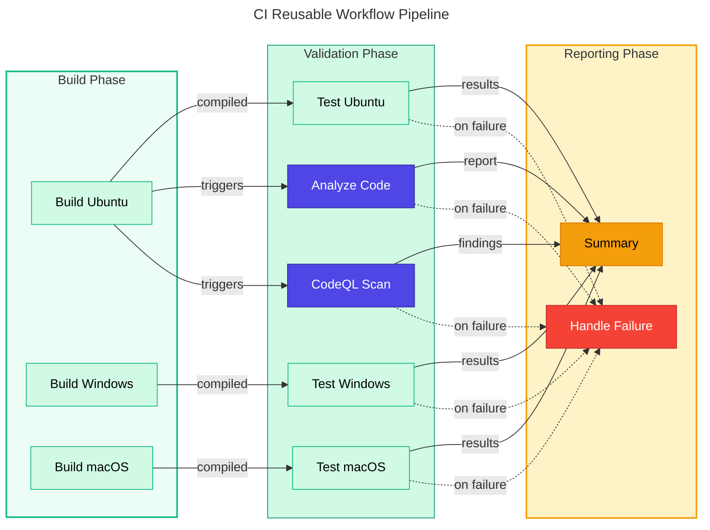
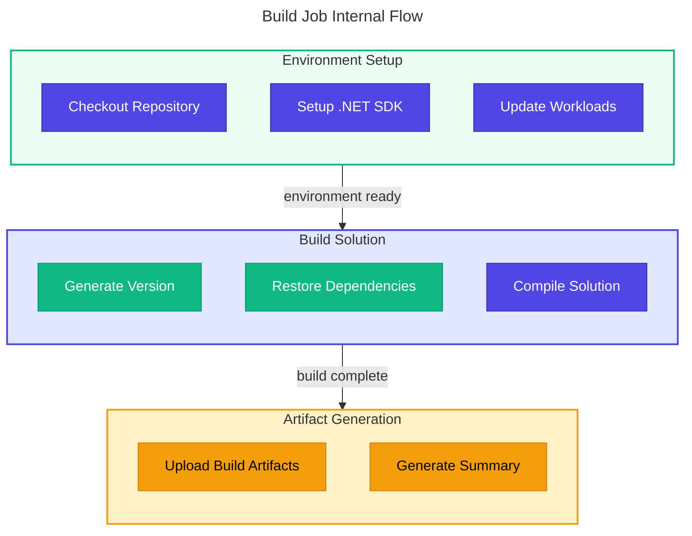

# CI - .NET Reusable Workflow Documentation

## Table of Contents

- [Overview](#-overview)
- [Triggers](#-triggers)
- [Pipeline Flow](#-pipeline-flow)
- [Jobs Breakdown](#-jobs-breakdown)
- [Inputs and Parameters](#-inputs-and-parameters)
- [Secrets and Variables](#-secrets-and-variables)
- [Permissions and Security Model](#-permissions-and-security-model)
- [Environments and Deployment Strategy](#-environments-and-deployment-strategy)
- [Failure Handling and Recovery](#-failure-handling-and-recovery)
- [How to Run This Workflow](#-how-to-run-this-workflow)
- [Extensibility and Customization](#-extensibility-and-customization)
- [Known Limitations and Gotchas](#-known-limitations-and-gotchas)
- [Ownership and Maintenance](#-ownership-and-maintenance)
- [Assumptions and Gaps](#-assumptions-and-gaps)
- [Artifacts Generated](#artifacts-generated)

## 🧭 Overview

This is a comprehensive reusable CI workflow for .NET solutions that performs cross-platform builds, testing with code coverage, code formatting analysis, and CodeQL security scanning. It is designed to be called by other workflows and provides consistent CI validation across all .NET projects.

### In-Scope Responsibilities

- Cross-platform compilation (Ubuntu, Windows, macOS) via matrix strategy
- Cross-platform testing with code coverage (Cobertura format)
- Code formatting verification against `.editorconfig` standards
- CodeQL security vulnerability scanning (always enabled)
- Test result publishing with GitHub check run integration
- Build artifact generation per platform
- Comprehensive workflow summary generation
- Failure reporting with diagnostic information

### Out-of-Scope Responsibilities

- Triggering decisions (delegated to caller workflows)
- Deployment operations
- Infrastructure management
- Environment-specific configurations

---

## ⚙️ Triggers

This workflow is triggered exclusively via `workflow_call` from other workflows. It does not have direct triggers.

### Caller Workflow Example

```yaml
jobs:
  ci:
    uses: ./.github/workflows/ci-dotnet-reusable.yml
    with:
      configuration: 'Release'
      dotnet-version: '10.0.x'
      solution-file: 'app.sln'
    secrets: inherit
```

---

## 🔄 Pipeline Flow

### Mermaid Diagram



### Interpretation Notes

- **Matrix parallelism**: Build and test jobs run on three platforms simultaneously
- **Sequential dependency**: Tests depend on successful builds per platform
- **Parallel validation**: Analyze and CodeQL run in parallel after build completes
- **Summary aggregation**: Waits for all jobs before generating comprehensive report
- **Failure isolation**: `fail-fast: false` ensures all platforms complete even if one fails

### Build Job Internal Flow



---

## 🛠 Jobs Breakdown

| Job | Runner | Responsibility | Dependencies | Conditions |
|-----|--------|---------------|--------------|------------|
| `build` | Matrix (ubuntu, windows, macos) | Compile solution, generate artifacts | None | Always |
| `test` | Matrix (ubuntu, windows, macos) | Execute tests, generate coverage | `build` | Always |
| `analyze` | Configurable (`runs-on` input) | Verify code formatting | `build` | `enable-code-analysis=true` |
| `codeql` | Configurable (`runs-on` input) | Security vulnerability scanning | `build` | Always |
| `summary` | Configurable (`runs-on` input) | Aggregate results into report | All jobs | Always |
| `on-failure` | Configurable (`runs-on` input) | Report failure details | All jobs | Only on failure |

### Build Job (Per Platform)

| Step | Purpose |
|------|---------|
| Checkout | Clone repository with full history |
| Setup .NET SDK | Install specified .NET version |
| Update workloads | Ensure latest .NET workloads |
| Generate version | Create version `1.0.{run_number}` |
| Restore dependencies | Restore NuGet packages |
| Build solution | Compile with CI build flags |
| Upload artifacts | Store binaries per platform |
| Generate summary | Create build status report |

### Test Job (Per Platform)

| Step | Purpose |
|------|---------|
| Checkout | Clone repository |
| Setup .NET SDK | Install .NET for testing |
| Update workloads | Ensure workloads available |
| Restore dependencies | Restore NuGet packages |
| Build solution | Rebuild for test execution |
| Run tests | Execute with coverage collection |
| Publish results | Create GitHub check runs |
| Upload test results | Store `.trx` files |
| Upload coverage | Store Cobertura XML |
| Generate summary | Create test status report |

### Analyze Job

| Step | Purpose |
|------|---------|
| Checkout | Clone repository |
| Setup .NET SDK | Install .NET for formatting |
| Update workloads | Ensure workloads available |
| Restore dependencies | Restore NuGet packages |
| Verify formatting | Check `.editorconfig` compliance |
| Generate summary | Report formatting status |
| Fail on issues | Exit if configured and issues found |

### CodeQL Job

| Step | Purpose |
|------|---------|
| Checkout | Clone with full history for blame |
| Setup .NET SDK | Install .NET for autobuild |
| Initialize CodeQL | Configure C# analysis |
| Autobuild | Build for CodeQL analysis |
| Perform analysis | Execute security queries |
| Upload SARIF | Store results for Security tab |
| Generate summary | Report scan status |

---

## ⚙️ Inputs and Parameters

### Required Inputs

None - all inputs have defaults.

### Optional Inputs

| Input | Type | Default | Description |
|-------|------|---------|-------------|
| `configuration` | string | `Release` | Build configuration (Release/Debug) |
| `dotnet-version` | string | `10.0.x` | .NET SDK version to use |
| `solution-file` | string | `app.sln` | Path to the solution file |
| `test-results-artifact-name` | string | `test-results` | Name for test results artifact |
| `build-artifacts-name` | string | `build-artifacts` | Name for build artifacts |
| `coverage-artifact-name` | string | `code-coverage` | Name for code coverage artifact |
| `artifact-retention-days` | number | `30` | Days to retain artifacts |
| `runs-on` | string | `ubuntu-latest` | Runner for analyze/summary jobs |
| `enable-code-analysis` | boolean | `true` | Enable code formatting analysis |
| `fail-on-format-issues` | boolean | `true` | Fail workflow on formatting issues |

### Outputs

| Output | Description |
|--------|-------------|
| `build-version` | Generated build version (`1.0.{run_number}`) |
| `build-result` | Build job result (success/failure) |
| `test-result` | Test job result (success/failure) |
| `analyze-result` | Analysis job result (success/failure/skipped) |
| `codeql-result` | CodeQL scan result (success/failure) |

---

## 🔐 Secrets and Variables

### Secrets

This workflow receives secrets via `secrets: inherit` from caller workflows. No explicit secrets are required.

### Environment Variables (Workflow-Level)

| Variable | Value | Purpose |
|----------|-------|---------|
| `DOTNET_SKIP_FIRST_TIME_EXPERIENCE` | `true` | Skip .NET welcome experience |
| `DOTNET_NOLOGO` | `true` | Suppress .NET CLI logo |
| `DOTNET_CLI_TELEMETRY_OPTOUT` | `true` | Disable .NET telemetry |

---

## 🔐 Permissions and Security Model

### GitHub Actions Permissions

| Permission | Level | Purpose |
|------------|-------|---------|
| `contents` | read | Read repository contents for checkout |
| `checks` | write | Create check runs for test results |
| `pull-requests` | write | Post comments on pull requests |
| `security-events` | write | Upload CodeQL SARIF results |

### CodeQL Security Scanning

> [!IMPORTANT]
> CodeQL security scanning runs on every CI execution. Results are uploaded to GitHub Security tab regardless of findings.

| Configuration | Value | Purpose |
|--------------|-------|---------|
| Languages | `csharp` | Scan C# code only |
| Query suites | `security-extended`, `security-and-quality` | Extended security + quality queries |
| Paths ignored | `**/tests/**`, `**/test/**`, `**/*.test.cs`, `**/*.Tests.cs` | Exclude test code from scanning |
| Upload | `always` | Upload SARIF regardless of findings |

### Security Best Practices Applied

| Practice | Implementation |
|----------|---------------|
| Pinned action versions | All actions use SHA-pinned versions |
| Full git history | `fetch-depth: 0` for accurate CodeQL blame |
| Always-on security scanning | CodeQL runs on every CI execution |
| SARIF upload | Results visible in GitHub Security tab |

---

## 🌐 Environments and Deployment Strategy

This workflow does not deploy to any environment. It is purely a CI validation workflow.

---

## ⚠️ Failure Handling and Recovery

### Matrix Strategy Configuration

> [!NOTE]
> Setting `fail-fast: false` ensures all platforms complete their builds even if one fails, providing comprehensive failure information across all target environments.

```yaml
strategy:
  fail-fast: false
  matrix:
    os: [ubuntu-latest, windows-latest, macos-latest]
```

### Failure Behavior by Job

| Job | Failure Behavior |
|-----|-----------------|
| Build | Blocks dependent jobs; reports in summary |
| Test | Reports failure; does not block other platforms |
| Analyze | Optional failure based on `fail-on-format-issues` |
| CodeQL | Always completes; reports in Security tab |

### Manual Recovery

1. Review job logs for specific failures
2. For formatting issues: `dotnet format {solution-file}` locally
3. For test failures: Run tests locally with `dotnet test`
4. For CodeQL issues: Review alerts in Security tab

---

## 🚀 How to Run This Workflow

### Running via Caller Workflow

This workflow cannot be run directly. Use the caller workflow:

1. Navigate to **Actions** tab
2. Select **CI - .NET Build and Test**
3. Click **Run workflow**
4. Configure inputs as needed

### Calling from Custom Workflow

```yaml
jobs:
  ci:
    uses: ./.github/workflows/ci-dotnet-reusable.yml
    with:
      configuration: 'Release'
      dotnet-version: '10.0.x'
      solution-file: 'app.sln'
      enable-code-analysis: true
      fail-on-format-issues: true
    secrets: inherit
```

---

## 🧩 Extensibility and Customization

### Safe Extension Points

| Extension Point | How to Extend |
|-----------------|---------------|
| Additional platforms | Add to matrix `os` list |
| Additional .NET versions | Create version matrix |
| Custom test commands | Modify test step |
| Additional CodeQL languages | Add to `languages` list |

### What Should NOT Be Changed

> [!WARNING]
> Action SHA pins are security-critical. Unpinning actions exposes the workflow to supply chain attacks.

| Component | Reason |
|-----------|--------|
| Action SHA pins | Security; prevents supply chain attacks |
| CodeQL always-on | Security requirement; must run every CI |
| Permission scope | Minimum required; changes need security review |
| Artifact naming pattern | Consistency; downstream consumers depend on names |

### Adding Additional Platforms

```yaml
strategy:
  matrix:
    os: [ubuntu-latest, windows-latest, macos-latest, ubuntu-22.04]
```

### Adding Multi-Version Testing

```yaml
strategy:
  matrix:
    os: [ubuntu-latest, windows-latest, macos-latest]
    dotnet: ['8.0.x', '9.0.x', '10.0.x']
```

---

## ⚠️ Known Limitations and Gotchas

### Limitations

| Limitation | Impact | Workaround |
|------------|--------|------------|
| Fixed platform matrix | Cannot customize per-caller | Fork workflow if needed |
| Single solution support | Cannot build multiple solutions | Create separate workflow calls |
| CodeQL C# only | Other languages not scanned | Add language to configuration |

### Non-Obvious Behavior

- **Path-replace-backslashes**: Required for Windows runners in test reporter
- **Fail-on-empty: false**: Prevents failure when test projects have no tests
- **Continue-on-error in analyze**: Allows summary to show formatting status even on failure
- **Full git history**: Required for accurate CodeQL blame tracking

### Platform-Specific Considerations

| Platform | Consideration |
|----------|--------------|
| Windows | Path separators require `path-replace-backslashes: true` |
| macOS | Longer runner startup times |
| Ubuntu | Default for single-runner jobs (fastest startup) |

---

## 👥 Ownership and Maintenance

### Owning Team

| Role | Responsibility |
|------|----------------|
| Platform Engineering | Workflow structure, matrix configuration |
| Security Team | CodeQL configuration, query suites |
| Development Team | Solution-specific customizations |

### Review Expectations

- Action version updates require security review
- CodeQL query changes require security team approval
- Matrix changes require performance testing

### Update Schedule

| Component | Update Frequency |
|-----------|-----------------|
| Action SHAs | Monthly security review |
| CodeQL queries | Quarterly or on advisory |
| .NET SDK version | Per project requirements |

---

## 📋 Assumptions and Gaps

### Assumptions Made

1. **Solution file exists**: `app.sln` (or specified file) exists in repository root
2. **Test projects exist**: At least one test project in solution
3. **EditorConfig configured**: `.editorconfig` file present for formatting analysis
4. **Cross-platform compatible**: Solution builds on all three platforms

### Gaps Identified

| Gap | Impact | Recommendation |
|-----|--------|----------------|
| No dependency caching | Slower builds | Add NuGet cache action |
| No code coverage thresholds | Coverage can degrade | Add coverage enforcement |
| No parallel test execution | Potentially slower tests | Consider `--parallel` flag |
| Fixed timeout values | May not fit all solutions | Make timeouts configurable |

### Diagram Simplifications

- Matrix execution shown as parallel tracks; actual scheduling depends on runner availability
- Internal step flow abbreviated for clarity
- Failure paths shown with dotted lines; actual flow depends on `fail-fast` setting

---

## Artifacts Generated

### Per-Platform Artifacts

| Artifact | Contents | Retention |
|----------|----------|-----------|
| `build-artifacts-{os}` | Compiled binaries (Release configuration) | Configurable (default 30 days) |
| `test-results-{os}` | Test execution results (`.trx` format) | Configurable (default 30 days) |
| `code-coverage-{os}` | Coverage reports (Cobertura XML) | Configurable (default 30 days) |

### Single Artifacts

| Artifact | Contents | Retention |
|----------|----------|-----------|
| `codeql-sarif-results` | Security scan results (SARIF format) | Configurable (default 30 days) |

### Artifact Usage

- **Build artifacts**: Used for deployment or further processing
- **Test results**: Displayed in GitHub check runs; downloadable for analysis
- **Code coverage**: Integration with coverage reporting tools
- **SARIF results**: Displayed in GitHub Security tab

---

## 📚 See Also

- [CI - .NET Build and Test Workflow](ci-dotnet.md) - Entry point workflow that calls this reusable workflow
- [CD - Azure Deployment Workflow](azure-dev.md) - Deployment workflow that uses CI output
