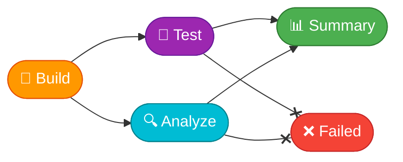

# 🔧 CI - .NET Reusable Workflow

> **Workflow File:** [ci-dotnet-reusable.yml](../../.github/workflows/ci-dotnet-reusable.yml)

---

## 📑 Table of Contents

- [📋 Overview](#-overview)
- [🗺️ Pipeline Visualization](#%EF%B8%8F-pipeline-visualization)
- [🎯 Trigger](#-trigger)
- [📥 Inputs](#-inputs)
- [📤 Outputs](#-outputs)
- [📋 Jobs & Steps](#-jobs--steps)
- [🔐 Prerequisites](#-prerequisites)
- [📦 Artifacts](#-artifacts)
- [🔧 Environment Variables](#-environment-variables)
- [🚀 Usage Examples](#-usage-examples)
- [🔍 Troubleshooting](#-troubleshooting)
- [🔗 Related Documentation](#-related-documentation)

---

## 📋 Overview

This is a reusable workflow that builds, tests, and analyzes .NET solutions. It can be called from other workflows with customizable parameters, enabling consistent CI practices across multiple pipelines.

### Key Features

| Feature | Description |
| ------- | ----------- |
| 🔄 **Fully Reusable** | Via `workflow_call` trigger |
| 🔨 **Configurable Build** | With version generation |
| 🧪 **Test Execution** | With code coverage (Cobertura) |
| 🔍 **Code Analysis** | Formatting analysis with `dotnet format` |
| 📊 **Detailed Summaries** | Job summaries and status badges |
| 📦 **Artifact Upload** | Builds, tests, and coverage |
| 🖥️ **Cross-Platform** | Optional matrix testing (Ubuntu, Windows, macOS) |

---

## 🗺️ Pipeline Visualization

```mermaid
flowchart LR
    subgraph Trigger["🎯 Trigger"]
        workflow_call([workflow_call])
    end

    subgraph Inputs["⚙️ Inputs"]
        direction LR
        config[/"configuration"/]
        dotnet[/"dotnet-version"/]
        solution[/"solution-file"/]
        matrix_flag[/"enable-matrix"/]
        analysis_flag[/"enable-code-analysis"/]
    end

    subgraph Build["🔨 Build Job"]
        direction LR
        b_checkout["📥 Checkout"]
        b_setup["🔧 Setup .NET SDK"]
        b_workload["☁️ Update Workloads"]
        b_version["🏷️ Generate Version"]
        b_restore["📥 Restore Dependencies"]
        b_build["🔨 Build Solution"]
        b_upload["📤 Upload Artifacts"]
        b_summary["📊 Build Summary"]
    end

    subgraph Test["🧪 Test Job"]
        direction LR
        
        subgraph Matrix["Matrix Strategy"]
            ubuntu["Ubuntu"]
            windows["Windows"]
            macos["macOS"]
        end
        
        t_checkout["📥 Checkout"]
        t_setup["🔧 Setup .NET SDK"]
        t_workload["☁️ Update Workloads"]
        t_restore["📥 Restore Dependencies"]
        t_build["🔨 Build Solution"]
        t_test["🧪 Run Tests + Coverage"]
        t_report["📋 Publish Results"]
        t_upload["📤 Upload Artifacts"]
        t_summary["📊 Test Summary"]
    end

    subgraph Analyze["🔍 Analyze Job"]
        direction LR
        a_checkout["📥 Checkout"]
        a_setup["🔧 Setup .NET SDK"]
        a_workload["☁️ Update Workloads"]
        a_restore["📥 Restore Dependencies"]
        a_format["🎨 Verify Formatting"]
        a_summary["📊 Analysis Summary"]
        a_fail["❌ Fail on Issues"]
    end

    subgraph Summary["📊 Summary Job"]
        s_generate["📊 Generate Summary"]
    end

    subgraph Failure["❌ Failure Handler"]
        f_report["❌ Report Failure"]
    end

    subgraph Outputs["📤 Outputs"]
        out_version[/"build-version"/]
        out_build[/"build-result"/]
        out_test[/"test-result"/]
        out_analyze[/"analyze-result"/]
    end

    subgraph Artifacts["📦 Artifacts"]
        art_build[/"📁 build-artifacts"/]
        art_test[/"📋 test-results"/]
        art_cov[/"📊 code-coverage"/]
    end

    %% Trigger flow
    workflow_call --> Inputs
    Inputs --> b_checkout

    %% Build flow
    b_checkout --> b_setup
    b_setup --> b_workload
    b_workload --> b_version
    b_version --> b_restore
    b_restore --> b_build
    b_build --> b_upload
    b_upload --> b_summary
    b_build --> out_version

    %% Test flow (depends on build)
    b_summary --> t_checkout
    matrix_flag -.->|if enabled| Matrix
    Matrix --> t_checkout
    t_checkout --> t_setup
    t_setup --> t_workload
    t_workload --> t_restore
    t_restore --> t_build
    t_build --> t_test
    t_test --> t_report
    t_report --> t_upload
    t_upload --> t_summary

    %% Analyze flow (depends on build)
    b_summary --> a_checkout
    analysis_flag -.->|if enabled| a_checkout
    a_checkout --> a_setup
    a_setup --> a_workload
    a_workload --> a_restore
    a_restore --> a_format
    a_format --> a_summary
    a_summary --> a_fail

    %% Summary flow
    t_summary --> s_generate
    a_summary --> s_generate

    %% Failure flow
    t_test --x f_report
    a_format --x f_report

    %% Outputs
    b_summary --> out_build
    t_summary --> out_test
    a_summary --> out_analyze

    %% Artifacts
    b_upload --> art_build
    t_upload --> art_test
    t_upload --> art_cov

    %% Styling
    classDef trigger fill:#2196F3,stroke:#1565C0,color:#fff
    classDef input fill:#E1BEE7,stroke:#7B1FA2,color:#000
    classDef build fill:#FF9800,stroke:#E65100,color:#fff
    classDef test fill:#9C27B0,stroke:#6A1B9A,color:#fff
    classDef analyze fill:#00BCD4,stroke:#00838F,color:#fff
    classDef summary fill:#4CAF50,stroke:#2E7D32,color:#fff
    classDef failed fill:#F44336,stroke:#C62828,color:#fff
    classDef output fill:#8BC34A,stroke:#558B2F,color:#fff
    classDef artifact fill:#FFEB3B,stroke:#F57F17,color:#000
    classDef matrix fill:#B2EBF2,stroke:#00838F,color:#000

    class workflow_call trigger
    class config,dotnet,solution,matrix_flag,analysis_flag input
    class b_checkout,b_setup,b_workload,b_version,b_restore,b_build,b_upload,b_summary build
    class t_checkout,t_setup,t_workload,t_restore,t_build,t_test,t_report,t_upload,t_summary test
    class a_checkout,a_setup,a_workload,a_restore,a_format,a_summary,a_fail analyze
    class s_generate summary
    class f_report failed
    class out_version,out_build,out_test,out_analyze output
    class art_build,art_test,art_cov artifact
    class ubuntu,windows,macos,Matrix matrix
```



---

## 🎯 Trigger

This workflow is triggered exclusively via `workflow_call` from other workflows.

```yaml
on:
  workflow_call:
    inputs: # ...
    outputs: # ...
```

> 💡 **Note:** This workflow cannot be triggered directly - it must be called from another workflow.

---

## 📥 Inputs

| Input | Type | Required | Default | Description |
| ----- | ---- | :------: | ------- | ----------- |
| `configuration` | `string` | ❌ | `Release` | Build configuration (Release/Debug) |
| `dotnet-version` | `string` | ❌ | `10.0.x` | .NET SDK version to use |
| `solution-file` | `string` | ❌ | `app.sln` | Path to the solution file |
| `test-results-artifact-name` | `string` | ❌ | `test-results` | Name for test results artifact |
| `build-artifacts-name` | `string` | ❌ | `build-artifacts` | Name for build artifacts |
| `coverage-artifact-name` | `string` | ❌ | `code-coverage` | Name for code coverage artifact |
| `artifact-retention-days` | `number` | ❌ | `30` | Days to retain artifacts |
| `runs-on` | `string` | ❌ | `ubuntu-latest` | Runner for jobs |
| `enable-code-analysis` | `boolean` | ❌ | `true` | Enable code formatting analysis |
| `fail-on-format-issues` | `boolean` | ❌ | `true` | Fail workflow on formatting issues |
| `enable-matrix` | `boolean` | ❌ | `false` | Enable cross-platform matrix testing |

---

## 📤 Outputs

| Output | Description |
| ------ | ----------- |
| `build-version` | The generated build version (e.g., `1.0.42`) |
| `build-result` | Build job result (`success`, `failure`, `cancelled`) |
| `test-result` | Test job result |
| `analyze-result` | Analysis job result |

---

## 📋 Jobs & Steps

### Job 1: 🔨 Build

**Purpose:** Compile the solution and generate build artifacts.

| Property | Value |
| -------- | ----- |
| **Runner** | `${{ inputs.runs-on }}` |
| **Timeout** | 15 minutes |
| **Outputs** | `build-version` |

#### Build Steps

| Step | Description |
| ---- | ----------- |
| 📥 Checkout repository | Clone with full history (`fetch-depth: 0`) |
| 🔧 Setup .NET SDK | Install specified .NET version |
| ☁️ Update .NET workloads | Update .NET workloads |
| 🏷️ Generate build version | Create version: `1.0.${{ github.run_number }}` |
| 📥 Restore dependencies | `dotnet restore` with minimal verbosity |
| 🔨 Build solution | `dotnet build` with CI flags |
| 📤 Upload build artifacts | Upload compiled binaries |
| 📊 Generate build summary | Create status badge and summary |

### Job 2: 🧪 Test

**Purpose:** Execute tests with code coverage collection.

| Property | Value |
| -------- | ----- |
| **Runner** | Matrix: `ubuntu-latest`, `windows-latest`, `macos-latest` (if enabled) |
| **Timeout** | 30 minutes |
| **Needs** | `build` |

#### Matrix Strategy

```yaml
strategy:
  fail-fast: false
  matrix:
    os: ${{ inputs.enable-matrix && fromJson('["ubuntu-latest", "windows-latest", "macos-latest"]') || fromJson('["ubuntu-latest"]') }}
```

#### Test Steps

| Step | Description |
| ---- | ----------- |
| 📥 Checkout repository | Clone repository |
| 🔧 Setup .NET SDK | Install .NET SDK |
| ☁️ Update .NET workloads | Update workloads |
| 📥 Restore dependencies | Restore NuGet packages |
| 🔨 Build solution | Build for testing |
| 🧪 Run tests with coverage | Execute tests with Cobertura coverage |
| 📋 Publish test results | Use `dorny/test-reporter` for GitHub checks |
| 📤 Upload test results | Upload `.trx` files |
| 📤 Upload code coverage | Upload Cobertura XML |
| 📊 Generate test summary | Create test status summary |

### Job 3: 🔍 Analyze

**Purpose:** Verify code formatting compliance.

| Property | Value |
| -------- | ----- |
| **Runner** | `${{ inputs.runs-on }}` |
| **Timeout** | 15 minutes |
| **Needs** | `build` |
| **Condition** | `${{ inputs.enable-code-analysis }}` |

#### Analysis Steps

| Step | Description |
| ---- | ----------- |
| 📥 Checkout repository | Clone repository |
| 🔧 Setup .NET SDK | Install .NET SDK |
| ☁️ Update .NET workloads | Update workloads |
| 📥 Restore dependencies | Restore packages |
| 🎨 Verify code formatting | Run `dotnet format --verify-no-changes` |
| 📊 Generate analysis summary | Create analysis summary with fix instructions |
| ❌ Fail on format issues | Exit if issues found and `fail-on-format-issues` is true |

### Job 4: 📊 Summary

**Purpose:** Generate overall workflow summary.

| Property | Value |
| -------- | ----- |
| **Runner** | `${{ inputs.runs-on }}` |
| **Timeout** | 5 minutes |
| **Needs** | `build`, `test`, `analyze` |
| **Condition** | `always()` |

#### Summary Contents

- Overall CI status badge
- Job results table (Build, Test, Analyze)
- Workflow details (branch, commit, actor)
- Artifacts list with retention info
- Action required section on failure

### Job 5: ❌ Failed

**Purpose:** Report CI failures.

| Property | Value |
| -------- | ----- |
| **Runner** | `${{ inputs.runs-on }}` |
| **Timeout** | 5 minutes |
| **Needs** | `build`, `test`, `analyze` |
| **Condition** | `failure()` |

---

## 🔐 Prerequisites

### Required Permissions

```yaml
permissions:
  contents: read       # Required for checkout
  checks: write        # Required for test reporter
  pull-requests: write # Required for PR status
```

---

## 📦 Artifacts

| Artifact | Contents | Retention |
| -------- | -------- | --------- |
| `build-artifacts` | Compiled binaries (`**/bin/${{ inputs.configuration }}/**`) | 7 days |
| `test-results` | Test results (`.trx` files) | `${{ inputs.artifact-retention-days }}` |
| `code-coverage` | Coverage reports (`coverage.cobertura.xml`) | `${{ inputs.artifact-retention-days }}` |

---

## 🔧 Environment Variables

```yaml
env:
  DOTNET_SKIP_FIRST_TIME_EXPERIENCE: true
  DOTNET_NOLOGO: true
  DOTNET_CLI_TELEMETRY_OPTOUT: true
```

---

## 🚀 Usage Examples

### Basic Usage

```yaml
jobs:
  ci:
    uses: ./.github/workflows/ci-dotnet-reusable.yml
    with:
      configuration: 'Release'
      dotnet-version: '10.0.x'
    secrets: inherit
```

### Full Configuration

```yaml
jobs:
  ci:
    uses: ./.github/workflows/ci-dotnet-reusable.yml
    with:
      configuration: 'Release'
      dotnet-version: '10.0.x'
      solution-file: 'MyApp.sln'
      test-results-artifact-name: 'my-test-results'
      build-artifacts-name: 'my-build-artifacts'
      coverage-artifact-name: 'my-coverage'
      artifact-retention-days: 14
      runs-on: 'ubuntu-latest'
      enable-code-analysis: true
      fail-on-format-issues: true
      enable-matrix: true
    secrets: inherit
```

### Debug Build with Relaxed Analysis

```yaml
jobs:
  ci:
    uses: ./.github/workflows/ci-dotnet-reusable.yml
    with:
      configuration: 'Debug'
      enable-code-analysis: true
      fail-on-format-issues: false  # Warn but don't fail
    secrets: inherit
```

### Cross-Platform Testing

```yaml
jobs:
  ci:
    uses: ./.github/workflows/ci-dotnet-reusable.yml
    with:
      enable-matrix: true  # Test on Ubuntu, Windows, and macOS
    secrets: inherit
```

---

## 🔍 Troubleshooting

### Common Issues

| Issue | Cause | Solution |
| ----- | ----- | -------- |
| Build fails | Missing dependencies | Check `dotnet restore` output |
| Tests fail on specific OS | Platform-specific code | Review matrix job logs |
| Coverage not generated | Test framework issue | Verify test project configuration |
| Format check fails | Code style violations | Run `dotnet format` locally |
| Workload update fails | Permission issues | Check runner configuration |

### Local Debugging

```bash
# Full CI simulation
dotnet restore app.sln
dotnet build app.sln --configuration Release
dotnet test app.sln --configuration Release --collect:"XPlat Code Coverage"
dotnet format app.sln --verify-no-changes
```

### Fixing Format Issues

```bash
# Auto-fix all formatting issues
dotnet format app.sln

# Verify changes
dotnet format app.sln --verify-no-changes

# Fix specific file types
dotnet format app.sln --include "**/*.cs"
```

---

## 📊 Job Dependencies Graph



---

## 🔗 Related Documentation

| Resource | Description |
| -------- | ----------- |
| [CI - .NET Build and Test](./ci-dotnet.md) | Main CI workflow |
| [CD - Azure Deployment](./azure-dev.md) | Azure deployment workflow |
| [GitHub Reusable Workflows](https://docs.github.com/en/actions/using-workflows/reusing-workflows) | GitHub documentation |
| [.NET SDK Documentation](https://docs.microsoft.com/en-us/dotnet/) | Microsoft .NET docs |
| [Microsoft Testing Platform](https://learn.microsoft.com/en-us/dotnet/core/testing/) | Testing documentation |

---

[⬆️ Back to top](#-ci---net-reusable-workflow)
