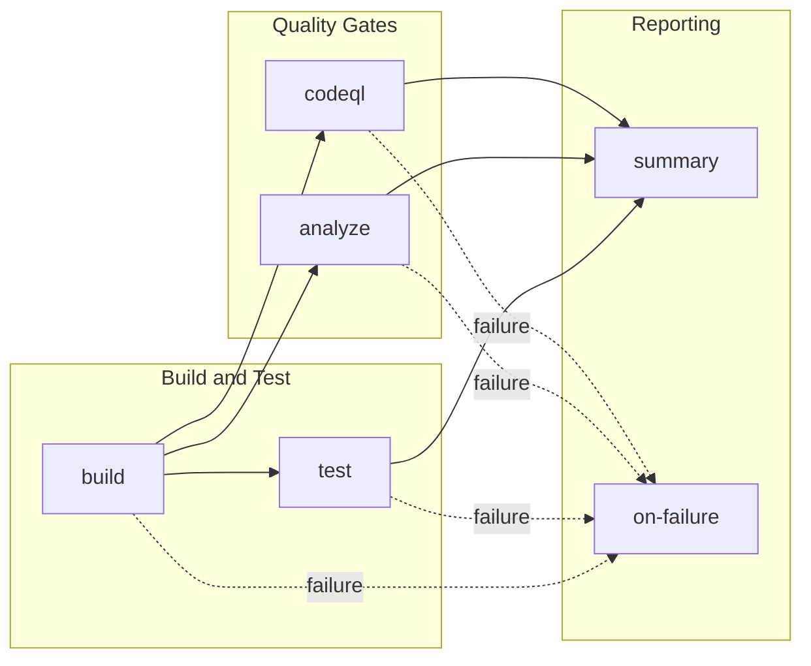

# 🔄 CI - .NET Reusable Workflow

> Comprehensive reusable CI workflow for .NET solutions with cross-platform builds, testing, code analysis, and CodeQL security scanning.

> [!NOTE]
> **Audience:** DevOps Engineers, Platform Engineers, Developers  
> **Reading time:** ~12 minutes

---

<details>
<summary>🧭 Navigation</summary>

| Previous | Index | Next |
|:---------|:------|:-----|
| [🛠️ CI Orchestration](ci-dotnet.md) | [📚 Documentation Index](README.md) | [🚀 Azure Deployment](azure-dev.md) |

</details>

---

<details>
<summary>📑 Table of Contents</summary>

- [📋 Overview and Purpose](#-overview-and-purpose)
- [⚡ Triggers](#-triggers)
- [📊 High-Level Workflow Flow](#-high-level-workflow-flow)
- [🔧 Jobs Breakdown](#-jobs-breakdown)
- [📥 Inputs and Parameters](#-inputs-and-parameters)
- [🔐 Secrets and Variables](#-secrets-and-variables)
- [🛡️ Permissions and Security Model](#️-permissions-and-security-model)
- [🌍 Environments and Deployment Strategy](#-environments-and-deployment-strategy)
- [❌ Failure Handling and Recovery](#-failure-handling-and-recovery)
- [🚀 How to Run This Workflow](#-how-to-run-this-workflow)
- [🔌 Extensibility and Customization](#-extensibility-and-customization)
- [⚠️ Known Limitations and Gotchas](#️-known-limitations-and-gotchas)
- [👥 Ownership and Maintenance](#-ownership-and-maintenance)
- [📝 Assumptions and Gaps](#-assumptions-and-gaps)

</details>

---

## 📋 Overview and Purpose

### What This Workflow Does

This is a comprehensive reusable CI workflow for .NET solutions that provides:

- **Cross-platform builds**: Compiles the solution on Ubuntu, Windows, and macOS
- **Cross-platform testing**: Executes tests with code coverage on all platforms
- **Code formatting analysis**: Verifies compliance with `.editorconfig` standards
- **Security scanning**: Performs CodeQL analysis for vulnerability detection

The workflow is designed to be called by other workflows, providing a consistent CI experience across the repository.

> [!TIP]
>
> ### ✅ When to Use
>
> - **As a reusable component**: Called via `uses:` syntax from other workflows
> - **Standardized CI**: When consistent build, test, and security scanning is required
> - **Cross-platform validation**: When code must compile and run on multiple operating systems
> - **Security compliance**: When CodeQL scanning is mandatory for all code changes

> [!WARNING]
>
> ### ❌ When NOT to Use
>
> - **Direct execution**: This workflow cannot be triggered directly; it must be called by another workflow
> - **Deployment scenarios**: This is a CI workflow; use a CD workflow for deployments
> - **Single-platform builds**: If cross-platform validation is not required, a simpler workflow may suffice

---

## ⚡ Triggers

This is a reusable workflow triggered via `workflow_call`. It cannot be triggered by push, pull request, or schedule events.

| Trigger | Description |
|:--------|:------------|
| `workflow_call` | Called by other workflows using `uses:` syntax |

---

## 📊 High-Level Workflow Flow

### Narrative Overview

The workflow executes six jobs with defined dependencies:

1. **Build** runs first as a matrix job across three operating systems (Ubuntu, Windows, macOS)
2. **Test**, **Analyze**, and **CodeQL** jobs run in parallel after Build completes
3. **Summary** runs after all four primary jobs complete, regardless of their outcomes
4. **On-Failure** runs only if any primary job fails

The Build job uses a matrix strategy with `fail-fast: false`, meaning all platform builds complete even if one fails. This provides comprehensive feedback across all target platforms.

### Mermaid Diagram



### Interpretation Notes

- **Parallelism**: Test, Analyze, and CodeQL jobs execute concurrently after Build completes
- **Matrix execution**: Build and Test jobs each spawn three parallel runners (one per OS)
- **Failure propagation**: Any job failure triggers the `on-failure` job but does not stop other jobs
- **Summary always runs**: The Summary job executes regardless of success or failure to provide consolidated reporting

---

## 🔧 Jobs Breakdown

| Job | Runner | Responsibility | Dependencies | Key Outputs |
|:----|:-------|:---------------|:-------------|:------------|
| `build` | Matrix (ubuntu, windows, macos) | Compile solution, generate version, upload build artifacts | None | `build-version` |
| `test` | Matrix (ubuntu, windows, macos) | Execute tests, collect coverage, publish test results | `build` | Test results, coverage reports |
| `analyze` | Configurable (`runs-on` input) | Verify code formatting against `.editorconfig` | `build` | Format verification status |
| `codeql` | Configurable (`runs-on` input) | Security vulnerability scanning with CodeQL | `build` | SARIF results |
| `summary` | Configurable (`runs-on` input) | Aggregate results, generate workflow summary | `build`, `test`, `analyze`, `codeql` | Consolidated report |
| `on-failure` | Configurable (`runs-on` input) | Report failure details | `build`, `test`, `analyze`, `codeql` | Failure report |

<details>
<summary>📖 Detailed Job Information</summary>

### Job Details

#### 🔨 Build Job

- Generates semantic version: `1.0.<run_number>`
- Restores NuGet packages
- Compiles with `-p:ContinuousIntegrationBuild=true`
- Uploads binaries as artifacts per platform

#### 🧪 Test Job

- Uses Microsoft.Testing.Platform for test execution
- Generates `.trx` test result files
- Collects Cobertura coverage reports
- Publishes results via `dorny/test-reporter`

#### 🔍 Analyze Job

- Runs `dotnet format --verify-no-changes`
- Optional via `enable-code-analysis` input
- Configurable failure behavior via `fail-on-format-issues`

#### 🛡️ CodeQL Job

- Always runs (no conditional skip)
- Scans C# code with `security-extended` and `security-and-quality` query suites
- Excludes test files from scanning
- Uploads SARIF results to GitHub Security tab

</details>

---

## 📥 Inputs and Parameters

### Input Parameters

| Input | Type | Required | Default | Description |
|:------|:-----|:---------|:--------|:------------|
| `configuration` | string | No | `Release` | Build configuration (Release/Debug) |
| `dotnet-version` | string | No | `10.0.x` | .NET SDK version |
| `solution-file` | string | No | `app.sln` | Path to solution file |
| `test-results-artifact-name` | string | No | `test-results` | Test results artifact base name |
| `build-artifacts-name` | string | No | `build-artifacts` | Build artifacts base name |
| `coverage-artifact-name` | string | No | `code-coverage` | Coverage artifact base name |
| `artifact-retention-days` | number | No | `30` | Artifact retention period in days |
| `runs-on` | string | No | `ubuntu-latest` | Runner for non-matrix jobs |
| `enable-code-analysis` | boolean | No | `true` | Enable code formatting analysis |
| `fail-on-format-issues` | boolean | No | `true` | Fail workflow on formatting issues |

### Output Parameters

| Output | Source Job | Description |
|:-------|:-----------|:------------|
| `build-version` | `build` | Generated build version string |
| `build-result` | `build` | Build job result status |
| `test-result` | `test` | Test job result status |
| `analyze-result` | `analyze` | Analysis job result status |
| `codeql-result` | `codeql` | CodeQL job result status |

---

## 🔐 Secrets and Variables

### Secrets

This workflow expects secrets to be inherited from the caller workflow via `secrets: inherit`. No explicit secret references exist in the workflow definition.

### Environment Variables

| Variable | Scope | Value | Purpose |
|:---------|:------|:------|:--------|
| `DOTNET_SKIP_FIRST_TIME_EXPERIENCE` | Workflow | `true` | Skip .NET welcome message |
| `DOTNET_NOLOGO` | Workflow | `true` | Suppress .NET logo output |
| `DOTNET_CLI_TELEMETRY_OPTOUT` | Workflow | `true` | Disable .NET telemetry |

---

## 🛡️ Permissions and Security Model

### GitHub Actions Permissions

| Permission | Level | Purpose |
|:-----------|:------|:--------|
| `contents` | read | Read repository contents for checkout |
| `checks` | write | Create check runs for test results |
| `pull-requests` | write | Post comments on PRs |
| `security-events` | write | Upload CodeQL SARIF results |

### Security Considerations

> [!IMPORTANT]
> **Supply Chain Security**: All actions use SHA-pinned versions to prevent supply chain attacks.

- **Pinned action versions**: All actions use SHA-pinned versions for supply chain security
- **Least privilege**: Permissions are minimal for CI operations
- **CodeQL always runs**: Security scanning cannot be disabled, ensuring consistent security coverage
- **Test exclusion**: CodeQL excludes test files to focus on production code
- **No deployment credentials**: This workflow has no access to deployment secrets

### Action Versions

| Action | Version | SHA |
|:-------|:--------|:----|
| `actions/checkout` | v6.0.2 | `de0fac2e4500dabe0009e67214ff5f5447ce83dd` |
| `actions/setup-dotnet` | v5.1.0 | `baa11fbfe1d6520db94683bd5c7a3818018e4309` |
| `actions/upload-artifact` | v6.0.0 | `b7c566a772e6b6bfb58ed0dc250532a479d7789f` |
| `dorny/test-reporter` | v2.5.0 | `b082adf0eced0765477756c2a610396589b8c637` |
| `github/codeql-action/*` | v3.28.0 | `cdefb33c0f6224e58673d9004f47f7cb3e328b89` |

---

## 🌍 Environments and Deployment Strategy

This workflow does not use GitHub Environments. It is a CI workflow focused on build validation and does not perform deployments.

---

## ❌ Failure Handling and Recovery

### Failure Behavior

| Scenario | Behavior |
|:---------|:---------|
| Single platform build failure | Other platforms continue (`fail-fast: false`) |
| Test failure | Job fails, Summary and On-Failure still run |
| Formatting issues | Controlled by `fail-on-format-issues` input |
| CodeQL issues | Job fails, results uploaded to Security tab |
| Any job failure | `on-failure` job executes |

### Recovery Steps

1. Review the `on-failure` job output for a summary of failed jobs
2. Check individual job logs for specific error details
3. For formatting issues: Run `dotnet format <solution>` locally
4. For CodeQL issues: Review findings in the Security tab
5. Push fixes or re-run the workflow

### Retry Behavior

No automatic retry logic is implemented. Jobs that fail require manual intervention or a new workflow run.

---

## 🚀 How to Run This Workflow

### Calling from Another Workflow

```yaml
jobs:
  ci:
    uses: ./.github/workflows/ci-dotnet-reusable.yml
    with:
      configuration: 'Release'
      dotnet-version: '10.0.x'
      solution-file: 'app.sln'
      enable-code-analysis: true
    secrets: inherit
```

### Minimal Configuration

```yaml
jobs:
  ci:
    uses: ./.github/workflows/ci-dotnet-reusable.yml
    secrets: inherit
```

### Custom Configuration Example

```yaml
jobs:
  ci:
    uses: ./.github/workflows/ci-dotnet-reusable.yml
    with:
      configuration: 'Debug'
      dotnet-version: '9.0.x'
      artifact-retention-days: 7
      enable-code-analysis: false
      runs-on: 'ubuntu-22.04'
    secrets: inherit
```

<details>
<summary>⚠️ Common Mistakes to Avoid</summary>

- **Direct triggering**: This workflow cannot be triggered directly; it must be called via `uses:`
- **Missing secrets inheritance**: Always include `secrets: inherit` unless explicitly managing secrets
- **Incorrect solution path**: Ensure `solution-file` points to a valid `.sln` file
- **Runner availability**: The `runs-on` input must specify a valid GitHub-hosted or self-hosted runner

</details>

---

## 🔌 Extensibility and Customization

### ✅ Safe Extension Points

- **Add new inputs**: Extend the `inputs` section for additional configuration
- **Modify CodeQL queries**: Adjust the `queries` parameter for different scanning depth
- **Add new jobs**: Insert jobs between existing ones with appropriate `needs` dependencies
- **Customize artifact naming**: Use the artifact name inputs for different naming conventions

### ⛔ What Should NOT Be Changed

- **Permission reductions**: Reducing permissions may break test reporting or security scanning
- **CodeQL removal**: Security scanning should remain mandatory
- **Action SHA pins**: Unpinning actions weakens supply chain security
- **Matrix strategy**: Removing platforms reduces cross-platform validation coverage

### Adding a New Job

```yaml
jobs:
  new-job:
    name: New Analysis
    runs-on: ${{ inputs.runs-on }}
    needs: build
    steps:
      - uses: actions/checkout@de0fac2e4500dabe0009e67214ff5f5447ce83dd
      # Additional steps
```

> [!IMPORTANT]
> Ensure the Summary job's `needs` array includes the new job.

---

## ⚠️ Known Limitations and Gotchas

| Limitation | Impact | Mitigation |
|:-----------|:-------|:-----------|
| Matrix builds increase runner minutes | 3x resource usage per CI run | Accept for comprehensive coverage or reduce matrix |
| No dependency caching | Longer restore times | Add `actions/cache` if needed |
| CodeQL timeout (45 min) | Large solutions may exceed timeout | Exclude non-critical paths from scanning |
| Test reporter path handling | Windows paths require conversion | `path-replace-backslashes: true` is configured |
| Artifact naming with OS suffix | Multiple artifacts per job | Design choice for platform separation |

### Platform-Specific Behaviors

- **Windows**: Paths use backslashes; test reporter is configured to handle this
- **macOS**: May have slower build times for ARM-based runners
- **Ubuntu**: Primary platform for non-matrix jobs (analyze, codeql, summary)

---

## 👥 Ownership and Maintenance

### Ownership

| Role | Responsibility |
|:-----|:---------------|
| DevOps Team | Workflow maintenance, action updates, security patches |
| Repository Maintainers | Reviewing workflow changes, approving permission changes |
| Security Team | CodeQL configuration, vulnerability response |

### Review Expectations

- Action version updates require security review
- Permission changes require DevOps and Security team approval
- CodeQL query modifications require Security team approval

### Change Management

- Test changes in a feature branch by creating a caller workflow
- Document significant changes in commit messages
- Coordinate updates with caller workflows when modifying inputs/outputs

---

## 📝 Assumptions and Gaps

### Assumptions

- .NET SDK 10.0.x is available on all matrix runners
- The solution file compiles successfully with `dotnet build`
- Tests are discoverable via `dotnet test`
- `.editorconfig` exists and defines formatting rules
- GitHub-hosted runners have sufficient resources for builds

### Gaps

- **No test parallelization configuration**: Test execution uses default parallelization
- **No coverage threshold enforcement**: Coverage is collected but not validated against thresholds
- **No benchmark testing**: Performance testing is not included
- **No mutation testing**: Code quality validation is limited to formatting and security
- **No integration test separation**: All tests run together without environment differentiation
- **No Windows-specific CodeQL**: CodeQL runs only on the `runs-on` runner, not per platform

---

## 📚 Related Documents

| Document | Description |
|:---------|:------------|
| [🛠️ CI Orchestration](ci-dotnet.md) | The caller workflow that invokes this reusable workflow |
| [🚀 CD - Azure Deployment](azure-dev.md) | Deployment workflow that uses CI outputs |
| [📚 Documentation Index](README.md) | Central index of all DevOps documentation |

---

<div align="center">

[⬆️ Back to Top](#-ci---net-reusable-workflow) | [📚 Documentation Index](README.md) | [➡️ Next: Azure Deployment](azure-dev.md)

</div>
