# 🔄 CI - .NET Reusable Workflow


> [!NOTE]
> **Target Audience:** DevOps Engineers, Platform Engineers, Developers<br>
> **Reading Time:** ~12 minutes

<details>
<summary>📍 <strong>Navigation</strong></summary>

| Previous | Index | Next |
|:---------|:------|:-----|
| ← [CI - .NET Build and Test](ci-dotnet.md) | [DevOps Documentation](./README.md) | [CD - Azure Deployment](azure-dev.md) → |

</details>

---

> Comprehensive reusable CI workflow for .NET solutions with cross-platform builds, testing, code analysis, and security scanning.

---

## 📑 Table of Contents

- [📋 Overview](#-overview)
  - [Purpose](#purpose)
  - [Scope](#scope)
  - [Key Features](#key-features)
  - [When to Use](#when-to-use)
- [📊 Workflow Diagram](#-workflow-diagram)
- [✅ Prerequisites](#-prerequisites)
- [⚡ Trigger Events](#-trigger-events)
- [⚙️ Configuration Reference](#️-configuration-reference)
  - [Environment Variables](#environment-variables)
  - [Secrets](#secrets)
- [📥 Inputs & Outputs](#-inputs--outputs)
  - [Inputs](#inputs)
  - [Outputs](#outputs)
- [🔧 Jobs & Steps Breakdown](#-jobs--steps-breakdown)
  - [Build Job](#build-job)
  - [Test Job](#test-job)
  - [Analyze Job](#analyze-job)
  - [CodeQL Job](#codeql-job)
  - [Summary Job](#summary-job)
  - [On-Failure Job](#on-failure-job)
- [📦 Artifacts](#-artifacts)
- [💡 Usage Examples](#-usage-examples)
- [🔍 Troubleshooting](#-troubleshooting)
- [🔗 Related Resources](#-related-resources)

---

## 📋 Overview

### Purpose

This reusable workflow provides a comprehensive CI pipeline for .NET solutions. It performs cross-platform builds and testing, code formatting verification, and security vulnerability scanning using CodeQL. The workflow is designed to be called by other workflows, promoting code reuse and consistency across repositories.

### Scope

- Any .NET solution file (`.sln`)
- Cross-platform execution on Ubuntu, Windows, and macOS
- Supports .NET 6.0+ SDK versions
- Language: C# (CodeQL scanning)

### Key Features

- **Cross-Platform Matrix** - Build and test on Ubuntu, Windows, and macOS simultaneously
- **Code Coverage** - Generates Cobertura coverage reports per platform
- **Code Formatting** - Verifies `.editorconfig` compliance with `dotnet format`
- **CodeQL Security** - Always-on security scanning with extended query suites
- **Rich Summaries** - Detailed GitHub Actions summaries for each job
- **Artifact Management** - Organized artifacts per platform with configurable retention

### When to Use

- As a reusable workflow called by repository-specific CI workflows
- When you need standardized CI across multiple .NET repositories
- For PRs requiring build verification and security scanning
- When deploying to environments that require passing CI checks

---

## 📊 Workflow Diagram

```mermaid
flowchart TD
    subgraph "Entry Point"
        A([workflow_call]) --> B[🔨 Build]
    end

    subgraph "Build Stage"
        B --> B1[Ubuntu Build]
        B --> B2[Windows Build]
        B --> B3[macOS Build]
        B1 --> C{Build Success?}
        B2 --> C
        B3 --> C
    end

    subgraph "Parallel Execution"
        C -->|Yes| D[🧪 Test]
        C -->|Yes| E[🔍 Analyze]
        C -->|Yes| F[🛡️ CodeQL]
        
        subgraph "Test Matrix"
            D --> D1[Ubuntu Tests]
            D --> D2[Windows Tests]
            D --> D3[macOS Tests]
        end
    end

    subgraph "Analysis Jobs"
        E --> E1[Code Formatting Check]
        F --> F1[Security Scan - C#]
    end

    subgraph "Completion"
        D1 --> G[📊 Summary]
        D2 --> G
        D3 --> G
        E1 --> G
        F1 --> G
        
        C -->|No| H[❌ Failed]
        G --> I{All Passed?}
        I -->|Yes| J([✅ Success])
        I -->|No| H
    end

    style B fill:#4CAF50,color:#fff
    style D fill:#2196F3,color:#fff
    style E fill:#FF9800,color:#fff
    style F fill:#9C27B0,color:#fff
    style G fill:#607D8B,color:#fff
    style H fill:#f44336,color:#fff
```



---

## ✅ Prerequisites

| Requirement | Type | Description | Setup Instructions |
|:------------|:-----|:------------|:-------------------|
| **.NET SDK** | Software | .NET SDK matching `dotnet-version` input | Automatically installed by workflow |
| **contents: read** | Permission | Read repository contents for checkout | Configured in workflow permissions |
| **checks: write** | Permission | Create check runs for test results | Configured in workflow permissions |
| **pull-requests: write** | Permission | Post comments on pull requests | Configured in workflow permissions |
| **security-events: write** | Permission | Upload CodeQL SARIF results | Configured in workflow permissions |
| **Solution File** | Code | Valid `.sln` file at specified path | Default: `app.sln` |
| **.editorconfig** | Code | EditorConfig file for formatting rules | Required for analyze job |

---

## ⚡ Trigger Events

| Event | Branches | Paths | Conditions |
|:------|:---------|:------|:-----------|
| **workflow_call** | N/A | N/A | Called by other workflows with inputs |

> [!IMPORTANT]
> This is a reusable workflow and cannot be triggered directly. It must be called using `uses:` syntax from another workflow.

---

## ⚙️ Configuration Reference

### Environment Variables

| Variable | Scope | Default | Description |
|:---------|:------|:--------|:------------|
| `DOTNET_SKIP_FIRST_TIME_EXPERIENCE` | Workflow | `true` | Skip .NET first-run experience for faster startup |
| `DOTNET_NOLOGO` | Workflow | `true` | Suppress .NET welcome banner |
| `DOTNET_CLI_TELEMETRY_OPTOUT` | Workflow | `true` | Disable .NET CLI telemetry collection |

### Secrets

| Secret Name | Required | Source | Purpose |
|:------------|:---------|:-------|:--------|
| `inherit` | Optional | Calling workflow | Secrets can be inherited if needed by custom steps |

---

## 📥 Inputs & Outputs

### Inputs

| Input | Type | Required | Default | Description |
|:------|:-----|:---------|:--------|:------------|
| `configuration` | string | No | `Release` | Build configuration (`Release` or `Debug`) |
| `dotnet-version` | string | No | `10.0.x` | .NET SDK version to use (e.g., `8.0.x`, `9.0.x`) |
| `solution-file` | string | No | `app.sln` | Path to the solution file |
| `test-results-artifact-name` | string | No | `test-results` | Base name for test results artifacts |
| `build-artifacts-name` | string | No | `build-artifacts` | Base name for build artifacts |
| `coverage-artifact-name` | string | No | `code-coverage` | Base name for coverage artifacts |
| `artifact-retention-days` | number | No | `30` | Number of days to retain artifacts |
| `runs-on` | string | No | `ubuntu-latest` | Runner for analyze, codeql, and summary jobs |
| `enable-code-analysis` | boolean | No | `true` | Enable code formatting analysis job |
| `fail-on-format-issues` | boolean | No | `true` | Fail workflow if formatting issues are found |

### Outputs

| Output | Source Job | Description |
|:-------|:-----------|:------------|
| `build-version` | `build` | Generated semantic version (e.g., `1.0.42`) |
| `build-result` | `build` | Build job result status |
| `test-result` | `test` | Test job result status |
| `analyze-result` | `analyze` | Analysis job result status |
| `codeql-result` | `codeql` | CodeQL scan result status |

---

## 🔧 Jobs & Steps Breakdown

### Build Job

**Purpose:** Compile the .NET solution on all supported platforms.

- **Runner:** Matrix (`ubuntu-latest`, `windows-latest`, `macos-latest`)
- **Dependencies:** None
- **Timeout:** 15 minutes

**Steps:**

1. **📥 Checkout repository** - Clone with full git history (`fetch-depth: 0`)
2. **🔧 Setup .NET SDK** - Install specified .NET version
3. **☁️ Update .NET workloads** - Update installed workloads
4. **🏷️ Generate build version** - Create version `1.0.{run_number}`
5. **📥 Restore dependencies** - Run `dotnet restore`
6. **🔨 Build solution** - Compile with version and CI build flag
7. **📤 Upload build artifacts** - Upload binaries per platform
8. **📊 Generate build summary** - Create job summary markdown

### Test Job

**Purpose:** Execute tests with code coverage on all platforms.

- **Runner:** Matrix (`ubuntu-latest`, `windows-latest`, `macos-latest`)
- **Dependencies:** `build`
- **Timeout:** 30 minutes

**Steps:**

1. **📥 Checkout repository** - Clone repository
2. **🔧 Setup .NET SDK** - Install .NET version
3. **☁️ Update .NET workloads** - Update workloads
4. **📥 Restore dependencies** - Restore NuGet packages
5. **🔨 Build solution** - Build for test execution
6. **🧪 Run tests with coverage** - Execute tests with Cobertura coverage
7. **📋 Publish test results** - Create GitHub check run via `dorny/test-reporter`
8. **📤 Upload test results** - Upload `.trx` files
9. **📤 Upload code coverage** - Upload Cobertura XML reports
10. **📊 Generate test summary** - Create test summary with troubleshooting tips

### Analyze Job

**Purpose:** Verify code formatting compliance with `.editorconfig`.

- **Runner:** Configurable (default: `ubuntu-latest`)
- **Dependencies:** `build`
- **Conditions:** `inputs.enable-code-analysis == true`
- **Timeout:** 15 minutes

**Steps:**

1. **📥 Checkout repository** - Clone repository
2. **🔧 Setup .NET SDK** - Install .NET version
3. **☁️ Update .NET workloads** - Update workloads
4. **📥 Restore dependencies** - Restore packages
5. **🎨 Verify code formatting** - Run `dotnet format --verify-no-changes`
6. **📊 Generate analysis summary** - Create summary with fix instructions
7. **❌ Fail on format issues** - Exit with error if configured

### CodeQL Job

**Purpose:** Perform security vulnerability scanning with GitHub CodeQL.

- **Runner:** Configurable (default: `ubuntu-latest`)
- **Dependencies:** `build`
- **Conditions:** Always runs (no skip option)
- **Timeout:** 45 minutes

**Steps:**

1. **📥 Checkout repository** - Clone with full history for blame tracking
2. **🔧 Setup .NET SDK** - Install .NET version
3. **🛡️ Initialize CodeQL** - Configure C# analysis with extended queries
4. **🔨 Autobuild for CodeQL** - Build solution for analysis
5. **🛡️ Perform CodeQL analysis** - Execute security scan
6. **📤 Upload CodeQL SARIF results** - Upload to artifacts
7. **📊 Generate CodeQL summary** - Create detailed security summary

### Summary Job

**Purpose:** Aggregate results from all jobs into a comprehensive summary.

- **Runner:** Configurable (default: `ubuntu-latest`)
- **Dependencies:** `build`, `test`, `analyze`, `codeql`
- **Conditions:** `always()`
- **Timeout:** 5 minutes

**Steps:**

1. **📊 Generate workflow summary** - Create consolidated CI report

### On-Failure Job

**Purpose:** Provide clear failure indication and debugging guidance.

- **Runner:** Configurable (default: `ubuntu-latest`)
- **Dependencies:** `build`, `test`, `analyze`, `codeql`
- **Conditions:** `failure()`
- **Timeout:** 5 minutes

**Steps:**

1. **❌ Report CI failure** - Generate failure report with job statuses

---

## 📦 Artifacts

| Artifact Name | Contents | Retention | Usage |
|:--------------|:---------|:----------|:------|
| `build-artifacts-ubuntu-latest` | Compiled binaries (Linux) | Configurable (default: 30 days) | Deployment, further testing |
| `build-artifacts-windows-latest` | Compiled binaries (Windows) | Configurable (default: 30 days) | Windows-specific deployment |
| `build-artifacts-macos-latest` | Compiled binaries (macOS) | Configurable (default: 30 days) | macOS-specific deployment |
| `test-results-ubuntu-latest` | Test results `.trx` (Linux) | Configurable (default: 30 days) | Test analysis, CI/CD gates |
| `test-results-windows-latest` | Test results `.trx` (Windows) | Configurable (default: 30 days) | Platform-specific test review |
| `test-results-macos-latest` | Test results `.trx` (macOS) | Configurable (default: 30 days) | Platform-specific test review |
| `code-coverage-ubuntu-latest` | Cobertura XML (Linux) | Configurable (default: 30 days) | Coverage reporting tools |
| `code-coverage-windows-latest` | Cobertura XML (Windows) | Configurable (default: 30 days) | Coverage comparison |
| `code-coverage-macos-latest` | Cobertura XML (macOS) | Configurable (default: 30 days) | Coverage comparison |
| `codeql-sarif-results` | SARIF security results | Configurable (default: 30 days) | Security tab, external tools |

---

## 💡 Usage Examples

### Basic Usage

```yaml
jobs:
  ci:
    name: 🚀 CI
    uses: ./.github/workflows/ci-dotnet-reusable.yml
    secrets: inherit
```

### Custom Configuration

```yaml
jobs:
  ci:
    name: 🚀 CI Pipeline
    uses: ./.github/workflows/ci-dotnet-reusable.yml
    with:
      configuration: "Release"
      dotnet-version: "10.0.x"
      solution-file: "MyApp.sln"
      enable-code-analysis: true
      fail-on-format-issues: false
      artifact-retention-days: 14
    secrets: inherit
```

### Debug Build Configuration

```yaml
jobs:
  ci-debug:
    name: 🐛 Debug CI
    uses: ./.github/workflows/ci-dotnet-reusable.yml
    with:
      configuration: "Debug"
      dotnet-version: "9.0.x"
      enable-code-analysis: false
    secrets: inherit
```

### Using Outputs

```yaml
jobs:
  ci:
    uses: ./.github/workflows/ci-dotnet-reusable.yml
    secrets: inherit

  deploy:
    needs: ci
    runs-on: ubuntu-latest
    if: needs.ci.outputs.build-result == 'success'
    steps:
      - name: Deploy version ${{ needs.ci.outputs.build-version }}
        run: echo "Deploying version ${{ needs.ci.outputs.build-version }}"
```

---

## 🔍 Troubleshooting

| Symptom | Possible Cause | Solution |
|:--------|:---------------|:---------|
| **Build fails on one platform only** | Platform-specific code issues or dependencies | Check build logs for platform-specific errors; verify conditional compilation |
| **Test reporter shows no results** | Path mismatch or empty test projects | Verify `.trx` files are generated; check `path-replace-backslashes: true` on Windows |
| **Code formatting check fails** | Code doesn't match `.editorconfig` rules | Run `dotnet format <solution>` locally before committing |
| **CodeQL timeout** | Large codebase or complex analysis | Increase `timeout-minutes` or exclude test paths |
| **Matrix job fails partially** | Flaky tests or transient failures | Re-run failed jobs; investigate platform-specific test issues |
| **Artifact upload fails** | No files match pattern | Verify build output paths; check `if-no-files-found` setting |
| **Permission denied for checks** | Missing `checks: write` permission | Ensure calling workflow has required permissions |

<details>
<summary>🔧 Local Debugging Commands</summary>

### Reproduce Build Locally

```bash
# Restore and build
dotnet restore app.sln
dotnet build app.sln --configuration Release

# Run tests with coverage
dotnet test app.sln --configuration Release \
  --collect:"XPlat Code Coverage" \
  --results-directory ./TestResults
```

### Check Code Formatting

```bash
# Verify formatting (dry run)
dotnet format app.sln --verify-no-changes --verbosity diagnostic

# Auto-fix formatting issues
dotnet format app.sln
```

### Run CodeQL Locally

```bash
# Install CodeQL CLI
gh extension install github/gh-codeql

# Initialize and analyze
codeql database create codeql-db --language=csharp
codeql database analyze codeql-db --format=sarif-latest --output=results.sarif
```

</details>

---

## � Related Documents

| Document | Description |
|:---------|:------------|
| [ci-dotnet.md](ci-dotnet.md) | CI orchestration workflow that calls this reusable workflow |
| [azure-dev.md](azure-dev.md) | CD workflow that depends on this CI workflow |

---

## �🔗 Related Resources

### 📚 Internal

- [ci-dotnet.md](ci-dotnet.md) - CI orchestration workflow that calls this reusable workflow
- [azure-dev.md](azure-dev.md) - CD workflow that depends on this CI workflow

### 🌐 External

- [GitHub Reusable Workflows](https://docs.github.com/actions/using-workflows/reusing-workflows)
- [.NET CLI Reference](https://learn.microsoft.com/dotnet/core/tools/)
- [CodeQL Documentation](https://codeql.github.com/docs/)
- [dorny/test-reporter Action](https://github.com/dorny/test-reporter)
- [EditorConfig Reference](https://editorconfig.org/)

### 🆘 Support

- 📖 [Repository Issues](https://github.com/Evilazaro/Azure-LogicApps-Monitoring/issues)
- 💬 Contact the DevOps team for CI pipeline assistance

---

<div align="center">

[← CI - .NET Build and Test](ci-dotnet.md) | [⬆️ Back to Top](#-ci---net-reusable-workflow) | [CD - Azure Deployment →](azure-dev.md)

</div>
