# Workflow: CI - .NET Reusable Workflow


---

## Table of Contents

- [Overview](#overview)
- [Workflow Diagram](#workflow-diagram)
- [Jobs](#jobs)
  - [Job: build](#job-build)
  - [Job: test](#job-test)
  - [Job: analyze](#job-analyze)
  - [Job: codeql](#job-codeql)
  - [Job: summary](#job-summary)
  - [Job: on-failure](#job-on-failure)
- [Inputs and Secrets](#inputs-and-secrets)
- [Permissions](#permissions)
- [Artifacts and Outputs](#artifacts-and-outputs)
- [Dependencies](#dependencies)
- [Usage Examples](#usage-examples)
- [Environment Variables](#environment-variables)
- [CodeQL Configuration](#codeql-configuration)
- [Related Workflows](#related-workflows)

---

## Overview

| Property | Value |
|:---------|:------|
| **File** | `.github/workflows/ci-dotnet-reusable.yml` |
| **Name** | CI - .NET Reusable Workflow |
| **Triggers** | `workflow_call` (reusable workflow) |

Comprehensive reusable CI workflow for .NET solutions that performs cross-platform builds (Ubuntu, Windows, macOS), cross-platform testing with code coverage, code formatting analysis (.editorconfig compliance), and CodeQL security scanning. This workflow is designed to be called by other workflows.

## Workflow Diagram

```mermaid
%%{init: {'theme': 'base', 'themeVariables': {'fontSize': '14px', 'primaryColor': '#E3F2FD', 'lineColor': '#90A4AE', 'textColor': '#37474F', 'clusterBkg': '#FAFAFA'}}}%%
flowchart TB
    subgraph wf["🔄 Workflow: CI - .NET Reusable"]
        direction TB
        
        subgraph triggers-stage["⚡ Stage: Triggers"]
            direction LR
            subgraph events["Events"]
                direction LR
                workflow-call(["🔔 workflow_call"]):::node-trigger
            end
        end
        
        subgraph build-stage["🔨 Stage: Build"]
            direction TB
            subgraph build-matrix["🔨 Build Matrix"]
                direction LR
                build-ubuntu["🐧 Build (Ubuntu)"]:::node-ubuntu
                build-windows["🪟 Build (Windows)"]:::node-windows
                build-macos["🍎 Build (macOS)"]:::node-macos
            end
        end
        
        subgraph test-stage["🧪 Stage: Test"]
            direction TB
            subgraph test-matrix["🧪 Test Matrix"]
                direction LR
                test-ubuntu["🐧 Test (Ubuntu)"]:::node-ubuntu
                test-windows["🪟 Test (Windows)"]:::node-windows
                test-macos["🍎 Test (macOS)"]:::node-macos
            end
        end
        
        subgraph analysis-stage["🔍 Stage: Analysis"]
            direction LR
            subgraph quality-group["📝 Code Quality"]
                direction LR
                analyze["🔍 Analyze"]:::node-lint
            end
            subgraph security-group["🛡️ Security"]
                direction LR
                codeql["🛡️ CodeQL Security Scan"]:::node-security
            end
        end
        
        subgraph reporting-stage["📊 Stage: Reporting"]
            direction LR
            subgraph reporting-group["Reports"]
                direction LR
                summary["📊 Summary"]:::node-setup
                on-failure["❌ Failed"]:::node-error
            end
        end
    end
    
    %% Trigger connections - parallel to all OS build nodes
    workflow-call -->|"triggers"| build-ubuntu & build-windows & build-macos
    
    %% Build to Test - OS-specific dependencies
    build-ubuntu --> test-ubuntu
    build-windows --> test-windows
    build-macos --> test-macos
    
    %% Build to Analysis
    build-ubuntu & build-windows & build-macos --> analyze
    build-ubuntu & build-windows & build-macos --> codeql
    
    %% All jobs to Summary
    build-ubuntu & build-windows & build-macos --> summary
    test-ubuntu & test-windows & test-macos --> summary
    analyze --> summary
    codeql --> summary
    
    %% Failure path
    build-ubuntu & build-windows & build-macos -.->|"if: failure()"| on-failure
    test-ubuntu & test-windows & test-macos -.->|"if: failure()"| on-failure
    analyze -.->|"if: failure()"| on-failure
    codeql -.->|"if: failure()"| on-failure
    
    %% Style definitions for Level 1
    style wf fill:#FAFAFA,stroke:#90A4AE,stroke-width:2px,color:#37474F
    
    %% Style definitions for Level 2 stages
    style triggers-stage fill:#E8F5E9,stroke:#66BB6A,stroke-width:2px,color:#2E7D32
    style build-stage fill:#E3F2FD,stroke:#42A5F5,stroke-width:2px,color:#1565C0
    style test-stage fill:#F3E5F5,stroke:#AB47BC,stroke-width:2px,color:#7B1FA2
    style analysis-stage fill:#EDE7F6,stroke:#9575CD,stroke-width:2px,color:#512DA8
    style reporting-stage fill:#ECEFF1,stroke:#90A4AE,stroke-width:2px,color:#546E7A
    
    %% Style definitions for Level 3 groups
    style events fill:#FFFFFF,stroke:#A5D6A7,stroke-width:1px,color:#2E7D32
    style build-matrix fill:#FFFFFF,stroke:#90CAF9,stroke-width:1px,color:#1565C0
    style test-matrix fill:#FFFFFF,stroke:#CE93D8,stroke-width:1px,color:#7B1FA2
    style quality-group fill:#FFFFFF,stroke:#B39DDB,stroke-width:1px,color:#512DA8
    style security-group fill:#FFFFFF,stroke:#EF9A9A,stroke-width:1px,color:#C62828
    style reporting-group fill:#FFFFFF,stroke:#B0BEC5,stroke-width:1px,color:#546E7A
    
    %% Node class definitions
    classDef node-trigger fill:#E8F5E9,stroke:#66BB6A,stroke-width:2px,color:#2E7D32,font-weight:bold
    classDef node-lint fill:#EDE7F6,stroke:#9575CD,stroke-width:2px,color:#512DA8
    classDef node-security fill:#FFEBEE,stroke:#EF5350,stroke-width:2px,color:#C62828
    classDef node-setup fill:#ECEFF1,stroke:#90A4AE,stroke-width:2px,color:#546E7A
    classDef node-error fill:#FFEBEE,stroke:#EF5350,stroke-width:2px,color:#C62828
    
    %% OS-Specific Node Classes
    classDef node-ubuntu fill:#FFF3E0,stroke:#FF9800,stroke-width:2px,color:#E65100,font-weight:bold
    classDef node-windows fill:#E1F5FE,stroke:#03A9F4,stroke-width:2px,color:#0277BD,font-weight:bold
    classDef node-macos fill:#ECEFF1,stroke:#78909C,stroke-width:2px,color:#455A64,font-weight:bold
```



## Jobs

### Job: build

- **Runs on:** Matrix: `ubuntu-latest`, `windows-latest`, `macos-latest`
- **Depends on:** None
- **Condition:** Always runs
- **Timeout:** 15 minutes

Compiles the .NET solution on Ubuntu, Windows, and macOS runners. Generates versioned build artifacts for each platform.

#### Matrix Strategy

```yaml
strategy:
  fail-fast: false
  matrix:
    os: [ubuntu-latest, windows-latest, macos-latest]
```

#### Steps

1. 📥 Checkout repository - `actions/checkout@de0fac2e4500dabe0009e67214ff5f5447ce83dd` (v6.0.2)
2. 🔧 Setup .NET SDK - `actions/setup-dotnet@baa11fbfe1d6520db94683bd5c7a3818018e4309` (v5.1.0)
3. ☁️ Update .NET workloads - (run script: `dotnet workload update`)
4. 🏷️ Generate build version - (run script: generates version `1.0.{run_number}`)
5. 📥 Restore dependencies - (run script: `dotnet restore`)
6. 🔨 Build solution - (run script: `dotnet build`)
7. 📤 Upload build artifacts - `actions/upload-artifact@b7c566a772e6b6bfb58ed0dc250532a479d7789f` (v6.0.0)
8. 📊 Generate build summary - (run script: generates markdown summary)

---

### Job: test

- **Runs on:** Matrix: `ubuntu-latest`, `windows-latest`, `macos-latest`
- **Depends on:** `build`
- **Condition:** Always runs
- **Timeout:** 30 minutes

Executes all tests on Ubuntu, Windows, and macOS runners. Generates test results (.trx) and code coverage reports (Cobertura).

#### Matrix Strategy

```yaml
strategy:
  fail-fast: false
  matrix:
    os: [ubuntu-latest, windows-latest, macos-latest]
```

#### Steps

1. 📥 Checkout repository - `actions/checkout@de0fac2e4500dabe0009e67214ff5f5447ce83dd` (v6.0.2)
2. 🔧 Setup .NET SDK - `actions/setup-dotnet@baa11fbfe1d6520db94683bd5c7a3818018e4309` (v5.1.0)
3. ☁️ Update .NET workloads - (run script: `dotnet workload update`)
4. 📥 Restore dependencies - (run script: `dotnet restore`)
5. 🔨 Build solution - (run script: `dotnet build`)
6. 🧪 Run tests with coverage - (run script: `dotnet test` with coverage)
7. 📋 Publish test results - `dorny/test-reporter@b082adf0eced0765477756c2a610396589b8c637` (v2.5.0)
8. 📤 Upload test results - `actions/upload-artifact@b7c566a772e6b6bfb58ed0dc250532a479d7789f` (v6.0.0)
9. 📤 Upload code coverage - `actions/upload-artifact@b7c566a772e6b6bfb58ed0dc250532a479d7789f` (v6.0.0)
10. 📊 Generate test summary - (run script: generates markdown summary)

---

### Job: analyze

- **Runs on:** `${{ inputs.runs-on }}` (default: `ubuntu-latest`)
- **Depends on:** `build`
- **Condition:** `${{ inputs.enable-code-analysis }}`
- **Timeout:** 15 minutes

Verifies code formatting compliance with .editorconfig standards.

#### Steps

1. 📥 Checkout repository - `actions/checkout@de0fac2e4500dabe0009e67214ff5f5447ce83dd` (v6.0.2)
2. 🔧 Setup .NET SDK - `actions/setup-dotnet@baa11fbfe1d6520db94683bd5c7a3818018e4309` (v5.1.0)
3. ☁️ Update .NET workloads - (run script: `dotnet workload update`)
4. 📥 Restore dependencies - (run script: `dotnet restore`)
5. 🎨 Verify code formatting - (run script: `dotnet format --verify-no-changes`)
6. 📊 Generate analysis summary - (run script: generates markdown summary)
7. ❌ Fail on format issues - (run script: conditional exit based on `fail-on-format-issues`)

---

### Job: codeql

- **Runs on:** `${{ inputs.runs-on }}` (default: `ubuntu-latest`)
- **Depends on:** `build`
- **Condition:** Always runs
- **Timeout:** 45 minutes

CodeQL security vulnerability scanning for C# code.

#### Steps

1. 📥 Checkout repository - `actions/checkout@de0fac2e4500dabe0009e67214ff5f5447ce83dd` (v6.0.2)
2. 🔧 Setup .NET SDK - `actions/setup-dotnet@baa11fbfe1d6520db94683bd5c7a3818018e4309` (v5.1.0)
3. 🛡️ Initialize CodeQL - `github/codeql-action/init@cdefb33c0f6224e58673d9004f47f7cb3e328b89` (v3.28.0)
4. 🔨 Autobuild for CodeQL - `github/codeql-action/autobuild@cdefb33c0f6224e58673d9004f47f7cb3e328b89` (v3.28.0)
5. 🛡️ Perform CodeQL analysis - `github/codeql-action/analyze@cdefb33c0f6224e58673d9004f47f7cb3e328b89` (v3.28.0)
6. 📤 Upload CodeQL SARIF results - `actions/upload-artifact@b7c566a772e6b6bfb58ed0dc250532a479d7789f` (v6.0.0)
7. 📊 Generate CodeQL summary - (run script: generates markdown summary)

---

### Job: summary

- **Runs on:** `${{ inputs.runs-on }}` (default: `ubuntu-latest`)
- **Depends on:** `build`, `test`, `analyze`, `codeql`
- **Condition:** `always()`
- **Timeout:** 5 minutes

Aggregates results from all CI jobs into a comprehensive summary.

#### Steps

1. 📊 Generate workflow summary - (run script: generates comprehensive CI summary)

---

### Job: on-failure

- **Runs on:** `${{ inputs.runs-on }}` (default: `ubuntu-latest`)
- **Depends on:** `build`, `test`, `analyze`, `codeql`
- **Condition:** `failure()`
- **Timeout:** 5 minutes

Provides visual failure indication and reports detailed failure information.

#### Steps

1. ❌ Report CI failure - (run script: generates failure report)

## Inputs and Secrets

### Inputs

| Name | Type | Required | Default | Description |
|:-----|:----:|:--------:|:-------:|:------------|
| `configuration` | string | No | `Release` | Build configuration (Release/Debug) |
| `dotnet-version` | string | No | `10.0.x` | .NET SDK version to use |
| `solution-file` | string | No | `app.sln` | Path to the solution file |
| `test-results-artifact-name` | string | No | `test-results` | Name for test results artifact |
| `build-artifacts-name` | string | No | `build-artifacts` | Name for build artifacts |
| `coverage-artifact-name` | string | No | `code-coverage` | Name for code coverage artifact |
| `artifact-retention-days` | number | No | `30` | Number of days to retain artifacts |
| `runs-on` | string | No | `ubuntu-latest` | Runner for analyze/summary jobs |
| `enable-code-analysis` | boolean | No | `true` | Enable code formatting analysis |
| `fail-on-format-issues` | boolean | No | `true` | Fail workflow if formatting issues found |

### Secrets

| Name | Required | Description |
|:-----|:--------:|:------------|
| (inherited) | — | Secrets inherited from calling workflow |

## Permissions

```yaml
permissions:
  contents: read         # Read repository contents for checkout
  checks: write          # Create check runs for test results
  pull-requests: write   # Post comments on pull requests
  security-events: write # Upload CodeQL SARIF results to Security tab
```

## Artifacts and Outputs

### Artifacts

| Name | Path | Job | Description |
|:-----|:-----|:---:|:------------|
| `build-artifacts-{os}` | `**/bin/{config}/**` | `build` | Compiled binaries per platform |
| `test-results-{os}` | `TestResults/**/*.trx` | `test` | Test results in .trx format per platform |
| `code-coverage-{os}` | `TestResults/**/coverage.cobertura.xml` | `test` | Coverage reports (Cobertura) per platform |
| `codeql-sarif-results` | `codeql-results` | `codeql` | Security scan results (SARIF) |

### Outputs

| Output | Description | Value |
|:-------|:------------|:------|
| `build-version` | The generated build version | `${{ jobs.build.outputs.build-version }}` |
| `build-result` | Build job result | `${{ jobs.build.result }}` |
| `test-result` | Test job result | `${{ jobs.test.result }}` |
| `analyze-result` | Analysis job result | `${{ jobs.analyze.result }}` |
| `codeql-result` | CodeQL security scan result | `${{ jobs.codeql.result }}` |

## Dependencies

### External Actions

| Action | Version | Purpose |
|:-------|:--------|:--------|
| `actions/checkout` | `v6.0.2` (SHA: `de0fac2e4500dabe0009e67214ff5f5447ce83dd`) | Checkout repository code |
| `actions/setup-dotnet` | `v5.1.0` (SHA: `baa11fbfe1d6520db94683bd5c7a3818018e4309`) | Setup .NET SDK |
| `actions/upload-artifact` | `v6.0.0` (SHA: `b7c566a772e6b6bfb58ed0dc250532a479d7789f`) | Upload workflow artifacts |
| `dorny/test-reporter` | `v2.5.0` (SHA: `b082adf0eced0765477756c2a610396589b8c637`) | Publish test results as GitHub check |
| `github/codeql-action/init` | `v3.28.0` (SHA: `cdefb33c0f6224e58673d9004f47f7cb3e328b89`) | Initialize CodeQL |
| `github/codeql-action/autobuild` | `v3.28.0` (SHA: `cdefb33c0f6224e58673d9004f47f7cb3e328b89`) | Auto-build for CodeQL |
| `github/codeql-action/analyze` | `v3.28.0` (SHA: `cdefb33c0f6224e58673d9004f47f7cb3e328b89`) | Perform CodeQL analysis |

### Reusable Workflows

None - This workflow is itself a reusable workflow.

## Usage Examples

### Calling from Another Workflow

```yaml
jobs:
  ci:
    uses: ./.github/workflows/ci-dotnet-reusable.yml
    with:
      configuration: 'Release'
      dotnet-version: '10.0.x'
      solution-file: 'app.sln'
      enable-code-analysis: true
      fail-on-format-issues: true
      artifact-retention-days: 30
    secrets: inherit
```

### Minimal Configuration

```yaml
jobs:
  ci:
    uses: ./.github/workflows/ci-dotnet-reusable.yml
    secrets: inherit
```

### Debug Build with Analysis Disabled

```yaml
jobs:
  ci:
    uses: ./.github/workflows/ci-dotnet-reusable.yml
    with:
      configuration: 'Debug'
      enable-code-analysis: false
    secrets: inherit
```

## Environment Variables

| Variable | Value | Description |
|:---------|:------|:------------|
| `DOTNET_SKIP_FIRST_TIME_EXPERIENCE` | `true` | Skip .NET first-time setup |
| `DOTNET_NOLOGO` | `true` | Suppress .NET logo |
| `DOTNET_CLI_TELEMETRY_OPTOUT` | `true` | Disable .NET telemetry |

## CodeQL Configuration

```yaml
languages: csharp
queries: security-extended, security-and-quality
config:
  paths-ignore:
    - '**/tests/**'
    - '**/test/**'
    - '**/*.test.cs'
    - '**/*.Tests.cs'
```

## Related Workflows

- [azure-dev.md](azure-dev.md) — Azure deployment workflow that calls this reusable workflow
- [ci-dotnet.md](ci-dotnet.md) — Standalone CI workflow that calls this reusable workflow

---

[↑ Back to Top](#workflow-ci---net-reusable-workflow)
