# 🔧 CI - .NET Reusable Workflow

> [!NOTE]
> **Target Audience:** DevOps Engineers, Platform Engineers<br/>
> **Reading Time:** ~15 minutes

<details>
<summary>📍 Navigation</summary>

| Previous                    |           Index           |                     Next |
| :-------------------------- | :-----------------------: | -----------------------: |
| [CI Workflow](ci-dotnet.md) | [DevOps Index](README.md) | [CD Azure](azure-dev.md) |

</details>

---

## 📑 Table of Contents

- [🔧 CI - .NET Reusable Workflow](#-ci---net-reusable-workflow)
  - [📑 Table of Contents](#-table-of-contents)
  - [📖 Overview](#-overview)
  - [📊 Pipeline Visualization](#-pipeline-visualization)
  - [⚙️ Workflow Inputs](#️-workflow-inputs)
  - [📤 Workflow Outputs](#-workflow-outputs)
  - [📋 Jobs](#-jobs)
  - [📦 Artifacts](#-artifacts)
  - [💡 Usage Examples](#-usage-examples)
  - [🔧 Troubleshooting](#-troubleshooting)
  - [📚 Related Documentation](#-related-documentation)

---

## 📖 Overview

The **CI - .NET Reusable Workflow** (`ci-dotnet-reusable.yml`) is a comprehensive, reusable continuous integration workflow designed to be called by other workflows. It implements a complete CI pipeline for .NET solutions with cross-platform support.

This reusable workflow provides:

- Cross-platform builds (Ubuntu, Windows, macOS) via matrix strategy
- Cross-platform testing with code coverage (Cobertura format)
- Code formatting analysis (.editorconfig compliance)
- CodeQL security vulnerability scanning (always enabled)
- Configurable inputs for maximum flexibility
- Workflow outputs for downstream consumption

---

## 📊 Pipeline Visualization

<details>
<summary>🔍 Click to expand full pipeline visualization</summary>


</details>

### Trigger

> [!IMPORTANT]
> This workflow cannot be triggered directly. It must be called from another workflow using `workflow_call`.

This workflow uses `workflow_call` trigger, meaning it can only be called by other workflows.

```yaml
on:
  workflow_call:
    inputs: ...
    outputs: ...
```

---

## ⚙️ Workflow Inputs

| Input                        | Type    | Default           | Required | Description                              |
| :--------------------------- | :------ | :---------------- | :------- | :--------------------------------------- |
| `configuration`              | string  | `Release`         | No       | Build configuration (Release/Debug)      |
| `dotnet-version`             | string  | `10.0.x`          | No       | .NET SDK version to use                  |
| `solution-file`              | string  | `app.sln`         | No       | Path to the solution file                |
| `test-results-artifact-name` | string  | `test-results`    | No       | Name for test results artifact           |
| `build-artifacts-name`       | string  | `build-artifacts` | No       | Name for build artifacts                 |
| `coverage-artifact-name`     | string  | `code-coverage`   | No       | Name for code coverage artifact          |
| `artifact-retention-days`    | number  | `30`              | No       | Number of days to retain artifacts       |
| `runs-on`                    | string  | `ubuntu-latest`   | No       | Runner for analyze and summary jobs      |
| `enable-code-analysis`       | boolean | `true`            | No       | Enable code formatting analysis          |
| `fail-on-format-issues`      | boolean | `true`            | No       | Fail workflow if formatting issues found |

---

## 📤 Workflow Outputs

| Output           | Description                 |
| :--------------- | :-------------------------- |
| `build-version`  | Generated build version     |
| `build-result`   | Build job result            |
| `test-result`    | Test job result             |
| `analyze-result` | Analysis job result         |
| `codeql-result`  | CodeQL security scan result |

---

## 📋 Jobs

### 1. 🔨 Build (Cross-Platform Matrix)

Compiles the .NET solution on Ubuntu, Windows, and macOS runners.

```mermaid
---
title: Build Steps Workflow
---
flowchart LR
    %% ===== BUILD MATRIX =====
    subgraph Matrix["Build Matrix"]
        direction TB
        U["ubuntu-latest"]
        W["windows-latest"]
        M["macos-latest"]
    end

    %% ===== BUILD STEPS =====
    subgraph Steps["Build Steps"]
        S1["📥 Checkout"]
        S2["🔧 Setup .NET"]
        S3["☁️ Update Workloads"]
        S4["🏷️ Generate Version"]
        S5["📥 Restore"]
        S6["🔨 Build"]
        S7["📤 Upload Artifacts"]
        S8[/"📊 Summary"/]
    end

    %% ===== FLOW =====
    Matrix ==>|executes| S1
    S1 -->|then| S2
    S2 -->|then| S3
    S3 -->|then| S4
    S4 -->|then| S5
    S5 -->|then| S6
    S6 -->|then| S7
    S7 -->|generates| S8

    %% ===== NODE STYLING =====
    classDef matrix fill:#D1FAE5,stroke:#10B981,color:#000000
    classDef primary fill:#4F46E5,stroke:#3730A3,color:#FFFFFF
    classDef datastore fill:#F59E0B,stroke:#D97706,color:#000000

    %% ===== APPLY NODE CLASSES =====
    class U,W,M matrix
    class S1,S2,S3,S4,S5,S6,S7 primary
    class S8 datastore

    %% ===== SUBGRAPH STYLING =====
    style Matrix fill:#D1FAE5,stroke:#10B981,stroke-width:2px
    style Steps fill:#E0E7FF,stroke:#4F46E5,stroke-width:2px
```

<details>
<summary>🔍 View build steps diagram</summary>



</details>

| Property      | Value                                             |
| :------------ | :------------------------------------------------ |
| **Runners**   | `ubuntu-latest`, `windows-latest`, `macos-latest` |
| **Timeout**   | 15 minutes                                        |
| **Fail Fast** | `false` (all platforms run regardless)            |
| **Output**    | `build-version`                                   |

#### Key Steps

| Step                | Description                                           |
| :------------------ | :---------------------------------------------------- |
| 📥 Checkout         | Clone repository with full history (`fetch-depth: 0`) |
| 🔧 Setup .NET SDK   | Install specified .NET version                        |
| ☁️ Update Workloads | Update .NET workloads for all platforms               |
| 🏷️ Generate Version | Create version `1.0.{run_number}`                     |
| 📥 Restore          | Restore NuGet packages                                |
| 🔨 Build            | Compile with CI build properties                      |
| 📤 Upload Artifacts | Upload binaries per platform                          |
| 📊 Summary          | Generate build summary                                |

### 2. 🧪 Test (Cross-Platform Matrix)

Executes tests with code coverage on all platforms.

| Property       | Value                                             |
| :------------- | :------------------------------------------------ |
| **Runners**    | `ubuntu-latest`, `windows-latest`, `macos-latest` |
| **Timeout**    | 30 minutes                                        |
| **Depends On** | `build`                                           |
| **Fail Fast**  | `false`                                           |

#### Key Steps

| Step                    | Description                                      |
| :---------------------- | :----------------------------------------------- |
| 📥 Checkout             | Clone repository                                 |
| 🔧 Setup .NET SDK       | Install .NET SDK                                 |
| 🔨 Build                | Rebuild for test execution                       |
| 🧪 Run Tests            | Execute with coverage collection                 |
| 📋 Publish Test Results | Create GitHub check runs via dorny/test-reporter |
| 📤 Upload Test Results  | Upload .trx files per platform                   |
| 📤 Upload Coverage      | Upload Cobertura XML per platform                |
| 📊 Summary              | Generate test summary with troubleshooting tips  |

#### Test Command

```bash
dotnet test --solution app.sln \
  --configuration Release \
  --no-restore \
  --verbosity minimal \
  --report-trx --report-trx-filename test-results.trx \
  --results-directory "${{ github.workspace }}/TestResults" \
  --coverage --coverage-output-format cobertura \
  --coverage-output coverage.cobertura.xml
```

### 3. 🔍 Analyze (Optional)

Verifies code formatting compliance with `.editorconfig` standards.

| Property       | Value                            |
| :------------- | :------------------------------- |
| **Runner**     | Configurable via `runs-on` input |
| **Timeout**    | 15 minutes                       |
| **Depends On** | `build`                          |
| **Condition**  | `inputs.enable-code-analysis`    |

#### Key Steps

| Step                 | Description                                     |
| :------------------- | :---------------------------------------------- |
| 📥 Checkout          | Clone repository                                |
| 🔧 Setup .NET SDK    | Install .NET SDK                                |
| 🎨 Verify Formatting | Run `dotnet format --verify-no-changes`         |
| 📊 Summary           | Generate analysis summary with fix instructions |
| ❌ Fail on Issues    | Exit with error if `fail-on-format-issues=true` |

#### Format Check Command

```bash
dotnet format app.sln --verify-no-changes --verbosity diagnostic
```

### 4. 🛡️ CodeQL Security Scan

Performs static analysis security testing (SAST) using GitHub CodeQL.

> [!WARNING]
> CodeQL scans can take up to 45 minutes for large codebases. Do not skip this job.

```mermaid
---
title: CodeQL Security Analysis Flow
---
flowchart LR
    %% ===== CODEQL ANALYSIS STEPS =====
    subgraph CodeQL["🛡️ CodeQL Analysis"]
        C1["📥 Checkout<br/>Full History"]
        C2["🔧 Setup .NET"]
        C3["🛡️ Initialize CodeQL"]
        C4["🔨 Autobuild"]
        C5["🛡️ Analyze"]
        C6["📤 Upload SARIF"]
        C7[/"📊 Summary"/]
    end

    %% ===== ANALYSIS FLOW =====
    C1 -->|then| C2
    C2 -->|then| C3
    C3 -->|initializes| C4
    C4 -->|builds| C5
    C5 -->|produces| C6
    C6 -->|generates| C7

    %% ===== NODE STYLING =====
    classDef secondary fill:#10B981,stroke:#059669,color:#FFFFFF
    classDef datastore fill:#F59E0B,stroke:#D97706,color:#000000

    %% ===== APPLY NODE CLASSES =====
    class C1,C2,C3,C4,C5,C6 secondary
    class C7 datastore

    %% ===== SUBGRAPH STYLING =====
    style CodeQL fill:#ECFDF5,stroke:#10B981,stroke-width:2px
```

<details>
<summary>🔍 View CodeQL analysis flow</summary>



</details>

| Property        | Value                            |
| :-------------- | :------------------------------- |
| **Runner**      | Configurable via `runs-on` input |
| **Timeout**     | 45 minutes                       |
| **Depends On**  | `build`                          |
| **Always Runs** | Yes (no conditional skip)        |

#### Configuration

```yaml
languages: csharp
queries: security-extended, security-and-quality
config:
  paths-ignore:
    - "**/tests/**"
    - "**/test/**"
    - "**/*.test.cs"
    - "**/*.Tests.cs"
```

#### Security Checks Performed

| Category                | Description                           |
| :---------------------- | :------------------------------------ |
| 💉 Injection Attacks    | SQL injection, XSS, command injection |
| 🔐 Cryptographic Issues | Insecure algorithms, weak keys        |
| 📤 Data Exposure        | Sensitive data leaks, logging secrets |
| 🔑 Auth/AuthZ Issues    | Authentication bypasses               |
| 🛡️ Path Traversal       | Directory traversal vulnerabilities   |
| ⚠️ Deserialization      | Unsafe object deserialization         |

### 5. 📊 Summary

Aggregates results from all CI jobs into a comprehensive summary.

| Property       | Value                                |
| :------------- | :----------------------------------- |
| **Runner**     | Configurable via `runs-on` input     |
| **Timeout**    | 5 minutes                            |
| **Depends On** | `build`, `test`, `analyze`, `codeql` |
| **Condition**  | `always()`                           |

#### Summary Contents

- Overall CI status badge
- Individual job results table
- Workflow details (collapsible)
- Artifacts list with retention info
- Action required section on failure

### 6. ❌ On-Failure

Provides visual failure indication and detailed failure report.

| Property       | Value                                |
| :------------- | :----------------------------------- |
| **Runner**     | Configurable via `runs-on` input     |
| **Timeout**    | 5 minutes                            |
| **Depends On** | `build`, `test`, `analyze`, `codeql` |
| **Condition**  | `failure()`                          |

### Required Permissions

```yaml
permissions:
  contents: read # Read repository contents for checkout
  checks: write # Create check runs for test results
  pull-requests: write # Post comments on pull requests
  security-events: write # Upload CodeQL SARIF results to Security tab
```

---

## 📦 Artifacts

### Environment Variables

| Variable                            | Value  | Description             |
| :---------------------------------- | :----- | :---------------------- |
| `DOTNET_SKIP_FIRST_TIME_EXPERIENCE` | `true` | Skip welcome experience |
| `DOTNET_NOLOGO`                     | `true` | Suppress .NET logo      |
| `DOTNET_CLI_TELEMETRY_OPTOUT`       | `true` | Disable telemetry       |

### Artifacts Generated

| Artifact Pattern       | Contents                             | Platform-Specific |
| :--------------------- | :----------------------------------- | :---------------- |
| `build-artifacts-{os}` | Compiled binaries                    | Yes               |
| `test-results-{os}`    | Test results (.trx files)            | Yes               |
| `code-coverage-{os}`   | Cobertura XML coverage reports       | Yes               |
| `codeql-sarif-results` | Security scan results (SARIF format) | No                |

---

## 💡 Usage Examples

### Basic Usage

> [!TIP]
> Always use `secrets: inherit` to pass repository secrets to the reusable workflow.

```yaml
jobs:
  ci:
    uses: ./.github/workflows/ci-dotnet-reusable.yml
    secrets: inherit
```

### Custom Configuration

```yaml
jobs:
  ci:
    uses: ./.github/workflows/ci-dotnet-reusable.yml
    with:
      configuration: "Debug"
      dotnet-version: "9.0.x"
      solution-file: "MyApp.sln"
      enable-code-analysis: true
      fail-on-format-issues: false
      artifact-retention-days: 14
    secrets: inherit
```

### Using Outputs

```yaml
jobs:
  ci:
    uses: ./.github/workflows/ci-dotnet-reusable.yml
    secrets: inherit

  deploy:
    needs: ci
    if: needs.ci.outputs.build-result == 'success'
    runs-on: ubuntu-latest
    steps:
      - name: Deploy version
        run: echo "Deploying version ${{ needs.ci.outputs.build-version }}"
```

### Best Practices Applied

| Practice                  | Implementation                             |
| :------------------------ | :----------------------------------------- |
| ✅ Pinned Action Versions | All actions use SHA-pinned versions        |
| ✅ Cross-Platform Testing | Matrix strategy across 3 OS platforms      |
| ✅ Security Scanning      | CodeQL runs on every execution             |
| ✅ Code Coverage          | Cobertura format for tooling compatibility |
| ✅ Artifact Retention     | Configurable retention period              |
| ✅ Fail Fast Disabled     | All matrix jobs complete for full feedback |
| ✅ Detailed Summaries     | Rich markdown summaries for each job       |
| ✅ Test Result Publishing | GitHub check runs via dorny/test-reporter  |

---

## 🔧 Troubleshooting

### Common Issues

| Issue                      | Cause                             | Solution                                    |
| :------------------------- | :-------------------------------- | :------------------------------------------ |
| Format check fails         | Code violates .editorconfig rules | Run `dotnet format` locally                 |
| Tests fail on Windows only | Path separator issues             | Use `Path.Combine()` or `/` in paths        |
| CodeQL takes too long      | Large codebase                    | 45-minute timeout; consider query filtering |
| Artifact upload fails      | No files match pattern            | Verify build output paths                   |

### Local Testing Commands

```bash
# Full CI simulation
dotnet restore app.sln
dotnet build app.sln --configuration Release
dotnet test app.sln --configuration Release --collect:"XPlat Code Coverage"
dotnet format app.sln --verify-no-changes
```

---

## 📚 Related Documentation

- [CI Workflow](ci-dotnet.md) - Entry point workflow that calls this reusable workflow
- [CD - Azure Deployment](azure-dev.md) - Deployment workflow
- [GitHub Reusable Workflows](https://docs.github.com/en/actions/using-workflows/reusing-workflows)
- [CodeQL Documentation](https://codeql.github.com/docs/)

---

[⬆️ Back to Top](#-ci---net-reusable-workflow)

---

<div align="center">

**[← CI Workflow](ci-dotnet.md)** | **[DevOps Index](README.md)** | **[CD Azure →](azure-dev.md)**

</div>
