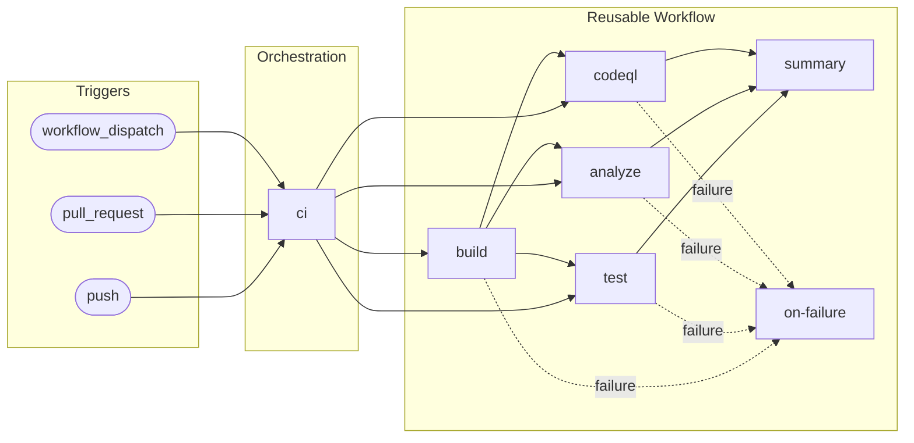

# 🛠️ CI - .NET Build and Test

> Orchestration workflow that triggers and configures the reusable CI workflow for .NET builds, testing, and security scanning.

> [!NOTE]
> **Audience:** DevOps Engineers, Developers, Contributors  
> **Reading time:** ~8 minutes

---

<details>
<summary>🧭 Navigation</summary>

| Previous | Index | Next |
|:---------|:------|:-----|
| — | [📚 Documentation Index](README.md) | [🔄 CI Reusable Workflow](ci-dotnet-reusable.md) |

</details>

---

<details>
<summary>📑 Table of Contents</summary>

- [📋 Overview and Purpose](#-overview-and-purpose)
- [⚡ Triggers](#-triggers)
- [📊 High-Level Workflow Flow](#-high-level-workflow-flow)
- [🔧 Jobs Breakdown](#-jobs-breakdown)
- [📥 Inputs and Parameters](#-inputs-and-parameters)
- [🔐 Secrets and Variables](#-secrets-and-variables)
- [🛡️ Permissions and Security Model](#️-permissions-and-security-model)
- [🌍 Environments and Deployment Strategy](#-environments-and-deployment-strategy)
- [❌ Failure Handling and Recovery](#-failure-handling-and-recovery)
- [🚀 How to Run This Workflow](#-how-to-run-this-workflow)
- [🔌 Extensibility and Customization](#-extensibility-and-customization)
- [⚠️ Known Limitations and Gotchas](#️-known-limitations-and-gotchas)
- [👥 Ownership and Maintenance](#-ownership-and-maintenance)
- [📝 Assumptions and Gaps](#-assumptions-and-gaps)

</details>

---

## 📋 Overview and Purpose

### What This Workflow Does

This workflow serves as the orchestration layer for continuous integration in the Azure Logic Apps Monitoring repository. It delegates execution to a reusable workflow (`ci-dotnet-reusable.yml`) that performs cross-platform builds, testing, code analysis, and security scanning.

**The workflow:**

- Monitors code changes across multiple branch patterns
- Filters execution based on relevant path changes
- Manages concurrency to prevent redundant builds
- Passes configuration to the reusable CI workflow

> [!TIP]
>
> ### ✅ When to Use
>
> - **Automatic execution**: Triggered on push events to monitored branches when source files change
> - **Pull request validation**: Runs automatically when PRs target the `main` branch
> - **Manual execution**: Use `workflow_dispatch` for ad-hoc CI runs with custom configuration
> - **Pre-deployment validation**: Ensures code quality before merging to protected branches

> [!CAUTION]
>
> ### ❌ When NOT to Use
>
> - Infrastructure-only changes (Bicep/Terraform files without application code)
> - Documentation-only updates that do not affect monitored paths
> - Hotfix scenarios where deployment is urgent and CI can be bypassed via the CD workflow's `skip-ci` input

---

## ⚡ Triggers

| Trigger | Conditions | Description |
|:--------|:-----------|:------------|
| `push` | Branches: `main`, `feature/**`, `bugfix/**`, `hotfix/**`, `release/**`, `chore/**`, `docs/**`, `refactor/**`, `test/**` | Triggers on push to specified branch patterns |
| `push` | Paths: `src/**`, `app.*/**`, `*.sln`, `global.json`, `.github/workflows/ci-dotnet*.yml` | Only runs when changes affect application or workflow files |
| `pull_request` | Branches: `main` | Triggers on PR activity targeting the main branch |
| `pull_request` | Paths: Same as push | Same path filtering applies to PRs |
| `workflow_dispatch` | Manual | Allows manual execution with configurable inputs |

### Manual Trigger Inputs

| Input | Type | Default | Description |
|:------|:-----|:--------|:------------|
| `configuration` | choice | `Release` | Build configuration (`Release` or `Debug`) |
| `enable-code-analysis` | boolean | `true` | Toggle code formatting analysis |

---

## 📊 High-Level Workflow Flow

### Narrative Overview

This workflow operates as a thin orchestration layer. Upon trigger evaluation, it checks branch and path filters. If conditions are met, it invokes the reusable CI workflow with the appropriate configuration. The reusable workflow then executes the actual CI jobs in parallel across multiple operating systems.

Concurrency is controlled at the workflow level using a group identifier based on the PR number or branch reference. Duplicate runs for the same branch or PR are automatically cancelled.

### Mermaid Diagram



### Interpretation Notes

- The `ci` job is the only job defined in this workflow; all execution logic resides in the reusable workflow
- Concurrency uses `cancel-in-progress: true`, meaning new pushes to the same branch cancel older runs
- Path filtering reduces unnecessary executions when non-code files are modified
- The reusable workflow executes build, test, analyze, and codeql jobs with internal dependencies

---

## 🔧 Jobs Breakdown

| Job | Responsibility | Dependencies | Conditions |
|:----|:---------------|:-------------|:-----------|
| `ci` | Calls the reusable CI workflow with configuration parameters | None | Always runs when triggers match |

**The `ci` job passes the following configuration to the reusable workflow:**

- Build configuration (Release or Debug)
- .NET SDK version (10.0.x)
- Solution file path (app.sln)
- Artifact naming and retention settings
- Code analysis toggle

---

## 📥 Inputs and Parameters

### Workflow Dispatch Inputs

| Input | Required | Type | Default | Accepted Values |
|:------|:---------|:-----|:--------|:----------------|
| `configuration` | No | choice | `Release` | `Release`, `Debug` |
| `enable-code-analysis` | No | boolean | `true` | `true`, `false` |

### Parameters Passed to Reusable Workflow

| Parameter | Value | Purpose |
|:----------|:------|:--------|
| `configuration` | Input or `Release` | Build configuration |
| `dotnet-version` | `10.0.x` | .NET SDK version |
| `solution-file` | `app.sln` | Solution file path |
| `test-results-artifact-name` | `test-results` | Base name for test artifacts |
| `build-artifacts-name` | `build-artifacts` | Base name for build artifacts |
| `coverage-artifact-name` | `code-coverage` | Base name for coverage artifacts |
| `artifact-retention-days` | `30` | Artifact retention period |
| `runs-on` | `ubuntu-latest` | Runner for non-matrix jobs |
| `enable-code-analysis` | Input or `true` | Toggle code analysis |
| `fail-on-format-issues` | `true` | Fail on formatting errors |

---

## 🔐 Secrets and Variables

### Secrets

| Secret | Scope | Purpose |
|:-------|:------|:--------|
| `inherit` | Repository | All secrets are inherited by the reusable workflow |

> [!NOTE]
> No explicit secrets are defined. The `secrets: inherit` directive passes all repository secrets to the reusable workflow.

### Variables

This workflow does not define or require repository variables. All configuration is either hardcoded or passed via workflow dispatch inputs.

---

## 🛡️ Permissions and Security Model

### GitHub Actions Permissions

| Permission | Level | Purpose |
|:-----------|:------|:--------|
| `contents` | read | Read repository contents for checkout |
| `checks` | write | Create check runs for test results |
| `pull-requests` | write | Post comments and status on PRs |
| `security-events` | write | Upload CodeQL SARIF results to Security tab |

### Security Considerations

- **Least privilege**: Permissions are scoped to the minimum required for CI operations
- **No deployment permissions**: This workflow does not deploy; it only validates code
- **No `id-token: write`**: OIDC authentication is not used in this workflow
- **Inherited secrets**: Secrets are inherited but not explicitly referenced; the reusable workflow determines usage

> [!IMPORTANT]
> This workflow does not have deployment permissions. It only validates code quality and security.

---

## 🌍 Environments and Deployment Strategy

This workflow does not use GitHub Environments. It is a CI-only workflow focused on validation rather than deployment.

---

## ❌ Failure Handling and Recovery

### Failure Behavior

- **Concurrency cancellation**: New runs cancel in-progress runs for the same branch/PR
- **Fail-fast disabled in matrix**: In the reusable workflow, `fail-fast: false` allows all matrix jobs to complete even if one fails
- **Failure reporting**: The reusable workflow includes an `on-failure` job that generates failure reports

### Recovery Steps

1. Review the failed job logs in the GitHub Actions UI
2. Check the workflow summary for aggregated results
3. Fix the identified issues in local development
4. Push a new commit or re-run the workflow

### Retry Behavior

No automatic retry logic is implemented at this workflow level. The reusable workflow may include retry logic for specific operations.

---

## 🚀 How to Run This Workflow

### Automatic Triggers

Push changes to monitored paths on any of the configured branches:

```bash
git checkout -b feature/new-feature
# Make changes to src/**
git add .
git commit -m "feat: add new feature"
git push origin feature/new-feature
```

### Manual Execution

**Via GitHub CLI:**

```bash
gh workflow run ci-dotnet.yml
```

**With custom configuration:**

```bash
gh workflow run ci-dotnet.yml -f configuration=Debug -f enable-code-analysis=false
```

**Via GitHub UI:**

1. Navigate to Actions tab
2. Select "CI - .NET Build and Test"
3. Click "Run workflow"
4. Select configuration options
5. Click "Run workflow"

<details>
<summary>⚠️ Common Mistakes to Avoid</summary>

- Pushing to branches not matching the configured patterns will not trigger the workflow
- Changes outside monitored paths will not trigger execution
- Manually running without checking existing in-progress runs may cause cancellation

</details>

---

## 🔌 Extensibility and Customization

### ✅ Safe Extension Points

- **Add branch patterns**: Extend the `branches` list in push trigger
- **Add path filters**: Extend the `paths` list for additional monitored directories
- **Modify inputs**: Add new `workflow_dispatch` inputs for runtime configuration
- **Adjust concurrency**: Modify the concurrency group pattern if needed

### ⛔ What Should NOT Be Changed

- **Reusable workflow path**: The `uses` reference must match the actual file location
- **Secrets inheritance**: Do not remove `secrets: inherit` unless explicitly handling secrets
- **Permission reductions**: Reducing permissions may break test reporting or CodeQL upload

### Adding Environments

To add environment-specific CI configuration, consider creating separate caller workflows or extending the reusable workflow with environment inputs.

---

## ⚠️ Known Limitations and Gotchas

| Limitation | Impact | Mitigation |
|:-----------|:-------|:-----------|
| Path filters may miss indirect dependencies | Changes to shared code outside monitored paths may not trigger CI | Manually run CI when making infrastructure changes |
| Concurrency cancellation | Rapid successive pushes cancel previous runs | Wait for completion or use force-push sparingly |
| No caching | Dependencies are restored on every run | Accept increased runtime; caching can be added to reusable workflow |
| Matrix failures do not fail-fast | All platform builds complete even if one fails | Intentional design for comprehensive feedback |

---

## 👥 Ownership and Maintenance

### Ownership

| Role | Responsibility |
|:-----|:---------------|
| DevOps Team | Workflow maintenance and updates |
| Repository Maintainers | Reviewing workflow changes |
| Contributors | Understanding CI requirements for PRs |

### Review Expectations

- Workflow changes should be reviewed by at least one DevOps team member
- Changes affecting permissions require security review
- Updates to the reusable workflow may require coordinated updates to this caller

### Change Management

- Document workflow changes in commit messages
- Update this documentation when modifying triggers or configuration
- Test workflow changes in a feature branch before merging

---

## 📝 Assumptions and Gaps

### Assumptions

- The repository contains a valid .NET solution file at `app.sln`
- The reusable workflow `ci-dotnet-reusable.yml` exists at the specified path
- Repository has appropriate permissions configured for the GitHub Actions runner
- .NET 10.0.x SDK is available on GitHub-hosted runners

### Gaps

- **No explicit test project configuration**: The workflow assumes tests are discoverable via the solution file
- **No environment-specific CI configuration**: All branches use the same CI configuration
- **No artifact caching strategy**: Dependencies are restored fresh on each run
- **No notification integration**: Failure notifications are not configured (relies on GitHub defaults)

---

## 📚 Related Documents

| Document | Description |
|:---------|:------------|
| [🔄 CI Reusable Workflow](ci-dotnet-reusable.md) | The reusable workflow called by this orchestration |
| [🚀 CD - Azure Deployment](azure-dev.md) | Deployment workflow that depends on CI |
| [📚 Documentation Index](README.md) | Central index of all DevOps documentation |

---

<div align="center">

[⬆️ Back to Top](#️-ci---net-build-and-test) | [📚 Documentation Index](README.md) | [➡️ Next: CI Reusable](ci-dotnet-reusable.md)

</div>
