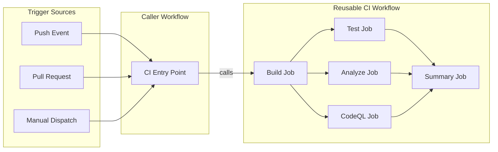

# CI - .NET Build and Test Workflow Documentation

## Table of Contents

- [Overview](#-overview)
- [Triggers](#-triggers)
- [Pipeline Flow](#-pipeline-flow)
- [Jobs Breakdown](#-jobs-breakdown)
- [Inputs and Parameters](#-inputs-and-parameters)
- [Secrets and Variables](#-secrets-and-variables)
- [Permissions and Security Model](#-permissions-and-security-model)
- [Environments and Deployment Strategy](#-environments-and-deployment-strategy)
- [Failure Handling and Recovery](#-failure-handling-and-recovery)
- [How to Run This Workflow](#-how-to-run-this-workflow)
- [Extensibility and Customization](#-extensibility-and-customization)
- [Known Limitations and Gotchas](#-known-limitations-and-gotchas)
- [Ownership and Maintenance](#-ownership-and-maintenance)
- [Assumptions and Gaps](#-assumptions-and-gaps)

## 🧭 Overview

This workflow serves as the entry point for .NET Continuous Integration, orchestrating CI operations by calling a reusable workflow. It handles trigger configuration, path filtering, and passes build configuration to the comprehensive reusable CI pipeline.

### In-Scope Responsibilities

- Define triggering events and path filters for CI execution
- Pass configuration parameters to the reusable CI workflow
- Handle manual workflow dispatch with configurable inputs
- Manage concurrency to prevent duplicate workflow runs

### Out-of-Scope Responsibilities

- Direct build, test, or analysis execution (delegated to reusable workflow)
- Deployment operations (handled by separate CD workflow)
- Infrastructure provisioning

---

## 2. Triggers

| Trigger Type | Configuration | Description |
|-------------|---------------|-------------|
| `push` | Multiple branch patterns | Automatic on push to specified branches |
| `pull_request` | Target: `main` branch | Automatic on PRs targeting main |
| `workflow_dispatch` | Configurable inputs | Manual trigger with build options |

### Branch Patterns (Push Trigger)

| Pattern | Description |
|---------|-------------|
| `main` | Main/production branch |
| `feature/**` | Feature development branches |
| `bugfix/**` | Bug fix branches |
| `hotfix/**` | Emergency fix branches |
| `release/**` | Release preparation branches |
| `chore/**` | Maintenance task branches |
| `docs/**` | Documentation branches |
| `refactor/**` | Code refactoring branches |
| `test/**` | Testing-related branches |

### Path Filters

Changes to the following paths trigger the workflow:

| Path Pattern | Description |
|-------------|-------------|
| `src/**` | Application source code |
| `app.*/**` | App host and service defaults projects |
| `*.sln` | Solution files |
| `global.json` | .NET SDK version configuration |
| `.github/workflows/ci-dotnet.yml` | This workflow file |
| `.github/workflows/ci-dotnet-reusable.yml` | Reusable CI workflow |

### Concurrency Configuration

```yaml
concurrency:
  group: ${{ github.workflow }}-${{ github.event.pull_request.number || github.ref }}
  cancel-in-progress: true
```

- Groups runs by workflow name and PR number or branch reference
- **Cancels in-progress** runs when new commits are pushed (optimizes resource usage)

---

## 3. Pipeline Flow

### Mermaid Diagram



### Interpretation Notes

- **Single entry point**: This workflow acts as a facade, calling the reusable workflow
- **Parallelism**: Build runs first, then test, analyze, and CodeQL run in parallel after build
- **All triggers converge**: Push, PR, and manual dispatch all invoke the same reusable workflow
- **Summary aggregates results**: Waits for all parallel jobs before generating final summary

---

## 4. Jobs Breakdown

| Job | Responsibility | Key Outputs | Conditions |
|-----|---------------|-------------|------------|
| `ci` | Call reusable CI workflow with configured parameters | Inherits outputs from reusable workflow | Always runs |

### Reusable Workflow Call Configuration

| Parameter | Value | Description |
|-----------|-------|-------------|
| `configuration` | `${{ inputs.configuration \|\| 'Release' }}` | Build configuration from input or default |
| `dotnet-version` | `10.0.x` | .NET SDK version |
| `solution-file` | `app.sln` | Solution file to build |
| `test-results-artifact-name` | `test-results` | Artifact name for test results |
| `build-artifacts-name` | `build-artifacts` | Artifact name for build outputs |
| `coverage-artifact-name` | `code-coverage` | Artifact name for coverage reports |
| `artifact-retention-days` | `30` | Days to retain artifacts |
| `runs-on` | `ubuntu-latest` | Runner for analyze/CodeQL/summary jobs |
| `enable-code-analysis` | Dynamic based on input | Enable code formatting check |
| `fail-on-format-issues` | `true` | Fail on formatting violations |

---

## 5. Inputs & Parameters

### Workflow Dispatch Inputs

| Input | Type | Required | Default | Options | Description |
|-------|------|----------|---------|---------|-------------|
| `configuration` | choice | No | `Release` | `Release`, `Debug` | Build configuration |
| `enable-code-analysis` | boolean | No | `true` | - | Enable code formatting analysis |

---

## 6. Secrets & Variables

### Secrets

| Secret | Scope | Purpose |
|--------|-------|---------|
| `inherit` | Repository | All repository secrets passed to reusable workflow |

This workflow uses `secrets: inherit` to pass all repository secrets to the reusable workflow without explicit enumeration.

---

## 7. Permissions & Security Model

### GitHub Actions Permissions

| Permission | Level | Purpose |
|------------|-------|---------|
| `contents` | read | Read repository contents for checkout |
| `checks` | write | Create check runs for test results |
| `pull-requests` | write | Post comments on pull requests |
| `security-events` | write | Upload CodeQL SARIF results |

### Least-Privilege Analysis

| Aspect | Assessment |
|--------|------------|
| No `id-token` permission | Not required (no Azure authentication) |
| Read-only contents | Appropriate for CI (no commits) |
| Write permissions | Limited to checks, PRs, and security events |

---

## 8. Environments & Deployment Strategy

This workflow does **not** deploy to any environment. It is purely a CI validation workflow.

---

## 9. Failure Handling & Recovery

### Failure Behavior

- **Concurrency cancellation**: Previous runs cancelled on new push
- **Reusable workflow handles**: All failure handling delegated to reusable workflow
- **PR status checks**: Failed CI blocks merge if branch protection enabled

### Manual Recovery

1. Review failed job logs in the reusable workflow
2. Fix issues locally and push new commit
3. Re-run failed jobs via GitHub Actions UI if issue was transient

---

## 10. How to Run This Workflow

### Automatic Triggers

1. **Push**: Commit to any of the configured branch patterns with changes to relevant paths
2. **Pull Request**: Open or update PR targeting `main` branch with changes to relevant paths

### Manual Execution

1. Navigate to **Actions** tab in GitHub repository
2. Select **CI - .NET Build and Test** workflow
3. Click **Run workflow**
4. Select branch from dropdown
5. Choose **Build configuration** (`Release` or `Debug`)
6. Toggle **Enable code formatting analysis** as needed
7. Click **Run workflow** button

### Common Operator Mistakes to Avoid

| Mistake | Consequence | Prevention |
|---------|-------------|------------|
| Running on wrong branch | May miss relevant changes | Verify branch before manual run |
| Disabling code analysis | Formatting issues reach main | Keep enabled for production branches |
| Debug builds in PRs | Performance comparison issues | Use Release for PR validation |

---

## 11. Extensibility & Customization

### Safe Extension Points

| Extension Point | How to Extend |
|-----------------|---------------|
| Additional branch patterns | Add to `branches` list in push trigger |
| Additional path filters | Add to `paths` list in trigger configuration |
| New build configurations | Add options to `configuration` input |

### What Should NOT Be Changed

| Component | Reason |
|-----------|--------|
| Reusable workflow path | Breaking change; requires coordinated update |
| Secret inheritance | Ensures reusable workflow has required secrets |
| Concurrency group formula | Prevents duplicate runs and race conditions |

---

## 12. Known Limitations & Gotchas

### Limitations

| Limitation | Impact | Workaround |
|------------|--------|------------|
| Single configuration per run | Cannot run Debug and Release in parallel | Run workflow twice manually |
| Fixed artifact retention | Cannot customize per-branch | Modify reusable workflow inputs |

### Non-Obvious Behavior

- **Cancel in-progress**: Pushing multiple commits quickly cancels intermediate runs
- **Path filtering**: Changes outside filtered paths do not trigger CI
- **PR vs Push**: Both triggers run independently; PR may run twice on push to PR branch

---

## 13. Ownership & Maintenance

### Owning Team

| Role | Responsibility |
|------|----------------|
| Development Team | Branch patterns, path filters |
| Platform Engineering | Reusable workflow configuration |

### Review Expectations

- Changes to trigger configuration require team review
- Permission changes require security review
- Reusable workflow changes require coordinated review

---

## 14. Assumptions & Gaps

### Assumptions Made

1. **Reusable workflow exists**: `.github/workflows/ci-dotnet-reusable.yml` is present and functional
2. **Solution file exists**: `app.sln` is present in repository root
3. **Branch protection configured**: CI status checks enforced for PR merges

### Gaps Identified

| Gap | Impact | Recommendation |
|-----|--------|----------------|
| No scheduled runs | Stale dependency detection delayed | Consider adding cron schedule |
| No dependency caching config | Slower builds | Caching handled by reusable workflow |
