# 🛠️ CI - .NET Build and Test


> Orchestrates the CI pipeline by calling the reusable workflow for .NET builds, tests, and security scanning.

---

## 📑 Table of Contents

- [📋 Overview](#-overview)
  - [Purpose](#purpose)
  - [Scope](#scope)
  - [Key Features](#key-features)
  - [When to Use](#when-to-use)
- [📊 Workflow Diagram](#-workflow-diagram)
- [✅ Prerequisites](#-prerequisites)
- [⚡ Trigger Events](#-trigger-events)
- [⚙️ Configuration Reference](#️-configuration-reference)
  - [Environment Variables](#environment-variables)
  - [Secrets](#secrets)
  - [Repository Variables](#repository-variables)
- [🔧 Jobs & Steps Breakdown](#-jobs--steps-breakdown)
  - [CI Job](#ci-job)
- [📦 Artifacts](#-artifacts)
- [💡 Usage Examples](#-usage-examples)
- [🔍 Troubleshooting](#-troubleshooting)
- [🔗 Related Resources](#-related-resources)

---

## 📋 Overview

### Purpose

This workflow serves as the orchestration layer for continuous integration. It handles all trigger events and passes the appropriate configuration to the reusable CI workflow. This separation allows for centralized trigger management while keeping the CI logic reusable across multiple workflows.

### Scope

- Applies to the main application repository
- Triggers on push events to multiple branch patterns
- Triggers on pull requests targeting `main` branch
- Supports manual workflow dispatch for ad-hoc runs

### Key Features

- **Branch Pattern Filtering** - Monitors feature, bugfix, hotfix, release, and documentation branches
- **Path Filtering** - Only triggers when relevant source files change
- **Concurrency Control** - Cancels in-progress runs for the same branch/PR
- **Flexible Configuration** - Supports runtime configuration via workflow dispatch
- **Cross-Platform Testing** - Executes on Ubuntu, Windows, and macOS via reusable workflow

### When to Use

- Automatically triggered on code changes to monitored paths
- Manually triggered for ad-hoc CI runs with custom configuration
- On pull requests to validate changes before merging
- As a prerequisite for deployment workflows

---

## 📊 Workflow Diagram

```mermaid
flowchart TD
    subgraph "Triggers"
        A([Push Event]) --> D{Path Match?}
        B([Pull Request]) --> D
        C([Manual Dispatch]) --> E[Custom Config]
        D -->|Yes| F[Apply Defaults]
        D -->|No| G([Skip])
        E --> F
    end

    subgraph "Concurrency Control"
        F --> H{Existing Run?}
        H -->|Yes| I[Cancel Previous]
        H -->|No| J[Continue]
        I --> J
    end

    subgraph "CI Execution"
        J --> K[🚀 CI Job]
        K --> L[Reusable Workflow]
        
        subgraph "ci-dotnet-reusable.yml"
            L --> M[🔨 Build Matrix]
            L --> N[🧪 Test Matrix]
            L --> O[🔍 Analyze]
            L --> P[🛡️ CodeQL]
            M --> Q[📊 Summary]
            N --> Q
            O --> Q
            P --> Q
        end
    end

    subgraph "Results"
        Q --> R{All Passed?}
        R -->|Yes| S([✅ CI Passed])
        R -->|No| T([❌ CI Failed])
    end

    style K fill:#4CAF50,color:#fff
    style L fill:#2196F3,color:#fff
    style S fill:#4CAF50,color:#fff
    style T fill:#f44336,color:#fff
```



---

## ✅ Prerequisites

| Requirement | Type | Description | Setup Instructions |
|:------------|:-----|:------------|:-------------------|
| **contents: read** | Permission | Read repository contents for checkout | Configured in workflow permissions |
| **checks: write** | Permission | Create check runs for test results | Configured in workflow permissions |
| **pull-requests: write** | Permission | Post comments and status on PRs | Configured in workflow permissions |
| **security-events: write** | Permission | Upload CodeQL SARIF results to Security tab | Configured in workflow permissions |
| **Solution File** | Code | `app.sln` in repository root | Already present in repository |
| **global.json** | Code | .NET SDK version specification | Recommended for version consistency |

---

## ⚡ Trigger Events

| Event | Branches | Paths | Conditions |
|:------|:---------|:------|:-----------|
| **push** | `main`, `feature/**`, `bugfix/**`, `hotfix/**`, `release/**`, `chore/**`, `docs/**`, `refactor/**`, `test/**` | `src/**`, `app.*/**`, `*.sln`, `global.json`, `.github/workflows/ci-dotnet.yml`, `.github/workflows/ci-dotnet-reusable.yml` | Automatic on push |
| **pull_request** | `main` | `src/**`, `app.*/**`, `*.sln`, `global.json`, `.github/workflows/ci-dotnet.yml`, `.github/workflows/ci-dotnet-reusable.yml` | Automatic on PR |
| **workflow_dispatch** | Any | N/A | Manual trigger with inputs |

### Branch Pattern Details

| Pattern | Description | Example |
|:--------|:------------|:--------|
| `main` | Main development branch | Direct commits (protected) |
| `feature/**` | New feature development | `feature/add-login` |
| `bugfix/**` | Bug fix branches | `bugfix/fix-null-ref` |
| `hotfix/**` | Production hotfixes | `hotfix/critical-fix` |
| `release/**` | Release preparation | `release/v2.0.0` |
| `chore/**` | Maintenance tasks | `chore/update-deps` |
| `docs/**` | Documentation updates | `docs/api-reference` |
| `refactor/**` | Code refactoring | `refactor/cleanup-services` |
| `test/**` | Test additions/updates | `test/add-integration-tests` |

### Manual Trigger Inputs

| Input | Type | Default | Options | Description |
|:------|:-----|:--------|:--------|:------------|
| `configuration` | choice | `Release` | `Release`, `Debug` | Build configuration to use |
| `enable-code-analysis` | boolean | `true` | `true`, `false` | Enable code formatting analysis |

---

## ⚙️ Configuration Reference

### Environment Variables

This workflow does not define workflow-level environment variables. All configuration is passed to the reusable workflow via inputs.

### Secrets

| Secret Name | Required | Source | Purpose |
|:------------|:---------|:-------|:--------|
| `inherit` | Yes | Repository | All secrets inherited for reusable workflow |

### Repository Variables

This workflow does not require repository variables. All configuration is hardcoded or passed via workflow dispatch inputs.

---

## 🔧 Jobs & Steps Breakdown

### CI Job

**Purpose:** Orchestrate the complete CI pipeline by calling the reusable workflow.

- **Reusable Workflow:** `./.github/workflows/ci-dotnet-reusable.yml`
- **Dependencies:** None
- **Conditions:** Always runs when triggered

**Configuration Passed:**

| Input | Value | Description |
|:------|:------|:------------|
| `configuration` | `${{ inputs.configuration \|\| 'Release' }}` | Build configuration from input or default |
| `dotnet-version` | `10.0.x` | .NET SDK version |
| `solution-file` | `app.sln` | Solution file path |
| `test-results-artifact-name` | `test-results` | Test results artifact base name |
| `build-artifacts-name` | `build-artifacts` | Build artifacts base name |
| `coverage-artifact-name` | `code-coverage` | Coverage artifacts base name |
| `artifact-retention-days` | `30` | Artifact retention period |
| `runs-on` | `ubuntu-latest` | Runner for non-matrix jobs |
| `enable-code-analysis` | `${{ inputs.enable-code-analysis == '' && true \|\| inputs.enable-code-analysis }}` | Code analysis toggle |
| `fail-on-format-issues` | `true` | Fail on formatting errors |

**Jobs Executed (via reusable workflow):**

1. **🔨 Build** - Cross-platform compilation (Ubuntu, Windows, macOS)
2. **🧪 Test** - Cross-platform testing with coverage
3. **🔍 Analyze** - Code formatting verification (optional)
4. **🛡️ CodeQL** - Security vulnerability scanning (always runs)
5. **📊 Summary** - Aggregated results report
6. **❌ On-Failure** - Failure handling (conditional)

---

## 📦 Artifacts

All artifacts are generated by the reusable workflow. See [ci-dotnet-reusable.md](ci-dotnet-reusable.md#-artifacts) for detailed artifact documentation.

| Artifact Name | Contents | Retention | Usage |
|:--------------|:---------|:----------|:------|
| `build-artifacts-{os}` | Compiled binaries per platform | 30 days | Deployment pipelines |
| `test-results-{os}` | Test results (.trx) per platform | 30 days | Test analysis |
| `code-coverage-{os}` | Coverage reports (Cobertura) per platform | 30 days | Coverage tools |
| `codeql-sarif-results` | Security scan results (SARIF) | 30 days | Security tab |

---

## 💡 Usage Examples

### Automatic Trigger (Push)

```bash
# Create a feature branch and push changes
git checkout -b feature/new-feature
# Make code changes to src/**
git add .
git commit -m "feat: add new feature"
git push origin feature/new-feature
# CI workflow triggers automatically
```

### Automatic Trigger (Pull Request)

```bash
# Create PR from feature branch to main
gh pr create --base main --head feature/new-feature \
  --title "feat: add new feature" \
  --body "Adds new feature functionality"
# CI workflow triggers automatically
```

### Manual Trigger (Default Configuration)

```yaml
# Via GitHub CLI
gh workflow run ci-dotnet.yml

# Via GitHub UI
# Navigate to Actions → CI - .NET Build and Test → Run workflow
```

### Manual Trigger (Debug Configuration)

```yaml
# Via GitHub CLI
gh workflow run ci-dotnet.yml \
  -f configuration=Debug \
  -f enable-code-analysis=false

# Via GitHub UI
# 1. Navigate to Actions → CI - .NET Build and Test → Run workflow
# 2. Select "Debug" for Build configuration
# 3. Uncheck "Enable code formatting analysis"
# 4. Click "Run workflow"
```

### Checking Workflow Status

```bash
# List recent workflow runs
gh run list --workflow=ci-dotnet.yml

# View specific run details
gh run view <run-id>

# Watch a running workflow
gh run watch <run-id>
```

---

## 🔍 Troubleshooting

| Symptom | Possible Cause | Solution |
|:--------|:---------------|:---------|
| **Workflow not triggering on push** | Path filters not matching changed files | Verify changes are in `src/**`, `app.*/**`, or other monitored paths |
| **Workflow not triggering on PR** | PR not targeting `main` branch | Ensure PR base branch is `main` |
| **Previous run not cancelled** | Concurrency group mismatch | Check that branch name matches expected pattern |
| **inputs.configuration is empty** | First-time default handling | Expression handles empty input: `inputs.configuration \|\| 'Release'` |
| **enable-code-analysis always true** | Complex default expression | Expression `inputs.enable-code-analysis == '' && true \|\| inputs.enable-code-analysis` handles unset |
| **Reusable workflow not found** | Incorrect path or branch | Verify `.github/workflows/ci-dotnet-reusable.yml` exists on same branch |
| **Secrets not available** | Missing `secrets: inherit` | Ensure `secrets: inherit` is specified in workflow call |

<details>
<summary>🔧 Debugging Tips</summary>

### Check Trigger Conditions

```bash
# View workflow file to verify triggers
cat .github/workflows/ci-dotnet.yml | head -70

# Check which files changed in last commit
git diff --name-only HEAD~1

# Verify path matches trigger filter
echo "src/MyFile.cs" | grep -E "^(src|app\.\*)/"
```

### Verify Concurrency Behavior

```bash
# List active workflow runs
gh run list --workflow=ci-dotnet.yml --status=in_progress

# Cancel a specific run
gh run cancel <run-id>
```

### Debug Reusable Workflow Call

```yaml
# Add this step to debug inputs being passed
- name: Debug inputs
  run: |
    echo "configuration: ${{ inputs.configuration || 'Release' }}"
    echo "enable-code-analysis: ${{ inputs.enable-code-analysis }}"
```

</details>

---

## 🔗 Related Resources

### 📚 Internal

- [ci-dotnet-reusable.md](ci-dotnet-reusable.md) - Detailed documentation for the reusable CI workflow
- [azure-dev.md](azure-dev.md) - CD workflow that depends on this CI workflow

### 🌐 External

- [GitHub Actions Workflow Syntax](https://docs.github.com/actions/using-workflows/workflow-syntax-for-github-actions)
- [Reusing Workflows](https://docs.github.com/actions/using-workflows/reusing-workflows)
- [Events that Trigger Workflows](https://docs.github.com/actions/using-workflows/events-that-trigger-workflows)
- [Workflow Concurrency](https://docs.github.com/actions/using-workflows/workflow-syntax-for-github-actions#concurrency)
- [.NET Build and Test Documentation](https://docs.github.com/actions/automating-builds-and-tests/building-and-testing-net)

### 🆘 Support

- 📖 [Repository Issues](https://github.com/Evilazaro/Azure-LogicApps-Monitoring/issues)
- 💬 Contact the DevOps team for CI pipeline assistance

---

[⬆️ Back to Top](#️-ci---net-build-and-test)
