# 🔄 CI - .NET Build and Test Workflow

> [!NOTE]
> **Target Audience:** Developers, DevOps Engineers, QA Engineers<br/>
> **Reading Time:** ~8 minutes

<details>
<summary>📍 Navigation</summary>

| Previous                  |           Index           |                                 Next |
| :------------------------ | :-----------------------: | -----------------------------------: |
| [DevOps Index](README.md) | [DevOps Index](README.md) | [CI Reusable](ci-dotnet-reusable.md) |

</details>

---

## 📑 Table of Contents

- [🔄 CI - .NET Build and Test Workflow](#-ci---net-build-and-test-workflow)
  - [📑 Table of Contents](#-table-of-contents)
  - [📖 Overview](#-overview)
  - [📊 Pipeline Visualization](#-pipeline-visualization)
  - [🎯 Triggers](#-triggers)
  - [📋 Jobs](#-jobs)
  - [⚙️ Configuration](#️-configuration)
  - [📦 Artifacts](#-artifacts)
  - [💡 Usage Examples](#-usage-examples)
  - [🔧 Troubleshooting](#-troubleshooting)
  - [📚 Related Documentation](#-related-documentation)

---

## 📖 Overview

The **CI - .NET Build and Test** workflow (`ci-dotnet.yml`) is the continuous integration pipeline that orchestrates code quality validation for the .NET solution. It serves as the entry point that calls the reusable CI workflow with appropriate configuration.

This workflow provides:

- Cross-platform builds (Ubuntu, Windows, macOS)
- Cross-platform testing with code coverage (Cobertura)
- Code formatting analysis (.editorconfig compliance)
- CodeQL security vulnerability scanning
- Test result publishing with detailed summaries

---

## 📊 Pipeline Visualization

```mermaid
flowchart TD
    subgraph Triggers["🎯 Triggers"]
        T1([push])
        T2([pull_request])
        T3([workflow_dispatch])
    end

    subgraph PathFilters["📁 Path Filters"]
        PF[src/**, app.*/**,<br/>*.sln, global.json,<br/>workflow files]
    end

    subgraph CI["🚀 CI Pipeline"]
        CI_CALL[[ci-dotnet-reusable.yml]]
    end

    subgraph Jobs["📋 Jobs Executed"]
        direction TB

        subgraph BuildMatrix["🔨 Build Matrix"]
            B1[Ubuntu]
            B2[Windows]
            B3[macOS]
        end

        subgraph TestMatrix["🧪 Test Matrix"]
            T_U[Ubuntu]
            T_W[Windows]
            T_M[macOS]
        end

        ANALYZE[🔍 Analyze]
        CODEQL[🛡️ CodeQL]
        SUMMARY[📊 Summary]
    end

    %% Trigger flows
    T1 --> PF
    T2 --> PF
    T3 --> CI_CALL
    PF --> CI_CALL

    %% CI to Jobs
    CI_CALL --> BuildMatrix
    BuildMatrix --> TestMatrix
    BuildMatrix --> ANALYZE
    BuildMatrix --> CODEQL
    TestMatrix --> SUMMARY
    ANALYZE --> SUMMARY
    CODEQL --> SUMMARY

    %% Styling
    classDef trigger fill:#2196F3,stroke:#1565C0,color:#fff
    classDef filter fill:#FFC107,stroke:#FFA000,color:#000
    classDef reusable fill:#9C27B0,stroke:#6A1B9A,color:#fff
    classDef build fill:#FF9800,stroke:#EF6C00,color:#fff
    classDef test fill:#9C27B0,stroke:#6A1B9A,color:#fff
    classDef security fill:#607D8B,stroke:#455A64,color:#fff
    classDef summary fill:#00BCD4,stroke:#0097A7,color:#fff

    class T1,T2,T3 trigger
    class PF filter
    class CI_CALL reusable
    class B1,B2,B3 build
    class T_U,T_W,T_M test
    class ANALYZE test
    class CODEQL security
    class SUMMARY summary
```

<details>
<summary>🔍 Click to expand pipeline diagram</summary>



</details>

---

## 🎯 Triggers

| Trigger             | Branches                                                                                                      | Description                       |
| :------------------ | :------------------------------------------------------------------------------------------------------------ | :-------------------------------- |
| `push`              | `main`, `feature/**`, `bugfix/**`, `hotfix/**`, `release/**`, `chore/**`, `docs/**`, `refactor/**`, `test/**` | Triggers on push to any branch    |
| `pull_request`      | `main`                                                                                                        | Triggers on PRs targeting main    |
| `workflow_dispatch` | Any                                                                                                           | Manual trigger with configuration |

### Path Filters

The workflow only triggers when changes are made to:

| Path Pattern                               | Description                 |
| :----------------------------------------- | :-------------------------- |
| `src/**`                                   | Source code files           |
| `app.*/**`                                 | AppHost and ServiceDefaults |
| `*.sln`                                    | Solution files              |
| `global.json`                              | .NET SDK configuration      |
| `.github/workflows/ci-dotnet.yml`          | This workflow file          |
| `.github/workflows/ci-dotnet-reusable.yml` | Reusable workflow file      |

### Manual Trigger Inputs

| Input                  | Type    | Default   | Description                         |
| :--------------------- | :------ | :-------- | :---------------------------------- |
| `configuration`        | choice  | `Release` | Build configuration (Release/Debug) |
| `enable-code-analysis` | boolean | `true`    | Enable code formatting analysis     |

---

## 📋 Jobs

### 🚀 CI (Reusable Workflow Call)

This workflow delegates all CI operations to the reusable workflow.

| Property     | Value                                        |
| :----------- | :------------------------------------------- |
| **Workflow** | `./.github/workflows/ci-dotnet-reusable.yml` |
| **Secrets**  | `inherit` (passes all secrets)               |

#### Configuration Passed

```yaml
configuration: ${{ inputs.configuration || 'Release' }}
dotnet-version: "10.0.x"
solution-file: "app.sln"
test-results-artifact-name: "test-results"
build-artifacts-name: "build-artifacts"
coverage-artifact-name: "code-coverage"
artifact-retention-days: 30
runs-on: "ubuntu-latest"
enable-code-analysis: ${{ inputs.enable-code-analysis == '' && true || inputs.enable-code-analysis }}
fail-on-format-issues: true
```

### Jobs Executed (via Reusable Workflow)

The reusable workflow executes the following jobs:

```mermaid
flowchart LR
    subgraph CrossPlatform["🌐 Cross-Platform Matrix"]
        direction TB
        BUILD["🔨 Build<br/>(Ubuntu, Windows, macOS)"]
        TEST["🧪 Test<br/>(Ubuntu, Windows, macOS)"]
    end

    subgraph SingleRunner["🖥️ Single Runner"]
        ANALYZE["🔍 Analyze"]
        CODEQL["🛡️ CodeQL"]
    end

    subgraph Final["📊 Aggregation"]
        SUMMARY["📊 Summary"]
        FAILURE["❌ On-Failure"]
    end

    BUILD --> TEST
    BUILD --> ANALYZE
    BUILD --> CODEQL
    TEST --> SUMMARY
    ANALYZE --> SUMMARY
    CODEQL --> SUMMARY
    SUMMARY -.->|failure| FAILURE

    classDef build fill:#FF9800,stroke:#EF6C00,color:#fff
    classDef test fill:#9C27B0,stroke:#6A1B9A,color:#fff
    classDef security fill:#607D8B,stroke:#455A64,color:#fff
    classDef summary fill:#00BCD4,stroke:#0097A7,color:#fff
    classDef failure fill:#F44336,stroke:#C62828,color:#fff

    class BUILD build
    class TEST test
    class ANALYZE test
    class CODEQL security
    class SUMMARY summary
    class FAILURE failure
```

<details>
<summary>🔍 View jobs flow diagram</summary>



</details>

### Job Details

| Job           | Runner                          | Description                                   |
| :------------ | :------------------------------ | :-------------------------------------------- |
| 🔨 Build      | Matrix (ubuntu, windows, macos) | Compiles solution on all platforms            |
| 🧪 Test       | Matrix (ubuntu, windows, macos) | Runs tests with coverage on all platforms     |
| 🔍 Analyze    | ubuntu-latest                   | Verifies code formatting (optional)           |
| 🛡️ CodeQL     | ubuntu-latest                   | Security vulnerability scanning (always runs) |
| 📊 Summary    | ubuntu-latest                   | Aggregates results from all jobs              |
| ❌ On-Failure | ubuntu-latest                   | Reports failures (runs only on failure)       |

---

## ⚙️ Configuration

### Required Permissions

```yaml
permissions:
  contents: read # Read repository contents
  checks: write # Create check runs for test results
  pull-requests: write # Post comments on pull requests
  security-events: write # Upload CodeQL SARIF results
```

### .NET SDK

- Version: `10.0.x`
- Workloads: Updated automatically during workflow

### Code Quality Requirements

- `.editorconfig` file for formatting rules
- Solution file (`app.sln`) at repository root

---

## 📦 Artifacts

| Artifact               | Description                      | Retention |
| :--------------------- | :------------------------------- | :-------- |
| `build-artifacts-{os}` | Compiled binaries per platform   | 30 days   |
| `test-results-{os}`    | Test execution results (.trx)    | 30 days   |
| `code-coverage-{os}`   | Coverage reports (Cobertura XML) | 30 days   |
| `codeql-sarif-results` | Security scan results (SARIF)    | 30 days   |

### Concurrency

```yaml
concurrency:
  group: ${{ github.workflow }}-${{ github.event.pull_request.number || github.ref }}
  cancel-in-progress: true
```

Prevents duplicate workflow runs for the same branch/PR and cancels in-progress runs when new commits are pushed.

---

## 💡 Usage Examples

### Automatic Trigger

```bash
# Push to any configured branch triggers CI
git push origin feature/my-feature
```

### Manual Trigger

```bash
# Trigger with default configuration (Release)
gh workflow run ci-dotnet.yml

# Trigger with Debug configuration
gh workflow run ci-dotnet.yml -f configuration=Debug

# Trigger without code analysis
gh workflow run ci-dotnet.yml -f enable-code-analysis=false
```

### Pull Request

```bash
# Create PR to main - automatically triggers CI
gh pr create --base main --title "My feature"
```

---

## 🔧 Troubleshooting

### Common Issues

> [!WARNING]
> Platform-specific issues are common in cross-platform builds. Always test on all platforms before merging.

| Issue                            | Cause                            | Solution                                 |
| :------------------------------- | :------------------------------- | :--------------------------------------- |
| Build fails on one platform only | Platform-specific code issues    | Check conditional compilation directives |
| Code formatting check fails      | Code doesn't match .editorconfig | Run `dotnet format` locally              |
| Tests fail on specific OS        | Environment-dependent tests      | Review test assumptions about file paths |
| CodeQL timeout                   | Large codebase analysis          | CodeQL has 45-minute timeout             |

### Local Verification

> [!TIP]
> Run these commands before pushing to catch issues early.

```bash
# Build solution
dotnet build app.sln --configuration Release

# Run tests with coverage
dotnet test app.sln --configuration Release --collect:"XPlat Code Coverage"

# Check code formatting
dotnet format app.sln --verify-no-changes

# Fix formatting issues
dotnet format app.sln
```

---

## 📚 Related Documentation

- [Reusable CI Workflow](ci-dotnet-reusable.md) - Detailed documentation of the reusable workflow
- [CD - Azure Deployment](azure-dev.md) - Deployment workflow that uses this CI
- [GitHub Actions .NET Documentation](https://docs.github.com/en/actions/automating-builds-and-tests/building-and-testing-net)

---

[⬆️ Back to Top](#-ci---net-build-and-test-workflow)

---

<div align="center">

**[← DevOps Index](README.md)** | **[DevOps Index](README.md)** | **[CI Reusable →](ci-dotnet-reusable.md)**

</div>
