# 🔄 CI - .NET Build and Test

> **Workflow File:** [ci-dotnet.yml](../../.github/workflows/ci-dotnet.yml)

---

## 📑 Table of Contents

- [📋 Overview](#-overview)
- [🗺️ Pipeline Visualization](#%EF%B8%8F-pipeline-visualization)
- [🎯 Triggers](#-triggers)
- [📋 Jobs & Steps](#-jobs--steps)
- [🔐 Prerequisites](#-prerequisites)
- [📦 Artifacts](#-artifacts)
- [🚀 Usage Examples](#-usage-examples)
- [🔍 Troubleshooting](#-troubleshooting)
- [🔗 Related Documentation](#-related-documentation)

---

## 📋 Overview

This workflow orchestrates the CI pipeline by calling the reusable workflow. It handles triggers, path filters, and passes configuration to the reusable CI workflow for .NET solutions.

### Key Features

| Feature | Description |
| ------- | ----------- |
| ✅ **Automatic Triggering** | On push and pull requests |
| 🔧 **Configurable Build** | Release/Debug configuration options |
| 🧪 **Cross-Platform Testing** | Optional matrix testing (Ubuntu, Windows, macOS) |
| 🔍 **Code Analysis** | Formatting analysis with `.editorconfig` |
| 📊 **Test Reporting** | Detailed summaries and result publishing |
| 📦 **Build Artifacts** | Upload for debugging and verification |

---

## 🗺️ Pipeline Visualization

```mermaid
---
title: CI - .NET Build and Test Pipeline
---
flowchart LR
    %% ===== TRIGGER EVENTS =====
    subgraph TriggersGroup["🎯 Triggers"]
        push(["Push to Branches"])
        pr(["Pull Request to Main"])
        manual(["Manual Dispatch"])
    end

    %% ===== MANUAL INPUTS =====
    subgraph InputsGroup["⚙️ Manual Inputs"]
        config{"Configuration"}
        analysis{"Enable Code Analysis"}
        matrix{"Enable Matrix Testing"}
    end

    %% ===== CI PIPELINE =====
    subgraph CIPipeline["🔄 CI Pipeline"]
        ci_call[["CI Reusable Workflow"]]
        
        subgraph JobsGroup["Reusable Workflow Jobs"]
            build(["Build"])
            test(["Test"])
            analyze(["Analyze"])
            summary(["Summary"])
        end
    end

    %% ===== ARTIFACTS =====
    subgraph ArtifactsGroup["📦 Artifacts"]
        build_art[/"build-artifacts"/]
        test_art[/"test-results"/]
        cov_art[/"code-coverage"/]
    end

    %% Trigger flow - events initiate pipeline
    push -->|triggers| ci_call
    pr -->|triggers| ci_call
    manual -->|configures| config
    config -->|passes to| ci_call
    analysis -.->|optional| ci_call
    matrix -.->|optional| ci_call

    %% CI flow - job execution sequence
    ci_call -->|starts| build
    build -->|on success| test
    build -->|on success| analyze
    test -->|reports to| summary
    analyze -->|reports to| summary

    %% Artifact flow - store outputs
    build -->|stores| build_art
    test -->|stores| test_art
    test -->|stores| cov_art

    %% ===== STYLING DEFINITIONS =====
    %% Triggers: Blue - entry points
    classDef trigger fill:#2196F3,stroke:#1565C0,color:#FFFFFF
    %% Inputs: Yellow - user decisions
    classDef input fill:#FFC107,stroke:#F57F17,color:#000000
    %% Reusable workflows: Gray dashed - external calls
    classDef reusable fill:#607D8B,stroke:#455A64,color:#FFFFFF,stroke-dasharray: 5 5
    %% Build steps: Orange - compilation
    classDef build fill:#FF9800,stroke:#E65100,color:#FFFFFF
    %% Test steps: Purple - testing
    classDef test fill:#9C27B0,stroke:#6A1B9A,color:#FFFFFF
    %% Analyze steps: Cyan - code analysis
    classDef analyze fill:#00BCD4,stroke:#00838F,color:#FFFFFF
    %% Summary: Green - reporting
    classDef summary fill:#4CAF50,stroke:#2E7D32,color:#FFFFFF
    %% Artifacts: Light green - stored files
    classDef artifact fill:#8BC34A,stroke:#558B2F,color:#FFFFFF

    %% Apply styles to nodes
    class push,pr,manual trigger
    class config,analysis,matrix input
    class ci_call reusable
    class build build
    class test test
    class analyze analyze
    class summary summary
    class build_art,test_art,cov_art artifact
```



---

## 🎯 Triggers

### Push Events

| Branch Pattern | Description |
| -------------- | ----------- |
| `main` | Main development branch |
| `feature/**` | Feature branches |
| `bugfix/**` | Bug fix branches |
| `hotfix/**` | Hotfix branches |
| `release/**` | Release branches |
| `chore/**` | Maintenance branches |
| `docs/**` | Documentation branches |
| `refactor/**` | Refactoring branches |
| `test/**` | Test branches |

### Pull Request Events

| Target Branch | Description |
| ------------- | ----------- |
| `main` | Pull requests targeting main branch |

### Path Filters

The workflow monitors changes to these paths:

```yaml
paths:
  - "src/**"                              # Source code
  - "app.*/**"                            # .NET Aspire projects
  - "*.sln"                               # Solution files
  - "global.json"                         # .NET SDK configuration
  - ".github/workflows/ci-dotnet.yml"     # This workflow
  - ".github/workflows/ci-dotnet-reusable.yml"  # Reusable workflow
```

### Manual Dispatch Inputs

| Input | Type | Default | Options | Description |
| ----- | ---- | ------- | ------- | ----------- |
| `configuration` | `choice` | `Release` | `Release`, `Debug` | Build configuration |
| `enable-code-analysis` | `boolean` | `true` | - | Enable code formatting analysis |
| `enable-matrix` | `boolean` | `false` | - | Enable cross-platform matrix testing |

---

## 📋 Jobs & Steps

### Job: 🚀 CI

This workflow consists of a single job that calls the reusable CI workflow.

| Property | Value |
| -------- | ----- |
| **Type** | Reusable workflow call |
| **Workflow** | `.github/workflows/ci-dotnet-reusable.yml` |
| **Secrets** | Inherited |

### Reusable Workflow Parameters

| Parameter | Value | Description |
| --------- | ----- | ----------- |
| `configuration` | `${{ inputs.configuration \|\| 'Release' }}` | Build configuration |
| `dotnet-version` | `10.0.x` | .NET SDK version |
| `solution-file` | `app.sln` | Solution file path |
| `test-results-artifact-name` | `test-results` | Test results artifact name |
| `build-artifacts-name` | `build-artifacts` | Build artifacts name |
| `coverage-artifact-name` | `code-coverage` | Coverage artifact name |
| `artifact-retention-days` | `30` | Artifact retention period |
| `runs-on` | `ubuntu-latest` | Runner environment |
| `enable-code-analysis` | Dynamic | Enable code analysis |
| `enable-matrix` | `${{ inputs.enable-matrix \|\| false }}` | Enable matrix testing |
| `fail-on-format-issues` | `true` | Fail on formatting issues |

---

## 🔐 Prerequisites

### Required Permissions

```yaml
permissions:
  contents: read       # Required for checkout
  checks: write        # Required for test reporter
  pull-requests: write # Required for PR comments
```

### Concurrency Configuration

```yaml
concurrency:
  group: ${{ github.workflow }}-${{ github.event.pull_request.number || github.ref }}
  cancel-in-progress: true
```

> 💡 **Note:** This prevents duplicate workflow runs for the same branch/PR and cancels in-progress runs when new commits are pushed.

---

## 📦 Artifacts

| Artifact | Contents | Retention |
| -------- | -------- | --------- |
| `build-artifacts` | Compiled binaries | 7 days |
| `test-results` | Test execution results (`.trx`) | 30 days |
| `code-coverage` | Cobertura XML coverage reports | 30 days |

---

## 🚀 Usage Examples

### Automatic CI on Push

```bash
# Create a feature branch and push
git checkout -b feature/my-feature
# Make changes...
git add .
git commit -m "feat: implement new feature"
git push origin feature/my-feature
```

### Automatic CI on Pull Request

```bash
# Create PR from feature branch
gh pr create --base main --head feature/my-feature
```

### Manual CI Run (UI)

1. Go to **Actions** → **CI - .NET Build and Test**
2. Click **Run workflow**
3. Select configuration options:
   - **Build configuration**: Release or Debug
   - **Enable code formatting analysis**: Check/uncheck
   - **Enable cross-platform matrix testing**: Check/uncheck
4. Click **Run workflow**

### Manual CI Run (CLI)

```bash
# Run with defaults
gh workflow run ci-dotnet.yml

# Run with Debug configuration
gh workflow run ci-dotnet.yml -f configuration=Debug

# Run with matrix testing enabled
gh workflow run ci-dotnet.yml -f enable-matrix=true

# Run with all options
gh workflow run ci-dotnet.yml \
  -f configuration=Release \
  -f enable-code-analysis=true \
  -f enable-matrix=true
```

---

## 🔍 Troubleshooting

### Common Issues

| Issue | Cause | Solution |
| ----- | ----- | -------- |
| Build fails | Missing NuGet packages | Check `dotnet restore` logs |
| Tests fail | Test failures | Download `test-results` artifact for details |
| Format check fails | Code style violations | Run `dotnet format app.sln` locally |
| Matrix job fails | OS-specific issue | Check logs for the specific OS |

### Local Verification

```bash
# Restore dependencies
dotnet restore app.sln

# Build solution
dotnet build app.sln --configuration Release

# Run tests
dotnet test app.sln --configuration Release

# Check formatting
dotnet format app.sln --verify-no-changes

# Fix formatting issues
dotnet format app.sln
```

### Viewing Test Results

1. Navigate to the workflow run
2. Click on the **Test Results** check
3. View individual test results and failures
4. Download `test-results` artifact for detailed `.trx` files

---

## 🔗 Related Documentation

| Resource | Description |
| -------- | ----------- |
| [CI - .NET Reusable Workflow](./ci-dotnet-reusable.md) | Reusable CI workflow details |
| [CD - Azure Deployment](./azure-dev.md) | Azure deployment workflow |
| [.NET Testing Documentation](https://docs.microsoft.com/en-us/dotnet/core/testing/) | Microsoft testing guide |
| [dotnet format Documentation](https://docs.microsoft.com/en-us/dotnet/core/tools/dotnet-format) | Code formatting tool |

---

[⬆️ Back to top](#-ci---net-build-and-test)
