# Workflow: CI - .NET Build and Test


## Overview

| Property | Value |
|----------|-------|
| **File** | `.github/workflows/ci-dotnet.yml` |
| **Name** | CI - .NET Build and Test |
| **Triggers** | `push` (branches: `main`, `feature/**`, `bugfix/**`, `hotfix/**`, `release/**`, `chore/**`, `docs/**`, `refactor/**`, `test/**`), `pull_request` (branches: `main`), `workflow_dispatch` |

This workflow orchestrates the CI pipeline by calling the reusable workflow (`ci-dotnet-reusable.yml`). It handles triggers, path filters, and passes configuration to the reusable workflow. Features include cross-platform builds, testing with code coverage, code formatting analysis, and CodeQL security vulnerability scanning.

## Workflow Diagram

```mermaid
%%{init: {'theme': 'base', 'themeVariables': {'fontSize': '14px', 'primaryColor': '#E3F2FD', 'lineColor': '#90A4AE', 'textColor': '#37474F', 'clusterBkg': '#FAFAFA'}}}%%
flowchart TB
    subgraph wf["🔄 Workflow: CI - .NET Build and Test"]
        direction TB
        
        subgraph triggers-stage["⚡ Stage: Triggers"]
            direction LR
            subgraph events["Events"]
                direction LR
                push-trigger(["🔔 push: main, feature/**, etc."]):::node-trigger
                pr-trigger(["🔔 pull_request: main"]):::node-trigger
                dispatch-trigger(["🔔 workflow_dispatch"]):::node-trigger
            end
        end
        
        subgraph ci-stage["🚀 Stage: CI Pipeline"]
            direction TB
            subgraph ci-group["🔄 Reusable Workflow Call"]
                direction TB
                ci-reusable[["🚀 CI (Reusable)"]]:::node-build
            end
            subgraph expanded-jobs["📋 Expanded Jobs (from reusable)"]
                direction TB
                subgraph build-matrix["🔨 Build Matrix"]
                    direction LR
                    build-ubuntu["🐧 Build (Ubuntu)"]:::node-ubuntu
                    build-windows["🪟 Build (Windows)"]:::node-windows
                    build-macos["🍎 Build (macOS)"]:::node-macos
                end
                subgraph test-matrix["🧪 Test Matrix"]
                    direction LR
                    test-ubuntu["🐧 Test (Ubuntu)"]:::node-ubuntu
                    test-windows["🪟 Test (Windows)"]:::node-windows
                    test-macos["🍎 Test (macOS)"]:::node-macos
                end
                subgraph analysis-jobs["🔍 Analysis"]
                    direction LR
                    analyze["🔍 Analyze"]:::node-lint
                    codeql["🛡️ CodeQL"]:::node-security
                end
            end
        end
    end
    
    %% Trigger connections
    push-trigger & pr-trigger & dispatch-trigger -->|"triggers"| ci-reusable
    
    %% Reusable workflow expands to jobs
    ci-reusable -.->|"calls"| build-ubuntu & build-windows & build-macos
    
    %% Build to Test
    build-ubuntu --> test-ubuntu
    build-windows --> test-windows
    build-macos --> test-macos
    
    %% Build to Analysis
    build-ubuntu & build-windows & build-macos --> analyze
    build-ubuntu & build-windows & build-macos --> codeql
    
    %% Style definitions for Level 1
    style wf fill:#FAFAFA,stroke:#90A4AE,stroke-width:2px,color:#37474F
    
    %% Style definitions for Level 2 stages
    style triggers-stage fill:#E8F5E9,stroke:#66BB6A,stroke-width:2px,color:#2E7D32
    style ci-stage fill:#E3F2FD,stroke:#42A5F5,stroke-width:2px,color:#1565C0
    
    %% Style definitions for Level 3 groups
    style events fill:#FFFFFF,stroke:#A5D6A7,stroke-width:1px,color:#2E7D32
    style ci-group fill:#FFFFFF,stroke:#90CAF9,stroke-width:1px,color:#1565C0
    style expanded-jobs fill:#FFFFFF,stroke:#90CAF9,stroke-width:1px,color:#1565C0
    style build-matrix fill:#E3F2FD,stroke:#42A5F5,stroke-width:1px,color:#1565C0
    style test-matrix fill:#F3E5F5,stroke:#AB47BC,stroke-width:1px,color:#7B1FA2
    style analysis-jobs fill:#EDE7F6,stroke:#9575CD,stroke-width:1px,color:#512DA8
    
    %% Node class definitions
    classDef node-trigger fill:#E8F5E9,stroke:#66BB6A,stroke-width:2px,color:#2E7D32,font-weight:bold
    classDef node-build fill:#E3F2FD,stroke:#42A5F5,stroke-width:2px,color:#1565C0
    classDef node-lint fill:#EDE7F6,stroke:#9575CD,stroke-width:2px,color:#512DA8
    classDef node-security fill:#FFEBEE,stroke:#EF5350,stroke-width:2px,color:#C62828
    
    %% OS-Specific Node Classes
    classDef node-ubuntu fill:#FFF3E0,stroke:#FF9800,stroke-width:2px,color:#E65100,font-weight:bold
    classDef node-windows fill:#E1F5FE,stroke:#03A9F4,stroke-width:2px,color:#0277BD,font-weight:bold
    classDef node-macos fill:#ECEFF1,stroke:#78909C,stroke-width:2px,color:#455A64,font-weight:bold
```



## Jobs

### Job: ci

- **Runs on:** (Defined by reusable workflow - matrix of `ubuntu-latest`, `windows-latest`, `macos-latest`)
- **Depends on:** None
- **Condition:** Always runs

This job calls the reusable CI workflow which executes build, test, analyze, and CodeQL jobs.

#### Reusable Workflow Call

```yaml
uses: ./.github/workflows/ci-dotnet-reusable.yml
with:
  configuration: ${{ inputs.configuration || 'Release' }}
  dotnet-version: "10.0.x"
  solution-file: "app.sln"
  test-results-artifact-name: "test-results"
  build-artifacts-name: "build-artifacts"
  coverage-artifact-name: "code-coverage"
  artifact-retention-days: 30
  runs-on: "ubuntu-latest"
  enable-code-analysis: ${{ inputs.enable-code-analysis == '' && true || inputs.enable-code-analysis }}
  fail-on-format-issues: true
secrets: inherit
```

#### Jobs Executed (via reusable workflow)

| Job | Description | Platform |
|-----|-------------|----------|
| **Build** | Compiles solution | Ubuntu, Windows, macOS |
| **Test** | Runs tests with coverage | Ubuntu, Windows, macOS |
| **Analyze** | Verifies code formatting | Ubuntu (configurable) |
| **CodeQL** | Security vulnerability scanning | Ubuntu (configurable) |
| **Summary** | Aggregates results | Ubuntu (configurable) |

## Inputs and Secrets

### Inputs

| Name | Type | Required | Default | Description |
|------|------|----------|---------|-------------|
| `configuration` | choice | No | `Release` | Build configuration (Release/Debug) |
| `enable-code-analysis` | boolean | No | `true` | Enable code formatting analysis |

### Secrets

| Name | Required | Description |
|------|----------|-------------|
| (inherited) | - | Secrets inherited and passed to reusable workflow |

## Permissions

```yaml
permissions:
  contents: read         # Read repository contents for checkout
  checks: write          # Create check runs for test results
  pull-requests: write   # Post comments on pull requests
  security-events: write # Upload CodeQL SARIF results to Security tab
```

## Artifacts and Outputs

### Artifacts

Artifacts are generated by the reusable workflow:

| Name | Description | Retention |
|------|-------------|-----------|
| `build-artifacts-ubuntu-latest` | Compiled binaries (Ubuntu) | 30 days |
| `build-artifacts-windows-latest` | Compiled binaries (Windows) | 30 days |
| `build-artifacts-macos-latest` | Compiled binaries (macOS) | 30 days |
| `test-results-ubuntu-latest` | Test results (Ubuntu) | 30 days |
| `test-results-windows-latest` | Test results (Windows) | 30 days |
| `test-results-macos-latest` | Test results (macOS) | 30 days |
| `code-coverage-ubuntu-latest` | Coverage reports (Ubuntu) | 30 days |
| `code-coverage-windows-latest` | Coverage reports (Windows) | 30 days |
| `code-coverage-macos-latest` | Coverage reports (macOS) | 30 days |
| `codeql-sarif-results` | CodeQL security scan results | 30 days |

### Outputs

Outputs are provided by the reusable workflow:

| Output | Description |
|--------|-------------|
| `build-version` | The generated build version |
| `build-result` | Build job result |
| `test-result` | Test job result |
| `analyze-result` | Analysis job result |
| `codeql-result` | CodeQL security scan result |

## Dependencies

### External Actions

No direct external actions - all actions are used by the reusable workflow.

### Reusable Workflows

| Workflow | Path | Description |
|----------|------|-------------|
| `ci-dotnet-reusable.yml` | `./.github/workflows/ci-dotnet-reusable.yml` | Comprehensive .NET CI workflow |

## Usage Examples

### Manual Trigger with Default Settings

```bash
# Trigger with Release configuration (default)
gh workflow run ci-dotnet.yml
```

### Manual Trigger with Debug Configuration

```bash
# Trigger with Debug configuration
gh workflow run ci-dotnet.yml -f configuration=Debug
```

### Manual Trigger with Code Analysis Disabled

```bash
# Trigger without code analysis
gh workflow run ci-dotnet.yml -f enable-code-analysis=false
```

### Triggered by Push

The workflow automatically triggers on push to the following branches when changes are made to specific paths:

**Branches:**

- `main`
- `feature/**`
- `bugfix/**`
- `hotfix/**`
- `release/**`
- `chore/**`
- `docs/**`
- `refactor/**`
- `test/**`

**Paths:**

- `src/**` - Source code changes
- `app.*/**` - Application host changes
- `*.sln` - Solution file changes
- `global.json` - .NET SDK configuration
- `.github/workflows/ci-dotnet.yml` - This workflow file
- `.github/workflows/ci-dotnet-reusable.yml` - Reusable workflow file

### Triggered by Pull Request

The workflow triggers on pull requests targeting the `main` branch with the same path filters.

## Concurrency

```yaml
concurrency:
  group: ${{ github.workflow }}-${{ github.event.pull_request.number || github.ref }}
  cancel-in-progress: true
```

Prevents duplicate workflow runs for the same branch/PR. Cancels in-progress runs when a new run is triggered.

## Trigger Configuration

### Push Trigger

```yaml
push:
  branches:
    - "main"
    - "feature/**"
    - "bugfix/**"
    - "hotfix/**"
    - "release/**"
    - "chore/**"
    - "docs/**"
    - "refactor/**"
    - "test/**"
  paths:
    - "src/**"
    - "app.*/**"
    - "*.sln"
    - "global.json"
    - ".github/workflows/ci-dotnet.yml"
    - ".github/workflows/ci-dotnet-reusable.yml"
```

### Pull Request Trigger

```yaml
pull_request:
  branches: ["main"]
  paths:
    - "src/**"
    - "app.*/**"
    - "*.sln"
    - "global.json"
    - ".github/workflows/ci-dotnet.yml"
    - ".github/workflows/ci-dotnet-reusable.yml"
```

### Manual Trigger

```yaml
workflow_dispatch:
  inputs:
    configuration:
      description: "Build configuration"
      required: false
      default: "Release"
      type: choice
      options:
        - Release
        - Debug
    enable-code-analysis:
      description: "Enable code formatting analysis"
      required: false
      default: true
      type: boolean
```

## Related Workflows

- [ci-dotnet-reusable.md](ci-dotnet-reusable.md) - The reusable workflow that this workflow calls
- [azure-dev.md](azure-dev.md) - Azure deployment workflow that also uses the reusable CI workflow
