# 🔄 CI - .NET Build and Test

> [!NOTE]
> **Workflow File:** [ci-dotnet.yml](../../.github/workflows/ci-dotnet.yml)  
> 🎯 **For Developers**: Orchestrates CI pipeline with cross-platform builds and tests.

<details>
<summary>📍 <strong>Quick Navigation</strong></summary>

| Previous                           |            Index             |                                   Next |
| :--------------------------------- | :--------------------------: | -------------------------------------: |
| [← Azure Deployment](azure-dev.md) | [📑 DevOps Index](README.md) | [Reusable CI →](ci-dotnet-reusable.md) |

</details>

---

## 📑 Table of Contents

- [📋 Overview](#-overview)
- [🗺️ Pipeline Visualization](#%EF%B8%8F-pipeline-visualization)
- [🎯 Triggers](#-triggers)
- [📋 Jobs & Steps](#-jobs--steps)
- [🔐 Prerequisites](#-prerequisites)
- [📦 Artifacts](#-artifacts)
- [🚀 Usage Examples](#-usage-examples)
- [🔍 Troubleshooting](#-troubleshooting)
- [🔗 Related Documentation](#-related-documentation)

---

## 📋 Overview

This workflow orchestrates the CI pipeline by calling the reusable workflow. It handles triggers, path filters, and passes configuration to the reusable CI workflow for .NET solutions.

### Key Features

| Feature                       | Description                                    |
| ----------------------------- | ---------------------------------------------- |
| ✅ **Automatic Triggering**   | On push and pull requests                      |
| 🔧 **Configurable Build**     | Release/Debug configuration options            |
| 🧪 **Cross-Platform Testing** | Builds and tests on Ubuntu, Windows, and macOS |
| 🔍 **Code Analysis**          | Formatting analysis with `.editorconfig`       |
| 🛡️ **Security Scanning**      | CodeQL vulnerability scanning (always enabled) |
| 📊 **Test Reporting**         | Detailed summaries and result publishing       |
| 📦 **Build Artifacts**        | Per-platform artifacts for debugging           |

---

## 🗺️ Pipeline Visualization

```mermaid
---
title: CI - .NET Build and Test Pipeline
---
flowchart LR
    %% ===== TRIGGER EVENTS =====
    subgraph TriggersGroup["🎯 Triggers"]
        push(["Push to Branches"])
        pr(["Pull Request to Main"])
        manual(["Manual Dispatch"])
    end

    %% ===== MANUAL INPUTS =====
    subgraph InputsGroup["⚙️ Manual Inputs"]
        config{"Configuration"}
        analysis{"Enable Code Analysis"}
    end

    %% ===== CI PIPELINE =====
    subgraph CIPipeline["🔄 CI Pipeline (Cross-Platform)"]
        ci_call[["CI Reusable Workflow"]]

        subgraph JobsGroup["Reusable Workflow Jobs"]
            direction TB
            subgraph MatrixJobs["Matrix: Ubuntu, Windows, macOS"]
                build(["Build"])
                test(["Test"])
            end
            analyze(["Analyze"])
            codeql(["🛡️ CodeQL"])
            summary(["Summary"])
        end
    end

    %% ===== ARTIFACTS =====
    subgraph ArtifactsGroup["📦 Artifacts (per-platform)"]
        build_art[/"build-artifacts-{os}"/]
        test_art[/"test-results-{os}"/]
        cov_art[/"code-coverage-{os}"/]
    end

    %% Trigger flow - events initiate pipeline
    push -->|triggers| ci_call
    pr -->|triggers| ci_call
    manual -->|configures| config
    config -->|passes to| ci_call
    analysis -.->|optional| ci_call

    %% CI flow - job execution sequence
    ci_call -->|starts| build
    build -->|on success| test
    build -->|on success| analyze
    build -->|on success| codeql
    test -->|reports to| summary
    analyze -->|reports to| summary
    codeql -->|reports to| summary

    %% Artifact flow - store outputs
    build -->|stores| build_art
    test -->|stores| test_art
    test -->|stores| cov_art

    %% ===== STYLING DEFINITIONS =====
    %% Primary components: Indigo - main processes/services
    classDef primary fill:#4F46E5,stroke:#3730A3,color:#FFFFFF
    %% Secondary components: Emerald - secondary elements
    classDef secondary fill:#10B981,stroke:#059669,color:#FFFFFF
    %% Data stores: Amber - artifacts and outputs
    classDef datastore fill:#F59E0B,stroke:#D97706,color:#000000
    %% External systems: Gray - reusable/external calls
    classDef external fill:#6B7280,stroke:#4B5563,color:#FFFFFF,stroke-dasharray: 5 5
    %% Triggers: Indigo light - entry points
    classDef trigger fill:#818CF8,stroke:#4F46E5,color:#FFFFFF
    %% Decision points: Amber outline - conditional logic
    classDef decision fill:#FFFBEB,stroke:#F59E0B,color:#000000

    %% Subgraph background styling - lighter shades
    style TriggersGroup fill:#EEF2FF,stroke:#4F46E5,stroke-width:2px
    style InputsGroup fill:#FEF3C7,stroke:#F59E0B,stroke-width:2px
    style CIPipeline fill:#ECFDF5,stroke:#10B981,stroke-width:2px
    style JobsGroup fill:#D1FAE5,stroke:#059669,stroke-width:1px
    style MatrixJobs fill:#E0E7FF,stroke:#4F46E5,stroke-width:1px
    style ArtifactsGroup fill:#FEF3C7,stroke:#F59E0B,stroke-width:2px

    %% Apply styles to nodes
    class push,pr,manual trigger
    class config,analysis decision
    class ci_call external
    class build,test primary
    class analyze,summary secondary
    class codeql primary
    class build_art,test_art,cov_art datastore
```



---

## 🎯 Triggers

### Push Events

| Branch Pattern | Description             |
| -------------- | ----------------------- |
| `main`         | Main development branch |
| `feature/**`   | Feature branches        |
| `bugfix/**`    | Bug fix branches        |
| `hotfix/**`    | Hotfix branches         |
| `release/**`   | Release branches        |
| `chore/**`     | Maintenance branches    |
| `docs/**`      | Documentation branches  |
| `refactor/**`  | Refactoring branches    |
| `test/**`      | Test branches           |

### Pull Request Events

| Target Branch | Description                         |
| ------------- | ----------------------------------- |
| `main`        | Pull requests targeting main branch |

### Path Filters

The workflow monitors changes to these paths:

```yaml
paths:
  - "src/**" # Source code
  - "app.*/**" # .NET Aspire projects
  - "*.sln" # Solution files
  - "global.json" # .NET SDK configuration
  - ".github/workflows/ci-dotnet.yml" # This workflow
  - ".github/workflows/ci-dotnet-reusable.yml" # Reusable workflow
```

### Manual Dispatch Inputs

| Input                  | Type      | Default   | Options            | Description                     |
| ---------------------- | --------- | --------- | ------------------ | ------------------------------- |
| `configuration`        | `choice`  | `Release` | `Release`, `Debug` | Build configuration             |
| `enable-code-analysis` | `boolean` | `true`    | -                  | Enable code formatting analysis |

> 💡 **Note:** Cross-platform matrix testing is always enabled - builds and tests run on Ubuntu, Windows, and macOS.

---

## 📋 Jobs & Steps

### Job: 🚀 CI

This workflow consists of a single job that calls the reusable CI workflow.

| Property     | Value                                      |
| ------------ | ------------------------------------------ |
| **Type**     | Reusable workflow call                     |
| **Workflow** | `.github/workflows/ci-dotnet-reusable.yml` |
| **Secrets**  | Inherited                                  |

### Reusable Workflow Parameters

| Parameter                    | Value                                        | Description                         |
| ---------------------------- | -------------------------------------------- | ----------------------------------- |
| `configuration`              | `${{ inputs.configuration \|\| 'Release' }}` | Build configuration                 |
| `dotnet-version`             | `10.0.x`                                     | .NET SDK version                    |
| `solution-file`              | `app.sln`                                    | Solution file path                  |
| `test-results-artifact-name` | `test-results`                               | Base name for test results artifact |
| `build-artifacts-name`       | `build-artifacts`                            | Base name for build artifacts       |
| `coverage-artifact-name`     | `code-coverage`                              | Base name for coverage artifact     |
| `artifact-retention-days`    | `30`                                         | Artifact retention period           |
| `runs-on`                    | `ubuntu-latest`                              | Runner for analyze/summary jobs     |
| `enable-code-analysis`       | Dynamic                                      | Enable code analysis                |
| `fail-on-format-issues`      | `true`                                       | Fail on formatting issues           |

---

## 🔐 Prerequisites

### Required Permissions

```yaml
permissions:
  contents: read # Required for checkout
  checks: write # Required for test reporter
  pull-requests: write # Required for PR comments
  security-events: write # Required for CodeQL SARIF upload
```

### Concurrency Configuration

```yaml
concurrency:
  group: ${{ github.workflow }}-${{ github.event.pull_request.number || github.ref }}
  cancel-in-progress: true
```

> 💡 **Note:** This prevents duplicate workflow runs for the same branch/PR and cancels in-progress runs when new commits are pushed.

---

## 📦 Artifacts

All artifacts include the platform suffix (`-ubuntu-latest`, `-windows-latest`, `-macos-latest`).

| Artifact               | Contents                        | Retention |
| ---------------------- | ------------------------------- | --------- |
| `build-artifacts-{os}` | Compiled binaries               | 7 days    |
| `test-results-{os}`    | Test execution results (`.trx`) | 30 days   |
| `code-coverage-{os}`   | Cobertura XML coverage reports  | 30 days   |
| `codeql-sarif-results` | CodeQL security scan results    | 30 days   |

---

## 🚀 Usage Examples

### Automatic CI on Push

```bash
# Create a feature branch and push
git checkout -b feature/my-feature
# Make changes...
git add .
git commit -m "feat: implement new feature"
git push origin feature/my-feature
```

### Automatic CI on Pull Request

```bash
# Create PR from feature branch
gh pr create --base main --head feature/my-feature
```

### Manual CI Run (UI)

1. Go to **Actions** → **CI - .NET Build and Test**
2. Click **Run workflow**
3. Select configuration options:
   - **Build configuration**: Release or Debug
   - **Enable code formatting analysis**: Check/uncheck
4. Click **Run workflow**

> 💡 Cross-platform testing runs automatically on all platforms (Ubuntu, Windows, macOS).

### Manual CI Run (CLI)

```bash
# Run with defaults
gh workflow run ci-dotnet.yml

# Run with Debug configuration
gh workflow run ci-dotnet.yml -f configuration=Debug

# Run with code analysis disabled
gh workflow run ci-dotnet.yml -f enable-code-analysis=false

# Run with all options
gh workflow run ci-dotnet.yml \
  -f configuration=Release \
  -f enable-code-analysis=true
```

---

## 🔍 Troubleshooting

### Common Issues

| Issue              | Cause                  | Solution                                     |
| ------------------ | ---------------------- | -------------------------------------------- |
| Build fails        | Missing NuGet packages | Check `dotnet restore` logs                  |
| Tests fail         | Test failures          | Download `test-results` artifact for details |
| Format check fails | Code style violations  | Run `dotnet format app.sln` locally          |
| Matrix job fails   | OS-specific issue      | Check logs for the specific OS               |

### Local Verification

```bash
# Restore dependencies
dotnet restore app.sln

# Build solution
dotnet build app.sln --configuration Release

# Run tests
dotnet test app.sln --configuration Release

# Check formatting
dotnet format app.sln --verify-no-changes

# Fix formatting issues
dotnet format app.sln
```

### Viewing Test Results

1. Navigate to the workflow run
2. Click on the **Test Results** check
3. View individual test results and failures
4. Download `test-results` artifact for detailed `.trx` files

---

## 🔗 Related Documentation

| Resource                                                                                        | Description                  |
| ----------------------------------------------------------------------------------------------- | ---------------------------- |
| [CI - .NET Reusable Workflow](./ci-dotnet-reusable.md)                                          | Reusable CI workflow details |
| [CD - Azure Deployment](./azure-dev.md)                                                         | Azure deployment workflow    |
| [.NET Testing Documentation](https://docs.microsoft.com/en-us/dotnet/core/testing/)             | Microsoft testing guide      |
| [dotnet format Documentation](https://docs.microsoft.com/en-us/dotnet/core/tools/dotnet-format) | Code formatting tool         |

---

<div align="center">

[← Azure Deployment](azure-dev.md) | **CI Pipeline** | [Reusable CI →](ci-dotnet-reusable.md)

[⬆️ Back to top](#-ci---net-build-and-test)

</div>
