# ci.yml - Build Validation Pipeline


## 📋 Overview

The `ci.yml` workflow is the continuous integration pipeline for the Azure Logic Apps Monitoring solution. It validates code quality by building .NET projects, running unit tests, and compiling Bicep infrastructure templates—without performing any Azure deployments.

This workflow serves as the primary **quality gate** for pull requests, ensuring that only validated code can be merged to the `main` branch.

## 📑 Table of Contents

- [📋 Overview](#-overview)
- [🎯 Purpose](#-purpose)
- [🚀 Triggers](#-triggers)
- [⚙️ Configuration](#️-configuration)
  - [🛡️ Permissions](#️-permissions)
  - [🔄 Concurrency](#-concurrency)
- [📊 Pipeline Flow](#-pipeline-flow)
  - [🔄 Workflow Diagram](#-workflow-diagram)
- [🏗️ Job: build-dotnet](#️-job-build-dotnet)
  - [📝 Steps Overview](#-steps-overview)
- [☁️ Job: build-bicep](#️-job-build-bicep)
  - [📝 Steps Overview](#-steps-overview-1)
- [✅ Job: ci-summary](#-job-ci-summary)
- [📈 Pipeline Reporting](#-pipeline-reporting)
  - [🧪 Test Results](#-test-results)
  - [📋 Job Summary](#-job-summary)
- [🛠️ Usage](#️-usage)
  - [🔄 Automatic Execution](#-automatic-execution)
  - [💻 Manual Execution](#-manual-execution)
- [❌ Error Handling](#-error-handling)
- [📖 Related Documentation](#-related-documentation)
- [📜 Version History](#-version-history)

## 🎯 Purpose

This workflow:

- ✅ **Validates .NET Code**: Builds all projects in Release configuration
- ✅ **Runs Unit Tests**: Executes tests with TRX output and detailed reporting
- ✅ **Validates Infrastructure**: Compiles Bicep templates to catch syntax errors
- ✅ **Reports Results**: Generates test reports with GitHub annotations
- ✅ **Provides Status Check**: Single `ci-summary` job for branch protection rules

## 🚀 Triggers

The workflow is triggered by:

| Trigger          | Description                     | Configuration               |
| ---------------- | ------------------------------- | --------------------------- |
| **Push**         | Commits to any branch           | Only when code files change |
| **Pull Request** | PRs targeting `main`            | Only when code files change |
| **Manual**       | Workflow dispatch via GitHub UI | No inputs required          |

### Path Filtering

The workflow only runs when relevant files change:

```yaml
paths:
  - "**.cs"
  - "**.csproj"
  - "**.sln"
  - "**.bicep"
  - "**.json"
  - ".github/workflows/ci.yml"
```

## ⚙️ Configuration

### 🛡️ Permissions

The workflow uses **least-privilege permissions**:

```yaml
permissions:
  contents: read # Repository checkout
  pull-requests: read # PR metadata access
  statuses: write # Report commit status checks
  checks: write # Create test report check runs
  actions: read # Required for dorny/test-reporter
```

### 🔄 Concurrency

Prevents redundant CI runs:

```yaml
concurrency:
  group: ci-${{ github.event.pull_request.number || github.ref }}
  cancel-in-progress: true
```

- **For PRs**: Uses PR number to allow parallel runs across different PRs
- **For branches**: Uses ref to cancel in-progress runs on new commits

## 📊 Pipeline Flow

### 🔄 Workflow Diagram

```mermaid
flowchart TB
    %% ============================================
    %% CI Pipeline Flow Diagram
    %% Azure Logic Apps Monitoring Solution
    %% ============================================

    %% Class Definitions - Modern Color Palette
    classDef trigger fill:#EEF2FF,stroke:#4F46E5,stroke-width:2px,color:#312E81
    classDef dotnet fill:#DBEAFE,stroke:#2563EB,stroke-width:2px,color:#1E40AF
    classDef bicep fill:#E0E7FF,stroke:#6366F1,stroke-width:2px,color:#3730A3
    classDef decision fill:#FEF3C7,stroke:#F59E0B,stroke-width:2px,color:#92400E
    classDef success fill:#D1FAE5,stroke:#10B981,stroke-width:2px,color:#065F46
    classDef failure fill:#FEE2E2,stroke:#EF4444,stroke-width:2px,color:#991B1B
    classDef summary fill:#F3F4F6,stroke:#6B7280,stroke-width:2px,color:#374151

    %% ─────────────────────────────────────────────
    %% TRIGGER STAGE
    %% ─────────────────────────────────────────────
    subgraph Triggers["🔔 Workflow Triggers"]
        direction LR
        A["📌 Push to branch"]
        B["🔀 PR to main"]
        C["🖱️ Manual"]
    end

    %% ─────────────────────────────────────────────
    %% .NET BUILD JOB (Parallel)
    %% ─────────────────────────────────────────────
    subgraph DotNet["🔨 build-dotnet Job"]
        direction TB
        D["🔧 Setup Environment"]
        E["🏗️ Build Solution"]
        F["🧪 Run Tests"]
        G["📊 Report Results"]
        H{"Tests<br/>Pass?"}
        I["❌ Fail"]
        J["✅ Pass"]

        D --> E --> F --> G --> H
        H -->|"No"| I
        H -->|"Yes"| J
    end

    %% ─────────────────────────────────────────────
    %% BICEP BUILD JOB (Parallel)
    %% ─────────────────────────────────────────────
    subgraph Bicep["☁️ build-bicep Job"]
        direction TB
        K["📥 Checkout"]
        L["🔧 Setup Bicep CLI"]
        M["🏗️ Compile Templates"]
        N{"Build<br/>Pass?"}
        O["❌ Fail"]
        P["✅ Pass"]

        K --> L --> M --> N
        N -->|"No"| O
        N -->|"Yes"| P
    end

    %% ─────────────────────────────────────────────
    %% CI SUMMARY JOB
    %% ─────────────────────────────────────────────
    subgraph Summary["✅ ci-summary Job"]
        direction TB
        Q["🔍 Evaluate Results"]
        R{"All Jobs<br/>Passed?"}
        S["❌ CI Failed"]
        T["✅ CI Passed"]

        Q --> R
        R -->|"No"| S
        R -->|"Yes"| T
    end

    %% ─────────────────────────────────────────────
    %% FLOW CONNECTIONS
    %% ─────────────────────────────────────────────
    A --> D
    B --> D
    C --> D
    A --> K
    B --> K
    C --> K

    %% Summary depends on both jobs
    J --> Q
    I --> Q
    P --> Q
    O --> Q

    %% ─────────────────────────────────────────────
    %% APPLY STYLES
    %% ─────────────────────────────────────────────
    class A,B,C trigger
    class D,E,F,G dotnet
    class K,L,M bicep
    class H,N,R decision
    class I,O,S failure
    class J,P,T success
    class Q summary
```



## 🏗️ Job: build-dotnet

**Runner**: `ubuntu-latest`  
**Timeout**: 15 minutes

Compiles .NET projects and runs unit tests.

### 📝 Steps Overview

| Step | Name                    | Description                      |
| ---- | ----------------------- | -------------------------------- |
| 1    | Install required tools  | Updates apt and installs unzip   |
| 2    | Checkout repository     | Clones code                      |
| 3    | Setup .NET SDK          | Installs .NET 8.x, 9.x, 10.x     |
| 4    | Install Aspire Workload | Installs .NET Aspire workload    |
| 5    | Cache NuGet packages    | Caches dependencies for speed    |
| 6    | Restore dependencies    | Downloads NuGet packages         |
| 7    | Build solution          | Compiles in Release mode         |
| 8    | Run unit tests          | Executes tests with TRX output   |
| 9    | Parse test results      | Extracts metrics from TRX files  |
| 10   | Upload test results     | Artifacts for download (14 days) |
| 11   | Generate test report    | dorny/test-reporter integration  |
| 12   | Generate Build Summary  | Detailed job summary             |
| 13   | Check test results      | Fails job if tests failed        |

**Job Output**: `dotnet-version` - The .NET SDK version used

## ☁️ Job: build-bicep

**Runner**: `ubuntu-latest`  
**Timeout**: 10 minutes

Validates Bicep infrastructure templates.

### 📝 Steps Overview

| Step | Name                      | Description                      |
| ---- | ------------------------- | -------------------------------- |
| 1    | Checkout repository       | Clones code                      |
| 2    | Setup Azure CLI and Bicep | Installs Bicep CLI               |
| 3    | Build main.bicep          | Compiles and validates templates |
| 4    | Generate Build Summary    | Bicep compilation results        |

## ✅ Job: ci-summary

**Runner**: `ubuntu-latest`  
**Timeout**: 5 minutes  
**Dependencies**: `build-dotnet`, `build-bicep`  
**Condition**: `always()` - Runs even if dependencies fail

Aggregates results from all CI jobs and provides a unified status check for branch protection rules.

**Key Behavior**:

- Evaluates status of `build-dotnet` and `build-bicep`
- Generates summary table with all job statuses
- Exits with code 1 if any job failed
- Provides single status check for branch protection

## 📈 Pipeline Reporting

### 🧪 Test Results

The workflow generates comprehensive test reports:

1. **TRX Files**: Standard .NET test output format
2. **Artifacts**: Uploaded for download (14-day retention)
3. **Test Reporter**: Creates GitHub check run with:

   - Inline annotations for failed tests
   - Test summary in PR checks
   - Direct links to failed test locations

4. **Parsed Metrics**:
   - Total tests
   - Passed count
   - Failed count
   - Skipped count
   - Per-project breakdown

### 📋 Job Summary

Each job generates a detailed summary:

**build-dotnet Summary**:

- Build status (Configuration, Solution)
- Test results table (Total/Passed/Failed/Skipped)
- Pass rate percentage
- Run information (Branch, Commit, Actor, Workflow Run)
- Conditional failure messages

**build-bicep Summary**:

- Template compilation status
- Branch and commit information
- Triggered by information

**ci-summary Summary**:

- All jobs status table
- Overall CI status
- Ready for deployment indication

## 🛠️ Usage

### 🔄 Automatic Execution

The workflow runs automatically on:

**Push to any branch**:

```bash
git push origin feature/my-feature
```

**Pull Request**:

```bash
git checkout -b feature/my-feature
# Make changes
git push origin feature/my-feature
# Create PR to main
```

### 💻 Manual Execution

Trigger manually via GitHub Actions UI:

1. Navigate to **Actions** tab
2. Select **CI - Build Validation**
3. Click **Run workflow**
4. Select branch
5. Click **Run workflow**

## ❌ Error Handling

| Scenario            | Behavior                                                |
| ------------------- | ------------------------------------------------------- |
| Build errors        | `build-dotnet` fails, `ci-summary` reports failure      |
| Test failures       | Tests complete, results parsed, job fails at final step |
| Bicep syntax errors | `build-bicep` fails, `ci-summary` reports failure       |
| No tests found      | Warning logged, job continues                           |

**Test Result Handling**:

- `continue-on-error: true` on test step allows result parsing
- Summary generated even on failures
- Final step explicitly fails the job if tests failed

## 📖 Related Documentation

- [Deployment Workflow](azure-dev-workflow.md) - CI/CD pipeline with deployment
- [.NET CLI Documentation](https://learn.microsoft.com/dotnet/core/tools/)
- [Bicep CLI Documentation](https://learn.microsoft.com/azure/azure-resource-manager/bicep/)
- [GitHub Actions Best Practices](https://docs.github.com/en/actions/security-guides/security-hardening-for-github-actions)
- [dorny/test-reporter](https://github.com/dorny/test-reporter)

## 📜 Version History

| Version | Date       | Changes                                                           |
| ------- | ---------- | ----------------------------------------------------------------- |
| 1.0.0   | 2026-01-14 | Initial release with parallel jobs, test reporting, job summaries |
