# 🤖 Dependabot Configuration

> [!NOTE]
> **Target Audience:** DevOps Engineers, Security Engineers, Developers<br/>
> **Reading Time:** ~10 minutes

<details>
<summary>📍 Navigation</summary>

| Previous                 |           Index           | Next |
| :----------------------- | :-----------------------: | ---: |
| [CD Azure](azure-dev.md) | [DevOps Index](README.md) |    — |

</details>

---

## 📑 Table of Contents

- [🤖 Dependabot Configuration](#-dependabot-configuration)
  - [📑 Table of Contents](#-table-of-contents)
  - [📖 Overview](#-overview)
  - [📊 Configuration Visualization](#-configuration-visualization)
  - [⚙️ Configuration Details](#️-configuration-details)
  - [📦 Package Groups](#-package-groups)
  - [🔄 Pull Request Workflow](#-pull-request-workflow)
  - [💡 Best Practices](#-best-practices)
  - [🔧 Troubleshooting](#-troubleshooting)
  - [📚 Related Documentation](#-related-documentation)

---

## 📖 Overview

The **Dependabot Configuration** (`dependabot.yml`) automates dependency updates for the repository, ensuring security patches and version upgrades are applied in a timely manner.

Dependabot monitors two package ecosystems:

- **NuGet** (.NET packages)
- **GitHub Actions** (workflow action versions)

---

## 📊 Configuration Visualization

```mermaid
---
title: Dependabot Configuration Visualization
---
flowchart TD
    %% ===== DEPENDABOT SCHEDULER =====
    subgraph Dependabot["🤖 Dependabot"]
        SCAN(["📅 Weekly Scan<br/>Monday 06:00 UTC"])
    end

    %% ===== NUGET ECOSYSTEM =====
    subgraph NuGet["📦 NuGet Ecosystem"]
        direction TB
        N_SCAN["Scan Dependencies"]

        subgraph MicrosoftGroup["Microsoft Packages"]
            MS1["Microsoft.*"]
            MS2["System.*"]
            MS3["Azure.*"]
        end

        subgraph TestingGroup["Testing Packages"]
            T1["xunit*"]
            T2["Moq*"]
            T3["FluentAssertions*"]
            T4["coverlet*"]
            T5["NSubstitute*"]
        end

        N_PR[/"Create PRs<br/>Limit: 10"/]
    end

    %% ===== GITHUB ACTIONS ECOSYSTEM =====
    subgraph Actions["⚙️ GitHub Actions Ecosystem"]
        direction TB
        A_SCAN["Scan Workflow Actions"]

        subgraph ActionsGroup["All Actions"]
            A1["actions/*"]
            A2["github/*"]
            A3["azure/*"]
        end

        A_PR[/"Create PRs<br/>Limit: 5"/]
    end

    %% ===== SCAN FLOWS =====
    SCAN ==>|scans| N_SCAN
    SCAN ==>|scans| A_SCAN
    N_SCAN -->|checks| MicrosoftGroup
    N_SCAN -->|checks| TestingGroup
    MicrosoftGroup -->|updates| N_PR
    TestingGroup -->|updates| N_PR
    A_SCAN -->|checks| ActionsGroup
    ActionsGroup -->|updates| A_PR

    %% ===== NODE STYLING =====
    classDef trigger fill:#818CF8,stroke:#4F46E5,color:#FFFFFF
    classDef primary fill:#4F46E5,stroke:#3730A3,color:#FFFFFF
    classDef secondary fill:#10B981,stroke:#059669,color:#FFFFFF
    classDef external fill:#6B7280,stroke:#4B5563,color:#FFFFFF,stroke-dasharray:5 5
    classDef datastore fill:#F59E0B,stroke:#D97706,color:#000000

    %% ===== APPLY NODE CLASSES =====
    class SCAN trigger
    class N_SCAN,MS1,MS2,MS3 primary
    class T1,T2,T3,T4,T5 secondary
    class A_SCAN,A1,A2,A3 external
    class N_PR,A_PR datastore

    %% ===== SUBGRAPH STYLING =====
    style Dependabot fill:#EEF2FF,stroke:#4F46E5,stroke-width:2px
    style NuGet fill:#E0E7FF,stroke:#4F46E5,stroke-width:2px
    style MicrosoftGroup fill:#D1FAE5,stroke:#059669,stroke-width:1px
    style TestingGroup fill:#D1FAE5,stroke:#059669,stroke-width:1px
    style Actions fill:#F3F4F6,stroke:#6B7280,stroke-width:2px
    style ActionsGroup fill:#F3F4F6,stroke:#6B7280,stroke-width:1px
```

<details>
<summary>🔍 Click to expand dependency scanning flow</summary>



</details>

---

## ⚙️ Configuration Details

### Schedule

| Property | Value   | Description                        |
| :------- | :------ | :--------------------------------- |
| Interval | Weekly  | Checks for updates once per week   |
| Day      | Monday  | Runs at the start of the work week |
| Time     | 06:00   | Early morning (before work hours)  |
| Timezone | Etc/UTC | Universal time for consistency     |

### NuGet Dependencies

Configuration for .NET package updates:

```yaml
package-ecosystem: "nuget"
directory: "/"
schedule:
  interval: "weekly"
  day: "monday"
  time: "06:00"
  timezone: "Etc/UTC"
open-pull-requests-limit: 10
```

#### Labels Applied

| Label        | Purpose                           |
| :----------- | :-------------------------------- |
| dependencies | Identifies dependency updates     |
| nuget        | Identifies NuGet-specific updates |
| automated    | Indicates automated PR creation   |

#### Commit Message Format

```
deps(nuget): Update <package-name> from X.Y.Z to A.B.C
```

---

## 📦 Package Groups

Dependabot groups related packages together to reduce PR noise:

### NuGet Package Groups

| Group     | Patterns                                                           | Purpose                 |
| :-------- | :----------------------------------------------------------------- | :---------------------- |
| microsoft | `Microsoft.*`, `System.*`, `Azure.*`                               | Core Microsoft packages |
| testing   | `xunit*`, `Moq*`, `FluentAssertions*`, `coverlet*`, `NSubstitute*` | Testing frameworks      |

### GitHub Actions

Configuration for workflow action updates:

```yaml
package-ecosystem: "github-actions"
directory: "/"
schedule:
  interval: "weekly"
  day: "monday"
  time: "06:00"
  timezone: "Etc/UTC"
open-pull-requests-limit: 5
```

#### Labels Applied

| Label          | Purpose                           |
| :------------- | :-------------------------------- |
| dependencies   | Identifies dependency updates     |
| github-actions | Identifies GitHub Actions updates |
| automated      | Indicates automated PR creation   |

#### Commit Message Format

```
ci(deps): Update <action-name> from vX to vY
```

#### GitHub Actions Groups

| Group   | Patterns | Purpose                            |
| :------ | :------- | :--------------------------------- |
| actions | `*`      | Groups all action updates together |

### Security Importance

#### Why Actions Updates Matter

> [!CAUTION]
> Outdated GitHub Actions can introduce supply chain security vulnerabilities. Never ignore Actions update PRs.

GitHub Actions updates are **critical for security**:

1. **Supply Chain Security**: Actions can execute arbitrary code in your workflows
2. **Pinned Versions**: Updates ensure you're using secure, SHA-pinned versions
3. **Vulnerability Patches**: Action maintainers release security fixes regularly
4. **Breaking Changes**: Keeping updated prevents accumulating breaking changes

---

## 🔄 Pull Request Workflow

```mermaid
flowchart LR
    subgraph Dependabot["🤖 Dependabot"]
        DETECT[Detect Update]
        CREATE[Create PR]
    end

    subgraph CI["🔄 CI Pipeline"]
        BUILD[Build]
        TEST[Test]
        CODEQL[CodeQL]
    end

    subgraph Review["👀 Review"]
        AUTO[Auto-merge<br/>Minor/Patch]
        MANUAL[Manual Review<br/>Major]
    end

    subgraph Merge["✅ Merge"]
        MERGED[Merged to Main]
    end

    DETECT --> CREATE
    CREATE --> BUILD
    BUILD --> TEST
    TEST --> CODEQL
    CODEQL --> AUTO
    CODEQL --> MANUAL
    AUTO --> MERGED
    MANUAL --> MERGED

    classDef bot fill:#2196F3,stroke:#1565C0,color:#fff
    classDef ci fill:#FF9800,stroke:#EF6C00,color:#fff
    classDef review fill:#FFC107,stroke:#FFA000,color:#000
    classDef merge fill:#4CAF50,stroke:#2E7D32,color:#fff

    class DETECT,CREATE bot
    class BUILD,TEST,CODEQL ci
    class AUTO,MANUAL review
    class MERGED merge
```

<details>
<summary>🔍 Click to expand PR workflow diagram</summary>



</details>

### Managing Dependabot PRs

#### Viewing Open PRs

> [!TIP]
> Use labels to filter Dependabot PRs and prioritize security-related updates.

```bash
# List all Dependabot PRs
gh pr list --author "dependabot[bot]"

# List NuGet updates only
gh pr list --author "dependabot[bot]" --label "nuget"

# List GitHub Actions updates only
gh pr list --author "dependabot[bot]" --label "github-actions"
```

#### Interacting with Dependabot

You can comment on Dependabot PRs to control behavior:

| Command                        | Action                                   |
| :----------------------------- | :--------------------------------------- |
| `@dependabot rebase`           | Rebase the PR against the base branch    |
| `@dependabot recreate`         | Recreate the PR from scratch             |
| `@dependabot merge`            | Merge the PR after CI passes             |
| `@dependabot squash and merge` | Squash and merge after CI passes         |
| `@dependabot cancel merge`     | Cancel a pending merge                   |
| `@dependabot close`            | Close the PR                             |
| `@dependabot ignore`           | Ignore this dependency (major/minor/all) |

### Example Commands

```bash
# Approve and merge a Dependabot PR
gh pr review <pr-number> --approve
gh pr merge <pr-number> --squash

# Close a PR you don't want
gh pr close <pr-number>
```

---

## 💡 Best Practices

| Practice                    | Implementation                        |
| :-------------------------- | :------------------------------------ |
| ✅ Weekly Checks            | Regular cadence for timely updates    |
| ✅ Grouped Updates          | Reduces PR noise for related packages |
| ✅ PR Limits                | Prevents overwhelming reviewers       |
| ✅ Semantic Commit Messages | Clear, parseable commit history       |
| ✅ Automated Labels         | Easy filtering and tracking           |

### Customization

#### Adding New Package Groups

To add a new group, modify the `groups` section:

```yaml
groups:
  # Existing groups...

  # New custom group
  aspire:
    patterns:
      - "Aspire.*"
```

#### Ignoring Specific Packages

To ignore a package or version range:

```yaml
ignore:
  - dependency-name: "Microsoft.EntityFrameworkCore"
    versions: ["9.x"] # Ignore all 9.x versions
```

#### Changing Schedule

To update more frequently:

```yaml
schedule:
  interval: "daily"
  time: "06:00"
  timezone: "Etc/UTC"
```

---

## 🔧 Troubleshooting

### Common Issues

| Issue                | Cause                      | Solution                            |
| :------------------- | :------------------------- | :---------------------------------- |
| No PRs being created | No updates available       | Check package versions manually     |
| PRs failing CI       | Breaking changes in update | Review changelog, update code       |
| Too many PRs         | Many outdated dependencies | Increase `open-pull-requests-limit` |
| Group not working    | Pattern doesn't match      | Verify package name patterns        |

### Viewing Dependabot Logs

1. Go to **Settings** → **Security** → **Dependabot**
2. Click on the ecosystem to view logs
3. Check for any errors or warnings

---

## 📚 Related Documentation

- [Dependabot Configuration Options](https://docs.github.com/code-security/dependabot/dependabot-version-updates/configuration-options-for-the-dependabot.yml-file)
- [Managing Dependabot Pull Requests](https://docs.github.com/code-security/dependabot/working-with-dependabot/managing-pull-requests-for-dependency-updates)
- [Dependabot Security Updates](https://docs.github.com/code-security/dependabot/dependabot-security-updates)

---

[⬆️ Back to Top](#-dependabot-configuration)

---

<div align="center">

**[← CD Azure](azure-dev.md)** | **[DevOps Index](README.md)**

</div>
