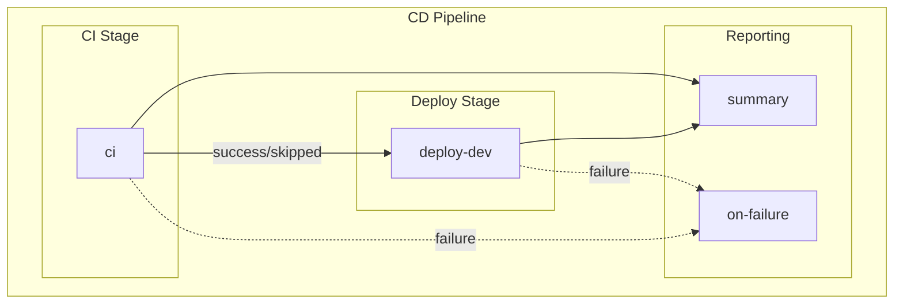

# CD - Azure Deployment Workflow

## 1. Overview & Purpose

### What This Workflow Does

This workflow provisions Azure infrastructure and deploys a .NET application using Azure Developer CLI (`azd`) with OpenID Connect (OIDC) authentication. It implements a complete CI/CD pipeline with:

- **Integrated CI pipeline** via reusable workflow (build, test, analyze, CodeQL)
- **Infrastructure provisioning** using Bicep templates via `azd provision`
- **SQL database configuration** with Managed Identity using `go-sqlcmd`
- **Application deployment** via `azd deploy`
- **Comprehensive reporting** with deployment summaries and rollback instructions

### When to Use

- To deploy application changes to the `dev` environment
- To provision or update Azure infrastructure
- After successful CI validation for production-bound changes

### When NOT to Use

- For CI-only validation (use `ci-dotnet.yml` instead)
- For deployments to non-dev environments (not currently supported)
- When Azure credentials are not configured

---

## 2. Triggers

| Trigger Type | Configuration |
|--------------|---------------|
| **Push** | Branch: `docs987678` (currently configured) |
| **Manual** | `workflow_dispatch` with optional `skip-ci` flag |

### Path Filters (Push Trigger)

Workflow executes only when changes occur in:

- `src/**`
- `app.*/**`
- `infra/**`
- `azure.yaml`
- `.github/workflows/azure-dev.yml`

### Manual Trigger Inputs

| Input | Type | Required | Default | Description |
|-------|------|----------|---------|-------------|
| `skip-ci` | boolean | No | `false` | Skip CI checks (use with caution) |

### Concurrency Control

```yaml
concurrency:
  group: deploy-dev-${{ github.ref }}
  cancel-in-progress: false
```

- Prevents simultaneous deployments to the same environment
- Does not cancel in-progress deployments

---

## 3. Pipeline Flow (Mermaid Diagram)



### Narrative Overview

1. **CI Stage**: Calls the reusable CI workflow for build, test, analysis, and security scanning (can be skipped)
2. **Deploy Stage**: Provisions infrastructure, configures SQL, and deploys the application to `dev` environment
3. **Reporting**: Summary job aggregates results; failure handler provides troubleshooting guidance

### Deployment Phases (within `deploy-dev` job)

| Phase | Name | Description |
|-------|------|-------------|
| 1 | Setup | Checkout, install go-sqlcmd, .NET SDK, azd CLI |
| 2 | Auth | OIDC authentication with Azure (azd + az CLI) |
| 3 | Provision | Infrastructure provisioning via `azd provision` |
| 4a | Re-auth | Token refresh before SQL operations |
| 4b | SQL Config | Create managed identity user in SQL database |
| 5 | Re-auth | Token refresh after SQL operations |
| 6 | Deploy | Application deployment via `azd deploy` |
| 7 | Summary | Generate deployment summary report |

### Interpretation Notes

- **CI Skip Option**: The `skip-ci` input allows bypassing CI for emergency deployments
- **Token Refresh**: OIDC tokens expire after ~5 minutes; multiple re-authentication steps prevent failures
- **Retry Logic**: Provision and deploy operations include exponential backoff retry (3 attempts)
- **SQL SID Handling**: Uses Client ID (not Object ID) for Azure SQL managed identity configuration

---

## 4. Jobs Breakdown

| Job | Responsibility | Key Outputs | Dependencies |
|-----|----------------|-------------|--------------|
| **ci** | Reusable CI workflow execution | Build/test/analysis results | None (can be skipped) |
| **deploy-dev** | Infrastructure provisioning and deployment | `webapp-url`, `resource-group` | CI (success or skipped) |
| **summary** | Aggregates pipeline results | Workflow summary report | CI, deploy-dev |
| **on-failure** | Failure reporting and guidance | Failure report | CI, deploy-dev (on failure) |

### Deploy-Dev Job Details

- **Timeout**: 30 minutes
- **Environment**: `dev` (with URL output)
- **Runner**: `ubuntu-latest`

---

## 5. Inputs & Parameters

### Workflow Dispatch Input

| Input | Type | Required | Default | Description |
|-------|------|----------|---------|-------------|
| `skip-ci` | boolean | No | `false` | Skip CI checks (use with caution) |

### CI Workflow Inputs (Passed to Reusable Workflow)

| Input | Value | Description |
|-------|-------|-------------|
| `configuration` | `Release` | Build configuration |
| `dotnet-version` | `10.0.x` | .NET SDK version |
| `solution-file` | `app.sln` | Solution file path |
| `enable-code-analysis` | `true` | Enable code formatting check |
| `fail-on-format-issues` | `false` | Do not fail on formatting issues |

---

## 6. Secrets & Variables

### Required Repository Variables

| Variable | Required | Description |
|----------|----------|-------------|
| `AZURE_CLIENT_ID` | Yes | Service Principal / App Registration Client ID |
| `AZURE_TENANT_ID` | Yes | Azure AD Tenant ID |
| `AZURE_SUBSCRIPTION_ID` | Yes | Target Azure Subscription ID |

### Optional Repository Variables

| Variable | Default | Description |
|----------|---------|-------------|
| `AZURE_ENV_NAME` | `dev` | Azure environment name |
| `AZURE_LOCATION` | `eastus2` | Azure region |
| `DEPLOYER_PRINCIPAL_TYPE` | `ServicePrincipal` | Deployer principal type |
| `DEPLOY_HEALTH_MODEL` | (none) | Health model deployment flag |

### Environment Variables (Workflow)

| Variable | Purpose |
|----------|---------|
| `DOTNET_VERSION` | .NET SDK version (10.0.x) |
| `DOTNET_SKIP_FIRST_TIME_EXPERIENCE` | Skip .NET welcome |
| `DOTNET_NOLOGO` | Suppress .NET logo |
| `DOTNET_CLI_TELEMETRY_OPTOUT` | Disable telemetry |

---

## 7. Permissions & Security Model

### GitHub Token Permissions

| Permission | Level | Purpose |
|------------|-------|---------|
| `id-token` | write | OIDC authentication with Azure |
| `contents` | read | Read repository contents |
| `checks` | write | Create check runs for test results |
| `pull-requests` | write | Post comments on pull requests |
| `security-events` | write | Upload CodeQL SARIF results |

### Authentication Mechanism

**OIDC Federated Credentials**:

- No long-lived secrets stored in GitHub
- Token exchange via GitHub's OIDC provider
- Azure trusts GitHub identity provider

### Authentication Flow

1. GitHub generates OIDC token
2. `azd auth login --federated-credential-provider github`
3. Azure validates token and issues access token
4. Both `azd` and `az` CLI authenticated

### Security Features

- **No Stored Secrets**: OIDC eliminates need for `AZURE_CREDENTIALS` secret
- **Short-Lived Tokens**: Tokens expire in ~5 minutes (refreshed as needed)
- **Pinned Actions**: All actions use SHA-pinned versions
- **CodeQL Scanning**: Security vulnerabilities detected before deployment

### Least-Privilege Analysis

| Risk | Mitigation |
|------|------------|
| Deployment to production | Environment protection rules (if configured) |
| SQL admin access | Managed Identity with `db_owner` role (scoped to database) |
| Infrastructure changes | `azd provision` governed by Bicep templates |

---

## 8. Environments & Deployment Strategy

### Supported Environments

| Environment | Protection Rules | Approval Required |
|-------------|------------------|-------------------|
| `dev` | Configurable | Optional (depends on GitHub Environment settings) |

### Environment Configuration

```yaml
environment:
  name: dev
  url: ${{ steps.deploy.outputs.webapp-url }}
```

### Promotion Strategy

Currently single-environment (`dev`). To extend:

1. Add new GitHub Environments (e.g., `staging`, `production`)
2. Configure protection rules and approvals
3. Create additional `deploy-*` jobs with appropriate dependencies

---

## 9. Failure Handling & Recovery

### Retry Mechanisms

| Operation | Max Retries | Initial Delay | Backoff |
|-----------|-------------|---------------|---------|
| `azd provision` | 3 | 30s | Exponential (2x) |
| SQL script execution | 3 | 15s | Exponential (2x) |
| `azd deploy` | 3 | 30s | Exponential (2x) |

### Failure Behavior

| Job | Failure Behavior |
|-----|------------------|
| **ci** | Blocks deployment if failed; can be skipped |
| **deploy-dev** | Generates rollback instructions in summary |
| **summary** | Always runs to provide visibility |
| **on-failure** | Provides actionable troubleshooting steps |

### Rollback Instructions

On deployment failure, the workflow provides:

```bash
# Option 1: Re-run with previous commit
gh workflow run azure-dev.yml --ref <previous-commit-sha>

# Option 2: Use Azure Developer CLI locally
git checkout <previous-commit-sha>
azd deploy --no-prompt
```

### Manual Recovery Steps

1. Review deployment logs for specific errors
2. Check Azure portal for resource status
3. Verify OIDC token exchange succeeded
4. Confirm SQL managed identity configuration
5. Re-run workflow or deploy locally using `azd`

---

## 10. How to Run This Workflow

### Automatic Triggers

Push changes to the configured branch (`docs987678`) with matching path filters.

### Manual Execution

1. Navigate to **Actions** → **CD - Azure Deployment**
2. Click **Run workflow**
3. Select branch
4. Optionally check **Skip CI checks** (use with caution)
5. Click **Run workflow**

### Prerequisites

Before first run:

1. Configure federated credentials in Azure Entra ID
2. Create GitHub Environment: `dev`
3. Set repository variables:
   - `AZURE_CLIENT_ID`
   - `AZURE_TENANT_ID`
   - `AZURE_SUBSCRIPTION_ID`

### Common Mistakes to Avoid

- Do not skip CI without understanding the risks
- Do not run concurrent deployments to the same environment
- Ensure federated credentials are configured before first deployment
- Verify `AZURE_ENV_NAME` matches expected environment

---

## 11. Extensibility & Customization

### Safe Extension Points

- Add new environments by duplicating `deploy-dev` job with different environment name
- Customize infrastructure by modifying Bicep templates in `infra/`
- Adjust retry logic by modifying `MAX_RETRIES` and `RETRY_DELAY` values
- Add post-deployment tests or smoke tests after deploy step

### What Should NOT Be Changed

- Do not remove OIDC authentication without providing alternative
- Do not skip SQL managed identity configuration for database-connected apps
- Do not remove token refresh steps (will cause auth failures)
- Do not modify pinned action versions without verification

### Adding New Environments

```yaml
deploy-staging:
  name: 🚀 Deploy Staging
  needs: [deploy-dev]
  environment:
    name: staging
    url: ${{ steps.deploy.outputs.webapp-url }}
  # ... (duplicate deploy-dev configuration)
```

---

## 12. Known Limitations & Gotchas

| Limitation | Impact | Workaround |
|------------|--------|------------|
| Single environment (dev) | No staging/production deployments | Extend workflow with additional jobs |
| OIDC token expiration | Requires multiple re-auth steps | Built-in token refresh (already implemented) |
| go-sqlcmd installation | Adds ~30s to job startup | Pre-installed runner images not available |
| Branch filter (`docs987678`) | Push trigger may not match expected branches | Update branch filter as needed |

### SQL Managed Identity Notes

- Uses **Client ID** (Application ID) for SID calculation, not Object ID
- SID mismatch detection and automatic recreation implemented
- Requires `go-sqlcmd` (not ODBC `sqlcmd`) for Azure AD authentication

### OIDC Token Considerations

- Tokens expire after ~5 minutes
- Long-running operations (provision, SQL config) may exceed token lifetime
- Multiple re-authentication steps prevent token expiration errors

---

## 13. Ownership & Maintenance

### Owning Team

Platform Engineering / DevOps

### Review Expectations

- Security team review for permission or authentication changes
- Infrastructure team review for Bicep template modifications
- PR review for any workflow changes

### Change Management

- Test workflow changes in feature branches
- Validate OIDC configuration changes in non-production first
- Document infrastructure changes in PR descriptions
- Coordinate deployments with application team

---

## 14. Assumptions & Gaps

### Assumptions

- Federated credentials are pre-configured in Azure Entra ID
- GitHub Environment `dev` exists with appropriate protection rules
- Azure infrastructure templates (Bicep) are valid and tested
- SQL Server is configured for Azure AD authentication
- Managed Identity exists and is referenced in infrastructure templates

### Gaps

| Gap | Impact | Recommendation |
|-----|--------|----------------|
| No staging/production environments | Limited deployment pipeline | Extend workflow with multi-environment support |
| No approval gates | No manual validation before deployment | Configure GitHub Environment protection rules |
| No deployment notifications | Team may not be aware of deployments | Integrate Slack/Teams notifications |
| No infrastructure validation | Bicep errors discovered at runtime | Add `azd provision --preview` step |
| No cost estimation | Unknown deployment cost impact | Integrate Azure Cost Management API |
| Branch filter hardcoded | `docs987678` may not match intended branches | Update to `main` or appropriate branch pattern |

### Security Considerations

- OIDC tokens are short-lived but grant deployment permissions
- `db_owner` role on SQL database may be overly permissive
- Consider implementing Azure Defender for SQL for additional monitoring
