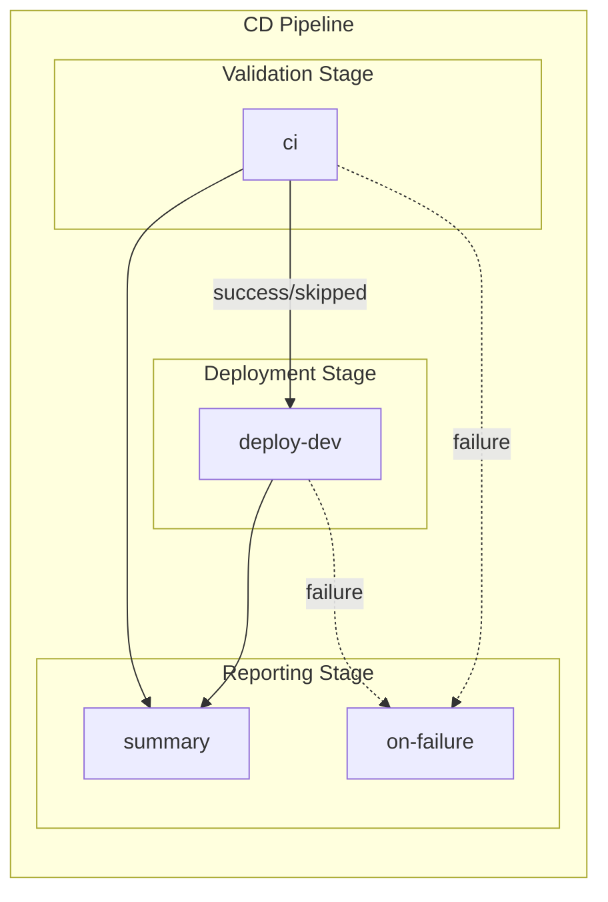

# CD - Azure Deployment Workflow

## 1. Overview & Purpose

### Primary Workflow Purpose

**Environment Deployment Pipeline** - This workflow provisions Azure infrastructure and deploys a .NET application to the `dev` environment using Azure Developer CLI (`azd`) with OIDC authentication.

### In-Scope Responsibilities

- Executing CI validation via reusable workflow (build, test, analyze, CodeQL)
- Provisioning Azure infrastructure using Bicep templates via `azd provision`
- Configuring SQL database managed identity users using `go-sqlcmd`
- Deploying application code via `azd deploy`
- Generating deployment summaries with rollback instructions
- Handling OIDC token refresh for long-running operations

### Out-of-Scope Responsibilities

- Deployment to staging or production environments (single-environment only)
- Database schema migrations (managed identity setup only)
- Infrastructure teardown or deletion
- Multi-region deployment
- Blue/green or canary deployment strategies

---

## 2. Triggers

| Trigger Type | Configuration | Description |
|--------------|---------------|-------------|
| `workflow_dispatch` | Manual | On-demand execution with optional CI skip |
| `push` | Branch: `docs987678` | Automatic on code changes |

### Path Filters (Push Trigger)

The workflow executes only when changes occur in:

| Path Pattern | Description |
|--------------|-------------|
| `src/**` | Application source code |
| `app.*/**` | .NET Aspire host and defaults projects |
| `infra/**` | Bicep infrastructure templates |
| `azure.yaml` | Azure Developer CLI configuration |
| `.github/workflows/azure-dev.yml` | This workflow file |

### Manual Trigger Inputs

| Input | Type | Required | Default | Description |
|-------|------|----------|---------|-------------|
| `skip-ci` | boolean | No | `false` | Skip CI checks (use with caution for emergency deployments) |

### Concurrency Control

```yaml
concurrency:
  group: deploy-dev-${{ github.ref }}
  cancel-in-progress: false
```

- Prevents simultaneous deployments to the same environment
- Does **not** cancel in-progress deployments (safe for long-running operations)

---

## 3. Pipeline Flow



### Narrative Overview

1. **Validation Stage**: Executes the reusable CI workflow for build, test, code analysis, and CodeQL security scanning. Can be skipped via manual trigger input.

2. **Deployment Stage**: Single `deploy-dev` job performs multi-phase deployment:
   - Setup (prerequisites, SDKs, CLI tools)
   - OIDC authentication with Azure
   - Infrastructure provisioning via `azd provision`
   - SQL managed identity configuration
   - Application deployment via `azd deploy`

3. **Reporting Stage**: `summary` job aggregates results regardless of outcome; `on-failure` job provides troubleshooting guidance when failures occur.

### Interpretation Notes

- **CI is Optional**: The `skip-ci` input allows bypassing validation for emergency deployments
- **Token Refresh**: Multiple re-authentication steps occur because OIDC tokens expire after ~5 minutes
- **Sequential Deployment**: Infrastructure must be provisioned before SQL configuration, which must complete before application deployment
- **Failure Isolation**: Deployment failures do not affect summary generation

---

## 4. Jobs Breakdown

| Job | Runner | Timeout | Responsibility | Dependencies |
|-----|--------|---------|----------------|--------------|
| `ci` | (reusable) | (inherited) | Cross-platform build, test, analysis, CodeQL | None |
| `deploy-dev` | `ubuntu-latest` | 30 min | Infrastructure provisioning and application deployment | `ci` (success or skipped) |
| `summary` | `ubuntu-latest` | 5 min | Aggregate pipeline results into summary report | `ci`, `deploy-dev` |
| `on-failure` | `ubuntu-latest` | 5 min | Generate failure report with troubleshooting steps | `ci`, `deploy-dev` |

### Deploy-Dev Job Phases

| Phase | Name | Description |
|-------|------|-------------|
| 1 | Setup | Checkout, install `go-sqlcmd`, .NET SDK, `azd` CLI |
| 2 | Auth | OIDC authentication with Azure (`azd` + `az` CLI) |
| 3 | Provision | Infrastructure provisioning via `azd provision` |
| 4a | Re-auth | Token refresh before SQL operations |
| 4b | SQL Config | Create managed identity user in SQL database |
| 5 | Re-auth | Token refresh after SQL operations |
| 6 | Deploy | Application deployment via `azd deploy` |
| 7 | Summary | Generate deployment summary |

---

## 5. Inputs & Parameters

### Workflow Dispatch Input

| Input | Type | Required | Default | Description |
|-------|------|----------|---------|-------------|
| `skip-ci` | boolean | No | `false` | Skip CI checks (emergency deployments only) |

### CI Workflow Inputs (Passed to Reusable Workflow)

| Input | Value | Description |
|-------|-------|-------------|
| `configuration` | `Release` | Build configuration |
| `dotnet-version` | `10.0.x` | .NET SDK version |
| `solution-file` | `app.sln` | Solution file path |
| `enable-code-analysis` | `true` | Enable code formatting check |
| `fail-on-format-issues` | `false` | Do not fail on formatting issues |

---

## 6. Secrets & Variables

### Required Repository Variables

| Variable | Required | Description |
|----------|----------|-------------|
| `AZURE_CLIENT_ID` | Yes | Service Principal / App Registration Client ID |
| `AZURE_TENANT_ID` | Yes | Azure Entra ID Tenant ID |
| `AZURE_SUBSCRIPTION_ID` | Yes | Target Azure Subscription ID |

### Optional Repository Variables

| Variable | Default | Description |
|----------|---------|-------------|
| `AZURE_ENV_NAME` | `dev` | Azure Developer CLI environment name |
| `AZURE_LOCATION` | `eastus2` | Azure region for deployment |
| `DEPLOYER_PRINCIPAL_TYPE` | `ServicePrincipal` | Deployer principal type |
| `DEPLOY_HEALTH_MODEL` | (none) | Health model deployment flag |

### Environment Variables (Workflow-Level)

| Variable | Value | Purpose |
|----------|-------|---------|
| `DOTNET_VERSION` | `10.0.x` | .NET SDK version |
| `DOTNET_SKIP_FIRST_TIME_EXPERIENCE` | `true` | Skip .NET welcome experience |
| `DOTNET_NOLOGO` | `true` | Suppress .NET logo output |
| `DOTNET_CLI_TELEMETRY_OPTOUT` | `true` | Disable .NET CLI telemetry |

---

## 7. Permissions & Security Model

### GitHub Token Permissions

| Permission | Level | Purpose |
|------------|-------|---------|
| `id-token` | write | OIDC authentication with Azure |
| `contents` | read | Read repository contents for checkout |
| `checks` | write | Create check runs for test results |
| `pull-requests` | write | Post comments on pull requests |
| `security-events` | write | Upload CodeQL SARIF results |

### Authentication Mechanism

**OIDC Federated Credentials** (no stored secrets):

1. GitHub generates OIDC token for the workflow run
2. `azd auth login --federated-credential-provider github` exchanges token
3. Azure validates token via configured federated credential
4. Short-lived access token issued for Azure operations

### Security Features

| Feature | Implementation |
|---------|----------------|
| No stored secrets | OIDC eliminates `AZURE_CREDENTIALS` secret |
| Short-lived tokens | Tokens expire in ~5 minutes (refreshed as needed) |
| Pinned actions | All actions use SHA-pinned versions |
| CodeQL scanning | Security vulnerabilities detected before deployment |
| Least privilege | Minimal permissions requested |

### Risk Analysis

| Risk | Mitigation |
|------|------------|
| Deployment to wrong environment | Environment protection rules (configurable) |
| SQL admin access | Managed Identity with `db_owner` role (database-scoped) |
| Infrastructure drift | `azd provision` governed by Bicep templates |
| Token expiration | Multiple re-authentication steps throughout workflow |

---

## 8. Environments & Deployment Strategy

### Supported Environments

| Environment | Protection Rules | Approval Required |
|-------------|------------------|-------------------|
| `dev` | Configurable via GitHub | Optional |

### Environment Configuration

```yaml
environment:
  name: dev
  url: ${{ steps.deploy.outputs.webapp-url }}
```

### Current Limitations

- Single environment (`dev`) only
- No staging or production environments defined
- No environment promotion workflow

---

## 9. Failure Handling & Recovery

### Retry Mechanisms

| Operation | Max Retries | Initial Delay | Backoff Strategy |
|-----------|-------------|---------------|------------------|
| `azd provision` | 3 | 30 seconds | Exponential (2x) |
| SQL script execution | 3 | 15 seconds | Exponential (2x) |
| `azd deploy` | 3 | 30 seconds | Exponential (2x) |

### Failure Behavior

| Job | On Failure |
|-----|------------|
| `ci` | Blocks deployment; can be skipped via input |
| `deploy-dev` | Generates rollback instructions in summary |
| `summary` | Always runs (`if: always()`) |
| `on-failure` | Provides troubleshooting guidance |

### Rollback Instructions

On deployment failure, the workflow provides:

```bash
# Option 1: Re-run with previous commit
gh workflow run azure-dev.yml --ref <previous-commit-sha>

# Option 2: Use Azure Developer CLI locally
git checkout <previous-commit-sha>
azd deploy --no-prompt
```

---

## 10. How to Run This Workflow

### Automatic Triggers

Push changes to `docs987678` branch with files matching path filters.

### Manual Execution

1. Navigate to **Actions** > **CD - Azure Deployment**
2. Click **Run workflow**
3. Select branch
4. Optionally check **Skip CI checks** (emergency only)
5. Click **Run workflow**

### Prerequisites (First-Time Setup)

1. Configure federated credentials in Azure Entra ID
2. Create GitHub Environment: `dev`
3. Set repository variables: `AZURE_CLIENT_ID`, `AZURE_TENANT_ID`, `AZURE_SUBSCRIPTION_ID`

### Common Mistakes to Avoid

| Mistake | Consequence | Prevention |
|---------|-------------|------------|
| Skipping CI without justification | Untested code deployed | Use `skip-ci` only for emergencies |
| Concurrent deployments | Resource conflicts | Concurrency group prevents this |
| Missing federated credentials | Authentication failure | Verify Azure configuration first |
| Incorrect `AZURE_ENV_NAME` | Wrong environment targeted | Verify variable before deployment |

---

## 11. Extensibility & Customization

### Safe Extension Points

| Extension | How to Customize |
|-----------|------------------|
| Add environments | Duplicate `deploy-dev` job with different environment name |
| Customize infrastructure | Modify Bicep templates in `infra/` |
| Adjust retry logic | Modify `MAX_RETRIES` and `RETRY_DELAY` values |
| Add smoke tests | Insert test step after deployment |

### What Should NOT Be Changed

| Item | Reason |
|------|--------|
| OIDC authentication | Security requirement; no alternative without secrets |
| SQL managed identity setup | Required for database connectivity |
| Token refresh steps | Prevents authentication failures |
| Pinned action versions | Supply chain security |

---

## 12. Known Limitations & Gotchas

| Limitation | Impact | Workaround |
|------------|--------|------------|
| Single environment | No staging/production | Extend workflow with additional jobs |
| OIDC token expiration | Requires multiple re-auth | Already implemented |
| `go-sqlcmd` installation | Adds ~30s to job startup | No pre-installed alternative |
| Branch filter (`docs987678`) | May not match expected branches | Update filter as needed |

### SQL Managed Identity Notes

- Uses **Client ID** (Application ID) for SID calculation, not Object ID
- SID mismatch detection and automatic recreation implemented
- Requires `go-sqlcmd` (not ODBC `sqlcmd`) for Azure AD authentication

---

## 13. Ownership & Maintenance

### Owning Team

Platform Engineering / DevOps

### Review Expectations

| Change Type | Required Review |
|-------------|-----------------|
| Permission changes | Security team |
| Authentication changes | Security team |
| Infrastructure modifications | Infrastructure team |
| Workflow modifications | PR approval |

### Change Management

- Test workflow changes in feature branches
- Validate OIDC configuration changes in non-production first
- Document infrastructure changes in PR descriptions

---

## 14. Assumptions & Gaps

### Assumptions

| Assumption | Validation |
|------------|------------|
| Federated credentials pre-configured | Authentication fails if missing |
| GitHub Environment `dev` exists | Job fails if missing |
| Bicep templates are valid | Provisioning fails if invalid |
| SQL Server allows Azure AD auth | SQL configuration fails if disabled |
| Managed Identity exists | Referenced from Bicep outputs |

### Identified Gaps

| Gap | Impact | Recommendation |
|-----|--------|----------------|
| No staging/production environments | Limited pipeline | Add environment jobs |
| No approval gates | No manual validation | Configure Environment protection |
| No deployment notifications | Reduced visibility | Add Slack/Teams integration |
| No infrastructure validation | Runtime errors | Add `azd provision --preview` step |
| Branch filter hardcoded | Unexpected behavior | Update to `main` or pattern |
