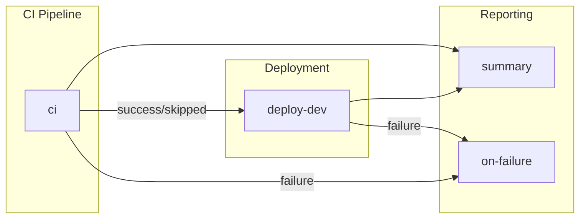

# CD - Azure Deployment Workflow

> **Workflow file:** [`.github/workflows/azure-dev.yml`](../../.github/workflows/azure-dev.yml)

---

## 1. Overview & Purpose

### What This Workflow Does

This workflow implements a complete Continuous Delivery (CD) pipeline that provisions Azure infrastructure and deploys a .NET application using **Azure Developer CLI (azd)** with **OpenID Connect (OIDC) federated credentials**. The pipeline integrates CI validation, infrastructure provisioning, SQL database configuration with Managed Identity, and application deployment.

### When to Use

- Deploying the application to the `dev` environment
- Provisioning or updating Azure infrastructure via Bicep templates
- Configuring SQL database access for Managed Identity authentication
- Triggering deployments after code changes to `src/`, `app.*/`, `infra/`, or `azure.yaml`

### When NOT to Use

- For production deployments (this targets `dev` environment only)
- For running CI checks without deployment (use `ci-dotnet.yml` instead)
- When infrastructure changes require manual review before provisioning
- For hotfixes that need expedited deployment without full CI validation

---

## 2. Triggers

### Automatic Triggers

| Event | Branch Filter | Path Filters |
|-------|---------------|--------------|
| `push` | `docs987678` | `src/**`, `app.*/**`, `infra/**`, `azure.yaml`, `.github/workflows/azure-dev.yml` |

### Manual Triggers

| Input | Type | Required | Default | Description |
|-------|------|----------|---------|-------------|
| `skip-ci` | boolean | No | `false` | Skip CI checks (use with caution for emergency deployments) |

### Concurrency Control

- **Group:** `deploy-dev-${{ github.ref }}`
- **Cancel in Progress:** `false` (deployments run to completion, no cancellation on new pushes)

---

## 3. High-Level Workflow Flow

### Narrative Overview

The workflow executes in a sequential pipeline with conditional failure handling:

1. **CI Pipeline** (optional, skippable): Calls the reusable CI workflow to perform cross-platform builds, tests, code analysis, and CodeQL security scanning
2. **Deploy Dev**: Executes after CI succeeds or is skipped; provisions Azure infrastructure, configures SQL Managed Identity, and deploys the application
3. **Summary**: Aggregates results from all jobs into a comprehensive status report
4. **On-Failure**: Provides failure diagnostics and recovery guidance when any job fails

The CI job can be bypassed via manual dispatch (`skip-ci=true`) for emergency scenarios, though this is discouraged for routine deployments.

### Mermaid Diagram



### Interpretation Notes

- **Sequential execution**: CI must complete (success or skip) before deployment begins
- **Failure isolation**: The `on-failure` job runs only when `ci` or `deploy-dev` fails
- **Always-run summary**: The `summary` job executes regardless of previous job outcomes
- **No parallel deployment**: Concurrency control prevents simultaneous deployments to the same environment

---

## 4. Jobs Breakdown

### Job: `ci`

| Property | Value |
|----------|-------|
| **Name** | CI |
| **Type** | Reusable workflow call |
| **Responsibility** | Build, test, analyze, and security scan the codebase |
| **Condition** | `${{ github.event.inputs.skip-ci != 'true' }}` |
| **Outputs** | Build version, job results (build, test, analyze, codeql) |

### Job: `deploy-dev`

| Property | Value |
|----------|-------|
| **Name** | Deploy Dev |
| **Runner** | `ubuntu-latest` |
| **Timeout** | 30 minutes |
| **Responsibility** | Provision infrastructure, configure SQL, deploy application |
| **Condition** | Runs when CI succeeds or is skipped |
| **Environment** | `dev` |
| **Outputs** | `webapp-url`, `resource-group` |

**Deployment Phases:**

| Phase | Description |
|-------|-------------|
| 1. Setup | Checkout, install go-sqlcmd, .NET SDK, Azure Developer CLI |
| 2. Auth | OIDC authentication with Azure (azd + az CLI) |
| 3. Provision | Infrastructure provisioning via `azd provision` |
| 4a. Re-auth | Token refresh before SQL operations |
| 4b. SQL Config | Create Managed Identity user in SQL database |
| 5. Re-auth | Token refresh after SQL operations |
| 6. Deploy | Application deployment via `azd deploy` |
| 7. Summary | Generate deployment summary report |

### Job: `summary`

| Property | Value |
|----------|-------|
| **Name** | Summary |
| **Runner** | `ubuntu-latest` |
| **Timeout** | 5 minutes |
| **Responsibility** | Generate comprehensive workflow status report |
| **Condition** | `always()` |
| **Dependencies** | `ci`, `deploy-dev` |

### Job: `on-failure`

| Property | Value |
|----------|-------|
| **Name** | Handle Failure |
| **Runner** | `ubuntu-latest` |
| **Timeout** | 5 minutes |
| **Responsibility** | Report failures with diagnostic information |
| **Condition** | `failure()` |
| **Dependencies** | `ci`, `deploy-dev` |

---

## 5. Inputs & Parameters

### Manual Dispatch Inputs

| Input | Type | Required | Default | Description |
|-------|------|----------|---------|-------------|
| `skip-ci` | boolean | No | `false` | Skip CI checks. Use with extreme caution for emergency deployments only. |

### CI Workflow Parameters (Passed to Reusable Workflow)

| Parameter | Value |
|-----------|-------|
| `configuration` | `Release` |
| `dotnet-version` | `10.0.x` |
| `solution-file` | `app.sln` |
| `enable-code-analysis` | `true` |
| `fail-on-format-issues` | `false` |

---

## 6. Secrets & Variables

### Required Repository Variables

| Variable | Scope | Purpose |
|----------|-------|---------|
| `AZURE_CLIENT_ID` | Repository | Service Principal/App Registration Client ID for OIDC |
| `AZURE_TENANT_ID` | Repository | Azure AD Tenant ID |
| `AZURE_SUBSCRIPTION_ID` | Repository | Target Azure Subscription ID |

### Optional Repository Variables

| Variable | Default | Purpose |
|----------|---------|---------|
| `AZURE_ENV_NAME` | `dev` | Azure Developer CLI environment name |
| `AZURE_LOCATION` | `eastus2` | Azure region for resource deployment |
| `DEPLOYER_PRINCIPAL_TYPE` | `ServicePrincipal` | Type of deploying principal |
| `DEPLOY_HEALTH_MODEL` | (none) | Health model deployment flag |

### Secrets

| Secret | Scope | Purpose |
|--------|-------|---------|
| (inherited) | Repository | All secrets inherited via `secrets: inherit` to CI workflow |

---

## 7. Permissions & Security Model

### GitHub Actions Permissions

| Permission | Level | Purpose |
|------------|-------|---------|
| `id-token` | `write` | Required for OIDC token generation to authenticate with Azure |
| `contents` | `read` | Read repository contents for checkout |
| `checks` | `write` | Create check runs for test results |
| `pull-requests` | `write` | Post comments on pull requests |
| `security-events` | `write` | Upload CodeQL SARIF results to Security tab |

### Authentication Approach

- **Method:** OIDC Federated Credentials (no stored secrets)
- **Token Lifetime:** ~5 minutes (requires refresh before long operations)
- **Re-authentication Points:**
  - Before SQL operations (Phase 4a)
  - After SQL operations (Phase 5)

### Security Considerations

- **No long-lived secrets:** Uses OIDC federated credentials exclusively
- **Token refresh:** Explicitly refreshes tokens before sensitive SQL operations to avoid expiration
- **CodeQL scanning:** Security vulnerability scanning enabled on every CI run
- **Pinned action versions:** All actions use SHA-pinned versions for supply chain security
- **Least-privilege:** Minimal permissions requested at workflow level

---

## 8. Environments & Deployment Strategy

### Supported Environments

| Environment | Protection Rules | Purpose |
|-------------|------------------|---------|
| `dev` | Configurable via GitHub Environment settings | Development/testing environment |

### Deployment Flow

```
Push to branch → CI Pipeline → Deploy Dev → Summary
                     ↓
              (on failure) → Failure Handler
```

### Environment Configuration

The `deploy-dev` job uses the GitHub Environment `dev`, which enables:

- Environment-specific secrets and variables
- Deployment protection rules (reviewers, wait timers)
- Deployment history tracking

---

## 9. Failure Handling & Recovery

### Automatic Retry Behavior

| Operation | Max Retries | Initial Delay | Backoff |
|-----------|-------------|---------------|---------|
| Infrastructure Provisioning | 3 | 30 seconds | Exponential (2x) |
| SQL User Creation | 3 | 15 seconds | Exponential (2x) |
| Application Deployment | 3 | 30 seconds | Exponential (2x) |

### On Failure

- The `on-failure` job generates a failure report with job statuses
- Deployment summary includes rollback instructions when deployment fails
- GitHub Actions error annotations highlight failure points

### Rollback Instructions

When deployment fails, the summary includes:

```bash
# Option 1: Re-run with previous commit
gh workflow run azure-dev.yml --ref <previous-commit-sha>

# Option 2: Use Azure Developer CLI locally
git checkout <previous-commit-sha>
azd deploy --no-prompt
```

---

## 10. How to Run This Workflow

### Automatic Execution

The workflow runs automatically on:

- Push to `docs987678` branch with changes to monitored paths

### Manual Execution

1. Navigate to **Actions** tab in the repository
2. Select **CD - Azure Deployment** workflow
3. Click **Run workflow**
4. Optionally check **Skip CI checks** (not recommended)
5. Click **Run workflow** button

### Common Operator Mistakes to Avoid

| Mistake | Impact | Prevention |
|---------|--------|------------|
| Skipping CI for routine deployments | Deploys untested code | Only use `skip-ci` for emergencies |
| Running without federated credentials configured | Authentication failure | Verify OIDC setup in Azure AD before first run |
| Missing repository variables | Workflow fails immediately | Ensure all required variables are set |
| Concurrent manual runs | Potential resource conflicts | Wait for running deployments to complete |

---

## 11. Extensibility & Customization

### Safe Extension Points

| Extension Point | How to Customize |
|-----------------|------------------|
| Add post-deployment validation | Add steps after deployment in `deploy-dev` job |
| Add notification integration | Add steps in `summary` or `on-failure` jobs |
| Add additional environments | Duplicate `deploy-dev` job with new environment name |
| Modify retry behavior | Adjust `MAX_RETRIES` and `RETRY_DELAY` variables |

### What Should NOT Be Changed

| Element | Reason |
|---------|--------|
| OIDC authentication flow | Breaking change affects all deployments |
| SQL SID calculation method | Uses Client ID (not Object ID) per Azure SQL requirements |
| Token refresh sequence | Required to prevent AADSTS700024 token expiration errors |
| go-sqlcmd installation | Required for Azure AD authentication in SQL operations |

### Adding New Environments

To add a staging environment:

1. Create GitHub Environment named `staging`
2. Configure environment-specific variables
3. Duplicate `deploy-dev` job as `deploy-staging`
4. Update job dependencies and conditions

---

## 12. Known Limitations & Gotchas

### Limitations

| Limitation | Details |
|------------|---------|
| Single environment | Only deploys to `dev`; no staging/production environments configured |
| Branch filter | Currently targets `docs987678` branch (likely placeholder) |
| Linux-only deployment | Uses `ubuntu-latest` runner; Windows deployment requires modifications |
| OIDC token lifetime | 5-minute token lifetime requires explicit refresh points |

### Gotchas

| Issue | Workaround |
|-------|------------|
| ODBC sqlcmd conflicts | Workflow explicitly removes ODBC sqlcmd to ensure go-sqlcmd is used |
| SQL SID mismatch | Workflow uses Client ID (not Object ID) to create SID; mismatched users are recreated |
| Token expiration during SQL | Multiple re-authentication steps prevent AADSTS700024 errors |
| go-sqlcmd API rate limits | Retry logic handles GitHub API failures when fetching latest version |

---

## 13. Ownership & Maintenance

### Ownership

| Role | Responsibility |
|------|----------------|
| DevOps Team | Workflow maintenance and updates |
| Platform Team | Azure infrastructure and OIDC configuration |
| Development Team | Application code and CI requirements |

### Review Expectations

| Change Type | Review Requirements |
|-------------|---------------------|
| Workflow modifications | DevOps team review required |
| Infrastructure changes (`infra/`) | Platform team review recommended |
| Security-related changes | Security team review required |

### Change Management

- All workflow changes should go through pull request review
- Test changes in feature branches before merging to main
- Document significant changes in commit messages
- Update this documentation when workflow behavior changes

---

## 14. Assumptions & Gaps

### Assumptions

| Assumption | Impact if Invalid |
|------------|-------------------|
| Federated credentials are configured in Azure AD | Authentication will fail |
| GitHub Environment `dev` exists with required variables | Workflow will fail |
| go-sqlcmd supports `--authentication-method ActiveDirectoryAzCli` | SQL operations will fail |
| Azure resources are provisioned via Bicep templates in `infra/` | Infrastructure provisioning may fail |
| SQL Server has Azure AD authentication enabled | SQL user creation will fail |

### Gaps

| Gap | Recommendation |
|-----|----------------|
| No staging/production environments | Add environment promotion workflow |
| No blue/green deployment | Consider implementing deployment slots |
| No automated rollback | Implement automatic rollback on health check failure |
| No deployment approval gates | Configure GitHub Environment protection rules |
| Branch filter appears to be placeholder | Update to target appropriate branches (e.g., `main`) |

---

## Related Documentation

- [Azure Developer CLI Documentation](https://learn.microsoft.com/en-us/azure/developer/azure-developer-cli/)
- [GitHub OIDC with Azure](https://learn.microsoft.com/en-us/azure/developer/github/connect-from-azure)
- [go-sqlcmd Documentation](https://github.com/microsoft/go-sqlcmd)
- [CI - .NET Build and Test Workflow](./github-actions-ci-dotnet.md)
- [CI - .NET Reusable Workflow](./github-actions-ci-dotnet-reusable.md)
