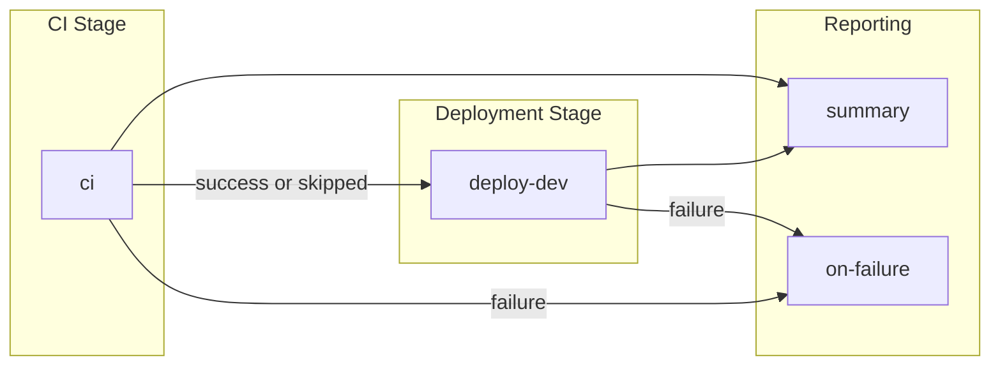

# CD - Azure Deployment Workflow

## 1. Overview & Purpose

### What This Workflow Does

This workflow provisions Azure infrastructure and deploys a .NET application using Azure Developer CLI (azd) with OpenID Connect (OIDC) authentication. It implements a CI/CD pipeline with:

- Integrated CI validation via reusable workflow
- Infrastructure provisioning using Bicep templates
- SQL database Managed Identity configuration
- Application deployment to Azure

### When to Use

- Deploying application changes to the `dev` environment
- Provisioning or updating Azure infrastructure
- After code changes to application source, infrastructure, or configuration

### When NOT to Use

- For production deployments (targets `dev` only)
- For CI-only validation without deployment (use `ci-dotnet.yml`)
- When infrastructure changes require manual approval before provisioning

---

## 2. Triggers

| Trigger | Configuration | Description |
|---------|---------------|-------------|
| `workflow_dispatch` | Manual | Optional `skip-ci` boolean input (default: `false`) |
| `push` | Branch: `docs987678` | Automatic on push to specified branch |
| `push` | Paths: `src/**`, `app.*/**`, `infra/**`, `azure.yaml`, `.github/workflows/azure-dev.yml` | Filtered to relevant changes |

### Concurrency

```yaml
group: deploy-dev-${{ github.ref }}
cancel-in-progress: false
```

Prevents simultaneous deployments; does not cancel in-progress runs.

---

## 3. Pipeline Flow (Mermaid Diagram)



### Interpretation Notes

- **Sequential Flow**: `deploy-dev` waits for `ci` to complete (success or skipped)
- **Conditional Deployment**: `deploy-dev` runs only if CI succeeds or is skipped
- **Always-Run Summary**: `summary` executes regardless of prior outcomes
- **Failure Handler**: `on-failure` runs only when `ci` or `deploy-dev` fails

---

## 4. Jobs Breakdown

### Job: `ci`

| Property | Value |
|----------|-------|
| **Name** | `🔄 CI` |
| **Type** | Reusable workflow call |
| **Called Workflow** | `./.github/workflows/ci-dotnet-reusable.yml` |
| **Condition** | `${{ github.event.inputs.skip-ci != 'true' }}` |
| **Responsibility** | Build, test, analyze, and security scan |

### Job: `deploy-dev`

| Property | Value |
|----------|-------|
| **Name** | `🚀 Deploy Dev` |
| **Runner** | `ubuntu-latest` |
| **Timeout** | 30 minutes |
| **Needs** | `ci` |
| **Condition** | `always() && (needs.ci.result == 'success' \|\| needs.ci.result == 'skipped')` |
| **Environment** | `dev` |
| **Outputs** | `webapp-url`, `resource-group` |

### Job: `summary`

| Property | Value |
|----------|-------|
| **Name** | `📊 Summary` |
| **Runner** | `ubuntu-latest` |
| **Timeout** | 5 minutes |
| **Needs** | `ci`, `deploy-dev` |
| **Condition** | `always()` |

### Job: `on-failure`

| Property | Value |
|----------|-------|
| **Name** | `❌ Handle Failure` |
| **Runner** | `ubuntu-latest` |
| **Timeout** | 5 minutes |
| **Needs** | `ci`, `deploy-dev` |
| **Condition** | `failure()` |

---

## 5. Inputs & Parameters

### Workflow Dispatch Inputs

| Input | Type | Required | Default | Description |
|-------|------|----------|---------|-------------|
| `skip-ci` | boolean | No | `false` | Skip CI checks (use with caution) |

### Parameters Passed to CI Workflow

| Parameter | Value |
|-----------|-------|
| `configuration` | `Release` |
| `dotnet-version` | `10.0.x` |
| `solution-file` | `app.sln` |
| `enable-code-analysis` | `true` |
| `fail-on-format-issues` | `false` |

---

## 6. Secrets & Variables

### Required Repository Variables

| Variable | Purpose |
|----------|---------|
| `AZURE_CLIENT_ID` | Service Principal/App Registration Client ID |
| `AZURE_TENANT_ID` | Azure AD Tenant ID |
| `AZURE_SUBSCRIPTION_ID` | Target Azure Subscription |

### Optional Repository Variables

| Variable | Default | Purpose |
|----------|---------|---------|
| `AZURE_ENV_NAME` | `dev` | Azure Developer CLI environment name |
| `AZURE_LOCATION` | `eastus2` | Azure region |
| `DEPLOYER_PRINCIPAL_TYPE` | `ServicePrincipal` | Deployer principal type |
| `DEPLOY_HEALTH_MODEL` | (none) | Health model flag |

### Secrets

Secrets are inherited via `secrets: inherit` to the reusable CI workflow.

---

## 7. Permissions & Security Model

### Workflow Permissions

| Permission | Level | Purpose |
|------------|-------|---------|
| `id-token` | write | OIDC authentication with Azure |
| `contents` | read | Repository checkout |
| `checks` | write | Test result check runs |
| `pull-requests` | write | PR comments |
| `security-events` | write | CodeQL SARIF upload |

### Authentication

- **Method**: OIDC federated credentials (no stored secrets)
- **Tools**: Azure Developer CLI (`azd auth login`) and Azure CLI (`azure/login` action)
- **Token Refresh**: Multiple re-authentication steps before/after long operations

### Security Practices Observed

| Practice | Status |
|----------|--------|
| OIDC authentication | ✅ |
| SHA-pinned action versions | ✅ |
| Least-privilege permissions | ✅ |
| CodeQL security scanning | ✅ (via CI) |

---

## 8. Environments & Deployment Strategy

### Environments

| Environment | Configuration |
|-------------|---------------|
| `dev` | GitHub Environment with optional protection rules |

### Deployment Phases (in `deploy-dev`)

| Phase | Description |
|-------|-------------|
| 1. Setup | Checkout, install go-sqlcmd, .NET SDK, azd CLI |
| 2. Auth | OIDC authentication (azd + az CLI) |
| 3. Provision | `azd provision` executes Bicep templates |
| 4a. Re-auth | Token refresh before SQL |
| 4b. SQL Config | Create Managed Identity user via go-sqlcmd |
| 5. Re-auth | Token refresh after SQL |
| 6. Deploy | `azd deploy` deploys application |
| 7. Summary | Generate deployment report |

---

## 9. Failure Handling & Recovery

### Retry Logic

| Operation | Max Retries | Initial Delay | Backoff |
|-----------|-------------|---------------|---------|
| Provisioning | 3 | 30s | Exponential (×2) |
| SQL Execution | 3 | 15s | Exponential (×2) |
| Deployment | 3 | 30s | Exponential (×2) |

### On Failure

- `on-failure` job reports job statuses
- Deployment summary includes rollback instructions
- GitHub annotations highlight failure points

---

## 10. How to Run This Workflow

### Automatic

Triggers on push to `docs987678` branch with changes to monitored paths.

### Manual

1. Navigate to **Actions** → **CD - Azure Deployment**
2. Click **Run workflow**
3. Optionally enable **Skip CI checks**
4. Click **Run workflow**

### Operator Guidance

| Avoid | Consequence |
|-------|-------------|
| Skipping CI routinely | Deploys untested code |
| Missing repository variables | Authentication failure |
| Concurrent manual runs | Resource conflicts |

---

## 11. Extensibility & Customization

### Safe Extension Points

| Extension | Location |
|-----------|----------|
| Post-deployment validation | After `Deploy Application` step |
| Notifications | `summary` or `on-failure` jobs |
| Additional environments | Duplicate `deploy-dev` with new environment |

### Do Not Modify

| Element | Reason |
|---------|--------|
| OIDC authentication steps | Critical for Azure access |
| Token refresh steps | Prevents token expiration |
| go-sqlcmd installation | Required for Azure AD SQL auth |

---

## 12. Known Limitations & Gotchas

### Limitations

| Limitation | Detail |
|------------|--------|
| Single environment | Only `dev` configured |
| Branch filter | Targets `docs987678` (appears non-standard) |
| Linux-only deployment | Uses `ubuntu-latest` |

### Gotchas

| Issue | Detail |
|-------|--------|
| ODBC sqlcmd conflict | Workflow removes ODBC sqlcmd to ensure go-sqlcmd is used |
| SQL SID calculation | Must use Client ID, not Object ID |
| Token expiration | OIDC tokens expire in ~5 minutes; multiple re-auth steps mitigate this |

---

## 13. Ownership & Maintenance

| Role | Responsibility |
|------|----------------|
| DevOps Team | Workflow maintenance |
| Platform Team | Azure infrastructure, OIDC configuration |
| Development Team | Application code |

---

## 14. Assumptions & Gaps

### Assumptions

| Assumption | Source |
|------------|--------|
| Federated credentials configured in Azure Entra ID | OIDC login usage |
| GitHub Environment `dev` exists | `environment: dev` in job |
| Repository variables are configured | Variable references |
| `azure.yaml` is properly configured | `azd provision`/`azd deploy` usage |

### Gaps

| Gap | Recommendation |
|-----|----------------|
| No staging/production environments | Extend workflow |
| No automated rollback | Add health-check based rollback |
| Branch filter `docs987678` unusual | Verify intended configuration |
| No deployment approval gates visible | Configure environment protection rules |
